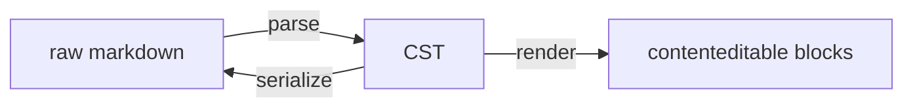

# Contributing to aragonite

So you want to work on this thing. Thank you, and sorry in advance [^1].

This page is the on-ramp: you cloned the repo today and you'd like one change to land. It says what you need in the order you'll need it, and it links down to the deeper pages instead of repeating them. The order:

1. [Setup](#setup): node, three commands, and the browser download you shouldn't skip.
2. [The shape of the thing](#the-shape-of-the-thing): the parse, render, serialize loop, the components, and which directory holds what.
3. [Commands](#commands): the scripts you'll type.
4. [Making a change](#making-a-change): the rules to read first, and how a bug fix lands here.
5. [The gates](#the-gates): what a change has to pass, and how much of it to run when.
6. [Commit messages](#commit-messages): the shape, and the hook that enforces it.
7. [Opening a pull request](#opening-a-pull-request): which branch, what CI runs, what review asks for.
8. [Filing an issue](#filing-an-issue): defects, proposals, tasks, and friction that isn't a defect.
9. [License](#license): short.

And the pages under this one, for when you want them:

- [`docs/contributing/rules.md`](docs/contributing/rules.md): the five rules that will eat somebody's file if you get them wrong.
- [`docs/contributing/codebase-map.md`](docs/contributing/codebase-map.md): from the behavior you watched break to the one file to open.
- [`docs/contributing/testing.md`](docs/contributing/testing.md): the two test layers, and how to write into them.
- [`docs/contributing/code-style.md`](docs/contributing/code-style.md): naming, comments, the usual.
- [`docs/design/editor.md`](docs/design/editor.md): the system spec, for when you're changing the editor's insides.
- [`docs/README.md`](docs/README.md): the map of everything else, the consumer and plugin guides included.

## Setup

Node 24 (there's an `.nvmrc`), then:

```
npm install
npx playwright install chromium
npm run dev
```

(on Linux it's `npx playwright install --with-deps chromium`, so the system libraries come along)

Don't skip the second line. The e2e suite and the perf gate both drive Chromium, so without it your first `npm test` dies somewhere inside Playwright, and you'll spend twenty minutes suspecting your own code [^2].

`npm run dev` prints this and sits there:

```
> @voithos-labs/aragonite@0.10.0 dev
> vite dev

  VITE v8.2.2  ready in 2035 ms

  ➜  Local:   http://localhost:1420/
  ➜  Network: use --host to expose
```

Two routes matter. `/` is the showcase: the editor with the bundled plugins installed, roughly what a consumer sees. `/test/editor` is the dev harness: bare, wired with the probes the e2e specs talk to, and where most editor work actually happens.

## The shape of the thing

The editor keeps one tree, the CST (the parsed form of your markdown, where every node holds its own slice of the original text, markers included). Markdown parses into it, the blocks on screen render from it, and saving concatenates it back out. The promise (and the test at the root of `src/lib/test/` that checks it):

```
serialize(parse(source)) === source     for all valid GFM
```



(the README argues why this is a good idea, and I won't do it twice)

The components follow the tree, one component per block, nesting where the tree nests:

```
Editor (owns the CST, the undo stack, the editor-actions contexts)
  └─ BlockList (keyed loop over CST children, windowed)
       └─ BlockHost (dispatches by block kind)
            ├─ TextEditableBlock / CodeBlock / ThematicBreakBlock
            ├─ BlockquoteBlock (recursive) / ListBlock → ListItemBlock (recursive)
            └─ TableBlock (per-cell editable grid)
```

Two words from that diagram you'll meet everywhere: a block's **kind** is the string on its node saying what block it is (`paragraph`, `list`, your plugin's name), and **windowed** means only the blocks near the viewport are mounted at all.

### Where the code lives

The library is `src/lib/`; `src/routes/test/editor` is the dev harness. Inside `src/lib/`:

| Directory          | What's in it                                                                                                                                                                                                                                       |
| ------------------ | -------------------------------------------------------------------------------------------------------------------------------------------------------------------------------------------------------------------------------------------------- |
| `components/`      | the Svelte components: Editor, BlockList, BlockHost, and one component per block kind                                                                                                                                                              |
| `editor-actions/`  | what a block asks the editor to do for it (split, merge, paste), and the versions of those a container substitutes for its children                                                                                                                |
| `tree-operations/` | pure functions that change the tree (paste, list, blockquote, the primitives), plus the copy-on-write sharing (`sharing.ts`) that lets undo snapshots share nodes with the live tree                                                               |
| `schema/`          | everything about a block kind that more than one subsystem reads: its metadata record (the descriptor), the registries, the parser piece that recognizes the syntax it starts with (the opener), merge rules, commands and their keybindings       |
| `core/`            | the parser, the serializer, the inline pipeline (how the text inside a block becomes styled spans), and the node types                                                                                                                             |
| `ambient/`         | the dimmed marker a container lends its first child (a list's `- `, a quote's `> `): its DOM, and translating caret offsets across it                                                                                                              |
| `cursor/`          | caret and measurement geometry: DOM position to raw offset and back, the sticky column, edge affinity (which side of a boundary the caret sits on), visual lines, the block heights windowing reads, and the scrollport (the element that scrolls) |
| `reactivity/`      | block-list state, the state registry, and windowing (the per-list hooks, the slice math, the content version)                                                                                                                                      |
| `selection/`       | cross-block selection: the model and the dispatch                                                                                                                                                                                                  |
| `decorations/`     | view-only annotations (squiggles, ghost text, that kind of thing): the model and its reactive state                                                                                                                                                |
| `undo/`            | the undo/redo stack and the snapshot entry it stores (the fixed steps a commit runs are in `editor-actions/commit/`)                                                                                                                               |
| `invariants/`      | the pure predicates behind the dev-mode guards (checks that fail a test when a contract breaks)                                                                                                                                                    |
| `perf/`            | dev-mode performance instruments                                                                                                                                                                                                                   |
| `debug/`           | the dev debug engine: dumps of the tree, the selection, the undo stack, the operations log                                                                                                                                                         |
| `search/`          | find/replace: a read-only scan over the tree, plus its reactive state                                                                                                                                                                              |
| `plugins/`         | the bundled first-party plugins, each published as `@voithos-labs/aragonite/plugins/<name>`                                                                                                                                                        |
| `testing/`         | the published testing helpers (`@voithos-labs/aragonite/testing`): a platform reset plus the conformance kits a plugin's own test suite runs                                                                                                       |
| `test/`, `e2e/`    | the Vitest unit suites and the Playwright specs (with their requirement files)                                                                                                                                                                     |
| `styles/`          | `editor.css` (structure) and `editor-theme.css` (the color and spacing tokens)                                                                                                                                                                     |
| `index.ts`         | the public barrel: what's exported here is the supported API                                                                                                                                                                                       |

Plus a handful of root files: `plugin.ts` and `testing.ts` (the two other public entry points), `dev-warn.ts` and `assert.ts` (the dev warning channel and the relay every guard fires through), and the editor's props, events and keys.

One layering fact before you add an import, because the directory names suggest a cycle that isn't one:

- `schema/` never imports `tree-operations/`.
- `schema/` and `core/inline/` import each other. That's fine, because the edges that would close a loop land on modules that import nothing from the other side (`core/inline/backticks.ts` imports nothing at all, `schema/register-once.ts` only the root's `env` and `dev-warn`), so both sides get to read the other's registries.
- `invariants/` isn't a leaf either: its predicates read `core/` and `schema/`, and fire through `assert.ts`. The one edge going back into it, from `schema/`, lands on `invariants/registry.ts`, which imports only types.

So if you add an edge between two directories that already import the other way, land it on a module like those. And a fact about a block kind that more than one subsystem needs goes in `schema/`.

When you've watched the editor do something wrong and have no idea which of the four hundred files did it, [`docs/contributing/codebase-map.md`](docs/contributing/codebase-map.md) runs from the behavior to the file. Honestly, it's the page I'd bookmark.

### Before you copy a pattern

Run `git status` first. This tree usually has work in flight, and a call site that hasn't passed a gate yet isn't precedent, however good it looks:

```
$ git status --short
 M src/lib/dev-warn.ts
?? src/lib/probe.ts
```

`M` is a tracked file with uncommitted edits, `??` is a file git doesn't know about. Both are drafts; copy from what's committed.

## Commands

| Command                      | Purpose                                                                                          |
| ---------------------------- | ------------------------------------------------------------------------------------------------ |
| `npm run dev`                | Showcase at `/`, dev harness at `/test/editor`                                                   |
| `npm run test:editor`        | Unit tests (all)                                                                                 |
| `npm run test:editor:<area>` | Unit tests by area (`package.json` is the list)                                                  |
| `npm run test:e2e`           | E2E tests (all)                                                                                  |
| `npm run test:e2e:<area>`    | E2E tests by area                                                                                |
| `npm run test:e2e:isolated`  | E2E tests on a dev server of their own, reusing nothing already running                          |
| `npm test`                   | Full suite: unit, then every e2e project                                                         |
| `npm run check`              | svelte-check, 0 errors baseline                                                                  |
| `npm run lint`               | Prettier, the docs link check, the codebase-map check, ESLint                                    |
| `npm run format`             | Prettier, writing the fixes                                                                      |
| `npm run perf:check`         | Builds and previews the app, then times keystrokes against that build (the ship gate, see below) |

## Making a change

Read [`docs/contributing/rules.md`](docs/contributing/rules.md) before your first edit, not after your first review; it's short.

If the change is a bug fix, three habits, all three checked in review:

1. Root-cause it, and fix the class, not the one edge case you happened to find.
2. Write the regression test **red first**: it fails on the pre-fix code, for the right reason, and then you fix it. Without that red run nobody knows the test can fail.
3. Record a one-line **miss-analysis**: what test should have caught this, and why none did. It goes in the regression test's requirement file (e2e) or as the test's own header line (unit).

One more thing that bites people: a dev warning in the console (the `[aragonite:...]` lines) is a gate failure, not noise. [`docs/contributing/warnings.md`](docs/contributing/warnings.md) says which kind means what and how a test claims one it triggered on purpose.

If you'd like to see what all of this looks like on a real feature, [`docs/contributing/anatomy-of-a-change.md`](docs/contributing/anatomy-of-a-change.md) walks one from the first design decision to ship, including two tests that passed for the wrong reason.

## The gates

How much you run scales with what you did, in three tiers:

| Tier        | What you run                                        | When                                                                             |
| ----------- | --------------------------------------------------- | -------------------------------------------------------------------------------- |
| inner loop  | the area scripts for the directories you touched    | while iterating; seconds to a minute, and nowhere near enough to commit on       |
| commit gate | `npm test`, plus `npm run check` and `npm run lint` | green before every commit; tens of minutes, so start it and go do something else |
| ship gate   | the commit gate, plus `npm run perf:check`          | before a merge or a release; several minutes on top                              |

`perf:check` builds and previews the app first, so it measures the editor rather than the dev server. Not `test:editor:perf`: that one already runs inside `npm test` and tells you nothing new.

**`perf:check` will read red on your machine, and that's fine.** The ceilings are calibrated against one pinned host, so an unscaled run anywhere else is a diagnostic, not a verdict ([`docs/design/performance.md`](docs/design/performance.md) has the why). CI runs a scaled perf job, and that job is the arbiter.

Two rules from the rule set, both bought with incidents. Never pipe a gate command: `npm test | tail` reports the pipe's exit code, not the gate's, so capture to a file and read the exit yourself ([rules.md § Working the gates](docs/contributing/rules.md#working-the-gates) shows the trap in both shells). And the long suites (the full e2e run, the simulation) run alone, never next to other work on the same tree.

Three warnings about the e2e suite on real hardware, since I'd rather you hear them from me than from a red run at midnight:

- A few specs still carry absolute wall-clock budgets, so a slower laptop or a busy host can tip one red without your change being wrong. Most of that class is gone (a guard, G4.48, prices timing as a growth ratio instead, which cancels machine speed); what's left is the allowlist in `src/lib/test/invariants/lint/wall-clock-budgets.test.ts`, each entry with its reason. CI is the arbiter, same as perf.
- A run you interrupt can leave a dev server alive on port 1420, and the next run will cheerfully reuse it and serve stale code, which looks exactly like everything failing at once. Kill leftover node processes before rerunning. `npm run test:e2e:isolated` sidesteps the whole class by starting the run's own server on its own port and reusing nothing.
- Pre-warm the dev server on a cold checkout. Playwright starts it with a 15 second timeout, and a cold Vite boot on fresh `node_modules` can outrun that. Run `npm run dev` once and let it come up, or learn to read your first e2e run's instant failure as the phantom it is.

## Commit messages

A symbol prefix saying what kind of change it is, then lowercase text, no trailing period, at most 72 characters, one logical change per commit:

```
+ (parrot) an eleventh frame, for the truly committed
```

`npm install` points git at `.githooks/` (a `prepare` script sets `core.hooksPath`), where a `commit-msg` hook runs the same linter CI runs over your pull request's commits. So if you never ran `npm install`, CI catches it; if you did, the hook does, before the commit exists:

```
$ git commit -m "Add the contributing guide" -m "Co-Authored-By: Claude <noreply@anthropic.com>"
commit message rejected:
  line 1  subject-shape: expected `<symbol> [(scope)] lowercase text`, symbol one of + - ~ > ! @
    Add the contributing guide
  line 3  attribution-trailer: the git history is not a credits reel
    Co-Authored-By: Claude <noreply@anthropic.com>
  convention: docs/contributing/commit-conventions.md
```

The symbols, the scope rule, the multi-change shape, and how to run the linter over a message before you commit it are all in [`docs/contributing/commit-conventions.md`](docs/contributing/commit-conventions.md).

## Opening a pull request

Fork the repo (collaborators can branch in place), branch from `dev`, open the pull request against `dev`. Never against `main`: that's the release branch, and `dev` into `main` is a merge a maintainer runs.

CI runs on every pull request:

- lint, svelte-check and the unit suite, in one job (it also re-reads your commit messages, see above)
- the e2e suite, split four ways
- the perf job, scaled for the runner, against a production build
- a consumer smoke test, which packs the library, installs the tarball into a real app and checks it survives server rendering and hydration
- a check that the committed emoji table still matches the upstream it was generated from

Merging needs one code-owner approval. Review is root-cause first, and it'll ask for the test alongside the fix; I know that's a lot to ask of a drive-by contributor, and I'm asking anyway. If you'd rather start somewhere with edges, issues labelled `good first issue` are picked to be exactly that.

## Filing an issue

Defects, proposals and tasks go to [GitHub Issues](https://github.com/voithos-labs/aragonite/issues), through one of three forms (Defect, Proposal, Task). Questions go to Discussions; blank issues are switched off. The form sets the issue's type, and a maintainer adds one `area:` label at triage, plus one `severity:` if it's a defect. Fill the form in honestly and that's the whole job: what's wrong, how to reproduce it, where it seems to live. A repro beats a description of a repro every single time.

Task is the form for work the codebase owes itself with no defect behind it (a coverage gap, a refactor, a doc job); it asks for an edit site and an acceptance signal instead of a repro.

The open count looks alarming and isn't. The ledger is a memory, not a scoreboard: `severity: watch` entries record an observed signal with no confirmed defect, and small true things stay open until they're fixed rather than getting tidied away to make a number look nice.

Friction that's real but isn't a defect (a convention nobody wrote down, a doc that sent you the wrong way) goes in [`docs/contributing/friction-log.md`](docs/contributing/friction-log.md). If you trip over something while getting oriented, write it down before you understand it; once you work out why a thing is the way it is, the friction goes invisible to you, permanently, same as it did to me.

## License

aragonite is [AGPL-3.0-or-later](LICENSE), and contributions come in under the same terms (inbound = outbound): by submitting a change you agree it's licensed under the project license. That's the whole ceremony, there's no CLA to sign.

# Footnote

[^1]: both halves of that are sincere.

[^2]: it was forty.
