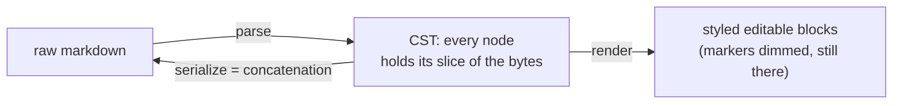
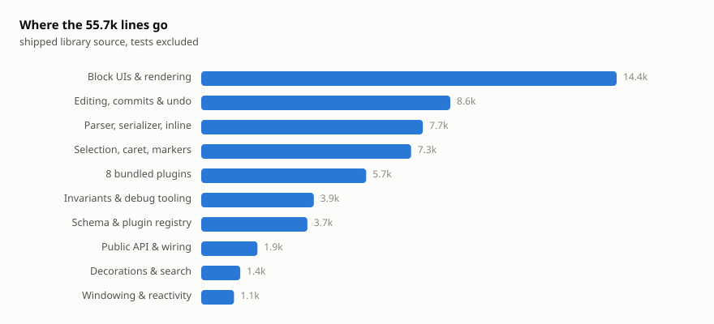
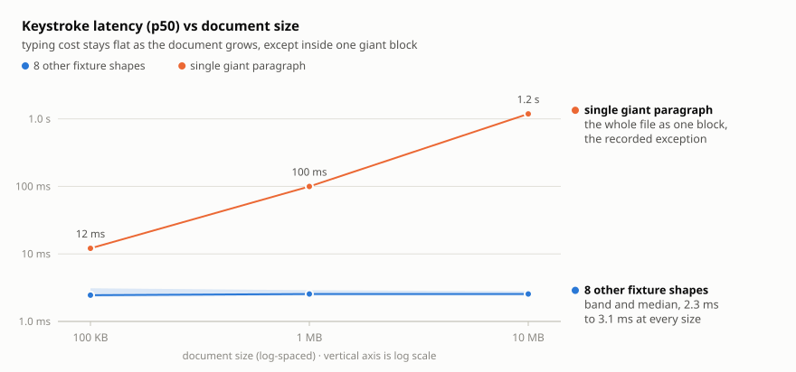
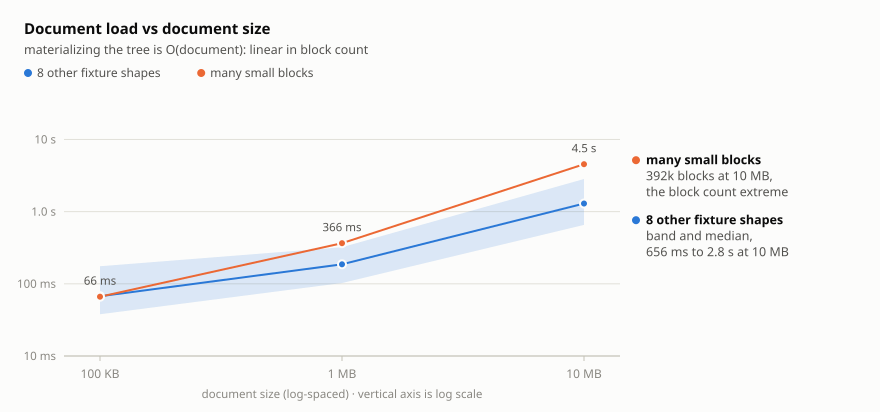
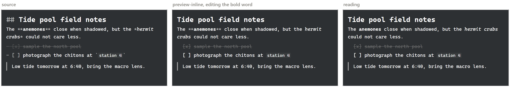

---

This project is an effort (perhaps in vain) to create a markdown editor that is both open source and not crap. In my book, this means that it has to be lossless, extensible, lean, fast, have a graceful ui/ux, and have a hella good plugin interface. So you know, just some simplistic and easy to achieve goals [^1] [^2].

Note that aragonite is a work in progress [^3]. It's written in typescript and svelte [^4] [^5] [^6] [^7], and tested on chromium browsers (chrome and edge) [^8]. Yes, there are plans to port to different frontend frameworks and test in different browsers. No, not right now, sometime in the future.

For those of you who don't want to sit through a monologue, here's how to use the editor. It isn't on npm quite yet (soon); until then, clone this repo, `npm install`, `npm run dev`, and the showcase is on the root route. Embedding it looks like this:

```svelte
<script>
	import { Editor } from 'aragonite';
	import 'aragonite/styles/editor-theme.css';

	let editor;
</script>

<Editor bind:this={editor} source={'# Hello\n'} theme="dark" />
```

To save the source, just do something like:

```svelte
<button onclick={() => save(editor.getSource())}>Save</button>
```

(obviously define the save function)

For more info go read [consumer-guide](./docs/guide/consumer-guide.md).

Now, for those who don't have better things to do.

# Origin

It began one afternoon when I realized Obsidian wasn't open source.

Ok, actually, nothing so dramatic. The short of it is, two years ago, two dumbasses (Finn and I) decided to make a better Obsidian. We wanted to retain the benefits of Obsidian - store notes in local folders, have a good plugin platform, and use open note formats like .md so users aren't locked in; at the same time we also wanted to combine the benefits of Notion's ui/ux. Also, of course, open source what we create. The editor library itself became aragonite, and the app became limestone, the companion codebase to aragonite. In our naivety, we figured making such an editor would be easy. It's not, not by a long shot.

# Lossless

_Why make aragonite lossless?_ What a stupid question, but let me answer it anyways. The philosophy is that you own your files (in limestone), but a traditional approach to parsing/serializing (e.g. tree as truth) doesn't always grant you that. Most editors normalize the data to their document model on load and on save, and sometimes `serialize(parse(source)) !== source` - that's not good. What you really want here is an underlying robustness; an architecture that takes round trip losslessness as one of its core promises, while still leaving enough room for extensibility and raw speed.

_How do other editors deal with this?_ Broadly, three camps. Notion doesn't even pretend: the truth is its proprietary block model, and markdown is an export format. The rich text camp (the ProseMirror markdown lineage: Tiptap, Milkdown, and friends) parses markdown into a rich node tree, treats that tree as the truth, and serializes by walking it. Open a file, change nothing, save, and the diff can be non-empty. And then there's Obsidian, which genuinely is lossless, because its editor is a raw text buffer (CodeMirror 6) wearing syntax hiding decorations. The document model _is_ the string; a fine answer for losslessness, a limiting one for everything else (more on that in [Extensible](#extensible)). Aragonite is a bit more ambitious in its design: I want the byte honesty of a text buffer and a real document model at the same time.

So here's the promise: `serialize(parse(source)) === source`[^9]. For any input, the parser is total (a line no rule claims is still absorbed as paragraph text), and there are guards/checks in place (e.g. Aragonite's property suite fuzzes this exact round trip over arbitrary strings) to keep everyone honest.

To start, then, you need a tree [^10] to act as the document model. Given the lossless promise, the natural conclusion is a concrete syntax tree (CST). But what, exactly, should be the shape for this CST? Well, let's imagine the simplest approach: parse the source into a tree whose nodes each hold their own slice of the original text. Naturally, you'd render the slices as styled DOM, and save by concatenating the slices back together. So serialization might be something quite simple:

```ts
interface Serializable {
	prefix: string;
	children: { leadingTrivia: string; raw: string }[];
	suffix: string;
}

export function concatChildren(children: { leadingTrivia: string; raw: string }[]): string {
	let out = '';
	for (const c of children) out += c.leadingTrivia + c.raw;
	return out;
}

export function serialize(document: Serializable): string {
	return document.prefix + concatChildren(document.children) + document.suffix;
}
```

(leading trivia, prefix, and suffix would of course preserve the whitespace in the original document.)

_But what about nested structures, like quote blocks and lists?_ Let's again imagine a simplistic approach: a container's raw holds its entire subtree's source, and its children each hold their own slices of the inner content. Concretely,

```markdown
> Hello
> World
```

parses to a blockquote whose raw is the full two lines, `> ` prefixes and all, while its single paragraph child holds a raw of `Hello\nWorld`, no `> `. Parsing a container is just strip-and-recurse: strip the markers off each line, parse what's left with the same algorithm, keep the original unstripped lines as the container's raw.

That's it, actually. That's the basic shape of the document model for aragonite:



Congrats, you came up with the gist of the architecture.

_Surely this approach wouldn't work?_ You are thinking. For one, this model means that parents redundantly store their children's contents. Yes, that is certainly true. But look at what the redundancy buys: serialize never recurses. A container's raw already contains its entire subtree's source, so serialization concatenates the top-level children and stops. Nesting depth is never part of the equation, and a function that small has nowhere for a bug to hide. Oh, btw, that code snippet above is `src/lib/core/serializer.ts`, the whole file, verbatim [^11]. That is really how this editor saves your documents.

And, also importantly:

1. Syntax the parser doesn't understand will still round-trip losslessly (including syntax from a plugin you have since uninstalled)
2. The worst case for a parser bug is bad styling, not a corrupted file
3. Partial syntax is handled for free: a half-typed `**bold` is just a string in someone's raw, not an invalid tree state every keystroke has to worry about
4. Saving rewrites nothing you didn't touch, so a git diff (or your sync tool, or a merge) sees exactly your edit, never a whole file re-serialization
5. This will be explained in depth later, but this architecture meshes well with the block editor model, which opens a whole range of possibilities, including windowing and a naturally more capable plugin system

Reading what I told you, you might think to yourself: _surely rich text commands, a bold button, a heading dropdown, or you know, other complex things, need a rich tree to operate on._ They do not. Aragonite proves this to you, that semantic editing never needed the tree to be the truth; it only needs the tree to know where things are.

And the cost is just some memory and some bookkeeping. Memory: a parent stores its children's bytes again, roughly one extra copy per nesting level. But your typical markdown documents do not nest deeply, so the amplification stays small and linear. Bookkeeping: an edit inside a container has to rebuild every enclosing container's raw on the way out, or the redundant copies drift apart. That rebuild is measured, not vibe checked: at realistic nesting it costs a millisecond or two per keystroke, and you need a deliberately adversarial document (16 levels of nesting, 100KB per level) to push it to a whole handful of milliseconds.

So indeed, it's a surprisingly robust design to achieve the lossless promise. And this, in short, is why aragonite made the design trade-off to store redundantly and get a range of benefits in exchange.

# Extensible

What constitutes a good plugin system? In my book, three things. Reach: a plugin can teach the editor genuinely new things (new syntax, new blocks, new behavior) and the result feels native rather than bolted on. Safety: a plugin cannot cost you your document. Ergonomics: the API is typed, discoverable, and testable, so writing a plugin feels like writing a component, not like spelunking. Most editors manage one of these, maybe two.

Time to survey the field again. Notion has no plugin system in the editor at all; you can automate it over their rest api, but you cannot teach its editor a new kind of block. Obsidian has a real plugin system with an enormous ecosystem, and it earned it. But its document model is a string, and that shows through the seams: rendering custom syntax means building it twice, a markdown post processor for reading view plus a CodeMirror extension for live preview, and their own docs warn that "building editor extensions can be challenging, so before you start building one, consider whether you really need it". The ProseMirror lineage has the strongest structural story, custom content nests as real children inside the one document tree, but it rides on tree as truth and inherits the serialization problem from the last section.

|                                   | Notion                         | Obsidian                         | ProseMirror lineage               | aragonite                                    |
| --------------------------------- | ------------------------------ | -------------------------------- | --------------------------------- | -------------------------------------------- |
| document model                    | proprietary blocks             | a string (CM6 buffer)            | rich node tree                    | CST of blocks                                |
| how plugins extend the editor     | they don't (external REST API) | CM6 extensions + post processors | node types + views + plugin state | own a kind: descriptor + component + grammar |
| custom content, editable in place | no                             | mostly read-only previews        | yes (contentDOM)                  | yes (real nested blocks)                     |
| round trips your bytes            | no, export is a translation    | yes, it _is_ the bytes           | no, the serializer decides        | yes, serialize reads raw only                |
| a plugin can break your file      | n/a                            | nothing structural stops it      | a schema/serializer bug can       | no write path: serialize reads raw only      |

Notice the pattern though. When plugins cannot own structure, everything collapses into the same two primitives: decorations (annotate text you don't own) and plugin-local state (a slot you re-map through every edit). Useful primitives, and aragonite ships the first one too. But a system built on only those two can decorate a document; it cannot really extend one. That is the box the flat model puts you in.

A CST of blocks changes the arithmetic. Every construct is a node with a kind, and the block editor model gives every node its own rendering surface, so the natural plugin unit falls out by itself: own a kind. A plugin declares a kind, then wires up to three things:

```
declare a kind ──┬─▶ descriptor   how it merges, focuses, serializes; its keymap
                 ├─▶ component    how it renders and hosts any editable content
                 └─▶ grammar      how source becomes the kind: a block opener,
                                  a :::name directive, or an inline recognizer
```

That kind is a first class citizen of the same tree and the same registries the built ins use; a paragraph and your callout ride identical machinery. Registration follows the `customElements` model: process global, register once (and, in case you are wondering, a duplicate throws instead of silently overriding someone else). And because the editor continuously parses raw markdown, typing the syntax _is_ the input rule. Other editors need a whole subsystem to turn typed syntax into structure; here the parser was already watching.

What separates this from an embed system is that plugin content is genuinely editable. A container kind hosts real CST children in the same nested block list the built-in blockquote uses, so selection, merge, undo, and cross block everything work inside your callout without you or your plugin lifting a finger.

> [!NOTE]
> In addition,
> 1: a leaf kind gets a text surface with native caret, IME, and undo parity.
> 2: an inline kind renders as an atomic widget that can reveal its raw source for editing when the caret walks into it.
> 3: the design every editor eventually reaches for and regrets, nesting a second editor whose state serializes as an opaque blob, is rejected here permanently (since a parallel source of truth cannot round-trip byte for byte).

Ofc, for everything that owns no syntax (spellcheck squiggles, ghost text, comment pins, etc.), aragonite also has decorations.

---

<details>
  <summary>What are decorations?</summary>
  <p>view-only annotations computed as a pure function of the document, painted by the editor, never entering the CST.</p>
</details>

---

Note what is "missing" here: a plugin state API. That is on purpose. Elsewhere, plugin state exists mostly to hold a decoration set and remap it through every edit, because a position is an integer into one flat sequence and goes stale the moment someone types above it. An aragonite position is a path plus an offset into a tree rederived from raw on every edit, so there is nothing to re-map [^12]. A plugin that wants state keeps its own map keyed on the editor's id, and the platform stores nothing.

Circling back to the lossless promise - turns out that also helps here as a safety property (i.e. a plugin cannot corrupt your file):

1. serialization reads raw and nothing else
2. the document a plugin sees is readonly on its bytes at compile time
3. mutation happens through commits the editor referees

A plugin component that throws takes down its own block, which degrades to a readable fallback while its siblings keep working. Uninstall a plugin and every document written with it still round trips byte for byte, because unknown syntax is handled gracefully.

Also, shipping a kind forces the boring questions up front: the registration type requires declaring how the kind behaves under every cross-cutting subsystem (focus, merge, selection, undo, clipboard, search), and registering enrolls it in a conformance battery that actually drives those behaviors.

This is the bet. Aragonite cannot top Obsidian in plugin count (in the short term, at least), but what it can try to do is trade plugin count for plugin quality. Score it against my three criterias: reach is the whole own a kind story above, safety is the lossless promise doing double duty, and ergonomics is the part I haven't argued yet, so here it is: svelte and typescript end to end, the entire authoring surface on one import path (`aragonite/plugin`), and a public testing seam so your plugin's own test suite isn't an afterthought.

Does the design actually work in practice? Well, the six bundled plugins (admonitions, details, math, diagrams, table of contents, occurrence highlighting) are built on the exact surface third parties get, so you tell me.

# Lean

Let's start by establishing the right context: most editors ship as a toolkit, and you assemble the editor yourself. CodeMirror is a dozen `@codemirror/*` packages plus a Lezer grammar; ProseMirror is `prosemirror-model` and `-state` and `-view` and `-transform` and however much glue you write to make them a product. Aragonite, on the other hand, is one library you import, with the parser, serializer, block editing, windowing, undo, selection, decorations, presentation modes, and the plugin platform already wired to each other.

(And it drags almost nothing behind it. Exactly one hard runtime dependency, highlight.js, for code-block syntax colors. Svelte is a peer you already have and compiles away rather than shipping a framework runtime; katex and mermaid are optional peers, pulled in only if you use the math or diagram plugins. That is the whole tree.)

For all of that surface area the code stays relatively compact: about 48k lines of typescript and svelte for the shipped library, roughly 3k of which is the six bundled plugins [^13]. Since this README is meant to be an honest report of what we tried to pull off, here is where those lines actually went:

<picture>
  <source media="(prefers-color-scheme: dark)" srcset="docs/assets/loc-dark.svg">
  
</picture>

I guess the number itself is nothing special, but the ratio turns out to be quite compact. A whole block editor (a full markdown parser and serializer, structural editing, windowing, cross-block selection, undo, decorations, four presentation modes, and a plugin platform) fits in a codebase one person can still read end to end, with one hard dependency behind it. The test suite, meanwhile, is nearly twice the size of the library (~87k lines), which says more about my paranoia than the leanness.

# Fast

Aragonite is fast, and its this way due to one main reason: the editor only mounts what you can see. A 10KB note and a 10MB document have the same number of live components on screen, so typing costs the same in both. This is, as people call it, windowing, and is also one of the reasons why the block editor model earned its keep.

In regards to large documents (how an editor fare with 10KB vs 10MB docs), most editors either solved this long ago, or made peace with the lack of ability to deal with it. On the "I have a solution" side, we have editors like CodeMirror 6, which renders only the visible viewport plus a margin while tracking heights for the whole document (this is a big part of why Obsidian holds up on large files). On the other side, we have the editors who threw in the towel. A long Notion page is thousands of block records, users start noticing lag around a thousand blocks, and the community's standing advice is to hide content inside toggles so less of it loads. The ProseMirror lineage mounts the entire document into one contenteditable, and unmounting the middle of a live editing surface breaks selection, IME, and everything else that already makes contenteditable cranky, so virtualization there remains an open forum thread rather than a feature.

On the second other side, aragonite's block model windows for real: blocks outside the viewport genuinely unmount [^14]. This is only possible because every block is its own editing surface; you cannot unmount the middle of one big contenteditable, but you can unmount nine thousand small ones. The rendered slice sits between two spacers sized by a height model, so the native scrollbar, scroll position, and scroll range are all real.

---

<details>
  <summary>If you are interested in more details</summary>

- Every container windows its own children, meaning a checklist of 10000 items windows itself instead of mounting its whole subtree.
- Windowing self-activates per scope past a height budget, so a normal note never pays a cent for it.
- Heights come from a cheap per-kind estimate, corrected by real measurement once a block mounts.
- Any operation that needs an off screen block, say undo landing the caret five thousand blocks away or search jumping to the next match, reveals its target first: scroll the window, mount, then act.

</details>

---

A keystroke, then, roughly goes through this process: the edited block re-reads its own bytes and rebuilds its styled spans (proportional to that one block, with a fast path for plain text), the ancestry rebuild (mentioned in the Lossless section, if you remember), an undo snapshot that shares every node with the live tree and copies only on write, and a reactive flush over roughly a viewport's worth of components. Nothing in that loop reads the whole document. In big O terms:

| operation                   | cost                                                               |
| --------------------------- | ------------------------------------------------------------------ |
| a keystroke                 | O(viewport)                                                        |
| loading a document          | O(document), duh                                                   |
| saving                      | O(document bytes), because its basically a top level concatenation |
| pushing an undo snapshot    | O(top-level blocks), snapshots share nodes, copy on write          |
| finding the slice on scroll | O(log blocks)                                                      |
| select all, then copy       | O(selection)                                                       |

---

<details>
<summary>A full analysis, if you wanna waste your time</summary>

**Model.** Fix a document $s$ of $N$ bytes, parsed into $B$ block nodes, of which $B_t$ are top level; $\mathcal{C}$ denotes its set of container nodes (the nodes holding children), and $D_{\max}$ its maximum container nesting depth. An edit site sits at container nesting depth $D \le D_{\max}$, inside a block whose content length is $L$ bytes; write $S_1 \le S_2 \le \dots \le S_D$ for the source sizes of its enclosing containers, innermost first, so $S_D$ is the outermost. $V$ denotes the mounted block count: the visible slice, a constant overscan band, and the pinned focus block, so $V = O(\text{viewport})$, independent of $N$ and $B$. Costs are unit-cost RAM with string concatenation linear in bytes moved. The registered block-opener set is a constant of the grammar, not of the document.

**Proposition 1 (serialization).** Serialization computes $\mathit{prefix} + \sum_{i=1}^{B_t} (\mathit{trivia}_i + \mathit{raw}_i) + \mathit{suffix}$ in $\Theta(N + B_t) = \Theta(N)$, copying each output byte exactly once. Recursion is unnecessary by construction: a container's $\mathit{raw}$ already contains its entire subtree's source, so the top-level pass sees every byte. This is the redundancy the Lossless section bought; here is where it pays.

**Proposition 2 (parsing).** The block parser is a single line-oriented scan. Each line is offered to a constant-size, priority-ordered opener list, and strip-and-recurse re-scans a line once per enclosing container, so the total is

$$\Theta\left(\sum_{\ell \in \text{lines}} |\ell| \cdot (1 + d(\ell))\right)$$

where $d(\ell)$ is the line's nesting depth. Flat documents give $\Theta(N)$; the adversarial bound is $O(N \cdot D_{\max})$, reached only by pathological `> > > >` towers. Inline parsing contributes nothing here: it is deferred, per block, and runs on render.

**Definition (the ancestry rebuild).** An edit at depth $D$ re-materializes every enclosing container's $\mathit{raw}$:

$$A = \Theta\left(\sum_{i=1}^{D} S_i\right) \subseteq O(D \cdot S_D),$$

and when each level contributes $b$ bytes of its own source (so $S_i = \Theta(i \cdot b)$), $A = \Theta(D^2 b)$. Empirically the constants are small: one to two milliseconds per keystroke at realistic nesting ($D \le 10$, $\le 50$ KB per level), 5.5 ms at an adversarial $D = 16$ with 100 KB per level. Top-level edits have $A = 0$.

**Theorem (keystroke cost).** A steady-state keystroke in a block of content length $L$ costs

$$\Theta(L + V) + A.$$

The $\Theta(L)$ term is the DOM read-back, inline reparse, and span rebuild of the one edited block, with a plain-text fast path that keeps the common case allocation-free; $\Theta(V)$ is the reactive flush, which windowing bounds by the viewport and which dominates in steady state; $A$ is the ancestry rebuild. The undo snapshot is what steady-state excludes: consecutive keystrokes share one debounced entry, so only the first keystroke of a batch pays the $\Theta(B_t)$ push (plus, at depth, the once-per-batch copy of the written spine, per Proposition 3). Since $V$ is viewport-bounded and $A$ vanishes at top level, steady-state typing is $O(\text{viewport})$ independent of document size, which is exactly the property the perf gate enforces. The degenerate case is $L = \Theta(N)$, one paragraph holding the whole file, where the rebuild is $\Theta(N)$ by definition; it is transient, since any split restores $L \ll N$.

**Proposition 3 (structural edits and history).** Split, merge, and delete at top level cost $\Theta(B_t + L)$: the $B_t$ term is pointer-array work (the snapshot's copy of the top-level reference array, plus the id and ref splices), and no node is deep-cloned, because a snapshot shares nodes with the live tree under an epoch mark and copy-on-write duplicates only the spine actually written, which at top level has length one. At depth, the cost is $\Theta(B_t + P) + A$, where $P = \sum_{i=1}^{D} c_i$ and $c_i$ is the child count of the $i$-th container on the written spine, one shallow copy per level. Consequently the history heap holds the live tree plus the written spines, never stack-depth many clones: a push is $\Theta(B_t)$, not $\Theta(B)$, and a restore is a pointer swap of the same order.

**Proposition 4 (rendering and queries).** Mounting is $\Theta(V)$; everything outside the slice is two spacer elements sized from a Fenwick tree over per-block heights, which answers offset-to-index and index-to-offset in $O(\log B)$ per scroll query and absorbs a height correction in $O(\log B)$. Load is the one axis windowing cannot bound. The parse mints all $B$ nodes up front (windowing limits what mounts, not what materializes), so load is Proposition 2's parse plus $\Theta(B)$ of per-node work, and the node count, not the byte count, is the scaling villain (the nine 10 MB fixtures share a byte budget; the 392k-block one loads slowest). Measured: sub-second at realistic sizes, about 4.5 s at that extreme.

**Boundary case (reference definitions).** Editing a `linkReferenceDefinition` whose signature changes invalidates inline rendering document-wide, the closest thing to an $O(N)$ edit in the system. The eager cost is still $\Theta(V)$, because the signature rides each block's render key and only mounted blocks re-render now; the remainder is paid lazily as blocks mount. Every other edit is scoped to a dirty set.

**Remark (tradeoff).** Materialized container raw costs space. Define the amplification factor

$$\alpha = \frac{1}{N} \sum_{c \in \mathcal{C}} \lvert \operatorname{raw}(c) \rvert,$$

the bytes containers store over again relative to the document itself: $\alpha$ measures 3.55 on the nested-container fixture and 1.96 on the table-heavy one, and the commit gate holds both under ceilings with ×1.1 headroom. What the space buys is not asymptotic, since a serializer that re-derived container bytes on demand would still be $\Theta(N)$. The purchase is where the risk lives: serialization stays a non-recursive concatenation (Proposition 1) with nowhere for a bug to hide, and every byte consumer (a save, a clipboard slice, an undo restore) reads stored bytes instead of re-deriving them. Deriving container raw from children would fix the cheap problem (space) and hand the expensive one (round-trip risk) back to the serializer.

In summary: parse and serialize are $\Theta(N)$; a steady-state keystroke is $\Theta(L + V) + A$, which is $O(\text{viewport})$ everywhere except inside large containers, where $A$ adds the enclosing subtrees' bytes; load is parse plus an unavoidable $\Theta(B)$ of per-node work. The mechanisms behind every term, and the gates holding them, live in [performance.md](./docs/design/performance.md) and the design docs it links.

</details>

---

Two things though. Loading is O(document), because ofc it is (the tree is materialized up front, which is sub-second at realistic sizes and multi-second only out at the hundreds of thousands of blocks extreme). And a single giant paragraph is O(itself) to edit: windowing windows blocks, not the inside of one block, so the span rebuild scales with paragraph length. This one, though, is transient, a single enter splits it into windowed blocks, and you only meet it by pasting a multi megabyte blob into one block [^15].

Now let me show you some pretty graphs.

<picture>
  <source media="(prefers-color-scheme: dark)" srcset="docs/assets/perf-keystroke-dark.svg">
  
</picture>

<picture>
  <source media="(prefers-color-scheme: dark)" srcset="docs/assets/perf-load-dark.svg">
  
</picture>

_Recorded 2026-07-16 on an ordinary desktop (Ryzen 7 7700, 31 GB RAM, Windows 11), under a dev build with the invariant assertions still on, so read everything as a conservative upper bound relative to that machine. What is gated versus report-only, and where the numbers live, is [performance.md](./docs/design/performance.md)'s subject._ [^16]

Now, the numbers here depend on the machine; however, the scale of the numbers and the shape of the graph should tell you the story I want to share.

# Graceful

Now, here's a conundrum Finn and I faced early on: we wanted Notion's uiux, but we (by we, I meant Finn) wanted a document, not a pile of blocks. In summary, we wanted the benefits of Notion's uiux in our uiux, not necessarily its look. Which is why even though under the hood aragonite is as much a block editor as Notion is, on the surface it reads like a document you are writing, not a fucking game of tetris.

Notion never lets you forget you are in a builder. Hover any block and a drag grip and a plus button fade into the gutter; the surface is a scaffold, and a stray click + drag can rearrange the page. Obsidian sits at the other pole, and reads as a calm plain document, because under the hood it is one (a text buffer, with all of the limitations I mentioned before). Aragonite wants the best of both world: the calm surface and a real structure.

So, if you open aragonite, the blocks are there, mostly invisible. No card chrome, no per block outline, no gutter furniture by default. The reorder handle is opt in and only appears on hover; keyboard reorder is always available and shows nothing until you use it.

Oh, live preview? You think I forgot about it? nah. By default, markdown syntax stays visible but dimmed. Aragonite provide the `presentationMode` prop, which dials the same document along a spectrum, from the raw side to the rendered side:

- **source** (default): styled source, every marker visible and dimmed. The editing substrate.
- **reading**: markers hidden, widgets rendered, read-only. The closest to a classic rendered preview.
- **preview-block**: live editing, but an unfocused block hides its syntax and the focused one reveals it. Markers appear only around where you are working.
- **preview-inline**: the finest grain. Within the focused block, a construct's markers stay hidden until your caret actually enters it, then fold away again as you leave.

Check out some screenshots of the actual app:



One last snarky remark to make... All these - all four styles, follow one render path. There is never a second rendering, never a derived raw tree, never a rich text model swapped in behind the scenes. I never exactly planned for live preview, it just so happened that I valued the right promises and made the right decisions that made features like this easily buildable.

# Footnote

[^1]: read docs/changelog.md to experience my suffering.

[^2]: this is not even the first iteration of this editor; this is like my fourth try to write this piece of lovely shit.

[^3]: as steam users call it: in early access

[^4]: the superior frontend framework

[^5]: one day i might port this to react, one day

[^6]: angular users - sorry, i thought those don't exist anymore

[^7]: what does vue have that svelte and react don't have? a lower barrier to entry?

[^8]: it might work in safari/firefox, but I did not test them yet

[^9]: Parse then serialize returns the exact same bytes every time. However, aragonite cannot promise that editing never normalizes; where GFM itself mandates ignoring malformed input, those bytes survive load and save untouched, then drop the first time you edit the block around them. Today the lone case is a table body row wider than its header, whose surplus cells GFM discards.

[^10]: A flat model is rejected because of the constraints it places on the plugin system. Read the [Extensible](#extensible) section to understand why this is.

[^11]: ok, fine; the real file spells `readonly` in a few places and carries a comment up top. The logic is character for character what you just read.

[^12]: ProseMirror friends: yes, this means no `StateField`. The forward-mapping problem it solves is downstream of positions being integers into a flat sequence. Ours aren't.

[^13]: counted from the tracked `src/lib` source, excluding the ~87k lines of tests. Give or take a refactor; it is a description, not a promise.

[^14]: before anyone suggests it: CSS `content-visibility` is not this. It skips paint and layout but leaves the components mounted, and the cost that matters here is script, not layout.

[^15]: don't you dare try it lol

[^16]: the nine shapes, each generated from a fixed seed at 100 KB, 1 MB, and 10 MB: flat prose, nested containers (lists four deep plus nested quotes), many small blocks (392k four-word paragraphs at 10 MB), a single giant paragraph, reference-heavy prose (links plus their definitions), many small tables, one giant list, one giant blockquote, and one giant table. Each chart's band is the nine minus its own villain: the giant paragraph for keystrokes, many small blocks for load.
