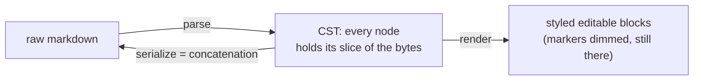

This project is an effort (perhaps in vain) to create a markdown editor that is both open source and not crap. In my book, this means that it has to be lossless, extensible, lean, fast, have a graceful ui/ux, and have a hella good plugin interface. So you know, just some simplistic and easy to achieve goals [^1] [^2].

Note that aragonite is a work in progress [^3]. It's written in typescript and svelte [^4] [^5] [^6] [^7], and tested on chromium browsers (chrome and edge) [^8]. Yes, there are plans to port to different frontend frameworks and test in different browsers. No, not right now, sometime in the future.

For those of you who don't want to sit through a monologue, here's how to use the editor. It isn't on npm quite yet (soon); until then, clone this repo, `npm install`, `npm run dev`, and the showcase is on the root route. Embedding it looks like this:

```svelte
<script>
	import { Editor } from 'aragonite';
	import 'aragonite/styles/editor-theme.css';

	let editor;
</script>

<Editor bind:this={editor} source={'# Hello\n'} theme="dark" />
```

To save the source, just do something like:

```svelte
<button onclick={() => save(editor.getSource())}>Save</button>
```

(obviously define the save function)

For more info go read [consumer-guide](./docs/guide/consumer-guide.md).

Now, for those who don't have better things to do.

# Origin

It began one afternoon when I realized Obsidian wasn't open source.

Ok, actually, nothing so dramatic. The short of it is, two years ago, two dumbasses (Finn and I) decided to make a better Obsidian. We wanted to retain the benefits of Obsidian - store notes in local folders, have a good plugin platform, and use open note formats like .md so users aren't locked in; at the same time we also wanted to combine the benefits of Notion's ui/ux. Also, of course, open source what we create. The editor library itself became aragonite, and the app became limestone, the companion codebase to aragonite. In our naivety, we figured making such an editor would be easy. It's not, not by a long shot.

# Lossless

_Why make aragonite lossless?_ What a stupid question, but let me answer it anyways. The philosophy is that you own your files (in limestone), but a traditional approach to parsing/serializing (e.g. tree as truth) doesn't always grant you that. Most editors normalize the data to their document model on load and on save, and sometimes `serialize(parse(source)) !== source` - that's not good. What you really want here is an underlying robustness; an architecture that takes round trip losslessness as one of its core promises, while still leaving enough room for extensibility and raw speed.

_How do other editors deal with this?_ Broadly, three camps. Notion doesn't even pretend: the truth is its proprietary block model, and markdown is an export format. The rich text camp (the ProseMirror markdown lineage: Tiptap, Milkdown, and friends) parses markdown into a rich node tree, treats that tree as the truth, and serializes by walking it. Open a file, change nothing, save, and the diff can be non-empty. And then there's Obsidian, which genuinely is lossless, because its editor is a raw text buffer (CodeMirror 6) wearing syntax hiding decorations. The document model _is_ the string; a fine answer for losslessness, a limiting one for everything else (more on that in [Extensible](#extensible)). Aragonite is a bit more ambitious in its design: I want the byte honesty of a text buffer and a real document model at the same time.

So here's the promise: `serialize(parse(source)) === source`. For any input, the parser is total (a line no rule claims is still absorbed as paragraph text), and there are guards/checks in place (e.g. Aragonite's property suite fuzzes this exact round trip over arbitrary strings) to keep everyone honest.

To start, then, you need a tree [^9] to act as the document model. Given the lossless promise, the natural conclusion is a concrete syntax tree (CST). But what, exactly, should be the shape for this CST? Well, let's imagine the simplest approach: parse the source into a tree whose nodes each hold their own slice of the original text. Naturally, you'd render the slices as styled DOM, and save by concatenating the slices back together. So serialization might be something quite simple:

```ts
interface Serializable {
	prefix: string;
	children: { leadingTrivia: string; raw: string }[];
	suffix: string;
}

export function concatChildren(children: { leadingTrivia: string; raw: string }[]): string {
	let out = '';
	for (const c of children) out += c.leadingTrivia + c.raw;
	return out;
}

export function serialize(document: Serializable): string {
	return document.prefix + concatChildren(document.children) + document.suffix;
}
```

(leading trivia, prefix, and suffix would of course preserve the whitespace in the original document.)

_But what about nested structures, like quote blocks and lists?_ Let's again imagine a simplistic approach: a container's raw holds its entire subtree's source, and its children each hold their own slices of the inner content. Concretely,

```markdown
> Hello
> World
```

parses to a blockquote whose raw is the full two lines, `> ` prefixes and all, while its single paragraph child holds a raw of `Hello\nWorld`, no `> `. Parsing a container is just strip-and-recurse: strip the markers off each line, parse what's left with the same algorithm, keep the original unstripped lines as the container's raw.

That's it, actually. That's the basic shape of the document model for aragonite:



Congrats, you came up with the gist of the architecture.

_Surely this approach wouldn't work?_ You are thinking. For one, this model means that parents redundantly store their children's contents. Yes, that is certainly true. But look at what the redundancy buys: serialize never recurses. A container's raw already contains its entire subtree's source, so serialization concatenates the top-level children and stops. Nesting depth is never part of the equation, and a function that small has nowhere for a bug to hide. Oh, btw, that code snippet above is `src/lib/core/serializer.ts`, the whole file, verbatim [^10]. That is really how this editor saves your documents.

And, also importantly:

1. Syntax the parser doesn't understand will still round-trip losslessly (including syntax from a plugin you have since uninstalled)
2. The worst case for a parser bug is bad styling, not a corrupted file
3. Partial syntax is handled for free: a half-typed `**bold` is just a string in someone's raw, not an invalid tree state every keystroke has to worry about
4. Saving rewrites nothing you didn't touch, so a git diff (or your sync tool, or a merge) sees exactly your edit, never a whole file re-serialization
5. This will be explained in depth later, but this architecture meshes well with the block editor model, which opens a whole range of possibilities, including windowing and a naturally more capable plugin system

One objection worth heading off: surely rich text commands, a bold button, a heading dropdown, need a rich tree to operate on. They do not. A bold button inserts `**` around the selection in raw; a heading level command swaps the `#` prefix. Semantic editing never needed the tree to be the truth; it only needs the tree to know where things are.

And the cost is just some memory and some bookkeeping. Memory: a parent stores its children's bytes again, roughly one extra copy per nesting level. But your typical markdown documents do not nest deeply, so the amplification stays small and linear. Bookkeeping: an edit inside a container has to rebuild every enclosing container's raw on the way out, or the redundant copies drift apart. That rebuild is measured, not vibes-checked: at realistic nesting it costs a millisecond or two per keystroke, and you need a deliberately adversarial document (16 levels of nesting, 100KB per level) to push it to a whole handful of milliseconds.

So indeed, it's a surprisingly robust design to achieve the lossless promise. Thus, aragonite made the design trade-off: store redundantly, get a range of benefits in exchange.

# Extensible

What constitutes a good plugin system? In my book, three things. Reach: a plugin can teach the editor genuinely new things (new syntax, new blocks, new behavior) and the result feels native rather than bolted on. Safety: a plugin cannot cost you your document. Ergonomics: the API is typed, discoverable, and testable, so writing a plugin feels like writing a component, not like spelunking. Most editors manage one of these, maybe two.

Time to survey the field again. Notion has no plugin system in the editor at all; you can automate it over their REST API, but you cannot teach its editor a new kind of block. Obsidian has a real plugin system with an enormous ecosystem, and it earned it. But its document model is a string, and that shows through the seams: rendering custom syntax means building it twice, a markdown post processor for reading view plus a CodeMirror extension for live preview, and their own docs warn that "building editor extensions can be challenging, so before you start building one, consider whether you really need it". The ProseMirror lineage has the strongest structural story, custom content nests as real children inside the one document tree, but it rides on tree-as-truth and inherits the serialization problem from the last section.

|                                   | Notion                         | Obsidian                         | ProseMirror lineage               | aragonite                                    |
| --------------------------------- | ------------------------------ | -------------------------------- | --------------------------------- | -------------------------------------------- |
| document model                    | proprietary blocks             | a string (CM6 buffer)            | rich node tree                    | CST of blocks                                |
| how plugins extend the editor     | they don't (external REST API) | CM6 extensions + post processors | node types + views + plugin state | own a kind: descriptor + component + grammar |
| custom content, editable in place | no                             | mostly read-only previews        | yes (contentDOM)                  | yes (real nested blocks)                     |
| round trips your bytes            | no, export is a translation    | yes, it _is_ the bytes           | no, the serializer decides        | yes, serialize reads raw only                |
| a plugin can break your file      | n/a                            | nothing structural stops it      | a schema/serializer bug can       | no write path: serialize reads raw only      |

Notice the pattern though. When plugins cannot own structure, everything collapses into the same two primitives: decorations (annotate text you don't own) and plugin-local state (a slot you re-map through every edit). Useful primitives, and aragonite ships the first one too. But a system built on only those two can decorate a document; it cannot really extend one. That is the box the flat model puts you in.

A CST of blocks changes the arithmetic. Every construct is a node with a kind, and the block editor model gives every node its own rendering surface, so the natural plugin unit falls out by itself: own a kind. A plugin declares a kind, then wires up to three things:

```
declare a kind ──┬─▶ descriptor   how it merges, focuses, serializes; its keymap
                 ├─▶ component    how it renders and hosts any editable content
                 └─▶ grammar      how source becomes the kind: a block opener,
                                  a :::name directive, or an inline recognizer
```

That kind is a first-class citizen of the same tree and the same registries the built-ins use; a paragraph and your callout ride identical machinery. Registration follows the `customElements` model: process global, register once, and a duplicate throws instead of silently overriding someone else. And because the editor continuously parses raw markdown, typing the syntax _is_ the input rule. Other editors need a whole subsystem to turn typed syntax into structure; here the parser was already watching.

What separates this from an embed system is that plugin content is genuinely editable. A container kind hosts real CST children in the same nested block list the built-in blockquote uses, so selection, merge, undo, and cross-block everything work inside your callout without your plugin lifting a finger. A leaf kind gets a text surface with native caret, IME, and undo parity. An inline kind renders as an atomic widget that can reveal its raw source for editing when the caret walks into it. And the design every editor eventually reaches for and regrets, nesting a second editor whose state serializes as an opaque blob, is rejected here permanently: a parallel source of truth cannot round-trip byte for byte.

For everything that owns no syntax (occurrence highlights, spellcheck squiggles, ghost text, comment pins) there are decorations: view-only annotations computed as a pure function of the document, painted by the editor, never entering the CST. Note what is missing here: a plugin state API. That is on purpose. Elsewhere, plugin state exists mostly to hold a decoration set and re-map it through every edit, because a position is an integer into one flat sequence and goes stale the moment someone types above it. An aragonite position is a path plus an offset into a tree re-derived from raw on every edit, so there is nothing to re-map [^11]. A plugin that wants state keeps its own map keyed on the editor's id, and the platform stores nothing.

The lossless promise also pays out one more time, as a safety property: a plugin cannot corrupt your file. Serialization reads raw and nothing else; the document a plugin sees is readonly on its bytes at compile time; mutation happens through commits the editor referees. A plugin component that throws takes down its own block, which degrades to a readable fallback while its siblings keep working. Uninstall a plugin and every document written with it still round-trips byte for byte, because unknown syntax was win number one of the last section. And shipping a kind forces the boring questions up front: the registration type requires declaring how the kind behaves under every cross-cutting subsystem (focus, merge, selection, undo, clipboard, search), and registering enrolls it in a conformance battery that actually drives those behaviors. "It renders" is a fraction of done, and the machinery knows it.

One boundary keeps all of this sane: aragonite is an editor library, so aragonite plugins own the document and the editing surface, nothing else. Ribbons, sidebars, settings tabs, sync, vault-wide search: those belong to the app's plugin system (limestone's, in our case). Roughly half of Obsidian's most-installed plugins never touch the editing surface (we counted); Obsidian conflates the two layers because it is the app. An editor library that grows a ribbon API has lost the plot.

So that is the bet: trade plugin count for plugin quality. svelte and typescript end to end, one typed context object, a public testing seam, and the bundled plugins (admonitions, `<details>`, math, diagrams, a table of contents, occurrence highlighting) built on the same surface third parties get [^12]. The API freezes at 1.0, and not before it has been ground against real consumers, so that what freezes is a platform rather than a guess.

# Lean

Most editors ship as a _toolkit_, and you assemble the editor yourself. CodeMirror is a dozen `@codemirror/*` packages plus a Lezer grammar; ProseMirror is `prosemirror-model` and `-state` and `-view` and `-transform` and however much glue you write to make them a product. aragonite is one library you import, with the parser, serializer, block editing, windowing, undo, selection, decorations, presentation modes, and the plugin platform already wired to each other.

And it drags almost nothing behind it. Exactly one hard runtime dependency, highlight.js, for code-block syntax colors. Svelte is a peer you already have and compiles away rather than shipping a framework runtime; katex and mermaid are optional peers, pulled in only if you use the math or diagram plugins. That is the whole tree.

For all of that surface area the code stays compact: about 47k lines of typescript and svelte for the shipped library, roughly 3k of which is the six bundled plugins [^13]. Since this README is meant to be an honest report of what we tried to pull off, here is where those lines actually went:

<picture>
  <source media="(prefers-color-scheme: dark)" srcset="docs/assets/loc-dark.svg">
  
</picture>

The number is not the boast; the ratio is. A whole block editor (a full markdown parser and serializer, structural editing, windowing, cross-block selection, undo, decorations, four presentation modes, and a freezing plugin platform) fits in a codebase one person can still read end to end, with one dependency behind it. The test suite is about two-thirds the size of the library, which says more about the paranoia than the leanness (the round-trip fuzzing, the invariant gates, the correctness machinery threaded through every section above).

# Fast

The speed story is one idea executed thoroughly: the editor only mounts what you can see. A 10KB note and a 10MB document have the same number of live components on screen, so typing costs the same in both. This is the windowing payoff promised back in the Lossless section, and it is the block editor model earning its keep.

Text editors solved their version of this long ago. CodeMirror 6 renders only the visible viewport plus a margin while tracking heights for the whole document, which is a big part of why Obsidian holds up on large files. Block editors have a harder time of it. A long Notion page is thousands of block records, users start noticing lag around a thousand blocks, and the community's standing advice is to hide content inside toggles so less of it loads. The ProseMirror lineage mounts the entire document into one contenteditable, and unmounting the middle of a live editing surface breaks selection, IME, and everything else that already makes contenteditable cranky, so virtualization there remains an open forum thread rather than a feature.

aragonite windows for real: blocks outside the viewport genuinely unmount [^14]. This is only possible because every block is its own editing surface; you cannot unmount the middle of one big contenteditable, but you can unmount nine thousand small ones. The rendered slice sits between two spacers sized by a height model, so the native scrollbar, scroll position, and scroll range are all real. Every container windows its own children, meaning a checklist of 10,000 items windows itself instead of mounting its whole subtree. Windowing self-activates per scope past a height budget, so a normal note never pays a cent for it. Heights come from a cheap per-kind estimate, corrected by real measurement once a block mounts. And any operation that needs an off-screen block, say undo landing the caret five thousand blocks away or search jumping to the next match, reveals its target first: scroll the window, mount, then act.

A keystroke, then, costs this: the edited block re-reads its own bytes and rebuilds its styled spans (proportional to that one block, with a fast path for plain text), the ancestry rebuild from the Lossless section, an undo snapshot that shares every node with the live tree and copies only on write, and a reactive flush over roughly a viewport's worth of components. Nothing in that loop reads the whole document. In O() terms:

| operation                   | cost                                                              |
| --------------------------- | ----------------------------------------------------------------- |
| a keystroke                 | O(viewport)                                                       |
| loading a document          | O(document)                                                       |
| saving                      | O(document bytes) (one concatenation, zero recursion)             |
| pushing an undo snapshot    | O(top-level blocks) (snapshots share nodes, copy on write)        |
| finding the slice on scroll | O(log blocks)                                                     |
| select all, then copy       | O(selection) (walked over the CST while only a slice is rendered) |

---

<details>
<summary>A full analysis, if you wanna waste your time</summary>

Legend: N = document bytes · Bₜ = top-level block count · B = total node count · V = viewport-mounted blocks · L = edited block's content length · D = container nesting depth at the edit site · A = the ancestry rebuild term, defined below.

**Parse and serialize.** Serialize is O(N), and about the cheapest O(N) possible: it walks only the top-level children (`prefix + Σ(leadingTrivia + raw) + suffix`, the same function the Lossless section quoted), no recursion, each byte copied exactly once because a container's raw already holds its whole subtree. That is O(Bₜ) appends moving O(N) bytes, no tree walk at all. Parse is O(N) on realistic documents and O(N·D) in the worst case: a single-pass line scanner where each line tries a fixed, priority-ordered opener list, each opener bailing cheaply when the line cannot be its syntax. The D factor comes from strip-and-recurse: a line nested d levels deep is re-scanned once per level as each container strips its prefix and re-parses the inner buffer, so the true cost is Σ(line × its depth). Flat prose is O(N); pathological `> > > >` nesting is O(N·D). Inline parsing is not in this number: the block parser never calls it, it is lazy and per block.

**Editing, where top-level and container genuinely diverge.** The divergence is one term: A = the ancestry raw rebuild = Σ over enclosing containers of that container's subtree bytes. Dominated by the outermost container, so worst case O(D · `S_outer`), roughly O(`S_outer`) in practice; measured at a millisecond or two per keystroke at realistic nesting. Top-level edits have A = 0.

- Plain typing, top-level block: O(L + V). Reading the DOM back, rewriting node.raw, reparsing inline, and rebuilding spans is O(L); the reactive flush is O(V) thanks to windowing, and it is the dominant steady-state cost. Undo is debounce-batched, so a snapshot push amortizes across the batch rather than landing per keystroke.
- Plain typing, inside a container: O(L + V + A). Same block work plus one synchronous ancestry rebuild per keystroke. This is the amplification the Lossless section priced: linear, bounded, and gated as a counter in the perf suite.
- Structural edit (split / merge / delete), top-level: O(Bₜ + L). The Bₜ is pointer-array work: the snapshot copies the top-level reference array plus the id and ref splices. Structural sharing means no node cloning: the snapshot shares nodes via an epoch mark, and copy-on-write clones only the spine you actually write, which at top level is one node.
- Structural edit, inside a container: O(Bₜ + P + A), where P is the spine unshare: one shallow copy per level, O(Σ children counts along the path). A dominates for deep or large containers.

One near-caveat: editing a `linkReferenceDefinition` is the closest thing to an O(N) edit. Changing the reference map's signature invalidates inline rendering document-wide, so reference-style links update everywhere. Even there the recompute is lazy: the signature rides each prose block's render key, so you pay O(V) re-renders now and the rest as blocks scroll in. Every other edit is scoped to a dirty set.

The trade the whole thing rests on: materialized container raw spends on the amplification axis to buy back the undo axis. Because raw is authoritative, serialize is trivial and undo snapshots share nodes: no O(B) clone per snapshot, no gigabyte undo stack. Deriving raw from structure instead would fix the cheap problem and reintroduce the expensive one.

**Rendering.** Three costs, and only one is bounded by windowing. Mount is O(V): viewport blocks plus overscan plus the pinned focus block; the rest is two spacer divs sized from the height model, with scroll-to-slice mapping O(log B) through a Fenwick tree. Load is O(B), the one windowing cannot reach: proxying every node into reactive state, assigning ids, seeding heights, all script-bound and linear. Per-edit re-render is O(L): only the edited block rebuilds its span tree, from raw. Small documents, and scopes below the activation budget, skip windowing entirely and mount everything, which at that size is exactly what you want.

In short: parse and serialize are O(N); typing is O(viewport), except inside containers where it is O(viewport + enclosing container size); load is the one unavoidable O(document). The mechanisms behind every term, and the gates holding them, live in [performance.md](./docs/design/performance.md) and the design docs it links.

</details>

---

Two axes windowing cannot reach. Loading is O(document): the tree is materialized up front, which is sub-second at realistic sizes and multi-second only out at the hundreds-of-thousands-of-blocks extreme. And a single giant paragraph is O(itself) to edit: windowing windows blocks, not the inside of one block, so the span rebuild scales with paragraph length. That one is transient, a single Enter splits it into windowed blocks, and you only meet it by pasting a multi-megabyte blob into one block [^15].

Numbers, then. The digits will drift with hardware and with every re-measure; the shape is the argument:

<picture>
  <source media="(prefers-color-scheme: dark)" srcset="docs/assets/perf-keystroke-dark.svg">
  
</picture>

<picture>
  <source media="(prefers-color-scheme: dark)" srcset="docs/assets/perf-load-dark.svg">
  
</picture>

_Recorded 2026-07-16 on an ordinary desktop (Ryzen 7 7700, 31 GB RAM, Windows 11), under a dev build with the invariant assertions still on, so read everything as a conservative upper bound relative to that machine. What is gated versus report-only, and where the numbers live, is [performance.md](./docs/design/performance.md)'s subject._ [^16]

None of this is aspirational. The commit gate asserts the mounted-component ceiling as a hard count (counts don't vary by machine; timings do), and a perf gate holds keystroke latency against the same baselines the charts above are drawn from.

# Graceful

Here is a contradiction sitting in the Origin section: we wanted Notion's ui/ux, but the guiding rule of the actual editor is _a document, not a pile of blocks_. The resolution is that we wanted the _benefits_ of Notion, not its look. Under the hood aragonite is as much a block editor as Notion is, and the Fast and Extensible sections are what that buys. On the surface it should read like a document you are writing, not a stack of cards you are assembling.

Notion never lets you forget you are in a builder. Hover any block and a six-dot drag grip and a plus button fade into the gutter; the surface is a scaffold, and a stray click-drag can rearrange the page. That is a real cost people write about, not a nitpick. Obsidian sits at the other pole, and reads as a calm plain document, because under the hood it _is_ one (a text buffer, with all the limits the Extensible section covered). aragonite wants the calm surface and the real structure at once.

So the blocks are there, load-bearing, and mostly invisible. No card chrome, no per-block outline, no gutter furniture by default. The reorder handle is opt-in (`blockDragHandles`) and only appears on hover; keyboard reorder is always available and shows nothing until you use it. Markdown syntax stays _visible but dimmed_ rather than hidden behind a rich-text facade: your `##` and `**` are right there, greyed down, while the content they mark is styled by meaning (headings large, code monospace, emphasis italic). You are always editing markdown, and you can always see that you are.

That visibility is a default, not a sentence. The `presentationMode` prop dials the same document along a spectrum, from the raw side to the rendered side:

- **source** (default): styled source, every marker visible and dimmed. The editing substrate.
- **reading**: markers hidden, widgets rendered, read-only. The closest to a classic rendered preview.
- **preview-block**: live editing, but an unfocused block hides its syntax and the focused one reveals it. Markers appear only around where you are working.
- **preview-inline**: the finest grain. Within the focused block, a construct's markers stay hidden until your caret actually enters it, then fold away again as you leave.

Here is the same note, same bytes, three ways:


_Actual screenshots of the demo editor, not mockups._

The thing that makes this more than a feature list is that all four ride _one render path_. Marker visibility flips by CSS keyed on focus and caret proximity; there is never a second rendering, never a derived-`raw` tree, never a rich-text model swapped in behind the scenes. So the document under the caret is byte-identical in every mode, cursor offsets mean the same thing, and the lossless promise from the first section is untouched no matter how rendered the view looks. You can make it look like Obsidian's reading view or leave it as visible source, and it is the same file underneath either way, which is the whole point.

# Where it's at

aragonite is at 0.9.x, closing in on 1.0, the release where the plugin API freezes. The license is MIT, already, for everything in this repo. What sits between here and 1.0 is validation rather than construction: wiring the editor into a real app (limestone), a second clean-room plugin author, and a demo that makes the pitch without me talking over it. If you read this far and want to poke at it: clone, `npm run dev`, break something, tell me about it. [CONTRIBUTING.md](./CONTRIBUTING.md) is the front door, and `docs/` has the full design specs if this monologue somehow wasn't enough.

[^1]: read docs/changelog.md to experience my suffering.

[^2]: this is not even the first iteration of this editor; this is like my fourth try to write this piece of lovely shit.

[^3]: as steam users call it: in early access

[^4]: the superior frontend framework

[^5]: one day i might port this to react, one day

[^6]: angular users - sorry, i thought those don't exist anymore

[^7]: what does vue have that svelte and react don't have? a lower barrier to entry?

[^8]: it might work in safari/firefox, but I did not test them yet

[^9]: A flat model is rejected because of the constraints it places on the plugin system. Read the [Extensible](#extensible) section to understand why this is.

[^10]: ok, fine; the real file spells `readonly` in a few places and carries a comment up top. The logic is character for character what you just read.

[^11]: ProseMirror friends: yes, this means no `StateField`. The forward-mapping problem it solves is downstream of positions being integers into a flat sequence. Ours aren't.

[^12]: and if the plugin API cannot build one of them cleanly, that is an API bug to fix, not a special case to carve.

[^13]: counted from the tracked `src/lib` source, excluding the ~31k lines of tests. Give or take a refactor; it is a description, not a promise.

[^14]: before anyone suggests it: CSS `content-visibility` is not this. It skips paint and layout but leaves the components mounted, and the cost that matters here is script, not layout.

[^15]: the lever exists (reconcile the rebuilt span run instead of replacing it) and stays unbuilt until a real workload needs it.

[^16]: the nine shapes, each generated from a fixed seed at 100 KB, 1 MB, and 10 MB: flat prose, nested containers (lists four deep plus nested quotes), many small blocks (392k four-word paragraphs at 10 MB), a single giant paragraph, reference-heavy prose (links plus their definitions), many small tables, one giant list, one giant blockquote, and one giant table. Each chart's band is the nine minus its own villain: the giant paragraph for keystrokes, many small blocks for load.
