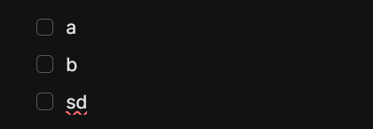
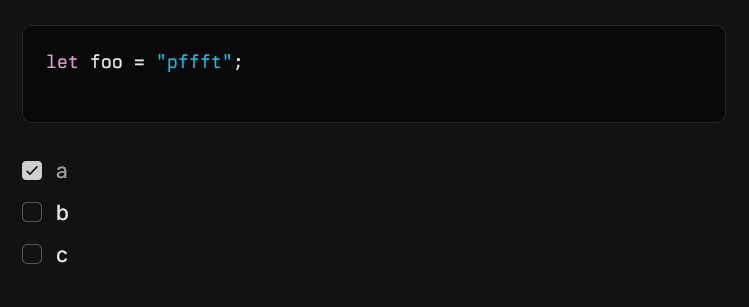

(live mode, or all modes if applicable)

- [ ] make todos look pretty, e.g.: 
- [ ] make code block creation and deletion make sense, I like when backspace in cursor index 0 deletes it
- [ ] make extending and exiting delimited zones make sense, e.g. I cannot extent a code block right now, or in-line code (seems random actually, impossible to use) -- default should be expand, right arrow to exit in-lines. Math doesn't need this because it has visible delimiters when editing, we could just do that since we accept reshuffle anyways while editing
- [ ] select is displayed inconsistently, e.g. the '---' dividers are shown to be selected in two ways, remove the accent border display method and just use normal highlighting
- [ ] shift enter doesn't work with bullet points, literally adds a slash
- [ ] math blocks should have live preview when editing in live mode, a split like:
      source | render
      this way it also doesn't vertically reshuffle as much, only on typing instead of click (which is jarring). Justify both to the center, since it's displayed centered.

---

- [x] check list renders upsettingly, should look like this:
      , like this, edge align, no account fill, check nicely placed, size relative to text perfect
- [ ] image editing, image drag handle, drag-image-onto-image to make a carousel, and selection, and copy and paste
- [ ] drag handles for things that make sense (e.g. bullet lists, check lists)
- [ ] CTRL + F menu reskin
- [ ] in-line commands with '/', but maybe this is a limestone-side feature
