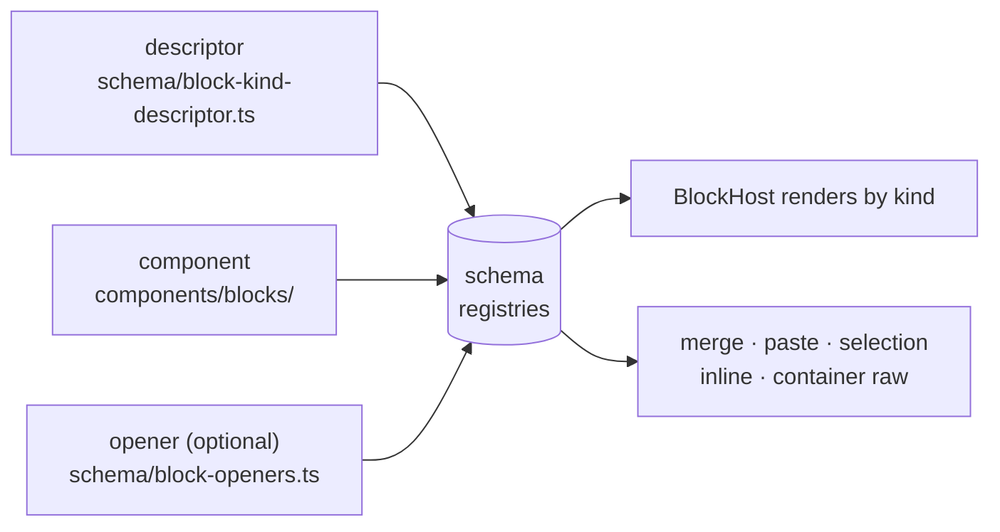

# Adding a Block Type

## What this doc is

You want the editor to understand a new kind of Markdown block — a callout, a footnote, a spoiler. This doc walks you through it.

**It is for built-in blocks — block kinds that ship inside aragonite.** If you're writing a plugin against the published library, you want `docs/guide/plugin-guide.md` instead: plugins build blocks through the `aragonite/plugin` surface (`createContainerBlock`, `createEditableLeaf`), which wraps most of what's below and hides the rest. Everything here is internal machinery. Reach for it only when the block genuinely belongs in the editor core.

Orient from `docs/design/editor.md` first if you haven't.

## The shape of it

A block kind is two registrations and one component. The registries are the only wiring — nothing dispatches on your kind by name, and no other file grows a case for it.



The **descriptor** says what your kind _is_ (mergeable? editable? a container?). The **component** says how it looks and how it takes input. The **opener** teaches the block parser to recognize your syntax — you skip it if your kind emerges from the paragraph fallback (setext headings and tables do).

Everything downstream — merge rules, BlockHost, SelectionOverlay, paste dispatch, the inline pipeline, container-raw rebuild — reads the registries. That's the payoff: adding a kind is additive.

### Pick your category

| Category      | Editing surface                                         | Copy from                                        |
| ------------- | ------------------------------------------------------- | ------------------------------------------------ |
| **Leaf**      | Own editing surface (contenteditable, textarea, static) | TextEditableBlock, CodeBlock, ThematicBreakBlock |
| **Container** | Hosts a recursive BlockList of child blocks             | BlockquoteBlock, ListBlock, ListItemBlock        |

Pick the closest reference and read it fully before starting. It will answer more questions than this doc.

### Where the code lives

| Directory              | Holds                                                           |
| ---------------------- | --------------------------------------------------------------- |
| `components/blocks/`   | Block components (yours goes here)                              |
| `components/`          | Orchestration — Editor, BlockList, BlockHost                    |
| `schema/`              | Block-kind and block-component registries, openers, commands    |
| `editor-actions/`      | Action bundles and the container helpers they compose           |
| `reactivity/`          | `block-list-state` and its `state-registry`                     |
| `ambient/` · `cursor/` | Ambient-prefix rendering/offsets · cursor, sticky column, rects |

## The component

Every block exposes the `BlockComponent` shape: two boolean flags (`editable`, `focusable`) plus focus and cursor methods, with optional extensions for selection and the container focus cascade. A `satisfies BlockComponent` assertion at the bottom of the script enforces it at compile time — if you get the shape wrong, you find out from `npm run check`, not from a user.

### Reading parent contexts

Your block pulls what it needs from concern-specific Svelte contexts. Take only the ones you use.

| Context              | Gives you                                                                  |
| -------------------- | -------------------------------------------------------------------------- |
| `BLOCK_EDIT_KEY`     | `BlockEditActions` — split, merge, delete, content/metadata edits, replace |
| `FOCUS_KEY`          | `FocusActions` — `moveFocus`, `revealPath`                                 |
| `HISTORY_KEY`        | `HistoryActions` — `requestUndo` / `requestRedo`                           |
| `CONTAINER_EDIT_KEY` | `ContainerEditActions` — the container commit surface (below)              |
| `CONTROLLER_KEY`     | The multi-scope commit primitive, for cross-container operations           |

`src/lib/action-contracts.ts` is the authority on every member — read it rather than trusting a list in a doc. Two are worth calling out because they're easy to miss:

- **`descendToBody`** (on `BlockEditActions`) — the reserved-chrome Enter gesture: move the caret out of a chrome leaf into the container's first body child. Load-bearing for any container with a title row.
- **`revealPath`** (on `FocusActions`) — mount an off-window block before placing a caret in it. Windowing means the block you want to focus may not exist in the DOM yet.

Sticky-column entry is not a separate method: it rides on `FocusPosition` (`stickyColumnFrom`) passed to `moveFocus`.

Containers set only the sub-interfaces they override for their children; Svelte's context walk delivers the rest from the nearest ancestor that did set them.

The undo/commit _ceremony_ — commit primitive, snapshot debounce — lives in `editor-actions/commit/undo-controller.ts`. `undo/` holds only the stack and its entry type.

## Registration

### 1. The descriptor

Call `registerBlockKind(kind, registration)` in `schema/block-kind-descriptor.ts`. Core fields: merge role, `editable`, `supportsInline`, and the required `closure` block (below). `BlockKindRegistration` documents every optional hook; the ones you're most likely to want:

| Field                   | For                                                                           |
| ----------------------- | ----------------------------------------------------------------------------- |
| `keymap`                | Declarative chord → command bindings                                          |
| `getContentRange`       | Kinds whose editable span is narrower than their raw (headings)               |
| `blockFocus`            | `'whole-block'` — an opaque childless block joins the focus-then-delete model |
| `contextDependentKind`  | Kinds with no standalone line recognizer, whose container owns their syntax   |
| `renderImagesAsWidgets` | Opting out of image widgets                                                   |
| `foreignDragHitTest`    | Custom drop-target geometry                                                   |

The required `closure` block is the kind's answer to each cross-cutting editor system — one `ClosureCell` per column, `implemented` (name the mechanism in `via`), `inherit-default` (the generic ceremony, nothing kind-specific), or `not-supported` (name the degradation). It stops a kind shipping silently closed under a subsystem nobody asked about. [`docs/guide/plugin-guide.md`](../guide/plugin-guide.md) § "The closure block" walks the columns and the two bootstrap coherence rules (G1.24); [`docs/design/plugin-contract.md`](../design/plugin-contract.md) § "The tier × subsystem closure matrix" is the full row-by-tier reference.

Container kinds declare their container-only fields as one `container` group: required `contract` and `rebuildRaw` (implementations in `schema/container-rebuilders.ts`), optional `reservedChrome`, `containerPaste`, and `unwrapRole` (the Backspace-at-start strategy — see `editor-actions/unwrap-strategies.ts`). `isContainer` is derived from the group's presence, so a leaf carrying container fields won't compile.

### 2. The component

Call `registerBlockComponent(kind, defineBlockComponent(YourBlock, extraProps?))` in `components/built-in-blocks.ts`. Go through `defineBlockComponent` rather than building the entry object by hand — it's the typed constructor, and it enforces at the call site that your component's exported surface really is `BlockComponent` and its props really are a subset of what BlockHost passes.

BlockHost looks up by kind and hands every block the same standard props (`node`, `index`, `myPath`, `ambientPrefix`, `ref`). `extraProps` is a `(node) => Record<string, unknown>` supplying anything beyond that — the heading's `blockClass`, for instance.

### 3. The opener, if you need one

Kinds the block parser must recognize on a line register `registerBlockOpener(kind, { priority, tryOpen, interruptsParagraph })` in `schema/block-openers.ts` — built-ins do this from `core/parsers/built-in-openers.ts`.

Priority orders the parser's attempts, ascending; the built-ins occupy a 10–80 ladder, so slot yours against them. Give each kind its own priority. Ties are _deterministic_ (dispatch falls back to kind name, never registration order) but almost always unintended, so G1.10 warns on one at bootstrap.

### Commands

A component that declares a `keymap` — or that can be a cross-block focus target — implements `runCommand(id, arg?): boolean`, the block-local bodies the keybinding dispatcher invokes. New ids go in `BLOCK_COMMAND_IDS` (`schema/commands.ts`); G1.11 fires at bootstrap if a keymap names an unknown command or duplicates a chord. See `docs/design/editor.md` § Schema.

**Command bodies read the caret live** (`cursor.getRaw()`), never a keydown-captured offset — cross-block dispatch invokes them without a keydown of their own.

## Container blocks

> Internal plumbing. A plugin container gets all of this from `createContainerBlock` and should never touch the primitives below directly — see `docs/guide/plugin-guide.md`.

A container builds its reactive state and a default action bundle from the `editor-actions/` primitives, then overrides only what needs kind-specific behavior.

**`createBlockListState(() => node)`** — reactive `innerBlockIds` / `innerBlockRefs`.

Pass the node **as a getter, never by value.** A by-value argument freezes on the node your container mounted with and misses undo's deep-clone reassignment — the state silently points at a tree nobody is rendering. This is the incident behind culture.md's "reactive state crosses module boundaries as getters, never values", and invariant G4.1 scans every call site in the editor for it.

**`createStandardNestedActions(state, deps, overrideFactory?)`** — a complete `{ blockEdit, focus, containerEdit }` bundle. Its methods handle the split/merge/delete/content/replace ceremony uniformly, and Backspace-at-start dispatches by the kind's declared `unwrapRole`. Containers needing custom behavior pass an `overrideFactory`: it receives the fully-built default bundle and returns per-sub-interface partial overrides, which chain back by calling `defaults.blockEdit.splitBlock(...)` directly. The override set is visible at the call site and type-checked against each sub-interface — no post-construction method reassignment.

A trivial container (a collapsible section, say) calls `createStandardNestedActions(state, deps)` with no overrides and is done. A non-trivial one passes an override factory returning only the methods it customizes — `list-overrides.ts` and `blockquote-overrides.ts` under `editor-actions/` are the canonical examples.

**`dispatchFocusByPath` / `dispatchFocusAtColumn`** — the pure dispatchers your `focusByPath` / `focusAtColumn` exports delegate to.

**`setNestedActionsContexts(bundle)`** — publishes the bundle to nested descendants in one call.

Two things containers do _not_ do: they don't set `HISTORY_KEY` (undo/redo walks up to the editor root), and they don't rebuild their own raw (the commit primitives rebuild the unshared spine after every structural mutation, invoking the `rebuildRaw` you declared at registration).

### The owned-scope contract

Undo snapshots share the live tree's nodes. So a container commit hands its `mutate` an owned `ContainerScope` — the container, already copied out of sharing, with its working `children` attached. Write through `scope.node` / `scope.children`, never through a reference captured before the commit: those may be snapshot-shared originals, and writing through them corrupts undo history (G1.9).

```ts
// wrong — `node` (the component prop) may still be shared with an undo entry
mutate: (scope) => deleteNode(node, index, scope.sharing);

// right — the scope view is yours to mutate
mutate: (scope) => deleteNode(scope.node, index, scope.sharing);
```

The same rule covers `commitMultiScope`'s per-scope views.

`ContainerEditActions` also carries the two seams for writes _outside_ a commit — `withUnsharedSpine` (copy-path-on-write for raw sync after routine typing) and `pushDebouncedCheckpoint` / `nudgeReactivity` (bracket the typing mutation, then publish it to Svelte). Prefer `commitContainer` — or `commitMultiScope` for cross-container ops — unless you have a reason to mutate raw yourself.

### Virtual rendering

Leaf blocks need no windowing work: BlockHost measures their height generically, so VR is invisible to a leaf author.

A container renders a windowed slice of its children, and wires one hook — `useContainerWindowing(deps)` — with thunks naming its variation:

| Thunk                         | Supplies                                                                        |
| ----------------------------- | ------------------------------------------------------------------------------- |
| `getIndex` / `getParentPath`  | This scope's slot in its parent, and its own path                               |
| `getChildren` / `getChildIds` | The live child nodes and their ids                                              |
| `getListEl`                   | The content-origin element that scrolls with the children — not the viewport    |
| `getOwnEl`                    | The element the parent measures for this scope's height (omit at the root)      |
| `provideLeafChannel`          | `true` when direct children are BlockHosts; `false` for direct-`{#each}` scopes |

The hook reads the windowing contexts — height oracle, focus path, width version, parent sink — internally. You never touch the oracle, the Fenwick model, the sinks, or the channels. It returns a handle: render the window slice into your `{#each}`, and feed `revealChild` / `isInWindow` into `createContainerBlockComponent` so off-window focus and path reveal resolve a mounted child.

Copy from `ListBlock.svelte` (direct-each) or `TableBlock.svelte` (row windowing).

### Interactive ambient markers

A container's `ambientPrefix` is either inert text (the default) or carries interactive character ranges — clickable regions inside the read-only prefix. The `AmbientPrefix` contract is in `docs/design/editor.md`.

- **Inert:** return a string from the component's prefix getter — the list item's `- `. (The blockquote passes no prefix at all; its `> ` markers render as border-only chrome.)
- **Interactive:** return the object form — `text` plus one or more ranges (character offsets, className, optional role/ARIA, click handler).

Keep the component thin: define a pure `buildXAmbient(metadata, onAction)` helper alongside it and call that from the prefix getter. Task checkboxes are the canonical example (`components/blocks/list/task-checkbox.ts`). The helper is unit-testable without mounting anything, and render-path DEV warnings for malformed metadata live in it.

## Sticky-column participation

Every editable block — prose or code — participates in the pixel-X sticky column, so a caret walking up a ragged column doesn't drift left.

1. **Capture on vertical arrows.** In `onKeyDown`, when the key is `ArrowUp` or `ArrowDown`, call `stickyColumn.capture(getCurrentCursorEditorRelativeX(el))`. It's idempotent — it only records if sticky is currently null.
2. **Reset on non-preserve keys.** In the same handler, for any key not in `PRESERVE_KEYS_NON_ARROW` and not a vertical arrow, call `stickyColumn.reset()`. Also reset on `onPointerDown`, `onCompositionStart`, `onCopy`, `onCut`, and `onPaste`.
3. **Implement `focusAtColumn(x, from)`** using `findOffsetNearestX(el, x, from)` from `cursor/sticky-measure.ts`: place the cursor at the nearest offset on the first (`from === 'above'`) or last (`from === 'below'`) visual line.

`TextEditableBlock.svelte` and `CodeBlock.svelte` share the implementation shape — reference either.

## Adding a code-block language

Not a new block kind, but it lands here. Edit `components/blocks/code/code-bootstrap.ts`:

1. Import the language from `highlight.js/lib/languages/<name>`.
2. Call `registerLanguage('<name>', <name>, ['alias1', 'alias2'])` inside `bootstrapCodeLanguages()`.

Nothing else changes. The language is live on the next editor mount.

## Testing

**Requirements first, then tests, then implementation.**

Complex blocks (lists, tables) get a requirement file in `src/lib/e2e/requirements/blocks/` and a spec in `src/lib/e2e/tests/blocks/`, one-to-one. Simple blocks are covered by the feature-level suites. See `docs/contributing/testing.md`.
