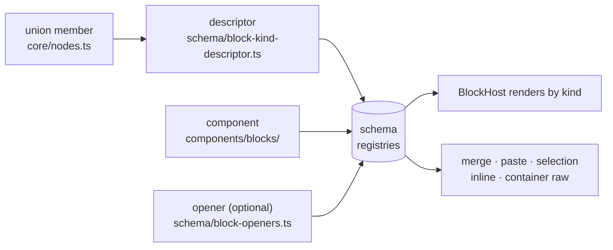

# Adding a Block Type

So you want the editor to understand a new kind of Markdown block: a callout, a spoiler, a footnote. This doc walks you through it, **for built-in blocks only**, meaning kinds that ship inside aragonite. If you're writing a plugin against the published library, stop here and read [`docs/guide/plugin-guide.md`](../guide/plugin-guide.md) instead; plugins get most of what's below through `createContainerBlock` and `createEditableLeaf` from `@voithos-labs/aragonite/plugin`. Everything here is internal machinery, and honestly, a block that belongs in the core is rarer than it feels at the moment you want one.

The plugin guide is also where the concepts live now: what a kind is, what a descriptor declares, how an opener claims lines, what the closure block promises. I'll gloss each in passing, but this doc covers only what a built-in author touches that a plugin author never sees. Orient from `docs/design/editor.md` first if you haven't; it'll save you at least one wrong turn.

| Section                                                       | What it covers                                                                                      |
| ------------------------------------------------------------- | --------------------------------------------------------------------------------------------------- |
| [The shape of it](#the-shape-of-it)                           | The four pieces a built-in block is made of, and why the list is that short                         |
| [Registration](#registration)                                 | The edit sites, in order: the type union, the behavior record, the component, the parser hook       |
| [Commands](#commands)                                         | Keyboard shortcuts your block answers, and the one rule their handlers follow                       |
| [Reading parent contexts](#reading-parent-contexts)           | What the editor hands your component, and the two entries everyone misses                           |
| [Container blocks](#container-blocks)                         | The internal primitives a container is assembled from, and the mutation contract that protects undo |
| [Sticky-column participation](#sticky-column-participation)   | Keeping the caret's pixel column stable while arrowing through ragged lines                         |
| [Adding a code-block language](#adding-a-code-block-language) | Not a block kind, but this is where everyone looks for it                                           |
| [Testing](#testing)                                           | The requirement files, and the two enrolment maps that keep coverage honest                         |

## The shape of it

A built-in block kind is a **union member**, two registrations, and one component. That's the whole inventory. Past `core/nodes.ts`, the registries are the only wiring; nothing else dispatches on your kind by name.



The **union member** is what makes the rest type-check. The **descriptor** says what your kind _is_ (mergeable? editable? a container?). The **component** says how it looks and how it takes input. The **opener** teaches the block parser to recognize your syntax, and you skip it entirely if your kind emerges from the paragraph fallback (setext headings and tables do).

Everything downstream reads the registries (merge rules, BlockHost, the selection overlay, paste, the inline pipeline, container raw rebuild), which is why the inventory is that short. Adding a kind is additive.

First decision, before any code: which category is yours?

| Category      | Editing surface                                         | Copy from                                        |
| ------------- | ------------------------------------------------------- | ------------------------------------------------ |
| **Leaf**      | Own editing surface (contenteditable, textarea, static) | TextEditableBlock, CodeBlock, ThematicBreakBlock |
| **Container** | Hosts a recursive BlockList of child blocks             | BlockquoteBlock, ListBlock, ListItemBlock        |

Pick the closest reference and read it fully before you start. It'll answer more of your questions than this doc will, and I say that as the person who wrote this doc. Where things live:

- `components/blocks/`: the reference components.
- `schema/`: the registries you'll touch.
- `editor-actions/` and `reactivity/`: the primitives a container builds on.
- `ambient/` and `cursor/`: markers and caret geometry.

## Registration

### 0. The union member

Everything below fails to compile until `core/nodes.ts` knows your kind, which is the compiler doing you a favour. Four edits, all in that one file:

1. Add the kind string to `LeafBlockKind` or `ContainerBlockKind`.
2. Add its `true` entry to `BLOCK_KIND_TABLE`. It's a `Record<BlockKind, true>` precisely so the compiler flags the member you forgot.
3. Declare the node interface and add it to the `BuiltinCstNode` union, so `switch (node.kind)` narrows without a cast.
4. If the kind carries metadata, declare its shape and add it to both `BlockMetadata` and `BlockMetadataByKind`. A kind with no metadata declares `metadata?: undefined` on its node interface and stays out of both maps, which is what makes `metadataOf` refuse it.

The thematic break's four, trimmed to its own lines:

```ts
// core/nodes.ts
export type LeafBlockKind = 'heading' | /* ... */ 'thematicBreak' | /* ... */ 'unrecognized';

export const BLOCK_KIND_TABLE: Record<BlockKind, true> = { /* ... */ thematicBreak: true /* ... */ };

export interface ThematicBreakMetadata {
	marker: string;
}
export interface ThematicBreakNode extends LeafBlockNodeBase {
	kind: 'thematicBreak';
	metadata: ThematicBreakMetadata;
}
export type BuiltinCstNode = ParagraphNode | /* ... */ ThematicBreakNode | /* ... */ TableRowNode;

export type BlockMetadata = HeadingMetadata | /* ... */ ThematicBreakMetadata | /* ... */ ListItemMetadata;
export interface BlockMetadataByKind {
	/* ... */
	thematicBreak: ThematicBreakMetadata;
	/* ... */
}
```

### 1. The descriptor

Call `registerBlockKind(kind, registration)` from `schema/built-in-descriptors.ts` (the registry itself is `schema/block-kind-descriptor.ts`). Five fields are required: `gapEdges`, `mergeRole`, `editable`, `supportsInline`, and the `closure` block. Here's the thematic break's, the smallest built-in:

```ts
// schema/built-in-descriptors.ts
registerBlockKind('thematicBreak', {
	mergeRole: 'not-mergeable',
	editable: false,
	supportsInline: false,
	blockFocus: 'whole-block',
	// Leading edge only: its focused Enter already inserts a paragraph below.
	gapEdges: 'before',
	keymap: [
		{ chord: 'Alt+ArrowUp', command: 'block.moveUp' },
		{ chord: 'Alt+ArrowDown', command: 'block.moveDown' }
	],
	conformanceFixture: '---\n',
	closure: {
		roundTrip: { mode: 'inherit-default' },
		reorder: { mode: 'implemented', via: 'Alt+Arrow block.move keymap' },
		undo: { mode: 'inherit-default' }
		// ...one cell per column; a missing one is a compile error
	}
});
```

`gapEdges` names the edges of your block that can't host a caret for inserting a sibling paragraph (`'before'`, `'after'`, `'both'`, or `'none'`); at those edges the editor parks a gap caret instead, a caret between two blocks where neither surface can hold one. `mergeRole` is one of `prose`, `prose-absorber`, `container`, `self-merge`, `not-mergeable`, and `docs/design/editor.md` § "Merge eligibility: roles, not pairs" says which roles merge with which. The optional fields, every one of them:

| Field                   | For                                                                                                                                               |
| ----------------------- | ------------------------------------------------------------------------------------------------------------------------------------------------- |
| `keymap`                | Declarative chord → command bindings; see [Commands](#commands)                                                                                   |
| `conformanceFixture`    | Source that parses to your kind. **The field the conformance kit enrols on** ([Testing](#testing))                                                |
| `getContentRange`       | Kinds whose editable span is narrower than their raw (a heading's `# `)                                                                           |
| `contentStartBackspace` | `'demote-first'`: Backspace at the content start drops the kind's own markers before it merges (headings, again)                                  |
| `blockFocus`            | `'whole-block'`: an opaque childless block joins the focus-then-delete model (arrows stop on it; Backspace focuses it, a second press deletes it) |
| `contextDependentKind`  | Kinds with no standalone line recognizer, whose container owns their syntax (a table cell)                                                        |
| `normalizeRawWrite`     | Make a written raw legal as this kind's own bytes; the fenced code's rule is `schema/fenced-code-raw.ts`                                          |
| `renderImagesAsWidgets` | `false` opts out of image widgets (a table cell renders the alt text instead)                                                                     |
| `foreignDragHitTest`    | Custom drop-target geometry: the EXACT hit, declining off-target                                                                                  |
| `caretTargetAtPoint`    | Where a caret-placing gesture lands inside the block: the NEAREST target                                                                          |
| `estimateHeight`        | An O(1) height guess for windowing, when the default guess is far off for your kind                                                               |

The `closure` block is the kind's written answer to every cross-cutting editor system (focus, selection paint, search, undo, and so on), one cell per column. The plugin guide teaches it cell by cell in ["The closure block"](../guide/plugin-guide.md), and `docs/design/plugin-contract.md` § "Editable content and the closure matrix" is the full reference, so I won't repeat it. What's built-in specific is where the presets live:

- `simpleLeafClosure` (`schema/closure.ts`): a not-mergeable, source-editable leaf. Bakes the five cells such leaves always answer the same way, and still demands the four your component decides (`focus`, `searchPaint`, `undo`, `simOracle`).
- `containerClosure` (`schema/closure.ts`): a container whose body is its children's bytes inside its own markers (the `'strip'` contract, below). Bakes the four structural cells and `roundTrip`, demands the rest.
- `proseLeafClosure`, file-local to `built-in-descriptors.ts`: the prose trio (paragraph, heading, setext heading).
- Anything else writes its cells by hand, like the thematic break above. A missing cell is a compile error either way.

A container declares its container-only fields as one `container` group, and `isContainer` is derived from the group's presence, so a leaf carrying container fields won't compile. The blockquote's group:

```ts
// schema/built-in-descriptors.ts
container: {
	contract: 'strip',
	rebuildRaw: rebuildBlockquoteRaw,
	containerPaste: { matchesAncestor: () => true, siblingAbsorb: false },
	unwrapRole: {
		firstChildBackspace: 'lift-first-child',
		middleChildBackspace: 'default-merge',
		quoteShaped: true
	},
	contentStartSpace: 'complete-marker',
	reorderChildren: {}
},
```

Required, together:

- `contract` and `rebuildRaw`: how the container re-derives its own bytes from its children. `'strip'` means the body is the children's bytes wrapped in your markers (the blockquote, the list), `'grid'` means cells parse straight from the raw (the table), and `'opaque'` means the raw is authoritative and `rebuildRaw` must be deterministic. Implementations live in `schema/container-rebuilders.ts`.

Optional, each earning its place:

- `reservedChrome`: child 0 is a title leaf whose bytes live in the container's own raw (chrome: the parts of a block that are furniture, not content). Register the chrome kind itself through `registerChromeLeaf`.
- `containerPaste`: kind-specific paste routing, for a clipboard whose top block is your kind landing inside a same-kind ancestor.
- `unwrapRole`: the Backspace-at-start strategy; see `editor-actions/unwrap-strategies.ts`.
- `bodyWrap`: for a container whose body sits between its own opener and closer lines (a `:::note` fence, say). Pass the same wrap your opener parsed the body with, and the parser then peels the blank line next to the chrome into the wrap instead of into a body block.
- `bodyWrite`: for a container with a fixed closing line (`</details>`) that a body edit could accidentally type. `normalize` escapes it out of a child's raw, and `mapOffset` says where the caret lands after the escape.
- `contentStartSpace: 'complete-marker'`: a space typed at the start of an empty child gets eaten, because the marker your `rebuildRaw` emits already carries it. Only sound when `rebuildRaw` does put that space back.
- `reorderChildren`: this container's direct children reorder among themselves, by drag or Alt+↑/↓; `{ renumberMarkers: true }` for an ordered list. See `tree-operations/reorder-unit.ts`.

### 2. The component

Call `registerBlockComponent(kind, defineBlockComponent(YourBlock, extraProps?))` in `components/built-in-blocks.ts`:

```ts
// components/built-in-blocks.ts
registerBlockComponent('thematicBreak', defineBlockComponent(ThematicBreakBlock));
registerBlockComponent('heading', defineBlockComponent(TextEditableBlock, headingExtraProps));

function headingExtraProps(node: NodeView): Record<string, unknown> {
	const level = metadataOf(node, 'heading')?.level ?? 1;
	return { blockClass: `heading-${level}` };
}
```

Go through `defineBlockComponent` rather than building the entry object by hand. It's the typed constructor, and it checks at the call site that your component publishes one of the two surface shapes and that its props are a subset of what BlockHost passes, so a wrong shape is something `npm run check` tells you about rather than a user. The two shapes: a leaf exports its surface as instance exports and ends with `satisfies BlockComponent`, a container exports a single `containerApi`. The thematic break's tail, as a leaf:

```ts
// components/blocks/ThematicBreakBlock.svelte
export const editable = false;
export const focusable = true;
export const focus = placeCaret(selection, parkCaret);
export function parkCaret(_offset: number): void { /* ... */ }
export function getCursorOffset(): number | null { /* ... */ }
export function runCommand(id: CommandId): boolean { /* ... */ }
void ({ editable, focusable, focus, parkCaret, getCursorOffset, runCommand } satisfies BlockComponent);
```

What each method owes is the plugin guide's territory; it's identical for built-ins.

BlockHost looks your component up by kind and hands every block the same props: `node`, `index`, `myPath`, `ambientPrefix`, plus `document` (the root, read-only, so a block at any depth can read the structure above it) and `rects` (measure, reveal, and scroll by path). `extraProps` is a `(node) => Record<string, unknown>` for anything beyond that, like the heading's `blockClass` above. BlockHost `bind:this`-es your component and reads the surface off its exports; you publish it and never hold a handle to it.

### 3. The opener, if you need one

A kind the block parser must recognize on a line registers an opener: `registerBlockOpener(kind, { priority, tryOpen, interruptsParagraph })` from `schema/block-openers.ts`, called from `core/parsers/built-in-openers.ts`. How an opener claims lines, interrupts paragraphs, and consumes multi-line constructs is the plugin guide's ["Teaching the parser"](../guide/plugin-guide.md); the built-in wiring is what's here.

```ts
// core/parsers/built-in-openers.ts
registerBlockOpener('thematicBreak', {
	priority: OPENER_PRIORITIES.thematicBreak,
	tryOpen(ctx) {
		const marker = matchThematicBreak(ctx.line.text);
		if (!marker) return null;
		return {
			node: { kind: 'thematicBreak', leadingTrivia: ctx.leadingTrivia, raw: ctx.line.raw, metadata: { marker } },
			consumed: 1
		};
	},
	// `---` is ambiguous with a setext L2 underline, which has first claim.
	interruptsParagraph: (t) => {
		const marker = matchThematicBreak(t);
		return marker === '*' || marker === '_';
	}
});
```

Priority orders the parser's attempts, ascending, and the built-in ladder is single-sourced in `schema/opener-priorities.ts`, so slot yours against that constant rather than a number copied from a doc:

```ts
// schema/opener-priorities.ts
export const OPENER_PRIORITIES = {
	fencedCode: 10,
	heading: 20,
	thematicBreak: 30,
	blockquote: 40,
	list: 50,
	indentedCode: 60,
	htmlBlock: 70,
	linkReferenceDefinition: 80
} as const satisfies Partial<Record<BlockKind, number>>;
```

Give each kind its own priority. A tie is deterministic (dispatch falls back to kind name, never registration order) but almost always unintended, so G1.10 warns on one at bootstrap.

## Commands

A component that declares a `keymap`, or that can be a cross-block focus target, implements `runCommand(id, arg?): boolean`: the block-local bodies the keybinding dispatcher invokes. New ids go in `BLOCK_COMMAND_IDS` (`schema/commands.ts`), and G1.11 fires at bootstrap if a keymap names an unknown command or binds one chord twice. `docs/design/editor.md` § Schema has the dispatch story. The thematic break answers only the two reorder chords, so its body is one line:

```ts
// components/blocks/ThematicBreakBlock.svelte
export function runCommand(id: CommandId): boolean {
	return reorderRunCommand(id, reorder, () => myPath);
}
```

A binding can carry an argument, which is how one command serves seven chords:

```ts
{ chord: 'Mod+1', command: 'heading.cycle', arg: 1 },
{ chord: 'Mod+2', command: 'heading.cycle', arg: 2 },
```

**Command bodies read the caret live** (`cursor.getRaw()`), never an offset captured at keydown, because cross-block dispatch invokes them without a keydown of their own.

## Reading parent contexts

Your block pulls what it needs from concern-specific Svelte contexts. Take only the ones you use:

```ts
// components/blocks/list/ListBlock.svelte
const parentBlockEdit = getContext<BlockEditActions>(BLOCK_EDIT_KEY);
const parentFocus = getContext<FocusActions>(FOCUS_KEY);
const { controller, stickyColumn, selection, registryView } =
	getContext<EditorServices>(EDITOR_SERVICES_KEY);
```

| Context                     | Gives you                                                                         |
| --------------------------- | --------------------------------------------------------------------------------- |
| `BLOCK_EDIT_KEY`            | `BlockEditActions`: split, merge, delete, content/metadata edits, replace         |
| `FOCUS_KEY`                 | `FocusActions`: `moveFocus`, `revealPath`                                         |
| `HISTORY_KEY`               | `HistoryActions`: `requestUndo` / `requestRedo`                                   |
| `CONTAINER_EDIT_KEY`        | `ContainerEditActions`: the container commit surface (below)                      |
| `EDITOR_SERVICES_KEY` facet | `.controller` is the multi-scope commit primitive, for cross-container operations |

`src/lib/action-contracts.ts` is the authority on every member, so read it rather than trusting a list in a doc. This one included. The keys themselves live next door in `src/lib/editor-keys.ts`, which is where you go when you grep the contracts file for `BLOCK_EDIT_KEY` and come up empty. Two members are easy to miss:

- **`descendToBody`** (on `BlockEditActions`) is the Enter gesture out of a title row: it moves the caret from a chrome leaf into the container's first body child. Any container with a title row wants it.
- **`revealPath`** (on `FocusActions`) mounts an off-window block before you place a caret in it. The editor only mounts the blocks near the viewport, so the block you want to focus may not exist in the DOM yet.

Sticky-column entry isn't a separate method. It rides on the `FocusPosition` you pass to `moveFocus`:

```ts
// editor-actions/container-block-component.ts
if (key === 'ArrowUp') void deps.focus.moveFocus(index - 1, { stickyColumnFrom: 'below' });
```

Containers set only the sub-interfaces they override for their children; Svelte's context walk delivers the rest from the nearest ancestor that did set them.

The undo/commit ceremony (the fixed steps a commit always runs: the commit primitive, the snapshot debounce) lives in `editor-actions/commit/undo-controller.ts`. `undo/` holds only the stack and its entry type.

## Container blocks

> Internal plumbing. A plugin container gets all of this from `createContainerBlock` and should never touch the primitives below directly. See [`docs/guide/plugin-guide.md`](../guide/plugin-guide.md).

First, the cheap way out. A container with nothing kind-specific to say can use the same `createContainerBlock` the plugins use. The blockquote does, and its whole script is this:

```svelte
<!-- components/blocks/BlockquoteBlock.svelte -->
<script lang="ts">
	const { blockListProps, containerApi } = createContainerBlock({
		getNode: () => node,
		getIndex: () => index,
		getPath: () => myPath,
		getBoxEl: () => boxEl
	});

	export { containerApi };
</script>

<div class="blockquote-block" bind:this={boxEl}>
	<BlockList {...blockListProps} reorderable={true} />
</div>
```

The list and the table assemble the primitives by hand, and that's what the rest of this section is about. A container builds its reactive state and a default action bundle from the `editor-actions/` primitives, then overrides only what genuinely needs kind-specific behavior. That's usually less than you expect going in.

**`createBlockListState(() => node)`** gives you the scope's `innerBlockIds` / `innerBlockRefs` (a scope: one block list and its children, the unit of addressing and windowing).

Pass the node **as a getter, never by value.** A by-value argument freezes on the node your container mounted with and misses the deep-clone reassignment an undo does, so the state ends up pointing at a tree nobody's rendering. Nothing throws. This is the incident behind rules.md's "reactive state crosses module boundaries as getters, never values" (`casebook.md`), and G4.1 scans every call site in the editor for it.

**`createStandardNestedActions(state, input, overrideFactory?)`** hands back a complete `{ blockEdit, focus, containerEdit }` bundle. Its methods handle split, merge, delete, content, and replace uniformly, and Backspace-at-start dispatches by the kind's declared `unwrapRole`. `input` is a `NodeScope` (three getters, `index`, `node`, `path`, passed by reference so nothing snapshots them) plus the parent's bundle and a few editor services. The list's wiring:

```ts
// components/blocks/list/ListBlock.svelte
const scope: NodeScope = {
	get index() { return index; },
	get node() { return node; },
	get path() { return myPath; }
};

const bundle = createStandardNestedActions(
	listState,
	{
		scope,
		stickyColumn,
		grammar: registryView.grammar,
		getPresentationMode,
		linkRef,
		parentListContext,
		parent: { blockEdit: parentBlockEdit, focus: parentFocus, containerEdit: parentContainerEdit }
	},
	createListOverrides({ scope, parentBlockEdit })
);

setNestedActionsContexts(bundle);
```

A container needing custom behavior passes an `overrideFactory`. It receives the fully-built default bundle and returns per-sub-interface partial overrides, which chain back by calling `defaults.blockEdit.splitBlock(...)` directly, so the override set is visible at the call site and type-checked against each sub-interface. The list declining a split and delegating only its last item's forward merge:

```ts
// editor-actions/list-overrides.ts
export function createListOverrides(deps: ListOverridesDeps): NestedActionsOverrideFactory {
	return () => ({
		blockEdit: {
			splitBlock: async (): Promise<void> => {},
			updateBlockContent: (): void => {},
			mergeWithNext: async (itemIndex: number): Promise<void> => {
				const node = deps.scope.node;
				if (!node.children) return;
				if (itemIndex >= node.children.length - 1) {
					await deps.parentBlockEdit.mergeWithNext(deps.scope.index);
				}
			}
		}
	});
}
```

A trivial container calls `createStandardNestedActions(state, input)` with no overrides and is done. `list-overrides.ts` and `container-exit-overrides.ts` under `editor-actions/` are the two shipped examples.

**`dispatchFocusByPath` / `dispatchFocusAtColumn`** (`editor-actions/focus/focus-dispatch.ts`) are the pure dispatchers your `focusByPath` / `focusAtColumn` exports delegate to.

**`setNestedActionsContexts(bundle)`** publishes the bundle to nested descendants in one call.

Two things containers don't do: they don't set `HISTORY_KEY` (undo/redo walks up to the editor root), and they don't rebuild their own raw. The commit primitives rebuild the unshared spine (the chain of parents from the root down to the edited node, already copied out of sharing) after every structural mutation, invoking the `rebuildRaw` you declared at registration.

### The owned-scope contract

Undo snapshots share the live tree's nodes. So a container commit hands its `mutate` an owned `ContainerScope`: the container, already copied out of sharing, with its working `children` attached. Write through `scope.node` / `scope.children`, never through a reference captured before the commit. Those may be snapshot-shared originals, and writing through them corrupts undo history (G1.9), quietly, in a file somebody opens next week.

```ts
// wrong: `node` (the component prop) may still be shared with an undo entry
mutate: (scope) => deleteNode(node, index, scope.sharing);

// right: the scope view is yours to mutate
mutate: (scope) => deleteNode(scope.node, index, scope.sharing);
```

A whole commit, from the table inserting a row:

```ts
// editor-actions/table-context.ts
await parentContainerEdit.commitContainer({
	containerNode: node,
	path: [...myPath],
	state: rowsState,
	snapshot: { path: extendDocPath(myPath, rowIdx), offset: 0 },
	mutate: (scope) => {
		insertEmptyRow(scope.node, rowIdx, side);
		scope.sharing.stamp(scope.children[insertAt]);
		rebuildTableRowRaw(scope.children[insertAt]);
		return { op: 'insert', at: insertAt, count: 1 };
	},
	op: { kind: 'tableInsertRow', detail: { rowIdx, side }, eventPath: extendDocPath(myPath, insertAt) },
	afterTick: () => {
		focusCell(insertAt, 0, 'start');
	}
});
```

`snapshot` is where the caret was, for the undo entry. `mutate` returns the structural change it made so the commit can publish it, `op` names the operation for the edit event and the operations log, and `afterTick` runs after the DOM has caught up, which is where a caret gets placed. The same rule covers `commitMultiScope`'s per-scope views.

`ContainerEditActions` also carries the entries for writes _outside_ a commit: `withUnsharedSpine` (copy-path-on-write for raw sync after routine typing) and `pushDebouncedCheckpoint` / `nudgeReactivity` (bracket the typing mutation, then publish it to Svelte). Prefer `commitContainer`, or `commitMultiScope` for cross-container ops, unless you have a real reason to mutate raw yourself.

### Virtual rendering

Leaf blocks need no windowing work: BlockHost measures their height generically, so windowing is invisible to a leaf author.

A container renders a windowed slice of its children and wires one hook, `useContainerWindowing(opts)`, with getters naming its variation. The list's:

```ts
// components/blocks/list/ListBlock.svelte
const windowing = useContainerWindowing({
	getIndex: () => index,
	getParentPath: () => myPath,
	getChildren: () => node.children ?? [],
	getChildIds: () => listState.innerBlockIds,
	getListEl: () => boxEl ?? null,
	getOwnEl: () => boxEl?.closest('.block-host') ?? null,
	provideLeafChannel: false
});
```

| Getter                        | Supplies                                                                             |
| ----------------------------- | ------------------------------------------------------------------------------------ |
| `getIndex` / `getParentPath`  | This scope's slot in its parent, and its own path                                    |
| `getChildren` / `getChildIds` | The live child nodes and their ids                                                   |
| `getListEl`                   | The content-origin element that scrolls with the children, not the viewport          |
| `getOwnEl`                    | The element the parent measures for this scope's height (omit at the root)           |
| `provideLeafChannel`          | `true` when direct children are BlockHosts; `false` for direct-`{#each}` scopes      |
| `isCollapsed`                 | Optional: `true` while only the chrome row should be mounted (a collapsed container) |

The hook reads the rest of the windowing machinery (the height estimates, the focused path, the width counter, the parent's measurement sink) from context itself; you never touch any of it. It returns a handle: render `windowing.window`'s slice into your `{#each}`, and feed `revealChild` / `isInWindow` into `createContainerBlockComponent` so an off-window focus or reveal resolves a mounted child:

```ts
// components/blocks/list/ListBlock.svelte
export const containerApi = createContainerBlockComponent({
	selection,
	get innerBlockRefs() { return listState.innerBlockRefs; },
	refSlots: listState.refSlots,
	get nodeChildrenLength() { return node.children?.length ?? 0; },
	get node() { return node; },
	revealChild: windowing.revealChild,
	isInWindow: windowing.isInWindow
});
```

Copy from `ListBlock.svelte` (direct-each) or `TableBlock.svelte` (row windowing).

### Interactive ambient markers

A container's `ambientPrefix` (the read-only marker a container lends its first child, like a list's `- `) is either inert text, the default, or carries interactive character ranges, meaning clickable regions inside the read-only prefix:

```ts
// block-component.ts
type AmbientPrefix = string | { text: string; interactive?: AmbientInteractiveRange[] };
```

- **Inert:** return a string, the list item's `- `. (The blockquote passes no prefix at all; its `> ` markers render as border-only chrome.)
- **Interactive:** return the object form: `text` plus one or more ranges, each a character span, a class name, an optional role and ARIA state, and a click handler.

Keep the component thin: a pure `buildXAmbient(metadata, onAction)` helper beside it, called from the prefix getter. The task checkbox is the shipped example, and the list item hands it to its `BlockList` as `ambientPrefixForFirst={buildTaskItemAmbient(metadataOf(node, 'listItem'), toggleTask)}`:

```ts
// components/blocks/list/task-checkbox.ts
return {
	text: listMarker + metadata.taskMarker, // '- [ ] '
	interactive: [
		{
			start: boxStart,
			end: boxStart + 3,
			className: 'task-checkbox',
			role: 'checkbox',
			ariaChecked: isTaskMarkerChecked(metadata.taskMarker),
			onClick: onToggle
		}
	]
};
```

The helper is unit-testable without mounting anything, and the dev warning for malformed metadata lives in it too. The `AmbientPrefix` contract is in `docs/design/editor.md`.

## Sticky-column participation

Every editable block, prose or code, participates in the pixel-X sticky column, so a caret walking up a ragged column doesn't drift left. Nobody praises this when it works and everybody notices the moment it doesn't.

The good news: if your block routes its keydown through `handleSharedKeydown` (`selection/shared-keydown.ts`) and builds its surface with `createEditableSurface` (`components/blocks/editable-surface.ts`), you already participate and there's nothing to write. The shared handler feeds every keydown to the sticky column:

```ts
// selection/shared-keydown.ts
ctx.stickyColumn.noteKey(e, () => getCurrentCursorEditorRelativeX(el));
```

`noteKey`'s pure key matrix decides whether the press captures the column, resets it, or preserves it, and the editable surface owns the resets a keydown can't see (an input commit, composition included, plus copy, cut, and paste) along with `focusAtColumn` itself. `TextEditableBlock.svelte` and `components/blocks/code/CodeBlock.svelte` share this shape, so reference either.

A hand-rolled surface takes on both halves itself:

1. **Feed every keydown to `noteKey`**, as above. It's the one entry a keydown handler may use (`cursor/sticky-column.ts` says so in its header); pass the live-caret measure as the second argument so a capture key has an X to record. `reset()` stays public only for callers with no key to classify (lifecycle, commit, undo, paste).
2. **Implement `focusAtColumn(x, from)`** with `findOffsetNearestX(el, x, from)` from `cursor/sticky-measure.ts`: place the cursor at the nearest offset on the first (`from === 'above'`) or last (`from === 'below'`) visual line. The editable surface's version, which also keeps the scan out of the marker region:

```ts
// components/blocks/editable-surface.ts
function focusAtColumn(x: number, from: StickyColumnDirection): void {
	const el = deps.getEl();
	if (!el) return;
	el.focus();
	const ambientLength = deps.getAmbientLength();
	const minOffset = toDomTextOffset(asRawOffset(0), ambientLength);
	const walkOffset = findOffsetNearestX(el, asEditorX(x), from, minOffset);
	deps.backend.setRaw(toClampedRawOffset(walkOffset, ambientLength));
}
```

Consumption isn't your problem in either case: landings route through `consumeStickyLanding` (`editor-actions/focus/focus-landing.ts`), so `focusAtColumn` is a pure receiver.

## Adding a code-block language

Not a new block kind, but this is where everyone looks for it, so it lands here. Edit `components/blocks/code/code-bootstrap.ts`:

```ts
import rust from 'highlight.js/lib/languages/rust';

// ...inside bootstrapCodeLanguages()
registerLanguage('rust', rust, ['rs']);
```

One import from `highlight.js/lib/languages/<name>`, one `registerLanguage('<name>', <grammar>, [aliases])` call. Nothing else changes; the language is live on the next editor mount.

## Testing

**Requirements first, then tests, then implementation.**

Complex blocks (lists, tables) get a requirement file in `src/lib/e2e/requirements/blocks/` and a spec in `src/lib/e2e/tests/blocks/`, one-to-one. Simple blocks are covered by the feature-level suites. See `docs/contributing/testing.md`.

**A `conformanceFixture` enrols your kind in the conformance kit.** The field is optional and the enrolment gates on it: declare a source snippet that parses to your kind (`'---\n'` for the thematic break), or the kit never sees your kind and nothing warns you. That's the trap. With it declared, the live registry is the enrolment list, and the cells derive from your closure block's columns: the headless cells run at the unit gate, the mounted-DOM cells in the browser sweep. A cell you declared `implemented` but didn't is caught here, because the closure block's promises get executed rather than merely asserted. Omit the field only for a kind no document scan yields in isolation (a table cell), and say so in review. [`docs/guide/plugin-testing.md`](../guide/plugin-testing.md) documents the kit itself; built-ins run through the same one.

**A built-in container owes a conformance profile too.** `src/lib/test/invariants/builtin-container-profiles.ts` holds one entry per built-in container kind, and `src/lib/test/invariants/container-conformance.test.ts` keeps that map in lockstep with the registry. G4.3 fails in both directions, so a registered container with no profile and a profile for no container each red the suite. Where a contract makes a cell moot, declare it `boundary` or `exempt` with a reason. Never just leave it out. The blockquote's:

```ts
// src/lib/test/invariants/builtin-container-profiles.ts
blockquote: {
	deepNesting: { source: '> top\n>\n> > inner-a\n> >\n> > inner-b\n', leafPath: [0, 1, 0] },
	localIndexFixture: {
		source: '> top\n>\n> > inner-a\n> >\n> > inner-b\n',
		containerChain: [0, 1],
		targetChild: 1
	},
	focusSource: '> a\n>\n> b\n',
	localIndex: { mode: 'assert' },
	ancestry: { mode: 'assert' },
	multiScope: {
		mode: 'exempt',
		reason: 'blockquote inner ops (split/merge/delete) are single-scope; no ≥2-scope author op exists'
	},
	focusBubble: { mode: 'assert' },
	terminatorCollision: STRIP_TERMINATOR_EXEMPT
},
```
