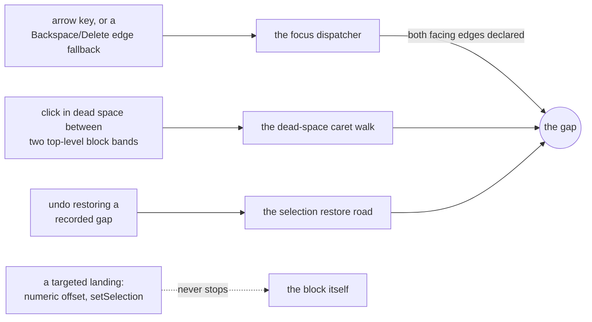
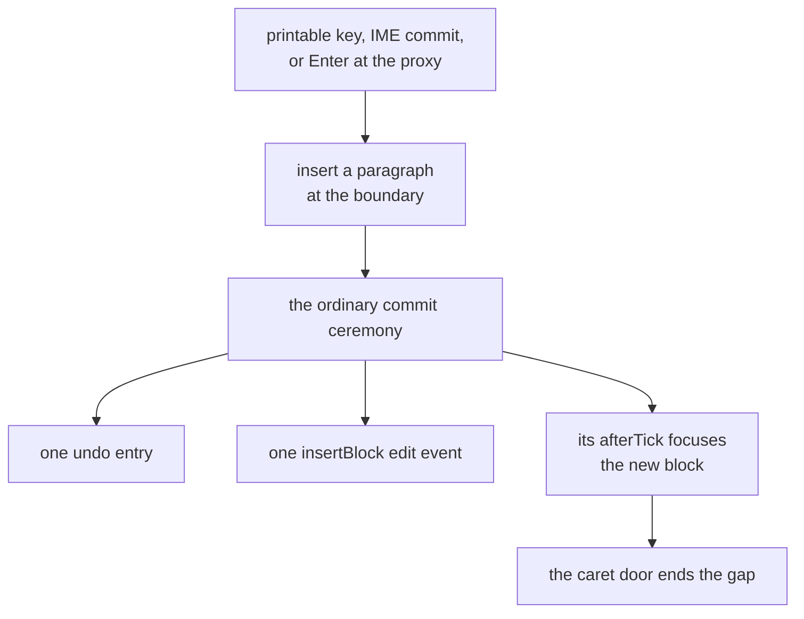

# Anatomy of a change

## What this is

One genuinely cross-cutting feature, traced from its first design decision to ship. Read it for the
shape of a change here, not for the feature.

The feature is the **gap caret**: a caret parked between two sibling blocks, at a boundary no
block's own editing surface can reach. Between a table and a code fence, say, or above a document
that opens with a table. Without it those boundaries have no insertion point at all, and the user's
only move is to guess. `docs/design/editor.md` § 10 is the gap caret's actual spec, and the
codebase map's gap-caret row is where you put the breakpoint.

The arc ran four waves and a tail, over one day:

| Wave              | Commit      | What landed                                                          |
| ----------------- | ----------- | -------------------------------------------------------------------- |
| Model             | `9e61cb489` | The descriptor field, the eligibility core, the third selection mode |
| Arrival           | `1ae85d39a` | Existing focus seams gain a stop; the dead-space click; the shell    |
| Editing           | `1fe6d0e49` | Paint, mint, undo, chords, and the bug only editing could find       |
| Simulation + docs | `d4cffb6df` | A simulation gesture, the design docs, both guides                   |
| Tail              | `1cf8b148e` | Two pins that passed for the wrong reason, one deleted fix           |

## Wave 1: the model, before anything renders

Three decisions, none of them visual, each one a choke point. Nothing rendered for the whole wave,
which was the point.

**Eligibility is declared, never inferred.** A kind whose surface traps the caret at its edges
declares a `gapEdges` field on its descriptor, and a boundary opens only when both blocks facing it
declare the edge they present to it. No selection or orchestration code names a kind, so a plugin
kind joins by declaring, and the bundled set (table, fenced code, the opaque container tier, the
math and diagram kinds) is data rather than a branch. This is design rule 4 expressed as a data
field: the rule lives at the read seam, and every kind answers it the same way.

**The gap is a third selection mode**, held in the selection state beside the cross-block range,
and not a fourth kind of range. A gap position is a container path plus a child index, collapsed by
construction, never an endpoint and never half of a range. Two rules went into the state itself
rather than into callers: placing a gap ends a live cross-block range first, and any other caret
claim clears the gap. Four arrival paths landed later without either rule being restated, which is
the entire return on writing them there.

**Undo's recorded selection becomes a union** of an editor selection or a gap position, so undoing a
mint can return the caret to the boundary the paragraph came from.

Still nothing painted, and the wave already carried a bug fix: the native pointerdown preamble left
a live gap standing where the caret door ends it. One entry path out of several missing a rule its
siblings carried is the shape [`rules.md`](rules.md) names as the dominant one, and it turned up
here before there was anything on screen to notice it with.

## Wave 2: arrival rides seams that already exist

No new dispatcher was built, and that is the headline. A directional focus move learned to stop at
an eligible boundary instead of entering its target, which covers the arrows and the edge-delete
focus fallbacks together; the existing dead-space click gained a band test; the restore road
already knew how to park a recorded selection. The dotted edge matters as much as the solid ones: a
targeted landing never stops at a gap, because a consumer asking for a specific offset is not
navigating, and second-guessing them there would be rude.

## Wave 3: editing, and the bug only editing could find

Focus has to live somewhere once the source block gives it up, so the gap paints a line and puts
DOM focus on a zero-height contenteditable proxy behind it. The proxy lives outside every block's
surface, which is what keeps it out of any block's `textContent` walk, and it is why the
editor-global chords resolve at a gap exactly as they do anywhere else.

The mint takes the ordinary ceremony rather than a bespoke one, which is why it costs one undo entry
and one edit event without anybody arranging that. Everything else the proxy could receive, paste
above all, is declined rather than guessed at.

**And then every keystroke at the gap was silently dropped.** The model, the arrival paths and the
commit path were all correct and all covered. The surface underneath them never delivered
`beforeinput`, so nothing downstream ever ran, and nothing found it until somebody sat down and
tried to type. A capability is not landed when its seams are wired. The wave that attempts the real
gesture is the wave that finds out.

## Wave 4: the simulation and the docs

New feature class, new simulation gesture: the note-taking simulation gained a range-interrupt
arrival that mints, plus a gap-mint gesture with its own reachability spec. The simulation is the
strongest corruption oracle in the repo, and a surface it cannot reach is a surface it does not
guard. The docs rode along in the same commit, because documentation that ships "next week" does
not ship: the design spec, the plugin contract and both guides landed with the gesture.

## The tail: what green tests can hide

Three findings, all in the tail commit, all about the tests rather than the code. This is the part
nobody puts in the writeup, so here it is.

**A guard registered no editor.** The double-undo assertion ran against a root that had never been
registered, so the branch it named could not have executed. It passed because nothing happened, not
because the right thing happened.

**A pin exercised the wrong actor.** The presentation-mode flip is supposed to clear a live gap at a
choke point. The spec flipped the mode by clicking a toggle, which blurred the proxy, and the blur
handler cleared the gap before the choke point ran. The assertion was true and the mechanism it
claimed to cover was never reached. The fix was to flip the mode without moving DOM focus, so the
flip is the only actor in the test.

**A fix for a browser behavior that does not exist.** The proxy carried a helper that seated a
caret by hand, justified by "a contenteditable holding no range receives no `beforeinput`". Focusing
a contenteditable seats a caret in it in Chromium, so the helper was dead code wearing a confident
comment, and both were deleted.

The generalization is one line: **a passing test is evidence only when you know what would turn it
red.** So whenever a test guards a seam you cannot see from the assertion, break the seam on
purpose once and watch it go red. It costs a minute, and it is the difference between a test and a
decoration.

## What to take from it

- A cross-cutting capability lands **once**, at choke points: one declared field, one eligibility
  read, and rules written into the state rather than into callers. Arrival paths then cost a line
  each, which is the whole trick.
- **Decide the model before anything renders.** Waves 2 through 4 changed no wave-1 decision, and
  that was not luck.
- **The guards earn their keep on the entry paths**, which is where wave 1's own bug lived and where
  the sibling-parity habit in [`rules.md`](rules.md) points you first.
- **Attempt the real gesture early.** The zero-height proxy bug was invisible to every layer above
  it, and stayed invisible until a human typed.
- **Ship the docs and the simulation gesture inside the arc**, not after it. After it means never.
