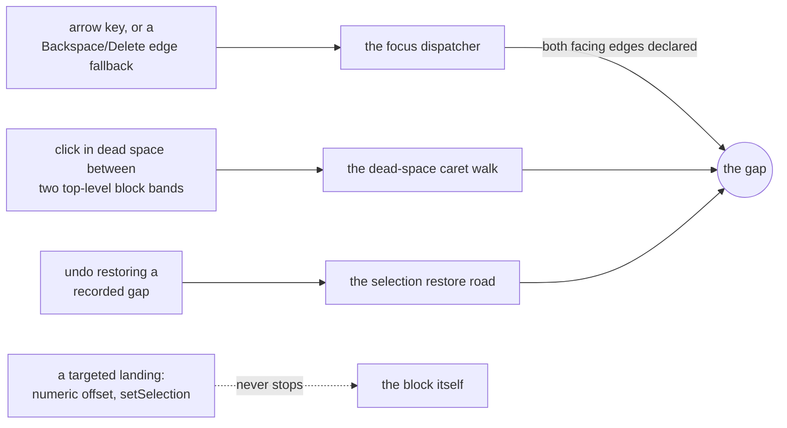
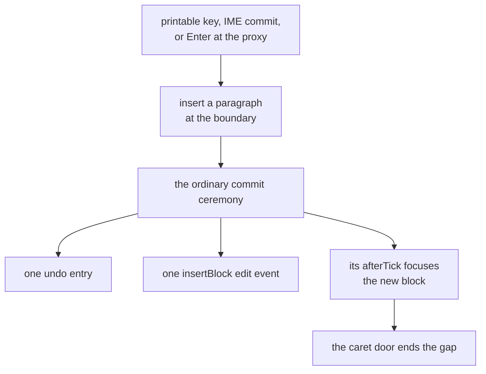

# Anatomy of a change

One genuinely cross-cutting feature, traced from its first design decision to ship. Read it for
the shape of a change here rather than for the feature itself.

The feature is the **gap caret**: a caret parked between two sibling blocks, at a boundary no
block's own editing surface can reach. Between a table and a code fence, say, or above a document
that opens with a table. Without it those boundaries have no insertion point at all, and your only
move is to guess. The spec is the gap-caret section of `docs/design/editor.md` § 10, and the
codebase map's gap-caret row (`src/lib/selection/gap-caret.ts`, with `tryGapStop` for arrival and
`gapEligibleAt` for eligibility) is where you put the breakpoint.

The arc ran four waves and a tail, all on one day:

| Wave              | Commit      | What landed                                                          |
| ----------------- | ----------- | -------------------------------------------------------------------- |
| Model             | `9e61cb489` | The descriptor field, the eligibility core, the third selection mode |
| Arrival           | `1ae85d39a` | Existing focus paths gain a stop; the dead-space click; the shell    |
| Editing           | `1fe6d0e49` | Paint, typing, undo, chords, and the bug only editing could find     |
| Simulation + docs | `d4cffb6df` | A simulation gesture, the design docs, both guides                   |
| Tail              | `1cf8b148e` | Two pins that passed for the wrong reason, one deleted fix           |

The five sit among a few small commits of the same day, so the range reads like this:

```
$ git log --oneline 9e61cb489~1..1cf8b148e
1cf8b148e ! (test) two gap pins held for the wrong reason
b141920eb - security.md
1595261af + (test,e2e) the gap's settled selection is null for a subscriber
1fe6d0e49 + (selection,components) gap caret editing: paint, typing, undo
c81ef2256 ~ (test,e2e) the vr arrival case counts mounted hosts
1ae85d39a + (selection,editor-actions) gap caret arrival by arrow and click
039430550 ~ (test) the pointerdown gap-clear pin asserts emission counts
9e61cb489 + (selection,schema) the gap caret model: descriptor field, state, undo
```

## Wave 1: the model, before anything renders

Three decisions, none of them visual, each made once at the one place every later path crosses.
Nothing rendered for the whole wave, which was the point, and none of the three was ever
revisited: waves 2 through 4 changed no wave-1 decision, and that wasn't luck.

**Eligibility is declared, never inferred.** A kind whose surface traps the caret at its edges
declares a `gapEdges` field on its descriptor, and a boundary opens only when both blocks facing
it declare the edge they present to it. The thematic break, for one, opens its leading edge only:

```ts
// src/lib/schema/built-in-descriptors.ts (trimmed)
registerBlockKind('thematicBreak', {
	// Leading edge only: its focused Enter already inserts a paragraph below.
	gapEdges: 'before',
```

The read side is one pure function, doc in, boolean out. A table, a fence, then a paragraph:

````ts
const doc = parse('| a |\n| - |\n\n```\nx\n```\n\nplain\n');
gapEligibleAt(doc, [], 0); // true: above a table that opens the document
gapEligibleAt(doc, [], 1); // true: between the table and the fence
gapEligibleAt(doc, [], 2); // false: a paragraph hosts its own caret
gapEligibleAt(doc, [], 3); // false: the root's trailing edge already belongs to the move-past-end append
````

No selection or orchestration code names a kind. A plugin kind joins by declaring, and the
bundled set (table, fenced code, the opaque container tier, the math and diagram kinds) is a list
of declarations rather than a branch anywhere. That's design rule 4 as a data field; every kind
answers the one read site the same way.

**The gap is a third selection mode**, held in the selection state beside the cross-block range,
and not a fourth kind of range. A gap position is a container path plus a child index:

```ts
// src/lib/selection/gap-caret.ts
/** The boundary before child `index` of the container at `parentPath`; root is `[]`. */
export interface GapCaretPosition {
	parentPath: number[];
	index: number;
}
```

It's collapsed by construction, never an endpoint and never half of a range. Two rules went into
the state itself rather than into callers: placing a gap ends a live cross-block range first, and
any other caret claim clears the gap. Four arrival paths landed later without either rule being
restated, which is the entire return on writing them there.

**Undo's recorded selection becomes a union** of an editor selection or a gap position, so undoing
the paragraph a gap inserts can return the caret to the boundary it came from:

```ts
// src/lib/undo/types.ts, on UndoEntry
selection: EditorSelection | GapCaretSelection;
```

Still nothing painted, and the wave already carried a bug fix: the native pointerdown preamble left
a live gap standing where the caret door (the one caret-placement entry every caret claim routes
through, `src/lib/selection/caret-doors.ts`) ends it. One entry path out of several missing a rule
its siblings carried is the bug shape [`rules.md`](rules.md) names as the dominant one, and it
turned up here before there was anything on screen to notice it with.

## Wave 2: arrival rides paths that already exist



No new dispatcher was built, and that's the headline. Every arrival rides a seam that already
existed (a seam: a boundary where responsibility passes from one piece of code to another). A
directional focus move learned to stop at an eligible boundary instead of entering its target,
which covers the arrows and the edge-delete focus fallbacks together; the existing dead-space
click gained a band test; the restore road already knew how to park a recorded selection. The stop
itself is one call, and it reports whether it took the caret so the traversal knows to stand down:

```ts
// src/lib/selection/gap-caret.ts
export function tryGapStop(
	scope: GapStopScope,
	parentPath: number[],
	boundaryIndex: number
): boolean {
	if (!canGapStop(scope, parentPath, boundaryIndex)) return false;
	placeGapCaret(scope.selection, { parentPath, index: boundaryIndex });
	return true;
}
```

Each road paid a line or two, which is wave 1's dividend. And the dotted edge matters as much as
the solid ones: a targeted landing never stops at a gap, because a consumer asking for a specific
offset isn't navigating, and second-guessing them there would be rude.

## Wave 3: editing, and the bug only editing could find

Focus has to live somewhere once the source block gives it up, so the gap paints a line and puts
DOM focus on a contenteditable proxy hidden behind it. The proxy lives in the block list, outside
every block's surface, which is what keeps it out of any block's `textContent` walk, and it's why
the editor-global chords resolve at a gap exactly as they do anywhere else.



The insertion takes the ordinary commit ceremony (the fixed steps a commit always runs) rather
than a bespoke one, which is why it costs one undo entry and one edit event without anybody
arranging that. Everything else the proxy could receive, paste above all, is declined rather than
guessed at. The whole input policy is four lines:

```ts
// src/lib/components/GapCaret.svelte (comments stripped)
function onBeforeInput(event: InputEvent): void {
	if (composing) return;
	event.preventDefault();
	if (event.inputType === 'insertText' && event.data) mint(event.data);
}
```

**And then every keystroke at the gap was silently dropped.** The model, the arrival paths and the
commit path were all correct and all covered. The surface underneath them never delivered
`beforeinput`, so nothing downstream ever ran, and nothing found it until somebody sat down and
tried to type. The cause was one CSS rule: Chromium fires no `beforeinput` on a zero-height editing
host, and the proxy was zero-height on purpose so the boundary kept its layout. The fix gave the
proxy a real box (1.2em tall, absolutely positioned inside a zero-height wrapper that still holds
the layout), and the wave's commit carries it as a subject line of its own. A capability isn't
landed when its plumbing is wired. The wave that attempts the real gesture is the wave that finds
out.

## Wave 4: the simulation and the docs

New feature class, new simulation gesture: the note-taking simulation gained a range-interrupt
arrival that inserts at the boundary, plus a `gap-mint` gesture with its own reachability spec.
The simulation is the strongest corruption oracle in the repo (an oracle: an independent source of
the right answer a test compares against), and a surface it can't reach is a surface it doesn't
guard. The docs rode along in the same commit (the design spec, the plugin contract, both guides),
because documentation that ships "next week" doesn't ship. The commit's own stat says so:

```
$ git show --stat --format='%h %ad %s' --date=short d4cffb6df
d4cffb6df 2026-08-07 + (test,e2e) simulation sees the gap caret

 CONTRIBUTING.md                                    |   2 +-
 docs/changelog.md                                  |  12 +++
 docs/design/editor.md                              |  20 +++-
 docs/design/plugin-contract.md                     |   2 +
 docs/guide/consumer-guide.md                       |   6 +-
 docs/guide/plugin-guide.md                         |   2 +
 ...
 .../simulation/gesture-gap-mint-reachability.md    |  37 +++++++
 .../requirements/simulation/range-interrupt-ops.md |  20 +++-
 src/lib/e2e/simulation/gestures/range-interrupt.ts |  77 +++++++++++++--
 src/lib/e2e/simulation/gestures/structure.ts       |  32 ++++++
 ...
 27 files changed, 627 insertions(+), 70 deletions(-)
```

## The tail: what green tests can hide

Three findings, all in the tail commit, all about the tests rather than the code. This is the part
nobody puts in the writeup, so here it is.

```
$ git log -1 --format=%B 1cf8b148e
! (test) two gap pins held for the wrong reason

! (test) the double-undo guard registered no editor
! (test) the mode-flip pin blurred the proxy first
~ (components) the proxy caret seat's claimed input fix is deleted
~ (test) the gap reading-gate regex names the guard, not the template
```

**A guard registered no editor.** The double-undo assertion ran against a root that had never been
registered, so the branch it named couldn't have executed. It passed because nothing happened, not
because the right thing happened.

**A pin exercised the wrong actor.** The presentation-mode flip is supposed to clear a live gap at
the one point every flip crosses. The spec flipped the mode by clicking a toggle, which blurred the
proxy, and the blur handler cleared the gap before that point ever ran. The assertion was true and
the mechanism it claimed to cover was never reached. The fix was to flip the mode without moving
DOM focus, so the flip is the only actor in the test.

**A fix for a browser behavior that doesn't exist.** The proxy carried a helper that seated a
caret by hand, justified by "a contenteditable holding no range receives no `beforeinput`".
Focusing a contenteditable seats a caret in it in Chromium, so the helper was dead code wearing a
confident comment, and both were deleted:

```diff
 	$effect(() => {
 		if (!proxyEl) return;
 		proxyEl.focus();
-		seatCaretInProxy(proxyEl);
 	});
-
-	function seatCaretInProxy(el: HTMLElement): void {
-		const selection = el.ownerDocument.defaultView?.getSelection();
-		if (!selection || el.contains(selection.anchorNode)) return;
-		const range = el.ownerDocument.createRange();
-		range.selectNodeContents(el);
-		range.collapse(true);
-		selection.removeAllRanges();
-		selection.addRange(range);
-	}
```

The generalization is one line: **a passing test is evidence only when you know what would turn it
red.** So whenever a test guards something you can't see from its assertion, break that thing on
purpose once and watch the test go red. It costs a minute, and it's the difference between a test
and a decoration.
