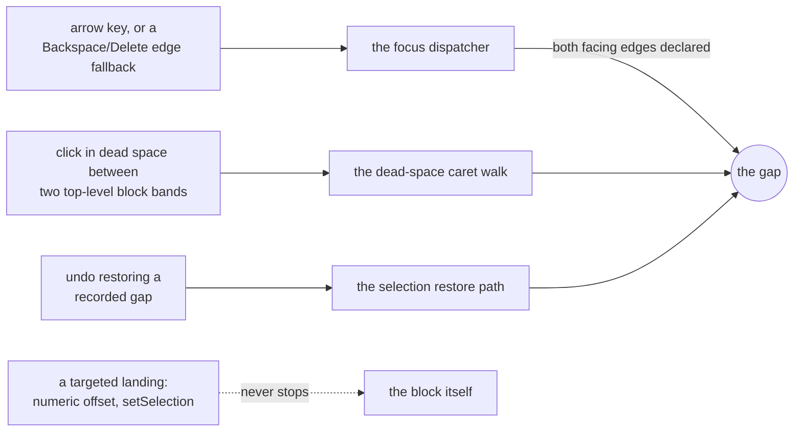
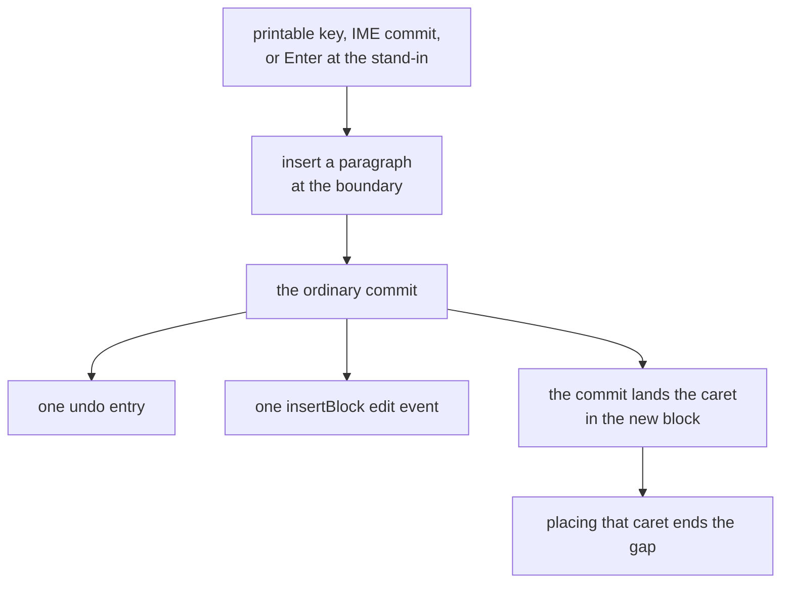

# Anatomy of a change

One genuinely cross-cutting feature, traced from its first design decision to ship. Read it for
the shape of a change here rather than for the feature itself.

The feature is the **gap caret**: a caret parked between two sibling blocks, at a boundary no
block's own editing surface can reach. Between a table and a code fence, say, or above a document
that opens with a table. Without it those boundaries have no insertion point at all, and your only
move is to guess. The spec is the gap-caret section of `docs/design/editor.md` § 10, and the code
is `src/lib/selection/gap-caret.ts`.

It landed in four waves and a tail, all on one day:

| Wave              | Commit      | What landed                                                          |
| ----------------- | ----------- | -------------------------------------------------------------------- |
| Model             | `9e61cb489` | The descriptor field, the eligibility core, the third selection mode |
| Arrival           | `1ae85d39a` | Existing focus paths gain a stop; the dead-space click; the shell    |
| Editing           | `1fe6d0e49` | Paint, typing, undo, chords, and the bug only editing could find     |
| Simulation + docs | `d4cffb6df` | A simulation gesture, the design docs, both guides                   |
| Tail              | `1cf8b148e` | Two tests that passed for the wrong reason, one deleted fix          |

(`git log --oneline 9e61cb489~1..1cf8b148e` shows them with the few small test commits of the same
day in between.)

## Wave 1: the model, before anything renders

Three decisions, none of them visual, each made once at the one place every later path crosses.
Nothing rendered for the whole wave, and the later waves changed none of the three.

**Eligibility is declared, never inferred.** A kind whose surface traps the caret at its edges
declares a `gapEdges` field on its descriptor, and a boundary opens only when both blocks facing
it declare the edge they present to it. The thematic break, for one, opens its leading edge only:

```ts
// src/lib/schema/built-in-descriptors.ts (trimmed)
registerBlockKind('thematicBreak', {
	// Leading edge only: its focused Enter already inserts a paragraph below.
	gapEdges: 'before',
```

The read side is one pure function, doc in, boolean out. A table, a fence, then a paragraph:

````ts
const doc = parse('| a |\n| - |\n\n```\nx\n```\n\nplain\n');
gapEligibleAt(doc, [], 0); // true: above a table that opens the document
gapEligibleAt(doc, [], 1); // true: between the table and the fence
gapEligibleAt(doc, [], 2); // false: a paragraph hosts its own caret
gapEligibleAt(doc, [], 3); // false: the root's trailing edge already belongs to the move-past-end append
````

No selection or orchestration code names a kind. A plugin kind joins by declaring, and the bundled
set (table, fenced code, the opaque containers, the math and diagram kinds) is a list of
declarations rather than a branch anywhere.

**The gap is a third selection mode**, held in the selection state beside the cross-block range,
and not a fourth kind of range. A gap position is a container path plus a child index:

```ts
// src/lib/selection/gap-caret.ts
/** The boundary before child `index` of the container at `parentPath`; root is `[]`. */
export interface GapCaretPosition {
	parentPath: number[];
	index: number;
}
```

It's always collapsed, never an endpoint and never half of a range. Two rules went into the state
itself rather than into callers: placing a gap ends a live cross-block range first, and any other
caret claim clears the gap. Four arrival paths landed later, and none of them had to restate
either rule.

**Undo's recorded selection becomes a union** of an editor selection or a gap position, so undoing
the paragraph a gap inserts can return the caret to the boundary it came from:

```ts
// src/lib/undo/types.ts, on UndoEntry
selection: EditorSelection | GapCaretSelection;
```

Still nothing painted, and the wave already carried a bug fix: the native pointerdown handling
left a live gap standing, where every other caret claim goes through
`src/lib/selection/caret-doors.ts` and ends it there. One entry path out of several missing a rule
its siblings carried is the bug shape behind most of the corruption found here
([`rules.md` § The bug shape to fear](rules.md#the-bug-shape-to-fear-sibling-path-parity)), and it
turned up before there was anything on screen to notice it with.

## Wave 2: arrival rides paths that already exist


```mermaid
flowchart LR
    A["arrow key, or a<br/>Backspace/Delete edge fallback"] --> D["the focus dispatcher"]
    B["click in dead space between<br/>two top-level block bands"] --> E["the dead-space caret walk"]
    C["undo restoring a<br/>recorded gap"] --> F["the selection restore path"]
    D -->|both facing edges declared| G(("the gap"))
    E --> G
    F --> G
    H["a targeted landing:<br/>numeric offset, setSelection"] -.->|never stops| I["the block itself"]
```

No new dispatcher was built. A directional focus move learned to stop at an eligible boundary
instead of entering its target, which covers the arrows and the edge-delete focus fallbacks
together; the existing dead-space click gained a band test; the restore path already knew how to
put back a recorded selection. The stop itself is one call, and it reports whether it took the
caret so the traversal knows to stand down:

```ts
// src/lib/selection/gap-caret.ts
export function tryGapStop(
	scope: GapStopScope,
	parentPath: number[],
	boundaryIndex: number
): boolean {
	if (!canGapStop(scope, parentPath, boundaryIndex)) return false;
	placeGapCaret(scope.selection, { parentPath, index: boundaryIndex });
	return true;
}
```

Each path paid a line or two, thanks to wave 1. And the dotted edge matters as much as the solid
ones: a targeted landing never stops at a gap, because a consumer asking for a specific offset
isn't navigating, and second-guessing them there would be rude.

## Wave 3: editing, and the bug only editing could find

Focus has to live somewhere once the source block gives it up, so the gap paints a line and puts
DOM focus on a hidden contenteditable stand-in behind it. The stand-in lives in the block list,
outside every block's surface, so no block's text walk sees it, and the editor-global chords
resolve at a gap exactly as they do anywhere else.


```mermaid
flowchart TD
    K["printable key, IME commit,<br/>or Enter at the stand-in"] --> M["insert a paragraph<br/>at the boundary"]
    M --> C["the ordinary commit"]
    C --> U["one undo entry"]
    C --> V["one insertBlock edit event"]
    C --> F["the commit lands the caret<br/>in the new block"]
    F --> X["placing that caret ends the gap"]
```

The insertion goes through the ordinary commit rather than a bespoke one, which is why it costs one
undo entry and one edit event without anybody arranging that. Everything else the stand-in could
receive, paste above all, is declined rather than guessed at. The whole input policy is four
lines:

```ts
// src/lib/components/GapCaret.svelte (comments stripped)
function onBeforeInput(event: InputEvent): void {
	if (composing) return;
	event.preventDefault();
	if (event.inputType === 'insertText' && event.data) mint(event.data);
}
```

**And then every keystroke at the gap was silently dropped.** The model, the arrival paths and the
commit were all correct and all covered by tests. The stand-in never delivered `beforeinput`, so
nothing downstream ever ran, and nothing found it until somebody sat down and tried to type. The
cause was one CSS rule: Chromium fires no `beforeinput` on a zero-height editing host, and the
stand-in was zero-height on purpose so the boundary kept its layout. The fix gave it a real box
(1.2em tall, absolutely positioned inside a zero-height wrapper that still holds the layout).
Wiring a feature up isn't the same as landing it; you find out when somebody tries the real
gesture.

## Wave 4: the simulation and the docs

New feature, new simulation gesture: the note-taking simulation (long scripted editing sessions
that type real keystrokes and check the document never corrupts) gained a gesture that inserts at
a gap, with its own spec proving the gesture can actually reach one. A surface the simulation
can't reach is a surface it doesn't guard. The docs rode along in the same commit (the design
spec, the plugin contract, both guides, the changelog):

```
$ git show --stat --format='%h %ad %s' --date=short d4cffb6df
d4cffb6df 2026-08-07 + (test,e2e) simulation sees the gap caret

 CONTRIBUTING.md                                    |   2 +-
 docs/changelog.md                                  |  12 +++
 docs/design/editor.md                              |  20 +++-
 docs/design/plugin-contract.md                     |   2 +
 docs/guide/consumer-guide.md                       |   6 +-
 docs/guide/plugin-guide.md                         |   2 +
 ...
 27 files changed, 627 insertions(+), 70 deletions(-)
```

## The tail: what green tests can hide

Three findings, all in the tail commit, all about the tests rather than the code. This is the part
nobody puts in the writeup, so here it is.

**A guard registered no editor.** The double-undo assertion ran against an editor root that had
never been registered, so the branch it named couldn't have executed. It passed because nothing
happened, not because the right thing happened.

**A test exercised the wrong actor.** Switching presentation mode is supposed to clear a live gap,
at the one point every switch goes through. The spec switched the mode by clicking a toggle, which
blurred the stand-in, and the blur handler cleared the gap before that point ever ran. The
assertion was true and the code it claimed to cover never ran. The fix was to switch the mode
without moving DOM focus, so the switch is the only actor in the test.

**A fix for a browser behavior that doesn't exist.** The stand-in carried a helper that placed a
caret by hand, justified by "a contenteditable holding no range receives no `beforeinput`".
Focusing a contenteditable places a caret in it in Chromium, so the helper was dead code with a
confident comment on it, and both were deleted:

```diff
 	$effect(() => {
 		if (!proxyEl) return;
 		proxyEl.focus();
-		seatCaretInProxy(proxyEl);
 	});
-
-	function seatCaretInProxy(el: HTMLElement): void {
-		const selection = el.ownerDocument.defaultView?.getSelection();
-		if (!selection || el.contains(selection.anchorNode)) return;
-		const range = el.ownerDocument.createRange();
-		range.selectNodeContents(el);
-		range.collapse(true);
-		selection.removeAllRanges();
-		selection.addRange(range);
-	}
```

So whenever a test guards something you can't see from its assertion, break that thing on purpose
once and watch the test go red. It takes a minute, and until you've done it you don't know what
the test is evidence of.
