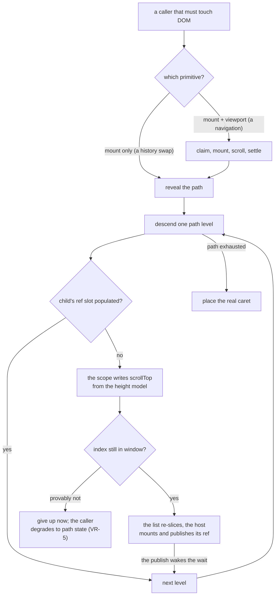

# The codebase map

Where things live, and what you must not do once you get there.

The design docs say how each subsystem works, and `docs/README.md` maps them by audience. This says
where a **behavior** lives: you know the editor did something wrong, and you need the one file to
open. Read it once end to end (about fifteen minutes), then come back to the table.

**Altitude.** Seams and responsibilities only. No line numbers, no signatures, no code. A file is
named by path; a symbol only where the symbol _is_ the seam, written `path :: Symbol`. That
notation is machine-checked (see the last section), so a reference here either resolves or the
gate goes red.

**How to read a row.** The entry is where you put the breakpoint. The rule is the thing that has
been broken before: nearly every one says the same thing in a different costume, which is design
rule 6, _rules live at choke points, not call sites_. When you want to add a branch at a seam, the
rule in that row is what you are arguing with.

## Behavior → seam

| Behavior                                       | Entry                                                                                                                                                                                                                                                                                                                                                                                                                                                                                                                                                                                                                                                                                                                                                                                                                                                                                                               | The rule there                                                                                                                                                                                                                                                                                                                                                                                                                                                                                                                                                                                                                                                                                                                                                                                                                                   | Spec                                                                                                                                                                                  |
| ---------------------------------------------- | ------------------------------------------------------------------------------------------------------------------------------------------------------------------------------------------------------------------------------------------------------------------------------------------------------------------------------------------------------------------------------------------------------------------------------------------------------------------------------------------------------------------------------------------------------------------------------------------------------------------------------------------------------------------------------------------------------------------------------------------------------------------------------------------------------------------------------------------------------------------------------------------------------------------- | ------------------------------------------------------------------------------------------------------------------------------------------------------------------------------------------------------------------------------------------------------------------------------------------------------------------------------------------------------------------------------------------------------------------------------------------------------------------------------------------------------------------------------------------------------------------------------------------------------------------------------------------------------------------------------------------------------------------------------------------------------------------------------------------------------------------------------------------------ | ------------------------------------------------------------------------------------------------------------------------------------------------------------------------------------- |
| Typing into a block                            | `src/lib/components/blocks/editable-surface.ts` :: `createEditableSurface`, then `src/lib/tree-operations/node-ops.ts` :: `updateNodeContent`                                                                                                                                                                                                                                                                                                                                                                                                                                                                                                                                                                                                                                                                                                                                                                       | Bytes enter a node through `updateNodeContent`; a `raw` assignment at a call site is the bug                                                                                                                                                                                                                                                                                                                                                                                                                                                                                                                                                                                                                                                                                                                                                     | `docs/design/editor.md` § 6                                                                                                                                                           |
| Keystroke batching for undo                    | `src/lib/editor-actions/commit/text-batch.ts` :: `createTextBatch`                                                                                                                                                                                                                                                                                                                                                                                                                                                                                                                                                                                                                                                                                                                                                                                                                                                  | Its `setTimeout` detects a wall-clock pause, never ordering; sequencing is `await tick()`, and any new timing primitive needs a G4.4 allowlist entry                                                                                                                                                                                                                                                                                                                                                                                                                                                                                                                                                                                                                                                                                             | `docs/design/editor.md` § 11                                                                                                                                                          |
| Enter / split                                  | `src/lib/schema/block-commands.ts` :: `dispatchKeyCommand`, then `src/lib/editor-actions/block-edit-core.ts` :: `createBlockEditCore`, live rebalance in `src/lib/components/blocks/text/live-split-rebalance.ts` :: `rebalanceLiveSplit`                                                                                                                                                                                                                                                                                                                                                                                                                                                                                                                                                                                                                                                                           | A kind gets Enter by declaring the chord in its `keymap`; the dispatcher never reads a kind name. In live mode alone the halves close and reopen the construct the cut crossed, through the ONE registered rebalancer, which verifies its own bytes and otherwise declines                                                                                                                                                                                                                                                                                                                                                                                                                                                                                                                                                                       | `docs/design/editor.md` § 8                                                                                                                                                           |
| Typing a construct into existence              | `src/lib/schema/block-completions.ts` :: `completeTypedLine`, gated at `src/lib/editor-actions/enter-completion.ts` :: `planEnterCompletion` and spent by `withEnterCompletion` in the same file; the built-in registrant is `src/lib/core/parsers/table-completion.ts`, the plugin one `src/lib/plugins/latex/math-completion.ts`                                                                                                                                                                                                                                                                                                                                                                                                                                                                                                                                                                                  | A grammar spanning adjacent lines is typed into existence by registering a completer, never by a branch at the split; the seam reads no kind name, and its gate is what guarantees the completer sees the whole typed line and nothing else. Which line a completer may claim is bounded by the parser's own predicate, so a shape the parser rejects can never be minted. The consult wraps the COMPOSED `splitBlock` at the two bundle factories, above any container override, so no container can take the arm out of its subtree; the caret a completer answers is line-relative, since only the seam knows the line ending it chose. `src/lib/editor-actions/list-overrides.ts` keeps a `splitBlock` no-op under it: nothing calls the list's own split today, and the shared core would run a prose split on a `listItem` if anything did | `docs/design/editor.md` § 8                                                                                                                                                           |
| Link editing (live mode)                       | `src/lib/components/link-card/LinkCard.svelte` over `src/lib/components/link-card/link-card-commit.ts`, bytes from `src/lib/components/blocks/text/link-source-bytes.ts` :: `buildLinkEditBytes`, committed through `src/lib/editor-actions/inline-range-commit.ts` :: `createInlineRangeCommit`                                                                                                                                                                                                                                                                                                                                                                                                                                                                                                                                                                                                                    | Live mode paints no destination, so the card is the only way to read or rewrite one; it addresses its link by path plus construct start and re-resolves after every edit, since a commit rebuilds the inline DOM                                                                                                                                                                                                                                                                                                                                                                                                                                                                                                                                                                                                                                 | `docs/design/live-mode.md` § 4.6 — the focus model (open beside the caret on a click, trap on keyboard entry); scenarios in `src/lib/e2e/requirements/presentation/live-link-card.md` |
| Code block's language (marker-hiding modes)    | `src/lib/components/blocks/code/CodeLanguageChip.svelte` beside the walk container in `src/lib/components/blocks/code/CodeBlock.svelte`, bytes from `src/lib/schema/fenced-code-raw.ts` :: `writeFenceInfo`, committed through that block's `commitDisplay` funnel                                                                                                                                                                                                                                                                                                                                                                                                                                                                                                                                                                                                                                                  | A hidden fence line is unlandable, so the chip is the only way to read or rewrite an info string once the block has body content; it renders outside the contenteditable, which the render effect rebuilds on every commit                                                                                                                                                                                                                                                                                                                                                                                                                                                                                                                                                                                                                       | `docs/design/live-mode.md` § 4.7; scenarios in `src/lib/e2e/requirements/blocks/code/language-chip.md`                                                                                |
| Destructive joins (merge, range delete)        | `src/lib/tree-operations/node-ops.ts` :: `cleanJoinedRaw`, the one reader of the registered cleaner in `src/lib/components/blocks/text/live-join-seam.ts` :: `cleanLiveJoinSeam`; a surface reaches it from `beforeinput` through `src/lib/components/blocks/text/live-selection-edit.ts` :: `resolveLiveRangeEdit`                                                                                                                                                                                                                                                                                                                                                                                                                                                                                                                                                                                                 | Every join runs its bytes through the one seam: in live mode alone the runs a cut stranded and the closer/opener pair a join brings back to back are dropped, verified against what the two sides showed and against leaving a construct enclosing nothing, and otherwise the literal join stands                                                                                                                                                                                                                                                                                                                                                                                                                                                                                                                                                | `docs/design/editor.md` § 8                                                                                                                                                           |
| Backspace at a block's start                   | gate `src/lib/selection/shared-keydown.ts` :: `caretLandableBounds`, then `src/lib/editor-actions/nested/nested-block-edit.ts` :: `createNestedBlockEdit`, strategies in `src/lib/editor-actions/unwrap-strategies.ts`                                                                                                                                                                                                                                                                                                                                                                                                                                                                                                                                                                                                                                                                                              | The start is the first caret-REACHABLE offset wherever the block's own markers go unpainted — what the DOM walk can land, past any hidden run opening it; a kind joins the cascade by declaring `unwrapRole`, a merge role or `contentStartBackspace`, never by a branch in the cascade. A table cell reaches the same bounds through its own plan (the arrow row's exception)                                                                                                                                                                                                                                                                                                                                                                                                                                                                   | `docs/design/editor.md` § 8                                                                                                                                                           |
| Caret landing                                  | `src/lib/selection/caret-doors.ts` :: `placeCaret`, dispatched by `src/lib/editor-actions/focus/focus-dispatch.ts` :: `dispatchMoveFocus`                                                                                                                                                                                                                                                                                                                                                                                                                                                                                                                                                                                                                                                                                                                                                                           | Mint `focus` from `placeCaret`, never by hand; `parkCaret` and `focusAtColumn` are extend-path doors (G2.12). Every door bottoms out in `components/blocks/editable-surface.ts` :: `parkCaret`, which clamps EVERY offset — sentinel or numeric — into the block's landable range (identity where markers paint); `CURSOR_EXACT_START` is the one unclamped seat, the split continuation's byte 0. The write-door census is G4.36, `src/lib/test/invariants/lint/caret-write-doors.test.ts`. A door a consumer's own component owns bottoms out nowhere in here, so G1.33 fires from the editor root's `focusin` funnel in `src/lib/components/Editor.svelte` instead — the one seam every door crosses, since seating a caret means focusing a surface                                                                                          | `docs/design/editor.md` § 4                                                                                                                                                           |
| Hidden runs and landable bounds                | `src/lib/cursor/widget-offset.ts` :: `landingSegments`, bounds from `src/lib/cursor/widget-offset.ts` :: `landableDomTextBounds` and `src/lib/cursor/widget-offset.ts` :: `clampToLandableRaw`                                                                                                                                                                                                                                                                                                                                                                                                                                                                                                                                                                                                                                                                                                                      | The walk is the ONE DOM↔raw translation home, so what a caret can reach is answered here and nowhere else: a gate that compares a caret against a block's declared content range instead of its landable bounds is the bug (#103). An ambient marker run is unreachable; a decoration island or an atomic widget is opaque but still has landable boundaries, and the two are not the same answer                                                                                                                                                                                                                                                                                                                                                                                                                                                | `docs/design/editor.md` § 4                                                                                                                                                           |
| Arrow at a block boundary                      | `src/lib/selection/shared-keydown.ts` :: `handleSharedKeydown`                                                                                                                                                                                                                                                                                                                                                                                                                                                                                                                                                                                                                                                                                                                                                                                                                                                      | Every arrow boundary test lives at this seam, never at a call site; a surface growing its own arrow handling routes through it rather than comparing offsets itself. ONE documented exception: `src/lib/components/blocks/table/cell-keydown-plan.ts` plans a cell's own edge presses, its hop being between cells rather than blocks — it takes the same landable bounds as input, so the two cannot disagree about where an edge is                                                                                                                                                                                                                                                                                                                                                                                                            | `docs/design/editor.md` § 8                                                                                                                                                           |
| Sticky column                                  | Capture via `noteKey` on `src/lib/cursor/sticky-column.ts` :: `createStickyColumnState`, consumed by `src/lib/editor-actions/focus/focus-landing.ts` :: `consumeStickyLanding`                                                                                                                                                                                                                                                                                                                                                                                                                                                                                                                                                                                                                                                                                                                                      | Capture and consumption are separate seams; `focusAtColumn` is a pure receiver with no fallback of its own                                                                                                                                                                                                                                                                                                                                                                                                                                                                                                                                                                                                                                                                                                                                       | `docs/design/editor.md` § 8                                                                                                                                                           |
| Caret edge affinity                            | Captured on `src/lib/cursor/edge-affinity.ts` :: `createEdgeAffinityState`, consumed by `src/lib/components/blocks/text/edge-seat.ts` :: `resolveEdgeSeat`                                                                                                                                                                                                                                                                                                                                                                                                                                                                                                                                                                                                                                                                                                                                                          | THREE capture doors and one editor-scoped instance — `note` classifies a keydown, `noteTyping` pins a committed byte, `noteExtreme` says the caret was SEATED at an extreme rather than stepped there (a range collapsing onto its own edge, where the key's direction is the wrong thing to read); the seat is the one consumer, and it reads the kind's policy first and `get()` second                                                                                                                                                                                                                                                                                                                                                                                                                                                        | `src/lib/cursor/edge-affinity.ts` header                                                                                                                                              |
| Inline construct edges                         | Rows in `src/lib/schema/inline-construct-policy.ts` :: `getInlineConstructPolicy`, read at `src/lib/components/blocks/text/edge-policy-dispatch.ts` :: `createEdgePolicyDispatch`                                                                                                                                                                                                                                                                                                                                                                                                                                                                                                                                                                                                                                                                                                                                   | A construct's edge behavior — which side a typed byte seats on, whether emptying it unwraps, how a split treats it — is its declared row; the dispatch reads the table, never a kind list                                                                                                                                                                                                                                                                                                                                                                                                                                                                                                                                                                                                                                                        | `src/lib/schema/inline-construct-policy.ts` header                                                                                                                                    |
| Inline mark vocabulary                         | The `mark` column of the same rows, read through `src/lib/schema/inline-construct-policy.ts` :: `listInlineMarks` and `inlineMarkForCommand`                                                                                                                                                                                                                                                                                                                                                                                                                                                                                                                                                                                                                                                                                                                                                                        | What a format chord writes: the delimiter run, the nesting rank a set of marks wraps in, and the command that toggles it. Both block surfaces resolve the command through the table instead of carrying an arm per format, and a rank or command claimed twice fails G1.31 at the mount check                                                                                                                                                                                                                                                                                                                                                                                                                                                                                                                                                    | `src/lib/schema/inline-construct-policy.ts` header                                                                                                                                    |
| Widgets and decoration islands at a caret edge | `src/lib/components/blocks/text/edge-policy-dispatch.ts` :: `createEdgePolicyDispatch`                                                                                                                                                                                                                                                                                                                                                                                                                                                                                                                                                                                                                                                                                                                                                                                                                              | One dispatcher ranks the three things a caret can sit against — atomic widget, decoration island, ambient marker — and the ranking is the seam, not each rule's own call site. A marker-hiding mode changes which runs are unpainted, never which of the three owns the press; reading mode stands the island and ambient arms down wholesale                                                                                                                                                                                                                                                                                                                                                                                                                                                                                                    | `docs/design/plugin-contract.md`                                                                                                                                                      |
| Pending marks                                  | Set by `toggleFormat` in `src/lib/components/blocks/text/TextEditableBlock.svelte`, held by `src/lib/cursor/pending-marks.ts` :: `createPendingMarksState`, spent by `src/lib/components/blocks/text/pending-mark-insert.ts` :: `resolveMarkedInsertion`                                                                                                                                                                                                                                                                                                                                                                                                                                                                                                                                                                                                                                                            | Composed onto the edge affinity's invalidation at the editor root, so every seam that drops a side drops the marks (G4.31); one insertion spends the set                                                                                                                                                                                                                                                                                                                                                                                                                                                                                                                                                                                                                                                                                         | `src/lib/cursor/pending-marks.ts` header                                                                                                                                              |
| Reorder (Alt+Arrow, drag)                      | `src/lib/editor-actions/reorder-action.ts` :: `createReorderAction`                                                                                                                                                                                                                                                                                                                                                                                                                                                                                                                                                                                                                                                                                                                                                                                                                                                 | The drag paints and mutates nothing; exactly one permutation commits, on drop, and the caret and the announcement ride the landing that commit reports — settling the joins a move disturbed can fold a block above it                                                                                                                                                                                                                                                                                                                                                                                                                                                                                                                                                                                                                           | `docs/design/editor.md` § 8                                                                                                                                                           |
| Cross-block selection                          | `src/lib/selection/selection-state.svelte.ts` :: `createSelectionState`, keys in `src/lib/selection/cross-block/dispatch.ts` :: `createCrossBlockHandlers`                                                                                                                                                                                                                                                                                                                                                                                                                                                                                                                                                                                                                                                                                                                                                          | Endpoints are `(path, offset)` data; never consult mounted DOM to decide what is selected                                                                                                                                                                                                                                                                                                                                                                                                                                                                                                                                                                                                                                                                                                                                                        | `docs/design/editor.md` § 10                                                                                                                                                          |
| The gap caret                                  | arrival `src/lib/selection/gap-caret.ts` :: `tryGapStop`, eligibility `src/lib/selection/gap-caret.ts` :: `gapEligibleAt`                                                                                                                                                                                                                                                                                                                                                                                                                                                                                                                                                                                                                                                                                                                                                                                           | Eligibility is the kind's own `gapEdges` declaration; no kind list at the read site                                                                                                                                                                                                                                                                                                                                                                                                                                                                                                                                                                                                                                                                                                                                                              | `docs/design/editor.md` § 10                                                                                                                                                          |
| Copy / cut                                     | `src/lib/components/blocks/editable-surface.ts` :: `createClipboardHandlers`, root fallback `src/lib/components/editor-root-clipboard.ts` :: `createEditorRootClipboard`                                                                                                                                                                                                                                                                                                                                                                                                                                                                                                                                                                                                                                                                                                                                            | `preventDefault` is the receipt the root seam reads; never claim an event a surface already handled                                                                                                                                                                                                                                                                                                                                                                                                                                                                                                                                                                                                                                                                                                                                              | `docs/design/editor.md` § 10                                                                                                                                                          |
| Paste                                          | `src/lib/tree-operations/paste/dispatch.ts` :: `pasteDispatch`                                                                                                                                                                                                                                                                                                                                                                                                                                                                                                                                                                                                                                                                                                                                                                                                                                                      | One parse-and-route path; `src/lib/tree-operations/paste/paste-deps.ts` :: `PasteCommitCoordinator` is its only upward edge                                                                                                                                                                                                                                                                                                                                                                                                                                                                                                                                                                                                                                                                                                                      | `docs/design/editor.md` § 10                                                                                                                                                          |
| Programmatic insertion (`insertMarkdown`)      | door `src/lib/components/Editor.svelte` :: `insertMarkdown`, surface seam `src/lib/components/blocks/editable-surface.ts` :: `createClipboardHandlers`                                                                                                                                                                                                                                                                                                                                                                                                                                                                                                                                                                                                                                                                                                                                                              | The door only resolves the focused surface; every paste rule lives below it, so never re-carry one here                                                                                                                                                                                                                                                                                                                                                                                                                                                                                                                                                                                                                                                                                                                                          | `docs/design/editor.md` § 10                                                                                                                                                          |
| Command invocation by id (`runCommand`)        | door `src/lib/components/Editor.svelte` :: `runCommand`, seam `src/lib/schema/block-commands.ts` :: `runCommandById`                                                                                                                                                                                                                                                                                                                                                                                                                                                                                                                                                                                                                                                                                                                                                                                                | Chord dispatch and the public door meet at the seam, so a rule that must hold whatever invoked a command (reading mode, the cross-block range decline) belongs there, never at a call site                                                                                                                                                                                                                                                                                                                                                                                                                                                                                                                                                                                                                                                       | `docs/design/editor.md` § 5                                                                                                                                                           |
| Any structural mutation                        | `src/lib/action-contracts.ts` :: `CommitController` (`commitStructural`, `commitContainerStructural`, `commitMultiScope`)                                                                                                                                                                                                                                                                                                                                                                                                                                                                                                                                                                                                                                                                                                                                                                                           | Pick a scope, never assemble the ceremony; mutate the scope view it hands you, not a reference captured before the commit                                                                                                                                                                                                                                                                                                                                                                                                                                                                                                                                                                                                                                                                                                                        | `docs/design/editor.md` § 11                                                                                                                                                          |
| Undo / redo                                    | `src/lib/undo/manager.ts` :: `createUndoManager`, driven by `src/lib/editor-actions/commit/history.ts` :: `createHistoryActions`                                                                                                                                                                                                                                                                                                                                                                                                                                                                                                                                                                                                                                                                                                                                                                                    | A snapshot shares live nodes; a write to bytes a snapshot still shares must copy the path first (G1.9)                                                                                                                                                                                                                                                                                                                                                                                                                                                                                                                                                                                                                                                                                                                                           | `docs/design/editor.md` § 11                                                                                                                                                          |
| Copy-path-on-write                             | `src/lib/tree-operations/unshare.ts` :: `ensureUnsharedPath`, epochs in `src/lib/tree-operations/sharing.ts` :: `createSharingState`                                                                                                                                                                                                                                                                                                                                                                                                                                                                                                                                                                                                                                                                                                                                                                                | Copies are shallow; re-read through the `$state` tree after splicing one in, never keep the copy                                                                                                                                                                                                                                                                                                                                                                                                                                                                                                                                                                                                                                                                                                                                                 | `docs/design/invariants.md` (G1.9)                                                                                                                                                    |
| Windowing                                      | `src/lib/reactivity/list-windowing.svelte.ts` :: `createListWindowing`, slice math in `src/lib/reactivity/block-window.svelte.ts`                                                                                                                                                                                                                                                                                                                                                                                                                                                                                                                                                                                                                                                                                                                                                                                   | Every index, id, and path key is `start + localIndex`; a loop-local index is the windowing bug                                                                                                                                                                                                                                                                                                                                                                                                                                                                                                                                                                                                                                                                                                                                                   | `docs/design/virtual-rendering.md`                                                                                                                                                    |
| Reveal before act                              | `src/lib/editor-rects.ts` :: `createEditorRects`, descent in `src/lib/reactivity/publish-ref.svelte.ts` :: `revealChildOrWait`                                                                                                                                                                                                                                                                                                                                                                                                                                                                                                                                                                                                                                                                                                                                                                                      | Reveal before touching DOM; a synchronous focus cannot mount an off-window target (VR-12)                                                                                                                                                                                                                                                                                                                                                                                                                                                                                                                                                                                                                                                                                                                                                        | `docs/design/virtual-rendering.md` § Reveal Before Act                                                                                                                                |
| Search                                         | `src/lib/search/search-state.svelte.ts` :: `createSearchState`, scan in `src/lib/search/document-scan.ts` :: `scanDocument`                                                                                                                                                                                                                                                                                                                                                                                                                                                                                                                                                                                                                                                                                                                                                                                         | The lens renders nothing and mutates nothing; replace is the only write, and it commits per affected subtree                                                                                                                                                                                                                                                                                                                                                                                                                                                                                                                                                                                                                                                                                                                                     | `docs/design/editor.md` § 10                                                                                                                                                          |
| Decorations                                    | `src/lib/decorations/decoration-state.svelte.ts` :: `createDecorationEngine`                                                                                                                                                                                                                                                                                                                                                                                                                                                                                                                                                                                                                                                                                                                                                                                                                                        | A source is a pure `doc → Decoration[]` memoized per edit epoch; a decoration never enters the CST                                                                                                                                                                                                                                                                                                                                                                                                                                                                                                                                                                                                                                                                                                                                               | `docs/design/plugin-contract.md`                                                                                                                                                      |
| Presentation modes                             | Resolved once in `src/lib/components/Editor.svelte`, vocabulary in `src/lib/presentation-mode.ts` :: `PresentationMode`                                                                                                                                                                                                                                                                                                                                                                                                                                                                                                                                                                                                                                                                                                                                                                                             | Read the resolved mode, never the prop; a mode is CSS over the one render path, never a second one. Live is the rung that hides EVERY marker standing over content, with no reveal, which is what turns hidden runs into a caret problem (see the rows above) rather than a paint one                                                                                                                                                                                                                                                                                                                                                                                                                                                                                                                                                            | `docs/design/editor.md` § 4                                                                                                                                                           |
| A live rewrite of the user's bytes             | verified through `src/lib/core/inline/visibility.ts` :: `renderedText`, asked with a stated reading (the block's own screen, or the content behind every marker family); the seven that call it are `src/lib/components/blocks/text/live-split-rebalance.ts`, `src/lib/components/blocks/text/live-join-seam.ts`, `src/lib/components/blocks/text/link-source-bytes.ts`, `src/lib/components/blocks/text/construct-edge-delete.ts`, `src/lib/components/blocks/text/pending-mark-insert.ts`, `src/lib/components/blocks/text/format-toggle.ts` and `src/lib/components/blocks/text/edge-seat.ts` (which asks it which bytes a childless construct SHOWS). `src/lib/editor-actions/inline-range-commit.ts` :: `createInlineRangeCommit` and `src/lib/tree-operations/node-ops.ts` :: `cutRangeFromDisplay` verify nothing themselves — they route INTO those seams, which is why the write they carry is still gated | Bytes stay CANDIDATES until the render path agrees they show what the two sides showed; a module that decides visibility with a walk of its own is the class this closes (G4.33). No verification, no rewrite — the byte-literal result stands, which is why every seam has a sound fallback rather than a best guess                                                                                                                                                                                                                                                                                                                                                                                                                                                                                                                            | `docs/design/invariants.md` (G4.33)                                                                                                                                                   |
| Blank lines and separators                     | `src/lib/tree-operations/node-ops.ts` :: `settleSeparator` (the ceremony's entry) and `spliceChildrenSettled` (the path-addressed one), over the settle doors beside them                                                                                                                                                                                                                                                                                                                                                                                                                                                                                                                                                                                                                                                                                                                                           | Never assign `leadingTrivia` at a splice site; splice through the funnel and pass `sharing`                                                                                                                                                                                                                                                                                                                                                                                                                                                                                                                                                                                                                                                                                                                                                      | `docs/design/syntax-tree.md` § Blank lines                                                                                                                                            |

What the table cannot carry is below. Keyboard leads, because it is the subsystem a newcomer reaches
first and the one whose shape is least guessable from the code.

## Keyboard and chords

Four facts, and then the manifest.

**`Mod` folds Ctrl and Cmd, unconditionally.** `src/lib/schema/keybindings.ts` :: `eventToChord`
turns a `KeyboardEvent` into a normalized chord, and `e.ctrlKey || e.metaKey` becomes the single
token `Mod`. There is no platform detection in the library, deliberately: no `navigator.platform`
read, no `isMac`, nowhere. A Mac user's Cmd and a Windows user's Ctrl produce the identical chord
string, so no branch downstream ever needs to know which one was pressed. The one platform read in
the tree is `src/lib/e2e/platform.ts`, in the Playwright harness, which has to press a real OS key.
That asymmetry is load-bearing: a bug where some branch reads `ctrlKey` alone and drops Cmd is
invisible to e2e (on a Linux runner, Meta _is_ the wrong key), so its regression guard belongs in
the unit suite, driven through a synthetic event.

**Three keymap tiers, and where a new branch goes.** A chord resolves through
`src/lib/schema/commands.ts` :: `resolveBinding`: the kind's own `keymap` (declared on its
descriptor), then the editor-global keymap, then the plugin-global tier that a plugin's
`registerGlobalCommand` binds into. A consumer's override map shadows all three, per kind then
globally. Container bubble resolution (`resolveKindBinding`) deliberately stops before the global
tier, so a container never re-fires undo for the leaf inside it.

A keystroke belongs in a keymap when it maps to a **command**: a named id the focused block's
`runCommand` or a global handler can run. Bare keys are welcome there (Enter, Tab, Backspace and
Delete are all ordinary keymap entries on prose kinds). A keystroke stays a hand-written keydown
branch only when the command channel genuinely cannot carry it: the gesture needs an event a
keydown does not have (whole-block copy needs a `ClipboardEvent`), or it belongs to a transient
state rather than a kind (a selected inline widget, an open menu's focus trap, the gap caret's
proxy). If you find yourself writing the second kind, you are adding a claiming site, and it must
join the manifest.

**The G4.29 authoring constraint**, verbatim from the header of
`src/lib/schema/reserved-chords.ts`:

> A manifested file keeps its literal key comparisons and modifier reads: the scan is structural on
> both axes, so factoring either behind a helper fails the gate until the scan learns the helper.

This is the one place the codebase's own choke-point instinct is inverted, and it surprises
everyone. Extracting four `e.key === 'ArrowUp'` branches behind a shared `isVerticalArrow()` helper
is exactly what design rule 6 asks for, and it will fail
`src/lib/test/invariants/lint/reserved-chord-manifest.test.ts`, because the manifest is derived by
scanning for those literals. The gate is buying something the extraction would cost: the public
`reservedChords()` answer that a host page uses to avoid colliding with the editor, kept honest by
construction. If you need the helper anyway, the scan has to learn it first.

**The manifest itself** is `src/lib/schema/reserved-chords.ts` :: `HARDCODED_CHORD_SITES`: one
entry per library file that reads a modifier flag, listing the chords it claims outside every
keymap and the key literals it compares. Read it there. It is not reproduced here, because a copy
of it is a copy that rots, and the gate only guards the original.

## The reveal road

The question this answers: a document is windowed, the block you must touch is not mounted, and you
need its DOM. Undo restore, a search jump, a consumer's `setSelection`, and a cross-block collapse
all hit this. It gets its own section because the chain runs through most of the rendering stack and
no single file along it names the whole road.

**Two primitives, and callers choose deliberately.** `src/lib/components/Editor.svelte` ::
`revealPath` is the **mount** primitive: it makes the target exist, and promises nothing about the
viewport. `src/lib/editor-rects.ts` :: `createEditorRects` wraps it as `scrollTo`, which claims,
mounts, scrolls, and settles. A history swap injects the bare mount, so undo does not yank the
viewport; a navigation injects the scrolling one.

**A caller asks for a reveal instead of reaching for an element.**
`src/lib/selection/selection-restore.ts` :: `restoreSelection` decides which path actually needs to
be on screen (a table endpoint reveals its deep cell, a gap caret reveals the block it sits against)
and hands that to the injected reveal.

**The scroll claim is taken before the first await.** The scrolling wrapper claims
`src/lib/cursor/reveal-anchor.ts` :: `createRevealAnchorState` _before_ its first await, so the
pointerdown that triggered the jump cannot release its own pin, and the final scroll is skipped if a
newer reveal superseded the claim.

**The descent waits on a publish, never a timer.** `src/lib/reactivity/publish-ref.svelte.ts` ::
`revealChildOrWait` short-circuits when the child's ref slot is already populated, and otherwise
asks the scope's `revealChild` (`src/lib/reactivity/list-windowing.svelte.ts` ::
`createListWindowing`) to write `scrollTop` straight from the height model's offset for that index.
`src/lib/components/BlockList.svelte` re-slices, `src/lib/components/BlockHost.svelte` mounts and
publishes its ref, and publishing wakes the pending wait.

**The window re-check is the termination guarantee, VR-5.** After that scroll the reveal re-reads
`isInWindow`. A recomputed window that provably excludes the index ends the reveal now rather than
awaiting a mount that can never fire.

**Settling outlives the scroll.** A bounded loop re-reads the rect after each flush and stops once
the block holds still, which is what survives images decoding above the target and collapsing the
document under it. Only then does `src/lib/selection/native-bridge.ts` :: `applySelectionToDom`
place the real caret.

Nested containers re-enter the same road through
`src/lib/reactivity/use-container-windowing.svelte.ts`, and a table's rows and cells through its own
`revealByPath`, which shares the wait.

## Blank lines and separators

A blank line between two blocks is not a node. It is the follower's `leadingTrivia`, which means a
blank paragraph **is** its follower's separating line, and any operation that fills, deletes, or
replaces a blank block has to re-mint a separator somebody else was relying on. Get it wrong and
byte round-trip stays green while the document reparses to a different block count on reload, which
is the failure mode this family exists to prevent.

The settle doors live together in one section of `src/lib/tree-operations/node-ops.ts`
(`clearRedundantSeparator`, `dropDoubledSeparator`, `restoreSeparatorOnFill`,
`restoreSeparatorAfterBlank`, `settleSeparatorOnBlank`). Two doors exist where one would seem to do
because their preconditions are facts about different nodes. Almost nothing calls them by hand: a
splice settles through the funnel over the two entries a splice can arrive by — `settleSeparator`,
which the commit ceremony runs over every scope's change, and `spliceChildrenSettled`, which the
path-addressed doors in `src/lib/tree-operations/path-mutate.ts` and
`src/lib/tree-operations/cleanup.ts` splice through. What stays hand-carried says why at the site:
the gap-caret mint in `src/lib/editor-actions/block-edit-core.ts` and the content door's own arms
in `updateNodeContent`. Read `docs/design/syntax-tree.md` § Blank lines before touching any of it:
two byte-equivalent trivia shapes exist, and which one you are holding decides which door applies.

Its sibling family is the **seam absorb**, for the joins no separator can hold apart. A mutation can
invalidate a join that was already correct — a list newly standing above indented code, a demoted
heading no longer interrupting the paragraph under it — and adjacent bytes that re-read as fewer
blocks ARE the reload's reading, so the tree converges to them rather than minting bytes into an
untouched neighbour. `src/lib/tree-operations/node-ops.ts` :: `absorbSeamReading` answers one
join, and every door that disturbs one owes it the question: `deleteNode` and both absorbing
arms of `updateNodeContent` (blank and kind-change) ask it directly, while
`src/lib/tree-operations/reorder.ts` :: `reorderChildrenWithTrivia` asks through
`absorbWindowSeams`, the window walker over both edges a move disturbed.

## What a block must, may, and must not do

The interface is `src/lib/block-component.ts`, and each member's docstring is authoritative. This
is the shape of the obligation.

**Must**

- Expose `focus(offset)`, `getCursorOffset()`, and the `editable` and `focusable` flags. Those four
  are the whole required surface, and orchestration checks the flags before it calls anything.
- Mint every caret landing from `src/lib/selection/caret-doors.ts` :: `placeCaret`, so the
  range-ending policy stays batched with the landing at one seam.
- Clamp an out-of-range offset instead of throwing; the caret sentinels — `CURSOR_END`, `FOCUS_LAST_START` (`-1`) and `CURSOR_START` (`-2`) — all arrive as ordinary numbers, and a clamping implementation reads the last one as 0, which is what it did before the sentinel existed.
- Answer `getCursorOffset()` with `null`, never `0`, when the caret is not inside it.
- Render from `node.raw` on each render. The `node` prop is a bytes-readonly view by type.
- Ship with a kind descriptor and a component registration (and an opener, if the parser must
  recognize new syntax). See `docs/contributing/adding-a-block.md`.

**May**

- Implement the optional landing doors it can honestly answer: `parkCaret`, `focusAtColumn`,
  `focusByPath`, `revealByPath`. Omitting one is a supported answer; the caller falls back.
- Implement `measurePartialRects` (or `cellRect` for a grid) to paint as a selection endpoint.
  Without it, it gets the full-block overlay, which is correct for a middle block.
- Implement `runCommand` for block-local commands its keymap binds.
- Declare an O(1) `estimateHeight` on its descriptor, so windowing can size it before it mounts.
- Render whatever it likes. Contenteditable is not required: a static focusable element, a grid of
  cells, and an opaque diagram are all shipped block surfaces.

**Must not**

- Mutate the CST. It calls a typed editor-actions context function and the editor shell writes.
- Reconstruct bytes from parsed structure. Slice them out of `raw`. Every round-trip bug this
  project has had was a path that decided it could rebuild what it should have copied.
- Sequence with `setTimeout`, `requestAnimationFrame`, or a microtask. `await tick()` only.
- Cache inline content on the node or in reactive state; the render path computes it locally and
  reads no cache.
- Branch on another kind's name. A capability it needs from a peer is a descriptor field or a
  declarative probe, added once at the choke point every later kind inherits.
- Fake an optional member. A `measurePartialRects` that guesses is worse than the fallback.
- Reach a sibling, the DOM outside itself, or the editor directly. Props and context, always.

## Keeping this map fresh

Two things hold it, and one of them is not automatic.

`scripts/check-codebase-map.mjs` runs inside `npm run lint`. It reads every backticked `src/`,
`docs/`, or `scripts/` span in this file and asserts the path exists, and for a `path :: Symbol`
span, that the symbol appears word-bounded in that file. So a deleted file or a renamed export
turns the gate red on the commit that moves it. What the check does **not** do is notice that a
responsibility moved while both names survived, or that a rule stopped being true. That part is the
habit: **a moved seam moves this map in the same commit**, and the lint is the thing that reminds
you when you forget.

When the map runs out, go to `docs/README.md` and pick the design doc for the subsystem. This file
tells you which door to open; those tell you why the room is shaped that way.
