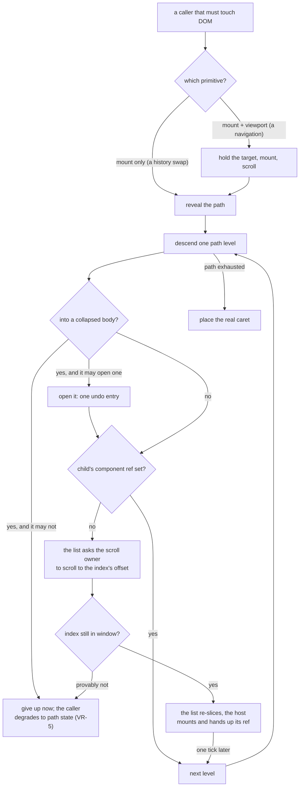

# The codebase map

So, I've noticed a slight blocker to people working on this repo - namely the few hundred source files in it. Skill issue honestly, but i'll play nice.

What's in this doc:

1. **The behavior → entry table**: the thing you saw break, the file that owns it, and the rule
   people keep breaking there.
2. **Keyboard and chords**: how a keypress becomes a command, and the one gate that inverts the
   codebase's usual instincts.
3. **The reveal path**: how you touch a block that windowing has unmounted.
4. **Blank lines and separators**: the family of helpers that keeps blank lines honest, and the
   join-cleanup family beside it.
5. **Keeping this map fresh**: the lint that checks every reference here, and how to add a row.

**Altitude.** Files and responsibilities only. No line numbers, no signatures, and no code beyond
a one-line call where its output is the quickest way to see a shape. A file is named by its full
path from the repo root; a symbol only where the symbol is the thing to find, written
`path :: Symbol`. Every such reference is machine-checked (§ Keeping this map fresh), so it
either resolves or the gate goes red.

**How to read a row.** The entry is where you put the breakpoint. The rule is the thing that's
been broken before, and nearly every one is the same rule in a different costume, rule 4 of
`docs/contributing/rules.md`: a behavior's logic lives at the one place every path crosses, not
at the call sites. So when you want to add a branch at one of these files, the rule in that row
is what you're arguing with.

A few of the words the repo coined survive in symbol names (`caret-doors.ts`, `HeightOracle`,
`clampToLandableRaw`). Since this may be your first doc in the repo, keep
[`glossary.md`](glossary.md) open beside it; every one of them is a line there.

## Behavior → entry

| Behavior                                                          | Entry                                                                                                                                                                                                                                                                                                                                                                                                                                                                                                                                                                                                                                                                                                                                                                                                                                                                                                                                                                                                                                                                                                                                                                                                                                                                                                                                                                                                                                                                                                    | The rule there                                                                                                                                                                                                                                                                                                                                                                                                                                                                                                                                                                                                                                                                                                                                                                                                                                                                                                                                                                                                                                                                                                                                                                                                                                                                                                                                                                                                                                                                                                                                                                                                                                                                                                                                                                        | Spec                                                                                                                                                                                 |
| ----------------------------------------------------------------- | -------------------------------------------------------------------------------------------------------------------------------------------------------------------------------------------------------------------------------------------------------------------------------------------------------------------------------------------------------------------------------------------------------------------------------------------------------------------------------------------------------------------------------------------------------------------------------------------------------------------------------------------------------------------------------------------------------------------------------------------------------------------------------------------------------------------------------------------------------------------------------------------------------------------------------------------------------------------------------------------------------------------------------------------------------------------------------------------------------------------------------------------------------------------------------------------------------------------------------------------------------------------------------------------------------------------------------------------------------------------------------------------------------------------------------------------------------------------------------------------------------- | ------------------------------------------------------------------------------------------------------------------------------------------------------------------------------------------------------------------------------------------------------------------------------------------------------------------------------------------------------------------------------------------------------------------------------------------------------------------------------------------------------------------------------------------------------------------------------------------------------------------------------------------------------------------------------------------------------------------------------------------------------------------------------------------------------------------------------------------------------------------------------------------------------------------------------------------------------------------------------------------------------------------------------------------------------------------------------------------------------------------------------------------------------------------------------------------------------------------------------------------------------------------------------------------------------------------------------------------------------------------------------------------------------------------------------------------------------------------------------------------------------------------------------------------------------------------------------------------------------------------------------------------------------------------------------------------------------------------------------------------------------------------------------------- | ------------------------------------------------------------------------------------------------------------------------------------------------------------------------------------ |
| Typing into a block                                               | `src/lib/components/blocks/editable-surface.ts` :: `createEditableSurface`, which writes through `src/lib/components/blocks/surface-write.ts` :: `writeText`, then `src/lib/tree-operations/content-write.ts` :: `updateNodeContent`                                                                                                                                                                                                                                                                                                                                                                                                                                                                                                                                                                                                                                                                                                                                                                                                                                                                                                                                                                                                                                                                                                                                                                                                                                                                     | Typed text reaches `updateNodeContent` through one commit (`src/lib/editor-actions/block-edit-core.ts` :: `commitLeafText`) or one in-place write (`src/lib/editor-actions/leaf-write.ts` :: `writeLeafInPlace`), at every depth (G4.75). Every other write to a leaf's bytes (a join, a cell write, a format toggle) goes through the kind's write rule, `src/lib/tree-operations/content-write.ts` :: `legalizeWrite` or `writeOwnRaw` / `normalizeOwnRaw` in `src/lib/tree-operations/node-primitives.ts`. A bare `raw` assignment at a call site is the bug you're looking for, and G4.28 fails one that isn't on its short allowlist                                                                                                                                                                                                                                                                                                                                                                                                                                                                                                                                                                                                                                                                                                                                                                                                                                                                                                                                                                                                                                                                                                                                             | `docs/design/editor.md` § 6                                                                                                                                                          |
| Keystroke batching for undo                                       | `src/lib/editor-actions/commit/text-batch.ts` :: `createTextBatch`                                                                                                                                                                                                                                                                                                                                                                                                                                                                                                                                                                                                                                                                                                                                                                                                                                                                                                                                                                                                                                                                                                                                                                                                                                                                                                                                                                                                                                       | The `setTimeout` here only detects a pause in typing. It never sequences anything (sequencing is `await tick()`), and a new timing primitive needs an entry in G4.4's allowlist, `src/lib/test/invariants/lint/file-rules.test.ts`                                                                                                                                                                                                                                                                                                                                                                                                                                                                                                                                                                                                                                                                                                                                                                                                                                                                                                                                                                                                                                                                                                                                                                                                                                                                                                                                                                                                                                                                                                                                                    | `docs/design/editor.md` § 11                                                                                                                                                         |
| Enter / split                                                     | `src/lib/schema/block-commands.ts` :: `dispatchKeyCommand`, then `src/lib/editor-actions/block-edit-core.ts` :: `createBlockEditCore` and `src/lib/tree-operations/node-ops.ts` :: `splitNode`, live rebalance in `src/lib/components/blocks/text/live-split-rebalance.ts` :: `rebalanceLiveSplit`                                                                                                                                                                                                                                                                                                                                                                                                                                                                                                                                                                                                                                                                                                                                                                                                                                                                                                                                                                                                                                                                                                                                                                                                       | A kind gets Enter by declaring the chord in its `keymap`, and the dispatcher doesn't read kind names. In live mode only, the two halves close and reopen whatever construct the cut crossed, through the one registered rebalancer (`splitNode` asks it), which checks its own bytes and declines when they don't add up                                                                                                                                                                                                                                                                                                                                                                                                                                                                                                                                                                                                                                                                                                                                                                                                                                                                                                                                                                                                                                                                                                                                                                                                                                                                                                                                                                                                                                                              | `docs/design/editor.md` § 8                                                                                                                                                          |
| Typing a construct into existence                                 | `src/lib/schema/block-completions.ts` :: `completeTypedLine`, gated at `src/lib/editor-actions/enter-completion.ts` :: `planCompletion` (reached from Enter through `planEnterCompletion`, and from each typed write (`src/lib/components/blocks/surface-write.ts` :: `writeText`) through `planTypedCompletion` for a completer that asks for that) and spent by `withEnterCompletion` in the same file; the built-in registrant is `src/lib/core/parsers/table-completion.ts`, the plugin one `src/lib/plugins/latex/math-completion.ts`                                                                                                                                                                                                                                                                                                                                                                                                                                                                                                                                                                                                                                                                                                                                                                                                                                                                                                                                                               | A grammar that needs adjacent lines (a table's header row plus its delimiter row, say) gets typed into existence by registering a completer, not by a branch at the split, and this entry reads no kind name. The gate is what guarantees a completer sees the whole typed line and nothing else, and the parser's own predicate bounds what it may take, so a shape the parser would reject can't be created here. A completer that sets `onType` (block math's `$$`) completes on the keystroke rather than waiting for Enter. The Enter consult wraps the composed `splitBlock` at the two bundle factories, above any container override, so a container can't take the branch out of its subtree. The caret a completer answers is line-relative, since only this entry knows which line ending it picked. One oddity: `src/lib/editor-actions/list-overrides.ts` keeps a `splitBlock` no-op under it. Nothing calls the list's own split today, and the shared core would run a prose split on a `listItem` if anything did                                                                                                                                                                                                                                                                                                                                                                                                                                                                                                                                                                                                                                                                                                                                                     | `docs/design/editor.md` § 8                                                                                                                                                          |
| Link editing (live mode)                                          | `src/lib/components/link-card/LinkCard.svelte` over `src/lib/components/link-card/link-card-commit.ts`, bytes from `src/lib/core/inline/link-source-bytes.ts` :: `buildLinkEditBytes`, committed through `src/lib/editor-actions/inline-range-commit.ts` :: `createInlineRangeCommit`                                                                                                                                                                                                                                                                                                                                                                                                                                                                                                                                                                                                                                                                                                                                                                                                                                                                                                                                                                                                                                                                                                                                                                                                                    | Live mode paints no destination, so the card is the only way to read or rewrite one. It addresses its link by path plus construct start, and it re-resolves after every edit, because a commit rebuilds the inline DOM                                                                                                                                                                                                                                                                                                                                                                                                                                                                                                                                                                                                                                                                                                                                                                                                                                                                                                                                                                                                                                                                                                                                                                                                                                                                                                                                                                                                                                                                                                                                                                | `docs/design/live-mode.md` § 4.6 (the focus model: open beside the caret on a click, trap on keyboard entry); scenarios in `src/lib/e2e/requirements/presentation/live-link-card.md` |
| Code block's language (marker-hiding modes)                       | `src/lib/components/blocks/code/CodeBlockRail.svelte` beside the editable element in `src/lib/components/blocks/code/CodeBlock.svelte`, bytes from `src/lib/schema/fenced-code-raw.ts` :: `writeFenceInfo`, committed through that block's `commitDisplay` entry                                                                                                                                                                                                                                                                                                                                                                                                                                                                                                                                                                                                                                                                                                                                                                                                                                                                                                                                                                                                                                                                                                                                                                                                                                         | A hidden fence line can't hold a caret, so the rail's (the side strip of buttons on the code box) language picker is the only way to read or rewrite the info string. It renders outside the contenteditable, which the render effect rebuilds on every commit. The rail also carries the copy button and, when the host installed `onRunCode` / `codeMenuItems`, the run and overflow ones                                                                                                                                                                                                                                                                                                                                                                                                                                                                                                                                                                                                                                                                                                                                                                                                                                                                                                                                                                                                                                                                                                                                                                                                                                                                                                                                                                                           | `docs/design/live-mode.md` § 4.7; scenarios in `src/lib/e2e/requirements/blocks/code/language-chip.md`                                                                               |
| Destructive joins (merge, range delete, range replace)            | `src/lib/tree-operations/leaf-range.ts` :: `replaceRangeInLeaf` for a range inside one leaf (typing, pasting or composing over a selection, a cut, a drag's cut), `joinLeaves` for the merge, and `cleanJoinedRaw` under both, the one reader of the registered cleaner in `src/lib/components/blocks/text/live-join-seam.ts` :: `cleanLiveJoinSeam` (the range delete still calls it directly); a surface reaches it from `beforeinput` through `src/lib/components/blocks/text/live-selection-edit.ts` :: `resolveLiveRangeEdit`; where the joined bytes will be stored comes from `src/lib/tree-operations/stored-as.ts` :: `storedAsAt` (or `storedAsIn`, from a list position the caller already holds)                                                                                                                                                                                                                                                                                                                                                                                                                                                                                                                                                                                                                                                                                                                                                                                             | Every join runs its bytes through this one place. In live mode only, the runs a cut stranded and the closer/opener pair a join brings back to back get dropped, after checking against what the two sides showed and that no construct is left enclosing nothing. The check reads the joined bytes where they'll be stored, so a list item's first line reads behind its marker and a cell's text reads as text. Otherwise the literal join stands                                                                                                                                                                                                                                                                                                                                                                                                                                                                                                                                                                                                                                                                                                                                                                                                                                                                                                                                                                                                                                                                                                                                                                                                                                                                                                                                    | `docs/design/editor.md` § 8                                                                                                                                                          |
| Joining two blocks (Backspace, Delete, list-item merge)           | `src/lib/tree-operations/node-ops.ts` :: `joinIntoLeaf`, called by `mergeIntoPrevDeepLeaf` and `mergeWithNext` in the same file and by `src/lib/tree-operations/list/unwrap-merge.ts` :: `mergeListItemIntoPrevious`                                                                                                                                                                                                                                                                                                                                                                                                                                                                                                                                                                                                                                                                                                                                                                                                                                                                                                                                                                                                                                                                                                                                                                                                                                                                                     | Every join writes the lower block's text through the leaf kind's write rule and its container's body rule, then reparses, so the kind follows the bytes. Backspace writes into the deepest prose leaf of the block above; Delete writes into the block itself and re-reads it. A join that reads as two blocks returns null, and the caller moves the caret instead                                                                                                                                                                                                                                                                                                                                                                                                                                                                                                                                                                                                                                                                                                                                                                                                                                                                                                                                                                                                                                                                                                                                                                                                                                                                                                                                                                                                                   | `docs/design/editor.md` § 8                                                                                                                                                          |
| Replacing a block with parsed blocks (paste, drop, unwrap)        | `src/lib/editor-actions/block-edit-core.ts` :: `createBlockEditCore`'s `replaceBlock`, which a path-holding caller reaches through `src/lib/editor-actions/paste-coordinator.ts` :: `createPasteCoordinator`                                                                                                                                                                                                                                                                                                                                                                                                                                                                                                                                                                                                                                                                                                                                                                                                                                                                                                                                                                                                                                                                                                                                                                                                                                                                                             | The one replace write escapes the new blocks for their container's body rule, keeps the old block's id only when the kind matches, moves a list item's task marker, and follows the caret through the fix-up of the neighbours. A route that splices parsed blocks in by hand skips all four, and G4.75 fails one that escapes on its own                                                                                                                                                                                                                                                                                                                                                                                                                                                                                                                                                                                                                                                                                                                                                                                                                                                                                                                                                                                                                                                                                                                                                                                                                                                                                                                                                                                                                                             | `docs/design/editor.md` § 3                                                                                                                                                          |
| Backspace at a block's start                                      | gate `src/lib/selection/shared-keydown.ts` :: `caretLandableBounds`, then `src/lib/editor-actions/nested/nested-block-edit.ts` :: `createNestedBlockEdit`, strategies in `src/lib/editor-actions/unwrap-strategies.ts`                                                                                                                                                                                                                                                                                                                                                                                                                                                                                                                                                                                                                                                                                                                                                                                                                                                                                                                                                                                                                                                                                                                                                                                                                                                                                   | "The start" means the first offset a caret can reach once the block's own markers go unpainted: whatever the DOM-to-offset traversal can land on, past any hidden run that opens the block. A kind joins the cascade by declaring `unwrapRole`, a merge role, or `contentStartBackspace`, not by a branch in the cascade. A table cell reaches the same bounds through its own plan (the exception the arrow row below names)                                                                                                                                                                                                                                                                                                                                                                                                                                                                                                                                                                                                                                                                                                                                                                                                                                                                                                                                                                                                                                                                                                                                                                                                                                                                                                                                                         | `docs/design/editor.md` § 8                                                                                                                                                          |
| What a block component must provide                               | `src/lib/block-component.ts`, each member's docstring                                                                                                                                                                                                                                                                                                                                                                                                                                                                                                                                                                                                                                                                                                                                                                                                                                                                                                                                                                                                                                                                                                                                                                                                                                                                                                                                                                                                                                                    | Four members are required (`focus`, `getCursorOffset`, `editable`, `focusable`); the rest is optional, except that `ContainerBlockComponent` promotes a container's descent verbs to required, since a caret entering a container has to descend. Omitting an optional is a supported answer the caller falls back from, so never fake one: a `measurePartialRects` that guesses paints worse than the full-block overlay                                                                                                                                                                                                                                                                                                                                                                                                                                                                                                                                                                                                                                                                                                                                                                                                                                                                                                                                                                                                                                                                                                                                                                                                                                                                                                                                                             | `docs/design/editor.md` § 4                                                                                                                                                          |
| Caret landing                                                     | `src/lib/selection/caret-doors.ts` :: `placeCaret`, dispatched by `src/lib/editor-actions/focus/focus-dispatch.ts` :: `dispatchMoveFocus`                                                                                                                                                                                                                                                                                                                                                                                                                                                                                                                                                                                                                                                                                                                                                                                                                                                                                                                                                                                                                                                                                                                                                                                                                                                                                                                                                                | A caret write passes through one of a few allowed entry points (the file `src/lib/selection/caret-doors.ts` is named for them). Build `focus` from `placeCaret` rather than by hand. `parkCaret` is the entry the extend path takes (G2.12); `focusAtColumn` is the plain vertical move's, and skips ending the range because that move already collapsed it. `src/lib/editor-actions/focus/focus-landing.ts` :: `verticalArrival` classifies a vertical arrival for both vertical entries (the per-block landing and a container's column entry) as entering the block's widget, passing over it, or placing a caret. Every text entry bottoms out in `src/lib/components/blocks/editable-surface.ts` :: `parkCaret`, which clamps every offset, special codes included, into the range a caret can sit at (identity where markers paint); `CURSOR_EXACT_START` is the one unclamped position, byte 0 of a split's second half. A whole-block kind ends instead by focusing its hidden input host. `focusAtColumn` is the other exception: it measures its own landing and writes that offset exactly, skipping `parkCaret`. The DOM write itself is `src/lib/cursor/widget-offset.ts` :: `placeCaretAtRaw`, reached through each surface's `src/lib/cursor/surface-backend.ts` :: `createSurfaceBackend`, and G4.36 (`src/lib/test/invariants/lint/manifest-rules.test.ts`) keeps every other native selection write inside `src/lib/cursor/widget-offset.ts` or a declared few files that select nodes they already hold. An entry a consumer's own component owns bottoms out nowhere in here, so G1.33 fires from the root's `focusin` listener in `src/lib/components/editor-root-focus.ts` instead: placing a caret means focusing a surface, and that listener sees every one | `docs/design/editor.md` § 4                                                                                                                                                          |
| Where an edit puts the caret                                      | `src/lib/selection/caret-landing.ts` :: `createCaretLanding`, called from `src/lib/editor-actions/commit/undo-controller.ts` :: `createUndoController` with the commit's landing                                                                                                                                                                                                                                                                                                                                                                                                                                                                                                                                                                                                                                                                                                                                                                                                                                                                                                                                                                                                                                                                                                                                                                                                                                                                                                                         | An edit hands back a position (the commit's `landing`, or the scope's `land` for a move with no commit); G1.43 fails a `landing` that places a caret itself. The service resolves the position to a leaf (`src/lib/selection/caret-target.ts` :: `caretTargetFor`), mounts it, drops it when an undo, redo or document swap came in between, focuses it through the block's `focus`, counts a start or end landing as outside a hidden closer, and scrolls an off-screen block into view. A block delete, and a range delete that takes a block whole, names what removed it (the key, a cut, or no key at all) and lands at `src/lib/selection/caret-target.ts` :: `survivorAfterRemoval`. A stored selection goes back through `restore` at its exact bytes (its callers are listed in § The reveal path). A gesture over a selection that spans blocks lands once, from its last commit: the removal's for Backspace, Delete, cut and a command key, the typed character's or the paste's otherwise, and none for an IME composition, whose caret the IME owns                                                                                                                                                                                                                                                                                                                                                                                                                                                                                                                                                                                                                                                                                                                     | `docs/design/editor.md` § 11                                                                                                                                                         |
| Deleting the last block, or a container's last child              | `src/lib/tree-operations/keep-one-block.ts` :: `keepOneBlock`, run by every commit in `src/lib/editor-actions/commit/undo-controller.ts` :: `createUndoController`; for containers, `src/lib/tree-operations/cleanup.ts` :: `cascadeCleanupEmptyAncestors` (range deletes, a list promote) and `src/lib/editor-actions/nested/emptied-container.ts` :: `removeEmptiedContainer` (a container's own delete and empty replace, the list unwrap); which kinds must hold a child is `src/lib/schema/block-kind-descriptor.ts` :: `mustHoldChild`                                                                                                                                                                                                                                                                                                                                                                                                                                                                                                                                                                                                                                                                                                                                                                                                                                                                                                                                                             | The document always keeps a block, and the commit adds the empty paragraph, never the edit, so its ids and the one undo stay right. A container an edit empties goes, and its parent after it if that empties too. A route that leaves one behind fails G1.44 at the commit                                                                                                                                                                                                                                                                                                                                                                                                                                                                                                                                                                                                                                                                                                                                                                                                                                                                                                                                                                                                                                                                                                                                                                                                                                                                                                                                                                                                                                                                                                           | `docs/design/editor.md` § 8                                                                                                                                                          |
| Announcing a selection change                                     | `src/lib/selection/selection-announcer.ts` :: `createSelectionAnnouncer`, wired in `src/lib/components/Editor.svelte`                                                                                                                                                                                                                                                                                                                                                                                                                                                                                                                                                                                                                                                                                                                                                                                                                                                                                                                                                                                                                                                                                                                                                                                                                                                                                                                                                                                    | Every `selectionChange` emission goes through the announcer, which remembers what it last sent. The editor's own placements announce at the placement (`src/lib/selection/caret-doors.ts` :: `placeCaret`, and `focusAtColumn` in both `src/lib/components/blocks/editable-surface.ts` and `src/lib/editor-actions/container-block-component.ts` for the vertical arrow's two landings), so a subscriber hears an arrival before the bytes typed there; `src/lib/components/editor-root-listeners.ts` :: `installSelectionChangeBridge` reports the carets the browser places, off `selectionchange` and off the click that precedes it, and drops a position already announced. A placement landing the caret where it already sits is dropped too, so a reveal landing and a restore to the current position say nothing. An emission inside `src/lib/selection/selection-state.svelte.ts` :: `batch` waits for the batch, so a gesture that writes state and then moves the caret still notifies once                                                                                                                                                                                                                                                                                                                                                                                                                                                                                                                                                                                                                                                                                                                                                                              | `docs/design/editor.md` § 12                                                                                                                                                         |
| Where a press lands the caret                                     | `src/lib/selection/block-hit-test.ts` :: `blockAtPoint` names the block, the kind's `caretTargetAtPoint` names the landing inside it (an inline widget kind names its own through `revealOffsetAtPoint`, read at the click reveal in `src/lib/components/blocks/text/widget-interaction.ts`), and the point-to-offset half is `src/lib/cursor/point-offset.ts` :: `caretOffsetAtPoint` (nearest, clamping into the element's box) beside its exact counterpart `offsetFromViewportPoint`, which moves a point in the top or bottom padding level with a line for both. A plain click in a surface's top or bottom padding is placed through it by `src/lib/selection/cross-block/pointer.ts` :: `handlePointerDown`, not by the browser                                                                                                                                                                                                                                                                                                                                                                                                                                                                                                                                                                                                                                                                                                                                                                  | Neither does offset arithmetic of its own: both resolve through `src/lib/cursor/widget-offset.ts` :: `domTextOffsetAtNode`, so a plugin's hook and the editor's own hit test read one DOM-to-offset traversal. A press beside an atomic widget (which holds no caret position) refines to a widget edge through `src/lib/cursor/widget-edge-snap.ts` :: `nearestWidgetEdgeSeat`: the edge nearest the point, so a run of flush widgets answers the one the press is beside, a press on a character-like widget names the edge on its side, and a press above or below one, sharing its columns, does the same                                                                                                                                                                                                                                                                                                                                                                                                                                                                                                                                                                                                                                                                                                                                                                                                                                                                                                                                                                                                                                                                                                                                                                         | `docs/design/caret-placement.md`, the whole click walked stage by stage                                                                                                              |
| Keystrokes on a whole-block kind                                  | `src/lib/editor-actions/container-block-component.ts` :: `handleWholeBlockKeys`, with `dispatchWholeBlockGlobalChord` and `focusAcrossBlockEdge` beside it and `createContainerBlockComponent` in the same file                                                                                                                                                                                                                                                                                                                                                                                                                                                                                                                                                                                                                                                                                                                                                                                                                                                                                                                                                                                                                                                                                                                                                                                                                                                                                          | One family, not a branch per kind: Enter creates the follower, Backspace/Delete removes the block, Mod+C/Mod+X copies or cuts it whole, a character key opens a paragraph below, and a plain arrow exits across the block edge. Reading mode gates only the mutating branches, so navigation stays live. The same file holds the container shim, which is where a container's promoted descent verbs (`src/lib/block-component.ts` :: `ContainerBlockComponent`) are exported                                                                                                                                                                                                                                                                                                                                                                                                                                                                                                                                                                                                                                                                                                                                                                                                                                                                                                                                                                                                                                                                                                                                                                                                                                                                                                         | `docs/design/editor.md` § 8                                                                                                                                                          |
| Focus on a whole-block kind                                       | `src/lib/editor-actions/whole-block-focus-surface.ts` :: `createWholeBlockInputProxy`, predicate `src/lib/editor-actions/whole-block-focus-surface.ts` :: `isEditableEventTarget`                                                                                                                                                                                                                                                                                                                                                                                                                                                                                                                                                                                                                                                                                                                                                                                                                                                                                                                                                                                                                                                                                                                                                                                                                                                                                                                        | A block that is its own focus target has no editing surface of its own, so DOM focus lands on a hidden editing host mounted in the block's box rather than on the declared element (a render swap replaces that element). `beforeinput` and `compositionend` fire on the host, and it's the block's one tab stop in each direction. Every reader asking "is this a real editable surface" goes through the predicate or declares its own answer (G4.47)                                                                                                                                                                                                                                                                                                                                                                                                                                                                                                                                                                                                                                                                                                                                                                                                                                                                                                                                                                                                                                                                                                                                                                                                                                                                                                                               | `docs/design/editor.md` § 8                                                                                                                                                          |
| Hidden runs and the offsets a caret can reach                     | `src/lib/cursor/widget-offset.ts` :: `landingSegments`, bounds from `src/lib/cursor/widget-offset.ts` :: `landableDomTextBounds` and `src/lib/cursor/widget-offset.ts` :: `clampToLandableRaw`                                                                                                                                                                                                                                                                                                                                                                                                                                                                                                                                                                                                                                                                                                                                                                                                                                                                                                                                                                                                                                                                                                                                                                                                                                                                                                           | This file is the one place that translates between DOM positions and raw offsets, so it answers "what can a caret reach". A gate that compares a caret against a block's declared content range instead of the offsets a caret can reach is the bug. An ambient marker run (the container's marker prefix) is unreachable; a decoration widget or an atomic widget is opaque but still has reachable edges, and those two aren't the same answer                                                                                                                                                                                                                                                                                                                                                                                                                                                                                                                                                                                                                                                                                                                                                                                                                                                                                                                                                                                                                                                                                                                                                                                                                                                                                                                                      | `docs/design/editor.md` § 4                                                                                                                                                          |
| Arrow at a block boundary                                         | `src/lib/selection/shared-keydown.ts` :: `handleSharedKeydown`                                                                                                                                                                                                                                                                                                                                                                                                                                                                                                                                                                                                                                                                                                                                                                                                                                                                                                                                                                                                                                                                                                                                                                                                                                                                                                                                                                                                                                           | Every arrow boundary test lives here. A surface that grows its own arrow handling routes through it instead of comparing offsets itself. Two documented exceptions, both in the table: `src/lib/components/blocks/table/cell-keydown-plan.ts` plans a cell's own edge presses, since its hop is between cells rather than blocks, and takes the same reachable bounds as input, so the two can't disagree about where an edge is; and `src/lib/components/blocks/table/TableCellBlock.svelte` :: `startIntraTableRect` tests a cell's Shift+Up/Down edge to start a cell rectangle. A plugin's own textarea (mermaid's source editor) is its own business                                                                                                                                                                                                                                                                                                                                                                                                                                                                                                                                                                                                                                                                                                                                                                                                                                                                                                                                                                                                                                                                                                                             | `docs/design/editor.md` § 8                                                                                                                                                          |
| Sticky column                                                     | Capture via `noteKey` on `src/lib/cursor/caret-memory.ts` :: `createCaretMemory`, consumed by `src/lib/editor-actions/focus/focus-landing.ts` :: `consumeStickyLanding`                                                                                                                                                                                                                                                                                                                                                                                                                                                                                                                                                                                                                                                                                                                                                                                                                                                                                                                                                                                                                                                                                                                                                                                                                                                                                                                                  | Capture and consumption are separate concerns in separate files, and `focusAtColumn` is a pure receiver with no fallback of its own                                                                                                                                                                                                                                                                                                                                                                                                                                                                                                                                                                                                                                                                                                                                                                                                                                                                                                                                                                                                                                                                                                                                                                                                                                                                                                                                                                                                                                                                                                                                                                                                                                                   | `docs/design/editor.md` § 8                                                                                                                                                          |
| Caret edge affinity                                               | Held by `src/lib/cursor/caret-memory.ts` :: `createCaretMemory`, decided by `src/lib/cursor/edge-affinity.ts` :: `classifyArrivalKey`, consumed by `src/lib/components/blocks/text/edge-seat.ts` :: `resolveEdgeSeat`                                                                                                                                                                                                                                                                                                                                                                                                                                                                                                                                                                                                                                                                                                                                                                                                                                                                                                                                                                                                                                                                                                                                                                                                                                                                                    | One editor-wide memory holds the side together with the sticky column and the pending marks, so nothing drops one without the others: a key updates all three and `forget` drops all three. The edge resolver is the one reader that places bytes by it, and it reads the kind's policy first and the memory's `side()` second. The code block reads `side()` too, only to tell a caret that stepped in from one that was placed (the language picker opens for the second)                                                                                                                                                                                                                                                                                                                                                                                                                                                                                                                                                                                                                                                                                                                                                                                                                                                                                                                                                                                                                                                                                                                                                                                                                                                                                                           | `src/lib/cursor/caret-memory.ts` header                                                                                                                                              |
| A typed delimiter                                                 | Resolved in `src/lib/components/blocks/text/delimiter-autopair.ts` :: `resolveDelimiterAutoPair`, applied by the same file's `applyDelimiterAutoPair`, the one `beforeinput` handler both prose surfaces run (G4.65); the keydown path asks the same resolver what a typed delimiter writes; the pair it wrote is held per editor by `src/lib/components/blocks/text/auto-pair-record.ts` :: `createAutoPairRecord`                                                                                                                                                                                                                                                                                                                                                                                                                                                                                                                                                                                                                                                                                                                                                                                                                                                                                                                                                                                                                                                                                      | The keystroke writes the matching closer after the caret, a closer typed over that one steps past it, and a closer typed by hand completes the construct; after either the caret means outside the construct. A pair that would re-kind the line (`****`, `~~~~`) is declined. Only the empty pair it wrote is stepped over, collapsed or taken by Backspace; the same bytes typed by hand are the user's                                                                                                                                                                                                                                                                                                                                                                                                                                                                                                                                                                                                                                                                                                                                                                                                                                                                                                                                                                                                                                                                                                                                                                                                                                                                                                                                                                             | `docs/design/live-mode.md` § 4.2                                                                                                                                                     |
| Inline construct edges                                            | Rows in `src/lib/schema/inline-construct-policy.ts` :: `getInlineConstructPolicy`, read by the helpers `src/lib/components/blocks/text/edge-policy-dispatch.ts` :: `createEdgePolicyDispatch` calls (`src/lib/components/blocks/text/edge-seat.ts`, `src/lib/components/blocks/text/construct-edge-delete.ts`, `src/lib/components/blocks/text/pending-mark-insert.ts`), and by the split rebalancer (`src/lib/components/blocks/text/live-split-rebalance.ts`), the join cleaner (`src/lib/components/blocks/text/live-join-seam.ts`) and the inline menu's trigger check (`src/lib/inline-menu/inline-menu-session.ts`)                                                                                                                                                                                                                                                                                                                                                                                                                                                                                                                                                                                                                                                                                                                                                                                                                                                                                | A construct's edge behavior (which side a typed byte lands on, whether emptying it unwraps, how a split treats it) is its declared row. Everything reads the table, not a kind list                                                                                                                                                                                                                                                                                                                                                                                                                                                                                                                                                                                                                                                                                                                                                                                                                                                                                                                                                                                                                                                                                                                                                                                                                                                                                                                                                                                                                                                                                                                                                                                                   | `src/lib/schema/inline-construct-policy.ts` header                                                                                                                                   |
| Inline mark vocabulary                                            | The `mark` column of the same rows, read through `src/lib/schema/inline-construct-policy.ts` :: `listInlineMarks` and `inlineMarkForCommand`                                                                                                                                                                                                                                                                                                                                                                                                                                                                                                                                                                                                                                                                                                                                                                                                                                                                                                                                                                                                                                                                                                                                                                                                                                                                                                                                                             | What a format chord writes: the delimiter run, the nesting rank a set of marks wraps in, and the command that toggles it. Both block surfaces resolve the command through the table instead of carrying a branch per format, and a rank or command declared twice fails G1.31 at the mount check                                                                                                                                                                                                                                                                                                                                                                                                                                                                                                                                                                                                                                                                                                                                                                                                                                                                                                                                                                                                                                                                                                                                                                                                                                                                                                                                                                                                                                                                                      | `src/lib/schema/inline-construct-policy.ts` header                                                                                                                                   |
| Inline widgets and decorations at a caret edge                    | `src/lib/components/blocks/text/edge-policy-dispatch.ts` :: `createEdgePolicyDispatch`                                                                                                                                                                                                                                                                                                                                                                                                                                                                                                                                                                                                                                                                                                                                                                                                                                                                                                                                                                                                                                                                                                                                                                                                                                                                                                                                                                                                                   | One dispatcher ranks the three things a caret can sit against (atomic widget, decoration widget, the container's marker prefix), and the ranking is written in this file. A marker-hiding mode changes which runs are unpainted, never which of the three owns the press. Reading mode stops the decoration and marker-prefix handlers and everything ranked below them; the atomic-widget handler, ranked above, still selects but commits nothing                                                                                                                                                                                                                                                                                                                                                                                                                                                                                                                                                                                                                                                                                                                                                                                                                                                                                                                                                                                                                                                                                                                                                                                                                                                                                                                                   | `docs/design/plugin-contract.md`                                                                                                                                                     |
| Pending marks                                                     | Set by the live-mode collapsed-caret branch of `toggleFormat` in both prose surfaces, `src/lib/components/blocks/text/TextEditableBlock.svelte` and `src/lib/components/blocks/table/TableCellBlock.svelte`, and by an edge delete that unwraps a construct (`src/lib/components/blocks/text/edge-policy-dispatch.ts`); held by `src/lib/cursor/caret-memory.ts` :: `createCaretMemory`, spent by `src/lib/components/blocks/text/pending-mark-insert.ts` :: `resolveMarkedInsertion`                                                                                                                                                                                                                                                                                                                                                                                                                                                                                                                                                                                                                                                                                                                                                                                                                                                                                                                                                                                                                    | Held in the caret memory beside the edge affinity, so every place that forgets how the caret arrived drops the marks with it. One insertion spends the set, and only a text write spends it (G4.31)                                                                                                                                                                                                                                                                                                                                                                                                                                                                                                                                                                                                                                                                                                                                                                                                                                                                                                                                                                                                                                                                                                                                                                                                                                                                                                                                                                                                                                                                                                                                                                                   | `src/lib/cursor/pending-marks.ts` header                                                                                                                                             |
| Reorder (Alt+Arrow, drag)                                         | `src/lib/editor-actions/reorder-action.ts` :: `createReorderAction`, the drag in `src/lib/editor-actions/reorder-drag.ts`                                                                                                                                                                                                                                                                                                                                                                                                                                                                                                                                                                                                                                                                                                                                                                                                                                                                                                                                                                                                                                                                                                                                                                                                                                                                                                                                                                                | The drag paints a ghost and an insertion line and changes no tree. Exactly one permutation commits, on drop, and the caret and the announcement ride the landing that commit reports, since fixing up the joins a move disturbed can merge a block above it                                                                                                                                                                                                                                                                                                                                                                                                                                                                                                                                                                                                                                                                                                                                                                                                                                                                                                                                                                                                                                                                                                                                                                                                                                                                                                                                                                                                                                                                                                                           | `docs/design/editor.md` § 8                                                                                                                                                          |
| Cross-block selection                                             | `src/lib/selection/selection-state.svelte.ts` :: `createSelectionState`, keys in `src/lib/selection/cross-block/dispatch.ts` :: `createCrossBlockHandlers`                                                                                                                                                                                                                                                                                                                                                                                                                                                                                                                                                                                                                                                                                                                                                                                                                                                                                                                                                                                                                                                                                                                                                                                                                                                                                                                                               | Endpoints are `(path, offset)` data. Don't consult mounted DOM to decide what's selected. The chords are spread over two phases: the first Shift+Arrow across a block edge is in `src/lib/selection/shared-keydown.ts`, the first Mod+A from a collapsed caret in `src/lib/selection/cross-block/keydown.ts` :: `handleCrossBlockEntry`, and extending a range already in progress in `src/lib/selection/cross-block/keydown.ts` :: `handleCrossBlockActive`, so a new chord needs both its first press and its extend path. The same store holds the gap caret and an image selected whole, and its one private writer ends the other two whenever one is taken, so no call site keeps them apart                                                                                                                                                                                                                                                                                                                                                                                                                                                                                                                                                                                                                                                                                                                                                                                                                                                                                                                                                                                                                                                                                    | `docs/design/editor.md` § 10                                                                                                                                                         |
| Selecting an inline widget whole                                  | `src/lib/selection/caret-doors.ts` :: `selectWidgetWhole`, held by `src/lib/selection/selection-state.svelte.ts` :: `createSelectionState`                                                                                                                                                                                                                                                                                                                                                                                                                                                                                                                                                                                                                                                                                                                                                                                                                                                                                                                                                                                                                                                                                                                                                                                                                                                                                                                                                               | Select a widget through `selectWidgetWhole`, never by writing the store (G4.94). Any caret or range the editor puts down ends a selected widget on its own (G1.46), so a new placement route needs no clear of its own, as long as it goes through `placeCaret` or, for a range inside one block, `selectInBlock`                                                                                                                                                                                                                                                                                                                                                                                                                                                                                                                                                                                                                                                                                                                                                                                                                                                                                                                                                                                                                                                                                                                                                                                                                                                                                                                                                                                                                                                                     | `docs/design/editor.md` § 10                                                                                                                                                         |
| What a cross-block range covers                                   | `src/lib/selection/range-coverage.ts` :: `coverRange` and `rangeCoverage`, read by `src/lib/selection/range-delete.ts` :: `rangeDelete` (handed the coverage by `src/lib/selection/cross-block/range-replace.ts` :: `replaceRange`), `src/lib/selection/clipboard-text.ts` :: `collectCrossBlockText`, `src/lib/selection/cross-block/format-range.ts` :: `planCrossBlockFormat` and `src/lib/selection/cross-block/format-toggle.ts`, and, through `rangeCoverage` on the editor services, `src/lib/components/SelectionOverlay.svelte`, `src/lib/components/blocks/table/TableBlock.svelte` and the cell's paste and copy in `src/lib/components/blocks/table/TableCellBlock.svelte`                                                                                                                                                                                                                                                                                                                                                                                                                                                                                                                                                                                                                                                                                                                                                                                                                   | The delete, the copy, the paste, the type-over, the format toggle and the overlay read one answer, so they agree on the table row snap, a closed details taken whole, which blocks the range holds whole and a table's rectangle of cells. Ask `rangeCoverage`; don't walk the range, bound a rectangle or ask whether a container is closed in a reader (G4.80, G4.81, G4.95)                                                                                                                                                                                                                                                                                                                                                                                                                                                                                                                                                                                                                                                                                                                                                                                                                                                                                                                                                                                                                                                                                                                                                                                                                                                                                                                                                                                                        | `docs/design/editor.md` § 10                                                                                                                                                         |
| Anything deleted, cut, typed or pasted over a cross-block range   | `src/lib/selection/cross-block/range-replace.ts` :: `replaceRange`                                                                                                                                                                                                                                                                                                                                                                                                                                                                                                                                                                                                                                                                                                                                                                                                                                                                                                                                                                                                                                                                                                                                                                                                                                                                                                                                                                                                                                       | Backspace, Delete, cut, typing, an IME composition, paste, and Enter, Tab or Mod+digit all come through here. It picks the removal from what the range covers (with nothing to insert, a whole row, column or table goes; typed or pasted text replaces a block held whole), puts the insertion where the removal left the caret, and keeps it all one undo entry with one landing. Remove a range nowhere else (G4.108)                                                                                                                                                                                                                                                                                                                                                                                                                                                                                                                                                                                                                                                                                                                                                                                                                                                                                                                                                                                                                                                                                                                                                                                                                                                                                                                                                              | `docs/design/editor.md` § 10                                                                                                                                                         |
| Table cells in a selection (which offsets count cells)            | `src/lib/schema/block-kind-descriptor.ts` :: `countsCells` (which blocks count cells) and `src/lib/schema/block-kind-descriptor.ts` :: `isGridKind` (which kinds are grids), stored through `src/lib/selection/table-endpoint-snap.ts` :: `normalizeTableEndpoint`; the index math is `src/lib/cursor/coordinate-spaces.ts` :: `rowMajorCellIndex`, `cellRowCol` and `cellRectBounds`, a cell endpoint is built by `src/lib/selection/primitives.ts` :: `cellPoint`, and a live rectangle becomes rows and columns in `src/lib/selection/range-coverage.ts` :: `rangeCoverage` (its `grid`), which the table reads through `rangeCoverage` on the editor services                                                                                                                                                                                                                                                                                                                                                                                                                                                                                                                                                                                                                                                                                                                                                                                                                                        | Every point on a table path carries `cellCoordinate: true`, both corners of a rectangle included. To read an offset, check the flag, not the kind or whether the two paths match. A hand-written `row * columnCount + col` or a hand-built `{ cellCoordinate: true }` literal is a second copy of these                                                                                                                                                                                                                                                                                                                                                                                                                                                                                                                                                                                                                                                                                                                                                                                                                                                                                                                                                                                                                                                                                                                                                                                                                                                                                                                                                                                                                                                                               | `docs/design/invariants.md` (G1.29)                                                                                                                                                  |
| What a cross-block range paints over a block                      | `src/lib/selection/primitives.ts` :: `blockPaintsWholeBox`, read by `src/lib/components/SelectionOverlay.svelte`, mounted by `src/lib/components/BlockHost.svelte` and by `src/lib/components/blocks/list/ListItemBlock.svelte`                                                                                                                                                                                                                                                                                                                                                                                                                                                                                                                                                                                                                                                                                                                                                                                                                                                                                                                                                                                                                                                                                                                                                                                                                                                                          | A block the range holds whole paints one box over everything it renders, the frame a container draws from its markers included, and its descendants paint none. Delegation to child hosts decides only who measures endpoint rects, so a kind whose frame is no child block is painted all the same                                                                                                                                                                                                                                                                                                                                                                                                                                                                                                                                                                                                                                                                                                                                                                                                                                                                                                                                                                                                                                                                                                                                                                                                                                                                                                                                                                                                                                                                                   | `docs/design/editor.md` § 10                                                                                                                                                         |
| A block path read off a DOM node                                  | `src/lib/selection/path-lookup.ts` :: `readBlockPath`, walked up from a descendant by `src/lib/selection/path-lookup.ts` :: `findBlockPathForElement`                                                                                                                                                                                                                                                                                                                                                                                                                                                                                                                                                                                                                                                                                                                                                                                                                                                                                                                                                                                                                                                                                                                                                                                                                                                                                                                                                    | The one place `data-block-path` is parsed, and the shape check is part of the read: anything but a list of numbers answers null, so nothing downstream addresses the tree with a path-shaped lie. A source scan in `src/lib/test/invariants/lint/file-rules.test.ts` fails a second parser                                                                                                                                                                                                                                                                                                                                                                                                                                                                                                                                                                                                                                                                                                                                                                                                                                                                                                                                                                                                                                                                                                                                                                                                                                                                                                                                                                                                                                                                                            | `docs/design/editor.md` § 10                                                                                                                                                         |
| Multi-click selection (word, block, drag)                         | `src/lib/selection/multi-click.ts` :: `installMultiClickSelect`, the word rule in `src/lib/selection/multi-click.ts` :: `wordSpanAt`, the drag's unit in `src/lib/selection/drag-pointer.ts` :: `DragGranularity`                                                                                                                                                                                                                                                                                                                                                                                                                                                                                                                                                                                                                                                                                                                                                                                                                                                                                                                                                                                                                                                                                                                                                                                                                                                                                        | From the second click the editor owns the gesture and the browser paints nothing. The word is read off the block's own text with markers and widgets blanked, so it never depends on the platform's word rule and never swallows a formula beside it. A double-click on an inline widget is still the widget's                                                                                                                                                                                                                                                                                                                                                                                                                                                                                                                                                                                                                                                                                                                                                                                                                                                                                                                                                                                                                                                                                                                                                                                                                                                                                                                                                                                                                                                                        | `docs/design/editor.md` § 10                                                                                                                                                         |
| A widget's own pointer gesture                                    | `src/lib/selection/pointer-gesture.ts` :: `claimsPointerGesture`, read by the editor's press classifier in `src/lib/components/editor-root-gestures.ts`                                                                                                                                                                                                                                                                                                                                                                                                                                                                                                                                                                                                                                                                                                                                                                                                                                                                                                                                                                                                                                                                                                                                                                                                                                                                                                                                                  | A press inside an element carrying `POINTER_GESTURE_ATTR` is that widget's gesture, so the margin drag declines it, and so does the click sequence for a surface outside every editable (its `marginBlockAt` branch; a widget inside one goes through `pressesInlineWidget`). Declared on the element, because pointer events are delegated at the app root and a component's own `stopPropagation` runs after the editor's listeners                                                                                                                                                                                                                                                                                                                                                                                                                                                                                                                                                                                                                                                                                                                                                                                                                                                                                                                                                                                                                                                                                                                                                                                                                                                                                                                                                 | `docs/design/plugin-contract.md`                                                                                                                                                     |
| Dropping a dragged selection                                      | `src/lib/selection/selection-drop.ts` :: `installSelectionDrop`, the two coordinate reads between its halves in `src/lib/selection/selection-drop.ts` :: `dropOffsetAfterCut` and `src/lib/selection/selection-drop.ts` :: `shiftPathAfterSplice`                                                                                                                                                                                                                                                                                                                                                                                                                                                                                                                                                                                                                                                                                                                                                                                                                                                                                                                                                                                                                                                                                                                                                                                                                                                        | The browser's own drop is two native edits committed apart, so the editor cancels it and writes both blocks' raws under one snapshot. The payload is the source surface's own bytes (a paragraph's, or a table cell's), not the drag's plain text, so live-mode markers travel with it. The caret drawn while the drag is held reads the same landing the release uses, so the two cannot disagree, and a landing the drop would decline draws none                                                                                                                                                                                                                                                                                                                                                                                                                                                                                                                                                                                                                                                                                                                                                                                                                                                                                                                                                                                                                                                                                                                                                                                                                                                                                                                                   | `docs/design/editor.md` § 10                                                                                                                                                         |
| An inline format toggle over a cross-block range                  | plan `src/lib/selection/cross-block/format-range.ts` :: `planCrossBlockFormat`, applied by `src/lib/selection/cross-block/format-toggle.ts` :: `createCrossBlockCommands`, routed at `src/lib/schema/block-commands.ts` :: `runResolvedCommand`                                                                                                                                                                                                                                                                                                                                                                                                                                                                                                                                                                                                                                                                                                                                                                                                                                                                                                                                                                                                                                                                                                                                                                                                                                                          | Every span goes through the single-block toggle (`src/lib/core/inline/format-toggle.ts`), so a cross-block press has no branches of its own; how the range decomposes and picks a direction is the collapsible section in `docs/design/editor.md` § 5. Participation is the kind descriptor's declaration, never a kind name, and a grid joins through its cells, the ones `src/lib/selection/range-coverage.ts` :: `rangeCoverage` says the range holds                                                                                                                                                                                                                                                                                                                                                                                                                                                                                                                                                                                                                                                                                                                                                                                                                                                                                                                                                                                                                                                                                                                                                                                                                                                                                                                              | `docs/design/editor.md` § 5                                                                                                                                                          |
| The gap caret                                                     | arrival `src/lib/selection/gap-caret.ts` :: `tryGapStop`, eligibility `src/lib/selection/gap-caret.ts` :: `gapEligibleAt`                                                                                                                                                                                                                                                                                                                                                                                                                                                                                                                                                                                                                                                                                                                                                                                                                                                                                                                                                                                                                                                                                                                                                                                                                                                                                                                                                                                | Eligibility is the kind's own `gapEdges` declaration, so there's no kind list at the read site                                                                                                                                                                                                                                                                                                                                                                                                                                                                                                                                                                                                                                                                                                                                                                                                                                                                                                                                                                                                                                                                                                                                                                                                                                                                                                                                                                                                                                                                                                                                                                                                                                                                                        | `docs/design/editor.md` § 10                                                                                                                                                         |
| Copy / cut                                                        | `src/lib/components/blocks/editable-surface.ts` :: `createClipboardHandlers`, root fallback `src/lib/components/editor-root-clipboard.ts` :: `createEditorRootClipboard`                                                                                                                                                                                                                                                                                                                                                                                                                                                                                                                                                                                                                                                                                                                                                                                                                                                                                                                                                                                                                                                                                                                                                                                                                                                                                                                                 | `preventDefault` is the receipt the root handler reads. Don't handle an event a surface already handled                                                                                                                                                                                                                                                                                                                                                                                                                                                                                                                                                                                                                                                                                                                                                                                                                                                                                                                                                                                                                                                                                                                                                                                                                                                                                                                                                                                                                                                                                                                                                                                                                                                                               | `docs/design/editor.md` § 10                                                                                                                                                         |
| Paste                                                             | `src/lib/tree-operations/paste/dispatch.ts` :: `pasteDispatch`                                                                                                                                                                                                                                                                                                                                                                                                                                                                                                                                                                                                                                                                                                                                                                                                                                                                                                                                                                                                                                                                                                                                                                                                                                                                                                                                                                                                                                           | One parse-and-route path. Its upward edges are inverted interfaces rather than imports: `src/lib/tree-operations/paste/paste-deps.ts` :: `PasteCommitCoordinator` for the commit sites, `src/lib/action-contracts.ts` :: `BlockEditActions` for the target's level. The pasted lines take the document's line ending, `src/lib/core/lines.ts` :: `documentLineEnding`. On a prose surface or a table cell, a paste over a selection replaces it with the pasted text through `src/lib/tree-operations/leaf-range.ts` :: `replaceRangeInLeaf`, so it writes what typing that text would; a code fence splices the text in literally (`src/lib/components/blocks/code/code-paste-surface.ts`); a paste that brings whole blocks cuts with no text first, same as Delete                                                                                                                                                                                                                                                                                                                                                                                                                                                                                                                                                                                                                                                                                                                                                                                                                                                                                                                                                                                                                 | `docs/design/editor.md` § 10                                                                                                                                                         |
| Programmatic insertion (`insertMarkdown`)                         | entry `src/lib/components/Editor.svelte` :: `insertMarkdown`, which hands off to `src/lib/components/editor-root-focused-surface.ts` :: `createFocusedSurface`; surface handler `src/lib/components/blocks/editable-surface.ts` :: `createClipboardHandlers`                                                                                                                                                                                                                                                                                                                                                                                                                                                                                                                                                                                                                                                                                                                                                                                                                                                                                                                                                                                                                                                                                                                                                                                                                                             | The entry resolves the focused surface, and for `placement: 'below'` makes a new paragraph under the block first, inside one undo step. Every paste rule lives below it, so don't re-carry one here                                                                                                                                                                                                                                                                                                                                                                                                                                                                                                                                                                                                                                                                                                                                                                                                                                                                                                                                                                                                                                                                                                                                                                                                                                                                                                                                                                                                                                                                                                                                                                                   | `docs/design/editor.md` § 10                                                                                                                                                         |
| Insert catalogue and slash commands                               | catalogue `src/lib/schema/insert-catalogue.ts` :: `insertCatalogue`, `/` list `src/lib/plugins/slash-commands/slash-source.ts` :: `createSlashSource`                                                                                                                                                                                                                                                                                                                                                                                                                                                                                                                                                                                                                                                                                                                                                                                                                                                                                                                                                                                                                                                                                                                                                                                                                                                                                                                                                    | The right-click flyout, `getInsertCatalogue()` and the slash list all read the one catalogue; a plugin adds a block with `registerInsertEntry`, never by editing a menu                                                                                                                                                                                                                                                                                                                                                                                                                                                                                                                                                                                                                                                                                                                                                                                                                                                                                                                                                                                                                                                                                                                                                                                                                                                                                                                                                                                                                                                                                                                                                                                                               | `docs/design/plugin-contract.md` § Insert catalogue                                                                                                                                  |
| Command invocation by id (`runCommand`)                           | entry `src/lib/components/Editor.svelte` :: `runCommand`, resolved at `src/lib/schema/block-commands.ts` :: `runCommandById`, reads `src/lib/schema/block-commands.ts` :: `canRunCommandById` and `isCommandActiveById`                                                                                                                                                                                                                                                                                                                                                                                                                                                                                                                                                                                                                                                                                                                                                                                                                                                                                                                                                                                                                                                                                                                                                                                                                                                                                  | Chord dispatch and the public entry meet at `src/lib/schema/block-commands.ts` :: `runResolvedCommand`, so a rule that has to hold whatever invoked a command (reading mode, where a painted range routes) belongs there and not at a call site. A chord that bubbles up to a container skips it and repeats those checks itself (`dispatchKindCommand`). A host asks the same file what it would decline, so there's no second predicate for admissibility                                                                                                                                                                                                                                                                                                                                                                                                                                                                                                                                                                                                                                                                                                                                                                                                                                                                                                                                                                                                                                                                                                                                                                                                                                                                                                                           | `docs/design/editor.md` § 5                                                                                                                                                          |
| Block context menu (right-click)                                  | `src/lib/components/editor-root-menus.ts` :: `onRootContextMenu` over `src/lib/components/menu/BlockMenu.svelte`, rows from `src/lib/schema/context-actions.ts` :: `blockContextActionsFor`                                                                                                                                                                                                                                                                                                                                                                                                                                                                                                                                                                                                                                                                                                                                                                                                                                                                                                                                                                                                                                                                                                                                                                                                                                                                                                              | The menu takes no focus, so the caret it acts on stays put and its keys are taken at the document in the capture phase. A block row commits through the editor's own writes (the delete action, `replaceBlockRaw`), never a DOM write; the clipboard rows go through the browser's copy command and a synthetic paste (`src/lib/components/menu/clipboard-actions.ts`). Prose (a kind declaring `pageRole: 'prose'`, `src/lib/schema/page-role.ts` :: `isProseLeaf`), a nested block and a selection get the clipboard rows, a block its kind's rows and the editor's own                                                                                                                                                                                                                                                                                                                                                                                                                                                                                                                                                                                                                                                                                                                                                                                                                                                                                                                                                                                                                                                                                                                                                                                                             | `docs/design/editor.md` § 8                                                                                                                                                          |
| Selection toolbar                                                 | `src/lib/components/menu/SelectionToolbar.svelte`, mounted by `src/lib/components/Editor.svelte` behind the `selectionToolbar` prop                                                                                                                                                                                                                                                                                                                                                                                                                                                                                                                                                                                                                                                                                                                                                                                                                                                                                                                                                                                                                                                                                                                                                                                                                                                                                                                                                                      | Built on the public API alone (`selectionChange`, the rect API, the command entry), so the shipped bar and the consumer recipe cannot diverge; it opens wherever the editor accepts at least one mark (so not over a code fence or an equation's source) and not over a cell rectangle inside one table, drops a labelled row the command entry declines while a declined mark only dims, hides while the context menu is open, and places itself after the pointer is released rather than under a drag                                                                                                                                                                                                                                                                                                                                                                                                                                                                                                                                                                                                                                                                                                                                                                                                                                                                                                                                                                                                                                                                                                                                                                                                                                                                              | `docs/design/editor.md` § 8                                                                                                                                                          |
| Menu open reporting (`menuChange`)                                | `src/lib/components/menu/menu-presence.svelte.ts` :: `createMenuPresence`, read by `src/lib/components/Editor.svelte`, closed by `src/lib/components/editor-root-document-swap.ts` and `src/lib/components/editor-root-mode-flip.ts`                                                                                                                                                                                                                                                                                                                                                                                                                                                                                                                                                                                                                                                                                                                                                                                                                                                                                                                                                                                                                                                                                                                                                                                                                                                                     | One registry of open menus: each menu attaches `track(close)` to its root element, so every close path leaves it exactly once and `closeAll` (a document swap, a mode change) can close it. A census lists the menus that don't attach (G4.67)                                                                                                                                                                                                                                                                                                                                                                                                                                                                                                                                                                                                                                                                                                                                                                                                                                                                                                                                                                                                                                                                                                                                                                                                                                                                                                                                                                                                                                                                                                                                        | `docs/design/editor.md` § 12                                                                                                                                                         |
| When a `source` write replaces the document                       | `src/lib/components/editor-root-document-swap.ts` :: `createDocumentSwap`, run by the `source` effect in `src/lib/components/Editor.svelte`; the text it compares with comes from `src/lib/reactivity/current-source.ts` :: `createCurrentSource`, the same string `getSource()` returns                                                                                                                                                                                                                                                                                                                                                                                                                                                                                                                                                                                                                                                                                                                                                                                                                                                                                                                                                                                                                                                                                                                                                                                                                 | A write replaces the document only when it differs from the text the editor holds now, never from the prop's last value, so a host echoing `getSource()` back keeps its undo. The effect runs the swap under `untrack`, so typing never re-runs the check, and its first run does nothing while the prop still holds the text the mount parsed. The cached text is only as fresh as the content version, which G1.52 checks in dev                                                                                                                                                                                                                                                                                                                                                                                                                                                                                                                                                                                                                                                                                                                                                                                                                                                                                                                                                                                                                                                                                                                                                                                                                                                                                                                                                    | `docs/design/editor.md` § 12                                                                                                                                                         |
| Context-action registry                                           | `src/lib/schema/context-actions.ts` :: `registerBlockContextActions`, the built-in rows in `src/lib/components/menu/default-context-actions.ts` :: `registerDefaultContextActions`                                                                                                                                                                                                                                                                                                                                                                                                                                                                                                                                                                                                                                                                                                                                                                                                                                                                                                                                                                                                                                                                                                                                                                                                                                                                                                                       | Registries are code, not state: a provider is keyed by kind and name, is consulted on every open and reads the block as it is then, and shows only in the editors that list its plugin; a kind's own rows precede the every-kind rows, and the defaults register once at bootstrap                                                                                                                                                                                                                                                                                                                                                                                                                                                                                                                                                                                                                                                                                                                                                                                                                                                                                                                                                                                                                                                                                                                                                                                                                                                                                                                                                                                                                                                                                                    | `docs/design/editor.md` § 15                                                                                                                                                         |
| Trailing insert row                                               | `src/lib/components/TailInsert.svelte`; the drag that starts on it is `src/lib/components/editor-root-gestures.ts` :: `createRootGestures`                                                                                                                                                                                                                                                                                                                                                                                                                                                                                                                                                                                                                                                                                                                                                                                                                                                                                                                                                                                                                                                                                                                                                                                                                                                                                                                                                               | The row is the control and carries no icon of its own; its click adds a paragraph, which puts the caret in it. A press that drags is the editor's drag-select, so the row is not in `NOT_A_DRAG_START`. The row is a sibling of the block list, which windowing wants bare                                                                                                                                                                                                                                                                                                                                                                                                                                                                                                                                                                                                                                                                                                                                                                                                                                                                                                                                                                                                                                                                                                                                                                                                                                                                                                                                                                                                                                                                                                            | `docs/design/editor.md` § 8                                                                                                                                                          |
| Image crop                                                        | the math in `src/lib/components/image/image-crop.ts`, the session in `src/lib/components/image/ImageProperties.svelte`, bytes from `src/lib/core/inline/image-source-bytes.ts` :: `buildImageEditBytes`, committed through `src/lib/components/image/image-edit-commit.ts` :: `commitImageEdit`                                                                                                                                                                                                                                                                                                                                                                                                                                                                                                                                                                                                                                                                                                                                                                                                                                                                                                                                                                                                                                                                                                                                                                                                          | The crop is a tail on the size hint and needs a frame, so an unframed image gains its rendered box first; the pan surface owns the pointer and writes nothing until the tick or Enter, which is why Escape restores the image with no undo entry                                                                                                                                                                                                                                                                                                                                                                                                                                                                                                                                                                                                                                                                                                                                                                                                                                                                                                                                                                                                                                                                                                                                                                                                                                                                                                                                                                                                                                                                                                                                      | `docs/design/editor.md` § 4                                                                                                                                                          |
| Any structural mutation                                           | `src/lib/action-contracts.ts` :: `CommitController` (`commitStructural`, `commitContainerStructural`, `commitMultiScope`)                                                                                                                                                                                                                                                                                                                                                                                                                                                                                                                                                                                                                                                                                                                                                                                                                                                                                                                                                                                                                                                                                                                                                                                                                                                                                                                                                                                | Pick a scope; don't assemble the commit steps by hand. And mutate the scope view it hands you, not a reference you captured before the commit                                                                                                                                                                                                                                                                                                                                                                                                                                                                                                                                                                                                                                                                                                                                                                                                                                                                                                                                                                                                                                                                                                                                                                                                                                                                                                                                                                                                                                                                                                                                                                                                                                         | `docs/design/editor.md` § 11                                                                                                                                                         |
| Undo / redo                                                       | `src/lib/undo/manager.ts` :: `createUndoManager`, driven by `src/lib/editor-actions/commit/history.ts` :: `createHistoryActions`                                                                                                                                                                                                                                                                                                                                                                                                                                                                                                                                                                                                                                                                                                                                                                                                                                                                                                                                                                                                                                                                                                                                                                                                                                                                                                                                                                         | A snapshot shares live nodes, so a write to bytes a snapshot still shares must copy the path first (G1.9)                                                                                                                                                                                                                                                                                                                                                                                                                                                                                                                                                                                                                                                                                                                                                                                                                                                                                                                                                                                                                                                                                                                                                                                                                                                                                                                                                                                                                                                                                                                                                                                                                                                                             | `docs/design/editor.md` § 11                                                                                                                                                         |
| One undo entry per gesture                                        | `src/lib/editor-actions/commit/undo-controller.ts` :: `undoStep`                                                                                                                                                                                                                                                                                                                                                                                                                                                                                                                                                                                                                                                                                                                                                                                                                                                                                                                                                                                                                                                                                                                                                                                                                                                                                                                                                                                                                                         | A gesture that takes several commits (anything typed, pasted or pressed over a range, a drop, replace-all) runs them inside one step, which pushes at the first write that lands and reads the selection when it opens, before the gesture collapses its range. Outside a step every commit pushes its own entry, and the typing batch pushes at a burst's first keystroke                                                                                                                                                                                                                                                                                                                                                                                                                                                                                                                                                                                                                                                                                                                                                                                                                                                                                                                                                                                                                                                                                                                                                                                                                                                                                                                                                                                                            | `docs/design/editor.md` § 11                                                                                                                                                         |
| A container's raw after a child changed                           | `src/lib/schema/container-raw.ts` :: `rebuildContainerRawIfContainer`, per-kind syntax in `src/lib/schema/container-rebuilders.ts`, the shared shapes in `src/lib/schema/child-spans.ts` :: `rebuildStripRaw` / `rebuildConcatRaw`                                                                                                                                                                                                                                                                                                                                                                                                                                                                                                                                                                                                                                                                                                                                                                                                                                                                                                                                                                                                                                                                                                                                                                                                                                                                       | One child's region is re-emitted when the caller names it and the spans still describe the bytes there. Anything else re-derives the whole raw and reseeds the spans. Inside a commit, the commit does this once per container and the mutation leaves it alone (G4.96)                                                                                                                                                                                                                                                                                                                                                                                                                                                                                                                                                                                                                                                                                                                                                                                                                                                                                                                                                                                                                                                                                                                                                                                                                                                                                                                                                                                                                                                                                                               | `docs/design/editor.md` § The container `raw` contract                                                                                                                               |
| A container's metadata after a rebuild moved an outer line        | `src/lib/schema/container-raw.ts` :: `followBytes`, called from `src/lib/tree-operations/chain-rebuild.ts` :: `rebuildUnsharedChain` (the ancestor rebuild, which puts a re-read node in place through `src/lib/tree-operations/content-write.ts` :: `installReading`), `src/lib/schema/container-raw.ts` :: `rebuildContainerRaw` (every rebuild outside it) and `src/lib/tree-operations/open-tail.ts` :: `rewriteLastLine` (the open last line, from both `endWindowLines` and `keepOpenTail`); a block written whole re-reads through `src/lib/tree-operations/node-primitives.ts` :: `installOwnRaw`                                                                                                                                                                                                                                                                                                                                                                                                                                                                                                                                                                                                                                                                                                                                                                                                                                                                                                | The metadata comes from the new bytes, never from the rebuild itself: an opaque container parses itself, a strip one reads its first line alone and parses itself only when that line reads differently. A route that skips the re-read fires `checkStaleRaw` (strip) or `checkOpaqueStaleRaw` (opaque) in dev, at a commit whose checked nodes include the container                                                                                                                                                                                                                                                                                                                                                                                                                                                                                                                                                                                                                                                                                                                                                                                                                                                                                                                                                                                                                                                                                                                                                                                                                                                                                                                                                                                                                 | `docs/design/editor.md` § The container `raw` contract                                                                                                                               |
| Copy-path-on-write                                                | `src/lib/tree-operations/unshare.ts` :: `ensureUnsharedPath`, epochs in `src/lib/tree-operations/sharing.ts` :: `createSharingState`                                                                                                                                                                                                                                                                                                                                                                                                                                                                                                                                                                                                                                                                                                                                                                                                                                                                                                                                                                                                                                                                                                                                                                                                                                                                                                                                                                     | Copies are shallow. Re-read through the `$state` tree after splicing one in, and don't keep the copy                                                                                                                                                                                                                                                                                                                                                                                                                                                                                                                                                                                                                                                                                                                                                                                                                                                                                                                                                                                                                                                                                                                                                                                                                                                                                                                                                                                                                                                                                                                                                                                                                                                                                  | `docs/design/invariants.md` (G1.9)                                                                                                                                                   |
| Windowing                                                         | `src/lib/reactivity/list-windowing.svelte.ts` :: `createListWindowing`, slice math in `src/lib/reactivity/block-window.svelte.ts`, the measuring view in `src/lib/cursor/scrollport.ts` :: `ScrollportReader`                                                                                                                                                                                                                                                                                                                                                                                                                                                                                                                                                                                                                                                                                                                                                                                                                                                                                                                                                                                                                                                                                                                                                                                                                                                                                            | Every index, id, and path key is absolute (the index you'd use if there were no windowing); a loop-local index is the windowing bug. The height budget is the only activation gate, and the scroll mode picks which scroller is read rather than a second windowing path                                                                                                                                                                                                                                                                                                                                                                                                                                                                                                                                                                                                                                                                                                                                                                                                                                                                                                                                                                                                                                                                                                                                                                                                                                                                                                                                                                                                                                                                                                              | `docs/design/virtual-rendering.md`                                                                                                                                                   |
| Every write to the scroll position                                | `src/lib/cursor/scroll-owner.ts` :: `createScrollOwner`, one per editor, built in `src/lib/components/Editor.svelte`                                                                                                                                                                                                                                                                                                                                                                                                                                                                                                                                                                                                                                                                                                                                                                                                                                                                                                                                                                                                                                                                                                                                                                                                                                                                                                                                                                                     | Before each write it decides who owns the position: the browser's own anchoring, a held scroll into view, or the plain height correction. Everything else gets the read-only `ScrollportReader`, and G4.87 fails a write anywhere else, bar the one it declares: a drag's autoscroll loop (`src/lib/selection/autoscroll.ts`). Lists never write it: `beginRound` opens the round every height write of one flush joins, holding one block across it and scrolling once at the next tick, or putting a held target back; a list mounts a block by its path through `scrollToMount`. A caret's `focus` passes `preventScroll` (G4.91 lists the ones that may scroll), and a landing whose focus moved the page fails G1.45                                                                                                                                                                                                                                                                                                                                                                                                                                                                                                                                                                                                                                                                                                                                                                                                                                                                                                                                                                                                                                                             | `docs/design/virtual-rendering.md`                                                                                                                                                   |
| Which block a height correction keeps still                       | `src/lib/reactivity/list-tree.ts` :: `createListTree`, picking level by level through `src/lib/reactivity/hold-across.ts` :: `heldBlock`, where it sits read by the same descent as `resolve`                                                                                                                                                                                                                                                                                                                                                                                                                                                                                                                                                                                                                                                                                                                                                                                                                                                                                                                                                                                                                                                                                                                                                                                                                                                                                                            | One pick per round for the whole document, from the scroll and the tables before the round's first height write: the caret's block when it sits at or below the viewport's top and the edit didn't move it past a neighbour, else the block at the top, found by going down into each container's list. The correction is where that block sits after the round minus before, so a growth in several tables counts once. A hand-picked block doesn't compile, and G4.93 catches a cast or an undeclared correction. The header area keeps its own rule                                                                                                                                                                                                                                                                                                                                                                                                                                                                                                                                                                                                                                                                                                                                                                                                                                                                                                                                                                                                                                                                                                                                                                                                                                | `docs/design/virtual-rendering.md` § Keeping the page still while heights change                                                                                                     |
| How a windowed child's height reaches its list                    | `src/lib/reactivity/use-measured-child.svelte.ts` :: `useMeasuredChild`, called by `src/lib/components/BlockHost.svelte`, `src/lib/components/blocks/list/ListItemBlock.svelte` and `src/lib/components/blocks/table/TableRowBlock.svelte`                                                                                                                                                                                                                                                                                                                                                                                                                                                                                                                                                                                                                                                                                                                                                                                                                                                                                                                                                                                                                                                                                                                                                                                                                                                               | The hook measures at mount (in the list's batch), after an edit and on a resize, into the child's own list under its own id; the list writes the height in one private `applyMeasured`, which leaves an index another block now holds alone. No list reports its own height up. G4.97 fails a second writer, G1.47 a child that registered with someone else's list                                                                                                                                                                                                                                                                                                                                                                                                                                                                                                                                                                                                                                                                                                                                                                                                                                                                                                                                                                                                                                                                                                                                                                                                                                                                                                                                                                                                                   | `docs/design/virtual-rendering.md` § Keeping the page still while heights change                                                                                                     |
| When measured heights are thrown away                             | `src/lib/reactivity/layout-state.svelte.ts` :: `createLayoutState`, one per editor, built in `src/lib/components/Editor.svelte`; called from `src/lib/components/editor-root-document-swap.ts` :: `createDocumentSwap`, `src/lib/components/editor-root-mode-flip.ts` :: `createModeFlip`, `src/lib/components/editor-root-geometry.ts` :: `installWidthWatcher` and `src/lib/components/editor-root-geometry.ts` :: `installTypeScaleProbe`                                                                                                                                                                                                                                                                                                                                                                                                                                                                                                                                                                                                                                                                                                                                                                                                                                                                                                                                                                                                                                                             | A new document or a mode switch calls `forgetMeasuredHeights` and leaves the width version alone, or every list would rebuild and lose the block held in place. A width or font-size change calls `rebuildForNewGeometry`, which also bumps the width version the lists rebuild off. The width is read off a zero-tall element, since the root's own height moves in host mode. Layout state builds the height estimator and hands out only its reads, so nothing else can drop; G4.98 fails a second estimator or a width-version write anywhere else                                                                                                                                                                                                                                                                                                                                                                                                                                                                                                                                                                                                                                                                                                                                                                                                                                                                                                                                                                                                                                                                                                                                                                                                                                | `docs/design/virtual-rendering.md` § When and how everything re-measures                                                                                                             |
| A windowed list held at its table height while its window changes | `src/lib/reactivity/use-window-floor.svelte.ts` :: `useWindowFloor`, called by `src/lib/components/BlockList.svelte`, `src/lib/components/blocks/list/ListBlock.svelte` and `src/lib/components/blocks/table/TableBlock.svelte`                                                                                                                                                                                                                                                                                                                                                                                                                                                                                                                                                                                                                                                                                                                                                                                                                                                                                                                                                                                                                                                                                                                                                                                                                                                                          | New blocks mount one at a time, and a layout read between them would see a short list and clamp the scroll at the document's end; the `min-height` goes on before the list's DOM changes and comes off after the render, before the browser's size reports. G4.99 fails a component that renders spacers without it                                                                                                                                                                                                                                                                                                                                                                                                                                                                                                                                                                                                                                                                                                                                                                                                                                                                                                                                                                                                                                                                                                                                                                                                                                                                                                                                                                                                                                                                   | `docs/design/virtual-rendering.md` § Keeping the page still while heights change                                                                                                     |
| Scroll held across a block's view swap                            | `keep` on `src/lib/cursor/scroll-owner.ts` :: `createScrollOwner`, reached by plugin blocks as `captureScrollPosition` through `src/lib/editor-actions/plugin/container.ts` :: `ContainerBlock`                                                                                                                                                                                                                                                                                                                                                                                                                                                                                                                                                                                                                                                                                                                                                                                                                                                                                                                                                                                                                                                                                                                                                                                                                                                                                                          | Captured before the state change, re-asserted after the flush: a swap that shortens a block clamps the scroll container against the transient layout in between, and the clamp is never given back                                                                                                                                                                                                                                                                                                                                                                                                                                                                                                                                                                                                                                                                                                                                                                                                                                                                                                                                                                                                                                                                                                                                                                                                                                                                                                                                                                                                                                                                                                                                                                                    | `docs/design/virtual-rendering.md`                                                                                                                                                   |
| Reveal before act                                                 | `src/lib/editor-rects.ts` :: `createEditorRects`, descent in `src/lib/reactivity/child-list.ts` :: `descendTo`                                                                                                                                                                                                                                                                                                                                                                                                                                                                                                                                                                                                                                                                                                                                                                                                                                                                                                                                                                                                                                                                                                                                                                                                                                                                                                                                                                                           | Reveal before touching DOM: a synchronous focus can't mount an off-window target (VR-12)                                                                                                                                                                                                                                                                                                                                                                                                                                                                                                                                                                                                                                                                                                                                                                                                                                                                                                                                                                                                                                                                                                                                                                                                                                                                                                                                                                                                                                                                                                                                                                                                                                                                                              | `docs/design/virtual-rendering.md` § Doing something to a block you can't see                                                                                                        |
| Search                                                            | `src/lib/search/search-state.svelte.ts` :: `createSearchState`, scan in `src/lib/search/document-scan.ts` :: `scanDocument`                                                                                                                                                                                                                                                                                                                                                                                                                                                                                                                                                                                                                                                                                                                                                                                                                                                                                                                                                                                                                                                                                                                                                                                                                                                                                                                                                                              | Search is a read-only view. It renders nothing and mutates nothing, `search/` included. It takes a `replace` dep that `src/lib/editor-actions/search-replace.ts` satisfies, and that code commits per affected subtree under one pushed snapshot, so a batch is one undo entry                                                                                                                                                                                                                                                                                                                                                                                                                                                                                                                                                                                                                                                                                                                                                                                                                                                                                                                                                                                                                                                                                                                                                                                                                                                                                                                                                                                                                                                                                                        | `docs/design/editor.md` § 10                                                                                                                                                         |
| Decorations                                                       | `src/lib/decorations/decoration-state.svelte.ts` :: `createDecorationEngine`                                                                                                                                                                                                                                                                                                                                                                                                                                                                                                                                                                                                                                                                                                                                                                                                                                                                                                                                                                                                                                                                                                                                                                                                                                                                                                                                                                                                                             | A source is a pure `doc → Decoration[]`, memoized per edit epoch. A decoration never enters the CST                                                                                                                                                                                                                                                                                                                                                                                                                                                                                                                                                                                                                                                                                                                                                                                                                                                                                                                                                                                                                                                                                                                                                                                                                                                                                                                                                                                                                                                                                                                                                                                                                                                                                   | `docs/design/plugin-contract.md`                                                                                                                                                     |
| Inline menus (a list under the caret on a typed trigger)          | `src/lib/inline-menu/inline-menu-state.svelte.ts` :: `createInlineMenuState`, the list in `src/lib/components/menu/InlineMenuHost.svelte`                                                                                                                                                                                                                                                                                                                                                                                                                                                                                                                                                                                                                                                                                                                                                                                                                                                                                                                                                                                                                                                                                                                                                                                                                                                                                                                                                                | A trigger is read as the difference between the caret's leaf now and as the last read saw it, never off the `edit` event alone, since one change can carry several characters; the session is identity only and re-reads its range from the live leaf; a pick is one line of inline bytes, and a block belongs in `onCommit`                                                                                                                                                                                                                                                                                                                                                                                                                                                                                                                                                                                                                                                                                                                                                                                                                                                                                                                                                                                                                                                                                                                                                                                                                                                                                                                                                                                                                                                          | `docs/design/plugin-contract.md` § Inline menus                                                                                                                                      |
| Which plugins one editor runs                                     | `src/lib/schema/plugin-activation.ts` :: `activationFor` / `resolvesIn`, built from the `plugins` prop in `src/lib/components/Editor.svelte` and read by every registry `src/lib/schema/plugin-registry.ts` builds, by `src/lib/schema/plugin-editor-context.ts` :: `createEditorPluginContexts` and `src/lib/schema/registry-view.ts` :: `createRegistryView`, and through the editor's grammar, whose `activation` the inline scan, the auto-pair triggers, the inline widget, directive and completer registries all read                                                                                                                                                                                                                                                                                                                                                                                                                                                                                                                                                                                                                                                                                                                                                                                                                                                                                                                                                                             | Definitions are process-global and first-wins; activation is per instance. An editor activates exactly the plugins its prop listed, and one mounted with no prop, or an empty list, activates everything installed. A plugin whose setup threw resolves in none. A registry built there answers reads through an activation, except the declared registration-time and descriptor reads that go through `getIgnoringActivation`, so a new plugin-facing registry can't leak across instances, and G4.68 holds every read of the grammar-read registries to passing the editor's grammar. The editor's grammar leaves an unlisted plugin's openers and inline syntax out from the first parse on and through every edit's reparse (G4.69), so its syntax reads as plain Markdown                                                                                                                                                                                                                                                                                                                                                                                                                                                                                                                                                                                                                                                                                                                                                                                                                                                                                                                                                                                                       | `docs/design/plugin-contract.md` § Per-instance enablement                                                                                                                           |
| Who a registry entry answers to                                   | `src/lib/schema/plugin-registry.ts` :: `createBlockKindRegistry` / `createInlineKindRegistry` for an entry keyed by a kind, which read the declarer through `src/lib/schema/plugin-kind.ts` :: `pluginKindOwner` / `pluginInlineKindOwner`; `createPluginRegistry` for every other registry, and its `registerCore` for an editor built-in; `src/lib/components/editor-built-ins.ts` :: `registerEditorBuiltIns` for the editor's own bootstrap                                                                                                                                                                                                                                                                                                                                                                                                                                                                                                                                                                                                                                                                                                                                                                                                                                                                                                                                                                                                                                                          | An entry keyed by a kind a plugin declared answers to that plugin, whoever registered it, and `createPluginRegistry` won't compile with a kind as its key. Any other entry, one on a built-in kind included, answers to the plugin whose setup registered it. `registerCore` gives an entry to no plugin and keeps it through the test reset. It uses `registerAsCore`, the one way to register on behalf of no plugin, which the editor's bootstrap and `activateDirectives` also run inside (G4.77). The bootstraps are called only from `registerEditorBuiltIns` (G4.78)                                                                                                                                                                                                                                                                                                                                                                                                                                                                                                                                                                                                                                                                                                                                                                                                                                                                                                                                                                                                                                                                                                                                                                                                           | `docs/design/plugin-contract.md` § Per-instance enablement                                                                                                                           |
| Switching a built-in syntax off (`syntax` prop)                   | `src/lib/schema/registry-view.ts` :: `createRegistryView`, which builds the editor's grammar with `src/lib/schema/block-openers.ts` :: `createGrammarView`; the setext check reads it in `src/lib/core/parsers/paragraph.ts`                                                                                                                                                                                                                                                                                                                                                                                                                                                                                                                                                                                                                                                                                                                                                                                                                                                                                                                                                                                                                                                                                                                                                                                                                                                                             | A switch leaves the grammar only, so a block of that kind still renders. A parse honors it only when it is handed the editor's grammar, so code inside the editor parses with `readBlocks` and `readInline`, which require it; G4.69 fails an import of the defaulted `parse` or `parseInline` there                                                                                                                                                                                                                                                                                                                                                                                                                                                                                                                                                                                                                                                                                                                                                                                                                                                                                                                                                                                                                                                                                                                                                                                                                                                                                                                                                                                                                                                                                  | `docs/design/plugin-contract.md` § Per-instance enablement                                                                                                                           |
| The kind cue (a typed kind change named at the block's corner)    | `src/lib/components/kind-cue.svelte.ts` :: `createKindCue`, reported from `src/lib/components/blocks/surface-write.ts` :: `writeText` and drawn by `src/lib/components/BlockHost.svelte`                                                                                                                                                                                                                                                                                                                                                                                                                                                                                                                                                                                                                                                                                                                                                                                                                                                                                                                                                                                                                                                                                                                                                                                                                                                                                                                 | Only a typed write reports, and only in a mode that hides markers; a command, a paste or a menu pick names its kind already. The label is keyed by position, so it shows only while the block there still carries that name                                                                                                                                                                                                                                                                                                                                                                                                                                                                                                                                                                                                                                                                                                                                                                                                                                                                                                                                                                                                                                                                                                                                                                                                                                                                                                                                                                                                                                                                                                                                                           | `docs/design/live-mode.md` § 4.8                                                                                                                                                     |
| Text after a task marker                                          | `src/lib/tree-operations/list/task-paragraph.ts` :: `fragmentReaderAt`, with the marker's extent in `src/lib/core/parsers/list.ts` :: `matchTaskCheckbox`                                                                                                                                                                                                                                                                                                                                                                                                                                                                                                                                                                                                                                                                                                                                                                                                                                                                                                                                                                                                                                                                                                                                                                                                                                                                                                                                                | The rest of a task marker's line is paragraph text, so a write there reads through the task-aware reader, not a standalone parse, or `- [ ] # x` becomes a heading that a reload would not make. A write into a list item's first child goes through `src/lib/tree-operations/list/reconcile-task.ts` :: `writeKeepingTaskMarker` (a range delete's survivor through `src/lib/selection/range-delete-ceremony.ts` :: `installSurvivor`), which keeps the checkbox in step with what stands there (G1.42, G4.82)                                                                                                                                                                                                                                                                                                                                                                                                                                                                                                                                                                                                                                                                                                                                                                                                                                                                                                                                                                                                                                                                                                                                                                                                                                                                       | `docs/design/syntax-tree.md` § 5                                                                                                                                                     |
| Presentation modes                                                | Resolved once in `src/lib/components/Editor.svelte`, vocabulary in `src/lib/presentation-mode.ts` :: `PresentationMode`                                                                                                                                                                                                                                                                                                                                                                                                                                                                                                                                                                                                                                                                                                                                                                                                                                                                                                                                                                                                                                                                                                                                                                                                                                                                                                                                                                                  | Read the resolved mode, not the prop. A mode is CSS over the one render path, never a second one. Live is the mode that hides every marker standing over content with no reveal, which is what turns hidden runs into a caret problem (the rows above) rather than a paint one                                                                                                                                                                                                                                                                                                                                                                                                                                                                                                                                                                                                                                                                                                                                                                                                                                                                                                                                                                                                                                                                                                                                                                                                                                                                                                                                                                                                                                                                                                        | `docs/design/editor.md` § 4                                                                                                                                                          |
| A live rewrite of the user's bytes                                | verified through `src/lib/core/inline/visibility.ts` :: `renderedText`, asked with a stated reading (the block's own screen, or the content behind every marker family); the eight that call it are `src/lib/core/inline/live-edit/read-back.ts`, `src/lib/components/blocks/text/live-split-rebalance.ts`, `src/lib/components/blocks/text/live-join-seam.ts`, `src/lib/core/inline/link-source-bytes.ts`, `src/lib/components/blocks/text/construct-edge-delete.ts`, `src/lib/components/blocks/text/pending-mark-insert.ts`, `src/lib/core/inline/format-toggle.ts` and `src/lib/components/blocks/text/edge-seat.ts`, which also asks the same module's `visibleRuns` sibling, since locating a childless construct's run needs which bytes it shows run by run. The two before/after screen predicates the insertion and deletion paths share live in `src/lib/components/blocks/text/screen-diff.ts`. A rewrite that takes bytes out (the join, the edge delete) reads its candidate through `src/lib/core/inline/live-edit/read-back.ts` :: `readBack`, which reads it where it'll be stored: exactly one prose block at that position, or a cell's text. Each verification branch still makes its own check over the tree it hands back. `src/lib/editor-actions/inline-range-commit.ts` :: `createInlineRangeCommit` and `src/lib/tree-operations/leaf-range.ts` :: `replaceRangeInLeaf` verify nothing themselves. They route into those verified paths, so the write they carry is kept gated | Bytes stay candidates until the render path agrees they show what the two sides showed. A module that decides visibility with a traversal of its own is the class this closes (G4.33). Where verification fails there's no rewrite and the byte-literal result stands, which is why each of these paths has a sound fallback instead of a best guess. A paste asks the same module's `visibleRuns` too (`src/lib/tree-operations/paste/hooks.ts`), to drop a pasted line's own ending where nothing shows after it on its line                                                                                                                                                                                                                                                                                                                                                                                                                                                                                                                                                                                                                                                                                                                                                                                                                                                                                                                                                                                                                                                                                                                                                                                                                                                        | `docs/design/invariants.md` (G4.33)                                                                                                                                                  |
| Walking the inline tree                                           | `src/lib/core/inline/walk.ts` :: `inlineDescendants`, the one pre-order every inline-tree walk spends, and `src/lib/cursor/dom-walk.ts` :: `domDescendants`, the same walk over what that tree rendered (`src/lib/cursor/visual-lines.ts`, `src/lib/cursor/widget-offset.ts` :: `firstTextNodeAfter` and `rawTextOfNode` read it, each with its own leaf action, early return and direction). The two that thread hiding state down the tree keep an explicit stack of their own, `src/lib/core/inline/visibility.ts` :: `collectRuns` and `src/lib/cursor/widget-offset.ts` :: `walkSegments`, since a per-frame inherited flag is not something either generator carries                                                                                                                                                                                                                                                                                                                                                                                                                                                                                                                                                                                                                                                                                                                                                                                                                               | Every walk over an inline tree or its rendered DOM is iterative. Inline nesting depth is input-controlled, so a per-level call frame overflows the stack and strands the block in a fallback it can't recover from. A source scan holds the rule over `core/inline/`, `cursor/`, `ambient/` and the live gesture files, the join's structural rebuild included: a construct the cut crosses hands its place to its own clipped children, so the same pre-order carries it                                                                                                                                                                                                                                                                                                                                                                                                                                                                                                                                                                                                                                                                                                                                                                                                                                                                                                                                                                                                                                                                                                                                                                                                                                                                                                             | `docs/design/invariants.md` (G4.56)                                                                                                                                                  |
| A construct's syntax, read and written back                       | link labels, destinations and titles in `src/lib/core/inline/link-destination.ts`, written back by `src/lib/core/inline/destination-bytes.ts`; the scanner's trigger characters in `src/lib/core/inline/scan/triggers.ts` :: `BUILTIN_TRIGGERS`; a code span's backtick runs in `src/lib/core/inline/scan/code-spans.ts` :: `codeSpanFence`; ATX headings in `src/lib/core/parsers/heading.ts` :: `matchHeading`; table rows split by `src/lib/core/parsers/table.ts` :: `splitRowCells` and written by `src/lib/schema/container-rebuilders.ts` :: `writeTableRow`                                                                                                                                                                                                                                                                                                                                                                                                                                                                                                                                                                                                                                                                                                                                                                                                                                                                                                                                      | One grammar per construct, with its writer beside it. A second regex for the same syntax drifts, and then the editor writes bytes its own parser reads differently (a definition refusing a title its inline counterpart took, a heading's closing `#` read as text). Import the module; don't copy the pattern                                                                                                                                                                                                                                                                                                                                                                                                                                                                                                                                                                                                                                                                                                                                                                                                                                                                                                                                                                                                                                                                                                                                                                                                                                                                                                                                                                                                                                                                       | `docs/design/inline-parsing.md` § One grammar per construct, `docs/design/syntax-tree.md` § 5. GFM coverage                                                                          |
| Structure past a block's text (setext underline, closing `#`s)    | `src/lib/core/inline/index.ts` :: `structuralSuffix`, and `sameLineSuffix` (`sameLineSuffixOf` over raw bytes) for the part on the text's own line, which the render and both hard-break paths read; a split and a paste cut with `src/lib/tree-operations/structural-suffix.ts` :: `cutKeepingStructure`, a join and a range delete go through `joinKeepingSuffix` in the same file                                                                                                                                                                                                                                                                                                                                                                                                                                                                                                                                                                                                                                                                                                                                                                                                                                                                                                                                                                                                                                                                                                                     | The structure stays with the block's text, and so does an ATX heading's `#` when the cut lands before its text. A split, paste, join or hard break that carries it to the next line strands it there, where it reads as text or shows bytes live mode hid                                                                                                                                                                                                                                                                                                                                                                                                                                                                                                                                                                                                                                                                                                                                                                                                                                                                                                                                                                                                                                                                                                                                                                                                                                                                                                                                                                                                                                                                                                                             | `docs/design/editor.md` § 8                                                                                                                                                          |
| Blank lines and separators                                        | `src/lib/tree-operations/settle.ts` :: `settleSeparator` (the commit's entry) and `spliceChildrenSettled` (the path-addressed one), over the settle helpers beside them                                                                                                                                                                                                                                                                                                                                                                                                                                                                                                                                                                                                                                                                                                                                                                                                                                                                                                                                                                                                                                                                                                                                                                                                                                                                                                                                  | Don't assign `leadingTrivia` at a splice site. Splice through the entry, and hand it the container that owns the children along with them (a bare children array won't type-check)                                                                                                                                                                                                                                                                                                                                                                                                                                                                                                                                                                                                                                                                                                                                                                                                                                                                                                                                                                                                                                                                                                                                                                                                                                                                                                                                                                                                                                                                                                                                                                                                    | `docs/design/syntax-tree.md` § Blank lines                                                                                                                                           |
| Whether text is blank, and Markdown whitespace                    | `src/lib/core/lines.ts` :: `isBlankText` for an empty block, `src/lib/core/lines.ts` :: `isWhitespaceChar` for a grammar rule                                                                                                                                                                                                                                                                                                                                                                                                                                                                                                                                                                                                                                                                                                                                                                                                                                                                                                                                                                                                                                                                                                                                                                                                                                                                                                                                                                            | Don't ask `trim()` or JS `\s`: both treat a non-breaking space as whitespace, and GFM counts it as a character. G4.71 fails on a `trim()` emptiness test anywhere, G4.72 on either one in the grammar files, the directive grammar and the bundled plugins included. A plugin grammar gets the same two helpers from `src/lib/plugin.ts`                                                                                                                                                                                                                                                                                                                                                                                                                                                                                                                                                                                                                                                                                                                                                                                                                                                                                                                                                                                                                                                                                                                                                                                                                                                                                                                                                                                                                                              | `docs/design/syntax-tree.md` § 5. GFM coverage                                                                                                                                       |
| Where the caret ends up after neighbours merge                    | `src/lib/tree-operations/container-offsets.ts` :: `leafAtRawOffset`, over the position `src/lib/tree-operations/settle.ts` :: `TrackedPosition` the merges keep updated                                                                                                                                                                                                                                                                                                                                                                                                                                                                                                                                                                                                                                                                                                                                                                                                                                                                                                                                                                                                                                                                                                                                                                                                                                                                                                                                  | A caret that has to survive the fix-up is tracked as an offset into the merged block and mapped to a leaf here, so a structural paste, a Backspace join, typing and an inline paste all end up the same way; the last two land through `src/lib/tree-operations/content-write.ts` :: `settledCaretPosition`, which names the block and the offset in it. When the write made a container, typing maps that into a leaf with `src/lib/selection/caret-target.ts` :: `caretTargetFor`, and the inline paste in `src/lib/tree-operations/paste/apply.ts` with `leafAtRawOffset` directly                                                                                                                                                                                                                                                                                                                                                                                                                                                                                                                                                                                                                                                                                                                                                                                                                                                                                                                                                                                                                                                                                                                                                                                                 | `docs/design/editor.md` § 10                                                                                                                                                         |

What the table can't carry is below. Keyboard leads, because it's the subsystem a newcomer
reaches first and the one whose shape is least guessable from the code.

## Keyboard and chords

The facts, and then the manifest.

**`Mod` folds Ctrl and Cmd, unconditionally.** `src/lib/schema/keybindings.ts` :: `eventToChord`
turns a `KeyboardEvent` into a normalized chord, and `e.ctrlKey || e.metaKey` becomes the single
token `Mod`:

```ts
eventToChord(new KeyboardEvent('keydown', { key: 'b', ctrlKey: true })); // 'Mod+B'
eventToChord(new KeyboardEvent('keydown', { key: 'b', metaKey: true })); // 'Mod+B', the same string
eventToChord(new KeyboardEvent('keydown', { key: 'z', ctrlKey: true, shiftKey: true })); // 'Mod+Shift+Z'
eventToChord(new KeyboardEvent('keydown', { key: 'Shift', shiftKey: true })); // null: a held modifier isn't a chord yet
```

There's deliberately no platform detection anywhere in the tree (no `navigator.platform` read,
no `isMac`). A Mac user's Cmd and a Windows user's Ctrl produce the identical chord string, so
nothing downstream needs to know which one was pressed. The Playwright harness does have to press
a real OS key, so its helpers spell every editor chord `ControlOrMeta` and let Playwright resolve
it (a few specs still press a literal `Control+z` or `Control+a`, which only works off a Mac). A
chord the editor doesn't claim (native word-jump, word-delete) stays literal `Control`, because
macOS binds those gestures to a different key. The fold still needs a unit guard: a branch that
reads `ctrlKey` alone and drops Cmd is invisible to e2e (on a Linux runner, Meta _is_ the wrong
key), so its regression test belongs in the unit suite, driven through a synthetic event like the
ones above.

**Where a chord resolves, and where a new branch goes.** A chord resolves through
`src/lib/schema/commands.ts` :: `resolveBinding`, in the order `docs/design/editor.md` § 5 lays
out (the consumer's overrides, then the kind's own `keymap`, the editor-global keymap, and the
plugin-global tier last). It takes the chord, the kind, the consumer's overrides and which
plugins are on, and hands back the binding, or `null` when nobody claims the chord:

```ts
const all = everyInstalledPlugin; // src/lib/schema/plugin-activation.ts
resolveBinding('Mod+B', 'paragraph', undefined, all); // { chord: 'Mod+B', command: 'format.toggleStrong' } the kind's own keymap
resolveBinding('Mod+Z', 'fencedCode', undefined, all); // { chord: 'Mod+Z', command: 'history.undo' } the editor-global keymap
resolveBinding('Mod+Q', 'paragraph', undefined, all); // null
```

Container bubble resolution (`resolveKindBinding`) deliberately stops before the global tier, so
a container never re-fires undo for the leaf inside it.

A keystroke belongs in a keymap when it maps to a **command**: a named id the focused block's
`runCommand` or a global handler can run. Bare keys are welcome there (Enter, Tab, Backspace and
Delete are all ordinary keymap entries on prose kinds). A keystroke stays a hand-written keydown
branch only when the command channel genuinely can't carry it: the gesture needs an event a
keydown doesn't have (whole-block copy needs a `ClipboardEvent`), or it belongs to a transient
state rather than a kind (a selected inline widget, an open menu's focus trap, the gap caret's
proxy). If you find yourself writing the second kind, you're adding a site that claims a chord by
hand, and it has to join the manifest.

**The G4.29 authoring constraint**, verbatim from the header of
`src/lib/schema/reserved-chords.ts`:

> A listed file keeps its literal key comparisons and modifier reads, the scan's evidence.

This is the one place the codebase's own instinct (share the logic, put it where every path
crosses) is inverted, and it surprises everyone. Extracting four `e.key === 'ArrowUp'` branches
behind a shared `isVerticalArrow()` helper is exactly what rule 4 asks for, and it will fail
`src/lib/test/invariants/lint/reserved-chord-manifest.test.ts`. The manifest is written by hand,
and that test scans every library file that reads a modifier flag and checks each entry's listed
keys against the literals in its file; take the literals away and the evidence is gone. The gate
buys something the extraction would cost: `reservedChords()`, the public answer a host page reads
to avoid colliding with the editor (a `Set` of chord strings like `'Mod+B'`), stays honest by
construction. If you need the helper anyway, teach the scan about it first.

**The manifest itself** is `src/lib/schema/reserved-chords.ts` :: `HARDCODED_CHORD_SITES`: one
entry per library file that reads a modifier flag, listing the chords it claims outside every
keymap and the key literals it compares. Read it there; a copy here would rot, and the gate only
guards the original.

## The reveal path

The question this answers: a document is windowed, the block you must touch isn't mounted, and
you need its DOM. Undo restore, a search jump, a consumer's `setSelection`, and a cross-block
collapse all hit this. It gets its own section because the chain runs through most of the
rendering stack and no single file along it names the whole path.


```mermaid
flowchart TD
    CALLER["a caller that must touch DOM"] --> PICK{"which primitive?"}
    PICK -->|"mount only (a history swap)"| MOUNT["reveal the path"]
    PICK -->|"mount + viewport (a navigation)"| SCROLL["hold the target, mount, scroll"]
    SCROLL --> MOUNT
    MOUNT --> LEVEL["descend one path level"]
    LEVEL --> HIDDEN{"into a collapsed body?"}
    HIDDEN -->|"yes, and it may open one"| OPEN["open it: one undo entry"]
    HIDDEN -->|"yes, and it may not"| GIVEUP
    OPEN --> SLOT
    HIDDEN -->|no| SLOT{"child's component ref set?"}
    SLOT -->|yes| NEXT["next level"]
    SLOT -->|no| WRITE["the list asks the scroll owner<br/>to scroll to the index's offset"]
    WRITE --> INWIN{"index still in window?"}
    INWIN -->|"provably not"| GIVEUP["give up now; the caller<br/>degrades to path state (VR-5)"]
    INWIN -->|yes| PUB["the list re-slices, the host<br/>mounts and hands up its ref"]
    PUB -->|"one tick later"| NEXT
    NEXT --> LEVEL
    LEVEL -->|"path exhausted"| CARET["place the real caret"]
```

**Two primitives, and callers pick one on purpose.** The caret landing's `mount` is the **mount**
primitive: it makes the target exist and doesn't scroll the editor to it (a table it passes
through still scrolls its own grid sideways to a far cell's column, or the caret would land where
you can't see it). `src/lib/editor-rects.ts` :: `createEditorRects` wraps a mount as `scrollTo`,
which places, mounts, then scrolls once and keeps the block where it landed while the heights around it catch up (`place` on `src/lib/cursor/scroll-owner.ts` :: `createScrollOwner`, the one writer of
the scroll position). Only a navigation (the rects API: `reveal`, `scrollTo`, `navigateTo`, which
the outline and the search bar go through) opens a collapsed body on the way, as one undo entry,
since that's what gets it to a spot inside the hidden body.

A caret goes a third way, `src/lib/selection/caret-landing.ts` :: `createCaretLanding`:

- `land` takes an edit's caret (and the inline menu's, the link card's, a click below an
  unmounted tail);
- `navigate` takes `navigateTo`'s;
- `restore` takes a stored selection (undo and redo, a gap caret included, `setSelection`, a mode
  switch, a range collapsed by an arrow, the range a cross-block format toggle selects again, the
  find bar and link card handing the caret back);
- `park` takes the moving end of a Shift+Arrow range, which mustn't end the range.

They mount the same way, but a position inside a closed body lands on its title row instead of
opening it, unless it's a navigation's. A caret scrolls only when its line isn't fully visible,
the least distance that shows it (its whole block when that fits on screen) through the scroll
owner's `showRect`, letting go of the viewport as soon as it's done; only `navigate` holds its
block where it landed (no other caller can ask to), and a mode switch and the table menu's close
only mount. An arrow arrival asks the same way, through `followArrival`. The focus call that puts
the caret down never scrolls on its own.

**A caller asks for a reveal instead of reaching for an element.**
`src/lib/selection/caret-landing.ts` :: `createCaretLanding` decides which path actually needs to
be on screen (a table endpoint mounts its deep cell, a caret aimed at a list its first item), and
`src/lib/selection/selection-restore.ts` :: `restoreGapCaret`, which `restore` hands a recorded gap
caret to, mounts the block the gap sits against and brings it into view.

**Where a cell endpoint's caret goes is answered in one place.** An endpoint inside a table
addresses the table block by cell index, so every reveal and every caret placement asks
`src/lib/selection/selection-state.svelte.ts` :: `cellLandingFor` for the landing rather than
resolving the deep `[table, row, col]` path itself. A site that skips it places a cell index as a
character offset on the table wrapper, which lands somewhere in the grid's text.

**The scroll target is registered before the first await.** The scrolling wrapper calls the scroll
owner's `place` (`src/lib/cursor/scroll-owner.ts` :: `createScrollOwner`) _before_ its first
await, so the pointerdown that triggered the jump can't release its own pin (the hold that keeps
the revealed block in place while the page reflows around it), and the final scroll is skipped if
a newer reveal superseded it.

**The descent walks one child list per level.** `src/lib/reactivity/child-list.ts` ::
`descendTo` takes the root's `ChildList` and follows the path down; the root, every container, the
table and each table row provide one (their child refs, their render window, and whether they're
collapsed). At each level `src/lib/reactivity/publish-ref.svelte.ts` :: `revealChildOrWait`
short-circuits when the child's component ref is already set, and otherwise asks the list's
`revealChild` (`src/lib/reactivity/list-windowing.svelte.ts` :: `createListWindowing`) to scroll
straight to the height model's offset for that index, through the scroll owner's `scrollToMount`.
`src/lib/components/BlockList.svelte` re-slices and `src/lib/components/BlockHost.svelte` mounts
and hands up its ref.

**The window re-check is the termination guarantee, VR-5.** After that scroll the reveal reads
`isInWindow`. A recomputed window that excludes the index ends the reveal now, and inside the
window the mount is at most one tick away, so that tick is the whole wait. Every `ChildList` has
to answer `isInWindow`, so there's no list the descent could wait on forever.

**The caret goes down at the mount; the scroll comes after.** Once the target is mounted the
landing places the caret straight away (the block's `focus`, or
`src/lib/selection/native-bridge.ts` :: `applySelectionToDom` for a stored selection), and only
then brings it into view. An edit's or a restore's scroll is one write. A navigation's
(`navigate`, `rects.scrollTo`) keeps going after its first write: the scroll owner waits a tick
at a time while height corrections keep arriving, putting the block back from the height tables
each round, and stops once a flush passes with none. That's what survives images decoding above
the target.

Nested containers get their window from `src/lib/reactivity/use-container-windowing.svelte.ts`. A
table's rows window like any list; a row's cells never do, so the row's list scrolls a far column
into the grid's own box instead (`bringChildIntoView`, over the table's sideways scroll).

## Blank lines and separators

A blank line between two blocks isn't a node. It's the follower's `leadingTrivia`, which means a
blank paragraph **is** its follower's separating line, and any operation that fills, deletes, or
replaces a blank block has to restore a separator somebody else was relying on. Get it wrong and
the byte round-trip stays green while the document reparses to a different block count on
reload. That's the bug this family exists to prevent.

The settle helpers live together at the head of `src/lib/tree-operations/settle.ts`
(`clearRedundantSeparator`, `dropDoubledSeparator`, `restoreSeparatorOnFill`,
`restoreSeparatorAfterBlank`, `settleSeparatorOnBlank`). Two exist where one would seem to do
because their preconditions are facts about different nodes. Each takes the body, the children
plus the container that owns them (`src/lib/tree-operations/node-primitives.ts` :: `BodyParent`),
since that container's fence lines and title decide where a blank line may sit. Each writes
through one of the file's two writers: `writeSeparator` copies the child out of the undo snapshot
before it writes the child's blank line, and `writeWrapSlot` writes the blank line a fence strips
onto the owner itself. Almost nothing calls them by hand:
a splice settles through the two entries a splice can arrive by, `settleSeparator`, which the
commit steps run over every scope's change, and `spliceChildrenSettled`, which the
path-addressed helpers in `src/lib/tree-operations/path-mutate.ts` and
`src/lib/tree-operations/cleanup.ts` splice through. What stays hand-carried says why at the
site:

- `insertParagraph` in `src/lib/editor-actions/block-edit-core.ts`, the paragraph made between
  blocks by the gap caret, the trailing insert row, insert-below, and a character typed on a
  block focused whole (a thematic break, a plugin container); Enter on one goes to `splitBlock`
  instead;
- the content entry's own branches in `updateNodeContent`;
- a range delete inside one block, in `src/lib/selection/range-delete.ts`;
- the rotation in `src/lib/tree-operations/reorder.ts` :: `reorderChildrenWithTrivia`, which
  moves blank lines by position and asks `settleSeparatorOnBlank` for each one it moved.

One helper sits outside the family: `src/lib/tree-operations/list/sublist-separator.ts` ::
`settleSublistSeparator` gives a sublist whose first item is empty the line that keeps its marker
from reading as a setext underline. Three paths reach that shape and ask it: the nesting insert in
`src/lib/editor-actions/list-context.ts`, the chain rebuild in
`src/lib/tree-operations/chain-rebuild.ts` :: `rebuildUnsharedChain`, and the splice settle itself
(`src/lib/tree-operations/settle.ts` :: `settleEmptyMarkerLists`, which asks
`lacksSublistSeparator` and writes the line through its own writer). Read
`docs/design/syntax-tree.md` § Blank lines before touching any of it: two byte-equivalent trivia
shapes exist, and which one you're holding decides which helper applies.

The document's last line, the one line allowed no ending, has a file of its own beside them,
`src/lib/tree-operations/open-tail.ts`. The commit calls `endWindowLines` on every scope before
it repairs the blank lines around the edit (each placed block ends its line), and `keepOpenTail`
once the containers rebuild (a file that had no final break gets it taken off again). An edit
never writes that ending itself, except a move, which ends its own window before it checks its
joins until the commit settles them; a scan (G4.74) holds the walk to that file, and G1.41 checks
the result after every structural commit.

The settle helpers' sibling family is the **join absorb**, for the joins a reload reads as fewer
blocks, or as no fewer with the upper block holding content from the lower (a list newly standing
above indented code, a paragraph taking indented code whose whitespace lines come back as blank
blocks, a demoted heading no longer interrupting the paragraph under it, a paragraph put
directly above its own `===` underline); the tree converges to the reload's reading of such a
join, and `docs/design/editor.md` § 8 says why. `src/lib/tree-operations/settle.ts` ::
`absorbSeamReading` answers one join, and everything that disturbs one has to ask it the
question: `splitNode` asks it directly, while `deleteNode`, every settling return of
`updateNodeContent`, the one splice call behind `settleSeparator` and `spliceChildrenSettled`,
`src/lib/tree-operations/reorder.ts` :: `reorderChildrenWithTrivia`, and the container-slot ask
below all go through `absorbWindowSeams`, the window walker over both edges a splice disturbed.
Absorbing the join above leaves the predecessor holding the written bytes, so the content entry
reports where its text ended up, and `settledCaretPosition` is what each caret placement spends:
the keystroke at every depth, the cross-block typed character, the cross-block inline paste, and
the residue a matching list paste leaves.

One reading the absorb must never converge to is a construct the write itself left open, so the
content entry closes it before the ask, via `src/lib/tree-operations/content-write.ts` ::
`closeWrittenConstruct` (`docs/design/editor.md` § 6 has the rule and its one exception). The
class is the grammar's (bytes that swallow a blank line and a prose line absorb to EOF), not a
kind list.

One join no scope-local ask reaches is the one at a container's own slot, since a mutation inside
a container changes what the container interrupts, and that join lives in the grandparent's
array. `src/lib/tree-operations/chain-rebuild.ts` :: `rebuildUnsharedChain` asks it on the way out
of the ancestry rebuild, gated on a boundary line of the rebuilt raw moving; the collapse splices
a scope no commit descriptor covers, so `src/lib/editor-actions/ancestry-folds.ts` publishes that
scope's ids and refs and says where the caret goes for the child position it removed. The callback that does it is
required but nullable: a caller that can't reconcile a parent-scope splice passes `null` and
declines the ask. A declining caller whose chain is built from a leaf path below its commit scope
declines for that reason alone (the chain's collapse slots outrun the scope's descriptor), not
because a wider commit re-walks it. Which caller takes which stance, and why, is enumerated in
`src/lib/test/invariants/lint/ancestry-fold-sink-thread.test.ts` (G4.46).

## Keeping this map fresh

Two things hold it, and one of them isn't automatic.

`scripts/check-codebase-map.mjs` runs inside `npm run lint`, and on its own as
`npm run docs:map:check`. It reads every backticked `src/`, `docs/`, or `scripts/` span in this
file and in every other `docs/design` and `docs/contributing` doc, asserts the path exists, and
for a `path :: Symbol` span, that the symbol appears word-bounded in that file. A span that
doesn't start with one of those three roots isn't checked at all, so write the full path. It reads
the other direction too, over the whole tree: a `<doc>.md § Section name` pointer in any source
file or doc has to slug-match a heading that doc still carries. When everything resolves it prints
one line, counts and all, and exits 0:

```
$ npm run docs:map:check
codebase-map: … references resolve (… naming a symbol) across … files in docs/design, docs/contributing; … § pointers resolve across … files
```

When something doesn't, it prints each offending doc and span (a missing file, a symbol not found
in it, a malformed reference, a `§` pointer to a doc or heading that doesn't exist) and exits 1,
so `npm run lint` goes red with it. A `<name>` placeholder or a `*` glob names a family, so only
its concrete prefix resolves. So a deleted file or a renamed export goes red on the commit that
moves it. What the check does **not** do is notice that a responsibility moved while both names
survived, or that a rule stopped being true. That part is the habit: **a moved entry point moves
this map in the same commit**, and the lint is the thing that reminds you when you forget.

Adding a row is the same job in miniature: name the behavior the way a user would say it, the
file (or `path :: Symbol`) where its logic lives, the rule that's been broken there, and the spec
section that explains why. The lint checks your spans on the next `npm run lint`.

When the map runs out, go to `docs/README.md` and pick the design doc for the subsystem. This
file tells you which file to open; those tell you why it's shaped the way it is.
