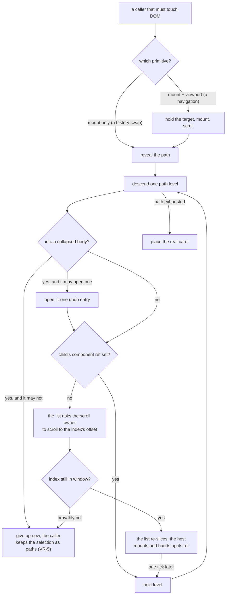

# The codebase map

So, I've noticed a slight blocker to people working on this repo - namely the few hundred source files in it. Skill issue honestly, but i'll play nice.

What's in this doc:

1. **The behavior → entry table**: the thing you saw break, the file that owns it, and the rule
   people keep breaking there.
2. **Keyboard and chords**: how a keypress becomes a command, and the one lint that inverts the
   codebase's usual instincts.
3. **The reveal path**: how you touch a block that windowing has unmounted.
4. **Blank lines and separators**: the helpers that keep blank lines between blocks right, and who
   calls which.
5. **Keeping this map fresh**: the lint that checks every reference here, and how to add a row.

**How to read a row.** The entry is where you put the breakpoint. The rule is the thing that's
been broken before, and nearly every one is the same rule in a different costume, rule 4 of
[`rules.md`](rules.md): a behavior's logic lives at the one place every path crosses, not at the
call sites. So when you want to add a branch at one of these files, the rule in that row is what
you're arguing with.

A few of the words the repo coined survive in symbol names (`HeightOracle`,
`clampToLandableRaw`). Since this may be your first doc in the repo, keep
[`glossary.md`](glossary.md) open beside it; every one of them is a line there.

## Behavior → entry

| Behavior                                                                       | Entry                                                                                                                                                                                                                                                                                                                                   | The rule there                                                                                                                                                                                                                                                                                                                                                                                                                                               | Spec                                                                                                        |
| ------------------------------------------------------------------------------ | --------------------------------------------------------------------------------------------------------------------------------------------------------------------------------------------------------------------------------------------------------------------------------------------------------------------------------------- | ------------------------------------------------------------------------------------------------------------------------------------------------------------------------------------------------------------------------------------------------------------------------------------------------------------------------------------------------------------------------------------------------------------------------------------------------------------ | ----------------------------------------------------------------------------------------------------------- |
| Typing into a block                                                            | `src/lib/components/blocks/editable-surface.ts` :: `createEditableSurface`, then `src/lib/tree-operations/content-write.ts` :: `updateNodeContent`                                                                                                                                                                                      | Typed text reaches the tree through one commit (`src/lib/editor-actions/block-edit-core.ts` :: `commitLeafText`) or one in-place write (`src/lib/editor-actions/leaf-write.ts` :: `writeLeafInPlace`), at every depth. Any other write to a leaf's bytes goes through the kind's write rule (`src/lib/tree-operations/content-write.ts` :: `legalizeWrite`). A bare `raw` assignment at a call site is the bug you're looking for, and a lint test fails one | `docs/design/editor.md` § 6                                                                                 |
| Keystroke batching for undo                                                    | `src/lib/editor-actions/commit/text-batch.ts` :: `createTextBatch`                                                                                                                                                                                                                                                                      | The `setTimeout` here only detects a pause in typing and never sequences anything. A new timer needs an entry in the allowlist in `src/lib/test/invariants/lint/file-rules.test.ts`                                                                                                                                                                                                                                                                          | `docs/design/editor.md` § 11                                                                                |
| Enter / split                                                                  | `src/lib/schema/block-commands.ts` :: `dispatchKeyCommand`, then `src/lib/tree-operations/node-ops.ts` :: `splitNode`                                                                                                                                                                                                                   | A kind gets Enter by declaring the chord in its `keymap`; the dispatcher reads no kind names. In live mode the two halves close and reopen whatever construct the cut crossed (`src/lib/components/blocks/text/live-split-rebalance.ts` :: `rebalanceLiveSplit`)                                                                                                                                                                                             | `docs/design/editor.md` § 8                                                                                 |
| Enter or Shift+Enter over a selection in one block                             | `src/lib/schema/block-commands.ts` :: `commandOverSelection`                                                                                                                                                                                                                                                                            | The selection is removed before the command runs, so a command handler never reads it. A new line-breaking command joins `src/lib/schema/commands.ts` :: `AFTER_SELECTION_REMOVAL_COMMAND_IDS`                                                                                                                                                                                                                                                               | `docs/design/editor.md` § 4                                                                                 |
| Typing a construct into existence (a table's delimiter row, block math's `$$`) | `src/lib/schema/block-completions.ts` :: `completeTypedLine`, gated at `src/lib/editor-actions/enter-completion.ts` :: `planCompletion`; the built-in completer is `src/lib/core/parsers/table-completion.ts`                                                                                                                           | A grammar that needs adjacent lines registers a completer, never a branch at the split. The gate hands a completer the whole typed line and nothing else, and the parser decides what it may take                                                                                                                                                                                                                                                            | `docs/design/editor.md` § 8                                                                                 |
| Link editing (live mode)                                                       | `src/lib/components/link-card/LinkCard.svelte`, bytes from `src/lib/core/inline/link-source-bytes.ts` :: `buildLinkEditBytes`, committed through `src/lib/editor-actions/inline-range-commit.ts` :: `createInlineRangeCommit`                                                                                                           | Live mode paints no destination, so the card is the only way to read or change one. It finds its link again after every edit (by path plus where the construct starts), since a commit rebuilds the inline DOM                                                                                                                                                                                                                                               | `docs/design/live-mode.md` § 4.6; scenarios in `src/lib/e2e/requirements/presentation/live-link-card.md`    |
| Code block's language (marker-hiding modes)                                    | `src/lib/components/blocks/code/CodeBlockRail.svelte`, bytes from `src/lib/schema/fenced-code-raw.ts` :: `writeFenceInfo`                                                                                                                                                                                                               | A hidden fence line can't hold a caret, so the rail's (the strip of buttons on the code box) language picker is the only way to change the info string. It renders outside the contenteditable, which every commit rebuilds                                                                                                                                                                                                                                  | `docs/design/live-mode.md` § 4.7; scenarios in `src/lib/e2e/requirements/blocks/code/language-chip.md`      |
| Destructive joins (merge, range delete, range replace)                         | `src/lib/tree-operations/leaf-range.ts` :: `replaceRangeInLeaf` for a range inside one leaf, `joinLeaves` for a merge, `cleanJoinedRaw` under both                                                                                                                                                                                      | Every join runs its bytes through this one place. In live mode it drops the markers a cut stranded, once it has checked the result shows what the two sides showed, read where the bytes will be stored (`src/lib/tree-operations/stored-as.ts` :: `storedAsAt`). Otherwise the literal join stands                                                                                                                                                          | `docs/design/editor.md` § 8                                                                                 |
| Joining two blocks (Backspace, Delete, list-item merge)                        | `src/lib/tree-operations/node-ops.ts` :: `joinIntoLeaf`; a list item through `src/lib/tree-operations/list/unwrap-merge.ts` :: `mergeListItemIntoPrevious`                                                                                                                                                                              | Every join writes the lower block's text through the kind's write rule and then reparses, so the kind follows the bytes. Backspace writes into the deepest prose leaf of the block above. A join that reads as two blocks returns null, and the caller moves the caret instead                                                                                                                                                                               | `docs/design/editor.md` § 8                                                                                 |
| Replacing a block with parsed blocks (paste, drop, unwrap)                     | `src/lib/editor-actions/block-edit-core.ts` :: `createBlockEditCore`'s `replaceBlock`                                                                                                                                                                                                                                                   | The one replace write escapes the new blocks for their container, keeps the old block's id only when the kind matches, moves a list item's task marker, and follows the caret. A route that splices parsed blocks in by hand skips all four                                                                                                                                                                                                                  | `docs/design/editor.md` § 3                                                                                 |
| Backspace at a block's start                                                   | gate `src/lib/selection/shared-keydown.ts` :: `caretLandableBounds`, then `src/lib/editor-actions/nested/nested-block-edit.ts` :: `createNestedBlockEdit`, strategies in `src/lib/editor-actions/unwrap-strategies.ts`                                                                                                                  | "The start" is the first offset a caret can reach, past any hidden markers, not offset 0. A kind joins by declaring `unwrapRole`, a merge role or `contentStart.backspace`, not by a branch here                                                                                                                                                                                                                                                             | `docs/design/editor.md` § 8                                                                                 |
| What a block component must provide                                            | `src/lib/block-component.ts`, each member's docstring                                                                                                                                                                                                                                                                                   | Four members are required (`focus`, `getCursorOffset`, `editable`, `focusable`), plus a container's descent methods. Leaving out an optional one is a supported answer, so never fake one: a `measurePartialRects` that guesses paints worse than the full-block overlay                                                                                                                                                                                     | `docs/design/editor.md` § 4                                                                                 |
| Caret landing                                                                  | `src/lib/selection/place-caret.ts` :: `placeCaret`, dispatched by `src/lib/editor-actions/focus/focus-dispatch.ts` :: `dispatchMoveFocus`                                                                                                                                                                                               | A caret write goes through one of the few entry points in `src/lib/selection/place-caret.ts`; build `focus` from `placeCaret`, not by hand. Every text entry ends in `src/lib/components/blocks/editable-surface.ts` :: `parkCaret`, which clamps the offset to where a caret can sit. The DOM write itself goes through the editor's one caret writer, `EditorServices.caretWriter`, and a lint test fails a native selection write anywhere else           | `docs/design/editor.md` § 4                                                                                 |
| The caret the editor draws (a fine pointer)                                    | `src/lib/caret/drawn-caret.svelte.ts` :: `createDrawnCaret`, what it reads from `src/lib/caret/drawn-caret-measure.ts` :: `measureCaret`, what it draws from `src/lib/caret/drawn-caret-target.ts` :: `drawnCaretTarget`                                                                                                                | A caret write asks for its paint through the writer; a change to the caret's line with no write calls `EditorServices.drawnCaret` :: `request`. Where the range's box isn't where the browser paints its caret, the target returns the browser's caret, never a guess                                                                                                                                                                                        | `docs/design/editor.md` § 10                                                                                |
| Writing the native selection                                                   | `src/lib/caret/widget-offset.ts` :: `createCaretWriter`, one per editor on `EditorServices.caretWriter`                                                                                                                                                                                                                                 | Every write and clear of the native selection goes through the writer, which asks the drawn caret to repaint; G4.36 fails a native write in any other file                                                                                                                                                                                                                                                                                                   | `docs/design/editor.md` § 10                                                                                |
| Where an edit puts the caret                                                   | `src/lib/selection/caret-landing.ts` :: `createCaretLanding`, which every commit calls with its `landing`                                                                                                                                                                                                                               | An edit hands back a position (the commit's `landing`, or `land` for a move with no commit) and never places a caret itself. The landing resolves it to a leaf, mounts it, focuses it and scrolls it into view. A deleted block's caret goes to `src/lib/selection/caret-target.ts` :: `survivorAfterRemoval`                                                                                                                                                | `docs/design/editor.md` § 11                                                                                |
| Deleting the last block, or a container's last child                           | `src/lib/tree-operations/keep-one-block.ts` :: `keepOneBlock`, run by every commit; for containers, `src/lib/tree-operations/cleanup.ts` :: `cascadeCleanupEmptyAncestors` and `src/lib/editor-actions/nested/emptied-container.ts` :: `removeEmptiedContainer`                                                                         | The document always keeps a block, and the commit adds the empty paragraph, never the edit. A container an edit empties goes, and its parent after it if that empties too                                                                                                                                                                                                                                                                                    | `docs/design/editor.md` § 8                                                                                 |
| Announcing a selection change                                                  | `src/lib/selection/selection-announcer.ts` :: `createSelectionAnnouncer`                                                                                                                                                                                                                                                                | Every `selectionChange` emission goes through the announcer, which drops a position it already sent. The editor's own placements announce as they place, so a subscriber hears an arrival before anything typed there; `src/lib/components/editor-root-listeners.ts` :: `installSelectionChangeBridge` reports the carets the browser places. Inside `src/lib/selection/selection-state.svelte.ts` :: `batch`, emission waits for the batch                  | `docs/design/editor.md` § 12                                                                                |
| Where a click lands the caret                                                  | `src/lib/selection/block-hit-test.ts` :: `blockAtPoint` names the block, the kind's `caretTargetAtPoint` the spot inside it, and `src/lib/caret/point-offset.ts` :: `caretOffsetAtPoint` the offset                                                                                                                                     | No offset arithmetic of its own: every hit test reads offsets through `src/lib/caret/widget-offset.ts` :: `domTextOffsetAtNode`. A press beside an atomic widget goes to the widget's nearest edge (`src/lib/caret/widget-edge-snap.ts` :: `nearestWidgetEdgeSeat`)                                                                                                                                                                                          | `docs/design/caret-placement.md`, the whole click walked stage by stage                                     |
| Keys on a block focused whole (a divider, a plugin container)                  | `src/lib/editor-actions/container-block-component.ts` :: `handleWholeBlockKeys`                                                                                                                                                                                                                                                         | One family, not a branch per kind: Enter or a character adds a paragraph below, Backspace/Delete removes the block, Mod+C/Mod+X copies or cuts it whole, an arrow leaves it. Reading mode gates only the editing branches                                                                                                                                                                                                                                    | `docs/design/editor.md` § 8                                                                                 |
| Focus on a block focused whole                                                 | `src/lib/editor-actions/whole-block-focus-surface.ts` :: `createWholeBlockInputProxy`                                                                                                                                                                                                                                                   | Such a block has no editing surface, so DOM focus lands on a hidden editable element in its box. Code asking "is this a real editable surface" goes through `src/lib/editor-actions/whole-block-focus-surface.ts` :: `isEditableEventTarget`                                                                                                                                                                                                                 | `docs/design/editor.md` § 8                                                                                 |
| Hidden markers and the offsets a caret can reach                               | `src/lib/caret/widget-offset.ts` :: `landingSegments` and `clampToLandableRaw`                                                                                                                                                                                                                                                          | This file is the one translation between DOM positions and raw offsets. A gate that compares a caret against the block's declared content range, instead of the offsets a caret can reach, is the bug. A container's marker prefix is unreachable; a widget is opaque but has reachable edges                                                                                                                                                                | `docs/design/editor.md` § 4                                                                                 |
| Arrow at a block boundary                                                      | `src/lib/selection/shared-keydown.ts` :: `handleSharedKeydown`                                                                                                                                                                                                                                                                          | Every arrow boundary test lives here, and a surface with its own arrow handling routes through it. The table cell is the documented exception (`src/lib/components/blocks/table/cell-keydown-plan.ts`), and it takes the same bounds as input                                                                                                                                                                                                                | `docs/design/editor.md` § 8                                                                                 |
| Home behind a marker                                                           | `src/lib/components/blocks/text/home-key.ts` :: `handleHomeKey`                                                                                                                                                                                                                                                                         | Only the first line, behind a container's marker or a leading widget, needs the editor; every other line's Home is the browser's                                                                                                                                                                                                                                                                                                                             | `docs/design/editor.md` § 9                                                                                 |
| Sticky column                                                                  | captured by `noteKey` on `src/lib/caret/caret-memory.ts` :: `createCaretMemory`, used by `src/lib/editor-actions/focus/focus-landing.ts` :: `consumeStickyLanding`                                                                                                                                                                      | Capture and use live in separate files, and `focusAtColumn` only receives a column                                                                                                                                                                                                                                                                                                                                                                           | `docs/design/editor.md` § 8                                                                                 |
| Caret edge affinity (which side of a hidden marker the caret means)            | held by `src/lib/caret/caret-memory.ts` :: `createCaretMemory`, decided by `src/lib/caret/edge-affinity.ts` :: `classifyArrivalKey`, used by `src/lib/components/blocks/text/edge-seat.ts` :: `resolveEdgeSeat`                                                                                                                         | One memory holds the side together with the sticky column, the pending marks, the pending break and the held space, so `forget` drops all five at once. The edge resolver reads the kind's policy first and the memory second                                                                                                                                                                                                                                | `src/lib/caret/caret-memory.ts` header                                                                      |
| A typed delimiter (auto-pair)                                                  | `src/lib/components/blocks/text/delimiter-autopair.ts` :: `resolveDelimiterAutoPair`, the pair it wrote held by `src/lib/components/blocks/text/auto-pair-record.ts` :: `createAutoPairRecord`                                                                                                                                          | The keystroke writes the matching closer after the caret, and typing that closer steps past it. Only the empty pair the editor wrote is stepped over or taken by Backspace; the same bytes typed by hand are the user's. A pair that would change the line's kind (`****`) is declined                                                                                                                                                                       | `docs/design/live-mode.md` § 4.2                                                                            |
| Inline construct edges                                                         | rows in `src/lib/schema/inline-construct-policy.ts` :: `getInlineConstructPolicy`                                                                                                                                                                                                                                                       | A construct's edge behavior (which side a typed byte lands on, whether emptying it unwraps, how a split treats it) is its declared row. Everything reads the table, never a kind list                                                                                                                                                                                                                                                                        | `src/lib/schema/inline-construct-policy.ts` header                                                          |
| Inline mark vocabulary                                                         | `src/lib/schema/inline-construct-policy.ts` :: `listInlineMarks` and `inlineMarkForCommand`                                                                                                                                                                                                                                             | What a format chord writes (the delimiter, the nesting order, the command that toggles it) is the same table's `mark` column, so no surface carries a branch per format                                                                                                                                                                                                                                                                                      | `src/lib/schema/inline-construct-policy.ts` header                                                          |
| Widgets and decorations at a caret edge                                        | `src/lib/components/blocks/text/edge-policy-dispatch.ts` :: `createEdgePolicyDispatch`                                                                                                                                                                                                                                                  | One dispatcher ranks the three things a caret can sit against (an atomic widget, a decoration widget, the container's marker prefix), in this file. A marker-hiding mode changes which markers show, never which of the three owns the press                                                                                                                                                                                                                 | `docs/design/plugin-contract.md`                                                                            |
| Pending marks (a format toggled at a collapsed caret, live mode)               | set by `toggleFormat` in `src/lib/components/blocks/text/TextEditableBlock.svelte` and `src/lib/components/blocks/table/TableCellBlock.svelte`, held by `src/lib/caret/caret-memory.ts` :: `createCaretMemory`, spent by `src/lib/components/blocks/text/pending-mark-insert.ts` :: `resolveMarkedInsertion`                            | Held beside the edge affinity, so anything that forgets how the caret arrived drops the marks too. One text insertion spends the whole set                                                                                                                                                                                                                                                                                                                   | `src/lib/caret/pending-marks.ts` header                                                                     |
| Shift+Enter at a block's end (the pending break)                               | opened in `src/lib/components/blocks/text/TextEditableBlock.svelte`, held by `src/lib/caret/pending-break.svelte.ts` :: `createPendingBreak`, spent through `src/lib/caret/next-insertion.ts` :: `createInsertionRecords`                                                                                                               | Nothing is written until the next insertion, and every insertion route spends it where it writes. Never read a break back from a trailing backslash                                                                                                                                                                                                                                                                                                          | `docs/design/editor.md` § 4                                                                                 |
| A space typed at a hidden closer (the held space)                              | `src/lib/caret/held-space.ts` :: `createHeldSpace`, spent in `src/lib/caret/next-insertion.ts` :: `createInsertionRecords`                                                                                                                                                                                                              | The space is written past the closer, so the bytes are valid the whole time. It's a record like the pending break, so no insertion route needs its own handling                                                                                                                                                                                                                                                                                              | `docs/design/live-mode.md` § 4.2                                                                            |
| Reorder (Alt+Arrow, drag)                                                      | `src/lib/editor-actions/reorder-action.ts` :: `createReorderAction`, the drag in `src/lib/editor-actions/reorder-drag.ts`                                                                                                                                                                                                               | The drag paints a ghost and changes no tree. One move commits, on drop, and the caret follows the landing that commit reports                                                                                                                                                                                                                                                                                                                                | `docs/design/editor.md` § 8                                                                                 |
| Cross-block selection                                                          | `src/lib/selection/selection-state.svelte.ts` :: `createSelectionState`, keys in `src/lib/selection/cross-block/dispatch.ts` :: `createCrossBlockHandlers`                                                                                                                                                                              | Endpoints are `(path, offset)` data, so never consult mounted DOM to decide what's selected. A new chord needs both its first press (`src/lib/selection/cross-block/keydown.ts` :: `handleCrossBlockEntry`) and its extend path (`handleCrossBlockActive`). The same store holds the gap caret and a widget selected whole, and taking one ends the others                                                                                                   | `docs/design/editor.md` § 10                                                                                |
| Selecting an inline widget whole                                               | `src/lib/selection/place-caret.ts` :: `selectWidgetWhole`                                                                                                                                                                                                                                                                               | Select a widget through this, never by writing the store, and read it back from the store (`widget`, `widgetRange`). Any caret the editor puts down ends a selected widget on its own                                                                                                                                                                                                                                                                        | `docs/design/editor.md` § 10                                                                                |
| What a cross-block range covers                                                | `src/lib/selection/range-coverage.ts` :: `rangeCoverage`                                                                                                                                                                                                                                                                                | Delete, copy, paste, type-over, the format toggle and the overlay all read this one answer, so they agree on table rows, a closed details block and a table's rectangle of cells. Ask it; don't walk the range yourself                                                                                                                                                                                                                                      | `docs/design/editor.md` § 10                                                                                |
| Anything deleted, cut, typed or pasted over a cross-block range                | `src/lib/selection/cross-block/range-replace.ts` :: `replaceRange`                                                                                                                                                                                                                                                                      | Every gesture over a range (Backspace, Delete, cut, typing, IME, paste, a command key like Enter) comes through here. It picks the removal from one table, puts the insertion where the removal left the caret, and keeps it all one undo entry. Remove a range nowhere else                                                                                                                                                                                 | `docs/design/editor.md` § 10                                                                                |
| An indent key over a range                                                     | `src/lib/selection/cross-block/range-indent.ts` :: `indentRange`, items moved by `src/lib/tree-operations/list/item-moves.ts` :: `nestListItem` and `liftNestedItem`                                                                                                                                                                    | Indents and never removes: each covered block does what its kind registered for the key (`src/lib/schema/range-indent-forms.ts`), so list items nest or lift, code lines shift, and prose stays. Move a list item nowhere else                                                                                                                                                                                                                               | `docs/design/editor.md` § 10                                                                                |
| Table cells in a selection                                                     | `src/lib/schema/block-kind-descriptor.ts` :: `countsCells`; the index math in `src/lib/caret/coordinate-spaces.ts` :: `rowMajorCellIndex`; a cell endpoint built by `src/lib/selection/primitives.ts` :: `cellPoint`                                                                                                                    | Every point on a table path carries `cellCoordinate: true`, so check the flag, not the kind. A hand-written `row * columnCount + col` or a hand-built `{ cellCoordinate: true }` is a second copy of these                                                                                                                                                                                                                                                   | `docs/design/invariants.md` (G1.29)                                                                         |
| What a cross-block range paints over a block                                   | `src/lib/selection/primitives.ts` :: `classifyBlockForSelection` and `blockPaintsWholeBox`, read by `src/lib/components/SelectionOverlay.svelte`                                                                                                                                                                                        | A block the range covers end to end paints one box over everything it renders, and its descendants paint none. Ask these two; don't read the coverage in a painter                                                                                                                                                                                                                                                                                           | `docs/design/editor.md` § 10                                                                                |
| The space a cross-block range paints between blocks                            | `src/lib/components/SelectionGapFill.svelte`, rects from `src/lib/caret/overlay-rects.ts` :: `regionGaps`                                                                                                                                                                                                                               | Fills only what no block's own paint covers, so every line between spans the block column                                                                                                                                                                                                                                                                                                                                                                    | `docs/design/editor.md` § 10                                                                                |
| A block path read off a DOM node                                               | `src/lib/selection/path-lookup.ts` :: `readBlockPath`                                                                                                                                                                                                                                                                                   | The one place `data-block-path` is parsed; anything but a list of numbers answers null. A lint test fails a second parser                                                                                                                                                                                                                                                                                                                                    | `docs/design/editor.md` § 10                                                                                |
| Multi-click selection (word, block, drag)                                      | `src/lib/selection/multi-click.ts` :: `installMultiClickSelect`, the word rule in `wordSpanAt`                                                                                                                                                                                                                                          | From the second click the editor owns the gesture. The word is read off the block's own text with markers and widgets blanked, never the platform's word rule                                                                                                                                                                                                                                                                                                | `docs/design/editor.md` § 10                                                                                |
| A widget's own pointer gesture                                                 | `src/lib/selection/pointer-gesture.ts` :: `claimsPointerGesture`                                                                                                                                                                                                                                                                        | A press inside an element carrying `POINTER_GESTURE_ATTR` is the widget's, so the editor's drag and click handling leave it alone. Declare it on the element: the editor handles pointer events at its root, before a component's `stopPropagation` could stop them                                                                                                                                                                                          | `docs/design/plugin-contract.md`                                                                            |
| Dropping a dragged selection                                                   | `src/lib/selection/selection-drop.ts` :: `installSelectionDrop`                                                                                                                                                                                                                                                                         | The browser's own drop is two separate edits, so the editor cancels it and writes both blocks under one undo entry. The payload is the source block's own bytes, so live-mode markers travel with it                                                                                                                                                                                                                                                         | `docs/design/editor.md` § 10                                                                                |
| A format toggle over a cross-block range                                       | `src/lib/selection/cross-block/format-range.ts` :: `planCrossBlockFormat`, routed at `src/lib/schema/block-commands.ts` :: `runResolvedCommand`                                                                                                                                                                                         | Every span goes through the single-block toggle (`src/lib/core/inline/format-toggle.ts`), so a cross-block press has no branches of its own. A kind takes part by declaring it, never by name                                                                                                                                                                                                                                                                | `docs/design/editor.md` § 5                                                                                 |
| The gap caret                                                                  | `src/lib/selection/gap-caret.ts` :: `tryGapStop` (arrival) and `gapEligibleAt` (eligibility)                                                                                                                                                                                                                                            | Eligibility is the kind's own `gapEdges` declaration, so there's no kind list at the read site                                                                                                                                                                                                                                                                                                                                                               | `docs/design/editor.md` § 10                                                                                |
| Copy / cut                                                                     | `src/lib/components/blocks/editable-surface.ts` :: `createClipboardHandlers`, the cut in `src/lib/components/blocks/clipboard-step.ts` :: `runClipboardCut`, the root fallback in `src/lib/components/editor-root-clipboard.ts` :: `createEditorRootClipboard`                                                                          | `preventDefault` is the receipt the root handler reads, so don't handle an event a surface already handled. A new kind of selection is one `ClipboardArm`, and the cut reuses its copy                                                                                                                                                                                                                                                                       | `docs/design/editor.md` § 10                                                                                |
| Paste                                                                          | `src/lib/tree-operations/paste/dispatch.ts` :: `pasteDispatch`                                                                                                                                                                                                                                                                          | One parse-and-route path. Pasted lines take the document's line ending (`src/lib/core/lines.ts` :: `documentLineEnding`). Over a selection in a prose block or a cell, a paste writes what typing the text would; a code fence takes it literally                                                                                                                                                                                                            | `docs/design/editor.md` § 10                                                                                |
| Programmatic insertion (`insertMarkdown`)                                      | `src/lib/components/Editor.svelte` :: `insertMarkdown`, then `src/lib/components/editor-root-focused-surface.ts` :: `createFocusedSurface`                                                                                                                                                                                              | It finds the focused surface and hands off to the paste rules, so don't repeat one here. `placement: 'below'` makes the new paragraph first, in the same undo step                                                                                                                                                                                                                                                                                           | `docs/design/editor.md` § 10                                                                                |
| Insert catalogue and slash commands                                            | `src/lib/schema/insert-catalogue.ts` :: `insertCatalogue`, the `/` list in `src/lib/plugins/slash-commands/slash-source.ts` :: `createSlashSource`                                                                                                                                                                                      | The right-click flyout, `getInsertCatalogue()` and the slash list all read the one catalogue. A plugin adds a block with `registerInsertEntry`, never by editing a menu                                                                                                                                                                                                                                                                                      | `docs/design/plugin-contract.md` § Insert catalogue                                                         |
| Command invocation by id (`runCommand`)                                        | `src/lib/components/Editor.svelte` :: `runCommand`, resolved at `src/lib/schema/block-commands.ts` :: `runCommandById`                                                                                                                                                                                                                  | Chords and the public entry meet at `src/lib/schema/block-commands.ts` :: `runResolvedCommand`, so a rule that must hold however a command was invoked (reading mode, say) goes there. A host asks `canRunCommandById` what it would decline                                                                                                                                                                                                                 | `docs/design/editor.md` § 5                                                                                 |
| Block context menu (right-click)                                               | `src/lib/components/editor-root-menus.ts` :: `onRootContextMenu`, rows from `src/lib/schema/context-actions.ts` :: `blockContextActionsFor`                                                                                                                                                                                             | The menu takes no focus, so the caret it acts on stays put. A row commits through the editor's own writes, never a DOM write. Prose (a kind declaring `pageRole: 'prose'`), a nested block and a selection get the clipboard rows; any other block gets its kind's rows and the editor's own                                                                                                                                                                 | `docs/design/editor.md` § 8                                                                                 |
| Context-action registry                                                        | `src/lib/schema/context-actions.ts` :: `registerBlockContextActions`, the built-in rows in `src/lib/components/menu/default-context-actions.ts`                                                                                                                                                                                         | A provider is keyed by kind and name, is asked on every open, and reads the block as it is then                                                                                                                                                                                                                                                                                                                                                              | `docs/design/editor.md` § 15                                                                                |
| Selection toolbar                                                              | `src/lib/components/menu/SelectionToolbar.svelte`, behind the `selectionToolbar` prop                                                                                                                                                                                                                                                   | Built on the public API alone (`selectionChange`, the rect API, the command entry), so the shipped bar and the consumer recipe can't diverge                                                                                                                                                                                                                                                                                                                 | `docs/design/editor.md` § 8                                                                                 |
| Menu open reporting (`menuChange`)                                             | `src/lib/components/menu/menu-presence.svelte.ts` :: `createMenuPresence`                                                                                                                                                                                                                                                               | Each menu attaches `track(close)` to its root element, so every way of closing it leaves the registry exactly once, and `closeAll` (a document swap, a mode change) can close it                                                                                                                                                                                                                                                                             | `docs/design/editor.md` § 12                                                                                |
| When a `source` write replaces the document                                    | `src/lib/components/editor-root-document-swap.ts` :: `createDocumentSwap`, run by the `source` effect in `src/lib/components/Editor.svelte`                                                                                                                                                                                             | A write replaces the document only when it differs from the text the editor holds now, not from the prop's last value, so a host echoing `getSource()` back keeps its undo                                                                                                                                                                                                                                                                                   | `docs/design/editor.md` § 12                                                                                |
| Trailing insert row                                                            | `src/lib/components/TailInsert.svelte`                                                                                                                                                                                                                                                                                                  | Its click adds a paragraph and puts the caret in it; a press that drags is the editor's drag-select. It sits beside the block list, not in it, since windowing wants that list bare                                                                                                                                                                                                                                                                          | `docs/design/editor.md` § 8                                                                                 |
| Image crop                                                                     | the math in `src/lib/components/image/image-crop.ts`, the session in `src/lib/components/image/ImageProperties.svelte`, committed through `src/lib/components/image/image-edit-commit.ts` :: `commitImageEdit`                                                                                                                          | Nothing is written until the tick or Enter, which is why Escape restores the image with no undo entry                                                                                                                                                                                                                                                                                                                                                        | `docs/design/editor.md` § 4                                                                                 |
| Any structural mutation                                                        | `src/lib/action-contracts.ts` :: `CommitController` (`commitStructural`, `commitContainerStructural`, `commitMultiScope`)                                                                                                                                                                                                               | Pick a scope; don't assemble the commit steps by hand. Mutate the scope view the commit hands you, never a reference captured before it                                                                                                                                                                                                                                                                                                                      | `docs/design/editor.md` § 11                                                                                |
| Undo / redo, and copy on write                                                 | `src/lib/undo/manager.ts` :: `createUndoManager`, driven by `src/lib/editor-actions/commit/history.ts` :: `createHistoryActions`; the copy in `src/lib/tree-operations/unshare.ts` :: `ensureUnsharedPath`                                                                                                                              | A snapshot shares the live tree's nodes, so a write copies the path first. Copies are shallow: re-read through the `$state` tree after splicing one in, and don't keep the copy                                                                                                                                                                                                                                                                              | `docs/design/editor.md` § 11; `docs/design/invariants.md` (G1.9)                                            |
| One undo entry per gesture                                                     | `src/lib/editor-actions/commit/undo-controller.ts` :: `undoStep`                                                                                                                                                                                                                                                                        | A gesture that takes several commits (anything over a range, a drop, replace-all) runs them inside one step. Outside a step every commit pushes its own entry, and typing groups by burst                                                                                                                                                                                                                                                                    | `docs/design/editor.md` § 11                                                                                |
| A container's raw after a child changed                                        | `src/lib/schema/container-raw.ts` :: `rebuildContainerRawIfContainer`, the per-kind syntax in `src/lib/schema/container-rebuilders.ts`                                                                                                                                                                                                  | Inside a commit, the commit rebuilds each container once and the mutation leaves raw alone. The container's metadata is then re-read from the new bytes (`src/lib/schema/container-raw.ts` :: `followBytes`), never carried over from before the rebuild                                                                                                                                                                                                     | `docs/design/editor.md` § The container `raw` contract                                                      |
| Windowing                                                                      | `src/lib/windowing/list-windowing.svelte.ts` :: `createListWindowing`, the slice math in `src/lib/windowing/block-window.svelte.ts`                                                                                                                                                                                                     | Every index, id and path key is absolute (the index you'd use if there were no windowing); a loop-local index is the windowing bug                                                                                                                                                                                                                                                                                                                           | `docs/design/virtual-rendering.md`                                                                          |
| Every write to the scroll position                                             | `src/lib/windowing/scroll-owner.ts` :: `createScrollOwner`, one per editor                                                                                                                                                                                                                                                              | Everything else gets the read-only `ScrollportReader`, and a lint test fails a scroll write anywhere else (bar a drag's autoscroll). A caret's `focus` passes `preventScroll`                                                                                                                                                                                                                                                                                | `docs/design/virtual-rendering.md`                                                                          |
| Which block a height correction keeps still                                    | `src/lib/windowing/list-tree.ts` :: `createListTree`, picking through `src/lib/windowing/steady-block.ts` :: `heldBlock`                                                                                                                                                                                                                | One pick for the whole document per round: the caret's block when it sits at or below the viewport's top, else the block at the top. The correction is however far that block moved                                                                                                                                                                                                                                                                          | `docs/design/virtual-rendering.md` § Keeping the page still while heights change                            |
| How a windowed child's height reaches its list                                 | `src/lib/windowing/use-measured-child.svelte.ts` :: `useMeasuredChild`                                                                                                                                                                                                                                                                  | A child measures into its own list under its own id, and no list reports its own height up                                                                                                                                                                                                                                                                                                                                                                   | `docs/design/virtual-rendering.md` § Keeping the page still while heights change                            |
| When measured heights are thrown away                                          | `src/lib/windowing/layout-state.svelte.ts` :: `createLayoutState`                                                                                                                                                                                                                                                                       | A new document or a mode switch calls `forgetMeasuredHeights`; a width or font-size change calls `rebuildForNewGeometry`, which also rebuilds every list. Nothing else drops them                                                                                                                                                                                                                                                                            | `docs/design/virtual-rendering.md` § When and how everything re-measures                                    |
| A windowed list held at full height while its window changes                   | `src/lib/windowing/use-window-floor.svelte.ts` :: `useWindowFloor`                                                                                                                                                                                                                                                                      | New blocks mount one at a time, and a layout read between them would see a short list and clamp the scroll. Every component that renders spacers calls it                                                                                                                                                                                                                                                                                                    | `docs/design/virtual-rendering.md` § Keeping the page still while heights change                            |
| Scroll held across a block's view swap                                         | `keep` on `src/lib/windowing/scroll-owner.ts` :: `createScrollOwner`, for a plugin `captureScrollPosition` on `src/lib/editor-actions/plugin/container.ts` :: `ContainerBlock`                                                                                                                                                          | Capture before the state change and re-assert after the flush, or a swap that shortens the block clamps the scroll for good                                                                                                                                                                                                                                                                                                                                  | `docs/design/virtual-rendering.md`                                                                          |
| Reveal before act                                                              | `src/lib/editor-rects.ts` :: `createEditorRects`, the descent in `src/lib/block-lists/child-list.ts` :: `descendTo`                                                                                                                                                                                                                     | Reveal before touching DOM: a synchronous focus can't mount a block outside the window (more in § The reveal path)                                                                                                                                                                                                                                                                                                                                           | `docs/design/virtual-rendering.md` § Doing something to a block you can't see                               |
| Search                                                                         | `src/lib/search/search-state.svelte.ts` :: `createSearchState`, the scan in `src/lib/search/document-scan.ts` :: `scanDocument`                                                                                                                                                                                                         | Search only reads; it renders and changes nothing. Replace goes through `src/lib/editor-actions/search-replace.ts`, one undo entry per batch                                                                                                                                                                                                                                                                                                                 | `docs/design/editor.md` § 10                                                                                |
| Decorations                                                                    | `src/lib/decorations/decoration-state.svelte.ts` :: `createDecorationEngine`                                                                                                                                                                                                                                                            | A source is a pure `doc → Decoration[]`, cached per edit. A decoration never enters the CST                                                                                                                                                                                                                                                                                                                                                                  | `docs/design/plugin-contract.md`                                                                            |
| Inline menus (a list under the caret on a typed trigger)                       | `src/lib/inline-menu/inline-menu-state.svelte.ts` :: `createInlineMenuState`, the list in `src/lib/components/menu/InlineMenuHost.svelte`                                                                                                                                                                                               | A trigger is read as what changed in the caret's leaf since the last read, never off the `edit` event alone, since one change can carry several characters. A pick writes one line of inline bytes; a block belongs in `onCommit`                                                                                                                                                                                                                            | `docs/design/plugin-contract.md` § Inline menus                                                             |
| Which plugins one editor runs                                                  | `src/lib/schema/plugin-activation.ts` :: `activationFor`, built from the `plugins` prop                                                                                                                                                                                                                                                 | Definitions are process-global; activation is per editor. An editor runs exactly the plugins its prop lists, or every installed one with no prop. Every plugin-facing registry answers reads through an activation, so nothing leaks across editors and an unlisted plugin's syntax reads as plain Markdown                                                                                                                                                  | `docs/design/plugin-contract.md` § Per-instance enablement                                                  |
| Who a registry entry belongs to                                                | `src/lib/schema/plugin-registry.ts` :: `createBlockKindRegistry` (keyed by a kind) and `createPluginRegistry` (anything else); the editor's own bootstrap in `src/lib/components/editor-built-ins.ts` :: `registerEditorBuiltIns`                                                                                                       | An entry keyed by a plugin's kind belongs to that plugin, whoever registered it; any other entry belongs to the plugin whose setup registered it. `registerCore` gives an entry to no plugin and keeps it through the test reset                                                                                                                                                                                                                             | `docs/design/plugin-contract.md` § Per-instance enablement                                                  |
| Switching a built-in syntax off (`syntax` prop)                                | `src/lib/schema/registry-view.ts` :: `createRegistryView`                                                                                                                                                                                                                                                                               | A switch changes the grammar only, so a block of that kind still renders. Code inside the editor parses with `readBlocks` and `readInline`, which take the editor's grammar; a lint test fails the defaulted `parse` there                                                                                                                                                                                                                                   | `docs/design/plugin-contract.md` § Per-instance enablement                                                  |
| The kind cue (a typed kind change named at the block's corner)                 | `src/lib/components/kind-cue.svelte.ts` :: `createKindCue`                                                                                                                                                                                                                                                                              | Only a typed write reports, and only in a mode that hides markers; a command, a paste or a menu pick already named the kind                                                                                                                                                                                                                                                                                                                                  | `docs/design/live-mode.md` § 4.8                                                                            |
| Text after a task marker                                                       | `src/lib/tree-operations/list/task-paragraph.ts` :: `fragmentReaderAt`; writes through `src/lib/tree-operations/list/reconcile-task.ts` :: `writeKeepingTaskMarker`                                                                                                                                                                     | A list item's first block shares its marker line, so a write there is read behind the whole marker, checkbox included, or `- [ ] # x` becomes a heading a reload wouldn't make. A write into that block keeps the checkbox in step                                                                                                                                                                                                                           | `docs/design/syntax-tree.md` § 5; the box rules in `docs/design/invariants.md` G1.42                        |
| Presentation modes                                                             | resolved once in `src/lib/components/Editor.svelte`, the vocabulary in `src/lib/presentation-mode.ts` :: `PresentationMode`                                                                                                                                                                                                             | Read the resolved mode, not the prop. A mode is CSS over the one render path, never a second one                                                                                                                                                                                                                                                                                                                                                             | `docs/design/editor.md` § 4                                                                                 |
| A live-mode rewrite of the user's bytes                                        | checked through `src/lib/core/inline/visibility.ts` :: `renderedText`                                                                                                                                                                                                                                                                   | Rewritten bytes are only a candidate until the render path agrees they show what the two sides showed; where it doesn't, the literal result stands. Decide visibility through this module, never a traversal of your own (a lint test checks)                                                                                                                                                                                                                | `docs/design/invariants.md` (G4.33)                                                                         |
| Walking the inline tree                                                        | `src/lib/core/inline/walk.ts` :: `inlineDescendants`, and over the rendered DOM `src/lib/caret/dom-walk.ts` :: `domDescendants`                                                                                                                                                                                                         | Every walk over an inline tree or its DOM is a loop, not recursion: nesting depth is up to the input, so a call per level can overflow the stack. A source scan holds this                                                                                                                                                                                                                                                                                   | `docs/design/invariants.md` (G4.56)                                                                         |
| A construct's syntax, read and written back                                    | link parts in `src/lib/core/inline/link-destination.ts`, written back by `src/lib/core/inline/destination-bytes.ts`; headings in `src/lib/core/parsers/heading.ts` :: `matchHeading`; table rows split by `src/lib/core/parsers/table-line.ts` :: `rowCellSpans`, and written by `src/lib/core/parsers/table-line.ts` :: `tableRowLine` | One grammar per construct, with its writer beside it. Import the module: a second regex for the same syntax drifts, and the editor then writes bytes its own parser reads differently                                                                                                                                                                                                                                                                        | `docs/design/inline-parsing.md` § One grammar per construct, `docs/design/syntax-tree.md` § 5. GFM coverage |
| Structure past a block's text (setext underline, closing `#`s)                 | `src/lib/core/inline/index.ts` :: `structuralSuffix`; a cut through `src/lib/tree-operations/structural-suffix.ts` :: `cutKeepingStructure`, a join through `joinKeepingSuffix`                                                                                                                                                         | The structure stays with the block's text. A split, paste, join or hard break that carries it to the next line strands it there                                                                                                                                                                                                                                                                                                                              | `docs/design/editor.md` § 8                                                                                 |
| Blank lines and separators                                                     | `src/lib/tree-operations/settle.ts` :: `settleSeparator` and `spliceChildrenSettled`                                                                                                                                                                                                                                                    | Don't assign `leadingTrivia` at a splice site; splice through one of these (§ Blank lines and separators, below)                                                                                                                                                                                                                                                                                                                                             | `docs/design/syntax-tree.md` § Blank lines                                                                  |
| Whether text is blank, and Markdown whitespace                                 | `src/lib/core/lines.ts` :: `isBlankText` and `isWhitespaceChar`                                                                                                                                                                                                                                                                         | Don't ask `trim()` or JS `\s`: both treat a non-breaking space as whitespace, and GFM counts it as a character. A lint test fails either                                                                                                                                                                                                                                                                                                                     | `docs/design/syntax-tree.md` § 5. GFM coverage                                                              |
| Where the caret ends up after neighbours merge                                 | `src/lib/tree-operations/container-offsets.ts` :: `leafAtRawOffset`, over `src/lib/tree-operations/settle.ts` :: `TrackedPosition`                                                                                                                                                                                                      | A caret that has to survive the fix-up is tracked as an offset into the merged block and mapped to a leaf here, so a paste, a join and typing all end up the same way                                                                                                                                                                                                                                                                                        | `docs/design/editor.md` § 10                                                                                |

## Keyboard and chords

**`Mod` folds Ctrl and Cmd, unconditionally.** `src/lib/schema/keybindings.ts` :: `eventToChord`
turns a `KeyboardEvent` into a normalized chord, and `e.ctrlKey || e.metaKey` becomes the single
token `Mod`:

```ts
eventToChord(new KeyboardEvent('keydown', { key: 'b', ctrlKey: true })); // 'Mod+B'
eventToChord(new KeyboardEvent('keydown', { key: 'b', metaKey: true })); // 'Mod+B', the same string
eventToChord(new KeyboardEvent('keydown', { key: 'z', ctrlKey: true, shiftKey: true })); // 'Mod+Shift+Z'
eventToChord(new KeyboardEvent('keydown', { key: 'Shift', shiftKey: true })); // null: a held modifier isn't a chord yet
```

So nothing in the tree detects the platform (no `navigator.platform`, no `isMac`). The Playwright
harness does have to press a real OS key, so its helpers spell every editor chord `ControlOrMeta`
and let Playwright pick. A chord the editor doesn't claim (native word-jump, word-delete) stays a
literal `Control`, because macOS binds those to a different key. A branch that reads `ctrlKey`
alone and drops Cmd is invisible to e2e on a Linux runner, so its regression test belongs in the
unit suite, driven through a synthetic event like the ones above.

**Where a chord resolves.** `src/lib/schema/commands.ts` :: `resolveBinding` takes the chord, the
kind, the consumer's overrides and which plugins are on, and checks the consumer's overrides, then
the kind's own `keymap`, the editor-global keymap and the plugin-global keymap, in that order
(`docs/design/editor.md` § 5). It hands back the binding, or `null` when nobody claims the chord:

```ts
const all = everyInstalledPlugin; // src/lib/schema/plugin-activation.ts
resolveBinding('Mod+B', 'paragraph', undefined, all); // { chord: 'Mod+B', command: 'format.toggleStrong' } the kind's own keymap
resolveBinding('Mod+Z', 'fencedCode', undefined, all); // { chord: 'Mod+Z', command: 'history.undo' } the editor-global keymap
resolveBinding('Mod+Q', 'paragraph', undefined, all); // null
```

A chord bubbling up to a container (`resolveKindBinding`) stops before the global keymaps, so a
container never fires undo a second time for the leaf inside it.

**Where a new key goes.** A keystroke belongs in a keymap when it maps to a **command**: a named
id the focused block's `runCommand` or a global handler can run. Bare keys are fine there (Enter,
Tab, Backspace and Delete are ordinary keymap entries on prose kinds). A keystroke stays a
hand-written keydown branch only when a command can't carry it: the gesture needs an event a
keydown doesn't have (whole-block copy needs a `ClipboardEvent`), or it belongs to a passing state
rather than a kind (a selected inline widget, an open menu, the gap caret). If you're writing one
of those, your file claims a chord by hand, and it has to join the manifest.

**The manifest** is `src/lib/schema/reserved-chords.ts` :: `HARDCODED_CHORD_SITES`: one entry per
library file that reads a modifier flag, listing the chords it claims outside every keymap and the
key literals it compares. It's what keeps `reservedChords()` honest (the public set of chord
strings a host page reads to avoid colliding with the editor).

**And here's the one place the codebase's instinct is inverted.** A listed file keeps its literal
key comparisons. Pulling four `e.key === 'ArrowUp'` checks behind a shared `isVerticalArrow()`
helper is exactly what rule 4 asks for anywhere else, and here it fails
`src/lib/test/invariants/lint/reserved-chord-manifest.test.ts`, because that test checks each
entry's listed keys against the literals in its file. Take the literals away and the test has
nothing to check against. If you need the helper anyway, teach the scan about it first.

## The reveal path

A document is windowed, the block you must touch isn't mounted, and you need its DOM. Undo, a
search jump, a consumer's `setSelection` and a collapsing range all hit this. It gets its own
section because the chain runs through most of the rendering stack and no single file along it
names the whole path. What it does and why is `docs/design/virtual-rendering.md` § Doing something
to a block you can't see; this is where each step lives.


```mermaid
flowchart TD
    CALLER["a caller that must touch DOM"] --> PICK{"which primitive?"}
    PICK -->|"mount only (a history swap)"| MOUNT["reveal the path"]
    PICK -->|"mount + viewport (a navigation)"| SCROLL["hold the target, mount, scroll"]
    SCROLL --> MOUNT
    MOUNT --> LEVEL["descend one path level"]
    LEVEL --> HIDDEN{"into a collapsed body?"}
    HIDDEN -->|"yes, and it may open one"| OPEN["open it: one undo entry"]
    HIDDEN -->|"yes, and it may not"| GIVEUP
    OPEN --> SLOT
    HIDDEN -->|no| SLOT{"child's component ref set?"}
    SLOT -->|yes| NEXT["next level"]
    SLOT -->|no| WRITE["the list asks the scroll owner<br/>to scroll to the index's offset"]
    WRITE --> INWIN{"index still in window?"}
    INWIN -->|"provably not"| GIVEUP["give up now; the caller<br/>keeps the selection as paths (VR-5)"]
    INWIN -->|yes| PUB["the list re-slices, the host<br/>mounts and hands up its ref"]
    PUB -->|"one tick later"| NEXT
    NEXT --> LEVEL
    LEVEL -->|"path exhausted"| CARET["place the real caret"]
```

**The entries.** `src/lib/editor-rects.ts` :: `createEditorRects` is the navigation side
(`reveal`, `scrollTo`, `navigateTo`, which the outline and the search bar use): it mounts, scrolls
once, and holds the block where it landed while the heights around it catch up. Only a navigation
opens a collapsed body on the way. A caret goes through `src/lib/selection/caret-landing.ts` ::
`createCaretLanding` instead:

- `land` takes an edit's caret (and the inline menu's, the link card's);
- `navigate` takes `navigateTo`'s;
- `restore` takes a stored selection (undo and redo, `setSelection`, a mode switch, a range
  collapsed by an arrow, the find bar handing the caret back);
- `park` takes the moving end of a Shift+Arrow range, which mustn't end the range.

All four mount the same way, and the caret landing decides which path actually has to be on screen
(a table endpoint mounts its deep cell). A recorded gap caret goes back through
`src/lib/selection/selection-restore.ts` :: `restoreGapCaret`.

**Where a cell endpoint's caret goes is answered in one place.** An endpoint inside a table
addresses the table block by cell index, so every reveal and every caret placement asks
`src/lib/selection/selection-state.svelte.ts` :: `cellLandingFor` rather than resolving the deep
`[table, row, col]` path itself. A site that skips it places a cell index as a character offset
on the table, which lands somewhere random in the grid's text.

**The descent.** `src/lib/block-lists/child-list.ts` :: `descendTo` follows the path down through
each level's `ChildList` (the root, every container, the table and each row provide one). At each
level `src/lib/block-lists/child-refs.ts` :: `revealChildOrWait` moves on if the child is
already mounted, and otherwise asks the list (`src/lib/windowing/list-windowing.svelte.ts` ::
`createListWindowing`) to scroll to that index. `src/lib/components/BlockList.svelte` re-slices
and `src/lib/components/BlockHost.svelte` mounts and hands up its ref. Every `ChildList` has to
answer `isInWindow`, which is how the descent knows to give up instead of waiting forever.

**The scroll.** Scroll writes go through `src/lib/windowing/scroll-owner.ts` ::
`createScrollOwner`. The scrolling wrapper registers its target with the owner (`place`) before
its first await, so the pointerdown that started the jump can't release it. Nested containers get
their window from `src/lib/windowing/use-container-windowing.svelte.ts`; a table's cells never
window, so a far column is scrolled into the grid's own box instead.

## Blank lines and separators

A blank line between two blocks isn't a node. It's the next block's `leadingTrivia`, which means
a blank paragraph **is** the separating line of the block under it, and any operation that fills,
deletes or replaces a blank block has to restore a separator somebody else was relying on. Get it
wrong and the document saves fine but reloads as a different number of blocks. Read
`docs/design/syntax-tree.md` § Blank lines before touching any of this: two byte-equivalent
spellings exist, and which one you're holding decides which helper applies.

The helpers live at the head of `src/lib/tree-operations/settle.ts` (`clearRedundantSeparator`,
`dropDoubledSeparator`, `restoreSeparatorOnFill`, `restoreSeparatorAfterBlank`,
`settleSeparatorOnBlank`). Each takes a `BodyParent`
(`src/lib/tree-operations/node-primitives.ts` :: `BodyParent`), the children plus the container
that owns them, since that container's fence lines decide where a blank line may sit.

Almost nothing calls them by hand. A splice settles through one of two entries: `settleSeparator`,
which the commit runs over every scope's change, and `spliceChildrenSettled`, which the
path-addressed helpers in `src/lib/tree-operations/path-mutate.ts` and
`src/lib/tree-operations/cleanup.ts` splice through. The callers that still carry it by hand, each
saying why at the site:

- `insertParagraph` in `src/lib/editor-actions/block-edit-core.ts` (the gap caret, the trailing
  insert row, insert-below, a character typed on a block focused whole);
- the content entry's own branches in `updateNodeContent`;
- a range delete inside one block, in `src/lib/selection/range-delete.ts`;
- the reorder in `src/lib/tree-operations/reorder.ts` :: `reorderChildrenWithTrivia`, which moves
  blank lines by position and asks `settleSeparatorOnBlank` for each one it moved.

One helper sits outside them: `src/lib/tree-operations/list/sublist-separator.ts` ::
`settleSublistSeparator` gives a list right under a paragraph, whose first item's line is empty,
the blank line that keeps its marker from reading as a setext underline. The item moves, the
chain rebuild and the splice settle all ask it.

The document's last line, the one line allowed no line ending, has its own file,
`src/lib/tree-operations/open-tail.ts`. The commit calls `endWindowLines` before it repairs the
blank lines around the edit, and `keepOpenTail` once the containers rebuild. An edit never writes
that ending itself.

**When a join reads differently.** Some joins reload as fewer blocks than were there (a list newly
above indented code, a heading demoted into the paragraph under it, a paragraph put right above
its own `===` underline). The tree then converges to what a reload would read, and
`docs/design/editor.md` § 8 says why. `src/lib/tree-operations/settle.ts` :: `absorbSeamReading`
answers one join, and everything that disturbs one asks it: `splitNode` directly; `deleteNode`,
`updateNodeContent`, both splice entries and `reorderChildrenWithTrivia` through
`absorbWindowSeams`, which checks both edges of a splice. Since the block above may end up holding
the written text, the content entry reports where it went, and the caret follows
`src/lib/tree-operations/content-write.ts` :: `settledCaretPosition`. Before it asks, the content
entry closes any construct the write itself left open (`closeWrittenConstruct` in the same file),
so a half-typed construct doesn't swallow the lines below it.

The one join no scope can see is a container's own slot in its parent, since a change inside a
container changes what it interrupts. `src/lib/tree-operations/chain-rebuild.ts` ::
`rebuildUnsharedChain` asks it on the way out of the ancestor rebuild, and
`src/lib/editor-actions/ancestry-folds.ts` publishes the scope that collapse changed. A caller
that can't reconcile that splice passes `null` and declines; which caller takes which stance is
listed in `src/lib/test/invariants/lint/ancestry-fold-sink-thread.test.ts`.

## Keeping this map fresh

Write a reference as the full path from the repo root, plus a symbol only where the symbol is the
thing to find (`path :: Symbol`). No line numbers or signatures; they rot.

`scripts/check-codebase-map.mjs` runs inside `npm run lint`, and on its own as
`npm run docs:map:check`. It reads every backticked `src/`, `docs/` or `scripts/` span in this
file and every other `docs/design` and `docs/contributing` doc, and checks the path exists and,
for a `path :: Symbol` span, that the symbol appears in that file. A span that doesn't start with
one of those roots isn't checked at all, which is another reason to write the full path. It also
checks every `<doc>.md § Section name` pointer in the tree names a heading that doc still has.
When everything resolves it prints one line and exits 0:

```
$ npm run docs:map:check
codebase-map: … references resolve (… naming a symbol) across … files in docs/design, docs/contributing; … § pointers resolve across … files
```

Otherwise it lists each broken span and exits 1, so a deleted file or a renamed export goes red
on the commit that moves it. What it can't notice is a responsibility that moved while both names
survived, or a rule that stopped being true. That part is on you: **a moved entry point moves this
map in the same commit**.

Adding a row: name the behavior the way a user would say it, the file (or `path :: Symbol`) where
its logic lives, the rule that's been broken there, and the spec section that explains why. When
the map runs out, `docs/README.md` points you at the design doc for the subsystem.
