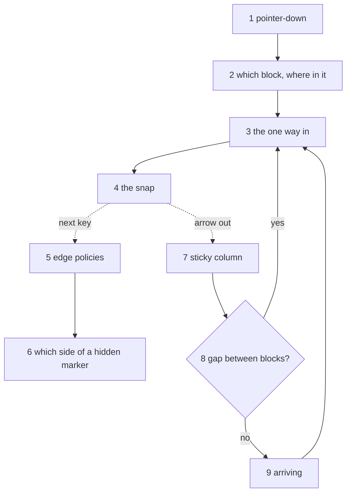

# How a click becomes a caret

Caret placement runs through edge policies, a widget snap, a focus classifier, a sticky column and a gap caret, and nobody who didn't write those can tell you the order they run in. This page is that order. One click, walked through every stage the code runs, one paragraph a stage, with the file named each time. Each paragraph says what the stage decides; the file says how.

The stages, in the order they fire:

1. [The pointer-down](#1-the-pointer-down): what a pointer-down forgets before anything lands
2. [Which block, and where in it](#2-which-block-and-where-in-it): a point becomes a block and an offset
3. [The one way in](#3-the-one-way-in): the one place a caret gets written
4. [The snap](#4-the-snap): fixing the browser's caret beside a widget
5. [The next key, at an edge](#5-the-next-key-at-an-edge): the ten edge policies, ranked
6. [Which side of a hidden marker](#6-which-side-of-a-hidden-marker): where a typed byte goes when the markers paint nothing
7. [Leaving the block](#7-leaving-the-block): the sticky column
8. [The gap between blocks](#8-the-gap-between-blocks): a caret sitting between two blocks, where neither can hold one
9. [Arriving](#9-arriving): the classifier, then the one way in again

The first four place the caret. The last five are what the caret does next, and they matter here because every one of them ends back at stage 3.

## 1. The pointer-down

`src/lib/selection/cross-block/pointer.ts` :: `resetForPointerDown`. Every pointer-down on a block runs this before anything else, and it decides what the click forgets: the sticky column (stage 7), the edge affinity (stage 6), a gap caret (stage 8), and, unless Shift is held, a live cross-block range. That last one is the rule a guard holds (G2.12): a caret dropped inside a range left live would be content the next keystroke type-replaces. A text block's own pointer-down in `src/lib/components/blocks/text/TextEditableBlock.svelte` adds two things: it remembers the point for stage 4, and if the click is on a widget that shows its source when clicked (an inline formula), it suppresses the browser's own caret so the reveal is the only thing placing one. Everywhere else the browser places the caret itself, as any contenteditable does. The editor doesn't fight that; it refines it.

## 2. Which block, and where in it

Two cases. A click inside a text block: the browser already knows, skip to stage 4. A click on the margin, on a block's padding, or below the last block ("dead space"): `src/lib/selection/dead-space-caret.ts` decides, in this order. A y between two top-level blocks, at a boundary that may hold a caret between them (stage 8's rule), is the gap. Otherwise the point clamps into the nearest block's box. Below the last mounted block while the document's tail is windowed out (not mounted at all) means mounting the real last block first, then landing at its end, since a block with no box can't be probed. With a point inside a box, `src/lib/selection/block-hit-test.ts` :: `blockAtPoint` names the block, and the kind names the spot inside it: a table names a cell through its `caretTargetAtPoint` hook, a prose block answers through `src/lib/cursor/point-offset.ts` :: `caretOffsetAtPoint`, the nearest offset. Neither does arithmetic of its own. Both read the one DOM-to-offset walk in `src/lib/cursor/widget-offset.ts`, so an image or a hidden marker counts the same whether you clicked or arrowed there.

## 3. The one way in

`src/lib/selection/caret-doors.ts` :: `placeCaret`. Every caret the editor places (as opposed to the browser) goes through one of two verbs. `focus` ends any live range or gap caret and then places the caret; `parkCaret` only places it, and it's reserved for the selection-extend paths, where the range must stay live while an endpoint moves (the callers are an allowlist). The placement itself is `src/lib/components/blocks/editable-surface.ts` :: `parkCaret`: it focuses the element without scrolling the page and clamps the offset into the range a caret can actually sit at, which excludes a hidden marker's bytes; the `CURSOR_START` and `CURSOR_END` codes resolve here too. The gap has its own entry point in the same file, `placeGapCaret`. The file calls these doors, and a guard (G4.36) keeps the list of them identical to the code that writes carets, so a third way in fails a test rather than a user.

## 4. The snap

`src/lib/components/blocks/text/widget-interaction.ts` :: `snapClickToWidgetEdge`, on the click event that follows the pointer-down. The browser's caret is wrong in exactly two places. A click on a widget that reveals its source (inline math) should open that source at the point, not put a caret next to it. A click on or beside an atomic island (an image, an emoji, a decoded entity) lands the browser's caret somewhere in the neighbouring text, with no text node under the point, so `src/lib/cursor/widget-edge-snap.ts` :: `nearestWidgetEdgeSeat` decides which island's which edge the caret meant: inside a character-like island, the edge on the side the click landed; inside one that selects whole (an image), no snap at all, the widget's own click handling owns it; beside one, the nearest edge, comparing rows before columns so a click past the end of a line never reaches an island on the line below. The snap does nothing when the browser already put the caret in visible text, and when the surface holds a range (the second click of a double-click is a word selection, `src/lib/selection/multi-click.ts`, not a caret). The same click also moves a caret that landed inside the container's marker prefix (the `- ` in front of a list item) back into the content.

That's the caret placed. Now the keyboard.

## 5. The next key, at an edge

`src/lib/components/blocks/text/edge-policy-dispatch.ts` :: `createEdgePolicyDispatch`. A plain key (a character, Backspace, Delete) while the caret sits against something that isn't plain text: an atomic widget, a view-only decoration, the container's marker prefix, a marker run that paints nothing. Native contenteditable would mutate the bytes those stand for, so the dispatch decides who owns the key instead. It's a declared list of ten handlers in rank order, first claim wins, and a key nobody claims falls through to the keymap: a pending mark (a `Mod+B` with nothing selected promised that the next byte gets bold), a hard break at the end of a block, a key aimed at a widget (enter it, select it, or step over it, per the kind's policy), then a reading-mode cut (nothing below runs, reading writes no bytes), a decoration island, the marker prefix, a Backspace that would merge past the block's own hidden structure, a delete beside an unpainted delimiter (takes content, never a marker), the space a container marker re-emits by itself, and last the hidden-marker side, which is stage 6. Each entry carries its reason in the file, and the order is the contract (G4.12), so a new family of key is a visible entry there, not an `if` somewhere else.

## 6. Which side of a hidden marker

`src/lib/components/blocks/text/edge-seat.ts` :: `resolveEdgeSeat`. In live mode a construct's markers paint nothing, so one screen position names two raw offsets: just before the `**`, or just after it. It decides which one a typed byte goes to (the seat, in the file's word), and three things get a say, in order. The construct's own row in `src/lib/schema/inline-construct-policy.ts` answers first (a link never extends, whichever side you type on). How the caret arrived answers second: `src/lib/cursor/edge-affinity.ts` records, on every keydown, whether the caret stepped in from outside, was placed at an end, or just committed a byte. The renderer has the last word: a candidate offset is accepted only if what shows on screen afterwards is exactly what showed before plus the typed byte. If no candidate passes, it declines and the browser's own placement stands, which is the honest fallback since that's where the byte was going anyway.

## 7. Leaving the block

`src/lib/cursor/sticky-column.ts` :: `classifyStickyKey`. The caret is leaving the block with an Up or Down arrow. Within one block the browser remembers your column across vertical moves; across blocks it doesn't, since each block is its own contenteditable, so the editor does. The rule is decided from the key alone: a vertical arrow captures the caret's editor-relative x (once; later arrows in the same run don't overwrite it), PageUp, PageDown and a bare modifier tap preserve it, and any other key resets it. Capture lives here and consumption lives in stage 9, in separate files on purpose: the block you're leaving records, the dispatcher that lands you spends.

## 8. The gap between blocks

`src/lib/selection/gap-caret.ts` :: `tryGapStop`, asked by `src/lib/editor-actions/focus/focus.ts` :: `moveFocus` on every directional move, at the boundary the move crosses. Some boundaries have no block on either side that can host a caret (a table directly above a code fence, say), so without this there'd be nowhere to type between them. The stop decides whether the move leaves the caret at the boundary instead of entering the next block: yes only when both kinds facing the boundary declared that edge in their descriptor's `gapEdges` (no kind is named at the read site), never in reading mode, and never for a targeted landing (a numeric offset, a consumer's `setSelection`). A stopped move goes through the gap's own entry point (`placeGapCaret`, stage 3) and never reaches stage 9. The caret then sits on a hidden proxy under a painted line, and a typed character makes a paragraph there; the rest of that story is `docs/design/editor.md` § 10.

## 9. Arriving

`src/lib/editor-actions/focus/focus-landing.ts` :: `verticalArrival`, then `consumeStickyLanding` in the same file. The classifier gives a vertical arrival one of three answers: place a caret (an ordinary block), enter the block as an object (a block whose only content is a widget, an image or a lone formula, takes the arrival as a selection or a source reveal), or pass over it (a widget-only block that can't be entered; the dispatcher retries at the next block). A horizontal arrival at a block that starts or ends with a widget enters the widget rather than stopping beside it with nothing to show. Then the landing itself: a sticky x, with a block that can take one, goes to `focusAtColumn` (the pixel x on the first or last visual line); otherwise `focus` at the start or the end; a numeric position passes through untouched, because a caller with a byte in hand (a split's second half) knows better than the classifier. Every one of those goes through stage 3.

If the caret landed somewhere odd: after a click, break in stage 2 or 4; a typed byte in the wrong place, stage 6; after an arrow, stage 9. [`../contributing/debugging.md`](../contributing/debugging.md) has the interaction trace, which records the sticky capture, the caret restore and the reveal as they happen, so you can usually skip the breakpoint.
