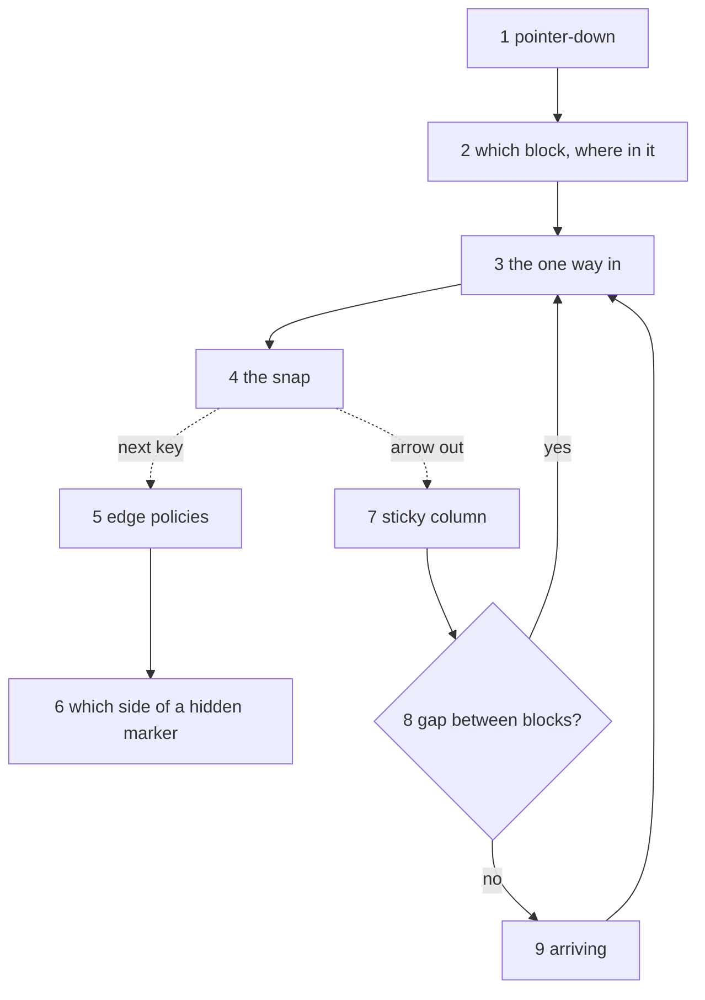

# How a click becomes a caret

Caret placement runs through a pile of stages (edge policies, a widget snap, a focus classifier, a sticky column, a gap caret), and unless you wrote them you can't tell what order they run in. This page is that order: one click, walked through every stage the code runs, with the file named each time. Each stage says what it decides; the file says how.

The stages, in the order they fire:

1. [The pointer-down](#1-the-pointer-down): what a pointer-down forgets before anything lands
2. [Which block, and where in it](#2-which-block-and-where-in-it): a point becomes a block and an offset
3. [The one way in](#3-the-one-way-in): the one place a caret gets written
4. [The snap](#4-the-snap): fixing the browser's caret beside a widget
5. [The next key, at an edge](#5-the-next-key-at-an-edge): the seven edge handlers, ranked
6. [Which side of a hidden marker](#6-which-side-of-a-hidden-marker): where a typed byte goes when the markers paint nothing
7. [Leaving the block](#7-leaving-the-block): the sticky column
8. [The gap between blocks](#8-the-gap-between-blocks): a caret between two blocks, where neither can hold one
9. [Arriving](#9-arriving): the classifier, then the one way in again

The first four place the caret. The last five are what it does next, and they're here because every one of them ends back at stage 3.

```mermaid
flowchart TD
    P["1 pointer-down"] --> B["2 which block, where in it"]
    B --> D["3 the one way in"]
    D --> S["4 the snap"]
    S -. "next key" .-> E["5 edge policies"]
    E --> W["6 which side of a hidden marker"]
    S -. "arrow out" .-> C["7 sticky column"]
    C --> G{"8 gap between blocks?"}
    G -- "yes" --> D
    G -- "no" --> A["9 arriving"]
    A --> D
```

## 1. The pointer-down

`src/lib/selection/cross-block/pointer.ts` :: `resetForPointerDown` runs first on every pointer-down on a block, and decides what the click forgets: the caret memory (`src/lib/cursor/caret-memory.ts`, holding stage 7's sticky column, stage 6's marker side and the pending marks, which always go together), a gap caret (stage 8), and, unless Shift is held, a live cross-block range. That last one matters most, because a caret dropped inside a range that's still live turns the next keystroke into a replace-everything.

Every editable surface's pointer-down, a plugin's included, goes through `handlePointerDown` in the same file. Mostly the browser places the caret itself, as any contenteditable does, and the editor refines it afterwards. Two presses the editor takes away from the browser:

- **A plain click in the surface's top or bottom padding.** Chromium on Mac and Linux would put that caret at the line's start or end, so the editor places it at the column under the pointer (through stage 2's probe) and cancels the mousedown. Not the pointer-down, since cancelling that swallows the mousedown a double-click needs; a double or triple click stays the multi-click gesture's.
- **A right-click in the same padding**, which moves the caret before any menu opens. `placeContextPress` in the same file listens at the editor root, ahead of every block's own menu, and puts it back at the column.

A text block's own pointer-down (`src/lib/components/blocks/text/TextEditableBlock.svelte`) also remembers the point for stage 4, and on a widget that shows its source when clicked (an inline formula) it suppresses the browser's caret, so the reveal is the only thing placing one.

## 2. Which block, and where in it

A click inside a text block: the browser already knows (or the editor does, for a padding click), so skip to stage 4. A click anywhere else (the margin, the room a block's box keeps around its text, below the last block; "dead space" in the code) goes to `src/lib/selection/dead-space-caret.ts`, which decides in this order:

1. A y between two top-level blocks, at a boundary that may hold a caret between them (stage 8's rule), is the gap.
2. Below the last mounted block while the document's tail is windowed out (not mounted at all), the caret lands at the real last block's end through the caret landing (stage 3), which mounts it first, since a block with no box can't be probed.
3. Otherwise the point clamps into the nearest block's box.

With a point inside a box, `src/lib/selection/block-hit-test.ts` :: `blockAtPoint` names the block. A container (a quote, a list, an alert) keeps its lines as child blocks, so a point on the container's own box, like a quote's bar, moves down to the child it's level with, however deep (`src/lib/selection/nearest-block.ts` :: `descendToLevelChild`). A drag into the margin takes the same step.

Then the kind names the spot inside the block. A table names a cell through its `caretTargetAtPoint` hook; a block of text (prose, or code, whose box has room around its lines) answers through `src/lib/cursor/point-offset.ts` :: `caretOffsetAtPoint`, the nearest offset. Neither does arithmetic of its own: both read the one DOM-to-offset walk in `src/lib/cursor/widget-offset.ts`, so an image or a hidden marker counts the same whether you clicked or arrowed there.

The probe, for the curious:

- `caretOffsetAtPoint` clamps the point into the element's box and hands it to the exact probe, `offsetFromViewportPoint`. A shift-click and stage 1's two presses call the exact one directly.
- The exact probe declines a point outside its element without asking the browser, which would answer one beside it with an offset inside.
- It moves a point in the top or bottom padding level with the nearest line first, because Chromium on Mac and Linux answers a point above the first line with that line's start (below the last, its end). Sideways padding stays put: every OS keeps the column there, and a list item's marker hangs in it.
- Two lints hold this shape: every call to the browser's point-to-caret lookup stays in `point-offset.ts`, and a file that mounts an editable surface calls `handlePointerDown` exactly once from each pointer-down handler it binds.

## 3. The one way in

`src/lib/selection/caret-doors.ts` :: `placeCaret`. Every caret the editor places (as opposed to the browser) goes through one of two verbs:

- `focus` ends whatever the editor had selected (a live range, a gap caret, a widget selected whole), then places the caret. It also announces where it put it, so a `selectionChange` subscriber hears the arrival before anything can be typed there (`editor.md` § 12).
- `parkCaret` only places. It's reserved for the selection-extend paths, where the range has to stay live while an endpoint moves, and its callers are an allowlist.

Edits' carets come through here too. The commit hands its position to `src/lib/selection/caret-landing.ts`, which mounts the block, calls its `focus`, and scrolls it into view if it's off screen. A stored selection (undo, `setSelection`, a collapsing range) comes back through the same file's `restore`, at its exact bytes rather than through `focus`, and the moving end of a Shift+Arrow range through its `park`.

Below the verbs:

- The placement itself is `src/lib/components/blocks/editable-surface.ts` :: `parkCaret`. It focuses the element without scrolling the page, runs the block's own landing rule if it has one (a code block keeps a caret arriving from outside off its fence lines), and resolves the `CURSOR_START` and `CURSOR_END` codes.
- Then `src/lib/cursor/widget-offset.ts` :: `placeCaretAtRaw` turns the raw offset into a DOM position: past the container's marker prefix, never behind a hidden marker run, and only where a caret can actually sit. In an empty block that's before its placeholder ` ` (the line break an empty editable holds so it has a line at all), since Chromium drops an IME composition started after it.
- A browser range put down inside one block without a pointer (a first Mod+A, a block's `setSelection`) goes through `selectInBlock` in `caret-doors.ts`, which ends what the editor had selected the way `focus` does.
- The two selections the editor keeps without a DOM caret have their own entries in the same file: `placeGapCaret` for the gap between blocks, and `selectWidgetWhole` for an inline widget selected whole (an image, say). Each ends the others the way `focus` does, and a lint fails any other file that writes either.
- A lint fails any native selection write outside `widget-offset.ts`, apart from a declared few files that select nodes they already hold.

## 4. The snap

`src/lib/components/blocks/text/widget-interaction.ts` :: `snapClickToWidgetEdge`, on the click event that follows the pointer-down. The browser's caret is wrong in exactly two places:

- A click on a widget that reveals its source (inline math) should open that source at the point, not put a caret next to it.
- A click on or beside an atomic widget (an image, an emoji, a decoded entity) lands the browser's caret somewhere in the neighbouring text, since there's no text node under the point.

For the second, `src/lib/cursor/widget-edge-snap.ts` :: `nearestWidgetEdgeSeat` decides which edge of which widget the caret meant:

| Where the click is                                           | The edge                                                                                                          |
| ------------------------------------------------------------ | ----------------------------------------------------------------------------------------------------------------- |
| inside a character-like widget                               | the one on the side the click landed                                                                              |
| inside one that selects whole (an image)                     | none; the widget's own click handling owns it                                                                     |
| beside one                                                   | the nearest, comparing rows before columns, so a click past a line's end never reaches a widget on the line below |
| above or below one (the strip a box leaves around a picture) | the one on the side the click landed                                                                              |

The widgets it measures are every widget the block draws, a picture inside a link or emphasis included (`src/lib/components/blocks/text/widget-adjacency.ts` :: `widgetsIn`). Where no text node sits beside that edge, the block paints its own caret there and hides the browser's.

The snap does nothing when the browser already put the caret in visible text, or when the surface holds a range (the second and third clicks of a run are a word or block selection, `src/lib/selection/multi-click.ts`, not a caret).

The same click also moves a caret that landed inside the container's marker prefix (the `- ` in front of a list item) back into the content. And while a widget is selected whole, a caret the browser puts in its block is dropped, so the document has no caret until a key places one or a press lands elsewhere (`editor.md` § 10).

That's the caret placed. Now the keyboard.

## 5. The next key, at an edge

`src/lib/components/blocks/text/edge-policy-dispatch.ts` :: `createEdgePolicyDispatch`. A plain key (a character, Backspace, Delete) while the caret sits against something that isn't plain text: an atomic widget, a view-only decoration, the container's marker prefix, a marker run that paints nothing. Native contenteditable would mutate the bytes those stand for, so the dispatch decides who owns the key instead. It's a declared list of seven handlers in rank order, and the first one to claim the key wins:

1. a pending mark (a `Mod+B` with nothing selected promised that the next byte gets bold),
2. a key aimed at a widget (enter it, select it, or step over it, per the kind's policy),
3. a reading-mode cut (nothing below runs, since reading writes no bytes),
4. a decoration widget,
5. the marker prefix,
6. a delete beside an unpainted delimiter (takes content, never a marker),
7. the space a container marker re-emits by itself.

A key nobody claims falls through to the keymap, and a byte it types is placed in stage 6. Each entry carries its reason in the file, and the order is the contract, so a new family of key is a visible entry there, not an `if` somewhere else.

## 6. Which side of a hidden marker

`src/lib/components/blocks/text/edge-seat.ts` :: `resolveEdgeSeat`. In live mode a construct's markers paint nothing, so one screen position names two raw offsets: just before the `**`, or just after it. The resolver decides which one a typed byte goes to (its symbols call that position a seat). It's asked by the write every insertion ends in (`src/lib/cursor/next-insertion.ts`), after the browser or the paste has put the text in, so a key, a soft keyboard, an IME commit and a paste all land the same way.

First it tries the offset an arrow picked, if one did. Where the position offers more than one typing offset, a plain ArrowLeft or ArrowRight moves that choice instead of the caret (`src/lib/components/blocks/text/edge-step.ts`, asked before the arrow gets to move anything), and the caret memory records the exact offset it picked. Past that, three things get a say, in order:

1. **The construct's own row** in `src/lib/schema/inline-construct-policy.ts`. A link never extends, whichever side you type on.
2. **How the caret arrived.** On every keydown the caret memory records whether the caret stepped in from outside, was placed at an end, or just committed a byte (`src/lib/cursor/edge-affinity.ts` reads which from the key), and it forgets all that on any caret move that isn't a key. One exception: an edit that lands the caret at a block's start or end, rather than at a byte, counts as placed at an end. So Backspace on an empty list item under `- **a**` puts the next byte after the `**`, same as at the top level.
3. **The renderer.** A candidate offset is accepted only if what shows on screen afterwards is exactly what showed before, plus the typed byte.

If no candidate passes, it declines and the browser's own placement stands. That's the honest fallback, since it's where the byte was going anyway.

## 7. Leaving the block

`src/lib/cursor/sticky-column.ts` :: `classifyStickyKey`. The caret leaves the block with an Up or Down arrow. Within one block the browser remembers your column across vertical moves; across blocks it doesn't (each block is its own contenteditable), so the editor does. The rule is decided from the key alone:

- a vertical arrow captures the caret's editor-relative x, once (later arrows in the same run don't overwrite it);
- PageUp, PageDown and a bare modifier tap preserve it;
- any other key resets it.

A chord bound to a block move (Alt+ArrowUp, unless a consumer rebinds it) moves no caret, so it leaves the column alone, and the keydown path asks the keymap which chords those are. The column lives in the caret memory with stage 6's side, so a click or an edit that forgets one forgets both. Capture happens in the block you're leaving and consumption in the dispatcher that lands you (stage 9), in separate files on purpose.

## 8. The gap between blocks

`src/lib/selection/gap-caret.ts` :: `tryGapStop`, asked by `src/lib/editor-actions/focus/focus.ts` :: `moveFocus` on every directional move, at the boundary the move crosses. Some boundaries have no block on either side that can host a caret (a table right above a code fence, say), so without this there'd be nowhere to type between them.

The stop leaves the caret at the boundary instead of entering the next block only when both kinds facing the boundary declared that edge in their descriptor's `gapEdges` (no kind is named at the read site). Never in reading mode, and never for a targeted landing (a numeric offset, a consumer's `setSelection`). A stopped move goes through the gap's own entry (`placeGapCaret`, stage 3) and never reaches stage 9. The caret then sits on a hidden proxy under a painted line, and a typed character makes a paragraph there; the rest of that story is `docs/design/editor.md` § 10.

## 9. Arriving

`src/lib/editor-actions/focus/focus-landing.ts` :: `verticalArrival`, then `consumeStickyLanding` in the same file. The classifier gives a vertical arrival one of three answers:

- **place a caret**, for an ordinary block;
- **enter the block as an object**, for a block whose only content is a widget (an image, a lone formula), which takes the arrival as a selection or a source reveal;
- **pass over it**, for a widget-only block that can't be entered; the dispatcher retries at the next block.

A horizontal arrival at a block that starts or ends with a widget enters the widget rather than stopping beside it with nothing to show.

Then the landing itself:

- A sticky x, with a block that can take one, goes to `focusAtColumn`: the pixel x on the first or last visual line that can show a caret, which skips a line holding only a widget and a code block's fence lines. The scan behind it (`src/lib/cursor/sticky-measure.ts` :: `findOffsetNearestX`) walks in from the edge you arrive at and stops a few lines past it.
- Otherwise `focus` at the start or the end.
- A numeric position passes through untouched, since a caller with a byte in hand (a split's second half) knows better than the classifier.

Every one of those goes through stage 3.

If the caret landed somewhere odd: after a click, break in stage 2 or 4; a typed byte in the wrong place, stage 6; after an arrow, stage 9. [`../contributing/debugging.md`](../contributing/debugging.md) has the interaction trace, which records the sticky capture, the caret restore and the reveal as they happen, so you can usually skip the breakpoint.
