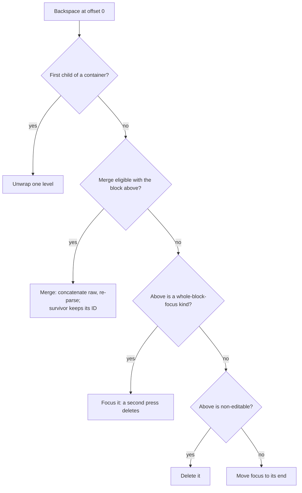

# Editor design spec

The orientation point for the whole system. §§ 1-3 orient any task; the rest is per-subsystem reading, and a subsystem's own spec goes deeper still. Nobody reads this end to end, and nobody should. Jump instead:

| §                                          | Section                        | What's in it                                                                            |
| ------------------------------------------ | ------------------------------ | --------------------------------------------------------------------------------------- |
| [1](#1-what-this-is)                       | What this is                   | the one promise the editor is built on, and the rules that fall out of it               |
| [2](#2-the-shape-of-it)                    | The shape of it                | the parse-render-serialize loop, the components that run it, six terms the doc leans on |
| [3](#3-data-flow)                          | Data flow                      | how an edit travels from a block to the tree and back to the screen                     |
| [4](#4-the-editing-surface)                | The editing surface            | what a block is made of while you edit it, and how a caret lands in one                 |
| [5](#5-schema)                             | Schema                         | the per-block-type metadata: merging, keybindings, commands, and their registries       |
| [6](#6-cst--dom-synchronization)           | CST ↔ DOM synchronization      | how the tree and the browser's editable text stay in agreement while you type           |
| [7](#7-cst-mutability-and-reactive-state)  | CST mutability, reactive state | who may change the tree, and the three rules that keep Svelte's reactivity honest       |
| [8](#8-orchestration)                      | Orchestration                  | split, merge, delete, reorder: every structural edit, and the keys that trigger them    |
| [9](#9-containers)                         | Containers                     | blocks that hold other blocks (quotes, lists, tables), and what nesting costs           |
| [10](#10-selection-search-clipboard)       | Selection, search, clipboard   | selections that span blocks, find and replace, copy, cut, and the paste pipeline        |
| [11](#11-undo--redo)                       | Undo / redo                    | one undo stack, and snapshots that share memory with the live document                  |
| [12](#12-serialization-and-the-event-seam) | Serialization, events          | how a document becomes text again, and the events a host can subscribe to               |
| [13](#13-block-identity)                   | Block identity                 | the stable ids that keep rendering and focus pointed at the right block                 |
| [14](#14-block-kinds)                      | Block kinds                    | every built-in block type and how the editor treats it                                  |
| [15](#15-extension-points)                 | Extension points               | where plugins attach; a pointer, since the real spec lives elsewhere                    |
| [16](#16-standing-directions)              | Standing directions            | the editor that died before this one, and four watch-outs for future work               |

## 1. What this is

aragonite is a block editor for GFM Markdown: you give it Markdown text, it gives you a document of styled, editable blocks, with the syntax still visible (`##` and `**` are there, just dimmed) and the same bytes coming back out. One idea makes the rest make sense: **the raw Markdown is the truth**, not a rich-text model that Markdown gets exported from. The editor parses your source into a tree whose nodes each hold their own slice of the original text verbatim, renders those slices as styled DOM, and saves by gluing the slices back together, nothing rewritten into a canonical form on the way through. That is the guarantee:

```
serialize(parse(source)) === source     for all valid GFM
```

And it is the rule every layer of this codebase obeys:

> **Slice bytes from `raw`. Never reconstruct them from parsed structure.**

(`raw`, here and everywhere below: a node's verbatim source bytes, markers included.) The block layer follows the rule: a container's `raw` holds its own outer syntax, and serializing is concatenation, not reassembly. The inline layer follows it too: a `**` marker in the DOM is `raw.slice(...)`, never a `**` you printed because the node said "strong". Every round-trip bug this project has had was some code path deciding it could rebuild bytes it should have copied.

Design principles, one line each:

- The CST (concrete syntax tree: the parse tree that keeps every byte) is the single source of truth for structure. If CST and DOM disagree, CST wins.
- Each block is an independent editing unit with its own rendering surface.
- Cross-block coordination flows through a minimal, typed interface. No signal bus, no runtime patching.
- Adding a block type is additive: one component, one descriptor, one registration. A genuinely new cross-cutting capability lands once, at the one place every path crosses, and every later kind inherits it; the coupling bug to refuse is shell, orchestration, or selection code branching on a specific kind name.

## 2. The shape of it

```
Raw Markdown ──parse──▶ CST (mutable plain objects, the single source of truth)
                          │ render                      ▲
                          ▼                             │ serialize
                        Contenteditable DOM (styled spans, dimmed markers)
```

The component tree mirrors the tree of blocks:

```
Editor  (shell: owns the CST, the undo stack, the editor-actions contexts)
  └─ BlockList  (keyed loop over a node's children; windows itself when large)
       └─ BlockHost  (resolves a component by node.kind; hosts the overlays)
            ├─ leaf blocks  (TextEditableBlock, CodeBlock, ThematicBreakBlock, ...)
            ├─ containers  (BlockquoteBlock / ListBlock → ListItemBlock: nested BlockList; TableBlock: per-cell grid)
            └─ plugin blocks  (containers, editable leaves, opaque blocks)
```

The Editor manages focus after structural operations with `await tick()`. BlockList is the one rendering primitive, reused at every nesting level; a large one renders a windowed slice ([`virtual-rendering.md`](virtual-rendering.md) is the windowing spec). BlockHost also mounts the two per-block overlays (selection, and decorations, which is what search paints through), the drag handle when the consumer asked for one, and a `<svelte:boundary>` that degrades a throwing block to a readable fallback instead of taking the document down; a kind with no registered component renders as a raw-editable text surface, visible and editable, never blank.

Six terms the rest of this doc leans on:

| Term             | Meaning                                                                                                                  |
| ---------------- | ------------------------------------------------------------------------------------------------------------------------ |
| `raw`            | a node's verbatim source bytes, markers included; the serialization truth                                                |
| kind             | the string on a node that says what block it is (`'paragraph'`, `'table'`, a plugin's own); drives every registry lookup |
| leaf / container | a container holds child nodes (blockquote, list, listItem, table, tableRow, plugin containers); a leaf doesn't           |
| descriptor       | the per-kind metadata record: how it merges, edits, renders (§ 5)                                                        |
| scope            | one block list and its children; the unit of addressing and windowing, and the unit a commit operates on (§ 11)          |
| path             | child indices from the document root down to a block; how everything off the render path addresses one                   |

## 3. Data flow

A block notices a boundary event (Enter, Backspace at offset 0, an arrow at an edge) and calls a typed context function; the editor shell mutates the CST; Svelte reactivity re-renders the affected blocks; the shell calls `focus()` on the target block after `await tick()`. Four channels, and only four:

| Direction      | Mechanism                                      | What flows                                        |
| -------------- | ---------------------------------------------- | ------------------------------------------------- |
| Block → Editor | Context callbacks (editor-actions sub-bundles) | Boundary events: split, merge, delete, move focus |
| Editor → CST   | Direct tree mutation                           | Structural change                                 |
| CST → Blocks   | Svelte reactivity                              | Blocks re-render from the new tree                |
| Editor → Block | Component refs (`bind:this`)                   | `focus(offset)` after a structural op             |

## 4. The editing surface

Markdown syntax is visible at all times, but styled: markers dimmed, content styled by meaning, one rendering path per block type. This is the permanent architecture, not a stepping stone; the alternative (an authoritative inline tree with `raw` derived from it) was evaluated and rejected ([`syntax-tree.md`](syntax-tree.md), appendix). The presentation modes (`presentationMode` prop: reading, block-granular and inline-granular preview, and fully live) layer on top as view treatments over that same single render path: marker visibility flips via CSS keyed on focus and caret proximity, never a second render path and never a derived-`raw` tree, so cursor offsets and the round-trip are untouched by construction. Styled source remains the default and the editing substrate; the contract every plugin tier uses to read the mode is in [`plugin-contract.md`](plugin-contract.md).

Live mode hides every marker standing over content and stays editable, which makes the hidden runs a caret problem rather than a paint one: a hidden run paints nothing, so one screen position names two raw offsets. Two seams answer that (a seam: a boundary where responsibility passes from one piece of code to another):

- **Edge affinity** records how the caret _arrived_ at such a boundary (stepped in, seated at an extreme, or committed a byte), so the write seat can tell "outside the construct" from "inside" at a position that looks the same either way (`cursor/edge-affinity.ts`, consumed by `components/blocks/text/edge-seat.ts`).
- **The inline-construct policy table** is where each construct declares what its own delimiters do: which side a typed byte seats on, whether emptying it unwraps, how a split treats it, whether it reveals its source to an entering caret (§ 6). Every seam reads one row instead of testing a kind (`schema/inline-construct-policy.ts`; the same table holds the two registered live-rewrite slots, the split rebalancer and the join-seam cleaner).

The full editing-rule catalog is [`live-mode.md`](live-mode.md).

### Three block surfaces

A block chooses its own editing surface; three exist:

- **`TextEditableBlock`.** The built-in contenteditable prose surface: paragraphs, headings, setext headings, and the raw-editable fallback. Parameterized by CSS class.
- **`createEditableLeaf`.** The plugin-facing text-leaf factory, same native caret / IME / undo / clipboard / cross-block-selection parity. Two modes: `plain` (always editable, commits per keystroke) and `render-primary` (rendered view, reveals its source on entry, commits once on blur).
- **`createContainerBlock`.** The plugin-facing container factory: a nested `BlockList` with its own scoped contexts, exactly as `BlockquoteBlock` wires it.

Beyond those, a block may render anything (a grid of cells, a static focusable element, an opaque diagram); it only has to conform to the block interface below, and not all blocks need contenteditable. Images are not a block kind: they render inline, as atomic widgets inside prose blocks (§ 6).

### The block interface

Every block component exposes a common shape. `src/lib/block-component.ts` is authoritative, each member's docstring stating its own contract; the required core is four members:

```ts
focus(offset: number): void    // place the caret; also ends any live cross-block range
getCursorOffset(): number | null
readonly editable: boolean     // a report: mirrors the descriptor's editable declaration
readonly focusable: boolean    // the flag focus dispatch reads before landing anything
```

Everything else is optional, and a block implements what its surface can honestly answer: selection reads (`getSelectedText`, `setSelection`), pixel-column landing (`focusAtColumn`), selection-rect measurement (`measurePartialRects`, § 10), path descent for nested surfaces, command dispatch (`runCommand`).

**Caret placement is two verbs, not one.** `focus` places a caret and ends any live cross-block range, the safe default: a caret landing inside a range left live is content the next keystroke type-replaces. The optional `parkCaret` is the same landing _without_ the range-ending, for the selection-extend paths only, where the dispatcher parks a caret in an endpoint it has just revealed (to reveal: mount an off-screen block so its DOM exists before something touches it) while the extend is still growing the range. G2.12 guards which callers may reach the second verb.

The caret surface as a whole reads as three layers, and a new gesture composes them rather than adding a verb:

1. **Landing.** Seat a caret, one entry per addressing mode: `focus` and `parkCaret` (raw offset), `focusAtColumn` (editor-relative pixel X on the first or last visual line, with park semantics), `focusByPath` (descent to a nested leaf). Every implementation is built on the same `placeCaret` core (`selection/caret-doors.ts`), so range-ending policy lives at one seam.
2. **Point resolution.** Turn a viewport point into a landing first: the `caretTargetAtPoint` descriptor hook answers for coordinate-addressed kinds (a table names a cell), with the drag hit test as its decline-happy sibling.
3. **Boundary policy.** Where a landing meets an atomic widget (§ 6): `enterEdgeWidget` for a keyboard arrival at a block edge, `snapCaretToPoint` for a click's post-landing refinement, both dispatching the kind's one registered `InlineWidgetEditingPolicy`.

A block publishes the shape one of two ways, and BlockHost resolves both at the single point it stores a ref: a leaf as its own instance exports, a container under one `containerApi` export, because Svelte 5 instance exports are individual top-level declarations with no spread, and forwarding a dozen members by hand made every member a place to drop one. The component registry types the two shapes as a union, so a block publishing neither does not compile.

## 5. Schema

Cross-cutting block-kind metadata lives in `src/lib/schema/`. Both `core/inline/` and `tree-operations/` read from it, and the schema depends on neither, because otherwise the layer DAG cycles; it is not the only thing those two share (`core/` and `perf/` are in the intersection too), but it is the one carrying kind vocabulary, which is why a cross-cutting block-kind fact belongs here. `core/` and `schema/` are mutually dependent by design, at directory granularity only; no module cycle exists.

### The block-kind descriptor

One registration per kind. It holds:

- the merge role (§ 8), the editable flag, inline support, and the whole-block focus policy (`blockFocus`, § 8);
- context-dependent kind: no standalone recognizer, so a content edit keeps the kind rather than re-deriving it;
- declarative keybindings (`keymap`) and the content-range hook;
- the two point→internals hooks a coordinate-addressed kind declares separately: the exact drag hit test, and the nearest caret target a caret-placing gesture asks for;
- for containers, one indivisibly registered group: the container contract, the raw rebuild, the reserved-chrome declaration (chrome: the parts of a block that are furniture, not content, like a title row), the paste-merge declaration (`containerPaste`), and the unwrap strategies (`unwrapRole`).

Grouping the container-only fields makes an illegal leaf/container mix a compile error rather than a runtime surprise: contract and rebuild are required together, and `isContainer` is derived, never declared.

### Commands and keybindings

A kind's `keymap` maps a normalized chord (`Mod` = Ctrl/Cmd) to a command id; global commands (undo/redo, a plugin's registered global) are free functions. Keystroke→operation mapping is declarative, so there is no per-component `onKeyDown` branching to keep in sync.

A focused leaf resolves a chord through four tiers, consumer overrides first: an override on the kind, an override on the global table, the kind's own keymap, then the built-in global table. Override source beats specificity, so a consumer disabling a chord globally suppresses one a kind defines. The resolved id is then spent on three tiers in order: the global table; a minted `(kind, id)` block command (minted: created by the one authorized registration, where a duplicate throws), which runs its own registered handler; and the built-in vocabulary on the focused component's `runCommand`. Container bubble handlers resolve kind-only, so they never double-fire a leaf's global command, and `runCommand` reads the caret live, so cross-block dispatch operates at the collapsed position.

### The dispatch seam

Chord resolution and the public `EditorInstance.runCommand` entry meet at one id-keyed dispatch seam, where the rules that hold _whatever_ invoked a command live. Reading mode dead-keys the vocabulary there, and a painted cross-block range takes its own road, with three answers: a command whose handler spends one block's own offsets and has no cross-block reading **declines** outright (the link editor, which writes a link into one block); a format toggle routes to the **cross-block executor**, injected into the seam's gates because a schema leaf may not import selection machinery; everything else is range-safe and **runs on the focused surface**. An entry path that threads no executor declines the toggles too, so a dispatch site added later cannot fall through to the focused block's offsets.

<details>
<summary>How the cross-block toggle actually works</summary>

- It decomposes the range into one span per participating block (the anchor's tail, each middle block's content, the focus block's head) and runs each through the same single-block seam, so it has no branches, candidates, or mode verification of its own. Direction is the whole range's coverage, decided once and applied to every span: all covered unapplies, anything else applies, which keeps an apply from walking an already-marked block back.
- Participation is the kind descriptor's declaration (inline-bearing, editable, not a container), never a kind name.
- A grid joins through its cells, which are leaves of exactly that shape: an endpoint inside one resolves to a cell, whether it arrived as a cell index on the grid's own path or as the deep cell path a plugin grid keeps, so the range covers whole cells. Which cells is the grid's own question: a run to the endpoint cell where the range enters or leaves it, the rectangle its two ends span where both are inside; the same cells the overlay paints and a range delete clears. The endpoint stays on its cell across the write (a deep-path char offset follows that cell's rewrite, as a prose endpoint follows its block's). Rows of cells is the whole shape asked of a grid: children that are not rows of cells contribute nothing rather than guessing, and rows of unequal width are read against the first row's, so a wider row's surplus cells sit outside the space the range can cover.
- The whole press is one undo entry through the multi-scope commit (§ 11), and the range is restored over the result through the shared restore road (§ 10).

</details>

The same seam answers `EditorInstance.canRunCommand`, the read a host greys a button from, so what a button shows and what a press does cannot drift apart (a probe spends none of the dispatch's one-time dead-key diagnostics). Its state sibling `isCommandActive` answers a command's pressed paint from whoever would spend the press: the focused surface at a caret, the range's own coverage across blocks. A mark reads its own runs; the link editor reads the construct its card would edit, resolved by the card's own entry, so the button and the chord cannot name different links, and pressing a painted button enters the link it painted for. Paint and press decide by the same guards, so the two cannot drift on the three range answers (G2.14, whose one escape is the literal wrap a marker-painting mode writes on the reader's screen).

### The other registries

- **Block openers.** An opener is the part of the parser that recognizes the syntax a block starts with. Kinds the block parser dispatches declare `{priority, tryOpen, interruptsParagraph}`, and both the parser's dispatch order and its paragraph-interrupt scan derive from the declarations. Built-in openers live in `core/parsers/`; the published priority ladder is `OPENER_PRIORITIES`.
- **Enter completion.** The opener registry's sibling, for kinds whose grammar spans adjacent lines and so cannot be typed into existence: a registered completer reads one typed line and answers the canonical lines completing it plus the caret's landing. One seam consults it (§ 8). Published on the plugin surface, so its plugin entries clear through the platform reset like every other public register-once registry.
- **Components.** The runtime kind → component map BlockHost looks up. Built-in registrations live in `components/built-in-blocks.ts` (top-of-DAG wire-up, imported once at editor mount).
- **Merge rules.** Eligibility predicates for Backspace-merge, plus the walker that finds the deepest mergeable leaf (§ 8).
- **Container raw rebuild.** Per-kind rebuild plus ancestry dispatch, so an edit deep in a nesting chain re-emits every enclosing container's `raw` (§ 9).

Registries are code, not state: register once, throw on duplicate, no unregister (the `customElements` model), in production and under test. Strict on purpose, because a registry you can quietly overwrite is a registry two plugins can fight over. Under a dev server a duplicate registration replaces with a note instead (`schema/register-once.ts`), so a re-evaluated registrar survives rather than 500-ing every route.

## 6. CST ↔ DOM synchronization

The CST is the document-level truth. Inside one block, during active editing, the DOM leads and the CST follows, and that is no contradiction: the CST is written on every input event, so following is not lagging, and the DOM is patched only when the CST's structural interpretation diverges from what is rendered. Typing stays fast because we don't fight the browser for ordinary keystrokes; we read the result back.

### Reading the DOM back

On `input`, the block reads its own DOM content back as raw text, writes it to `node.raw`, and re-parses to refresh metadata and inline content; if the kind changed, it re-renders with the new component. What it never does is reconstruct that text from parsed structure (§ 1's rule, one level down). Each surface supplies its own reader: code blocks and plain editable leaves read `textContent` directly, because for them `textContent` _is_ `raw`; prose blocks read through a raw-aware DOM walk, because atomic widgets contribute **zero** characters to `textContent` (their bytes live on `data-source-*` attributes) and a container's ambient prefix (the read-only marker a container lends its first child, a list's `- `) contributes characters that are not in the child's `raw` at all, so a `textContent` read here would silently drop every widget's source and swallow the marker. The common case (no kind change) needs no DOM patching, since the browser's update and the CST agree; prose blocks rebuild their styled span tree from `raw` on every input, offsets mapping unchanged.

When the edited text re-parses to **multiple** blocks (a hard-break line followed by an interrupter, an early fence close), the block structurally replaces itself with all of them: the first keeps the slot's identity, the rest splice in as siblings, and the caret follows the edit position into whichever block it lands in. Every input crosses this one point, and it is what keeps the live CST from cramming multi-block text into one node's `raw`. Before that split, a construct the write itself left **open** is closed: a typed unterminated fence writes its own closing fence over an empty body, so the blocks below stand instead of being absorbed. A gesture that merely _exposes_ an already-open fence still absorbs what follows, because that is the reload's honest reading, and § 8's settling converges to it.

### Intercepted operations

These the editor owns, not the browser:

| Operation          | Trigger                           | Behavior                                                             |
| ------------------ | --------------------------------- | -------------------------------------------------------------------- |
| Enter              | `keydown` → `preventDefault`      | Split the CST node at the cursor offset                              |
| Backspace at start | `keydown` → `preventDefault`      | Merge, unwrap, delete, or focus (§ 8)                                |
| Paste              | `paste` → `preventDefault`        | Read `text/plain`, dispatch through the paste pipeline               |
| Copy / Cut         | `copy` / `cut` → `preventDefault` | Slice the selected range out of the CST's `raw`; cut then deletes it |
| Undo / Redo        | `keydown` → `preventDefault`      | Pop/push the editor's own undo stack (browser undo is off)           |

One thing the editor deliberately does _not_ own: between `compositionstart` and `compositionend` there is no sync and no reconciliation, the browser owns the IME sequence outright, and `compositionend` enters the same input path as a keystroke.

### Atomic inline widgets

Some inline nodes render as opaque widgets: `contenteditable="false"` islands with no caret-able interior. Images, `<br>`, inline math, inline directives, and decoded HTML entities are the shipped set, and the inline-widget registry (`core/inline/inline-widgets.ts`) is the single source of truth for which inline kinds are live widgets. A widget carries its raw bytes on `data-source-start` / `data-source-end` attributes on its root, not in `textContent`, and the cursor is addressable only at its leading and trailing edges.

**`cursor/widget-offset.ts` is the single translation point between DOM Range positions and raw offsets.** It walks the block in document order, summing text-node lengths and widget raw lengths, and everything that needs the translation routes through it: the ambient-marker helpers, sticky-column measurement, the native selection bridge, the block's own `setSelection` / `measurePartialRects`. Offset arithmetic done anywhere else will eventually disagree with it ([`../contributing/casebook.md`](../contributing/casebook.md)).

Two cross-block focus behaviors compose on top. **Vertical skip:** a block whose only inline content is widgets reports `isVerticallyTransparent()`, and ArrowUp/Down passes straight through it; containers recurse, so a list item holding one image-only paragraph is itself transparent. **Edge entry:** when a cross-block ArrowLeft/Right lands at the far edge of a paragraph that ends (or starts) with a widget, the dispatcher enters the widget rather than parking a caret at a boundary with nothing to show for it. What "entering" means splits by the kind's editing policy:

- **Reveal-capable kinds** (inline math, inline directive): horizontal caret entry against either edge (ArrowLeft/Backspace from the right, ArrowRight/Delete from the left, within-block or as a cross-block landing) opens the source reveal with the caret at the entered edge of the raw source; the caret then walks the raw bytes, and the escape machinery closes the reveal when it leaves. The widget-selected state is unreachable for these kinds, so the caret never parks somewhere with no visual representation, and an adjacent Backspace degrades the widget one visible delimiter byte at a time instead of silently deleting the whole thing.
- **Images** keep select-then-step and select-then-delete on the same keys; **a decoded entity** is atomic and step-over, a plain arrow walking the caret across the glyph like a character and a caret-adjacent Backspace removing the whole reference in one press. **Shift+Arrow never reveals**, on any kind.

**Source-reveal editing.** A revealed widget swaps its rendered island for its editable raw bytes. Three facts orient the rest: the gesture is editor-owned end to end (pointerdown on the widget suppresses the browser's default caret placement, so the reveal's own landing has no racing writer); while revealed, the edit is ephemeral DOM, one undo entry on commit; and the reveal closes when the caret or selection escapes the source. The escape rules:

- An in-block escape closes in place; blur owns the focus-leaving close; a cross-block sweep keeps the source revealed, so selection rects measure real text. Clicking widget B while A is revealed closes A and reveals B as one sequenced gesture.
- Containment is decided by raw offset through the shared walk, and an escape must survive a `tick()` re-check before closing, so a transient selection state the editor's own machinery manufactures (cross-block entry clearing the native selection) never closes a reveal the user still wants open.
- A mutation of the block closes the reveal _before_ it touches a byte: a clipboard splice and every branch of the block's command dispatch run against `node.raw`, which the ephemeral edit has not reached. That is what keeps Enter meaning "split" inside a revealed source (the command seam closes the reveal, then splits at the caret) rather than the reveal claiming the key and costing the user the press.
- The reveal claims exactly one key of its own, Escape, with one carve-out a table cell carries at its own keydown: a cell's Enter is a row hop rather than a split, and hopping would move the ephemeral edit out of the surface that owns it, so there a revealed source commits and the caret stays put.

To add a widget kind, register it in the inline-widget registry so recognition stays single-sourced; render it as a Svelte component (recommended: the render layer keeps the instance alive across per-keystroke rebuilds) or hand-built DOM ([`inline-parsing.md`](inline-parsing.md) § Widget render paths). Either way the generic machinery keys off `[data-inline-widget]` alone: no per-widget plumbing in the cursor walker, the selection painter, or the raw reader.

## 7. CST mutability and reactive state

The CST is mutable plain objects, no class hierarchy: the parser produces mutable nodes, the editor mutates them in place, and `serialize()` reads `raw` only. It is structurally typed over readonly fields, so it also works on the bytes-readonly node views (`core/node-views.ts`) that readers outside the mutation layers hold; the only sanctioned view→mutable routes are the unshare/clone seam and the owned scope views the commit ceremony hands out (ceremony: the fixed steps a commit always runs, § 11).

- `parse(source)` yields a mutable `Document`, and the editor works with those nodes directly. No wrapping, no cloning on load.
- Re-parse runs `parse()` on the block's `raw` and transfers the result into the existing tree through one entry: a same-kind edit writes the block's fields in place, so routine typing keeps the node object (its component and IME state ride along), while a kind change or a multi-block result creates fresh nodes and splices them into the slot, the ID carried across at the index (§ 8). The transfer no longer rewrites `kind` in place, and readers can't either, because the bytes-readonly `NodeView` makes a `kind` write a compile error ([`syntax-tree.md`](syntax-tree.md)); on a mutable node the union still permits the write, so the mutation layer holds the line by routing every re-parse through this one entry.
- Undo snapshots **share** the live tree's nodes; a mutation copies the shared spine (the chain of parents from the root down to the edited node) before writing (§ 11).
- Some container metadata feeds the container's `rebuildRaw` (a list item's `taskMarker` is emitted back into its serialized text), and a write to such a field must trigger the rebuild in the same commit or `raw` drifts from metadata. The `updateBlockMetadata` primitive runs the rebuild after its shallow-merge, so a new metadata-driven-raw field inherits the guarantee by routing through the same primitive rather than by remembering a rule.

### Reactive state plumbing (Svelte 5)

Three invariants govern how CST state crosses into Svelte's reactivity. Each prevents silent corruption, and none is discoverable from the types ([`../contributing/rules.md`](../contributing/rules.md)), which is the worst combination there is, so they are written out in full.

1. **Reactive state crosses module boundaries as getters, never values.** Re-init effects and bootstrap helpers read mutable state through `() => state` closures or getter properties. A plain value-read would snapshot at effect-run time _and_ register the state as a dependency of the effect, re-firing it on every later mutation and wiping unrelated work. The `source !== lastSource` guard in `Editor.svelte` exists for the same reason.
2. **The document is not its own memo key; the content version is.** The `$state` document is mutated in place, so its object identity survives every edit. Anything derived from the whole tree (footnote numbering, a table of contents) keys on the editor's **content version**, a counter that each route writing the document's bytes announces and nothing else moves (G4.52). Announced rather than derived from a walk, because the walk was O(document nodes) per edit and the announcement is O(1), at the cost of invalidating on a commit that moved no byte. It is not the decoration engine's `editEpoch`, which moves at edit-event cadence and so lags a typing batch; the version moves at render cadence.
3. **The render path computes inline content locally and reads no cache.** There is no `inlineContent` node field: prose blocks compute the inline tree from `node.raw` on each render, so a render effect's reactive read set is `node.raw` plus its closure inputs, nothing more. Non-render consumers (event handlers, exported methods, click-snap) read inline content through an accessor backed by an external, non-reactive WeakMap that Svelte's ownership tracking never observes. The incident behind this: a render effect both read and wrote a reactive cache field, write-during-read closed the loop, and ownership tracking corrupted keyed `{#each}` index assignments after `splitBlock`. With no reactive cache field, that class cannot recur.

## 8. Orchestration

**Upward.** Blocks call typed context functions for structural operations (split, merge, delete, move focus, update content, undo, redo), each taking a block index relative to the **local** children array. No signal dispatcher, no string matching, no performer registry. The block-editor interface rides three named facets (editor services, host policies, document identity) plus the per-key survivors whose individual granularity is the mechanism: a container overrides only the action sub-bundles whose behavior it changes (block editing, focus, container editing), one bundle at a time, while history stays its own key that only the editor root provides, so undo/redo resolve to one stack (G1.4). Everything else resolves by walking up the context tree to the nearest ancestor that provides it, so pass-through delegation boilerplate does not exist. The cross-scope commit primitive and the paste commit coordinator (§ 10) ride the services facet.

**Downward.** The editor reaches down through component refs, mostly for focus; the other reaches are narrow and deliberate (`insertMarkdown`, `runCommand`, and the selection reads the undo snapshot needs). After a structural mutation and `await tick()`, it calls `focus(offset)` on the target block, the range-ending verb, so a landing after a cross-block operation cannot leave the old range painted.

### Structural operations

All structural operations are CST mutations performed by the editor shell; blocks never modify the tree.

**Split.** Cut `raw` at the cursor offset and re-parse each half as the blocks it holds, normally one apiece. The original keeps its ID; every other node gets a fresh one. Offsets are raw offsets, markers included, and the block component translates DOM position to raw offset; the marker is not duplicated, the second half re-parsing as its natural kind. Two edge rules: a cut landing _on_ a line ending terminates the first half with it rather than opening the second with a blank line the user never typed, and a structural suffix (raw past the content range, today only a setext underline) stays with the first half, so the split can't strand it below into a demoting reparse.

**Enter completion.** A split that creates a construct instead of cutting one. Every split serializes as a blank-line-separated pair, since two adjacent prose lines would re-parse as one paragraph, so a grammar needing its lines adjacent (a table's header and delimiter) can never be typed into existence. Before splitting, the Enter-completion registry (§ 5) is consulted at exactly one seam: where the block is a single line of prose whose every byte is content and the caret sits at its end, a registered completer may claim the line and answer the canonical lines that complete it. The claim becomes a block replacement in the slot (one undo entry, the paragraph restored byte-for-byte with the caret where it was) and consumes the press. The consult wraps the composed split action rather than sitting inside it, above any container's own split override, so a container cannot take the branch out of its subtree and no press crosses it twice; a completer answers its caret as a line and a column inside the node it addresses, never a byte offset, because the seam picks the line ending after the claim. The table is the built-in registrant; block math (`$$`) is the bundled plugin one. Two grammars that look like candidates are not: front matter is position-blind to a completer (`tryComplete` sees a line, not where the document starts) and a typed `---` parses as a thematic break, which the prose gate excludes, so it would need a different signal; a footnote definition forms from one line, so Enter has nothing to complete, and whether `[^1]:` opens is an opener question.

**Merge.** Concatenate two adjacent nodes' `raw` and re-parse to determine the merged kind, where the concatenation reads as **one** block. A join whose bytes reparse plural is refused at the write, and the caret moves across the boundary instead. The survivor keeps its ID.

**Delete.** Remove the node from its children array, then settle the join that removal opened (below).

**Reorder.** Move a node among its siblings; IDs don't change, and both edges of the moved window are settled. Two gestures, one operation: keyboard (Alt+↑/↓ on the focused block, with a screen-reader announcement) and a mouse drag from the block's hover handle (an insertion line marks the drop, one commit on release, autoscroll for off-screen targets). The handle is opt-in (`blockDragHandles`, default off); keyboard reorder is always available.

**Kind change.** When a re-parse of a block's updated `raw` yields a different kind, the node is replaced with one of the correct kind and keeps its ID; when it yields several blocks, the first keeps the slot's ID and leading trivia and the rest splice in with fresh IDs, exactly as a split does. The same rule runs a level up for **containers**: an edit inside one changes what the container's own rebuilt `raw` parses to (typing the rest of a `> [!TIP]` marker), so the ancestry rebuild re-derives the container's kind and swaps the slot the same way (§ 9). A demotion also settles the joins it disturbed.

**Settling a disturbed join.** To _settle_ is to re-derive the blank-line separators around a splice. A mutation can invalidate an adjacency that was correct before it, and adjacent bytes that re-read as **fewer** blocks are the reload's own reading, so the tree converges to that reading rather than inventing separator bytes into an untouched neighbour. Four routes settle: a kind demotion absorbs the neighbours it stopped interrupting; a delete joins its survivor into a tight neighbour; a reorder re-judges both edges of the moved window and reports where the block actually landed; and a container's own slot is asked on the way out of the ancestry rebuild. A write that leaves its own construct open is closed first (§ 6).

### Merge eligibility: roles, not pairs

Eligibility derives from a per-kind **merge role**, so adding a kind doesn't mean editing an enumerated pair set:

| Role             | Meaning                                                 | Kinds                                                                                                   |
| ---------------- | ------------------------------------------------------- | ------------------------------------------------------------------------------------------------------- |
| `prose`          | Leaf text block                                         | paragraph                                                                                               |
| `prose-absorber` | Prose leaf that keeps its own kind when absorbing prose | heading, setextHeading                                                                                  |
| `container`      | Merge target is its deepest reachable prose leaf        | blockquote, list, listItem                                                                              |
| `self-merge`     | Merges only with another block of the same role         | unrecognized                                                                                            |
| `not-mergeable`  | Backspace deletes (if non-editable) or moves focus      | fencedCode, indentedCode, htmlBlock, linkReferenceDefinition, table, tableRow, tableCell, thematicBreak |

`prose + prose`, `prose-absorber + prose`, `container + prose`, and `self-merge + self-merge` are eligible; every other pairing is not. A `container + prose` merge walks into the container's subtree for the deepest prose leaf, generalizing "merge into the deepest visible text above" across container boundaries; when the walk finds none (the deepest leaf is not-mergeable, or the container is empty), the caller falls back to the ineligible behavior and moves focus to the end of the deepest reachable block. A whole-block-focus kind takes precedence over the `not-mergeable` row: `thematicBreak` is focused first and deleted only on the second press.

### Backspace at the start of a block



Two refinements the diagram elides: a container that declares no unwrap strategy delegates upward, the same decision re-running one level out with the container itself as the block (this is how a list item's children reach the list); and a container may override the _middle_-child branch too, a list routing its non-first items through the same cascade as its first, which is where M1 below comes from.

### Whole-block focus

A **whole-block-focus** kind (`blockFocus: 'whole-block'`) is an opaque, childless block that is its own focus target; the built-in thematic break and the bundled mermaid diagram are the two shipped examples. One declaration buys the whole behavior set: arrows land on it with a whole-block highlight; a caret-adjacent Backspace **focuses** it rather than deleting outright, so the highlight is press one of two (Delete at the end of the block above is the forward twin); Enter inserts a paragraph below, a typed character does the same carrying it; Backspace/Delete while focused deletes it; Mod+C/Mod+X copy or cut its Markdown; a cross-block range carries it whole; Alt+Arrow reorders it. The container factory wires all of this from the one declaration, which is why mermaid is the reference a plugin author copies; the thematic break is a plain component that reaches the same tail directly. Such kinds are childless by design, so the editable-container backfill skips them: a phantom child would permanently violate their opaque `raw`↔children faithfulness (§ 9).

DOM focus does not sit on the declared surface. The kind declares which element **stands for** the block, and the editor mounts a hidden editing host in the block's box and focuses that instead, because AltGr productions and IME composition reach an editing host or nowhere, and a `tabindex=0` div is not one. (This is the gap caret's proxy technique at a second site; the gap caret, a caret parked between two blocks where neither surface can host one, is § 10's subject. One factory serves both whole-block routes, while the gap caret reimplements the technique independently.) The declared surface keeps focus only when it is itself editable, owning its caret already. Consequences worth knowing: a focus assertion is containment, not identity; the host is the block's one tab stop, so a declared surface that stays in the tab order adds a second stop the backward tab parks on; and a plugin box needs `position: relative` for the host to resolve against the block.

### Container unwrap

Backspace at offset 0 of a container's **first** child unwraps one structural level. Each press does exactly one thing, and there is no auto-merge with the block above the container. Dispatch is declaration-driven: each container's `unwrapRole` selects its first-child and middle-child strategies, and an undeclared container delegates upward. The four cases, named for the e2e requirements that pin them (under `src/lib/e2e/requirements/`, in `blocks/list/backspace/` and `container-editing/`):

- **U2, blockquote.** The first child is lifted out into the parent at the blockquote's position. An emptied blockquote is deleted.
- **U1, list, non-empty first item.** The item's first paragraph becomes a plain paragraph before the list. Matching-type nested sub-list items promote to the shrunk parent level; mismatched-type sub-lists become separate blocks. An emptied list is deleted.
- **M1, list, non-empty non-first item.** The item merges into the deepest visible text above it; its remaining children are placed by preserve-absolute-indent. Ordered markers renumber.
- **Nested first item** (any list with a parent list). The item is promoted to the parent list level, the Shift+Tab equivalent.

### Marker completion

An opener firing on the bare marker byte creates its container before the space that finishes the marker arrives, so that space would land in the container's empty child as content, a permanent leading space once text follows. A container declaring `contentStartSpace` consumes it instead: every space at an empty child's content start is taken, at any child index and on repeated presses, moving no byte and pushing no undo entry. A `rebuildRaw` that canonicalizes the marker's trailing space is what makes the first press byte-honest, since the space it took reappears the moment content arrives. Blockquote is the shipped declarer, in every presentation mode; the list needs none, since `-` alone stays a paragraph and the flip to a list writes `- ` whole. Nesting composes by the nearest ancestor: an inner quote completes at its own depth.

### Focus traversal

Arrow navigation at block boundaries uses geometry, not offsets: the cursor rect is compared against the rect of the block's first or last visual line. ArrowUp on the top visual line, or ArrowLeft at offset 0, moves to the previous block; ArrowDown on the bottom line, or ArrowRight at end of content, to the next. `moveFocus` skips non-focusable blocks, and `focus(offset)` on a non-editable block ignores the offset. Into a container from outside, focus lands on the first (or last, by direction) editable child; out of one, the inner `BlockList` signals up to the container, which signals up to the parent list.

**Sticky column.** Cross-block caret column memory; within a block the browser's native sticky column handles vertical movement, and we layer on top only at block boundaries, where the native one resets.

- **Capture.** A vertical arrow press captures the cursor's _editor-relative_ pixel X (scroll-invariant). Idempotent: the first press after a reset captures, later ones don't.
- **Reset.** Any other user action: typing, click, horizontal arrows, structural ops, undo/redo, editor blur, tab hidden.
- **Transparent blocks** (thematic break) pass through without capturing or resetting; **participating blocks** (text, code) capture and implement `focusAtColumn(x, from)`, prose and code differing only in rendered content, same helpers, same policy.

Capture and consumption are split: the source block captures, and a separate focus dispatcher reads the value at cross-block transitions, either calling `focusAtColumn` or falling back to start/end focus; the surface is a pure receiver, null-handling lives in the dispatcher, and the `cursor/sticky-column.ts` header carries the authoritative two-axis contract. Sticky X is a **visual** lock, not a logical one: when a destination block scrolls internally, the visible column at a given X depends on its current `scrollLeft`, so re-entering a scrolled table lands the caret in the visible column nearest the captured X. By design.

## 9. Containers

Containers hold nested children: blockquote, list, listItem, table, tableRow, and plugin- or directive-authored containers. A blockquote holding two paragraphs, followed by a plain paragraph, is two top-level children, and the inner paragraphs are not addressable by a flat document-level index. Hence **paths, not indices**, everywhere off the render path; context functions take a `blockIndex` relative to the **local** children array, so a paragraph inside a blockquote calling `splitBlock(1, offset)` operates on index 1 of the blockquote's children, not the document's.

A container component hosts its own nested `BlockList`, reusing the same orchestration machinery: `BlockquoteBlock` renders a `BlockList` for its children, `ListBlock` renders `ListItemBlock`s, each with its own. Each nested list provides its own scoped action contexts, handles local operations directly, and delegates boundary-crossing operations upward. This is what makes "adding a block type is additive" true for containers too: a `BlockquoteBlock` is just another block component that happens to contain a `BlockList`, and `createContainerBlock` packages that same wiring for plugins, so a plugin container is as thin as the built-in one.

### The container `raw` contract

A container's `raw` holds the **full outer source**: `> ` prefixes, list markers, indentation, the `:::name` opener line. Its children hold slices of the _inner_ content. The two are redundant, not additive, which is why the serializer never recurses; yes, that means a parent stores its children's bytes over again, and § 12 is where the trade pays for itself. Three contracts exist, declared per kind (`containerContract`); [`syntax-tree.md`](syntax-tree.md) § The container contract is authoritative:

| Contract   | `raw` ↔ children                                                                                   | Kinds                                 |
| ---------- | -------------------------------------------------------------------------------------------------- | ------------------------------------- |
| `'strip'`  | Stripping the container syntax from `raw` yields the children                                      | blockquote, list, listItem            |
| `'grid'`   | Cells parse straight from `raw`; children are coordinate-addressed                                 | table, tableRow                       |
| `'opaque'` | `raw` is authoritative and is not a strip-decomposition; chrome lives in the container's own bytes | directive containers, plugin callouts |

A container's `rebuildRaw` re-emits its `raw` from its children and metadata after any edit inside it, and ancestry dispatch runs it up the whole nesting chain.

**The incremental rebuild.** Re-reading every child costs the container's whole width, which is what a keystroke inside a 25,000-item list was paying. So a container also carries **child spans**, a record of where each child's bytes sit inside its own `raw`: when the caller names the one child whose raw moved (the typing route does, since it is the only one that knows), the rebuild rewrites that child's region and shifts the spans behind it, reading one child instead of all of them. Every other caller re-derives the whole raw, which reseeds the spans, so the incremental path can never drift far. Three rules keep it honest:

1. The spans are bookkeeping and never bytes: nothing serializes or renders them.
2. A write that moves bytes the spans describe retires them at its own seam, which is where the children-shape routes and the separator settles drop them; elsewhere, a span count that no longer matches the children is itself the signal.
3. A rebuild that finds the _named_ child's region no longer holding the bytes it expects re-derives instead of writing into it. This rule covers the named child only, which is why the seams own the rest, and why a dev-only backstop re-derives the whole raw behind every splice and refuses one that disagrees (G1.38).

A plugin rebuilder that ignores the hint is correct, just not incremental.

**Kind re-derivation.** Each rebuilt container then re-derives its own kind from the raw it just produced: the container half of § 8's kind change, and the one place that notices a container's opener line was rewritten from the inside. Three rules bound it:

- **Eligibility is the opener registry.** Registering an opener is the claim that `parse(raw)` reproduces the kind, so kinds without one are excluded by construction rather than by name: `listItem` (whose `- x` parses to a _list_), `tableRow`, reserved chrome, `tableCell`, and `table` itself, which emerges from the paragraph continuation scan rather than an opener.
- **The re-parse resolves through the instance grammar**, so a kind an instance disabled stays unreachable. The grammar is a required-nullable parameter of the rebuild, threaded from every caller (routine typing, the commit ceremony, the metadata seam, paste, cross-block type-replace, and the range-delete family), and a source-scan lint refuses a call that answers `undefined` instead of threading.
- **Cost is gated twice.** An opener claims from line 1, so a body-line edit skips on a string compare, and an edit that _does_ rewrite line 1 skips only when the rewritten line, read alone, still opens as the kind the node already is, asked of the registry one line at a time. Typing into a list's first item leaves `- one` opening as a list, so the re-parse never runs; without that second gate it is linear in container bytes on a gesture that is not ([`performance.md`](performance.md)). The check is a positive identification rather than a before/after comparison: a kind whose opener declines a one-line probe (a directive container wants its closer) would compare equal on every edit and elide a real kind change, so an unrecognizable line falls through to the full parse instead.

### Ambient markers

A container may lend a read-only prefix to its first prose child's rendered content, today the list item's `- ` / `1. ` marker: the ambient prefix from § 6, carried by the `ambientPrefix` prop, establishing the contract `textContent(block) === ambientPrefix + raw`. (The blockquote lends none; its `> ` markers are border-only chrome.) The prop is a union: a plain string for inert markers, or an object carrying `text` plus interactive ranges, each a character span with a class, optional ARIA, and a click handler. Interactive ranges let a marker embed a clickable element (today: task checkboxes) without fragmenting the text contract, since the offset translation still sees one contiguous string; one render helper consumes both shapes, so consumers never branch on the variant, and future container widgets (callout badges, collapse toggles, plugin markers) extend the same contract without widening it again. `ambient/` holds the marker DOM and the cursor wrapper that accounts for the prefix, both routing through `cursor/widget-offset.ts`; see [`inline-parsing.md`](inline-parsing.md) for the `textContent` invariant.

### Reserved chrome

A container may declare its child 0 as a **reserved chrome leaf**, a title or summary whose bytes live in the container's own opener line (a callout title, a `<details>` summary). The machinery then enforces the contract: the slot is always present, single-line (unsplittable; a paste there flattens inline), cleared rather than deleted by destructive ranges, and kind-stable through every edit. The declaration may also carry a pure collapse probe, from which collapse-awareness follows everywhere for free: merge walks, focus walks, Enter-descend, source reveal, the container's window clamp, and the estimate of the height oracle (the estimate-then-measure model windowing sizes blocks with).

A few container-specific operations, for completeness. Split inside a container splits the inner child, and the container's `raw` is rebuilt from its children; deleting all children removes the container from its parent. Enter in a list item creates a sibling item (at the end it inserts below, in the middle it splits), and Enter in an _empty_ item exits the list: matching-type nested sub-lists promote into the surviving list, mismatched-type nested lists and non-list trailing children lift out as top-level siblings rather than being dropped, and ordered markers renumber across the gap. Finally, block IDs are held per `BlockList`, so each nesting level has its own array (§ 13), and cross-block selection within a container is the same selection model scoped to that container's list; selecting _across_ a container boundary needs the cross-block system (§ 10).

## 10. Selection, search, clipboard

Single-block selection is the browser's: native selection inside the block's contenteditable, the native caret, native `::selection` paint, with only copy/cut intercepted.

### Cross-block selection

Two endpoints, anchor and focus, each a path plus an offset in that block: a character offset into its `raw`, or a row-major cell index for an intra-table endpoint (`SelectionPoint` is a discriminated union, `selection/primitives.ts`). Same path on both = single-block, and the browser handles it; different paths = the editor manages all selection rendering. The native caret and native `::selection` are suppressed (via `[data-cross-block]` on the editor root) exactly when the overlay paints instead, one predicate for both: a stored pair the overlay declines to paint, such as a rectangle shrunk back onto its own cell, keeps its native caret rather than showing nothing at all. The state is lazy, its fields null in single-block mode, with a normalized `start`/`end` pair in document order derived from anchor/focus.

- **Entering it:** a pointer drag that crosses out of the starting block (rAF-throttled, autoscrolling at viewport edges; a point off every block resolves to the nearest one, so a drag into the margin extends rather than stalls); Shift+Arrow past a block edge; Ctrl+Shift+Home/End to a document boundary; Shift+click into another block; a second Ctrl+A (the first selects within the focused block, natively).
- **Rendering it:** every `BlockHost` mounts a `SelectionOverlay`, which classifies its own block as start / end / middle / outside and paints accordingly. Endpoint blocks measure partial rects; middle and non-text blocks get a full-block overlay. A block that scrolls internally (a wide table, a long-line code block) gets a passive scroll listener and a re-measure, so highlights track the content underneath; `cursor/scroll-ancestors.ts` is the single source of truth for what scrolls.
- **Exiting it:** a click or an unshifted arrow collapses back to native single-block selection. Typing, Backspace, Delete, Cut, and Paste all delete the selected range first, then perform their normal action at the collapsed cursor, and IME composition follows the same delete-then-compose path.
- **Restoring it:** one road serves both the undo swap and the consumer's `setSelection`. Resolve and clamp both endpoints, reveal what the caret will park at, then write the state and place the caret, both inside one change-notification batch, because a subscriber reads the editor back (§ 12) and a notification landing between the two writes would report a selection the restore is about to move.

Across containers, "start wins": the start endpoint's container context determines merge and cleanup behavior after a destructive operation.

**`measurePartialRects`: offset semantics by surface.** The hook's `(startOffset, endOffset)` shape is stable, but what an offset _means_ depends on the surface, and a new endpoint-capable kind picks one:

- **Text contenteditable** (paragraph, heading, code). Offset is a character index into `textContent`; a shared helper walks the DOM for wrapping-aware rects, so every contenteditable block reuses it with no per-block work; `SELECTION_END` clamps to the end of `textContent`.
- **Cell-based** (tables, any 2D grid). Offset is a cell index in row-major order, one rect per cell in `[start, end)`; the surface maps click/drag positions to cell indices on entry; `SELECTION_END` means "through the last cell".
- **Opaque single-unit** (thematic break, an embedded diagram). No interior positions: the valid offsets are 0 and the end of its own markdown, an endpoint landing inside snaps to whichever its side of the range needs (so copy and delete move the unit whole), and any non-empty range returns the bounding rect as a single element. A kind that needs finer granularity is the wrong kind.

A block that doesn't implement the hook falls back to the full-block overlay: fine for a middle block, while an endpoint loses the "selection ends mid-line" visual.

### The gap caret

The third selection mode, and the only one that is not a range: a caret parked BETWEEN two sibling blocks, at a boundary no block's own editing surface can reach. Between a table and a code fence, say, or above a document that opens with a table; without it those boundaries have no insertion point at all. A gap position is a container path plus a child index, the boundary before that child, with the root as the empty path and `index === children.length` as the scope's trailing edge. It is collapsed by construction, never an endpoint, never half of a range.

**Eligibility is declared, never inferred.** Every kind declares `gapEdges` (`before`, `after`, `both`, or `none`) in its descriptor, and a boundary opens only when both blocks facing it declare the edge they present to it; `none` is the written-down no, required rather than optional because an omission once read as that decision, and no selection or orchestration code names a kind. The bundled set: table, fenced code, and the bundled math block and math fence declare both edges; the thematic break and the mermaid diagram declare before only, their focused Enter already growing a sibling below. Containers split by contract: the opaque tier (the callout kinds, details, the generic directive container) declares both edges, because its fences leave no textual escape hatch and two adjacent callouts would otherwise have no insertion point between them, while strip containers (blockquote, list, GitHub alert) declare `none`, their unwrap and exit gestures already owning insertion at their boundaries. The root's trailing boundary is excluded, since the move-past-end append already owns it; and reading mode, having no caret at all, has no arrival.

**Arrival** rides seams that already existed: a directional focus move stops at an eligible boundary instead of entering its target (covering the arrows and the Backspace/Delete-at-edge focus fallbacks together); a dead-space click whose y falls between two root bands lands there; the undo restore road parks one it recorded. A targeted landing (a numeric offset, a consumer's `setSelection`) never stops. Placing the gap ends a live cross-block range first, and any other caret claim clears it, both rules living inside the selection state rather than at the call sites. A structural commit ends it as well, since the gap names a boundary INDEX and an edit anywhere ahead of it in its scope moves what that index names; the renderer re-reads eligibility against the live children for the same reason, so no caret paints at a boundary no gesture could have parked one at.

**At the gap**, a printable key or an IME commit inserts a paragraph carrying the text, and Enter inserts an empty one; both go through the ordinary commit ceremony, so each is one undo entry and one `insertBlock` edit event. Arrows and Escape leave for the neighbour they point at. Shift+Arrow is deliberately the plain arrow: a single block selected whole is not a representable cross-block state, and the per-kind shapes it would need are exactly the kind dispatch selection code refuses. Every other input, paste above all, is declined rather than guessed at. Focus lives on a hidden proxy behind the painted line, which is what lets the editor-global chords resolve there as they do anywhere else.

**Undo stores it as itself:** an entry's recorded selection is either an editor selection or a gap position, so undoing the insertion returns the caret to the boundary the paragraph came from, and a restore whose container path no longer resolves degrades to the ordinary fallback landing rather than parking where nothing would paint it. **It is not public in v1:** the gap never enters the `SelectionPoint` union, and `getSelection()` reports null while one is live. A pre-freeze decision rather than a limit of the model: admitting it later is additive, and admitting it now would freeze a shape no consumer has exercised.

### Search

Find/replace is a **read-only view over the CST**: it renders nothing itself and mutates nothing until you ask it to.

- **Scan** (`search/`) walks the document by path, matching each _editable leaf's_ `raw`. Containers are skipped, not because they lack text but because their `raw` duplicates their children's (§ 9); the one exception, a childless opaque container, has no children to duplicate and scans its own `raw` as a leaf. Literal, whole-word, case-sensitive, and regex modes compile to one matcher interface, and an invalid pattern surfaces as an error string, never a throw.
- **Paint.** Matches are published as mark decorations (source `editor:search`) and the shared decoration overlay paints them; search was the engine's first client. The scan is memoized on the engine's edit epoch plus query and options, so an edit re-scans while navigation only remaps the active highlight. Decorations are bucketed by owning path once per run, so an overlay reads only its own bucket, and windowing follows for free: an unmounted block simply doesn't paint.
- **Navigate.** The active match is revealed through the same reveal primitive focus uses ([`virtual-rendering.md`](virtual-rendering.md) § Doing something to a block you can't see), so a match thousands of blocks away mounts, scrolls in, and highlights.
- **Replace** reparses only the affected _top-level_ subtrees and commits one `replaceBlock` per subtree: O(affected subtrees), not O(document). Replace-all lands under a single undo entry, and a replacement into a table cell escapes the delimiters the cell's `raw` reserves, so it can't split the row.
- **Cost when idle: zero.** The decoration source lives only while the bar is open (opening registers it, closing disposes it), and the post-commit re-run is deferred off the commit path, never a synchronous per-keystroke scan.

The bar is on by default and switchable off (`searchBar` prop), bound to Mod+F / Mod+H; consumers can drive the same controller headlessly through `getSearch()` on the editor instance.

### Clipboard

Clipboard content is always plain Markdown, sourced from the CST. No HTML clipboard format, no browser-default copy, intercepted in every context.

- **Copy.** Single-block: slice the block's `raw` at the selection offsets. Cross-block: walk the range, collecting the anchor block's tail, the middle blocks' full raw (with leading trivia), and the focus block's head. The selection survives the copy.
- **Cut.** Copy, then delete: truncate the endpoints at their offsets, remove fully-selected middles, merge the remaining endpoints into one re-parsed block, clean up emptied containers. One undo entry; cross-block state collapses.
- **Focused block or selected widget.** A whole-block-focus block that holds focus, or a selected inline widget, copies or cuts its own Markdown on Mod+C/Mod+X: the block's `raw`, or the widget's source slice. These route outside the keymap because a keydown carries no clipboard event.
- **Paste.** Always intercepted. Any active selection is deleted first, the whole delete-then-paste collapses into one undo entry, and focus lands at the end of the pasted content.

#### The paste pipeline

Before anything is parsed, registered **paste transforms** rewrite the clipboard text in install order: a content-keyed plugin seam for pre-parse conversions (GitHub-alert blockquotes → directive syntax, for instance). The rewrite runs wherever clipboard text reaches `parse()`, including the whole-table-selection route that bypasses the dispatcher. And one entry is not a gesture: the instance's `insertMarkdown(md)` enters the surfaces' shared clipboard skeleton below the clipboard unwrap, so a programmatic insertion carries the transforms, the delete-selection-first rule, the single undo entry and the caret landing without a `ClipboardEvent` in sight.

The text is then parsed and routed by a single dispatcher (`tree-operations/paste/dispatch.ts`), which consults gates in this order:

1. **Reserved chrome forced inline.** A paste landing on a container's chrome leaf is flattened to one line and applied inline, ahead of everything below, because a multi-block clipboard must never split a node whose bytes live in its parent's opener line.
2. **Container-matching unwrap.** When the clipboard's top block declares `containerPaste` and a same-kind ancestor passes its `matchesAncestor` predicate (list: matching ordered flag; blockquote: any), splice the items into that ancestor rather than nesting a sub-container. An empty target is replaced; a non-empty one in cross-block context absorbs the first item into the target leaf and splices the rest as siblings.
3. **Sibling absorb.** For a clipboard top declaring `siblingAbsorb` (list) whose `matchesAncestor` accepts the nearest list ancestor, when the container match declined: splice the pasted items as siblings in the enclosing list, renumber from 1, normalize markers to the parent's style. Final markers are computed _before_ the splice, a Svelte 5 reactivity requirement, not a stylistic one.
4. **Break-out.** Same gate, `matchesAncestor` rejecting (mismatched ordered flag): split the enclosing list at the target item and splice the pasted list between the halves, at the list's parent level.
5. **Surface forces inline.** A surface that declares no structural hook at all (code blocks) takes everything inline, so pasted Markdown stays verbatim.
6. **Scoped structural.** A surface may declare `onScopedStructuralPaste` and own the whole mutation at an ancestor scope: a table cell slices its table at the row and splices at the table's parent.
7. **Inline.** A single-paragraph clipboard splices into the target's `raw`.
8. **Default structural.** Leading slice + pasted blocks + trailing slice.

Two byte-level rules ride the splice. Pasted list items are normalized to be newline-terminated before it, because a clipboard without a trailing newline would otherwise mash adjacent items together during the ancestry raw rebuild. And a clipboard's trailing blank line is content, not packaging: it survives the paste as a separation, spent only where nothing in the splice already stands for it (a follower, reattached residue, or a tail slot that already holds a line all settle it away), and the clipboard says _whether_ a line lands, never which one; the bytes are the target document's own ending, since a clipboard normalized to LF at every entry point would otherwise strand an LF line in a CRLF document (G4.20).

The paste modules depend on a `PasteCommitCoordinator` interface satisfied by an editor-actions factory, which is what keeps `tree-operations/paste/` from importing back into `editor-actions/`.

## 11. Undo / redo

One unified undo stack; browser contenteditable undo is off. Each entry captures a CST snapshot, the block-ID array (for stable keyed rendering), and one uniform `selection` field, an anchor/focus pair in path addressing; collapsed, single-block, and cross-block selections all use that same representation. The stack is capped, and on a restore there is never a question of which state is correct: the snapshot replaces the tree.

**Snapshots share structure with the live tree.** An entry references the live nodes rather than cloning them, and each node carries an editor-level epoch mark (`ownerEpoch`) recording whether a snapshot still shares it, so pushing an entry costs O(top-level children), not O(all nodes). The cost moves to mutation time as **copy-path-on-write**: before any write, the spine from the document root to the target is copied and the copies spliced in, so a shared node is never written through. The commit ceremony owns this protocol, unsharing the written path and handing the mutation an owned view of its scope; mutation code never writes through a node reference captured before the commit.

**The aliasing contract is bytes-scoped.** A node a snapshot still shares is read-only _on its serialized bytes_: it may move within the tree, since restructuring rewrites no bytes, but any write to its bytes must copy first. The derived inline cache is exempt by construction, living in an external WeakMap and never on the node. This is invariant G1.9 ([`invariants.md`](invariants.md)); in DEV an integrity oracle digests each snapshot on push and re-verifies at every commit and restore, so a violating write is caught at the commit that made it, not at the undo that exposes it.

**Triggers.** Before every structural operation and before every clipboard operation; text input is batched, consecutive keystrokes in one block grouping into a single entry broken by pauses, focus changes, or structural ops. The snapshot's selection path is read live from the focused leaf, so undo lands the caret on the exact leaf that was being typed in, including deep inside nested containers; the caller-supplied offset overrides the live (post-edit) offset on that leaf to preserve the pre-edit position. When no ref reports a cursor (headless harness, handle drags, menu-driven ops), the path falls back to the commit's declared doc-absolute restore coordinate, produced by the commit scope, so it resolves to the operated child rather than a scope-local index.

### The commit primitive

Every structural mutation routes through one internal commit helper. Three entry points name the three scopes: **top-level** (the document's children array), **container** (one container's children array), and **multi-scope** (several container states in one logical step, a cross-container delete or an indent/unindent: one snapshot, one edit event, one atomic reactivity publish across every touched scope). All three delegate to the same helper, which owns the full ceremony:

1. capture the snapshot,
2. unshare the written path,
3. run the mutation on plain-array copies,
4. publish the new children atomically,
5. emit an `edit` event,
6. `await tick()`, then run the caller-supplied post-tick callback (focus landing, cursor placement), itself awaited.

Because step 6 awaits, a landing that must first reveal an off-window target is expressible there rather than fire-and-forget, and a landing that deliberately does not make its commit wait says so by returning nothing. Callers pick a scope; they never assemble the ceremony, and **this is the canonical entry for any new structural mutation** (the op-log is not a ceremony step; it subscribes to `edit` downstream). The top-level and container action factories share one core through a `CommitScope` adapter, so the structural-edit ladder is single-sourced and the factories differ only in scope wiring and container-only concerns.

Not every undo snapshot comes from the primitive. Where a write is not a structural commit, its seam pushes one directly: the debounced text-input snapshot; the snapshot cross-block dispatch takes before its direct raw mutation (spent by IME composition entry over a range and by cross-block paste alike); and replace-all's seed, which is what makes a batch rewrite one entry. Those sit outside the primitive by design.

**Persistent history.** The undo stack is session-scoped: in memory, cleared when the document closes. A future persistent version-history layer operates at a different boundary (the save write), and the two are designed not to interact: the editor produces a serialized document on save, and whatever handles cross-session history does so independently. The mechanism (Automerge, Yjs, a custom CRDT, a linear log) is an open decision; the boundary is the commitment, the technology is not.

## 12. Serialization and the event seam

**Serialization does not recurse.** `serialize()` walks the document's **top-level** children only: it concatenates the document prefix, then each child's `leadingTrivia + raw`, then the suffix, and that's the whole function. It never descends into a container, and it doesn't have to, because a container's `raw` already contains its entire subtree's source text (§ 9). Parsing a container is strip-and-recurse (strip the prefix, parse the inner content into children, keep the original un-stripped lines as `raw`), and editing inside one writes the child's `raw` and then rebuilds every enclosing container's `raw` on the way out. The redundancy is the price of the round-trip guarantee, and what it buys is a serializer small enough that there is nowhere for a bug to hide in it.

### The event seam

The editor exposes an observer surface via `getEvents()`: five channels, where `on(name, cb)` returns a disposer. Events fire synchronously from their emission sites, and handlers must not mutate the document (reentrant edits are not supported).

- **`edit`.** After every commit. The payload is a discriminated union keyed by `op`: the commit primitive emits the structural variants, the debounced keystroke flush emits `input`, the history layer emits `undo` / `redo`. **`path` is doc-absolute for every op**, including `input` (the edited leaf) and every nested container op, and resolves from the document root to the operated node, or to the one-past-end slot an append creates; column-shaped table ops target the table and carry the column index in `detail`.
- **`selectionChange`.** The selection snapshot, or `null`. Two emitters feed it: the cross-block state's own change notification, and a bridge off the browser's `selectionchange` for caret motion inside one block. Subscribers read the editor back rather than taking a payload, so a gesture that writes state and then moves the caret must not notify between the two; the state seam takes a batch for exactly that, and the restore road spans both halves with one (§ 10). A gap arrival is the one carve-out, loud rather than silent: the caret landing there belongs to the gap surface's own focus effect, a tick after the state batch, so no batch can span both halves, and an arrival emits a short burst instead of one notification; only the burst's last emission is settled, and subscribers read the value it ends on, which is null while a gap is live (§ 10, The gap caret).
- **`presentationModeChange`.** The effective presentation mode after a `presentationMode` prop change (never fired at mount).
- **`themeChange`.** The theme name after a `theme` prop change (never fired at mount), for a plugin that paints its own colors and so cannot pick the change up from CSS.
- **`error`.** A failure the editor _contained_ rather than propagated, discriminated by `origin`; one seam for surfacing or logging every contained failure.

| `origin`     | What happened, and what the containment did                                                                                                       |
| ------------ | ------------------------------------------------------------------------------------------------------------------------------------------------- |
| `subscriber` | one observer threw; it never starves the others, and is never silently swallowed                                                                  |
| `render`     | a block threw; the per-`BlockHost` boundary degrades that block to a readable fallback while its siblings survive                                 |
| `commit`     | the ceremony rolls the undo/redo stacks back to their pre-commit state before reporting                                                           |
| `command`    | a plugin's block-command handler threw; the gesture no-ops, attributed to its kind, command id, and owning plugin                                 |
| `decoration` | a decoration source's `provide` threw; its prior decorations are retained rather than blanked, attributed to the source                           |
| `clipboard`  | a paste consumed the gesture and inserted nothing, or a host image-import hook threw; the channel a host reads to release an `onPasteImage` asset |
| `link`       | the default activation declined a disallowed scheme; a consumer supplying `onLinkActivate` owns its own policy and never reaches this             |

The debug op-log is a subscriber to `edit`, not a call from commit sites, and a future persistent-history layer hooks in the same way, touching no editor internals. One wrinkle worth knowing: a paste surfaces under more than one op kind, chosen by the paste _strategy_, not the target's depth. A default structural paste into one leaf emits `op: 'replaceBlock'` (the leaf is replaced by the spliced result at its parent, whatever the depth); the list/container absorb-and-merge strategies emit `op: 'paste'`. A consumer counting pastes across paths must match both.

## 13. Block identity

Nodes need stable IDs for two reasons: Svelte's keyed `{#each}` (without stable keys, a split or merge destroys and recreates DOM nodes, losing cursor and composition state) and focus management (the editor must target a specific block between the mutation and the post-`tick()` focus call). IDs are an editor-level concern, not part of round-trip serialization, and they live in two places: top-level, a parallel `string[]` on the editor shell, aligned with `doc.children` and restored with every undo entry; per-container, `childIds` on the container node itself, lazy-initialized on first mount and carried on the node, so undo snapshots and copy-on-write spine copies keep the IDs alongside `children` with no parallel structure to sync. Both arrays are the `{#each}` key source for their list, and both update atomically with every children mutation: split inserts an ID after the original, merge and delete remove one, reorder moves one, and a kind change keeps the ID at that index (only the node object is swapped).

**The state registry.** Cross-block paste, cross-block delete, and multi-scope commit need to look up a `BlockListState` (ID array + ref array) from a node reference. That mapping is a module-global WeakMap keyed by the container node; each `BlockList` registers on mount, and there is no deregister step, because the key _is_ the node, so an entry becomes collectable as soon as the node leaves the tree. Being module-global, the registry is shared by multiple editor instances on one page, and that is safe precisely because entries are keyed by node: instances never share nodes. (The consumer-facing statement of the multi-instance boundary, global grammar and per-instance state, is in [`../guide/consumer-guide.md`](../guide/consumer-guide.md).)

## 14. Block kinds

The built-in kinds and what the editor does with each. A kind with no dedicated component renders as a **raw-editable block**: its `raw` in a monospace contenteditable, fully editable, no special merge behavior.

| Kind                      | Editor behavior                                                                                                                                                                                                                                                                                                                                                    |
| ------------------------- | ------------------------------------------------------------------------------------------------------------------------------------------------------------------------------------------------------------------------------------------------------------------------------------------------------------------------------------------------------------------ |
| `paragraph`               | The primary text block. Contenteditable, inline-parsed.                                                                                                                                                                                                                                                                                                            |
| `heading`                 | Styled ATX heading. Contenteditable, inline-parsed.                                                                                                                                                                                                                                                                                                                |
| `setextHeading`           | Identical to `heading` for editing purposes. Not normalized to ATX: that would rewrite bytes the user typed.                                                                                                                                                                                                                                                       |
| `fencedCode`              | Live syntax-highlighted code surface. Dimmed fence and info-string markers. Participates in sticky-column traversal.                                                                                                                                                                                                                                               |
| `thematicBreak`           | Non-editable, focusable, reorderable. Declares `blockFocus: 'whole-block'`: a caret-adjacent Backspace focuses it, a second press deletes. The one built-in on that model.                                                                                                                                                                                         |
| `indentedCode`            | Raw-editable. Not mergeable.                                                                                                                                                                                                                                                                                                                                       |
| `htmlBlock`               | Raw-editable. Not mergeable.                                                                                                                                                                                                                                                                                                                                       |
| `linkReferenceDefinition` | Raw-editable. Editing one changes the link-reference map's signature, which triggers a document-wide inline re-parse so reference-style links and images update. The shell rebuilds the map after every commit (a cheap walk) but scopes the per-edit inline re-parse to a dirty set: whole-document only on a signature change or a structural op. Not mergeable. |
| `table`                   | Container (grid). A per-cell editable grid with cell navigation and column-aware traversal. Not mergeable.                                                                                                                                                                                                                                                         |
| `tableRow` / `tableCell`  | The table's children. Cells are inline-parsed; images in a cell fall back to alt text rather than rendering as widgets. `tableCell` is context-dependent: no standalone recognizer, so an edit keeps its kind instead of re-deriving it as a paragraph.                                                                                                            |
| `blockquote`              | Container (strip). Recursive `BlockList`.                                                                                                                                                                                                                                                                                                                          |
| `list` / `listItem`       | Containers (strip). The list renders items; each item renders its own `BlockList`.                                                                                                                                                                                                                                                                                 |
| `unrecognized`            | Raw-editable, self-merging. **Reserved: no parser path emits it today**; `paragraph` is the total fallback. See [`syntax-tree.md`](syntax-tree.md) for why the kind is kept anyway.                                                                                                                                                                                |

Plugin kinds sit alongside these in the same registries, keyed by their own strings.

## 15. Extension points

Everything above is reachable by a plugin without touching an editor internal. The surface itself is specified in [`plugin-contract.md`](plugin-contract.md), and [`../guide/plugin-guide.md`](../guide/plugin-guide.md) is the authoring guide. One design fact belongs here rather than there: `plugin.ts` is a **facade** over `components/` and `schema/`, the curated public face of those directories rather than a layer sitting above them, and it is also a **sink**, meaning nothing it re-exports may import it back, because Rollup assigns the two sides of such a re-export cycle to different chunks and breaks execution order in a consumer's build (G4.54). The proof the surface is complete is `plugins/`, whose bundled packages import the barrel and nothing else (G4.16).

## 16. Standing directions

A previous attempt at a per-block editor died, and the cause of death was timing hacks: `setTimeout` and `requestAnimationFrame` as sequencing glue, each one papering over an operation flow that was wrong underneath. Its death bought the design rules this codebase runs on, and those live in [`../contributing/rules.md`](../contributing/rules.md) rather than here, so a newcomer meets them on the way to a first edit instead of in an appendix.

Four directions came later, from the first real integration rather than the predecessor, and each one aims the next milestone that touches its area:

1. **Inline-widget _editing_ is where a consumer's defect density concentrates.** What happens when a caret, a keystroke, or a command meets an inline widget is one region, and consumer-reported defects cluster there. A new inline-editing capability picks its key space deliberately (rung or kind, where a rung is one level in an ordered ladder, here the inline-priority one; the split is the design, not an accident of it) and enrols in the inline conformance kit, which is where a rung's behavior is held.
2. **The webview host boundary is invisible to the in-repo harness.** Clipboard retargeting, host accelerator keys, and image-src scheme policy are the host webview's decisions rather than the page's, so no Chromium-driven suite can see them, and that class of bug is found by a real host or by a user.
3. **A process-global singleton is a deliberate choice with a written second-claimant story.** One slot works until the second claimant arrives, and by then the interleaving is a consumer-visible defect rather than a design question.
4. **Every gesture that places a caret is a data-loss candidate until proven otherwise.** A live cross-block range sitting there before the gesture is what turns a caret landing into a whole-document loss, and the pointer guard's perimeter is pointer-only by design, so a new caret-placing entry joins the simulation's range-interrupt family by hand or goes unprobed.
