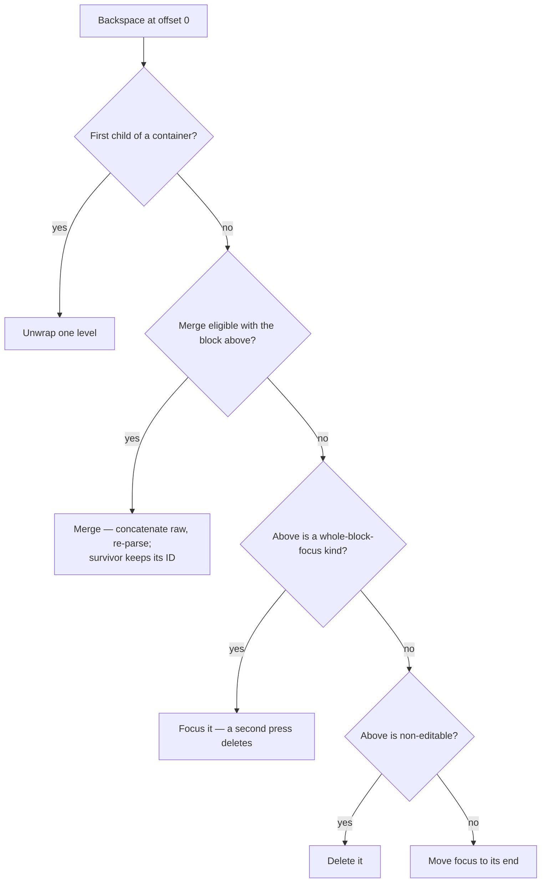

# Editor — Design Spec

The orientation point for the whole system. Read this first; read a subsystem's spec when your task touches it.

## 1. What this is

aragonite is a block editor for GFM Markdown. You give it Markdown text; it gives you a document of styled, editable blocks. Markdown syntax stays visible — `##` and `**` are still there, just dimmed — and what you get back is the same bytes you put in.

**One idea makes the rest make sense: the raw Markdown is the truth.** Not a rich-text model that Markdown is exported from. The editor parses your source into a tree whose nodes each hold their own slice of the original text verbatim, renders those slices as styled DOM, and saves by gluing the slices back together. Nothing is ever rewritten into a canonical form on the way through.

That gives the load-bearing guarantee:

```
serialize(parse(source)) === source     for all valid GFM
```

And it gives the rule every layer of this codebase obeys:

> **Slice bytes from `raw`. Never reconstruct them from parsed structure.**

The block layer follows it (a container's `raw` holds its own outer syntax; serializing is concatenation, not reassembly). The inline layer follows it (a `**` marker in the DOM is `raw.slice(...)`, never a `**` you printed because the node said "strong"). Every round-trip bug this project has had was some code path deciding it could rebuild bytes it should have copied.

**Design principles, in one line each:**

- The CST is the single source of truth for structure. If CST and DOM disagree, CST wins.
- Each block is an independent editing unit with its own rendering surface.
- Cross-block coordination flows through a minimal, typed interface — no signal bus, no runtime patching.
- Adding a block type is additive: one component, one descriptor, one registration — a genuinely new cross-cutting capability lands once, at a choke point every later kind inherits.

## 2. The shape of it

```
Raw Markdown
      │  parse
      ▼
  CST (mutable plain objects)  ── single source of truth
      │  render
      ▼
  Contenteditable DOM (styled inline spans, dimmed markers)
      │  serialize
      ▼
  Raw Markdown
```

The component tree mirrors the tree of blocks:

```
Editor  (shell — owns the CST, the undo stack, the editor-actions contexts)
  └─ BlockList  (keyed loop over a node's children; windows itself when large)
       └─ BlockHost  (resolves a component by node.kind; hosts the overlays)
            ├─ TextEditableBlock  (paragraph, heading, setext, raw-editable fallback)
            ├─ CodeBlock  (fenced code — contenteditable + highlighting)
            ├─ ThematicBreakBlock  (non-editable, focusable)
            ├─ BlockquoteBlock / ListBlock → ListItemBlock  (containers — nested BlockList)
            ├─ TableBlock  (container — per-cell editable grid)
            └─ plugin blocks  (containers, editable leaves, opaque blocks)
```

- **Editor** — top-level shell. Owns the `Document`, the undo stack, and the action contexts. Manages focus after structural operations with `await tick()`.
- **BlockList** — the one rendering primitive, reused at every nesting level. A small scope renders every child; a large one renders a windowed slice plus spacers (`virtual-rendering.md`).
- **BlockHost** — dispatches on `node.kind` to a registered component. Also mounts the two per-block overlays (selection and search-match), the drag handle, and a `<svelte:boundary>` that degrades a throwing block to a readable fallback instead of taking the document down. A kind with no registered component renders as a raw-editable text surface — visible and editable, never blank.

**Vocabulary you need before anything else makes sense:**

| Term             | Meaning                                                                                                         |
| ---------------- | --------------------------------------------------------------------------------------------------------------- |
| `raw`            | A node's verbatim source bytes, markers included. The serialization truth.                                      |
| Leaf / container | A container holds child nodes (blockquote, list, listItem, table, tableRow, plugin containers). A leaf doesn't. |
| Kind             | The string discriminator on a node (`'paragraph'`, `'table'`, a plugin's own). Drives every registry lookup.    |
| Descriptor       | Per-kind metadata (merge role, editability, container contract, keymap…). The schema layer.                     |
| Scope            | One `BlockList` and its children — the unit of addressing, windowing, and commits.                              |
| Path             | Child indices from the document root to a node. How everything off the render path addresses a block.           |

## 3. Data flow

```
Block detects a boundary event (Enter, Backspace at 0, arrow at an edge)
  → calls a typed editor-actions context function
  → the Editor shell mutates the CST
  → Svelte reactivity re-renders the affected blocks
  → the Editor calls focus() on the target block after await tick()
```

Four channels, and only four:

| Direction      | Mechanism                                      | What flows                                        |
| -------------- | ---------------------------------------------- | ------------------------------------------------- |
| Block → Editor | Context callbacks (editor-actions sub-bundles) | Boundary events: split, merge, delete, move focus |
| Editor → CST   | Direct tree mutation                           | Structural change                                 |
| CST → Blocks   | Svelte reactivity                              | Blocks re-render from the new tree                |
| Editor → Block | Component refs (`bind:this`)                   | `focus(offset)` after a structural op             |

## 4. The editing surface

### Rendering mode: always-visible styled source

Markdown syntax is visible at all times, but styled. Markers (`##`, `**`, ` ``` `) are dimmed; content is styled by meaning (headings large, code monospace, emphasis italic). One rendering path per block type.

This is the permanent architecture, not a stepping stone. The alternative — an authoritative inline tree with `raw` derived from it, and markers hidden on unfocus — was evaluated and rejected (`syntax-tree.md`, appendix).

The **presentation modes** (`presentationMode` prop: reading, block-granular and inline-granular preview) layer on top as view treatments over that same single render path — marker visibility flips via CSS keyed on focus and caret proximity, never a second render path and never a derived-`raw` tree, so cursor offsets and the round-trip are untouched by construction. Styled source remains the default and the editing substrate; the contract every plugin tier uses to read the mode is in `plugin-contract.md`.

### Three block surfaces

A block chooses its own editing surface. Three exist:

- **`TextEditableBlock`** — the built-in contenteditable prose surface. Paragraphs, headings, setext headings, and the raw-editable fallback for every kind without a dedicated component. Parameterized by CSS class.
- **`createEditableLeaf`** — the plugin-facing text-leaf factory, with the same native caret / IME / undo / clipboard / cross-block-selection parity. Two modes: `plain` (always editable, commits per keystroke) and `render-primary` (a rendered view that reveals its source on entry and commits once on blur).
- **`createContainerBlock`** — the plugin-facing container factory. Wires a nested `BlockList` with its own scoped contexts, exactly as `BlockquoteBlock` does.

Beyond those, a block may render anything — a grid of cells (`TableBlock`), a static focusable element (`ThematicBreakBlock`), an opaque diagram. A block only has to conform to the block interface. Not all blocks need contenteditable.

Images are not a block kind. They render inline, as atomic widgets inside prose blocks (§ 6).

### The block interface

Every block component exposes a common shape. Four members are required: `focus(offset)`, `getCursorOffset()`, and the two flags `editable` (can receive text input) and `focusable` (can receive focus at all). The orchestration layer checks the flags before it calls anything.

Everything else is optional, and a block implements what its surface can honestly answer — selection reads (`getSelectedText`, `setSelection`), pixel-column landing (`focusAtColumn`), selection-rect measurement (`measurePartialRects`), path descent for nested surfaces, command dispatch (`runCommand`). `block-component.ts` is authoritative; each member's docstring states its contract.

Caret placement is two verbs, not one. `focus` places a caret and ends any live cross-block range — the safe default, because a caret that lands inside a range left live is content the next keystroke type-replaces. The optional `parkCaret` is the same landing WITHOUT the range-ending, for the selection-extend paths only: the cross-block dispatcher parks a caret in an endpoint it has just revealed while the extend is still growing the range. G2.12 guards which callers may reach the second verb.

The caret surface as a whole reads as three layers, not a pile of verbs. **Landing doors** seat a caret, one per addressing mode: `focus` and `parkCaret` (raw offset), `focusAtColumn` (editor-relative pixel X on the first or last visual line, with park semantics), and `focusByPath` (descent to a nested leaf). Every implementation mints the same `placeCaret` core (`selection/caret-doors.ts`), so range-ending policy lives at one seam. **Point resolution** turns a viewport point into a landing before any door is called: the `caretTargetAtPoint` descriptor hook answers for coordinate-addressed kinds (a table names a cell), with the drag hit test as its decline-happy sibling. **Boundary policy** runs where a landing meets an atomic widget: `enterEdgeWidget` for a keyboard arrival at a block edge, `snapCaretToPoint` for a click's post-landing refinement, both dispatching the kind's one registered `InlineWidgetEditingPolicy`. A new gesture composes these layers; it does not add a verb.

A block publishes that shape in one of two ways, and BlockHost resolves both at the single point it stores a ref. A leaf publishes the members as its own instance exports. A container publishes the whole surface under one export, `containerApi`, because Svelte 5 instance exports are individual top-level declarations with no spread, and forwarding a dozen members by hand made every member a place to drop one. The component registry types the two shapes as a union, so a block publishing neither does not compile.

## 5. Schema — the per-kind metadata layer

Cross-cutting block-kind metadata lives in `src/lib/schema/`. Both `core/inline/` and `tree-operations/` read from it; the schema depends on neither, because otherwise the layer DAG cycles. It is not the only thing those two share (`core/` and `perf/` are in that intersection too), but it is the one carrying kind vocabulary, which is why a cross-cutting block-kind fact belongs here.

`core/` and `schema/` are mutually dependent by design: schema reads core's node and line vocabulary, core reads schema's opener and descriptor registries. The cycle is at directory granularity only; no module cycle exists.

- **Block-kind descriptor** — one registration per kind, holding: merge role, editable flag, inline support, whole-block focus policy (`blockFocus`), context-dependent kind (no standalone recognizer — a content edit keeps the kind rather than re-deriving it), declarative keybindings (`keymap`), the content-range hook, the two point→internals hooks a coordinate-addressed kind declares separately (the exact drag hit test, and the nearest caret target a caret-placing gesture asks for), and — for containers, registered as one indivisible group — the container contract, the raw rebuild, the reserved-chrome declaration, the paste-merge declaration (`containerPaste`), and the unwrap strategies (`unwrapRole`). Grouping the container-only fields makes an illegal leaf/container mix a compile error rather than a runtime surprise: contract and rebuild are required together, and `isContainer` is derived, never declared.
- **Command registry + keybindings** — a kind's `keymap` maps a normalized chord (`Mod` = Ctrl/Cmd) to a command id. Global commands (undo/redo) are free functions; block-local commands run on the focused component's `runCommand`. A focused leaf resolves its kind's keymap, then the global table; container bubble handlers resolve kind-only, so they never double-fire a leaf's global command. `runCommand` reads the caret live, so cross-block dispatch operates at the collapsed position. Keystroke→operation mapping is declarative — there is no per-component `onKeyDown` branching to keep in sync.
- **Block-opener registry** — kinds the block parser dispatches declare `{priority, tryOpen, interruptsParagraph}`. Both the parser's dispatch order and its paragraph-interrupt scan derive from these declarations. Built-in opener implementations live in `core/parsers/`; the published priority ladder is `OPENER_PRIORITIES`.
- **Component registry** — the runtime kind → component map `BlockHost` looks up. Built-in registrations live in `components/built-in-blocks.ts` (top-of-DAG wire-up, imported once at editor mount).
- **Merge rules** — eligibility predicates for Backspace-merge, plus the walker that finds the deepest mergeable leaf.
- **Container raw rebuild** — per-kind rebuild plus ancestry dispatch, so an edit deep in a nesting chain re-emits every enclosing container's `raw`.

Registries are code, not state: register-once, throw on duplicate, no unregister (the `customElements` model) — in production and under test; under a dev server a duplicate registration replaces with a note instead (`schema/register-once.ts`), so a re-evaluated registrar survives rather than 500-ing every route.

## 6. CST ↔ DOM synchronization

The CST is the document-level truth. **Inside one block, during active editing, the DOM leads and the CST follows.** That's the whole trick that keeps typing fast: we don't fight the browser for ordinary keystrokes, we read the result back.

### Reading the DOM back

On `input`, the block reads its own DOM content back as raw text and writes it to `node.raw`. It re-parses to refresh metadata and inline content, and if the kind changed, re-renders with the new component.

What it does **not** do is reconstruct that text from parsed structure — the same discipline as § 1, one level down. Each surface supplies its own reader. Code blocks and plain editable leaves can read `textContent` directly, because for them `textContent` _is_ `raw`. Prose blocks cannot, and read through a raw-aware DOM walk instead: atomic widgets contribute **zero** characters to `textContent` (their bytes live on `data-source-*` attributes), and a container's ambient marker contributes characters that are **not** in the child's `raw` at all. A `textContent` read in a prose block would silently drop every widget's source and swallow the marker.

When the edited text re-parses to **multiple** blocks — a hard-break line followed by an interrupter, an early fence close — the block structurally replaces itself with all of them: the first keeps the slot's identity, the rest splice in as following siblings, and the caret follows the edit position into whichever block it lands in. This is the choke point that keeps the live CST from cramming multi-block text into one node's `raw`.

The common case (no kind change) needs no DOM patching at all — the browser's update and the CST agree. Prose blocks rebuild their styled span tree from `raw` on every input; cursor offsets map to `raw` positions unchanged.

### Intercepted operations

These the editor owns, not the browser:

| Operation          | Trigger                           | Behavior                                                             |
| ------------------ | --------------------------------- | -------------------------------------------------------------------- |
| Enter              | `keydown` → `preventDefault`      | Split the CST node at the cursor offset                              |
| Backspace at start | `keydown` → `preventDefault`      | Merge, unwrap, delete, or focus — see § 8                            |
| Paste              | `paste` → `preventDefault`        | Read `text/plain`, dispatch through the paste pipeline               |
| Copy / Cut         | `copy` / `cut` → `preventDefault` | Slice the selected range out of the CST's `raw`; cut then deletes it |
| Undo / Redo        | `keydown` → `preventDefault`      | Pop/push the editor's own undo stack (browser undo is off)           |

### IME composition

Between `compositionstart` and `compositionend` the editor does not sync or reconcile — the browser owns the input for the whole sequence. `compositionend` funnels into the same input path as a keystroke, and reads the DOM back the same way.

### Key invariant

The CST is always up to date (it is written on every input event). The DOM is patched only when the CST's structural interpretation diverges from what is currently rendered. This avoids fighting the browser for normal typing while guaranteeing correctness at structural boundaries.

### Atomic inline widgets

Some inline nodes render as opaque widgets — `contenteditable="false"` islands with no caret-able interior: images, `<br>`, inline math, inline directives, decoded HTML entities. The inline-widget registry (`core/inline/inline-widgets.ts`) is the single source of truth for which inline kinds are live widgets.

A widget carries its raw bytes on `data-source-start` / `data-source-end` attributes on its root, **not** in `textContent`. The cursor is addressable only at its leading and trailing edges. Because the widget contributes 0 characters to `textContent`, a prose block's `textContent !== raw` — which is exactly why the input path walks rather than reads (above).

**`cursor/widget-offset.ts` is the single translation point between DOM Range positions and raw offsets.** It walks the block in document order, summing text-node lengths and widget raw lengths. Everything that needs the translation — the ambient-marker helpers, sticky-column measurement, the native selection bridge, the block's own `setSelection` / `measurePartialRects` — routes through it. Offset arithmetic done anywhere else will eventually disagree with it (`contributing/culture.md`).

Two cross-block focus behaviors compose on top:

- **Vertical skip.** A block whose only inline content is widgets reports `isVerticallyTransparent()`. ArrowUp/Down passes straight through it. Containers recurse — a list item holding one image-only paragraph is itself transparent.
- **Edge entry.** When a cross-block ArrowLeft/Right lands at the far edge of a paragraph that ends (or starts) with a widget, the dispatcher enters the widget rather than parking a caret at a boundary with nothing to show for it.

**Caret entry opens the reveal.** For a reveal-capable widget kind (inline math, inline directive), horizontal caret entry against either edge — ArrowLeft/Backspace from the right, ArrowRight/Delete from the left, within-block or as a cross-block landing — opens the source reveal with the caret at the entered edge of the raw source. The caret then walks through the raw bytes, and the escape machinery folds the reveal when it leaves. The widget-selected state is unreachable for these kinds, so the caret never parks somewhere with no visual representation, and a Backspace next to the widget degrades it one visible delimiter byte at a time instead of silently deleting the whole thing. Non-reveal kinds split by editing policy: images keep select-then-step / select-then-delete on the same keys, while a decoded entity is atomic and step-over — a plain arrow walks the caret across the glyph like a character, and a caret-adjacent Backspace removes the whole reference in one press. Shift+Arrow never reveals.

**Source-reveal editing.** A revealed widget swaps its rendered island for its editable raw bytes. The gesture is editor-owned end to end: pointerdown on the widget suppresses the browser's default caret placement, so the reveal's own caret landing has no racing writer. While revealed, the edit is ephemeral DOM — one undo entry on commit. The reveal folds back when the caret or selection escapes the source: an in-block escape folds in place, blur owns the focus-leaving fold, and a cross-block sweep keeps the source revealed so selection rects measure real text. Escape containment is decided by raw offset through the shared walk, and an escape must survive a `tick()` re-check before folding — so a transient selection state the editor's own machinery manufactures (cross-block entry clearing the native selection) never folds a reveal the user still wants open. Clicking widget B while A is revealed folds A and reveals B as one sequenced gesture. A mutation of the block folds too, before it touches a byte: a clipboard splice and every arm of the block's command dispatch run against `node.raw`, which the ephemeral edit has not reached. That is what keeps Enter meaning "split" inside a revealed source — the command seam folds, then splits at the caret — rather than the reveal claiming the key and costing the user the press. The reveal claims exactly one key of its own, Escape — with one carve-out a table cell carries at its own keydown: a cell's Enter is a row hop rather than a split, and hopping would move the ephemeral edit out of the surface that owns it, so there a revealed source commits and the caret stays put.

To add a widget kind, register it in the inline-widget registry so recognition is single-sourced. The rendering itself has two paths — a Svelte component (recommended; the render layer builds the island and keeps the instance alive across per-keystroke rebuilds) or hand-built DOM. `inline-parsing.md` § Widget render paths has the details. Either way the generic machinery keys off `[data-inline-widget]` alone: no per-widget plumbing in the cursor walker, the selection painter, or the raw reader.

## 7. CST mutability and reactive state

The CST is mutable plain objects — no class hierarchy. The parser produces mutable nodes; the editor mutates them in place; `serialize()` reads `raw` only, and is structurally typed over readonly fields, so it works on any object of the right shape — including the bytes-readonly node views (`core/node-views.ts`) that readers outside the mutation layers hold, whose only sanctioned view→mutable doors are the unshare/clone seam and the commit ceremony's owned scope views.

- `parse(source)` yields a mutable `Document`. The editor works with those nodes directly — no wrapping, no cloning on load.
- Re-parse runs `parse()` on the block's `raw` and transfers the result into the existing tree through a single funnel: a same-kind edit writes the block's fields in place, so routine typing keeps the node object (its component and IME state ride along); a kind change or a multi-block result mints fresh nodes and splices them into the slot, the ID carried across at the index (§ 8). The transfer no longer rewrites `kind` in place, and readers can't either — the bytes-readonly `NodeView` makes a `kind` write a compile error (`syntax-tree.md`). On a mutable node the union still permits the write, so the mutation layer holds the line by routing every re-parse through this one funnel.
- Undo snapshots **share** the live tree's nodes; a mutation copies the shared spine before writing (§ 11).

### Metadata-driven raw

Some container metadata feeds the container's `rebuildRaw` — a list item's `taskMarker` is emitted back into its serialized text. **A write to such a field must trigger the rebuild in the same commit, or `raw` drifts from metadata.** The `updateBlockMetadata` primitive runs the rebuild after its shallow-merge, so a new metadata-driven-raw field inherits the guarantee by routing through the same primitive rather than by remembering a rule.

### Reactive state plumbing (Svelte 5)

Three invariants govern how CST state crosses into Svelte's reactivity. Each exists to prevent silent corruption, and none is discoverable from the types (`contributing/culture.md`).

- **Reactive state crosses module boundaries as getters, never values.** Re-init effects and bootstrap helpers read mutable state through `() => state` closures or getter properties. A plain value-read would snapshot at effect-run time _and_ register the state as a dependency of the effect — re-firing it on every later mutation and wiping unrelated work. The `source !== lastSource` guard in `Editor.svelte` exists for the same reason.
- **The document is not its own memo key; the content version is.** The `$state` document is mutated in place, so its object identity survives every edit. Anything derived from the whole tree (footnote numbering, a table of contents) must key on the editor's **content version**, a lazy derived on the document facet that changes whenever a byte-carrying field moves and is stable otherwise. Lazy is load-bearing: a document nothing memoizes against never computes it. It is not the decoration engine's `editEpoch`, which moves at edit-event cadence and so lags a typing batch; the version moves at render cadence.
- **The render path computes inline content locally and reads no cache.** There is no `inlineContent` node field. Prose blocks compute the inline tree from `node.raw` on each render, so a render effect's reactive read set is `node.raw` plus its closure inputs — nothing more. Non-render consumers (event handlers, exported methods, click-snap) read inline content through an accessor backed by an external, non-reactive WeakMap that Svelte's ownership tracking never observes. The original incident was a render effect that both read and wrote a reactive cache field: write-during-read closed the loop, and Svelte's ownership tracking corrupted keyed `{#each}` index assignments after `splitBlock`. With no reactive cache field to read or write, that class cannot recur.

## 8. Orchestration

### Upward: block → editor

Blocks call typed context functions for structural operations — split, merge, delete, move focus, update content, undo, redo — each taking a block index relative to the **local** children array. No signal dispatcher, no string matching, no performer registry.

The block–editor interface rides three named facets — editor services, host policies, and document identity — plus the per-key survivors whose individual granularity is the mechanism. A container overrides only the action sub-bundles whose behavior it changes (block editing, focus, container editing), one bundle at a time; history stays its own key that only the editor root provides, so undo/redo resolve to one stack (G1.4). Everything else resolves by walking up the context tree to the nearest ancestor that provides it — pass-through delegation boilerplate does not exist. The cross-scope commit primitive and the paste commit coordinator (§ 10) ride the services facet.

### Downward: editor → block

The editor reaches down only for focus, via component refs. After a structural mutation and `await tick()`, it calls `focus(offset)` on the target block — the range-ending verb, so a landing after a cross-block op cannot leave the old range painted.

### Structural operations

All structural operations are CST mutations performed by the editor shell. Blocks never modify the tree.

**Split** — cut `raw` at the cursor offset, produce two nodes, re-parse each to determine its kind. The original keeps its ID; the new block gets a fresh one. Offsets are raw offsets, markers included — the block component translates DOM position to raw offset. The marker is not duplicated; the second half re-parses as its natural kind. A structural suffix — raw past the content range, today only a setext underline — stays with the first half, so the split can't strand it below into a demoting reparse.

**Merge** — concatenate two adjacent nodes' `raw`, replace both with one, re-parse to determine the merged kind. The survivor keeps its ID.

**Delete** — remove the node from its children array.

**Reorder** — move a node among its siblings; IDs don't change. Two gestures, one operation: keyboard (Alt+↑/↓ on the focused block, with a screen-reader announcement) and a mouse drag from the block's hover handle (an insertion line marks the drop, one commit on release, autoscroll for off-screen targets). The hover handle is consumer-toggleable (`blockDragHandles`); keyboard reorder is always available.

**Kind change** — when a re-parse of a block's updated `raw` yields a different kind, the node is replaced with one of the correct kind and keeps its ID. When the re-parse yields several blocks, the first keeps the slot's ID and leading trivia and the rest splice in with fresh IDs, exactly as a split does. The same rule runs a level up for **containers**: an edit inside one changes what the container's own rebuilt `raw` parses to (typing the rest of a `> [!TIP]` marker), so the ancestry rebuild re-derives the container's kind and swaps the slot the same way (§ 9).

### Merge eligibility: roles, not pairs

Eligibility derives from a per-kind **merge role**, so adding a kind doesn't mean editing an enumerated pair set:

| Role             | Meaning                                                 | Kinds                                                                                                   |
| ---------------- | ------------------------------------------------------- | ------------------------------------------------------------------------------------------------------- |
| `prose`          | Leaf text block                                         | paragraph                                                                                               |
| `prose-absorber` | Prose leaf that keeps its own kind when absorbing prose | heading, setextHeading                                                                                  |
| `container`      | Merge target is its deepest reachable prose leaf        | blockquote, list, listItem                                                                              |
| `self-merge`     | Merges only with another block of the same role         | unrecognized                                                                                            |
| `not-mergeable`  | Backspace deletes (if non-editable) or moves focus      | fencedCode, indentedCode, htmlBlock, linkReferenceDefinition, table, tableRow, tableCell, thematicBreak |

A whole-block-focus kind takes precedence over the `not-mergeable` row: `thematicBreak` is focused first and deleted only on the second press (below).

`prose + prose`, `prose-absorber + prose`, `container + prose`, and `self-merge + self-merge` are eligible; every other pairing is not. A `container + prose` merge walks into the container's subtree for the deepest prose leaf — the generalization of "merge into the deepest visible text above" across container boundaries. When that walk finds no prose leaf (the container's deepest leaf is not-mergeable, or the container is empty), the caller falls back to the ineligible behavior: move focus to the end of the deepest reachable block.

### Backspace at the start of a block



Two refinements the diagram elides. A container that declares no unwrap strategy doesn't unwrap — it **delegates upward**, and the same decision re-runs one level out with the container itself as the block (this is how a list item's children reach the list). And a container may override the _middle_-child branch too: a list routes its non-first items through the same cascade as its first, which is where M1 below comes from.

A **whole-block-focus** kind (`blockFocus: 'whole-block'`) is an opaque, childless block that is its own focus target: the built-in thematic break and the bundled mermaid diagram are the two shipped examples. Arrows land on it with a whole-block highlight, Enter inserts a paragraph below, Backspace/Delete while focused deletes it, Mod+C/Mod+X copy or cut its Markdown, Alt+Arrow reorders it, and a caret-adjacent Backspace **focuses** it rather than deleting it outright — the highlight is press one of two. Delete at the end of the block above is the forward twin. The container factory wires all of this from the one declaration, which is why mermaid is the reference a plugin author copies; the thematic break is a plain component that reaches the same tail directly. Such kinds are childless by design, so the editable-container backfill skips them: a phantom child would permanently violate their opaque `raw`↔children faithfulness (§ 9).

### Container unwrap

Backspace at offset 0 of a container's **first** child unwraps one structural level. Each press does exactly one thing — there is no auto-merge with the block above the container. Dispatch is declaration-driven: each container's `unwrapRole` selects its first-child and middle-child strategies, and an undeclared container delegates upward.

The four cases, named for the e2e requirements that pin them (`src/lib/e2e/requirements/blocks/`):

- **U2 — blockquote.** The first child is lifted out into the parent at the blockquote's position. An emptied blockquote is deleted.
- **U1 — list, non-empty first item.** The item's first paragraph becomes a plain paragraph before the list. Matching-type nested sub-list items promote to the shrunk parent level; mismatched-type sub-lists become separate blocks. An emptied list is deleted.
- **M1 — list, non-empty non-first item.** The item merges into the deepest visible text above it; its remaining children are placed by preserve-absolute-indent. Ordered markers renumber.
- **Nested first item** (any list with a parent list). The item is promoted to the parent list level — the Shift+Tab equivalent.

### Focus traversal

Arrow navigation at block boundaries uses geometry, not offsets: the cursor rect is compared against the rect of the block's first/last visual line.

- **ArrowUp** on the top visual line, or **ArrowLeft** at offset 0 → previous block.
- **ArrowDown** on the bottom visual line, or **ArrowRight** at end of content → next block.
- `moveFocus` skips non-focusable blocks. `focus(offset)` on a non-editable block ignores the offset.
- Into a container from outside: focus lands on the first (or last, by direction) editable child. Out of a container: the inner `BlockList` signals up to the container, which signals up to the parent list.

#### Sticky column

Cross-block caret column memory. Within a block, the browser's native sticky column handles vertical movement; we layer on top only at block boundaries, where the native one resets.

- **Capture** — a vertical arrow press captures the cursor's _editor-relative_ pixel X (scroll-invariant). Idempotent: the first press after a reset captures, later ones don't.
- **Reset** — any other user action: typing, click, horizontal arrows, structural ops, undo/redo, editor blur, tab hidden.
- **Transparent blocks** (thematic break) pass through without capturing or resetting; the next cross-block move continues with the existing value.
- **Participating blocks** (text, code) capture on vertical arrows and implement `focusAtColumn(x, from)`. Prose and code differ only in rendered content — same helpers, same policy.

**Capture and consumption are split.** The source block captures; a separate focus dispatcher reads the value at cross-block transitions and either calls `focusAtColumn` or falls back to start/end focus. Participating surfaces implement `focusAtColumn` as a pure receiver; null-handling lives in the dispatcher. The `cursor/sticky-column.ts` header carries the authoritative two-axis contract.

Sticky X is a **visual** lock, not a logical one. When a destination block scrolls internally (a wide table, a long-line code block), the visible column at a given X depends on that block's current `scrollLeft` — so re-entering a scrolled table lands the caret in the visible column nearest the captured X. By design.

## 9. Containers

Containers hold nested children: blockquote, list, listItem, table, tableRow, and plugin- or directive-authored containers. A document like

```markdown
> Hello
>
> World

Some text
```

produces two top-level children — a blockquote (holding two paragraphs) and a paragraph. The inner paragraphs are not addressable by a flat document-level index. Hence: **paths, not indices**, everywhere off the render path.

### Recursive composition

A container component hosts its own nested `BlockList`, reusing the same orchestration machinery. `BlockquoteBlock` renders a `BlockList` for its children; `ListBlock` renders `ListItemBlock`s, each of which renders its own `BlockList`. Each nested list provides its own scoped action contexts, handles local operations directly, and delegates boundary-crossing operations upward.

This is what makes "adding a block type is additive" true for containers too. A `BlockquoteBlock` is just another block component that happens to contain a `BlockList`. `createContainerBlock` packages that same wiring for plugins, so a plugin container is as thin as the built-in one.

### The container `raw` contract

A container's `raw` holds the **full outer source** — `> ` prefixes, list markers, indentation, the `:::name` opener line. Its children hold slices of the _inner_ content. **The two are redundant, not additive** — which is why the serializer never recurses (§ 12).

Three contracts exist, declared per kind (`containerContract`); `syntax-tree.md` § The container contract is authoritative:

| Contract   | `raw` ↔ children                                                                                    | Kinds                                 |
| ---------- | --------------------------------------------------------------------------------------------------- | ------------------------------------- |
| `'strip'`  | Stripping the container syntax from `raw` yields the children                                       | blockquote, list, listItem            |
| `'grid'`   | Cells parse straight from `raw`; children are coordinate-addressed                                  | table, tableRow                       |
| `'opaque'` | `raw` is authoritative and is not a strip-decomposition — chrome lives in the container's own bytes | directive containers, plugin callouts |

A container's `rebuildRaw` re-emits its `raw` from its children and metadata after any edit inside it, and ancestry dispatch runs it up the whole nesting chain.

Each rebuilt container then **re-derives its own kind** from the raw it just produced — the container half of § 8's kind change, and the one place that notices a container's opener line was rewritten from the inside. Three rules bound it:

- **Eligibility is the opener registry.** Registering an opener is the claim that `parse(raw)` reproduces the kind, so kinds without one are excluded by construction rather than by name: `listItem` (whose `- x` parses to a _list_), `tableRow`, reserved chrome, `tableCell`, and `table` itself, which emerges from the paragraph continuation scan rather than an opener.
- **The re-parse resolves through the instance grammar**, so a kind an instance disabled stays unreachable. The grammar is a required-nullable parameter of the rebuild, threaded from every caller — routine typing, the commit ceremony, the metadata seam, paste, cross-block type-replace, and the range-delete family — and a source-scan lint refuses a call that answers `undefined` instead of threading.
- **Cost is gated twice.** An opener claims from line 1, so a body-line edit skips on a string compare. An edit that DOES rewrite line 1 skips only when the rewritten line, read alone, still opens as the kind the node already is — asked of the registry itself, one line at a time. Typing into a list's first item leaves `- one` opening as a list, so the re-parse never runs; without that second gate it is linear in container bytes on a gesture that is not (`performance.md`). The check is a positive identification rather than a before/after comparison: a kind whose opener declines a one-line probe (a directive container wants its closer) would compare equal on every edit and elide a real kind change, so an unrecognizable line falls through to the full parse instead.

### Addressing

Context functions take a `blockIndex` relative to the **local** children array. A paragraph inside a blockquote calling `splitBlock(1, offset)` operates on index 1 of the blockquote's children, not the document's.

### Ambient markers

A container may contribute a read-only prefix to its first prose child's rendered content — today the list item's `- ` / `1. ` marker. (The blockquote contributes none: its `> ` markers are border-only chrome.) This is the `ambientPrefix` prop, and it establishes the contract `textContent(block) === ambientPrefix + raw`.

The prop is a union: a plain string for inert markers, or an object carrying `text` plus interactive ranges — each a character span with a class, optional ARIA, and a click handler. Interactive ranges let a marker embed a clickable element (today: task checkboxes) without fragmenting the text contract; the offset translation still sees one contiguous string. One render helper consumes both shapes, so consumers never branch on the variant, and future container widgets (callout badges, collapse toggles, plugin markers) extend the same contract without widening it again.

`ambient/` holds the marker DOM and the cursor wrapper that accounts for the prefix; both route through `cursor/widget-offset.ts` for the raw-aware walk. See `inline-parsing.md` for the `textContent` invariant.

### Reserved chrome

A container may declare its child 0 as a **reserved chrome leaf** — a title or summary whose bytes live in the container's own opener line (a callout title, a `<details>` summary). The machinery then enforces the contract: the slot is always present, single-line (unsplittable; a paste there flattens inline), cleared rather than deleted by destructive ranges, and kind-stable through every edit. The declaration may also carry a pure collapse probe, from which collapse-awareness follows everywhere for free — merge walks, focus walks, Enter-descend, reveal, the container's window clamp, and the height oracle's estimate.

### Container-specific operations

- **Split inside a container** splits the inner child. The container's `raw` is rebuilt from its children.
- **Deleting all children** removes the container from its parent.
- **Enter in a list item** creates a sibling item; at the end it inserts below, in the middle it splits. Enter in an _empty_ item exits the list — matching-type nested sub-lists promote into the surviving list, mismatched-type nested lists and non-list trailing children lift out as top-level siblings rather than being dropped, and ordered markers renumber across the gap.

### Identity and selection inside containers

Block IDs are held per `BlockList` — each nesting level has its own array. Cross-block selection within a container uses the same selection model scoped to that container's list. Selecting _across_ a container boundary needs the cross-block selection system (§ 10).

## 10. Selection, search, clipboard

### Single-block selection

Native browser selection inside the block's contenteditable. The caret is the browser's, `::selection` paints natively, and only copy/cut are intercepted.

### Cross-block selection

Two endpoints — anchor and focus — each a `path` (child indices from the document root) plus an offset in that block: a character offset into its `raw`, or a row-major cell index for an intra-table endpoint (`SelectionPoint` is a discriminated union, `selection/primitives.ts`). Same path on both = single-block, and the browser handles it. Different paths = the editor manages all selection rendering, and only then are the native caret and native `::selection` suppressed (via `[data-cross-block]` on the editor root) so they don't double up with the overlay.

The state is lazy: its fields are null in single-block mode and become non-null only when the selection crosses a boundary. A normalized `start`/`end` pair in document order is derived from anchor/focus.

**Entering it:** a pointer drag that crosses out of the starting block (rAF-throttled, autoscrolling at viewport edges); Shift+Arrow past a block edge; Ctrl+Shift+Home/End to a document boundary; Shift+click into another block; a second Ctrl+A (the first selects within the focused block, natively).

**Rendering it:** every `BlockHost` mounts a `SelectionOverlay`, which classifies its own block as start / end / middle / outside and paints accordingly. Endpoint blocks measure partial rects; middle and non-text blocks get a full-block overlay. When a block scrolls internally (a wide table, a long-line code block), the overlay attaches a passive scroll listener and re-measures, so highlights track the content underneath. `cursor/scroll-ancestors.ts` is the single source of truth for what scrolls.

**Exiting it:** a click or an unshifted arrow collapses back to native single-block selection. Typing, Backspace, Delete, Cut, and Paste all delete the selected range first, then perform their normal action at the collapsed cursor — and IME composition follows the same delete-then-compose path.

**Restoring it:** one road serves both the undo swap and the consumer's `setSelection` — resolve and clamp both endpoints, reveal what the caret will park at, then write the state and place the caret. Both writes happen inside one change-notification batch, because what a subscriber sees is the editor it reads back: a notification landing between the state write and the caret landing reports a selection the restore is about to move.

**Across containers**, "start wins": the start endpoint's container context determines merge/cleanup behavior after a destructive operation.

#### `measurePartialRects` — offset semantics by surface

The hook's `(startOffset, endOffset)` shape is stable, but what an offset _means_ depends on the surface. A new endpoint-capable kind picks one:

- **Text contenteditable** (paragraph, heading, code). Offset is a character index into `textContent`. A shared helper walks the DOM for wrapping-aware rects; every contenteditable block reuses it with no per-block work. `SELECTION_END` clamps to the end of `textContent`.
- **Cell-based** (tables, any 2D grid). Offset is a cell index in row-major order; the call returns one rect per cell in `[start, end)`. The surface is responsible for mapping click/drag positions to cell indices on entry. `SELECTION_END` means "through the last cell".
- **Opaque single-unit** (thematic break, an embedded diagram, a future embed). Only offsets 0 and 1 are valid — before and after the unit. Any non-empty range returns the surface's bounding rect as a single element. A kind that needs finer granularity is the wrong kind.

A block that doesn't implement the hook falls back to the full-block overlay. That's fine for a middle block; for an endpoint it loses the "selection ends mid-line" visual.

### Search

Find/replace is a **read-only lens over the CST** — it renders nothing itself and mutates nothing until you ask it to.

- **Scan** (`search/`) walks the document by path, matching each _editable leaf's_ `raw`. Containers are skipped, not because they lack text but because their `raw` duplicates their children's (§ 9). Literal, whole-word, case-sensitive, and regex modes compile to one matcher interface; an invalid pattern surfaces as an error string, never a throw.
- **Paint.** Search publishes its matches as mark decorations (source `editor:search`) and the shared decoration overlay paints them — it was the engine's first client. The scan is memoized on the engine's edit epoch plus query and options, so an edit re-scans while navigation only remaps the active highlight. Decorations are bucketed by owning path once per run, so an overlay reads only its own bucket; windowing follows for free: an unmounted block simply doesn't paint.
- **Navigate.** The active match is revealed through the same reveal primitive focus uses (`virtual-rendering.md` § Reveal before act), so a match thousands of blocks away mounts, scrolls in, and highlights.
- **Replace** reparses only the affected _top-level_ subtrees and commits one `replaceBlock` per subtree — O(affected subtrees), not O(document). Replace-all lands under a single undo entry. A replacement into a table cell escapes the delimiters the cell's `raw` reserves, so it can't split the row.
- **Cost when idle: zero.** The decoration source lives only while the bar is open — opening registers it, closing disposes it — and the engine's post-commit re-run is deferred off the commit path, never a synchronous per-keystroke scan.

The bar is opt-in (`searchBar` prop) and bound to Mod+F / Mod+H. Consumers can drive the same controller headlessly through `getSearch()` on the editor instance.

### Clipboard

Clipboard content is always plain Markdown, sourced from the CST. No HTML clipboard format, no browser-default copy. Intercepted in every context.

**Copy** — single-block: slice the block's `raw` at the selection offsets. Cross-block: walk the range, collecting the anchor block's tail, the middle blocks' full raw (with leading trivia), and the focus block's head. The selection survives the copy.

**Cut** — copy, then delete: truncate the endpoints at their offsets, remove fully-selected middles, merge the remaining endpoints into one re-parsed block, clean up emptied containers. One undo entry; cross-block state collapses.

**Focused block or selected widget** — a whole-block-focus block that holds focus, or a selected inline widget, copies or cuts its own Markdown on Mod+C/Mod+X — the block's `raw`, or the widget's source slice. These route outside the keymap because a keydown carries no clipboard event.

**Paste** — always intercepted. Any active selection is deleted first, and the whole delete-then-paste collapses into one undo entry. Focus lands at the end of the pasted content.

#### The paste pipeline

Before anything is parsed, registered **paste transforms** rewrite the clipboard text in install order — a content-keyed plugin seam for pre-parse conversions (GitHub-alert blockquotes → directive syntax, for instance). The rewrite runs wherever clipboard text reaches `parse()`, including the whole-table-selection route that bypasses the dispatcher.

The text is then parsed and routed by a single dispatcher (`tree-operations/paste/dispatch.ts`), which consults gates in this order:

1. **Reserved chrome forced inline.** A paste landing on a container's chrome leaf is flattened to one line and applied inline — ahead of everything below, because a multi-block clipboard must never split a node whose bytes live in its parent's opener line.
2. **Container-matching unwrap.** When the clipboard's top block declares `containerPaste` and a same-kind ancestor passes its `matchesAncestor` predicate (list: matching ordered flag; blockquote: any), splice the items into that ancestor rather than nesting a sub-container. An empty target is replaced; a non-empty one in cross-block context absorbs the first item into the target leaf and splices the rest as siblings.
3. **Sibling absorb.** For a clipboard top declaring `siblingAbsorb` (list) whose `matchesAncestor` accepts the nearest list ancestor, when the container match declined: splice the pasted items as siblings in the enclosing list, renumber from 1, normalize markers to the parent's style. Final markers are computed _before_ the splice — a Svelte 5 reactivity requirement, not a stylistic one.
4. **Break-out.** Same gate, `matchesAncestor` rejecting (mismatched ordered flag): split the enclosing list at the target item and splice the pasted list between the halves, at the list's parent level.
5. **Surface forces inline.** A surface that declares no structural hook at all (code blocks) takes everything inline, so pasted Markdown stays verbatim.
6. **Scoped structural.** A surface may declare `onScopedStructuralPaste` and own the whole mutation at an ancestor scope — a table cell slices its table at the row and splices at the table's parent.
7. **Inline** — a single-paragraph clipboard splices into the target's `raw`.
8. **Default structural** — leading slice + pasted blocks + trailing slice.

Pasted list items are normalized to be newline-terminated before the splice; a clipboard without a trailing newline would otherwise mash adjacent items together during the ancestry raw rebuild.

The paste modules depend on a `PasteCommitCoordinator` interface satisfied by an editor-actions factory, which is what keeps `tree-operations/paste/` from importing back into `editor-actions/`.

## 11. Undo / redo

### Model

One unified undo stack; browser contenteditable undo is off. Each entry captures a CST snapshot, the block-ID array (for stable keyed rendering), and one uniform `selection` field — an anchor/focus pair in path addressing. Collapsed, single-block, and cross-block selections all use that same representation. The stack is capped.

**Snapshots share structure with the live tree.** An entry references the live nodes rather than cloning them, and each node carries an editor-level epoch mark (`ownerEpoch`) recording whether a snapshot still shares it — so pushing an entry costs O(top-level children), not O(all nodes). The cost moves to mutation time as **copy-path-on-write**: before any write, the spine from the document root to the target is copied and the copies spliced in, so a shared node is never written through. The commit ceremony owns this protocol: it unshares the written path and hands the mutation an owned view of its scope. Mutation code never writes through a node reference captured before the commit.

**Aliasing contract (bytes-scoped).** A node a snapshot still shares is read-only _on its serialized bytes_. It may move within the tree — restructuring rewrites no bytes — but any write to its bytes must copy first. The derived inline cache is exempt by construction: it lives in an external WeakMap, never on the node. This is invariant G1.9 (`invariants.md`). In DEV an integrity oracle digests each snapshot on push and re-verifies at every commit and restore, so a violating write is caught at the commit that made it, not at the undo that exposes it.

### Triggers

Before every structural operation, and before every clipboard operation. Text input is batched: consecutive keystrokes in one block group into a single entry, broken by pauses, focus changes, or structural ops.

The snapshot's selection path is read live from the focused leaf, so undo lands the caret on the exact leaf that was being typed in — including deep inside nested containers. The caller-supplied offset overrides the live (post-edit) offset on that leaf to preserve the pre-edit position. When no ref reports a cursor (headless harness, handle drags, menu-driven ops), the path falls back to the commit's declared doc-absolute restore coordinate — minted by the commit scope, so it resolves to the operated child rather than a scope-local index.

### The commit primitive

Every structural mutation routes through one internal commit helper. Three entry points name the three scopes:

- **Top-level** — the document's children array.
- **Container** — one container's children array.
- **Multi-scope** — several container states in one logical step (cross-container delete, indent/unindent). One snapshot, one edit event, one atomic reactivity publish across every touched scope.

All three delegate to the same helper, which owns the full ceremony: capture the snapshot, unshare the written path, run the mutation on plain-array copies, publish the new children atomically, emit an `edit` event, and `await tick()` before any caller-supplied post-tick callback (focus landing, cursor placement). That callback is **awaited**, so a landing that must first reveal an off-window target is expressible there rather than fire-and-forget; a landing that deliberately does not make its commit wait says so by returning nothing. Callers pick a scope; they never assemble the ceremony. **This is the canonical entry for any new structural mutation.** The op-log is not a ceremony step — it subscribes to `edit` downstream.

The top-level and container action factories share one core through a `CommitScope` adapter, so the structural-edit ladder is single-sourced and the factories differ only in scope wiring and container-only concerns. An older begin/end bracketing pair survives in exactly three roles the commit primitive doesn't cover — the debounced text-input snapshot, IME composition entry, and a reactivity nudge after direct raw mutation in cross-block dispatch. Those sit outside the primitive by design.

### Relationship to persistent history

The undo stack is session-scoped: in memory, cleared when the document closes. A future persistent version-history layer operates at a different boundary (the save write), and the two are designed not to interact — the editor produces a serialized document on save; whatever handles cross-session history does so independently.

The persistence mechanism itself (Automerge, Yjs, a custom CRDT, a linear log) is an open roadmap decision. The boundary is the commitment; the technology is not.

## 12. Serialization and the event seam

### Serialization does not recurse

`serialize()` walks the document's **top-level** children only. It concatenates the document prefix, then each child's `leadingTrivia + raw`, then the document suffix. That's the whole function — it never descends into a container.

It doesn't have to, because a container's `raw` already contains its entire subtree's source text: the container's own outer syntax _plus_ its children's bytes. Parsing a container is strip-and-recurse — strip the prefix, parse the inner content into children, keep the original un-stripped lines as `raw`. So `raw` and children are **redundant**, not additive. Editing inside a container writes the child's `raw` and then rebuilds every enclosing container's `raw` from its children on the way out (`rebuildRaw`, dispatched up the ancestry).

That redundancy is the price of the round-trip guarantee, and what it buys is a serializer small enough that there is nowhere for a bug to hide in it.

### The event seam

The editor exposes an observer surface via `getEvents()`. Four channels, and `on(name, cb)` returns a disposer. Events fire synchronously from their emission sites; handlers must not mutate the document (reentrant edits are not supported).

- **`edit`** — after every commit. The payload is a discriminated union keyed by `op`: the commit primitive emits the structural variants, the debounced keystroke flush emits `input`, the history layer emits `undo` / `redo`. **`path` is doc-absolute for every op** — including `input` (the edited leaf) and every nested container op — and resolves from the document root to the operated node, or to the one-past-end slot an append creates. Column-shaped table ops target the table and carry the column index in `detail`.
- **`selectionChange`** — the selection snapshot, or `null`. Two emitters feed it: the cross-block state's own change notification, and a bridge off the browser's `selectionchange` for caret motion inside one block. Subscribers read the editor back rather than taking a payload, so a gesture that writes state and then moves the caret must not notify between the two — the state seam takes a batch for exactly that, and the restore road spans both halves with one (see § 10).
- **`presentationModeChange`** — the effective presentation mode after a `presentationMode` prop change (never fired at mount).
- **`error`** — a failure the editor _contained_ rather than propagated, discriminated by `origin`: a `subscriber` throw (one observer's throw never starves the others, and is never silently swallowed), a `render` throw (caught by the per-`BlockHost` boundary, which degrades that block to a readable fallback while its siblings survive), a `commit` throw (the ceremony rolls the undo/redo stacks back to their pre-commit state before reporting), a `command` throw (a plugin's block-command handler — the gesture no-ops and the error is attributed to its kind, command id, and owning plugin), a `decoration` throw (a decoration source's `provide` — its prior decorations are retained rather than blanked, attributed to the source), or a `clipboard` failure (a paste that consumed the gesture and inserted nothing, or a host image-import hook that threw — the channel a host reads to release an asset it imported for `onPasteImage`). One seam for surfacing or logging every contained failure.

The debug op-log is a subscriber to `edit`, not a call from commit sites. A future persistent-history layer hooks in the same way, touching no editor internals.

One wrinkle worth knowing: a paste surfaces under more than one op kind, chosen by the paste _strategy_, not the target's depth. A default single-leaf structural paste emits `op: 'replaceBlock'` (it splices its folded replacement at the parent, at every depth); the list/container absorb-and-merge strategies emit `op: 'paste'`. A consumer counting pastes across paths must match both.

## 13. Block identity

Nodes need stable IDs for two reasons: Svelte's keyed `{#each}` (without stable keys, a split or merge destroys and recreates DOM nodes, losing cursor and composition state), and focus management (the editor must target a specific block between the mutation and the post-`tick()` focus call).

IDs are an editor-level concern, not part of round-trip serialization. They live in two places:

- **Top-level** — a parallel `string[]` on the editor shell, aligned with `doc.children`, restored with every undo entry.
- **Per-container** — `childIds` on the container node itself, lazy-initialized on first mount. Carried on the node, so undo snapshots and copy-on-write spine copies keep the IDs alongside `children` with no parallel structure to sync.

Both arrays are the `{#each}` key source for their list, and both update atomically with every children mutation: split inserts an ID after the original, merge and delete remove one, reorder moves one, and a kind change keeps the ID at that index (only the node object is swapped).

### The state registry

Cross-block paste, cross-block delete, and multi-scope commit need to look up a `BlockListState` (ID array + ref array) from a node reference. That mapping is a module-global WeakMap keyed by the container node. Each `BlockList` registers on mount; there is no deregister step, because the key _is_ the node — an entry becomes collectable as soon as the node leaves the tree.

Being module-global, the registry is shared by multiple editor instances on one page. That is safe, and precisely because entries are keyed by node: instances never share nodes. (The consumer-facing statement of the multi-instance boundary — global grammar, per-instance state — is in `guide/consumer-guide.md`.)

## 14. Block kinds

The built-in kinds and what the editor does with each. A kind with no dedicated component renders as a **raw-editable block**: its `raw` in a monospace contenteditable, fully editable, no special merge behavior.

| Kind                      | Editor behavior                                                                                                                                                                                                                                                                                                                                                     |
| ------------------------- | ------------------------------------------------------------------------------------------------------------------------------------------------------------------------------------------------------------------------------------------------------------------------------------------------------------------------------------------------------------------- |
| `paragraph`               | The primary text block. Contenteditable, inline-parsed.                                                                                                                                                                                                                                                                                                             |
| `heading`                 | Styled ATX heading. Contenteditable, inline-parsed.                                                                                                                                                                                                                                                                                                                 |
| `setextHeading`           | Identical to `heading` for editing purposes. Not normalized to ATX — that would rewrite bytes the user typed.                                                                                                                                                                                                                                                       |
| `fencedCode`              | Live syntax-highlighted code surface. Dimmed fence and info-string markers. Participates in sticky-column traversal.                                                                                                                                                                                                                                                |
| `thematicBreak`           | Non-editable, focusable, reorderable. Declares `blockFocus: 'whole-block'`: a caret-adjacent Backspace focuses it, a second press deletes. The one built-in on that model.                                                                                                                                                                                          |
| `indentedCode`            | Raw-editable. Not mergeable.                                                                                                                                                                                                                                                                                                                                        |
| `htmlBlock`               | Raw-editable. Not mergeable.                                                                                                                                                                                                                                                                                                                                        |
| `linkReferenceDefinition` | Raw-editable. Editing one changes the link-reference map's signature, which triggers a document-wide inline re-parse so reference-style links and images update. The shell rebuilds the map after every commit (a cheap walk) but scopes the per-edit inline re-parse to a dirty set — whole-document only on a signature change or a structural op. Not mergeable. |
| `table`                   | Container (grid). A per-cell editable grid with cell navigation and column-aware traversal. Not mergeable.                                                                                                                                                                                                                                                          |
| `tableRow` / `tableCell`  | The table's children. Cells are inline-parsed; images in a cell fall back to alt text rather than rendering as widgets. `tableCell` is context-dependent — it has no standalone recognizer, so an edit keeps its kind instead of re-deriving it as a paragraph.                                                                                                     |
| `blockquote`              | Container (strip). Recursive `BlockList`.                                                                                                                                                                                                                                                                                                                           |
| `list` / `listItem`       | Containers (strip). The list renders items; each item renders its own `BlockList`.                                                                                                                                                                                                                                                                                  |
| `unrecognized`            | Raw-editable, self-merging. **Reserved — no parser path emits it today**; `paragraph` is the total fallback. See `syntax-tree.md` for why the kind is kept anyway.                                                                                                                                                                                                  |

Plugin kinds sit alongside these in the same registries, keyed by their own strings.

## 15. Extension points

Everything above is reachable by a plugin without touching an editor internal. The surface itself is specified in `design/plugin-contract.md`; `guide/plugin-guide.md` is the authoring guide.

`plugin.ts` is a **facade** over `components/` and `schema/`, not a layer sitting above them: the built-in directive container imports its own factory back through the barrel, which is the dogfooding working as designed. So the barrel and the component tree form a directory-level cycle on purpose. Read it as the curated public face of those directories rather than a top-of-DAG node.

In architecture terms there are five seams:

| Seam                    | What it gives you                                                                                                                                                                                                                                                                                                             |
| ----------------------- | ----------------------------------------------------------------------------------------------------------------------------------------------------------------------------------------------------------------------------------------------------------------------------------------------------------------------------- |
| Block kind + opener     | A new block in the grammar: a descriptor, a component, and a parser opener priced against `OPENER_PRIORITIES`.                                                                                                                                                                                                                |
| Container factory       | A nested editable container — real CST children in a nested `BlockList`, optionally with a reserved chrome leaf and a collapse probe.                                                                                                                                                                                         |
| Editable leaf factory   | A standalone text-editing block with full caret/IME/undo parity, in `plain` or `render-primary` mode.                                                                                                                                                                                                                         |
| Inline syntax + widgets | A trigger character, a recognizer, and an atomic widget with its own editing policy (reveal-to-edit, select-then-delete, or atomic step-over).                                                                                                                                                                                |
| Directives              | The shared `:::name` grammar — one opener owns the whole fence family and dispatches by name, so N plugins never collide on opener priority. Three tiers (container, leaf, inline text); an unregistered name still round-trips byte-for-byte. Off by default: `activateDirectives()` turns it on. See `guide/directives.md`. |

Further seams don't add a kind:

- **Paste transforms** — a content-keyed, pre-parse rewrite of clipboard text.
- **Block commands** — a minted `(kind, name)` command a plugin binds in its keymap; its context carries the dispatching instance's `EditorContext` (`BlockCommandContext.editor`) for document/events/options reads.
- **Global commands** — `registerGlobalCommand` mints a process-wide command, chord-bindable in the plugin-global tier (resolves last), run against the same `EditorContext`.
- **Per-instance context** — `setup(ctx)` → `ctx.onEditor(cb)` hands each `<Editor>` an `EditorContext`: instance identity, a live document getter, a subscribe-only events view, and typed options. The seam for derived state and edit reaction, so no plugin-state API is needed.
- **The root document in a component** — every block component receives it read-only at any depth (`BlockComponentProps.document`), so a block can read structure above its own node.
- **Height-oracle estimate** — a kind declares an optional O(1) `estimateHeight` the windowing model consults before its built-in default.
- **Decorations** — a pure `doc → Decoration[]` source (mark, widget, replace, block), registered per instance, memoized per edit and painted by the shared overlay over content the plugin does not own. Never enters the CST; search is its first client (§ 10).
- **Rects** — viewport-space geometry (`editor.rects`, or `getRects()` for a consumer): a block's box, an inline range's rects, the partial-rect split — what a suggest popup or selection toolbar anchors to.
- **Presentation mode and theme** — every plugin tier reads the effective mode (`EditorContext.presentationMode` plus the `presentationModeChange` event; leaf and inline-widget getters), so an extension renders correctly under reading and preview (§ 4). The theme name rides the same doors, for content whose colors an engine paints into its own markup and CSS therefore cannot reach.
- **Diagnostics** — the consumer field-report door: `getDiagnostics()` arms the interaction trace and serializes an attachable report. Plugins never bind it.

The rule that keeps all of this honest is the one from § 1. A plugin kind that reconstructs its bytes from its parsed structure instead of slicing them out of `raw` will round-trip _almost_ correctly, and you will find out which documents it corrupts later, from a user.

## 16. Lessons from previous failures

Guardrails, derived from a previous failed attempt at a per-block editor.

1. **If you need a timing hack, the design is wrong.** `setTimeout`, `queueMicrotask`, and `requestAnimationFrame` for _sequencing_ are symptoms, not solutions. The only acceptable async timing here is `await tick()` for post-render focus. Anything else means the operation flow needs rethinking. The predecessor editor died of this.
2. **No monkey-patching.** Every dependency is explicit — parameters, context, or props. No runtime method assignment.
3. **The CST is the single source of truth.** If the CST and the DOM disagree, the CST wins. If the CST and the undo stack disagree, the snapshot replaces the CST. There is never a question of which state is correct.
4. **Adding a block type should be boring — and usually is.** A kind that varies an existing capability is pure registration: a component, a descriptor, one `register` call, and no core file switches on its kind string. A genuinely new cross-cutting capability isn't free, but it lands _once_ at the choke point — as a declarative descriptor field or probe every later kind inherits (collapse arrived this way) — never as a kind check. The coupling bug to refuse is shell, orchestration, or selection code branching on a specific kind _name_.
5. **Don't build upward on a shaky foundation.** A paragraph-only editor that handles split/merge/focus/undo flawlessly is worth more than a full-featured one where nothing quite works.
