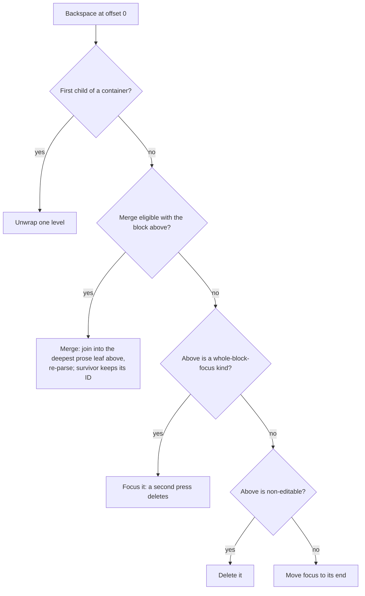

# Editor design spec

The orientation point for the whole design tree. §§ 1-3 orient any task; after that it's per-subsystem reading, and each subsystem's own spec goes deeper than this one does. Nobody reads this end to end (please don't), so jump:

| §                                             | Section                        | What's in it                                                                                          |
| --------------------------------------------- | ------------------------------ | ----------------------------------------------------------------------------------------------------- |
| [1](#1-what-this-is)                          | What this is                   | the one promise the editor is built on, and the four rules that fall out of it                        |
| [2](#2-the-shape-of-it)                       | The shape of it                | the parse, render, serialize loop, the components that run it, and six terms the rest of the doc uses |
| [3](#3-data-flow)                             | Data flow                      | how an edit travels from a block to the tree and back to the screen                                   |
| [4](#4-the-editing-surface)                   | The editing surface            | what a block is made of while you edit it, and how a caret lands in one                               |
| [5](#5-schema)                                | Schema                         | the per-block-type metadata: how a kind merges, what its keys do, and the registries that hold it     |
| [6](#6-cst--dom-synchronization)              | CST ↔ DOM synchronization      | how the tree and the browser's editable text stay in agreement while you type                         |
| [7](#7-cst-mutability-and-reactive-state)     | CST mutability, reactive state | who may change the tree, and the three rules that keep Svelte's reactivity honest                     |
| [8](#8-orchestration)                         | Orchestration                  | split, merge, delete, reorder: every structural edit, and the keys that trigger them                  |
| [9](#9-containers)                            | Containers                     | blocks that hold other blocks (quotes, lists, tables), and what nesting costs                         |
| [10](#10-selection-search-clipboard)          | Selection, search, clipboard   | selections that span blocks, find and replace, copy, cut, and where a paste goes                      |
| [11](#11-undo--redo)                          | Undo / redo                    | one undo stack, and snapshots that share memory with the live document                                |
| [12](#12-serialization-and-the-event-channel) | Serialization, events          | how a document becomes text again, and the events a host can subscribe to                             |
| [13](#13-block-identity)                      | Block identity                 | the stable ids that keep rendering and focus pointed at the right block                               |
| [14](#14-block-kinds)                         | Block kinds                    | every built-in block type and how the editor treats it                                                |
| [15](#15-extension-points)                    | Extension points               | where plugins attach; a pointer, since the real spec lives elsewhere                                  |
| [16](#16-standing-directions)                 | Standing directions            | the editor that died before this one, and four watch-outs for future work                             |

## 1. What this is

aragonite is a block editor for GFM Markdown. You hand it Markdown, it shows you a stack of styled, editable blocks with the syntax still on screen (`##` and `**` are there, just dimmed), and it hands the same bytes back. The one idea the rest of this doc hangs off: there's no rich-text model in the middle that Markdown gets exported from. The parser cuts your source into a tree whose every node holds its own slice of the original text, the blocks render from those slices, and saving glues the slices back together. Nothing gets rewritten into a canonical form on the way through. As a formula:

```
serialize(parse(source)) === source     for all valid GFM
```

And it's the rule every layer here obeys:

> **Slice bytes from `raw`. Never reconstruct them from parsed structure.**

`raw`, here and everywhere below, is a node's verbatim source bytes, markers included. The block layer follows the rule (a container's `raw` holds its own outer syntax, so serializing is concatenation, not reassembly), and so does the inline layer (a `**` marker in the DOM is `raw.slice(...)`, never a `**` printed because the node said "strong"). Every round-trip bug this project has had was some code path deciding it could rebuild bytes it should've copied.

Four design principles, one line each:

- The CST (concrete syntax tree: the parse tree that keeps every byte) decides structure. If the tree and the DOM disagree, the tree wins.
- Each block is an independent editing unit with its own rendering surface.
- Cross-block coordination flows through a small, typed interface. No signal bus, no runtime patching.
- Adding a block type is additive: a component, a descriptor, a registration. A genuinely new cross-cutting capability lands once, at the one place every path crosses, and every later kind inherits it. The bug to refuse is shell, orchestration, or selection code branching on a specific kind name.

## 2. The shape of it

```
Raw Markdown ──parse──▶ CST (mutable plain objects, the single source of truth)
                          │ render                      ▲
                          ▼                             │ serialize
                        Contenteditable DOM (styled spans, dimmed markers)
```

The component tree mirrors the tree of blocks:

```
Editor  (shell: owns the CST, the undo stack, the editor-actions contexts)
  └─ BlockList  (keyed loop over a node's children; windows itself when large)
       └─ BlockHost  (resolves a component by node.kind; hosts the overlays)
            ├─ leaf blocks  (TextEditableBlock, CodeBlock, ThematicBreakBlock, ...)
            ├─ containers  (BlockquoteBlock / ListBlock → ListItemBlock: nested BlockList; TableBlock: per-cell grid)
            └─ plugin blocks  (containers, editable leaves, opaque blocks)
```

`Editor` owns the document, the undo stack and the action contexts, and it manages focus after a structural operation with `await tick()`. `BlockList` is the one rendering primitive, reused at every nesting level; a large one renders only a windowed slice ([`virtual-rendering.md`](virtual-rendering.md) is the windowing spec). `BlockHost` resolves the component for a node's kind, and it also mounts the two per-block overlays (selection, and decorations, which is what search paints through), the drag handle when the consumer asked for one, and a `<svelte:boundary>` that degrades a throwing block to a readable fallback instead of taking the document down. A kind with no registered component renders as a raw-editable text surface rather than as nothing.

Six terms the rest of this doc leans on:

| Term             | Meaning                                                                                                                           |
| ---------------- | --------------------------------------------------------------------------------------------------------------------------------- |
| `raw`            | a node's verbatim source bytes, markers included; what serialization reads                                                        |
| kind             | the string on a node that says what block it is (`'paragraph'`, `'table'`, a plugin's own name); every registry lookup keys on it |
| leaf / container | a container holds child nodes (blockquote, list, listItem, table, tableRow, plugin containers); a leaf doesn't                    |
| descriptor       | the per-kind metadata record: how it merges, edits, renders (§ 5)                                                                 |
| scope            | one block list and its children; the unit of addressing and windowing, and the unit a commit operates on (§ 11)                   |
| path             | child indices from the document root down to a block; how everything off the render path addresses one                            |

The first three are visible in any parsed document. A blockquote followed by a paragraph, trimmed to those fields:

```ts
parse('> quoted\n\nplain\n').children;
// [
//   { kind: 'blockquote', leadingTrivia: '', raw: '> quoted\n',
//     children: [{ kind: 'paragraph', leadingTrivia: '', raw: 'quoted\n' }] },
//   { kind: 'paragraph', leadingTrivia: '\n', raw: 'plain\n' }
// ]
```

The inner paragraph's path is `[0, 0]` and the outer one's is `[1]`. `leadingTrivia` is the blank line that separated them, kept on the block below it so no byte goes missing. Nodes carry a few more fields (`metadata`, for one); [`syntax-tree.md`](syntax-tree.md) § Node shape has them all.

## 3. Data flow

A block notices a boundary event (Enter, Backspace at offset 0, an arrow at an edge) and calls a typed context function. The editor shell mutates the tree, Svelte reactivity re-renders the affected blocks, and after `await tick()` the shell calls `focus()` on the target block. Four channels, and only four:

| Direction      | Mechanism                                      | What flows                                        |
| -------------- | ---------------------------------------------- | ------------------------------------------------- |
| Block → Editor | Context callbacks (editor-actions sub-bundles) | Boundary events: split, merge, delete, move focus |
| Editor → CST   | Direct tree mutation                           | Structural change                                 |
| CST → Blocks   | Svelte reactivity                              | Blocks re-render from the new tree                |
| Editor → Block | Component refs (`bind:this`)                   | `focus(offset)` after a structural op             |

The context function is one member of an action bundle. The block-editing bundle's most-used members (`src/lib/action-contracts.ts` :: `BlockEditActions` has all of them, docstrings included):

```
splitBlock(blockIndex, offset)
mergeWithPrevious(blockIndex)            mergeWithNext(blockIndex)
deleteBlock(blockIndex, gesture)
insertParagraph(boundaryIndex, text)
updateBlockContent(blockIndex, text, mode, preEditOffset, postEditFocusOffset?)
updateBlockMetadata(blockIndex, metadata, options?)
replaceBlock(blockIndex, replacement, focus, { snapshotOffset })
```

`blockIndex` is always relative to the calling block's own list, never the document. Every member resolves to whether bytes landed, so a focus move that writes nothing (say, `descendToBody` onto a block that's already there) resolves `false`.

`updateBlockContent` hands back the write's promise with a bit more on it, readable the moment the call returns. `admitted` says whether the write got through at all (reading mode turns it away, and so does a block with no text of its own, like a list), and only an admitted write has a caret. That's `caret`, the landing offset counted in the bytes as stored (the kind's write rule can move it, § 5), and `keepsCaret`, which is false when the write puts the caret somewhere itself (a new kind, a merge into the block above, a container that changed kind).

```ts
const write = blockEdit.updateBlockContent(index, 'Hello!\n', 'authored', 5, 6);
if (write.admitted) setPendingCursor(write.caret); // 6, unless a rule moved it
await write; // true once the bytes are in
```

§ 8 says who provides these bundles, and § 9 says what a local index means inside a container.

## 4. The editing surface

Markdown syntax is on screen by default, styled: markers dimmed, content styled by what it means, one rendering path per block type. That isn't a stepping stone to something else. The alternative (an authoritative inline tree, with `raw` derived from it) was evaluated and rejected, and the appendix of [`syntax-tree.md`](syntax-tree.md) has the post-mortem.

The presentation modes sit on top of that as view treatments over the same render path. `presentationMode` is `'source'` (the default, and the editing substrate), then `'reading'`, `'preview-block'`, `'preview-inline'` and `'live'`. Marker visibility flips via CSS keyed on focus and caret proximity, so no mode can break the round-trip. A mode that hides the markers at the caret does change editing, though: where a caret may sit (a code block's fence lines included), and how a few rewrites write their bytes (a format toggle, a paste, a split or join, the delimiter auto-pair).

A press is the one wrinkle: the browser focuses the block first and only then works out where the caret goes, so the markers wait for the button to come up (`src/lib/components/editor-root-focus.ts`), or they'd move the text under the pointer. A tap counts too, it just focuses late: the browser sends a mouse press after your finger lifts, and the markers wait for that one's release. How a plugin reads the mode is in [`plugin-contract.md`](plugin-contract.md) § Presentation-mode reads.

Live mode hides every marker standing over content and stays editable, which turns the hidden runs into a caret problem rather than a paint one: a hidden run paints nothing, so one screen position names two raw offsets. Two mechanisms answer that:

- **Edge affinity** records how the caret _arrived_ at such a boundary (stepped in, placed at an end, or committed a byte), so the typing position can tell "outside the construct" from "inside" at a position that looks the same either way (decided by `cursor/edge-affinity.ts`, consumed by `components/blocks/text/edge-seat.ts`, and held in the caret memory, `cursor/caret-memory.ts`: the one record of how the caret got where it is, sticky column and pending marks included).
- **The inline-construct policy table** is where each construct declares what its own delimiters do: which side a typed byte lands on, whether emptying it unwraps, how a split treats it, whether it reveals its source to an entering caret (§ 6). Every reader takes one row instead of testing a kind (`schema/inline-construct-policy.ts`; the same table holds the two registered live-rewrite slots, the split rebalancer and the join cleaner).

The full editing-rule catalog is [`live-mode.md`](live-mode.md).

### Three block surfaces

A block picks its own editing surface, and three exist:

- **`TextEditableBlock`.** The built-in contenteditable prose surface: paragraphs, headings, setext headings, and the raw-editable fallback. Parameterized by CSS class.
- **`createEditableLeaf`.** The plugin-facing text-leaf factory, with the same native caret, IME, undo, clipboard and cross-block-selection behavior as the built-in. Two modes: `plain` (always editable, commits per keystroke) and `render-primary` (a rendered view that reveals its source on entry and commits once on blur). A `singleLine` leaf spends Enter on a block split rather than a literal newline.
- **`createContainerBlock`.** The plugin-facing container factory: a nested `BlockList` with its own scoped contexts, wired exactly as `BlockquoteBlock` wires it. The half that builds the children's actions, `src/lib/editor-actions/nested/container-actions.ts` :: `createContainerActions`, is shared: the list, the list item, the table and the table row call it directly.

Beyond those, a block may render anything (a grid of cells, a static focusable element, an opaque diagram). It only has to conform to the block interface below, and not every block needs contenteditable. Images aren't a block kind at all: they render inline, as atomic widgets inside prose blocks (§ 6).

### The block interface

Every block component exposes a common shape. `src/lib/block-component.ts` is authoritative, each member's docstring stating its own contract, and the required core is four members:

```ts
focus(offset: number): void    // place the caret; also ends any live cross-block range
getCursorOffset(): number | null
readonly editable: boolean     // a report: mirrors the descriptor's editable declaration
readonly focusable: boolean    // the flag focus dispatch reads before landing anything
```

Everything else is optional, and a block implements what its surface can honestly answer: selection reads (`getSelectedText`, `setSelection`), pixel-column landing (`focusAtColumn`), selection-rect measurement (`measurePartialRects`, § 10), path descent for nested surfaces (`focusByPath`), command dispatch (`runCommand`), and `afterSourceCommit` for a block that can show a source the tree hasn't seen yet (a widget's, or a render-primary leaf's own), so a command from outside it waits until that source is written.

**Caret placement is two verbs.** `focus` places a caret and ends any live cross-block range. That's the safe default, since a caret landing inside a range left live is content the next keystroke type-replaces. The optional `parkCaret` is the same landing _without_ the range-ending, and it's for the selection-extend paths only, where the dispatcher parks a caret in an endpoint it has just revealed (to reveal a block: mount it while it's off screen, so its DOM exists before something touches it) while the extend is still growing the range. G2.12 guards which callers may reach the second verb.

The caret surface reads as three layers, and a new gesture composes them rather than adding a verb:

1. **Landing.** Place a caret, one entry per addressing mode: `focus` and `parkCaret` (raw offset), `focusAtColumn` (editor-relative pixel X on the first or last visual line that can show a caret, with park semantics), `focusByPath` (descent to a nested leaf). Every implementation is built on the same `placeCaret` core (`selection/caret-doors.ts`), so the range-ending policy lives in one place.
2. **Point resolution.** Turn a viewport point into a landing first: the `caretTargetAtPoint` descriptor hook answers for kinds that resolve a point through their own DOM (a table names a cell; a render-primary leaf names the source offset under its rendered view, which is where its reveal click lands), with the drag hit test (`foreignDragHitTest`) as its decline-happy sibling. A point inside a text element becomes an offset in `src/lib/cursor/point-offset.ts`, the one home for that: an exact probe that declines outside the element, and the nearest one (`caretOffsetAtPoint`, on the plugin barrel) that clamps the point into its box first. (A hook that picks a cell, like the table's, needs neither; a plugin leaf's hook usually calls `caretOffsetAtPoint` on its text, which is why it's on the plugin barrel.) Both probes move a point in the element's top or bottom padding level with a line before asking the browser, so every OS answers with the column under it, and a plain click there is placed through the exact one rather than by the browser (`src/lib/selection/cross-block/pointer.ts` :: `handlePointerDown`, which every editable surface's pointer-down calls). Neither does arithmetic of its own, so the offset a point resolves to is the walk's.
3. **Boundary policy.** Where a landing meets an atomic widget (§ 6): `enterEdgeWidget` for a keyboard arrival at a block edge (a vertical arrival at a widget-only block takes the same entry), `snapCaretToPoint` for a click's post-landing refinement (a press beside a widget, or on a character-like one), both dispatching the kind's one registered `InlineWidgetEditingPolicy`.

[`caret-placement.md`](caret-placement.md) walks one click through all three layers, and then through what the caret does on the next keystroke, one file per stage.

A block publishes the shape one of two ways, and `BlockHost` resolves both at the single point it stores a ref: a leaf as its own instance exports, a container under one `containerApi` export. Why two: Svelte 5 instance exports are individual top-level declarations with no spread, and forwarding a dozen members by hand made every member a place to drop one. The component registry types the two shapes as a union, so a block publishing neither doesn't compile.

## 5. Schema

Cross-cutting block-kind metadata lives in `src/lib/schema/`, and both `core/inline/` and `tree-operations/` read it. It isn't the only thing those two share (`core/` and `perf/` are too), but it's the one carrying the kind vocabulary, which is why a cross-cutting block-kind fact belongs here.

How it sits in the import graph:

- The schema imports nothing from `tree-operations/`, or the layer graph would cycle.
- It does import from `core/`, `core/inline/` included, and `core/` imports it back. That's by design and only at directory granularity: no chain of runtime imports runs from a module through the other directory and back to itself.

### The block-kind descriptor

One registration per kind, through `registerBlockKind`. A leaf, trimmed to the fields this doc talks about:

```ts
registerBlockKind('thematicBreak', {
	mergeRole: 'not-mergeable',
	editable: false,
	supportsInline: false,
	blockFocus: 'whole-block',
	gapEdges: 'before'
	// closure, conformanceFixture, ...: plugin-contract.md § The descriptor field reference
});
```

No `keymap` there, and it still moves on Alt+ArrowUp/Down: a whole-block kind gets those two reorder chords added whenever its keymap is read, unless it binds them itself (`schema/commands.ts`).

And a container, which carries one extra group:

```ts
registerBlockKind('blockquote', {
	mergeRole: 'container',
	editable: true,
	supportsInline: false,
	gapEdges: 'none',
	container: {
		contract: 'strip',
		rebuildRaw: rebuildBlockquoteRaw,
		containerPaste: { matchesAncestor: () => true, siblingAbsorb: false },
		unwrapRole: { firstChildBackspace: 'lift-first-child-drop-opener', middleChildBackspace: 'default-merge' },
		contentStartSpace: 'complete-marker',
		reorderChildren: {}
	}
});
```

What the fields are for, by the section that explains each:

- `mergeRole` and `editable` (§ 8), `supportsInline` (whether the kind's content gets inline-parsed), and `blockFocus`, the whole-block focus policy (§ 8). A whole-block kind can't parse inline syntax, so it declares `supportsInline: false`;
- `contextDependentKind`: no standalone recognizer, so a content edit keeps the kind rather than re-deriving it (a table cell);
- `readsFollowingLines`: the kind can take the lines right below it as its own (a link definition's title), so a write next to it that keeps its kind still asks whether the two now read as one (§ 8);
- `keymap`, the declarative keybindings (next subsection), and `contentStart`, where the editable slice of `raw` sits (a heading's text after its `## `), plus what Backspace does at its start (in a mode that hides the markers at the caret, a heading drops its `## ` first). The editor reads the two back as `getContentRange` and `contentStartBackspace`;
- the two point-to-internals hooks a coordinate-addressed kind declares separately: `foreignDragHitTest`, the exact drag hit test, and `caretTargetAtPoint`, the nearest caret target a caret-placing gesture asks for (§ 4);
- `gapEdges`, which edges of the block a caret may park against from outside (§ 10);
- `rawWrite`, the kind's write rule for its own bytes, and `bodyWrite`, a container's rule for a child's bytes. Both have the same shape: `normalize` makes written bytes legal, and `mapOffset` moves a caret along with them. Every content write runs the block's rule and then its container's (`tree-operations/content-write.ts :: legalizeWrite`), and hands the caller its caret already moved, so no block maps a caret by hand. The write also tells the rule whether the user typed the bytes in the block (`authored`) or they arrived whole (`literal`, a paste or a replace): a fence the user's still typing is left alone, while a pasted closer grows the fence. Every fenced kind declares the code block's rule (`schema/fenced-code-raw.ts :: fenceRawWrite`), and a setext heading's rule drops its underline once the title above it is left blank (`schema/setext-raw.ts`);
- how the block sits on the page. `pageRole` says whether it reads as prose (no drag handle; right-clicking its text opens the clipboard rows) or as an object you pick up whole. The drag handle and the context menu both ask `src/lib/schema/page-role.ts :: blockPageRole`, which also counts a paragraph of nothing but images as an object. `estimateHeight` is windowing's height guess until it gets to measure the block, and `dragLabel` is what the drag ghost calls a block whose text makes a bad label. Every built-in declares `pageRole` and `estimateHeight` (G1.40); a plugin that skips them gets an object, with the container or the prose height guess;
- for containers, the `container` group: the contract and the raw rebuild (§ 9), `reservedChrome` (chrome: the parts of a block that are furniture, not content, like a title row; § 9), `containerPaste` (§ 10), `unwrapRole` (§ 8), `contentStartSpace` (§ 8's marker completion), `reorderChildren`, `bodyWrite` (the write rule for a child's bytes, above), and `bodyWrap` (whether the body sits between the container's own fence lines, like `:::note` ... `:::`).

The group is why an illegal leaf/container mix is a compile error rather than a runtime surprise: `contract` and `rebuildRaw` are required together inside it, and `isContainer` is derived from the group's presence, never declared.

### Commands and keybindings

A kind's `keymap` maps a chord to a command id. Registration checks each chord and stores it normalized (`schema/keybindings.ts` :: `registeredChord`), so a mistyped `Ctrl+B` throws there instead of turning into a bare `B`. A keypress gets the same normal form (`eventToChord`), and `Mod` folds Ctrl and Cmd into one token, so a binding is `{ chord: 'Mod+B', command: 'format.toggleStrong' }` on every platform; why nothing in the tree detects the platform, and what that costs the test harness, is [`../contributing/codebase-map.md`](../contributing/codebase-map.md) § Keyboard and chords. Global commands (undo/redo, a plugin's registered global) are free functions rather than per-kind entries. A block's chords map to commands declaratively. What still reads keys by hand is what a keymap can't carry: handling that depends on where the caret is (a block edge, a widget, a table cell) and transient UI (an open menu, the search bar, the link card). Every such file is listed in `src/lib/schema/reserved-chords.ts` :: `HARDCODED_CHORD_SITES`.

A focused leaf resolves a chord through the consumer's overrides first, then three keymap tiers (`schema/commands.ts` :: `resolveBinding`):

1. an override on the kind (the `keybindings` prop, scoped by `kind`), then an override on the global table,
2. the kind's own keymap,
3. the editor-global keymap,
4. the plugin-global tier, where a plugin's `registerGlobalCommand` binds its chord.

Override source beats specificity, so a consumer disabling a chord globally suppresses one a kind defines; and a plugin's global chord never beats a built-in one, on any kind. The resolved id is then spent on three tiers in order: the global table; a registered `(kind, id)` block command (created by the one authorized registration, where a duplicate throws), which runs its own registered handler; and the built-in vocabulary on the focused component's `runCommand`. The two reorder ids skip that last step: `block.moveUp` and `block.moveDown` move whichever block reports its path, through the editor's reorder action (once the block has written any source it's showing), so every block (a plugin container too) moves on whatever chord the keymap binds to the two ids. Container bubble handlers resolve kind-only, so they never double-fire a leaf's global command, and `runCommand` reads the caret live rather than an offset captured at keydown.

### The dispatch point

Chord resolution and the public `EditorInstance.runCommand` entry meet at one id-keyed dispatch point (`schema/block-commands.ts`), where the rules that hold _whatever_ invoked a command live. Reading mode dead-keys the vocabulary there. A painted cross-block range gets one of three answers:

- a command whose handler spends one block's own offsets and has no cross-block reading **declines** outright (the link editor, which writes a link into one block);
- a format toggle routes to the **cross-block executor**, injected into the dispatch point's checks because a schema leaf may not import selection machinery;
- everything else is range-safe and **runs on the focused surface**.

The editor builds one command context (`schema/block-commands.ts` :: `CommandDispatchContext`: its history, plugin lookup, which plugins are on, mode, overrides, range executor, error channel and the reorder action), and every entry path reads that same object, so a dispatch site added later can't turn up with its own copy missing a piece. A container a key bubbles up to never takes the cross-block route, since the toggles belong to the leaf below it.

<details>
<summary>How the cross-block toggle actually works</summary>

- It decomposes the range into one span per participating block (the start's tail, every block the range holds whole, the end's head) and runs each through the single-block format toggle, so it has no branches, candidates, or mode verification of its own. What the range holds is `rangeCoverage`'s answer, the one the delete and the copy read, so a range that reaches a closed details' title formats the hidden body too. Direction is the whole range's coverage, decided once and applied to every span: all covered unapplies, anything else applies, which keeps an apply from walking an already-marked block back.
- Participation is the kind descriptor's declaration (inline-bearing, editable, not a container), never a kind name.
- Tables are where the format gets cell-shaped. A table keeps a range endpoint as a cell number, not a text position, so the coverage also says which cells count: the rows a range runs into, the rectangle of a selection inside one table, or every cell of a table it holds whole. Each of those cells gets marked whole. A plugin grid (a plugin's own rows-of-cells block, no table metadata) isn't special here. An endpoint in one of its cells is a text position like any other, so the format marks from that point on, and every row and cell in between is held whole, surplus cells of a wider row included. Those are the same bytes the copy takes and the highlight paints. An endpoint on the grid block itself, rather than in a cell, holds the whole grid. The endpoint also stays put across the write (a text position in a cell follows that cell's rewrite, the way a paragraph endpoint follows its paragraph's).
- The whole press is one undo entry through the multi-scope commit (§ 11), and the range is restored over the result through the shared restore route (§ 10).

</details>

The same dispatch point answers `EditorInstance.canRunCommand`, the read a host greys a button from, so what a button shows and what a press does can't drift apart (a probe spends none of the dispatch's one-time dead-key diagnostics). Its sibling `isCommandActive` answers a command's pressed paint from whoever would spend the press: the focused surface at a caret, the range's own coverage across blocks. A mark reads its own runs. The link editor reads the construct its card would edit, resolved by the card's own entry, so the button and the chord can't name different links, and pressing a painted button enters the link it painted for. Paint and press decide by the same guards, so the two can't drift on the three range answers (G2.14, whose one escape is the unverified wrap a marker-painting mode writes on the reader's screen).

### The other registries

- **Block openers.** An opener is the part of the parser that recognizes the syntax a block starts with. A kind the block parser dispatches declares one:

  ```ts
  registerBlockOpener(kind, {
  	priority: 25, // lower dispatches first; ties break by kind name
  	tryOpen(ctx) {
  		/* claim the lines from ctx.index: return { node, consumed }, or null to decline */
  	},
  	interruptsParagraph: (lineText) => lineText.startsWith(':::') // or false
  });
  ```

  Both the parser's dispatch order and its paragraph-interrupt scan derive from the declarations. Built-in openers live in `core/parsers/`, and their priorities are published as one constant, `OPENER_PRIORITIES` (`schema/opener-priorities.ts`), so a plugin opener whose matcher is a superset of a built-in's prices below that built-in's entry, and one that only slots between built-ins prices into the gap.

- **Enter completion.** The opener registry's sibling, for kinds whose grammar spans adjacent lines and so can't be typed into existence. A registered completer reads one typed line and answers the lines completing it plus where the caret lands; § 8 shows the call. Published on the plugin surface, so plugin entries clear through the platform reset like every other public register-once registry.
- **Components.** The runtime kind-to-component map `BlockHost` looks up. The built-in registrations live in `components/built-in-blocks.ts`, and every editor calls them when it's created (`src/lib/components/editor-built-ins.ts` :: `registerEditorBuiltIns`); only the first call does anything.

Two more things live in `schema/` that read like registries but aren't: the merge rules (eligibility predicates for Backspace-merge, plus the walker that finds the deepest mergeable leaf, § 8) and the container raw rebuild (per-kind rebuild plus ancestry dispatch, so an edit deep in a nesting chain re-emits every enclosing container's `raw`, § 9). Both are functions over descriptor fields (`mergeRole`, `container.rebuildRaw`).

Registries are code, not state: register once, throw on duplicate, no unregister (the `customElements` model), in production and under test.

```ts
registerBlockKind('paragraph', {
	/* again */
});
// throws: registerBlockKind: "paragraph" is already registered. Kinds are register-once ...
```

Strict on purpose, because a registry you can quietly overwrite is a registry two plugins can fight over. Under a dev server a duplicate replaces with a note instead (`schema/register-once.ts`), so a re-evaluated registrar survives hot reload rather than 500-ing every route.

## 6. CST ↔ DOM synchronization

The tree is the document-level truth. Inside one block, while you're typing, the DOM leads and the tree follows, and that's no contradiction: the tree is written on every input event, so following isn't lagging, and the DOM is patched only when the tree's structural reading diverges from what's rendered. Typing stays fast because the editor doesn't fight the browser over ordinary keystrokes; it reads the result back.

### Reading the DOM back

On `input`, the block reads its own DOM content back as raw text, writes it to `node.raw`, and re-parses to refresh metadata and inline content; if the kind changed, it re-renders with the new component. What it never does is reconstruct that text from parsed structure (§ 1's rule, one level down). Each surface supplies its own reader: code blocks and plain editable leaves can read `textContent` directly, while a prose block reads through a raw-aware DOM walk, since its atomic widgets and its container's ambient prefix (the read-only marker a container lends its first child, a list's `- `) both put `textContent` out of step with `raw`. Why, and the walk itself, is [`inline-parsing.md`](inline-parsing.md) § 2.

The common case (no kind change) needs no DOM patching, since the browser's update and the tree agree; prose blocks rebuild their styled span tree from `raw` on every input, and offsets map unchanged.

When the edited text re-parses to **several** blocks (a hard-break line followed by an interrupter, an early fence close), the block structurally replaces itself with all of them: the first keeps the slot's identity, the rest splice in as siblings, and the caret follows the edit position into whichever block it lands in. Every input crosses this one point, and it's what keeps the live tree from cramming multi-block text into one node's `raw`. Before that split, a construct the write itself left **open** is closed: a typed unterminated fence writes its own closing fence over an empty body, so the blocks below stand instead of being absorbed. A gesture that merely _exposes_ an already-open fence still absorbs what follows, because that's the reload's honest reading, and § 8's settling converges to it.

### Intercepted operations

These the editor owns, not the browser:

| Operation          | Trigger                           | Behavior                                                             |
| ------------------ | --------------------------------- | -------------------------------------------------------------------- |
| Enter              | `keydown` → `preventDefault`      | Split the CST node at the cursor offset                              |
| Backspace at start | `keydown` → `preventDefault`      | Merge, unwrap, delete, or focus (§ 8)                                |
| Paste              | `paste` → `preventDefault`        | Read `text/plain`, dispatch through the paste pipeline               |
| Copy / Cut         | `copy` / `cut` → `preventDefault` | Slice the selected range out of the CST's `raw`; cut then deletes it |
| Undo / Redo        | `keydown` → `preventDefault`      | Pop/push the editor's own undo stack (browser undo is off)           |

One thing the editor deliberately doesn't own: between `compositionstart` and `compositionend` there's no sync and no reconciliation. The browser owns the IME sequence outright (and is welcome to it), and `compositionend` enters the same input path as a keystroke.

### Atomic inline widgets

Some inline nodes render as opaque widgets: `contenteditable="false"` spans with no interior the caret can enter. Images, `<br>`, inline directives, decoded HTML entities, and the bundled plugins' inline math, footnote references and emoji are the shipped set, and the inline-widget registry (`core/inline/inline-widgets.ts`) is the one place that says which inline kinds are widgets. A widget's shell carries its raw byte range on the root element rather than in `textContent`:

```html
<span data-inline-widget="" data-source-start="4" data-source-end="20" contenteditable="false">…</span>
```

So the caret is addressable only at its leading and trailing edges, and the generic machinery keys off `[data-inline-widget]` alone ([`inline-parsing.md`](inline-parsing.md) § The textContent invariant).

**`cursor/widget-offset.ts` is the single translation point between DOM Range positions and raw offsets**, and everything that needs the translation routes through it. Why there's exactly one home, and what happened when arithmetic lived elsewhere, is [`inline-parsing.md`](inline-parsing.md) § Coordinate spaces.

Two cross-block focus behaviors compose on top:

- **Vertical stop.** A block whose only inline content is widgets (an image, a lone formula) is one stop for ArrowUp/Down in either direction: the first press enters it as an object (the image selected, a formula's source revealed) and the next press moves on, so a run of Up presses and the Down run back retrace the same stops. `isVerticallyTransparent()` still names the block; it now says "enter as an object", not "pass through", and only a block that cannot be entered is skipped. Containers recurse, so a list item holding one image-only paragraph is the stop. A block holding only a step-over glyph (a decoded entity, an emoji) is a stop too, but a plain caret one: the arrival puts the caret beside the glyph, the same position a horizontal step lands on, and the edge read takes its visual line from the glyph's own box, since a caret beside a widget has no rect of its own.
- **Edge entry.** When a cross-block ArrowLeft/Right lands at the far edge of a paragraph that ends (or starts) with a widget, the dispatcher enters the widget rather than parking a caret at a boundary with nothing to show for it.

What "entering" means splits by the kind's editing policy:

- **Reveal-capable kinds** (inline math, inline directive, a footnote reference): horizontal caret entry against either edge (ArrowLeft/Backspace from the right, ArrowRight/Delete from the left, within-block or as a cross-block landing) opens the source reveal with the caret at the entered edge of the raw source. The caret then walks the raw bytes, and the escape rules below close the reveal when it leaves. The widget-selected state is unreachable for these kinds, so the caret never parks somewhere with no visual representation, and an adjacent Backspace degrades the widget one visible delimiter byte at a time instead of silently deleting the whole thing.
- **Images** keep select-then-step and select-then-delete on the same keys. **A decoded entity** (and an emoji) is atomic and step-over: a plain arrow walks the caret across the glyph like a character, a caret-adjacent Backspace removes the whole reference in one press, and a press on the glyph puts the caret at the edge on that side of its box.
- **Shift+Arrow never reveals**, on any kind.

**Source-reveal editing.** A revealed widget swaps its rendered span for its editable raw bytes. Three facts orient the rest: the gesture is editor-owned end to end (pointerdown on the widget suppresses the browser's default caret placement, so the reveal's own landing has no racing writer, and a click lands where it pressed when the kind maps its render back to bytes through `revealOffsetAtPoint`, the way a `$$` block's press already did); while revealed, the edit is ephemeral DOM, one undo entry on commit; and the reveal closes when the caret or selection escapes the source. The escape rules:

- An in-block escape closes in place; blur owns the focus-leaving close; a cross-block sweep keeps the source revealed, so selection rects measure real text. Clicking widget B while A is revealed closes A and reveals B as one sequenced gesture.
- Containment is decided by raw offset through the shared walk, and an escape must survive a `tick()` re-check before closing, so a transient selection state the editor's own machinery manufactures (cross-block entry clearing the native selection) never closes a reveal the user still wants open.
- A mutation of the block closes the reveal _before_ it touches a byte: a clipboard splice and every branch of the block's command dispatch run against `node.raw`, which the ephemeral edit hasn't reached. That's what keeps Enter meaning "split" inside a revealed source (the command dispatch closes the reveal, then splits at the caret) rather than the reveal claiming the key and costing the user the press.
- The reveal claims exactly one key of its own, Escape, with one carve-out a table cell carries at its own keydown: a cell's Enter is a row hop rather than a split, and hopping would move the ephemeral edit out of the surface that owns it, so there a revealed source commits and the caret stays put.

To add a widget kind, register it in the inline-widget registry so recognition stays in one place, then render it as a Svelte component (recommended: the render layer keeps the instance alive across per-keystroke rebuilds) or as hand-built DOM ([`inline-parsing.md`](inline-parsing.md) § Widget render paths).

## 7. CST mutability and reactive state

The tree is mutable plain objects, no class hierarchy: the parser produces mutable nodes, the editor mutates them in place, and `serialize()` reads `raw` only. It's structurally typed over readonly fields, so it also works on the bytes-readonly node views (`core/node-views.ts`) that readers outside the mutation layers hold. The only allowed routes from a view back to a mutable node are the unshare and clone helpers and the owned scope views the commit steps hand out (the fixed steps every commit runs, § 11).

- `parse(source)` yields a mutable `Document`, and the editor works with those nodes directly. No wrapping, no cloning on load.
- Re-parse runs `parse()` on the block's `raw` and transfers the result into the existing tree through one entry. A same-kind edit writes the block's fields in place, so routine typing keeps the node object (its component and IME state ride along); a kind change or a multi-block result creates fresh nodes and splices them into the slot, the ID carried across at the index (§ 8). The transfer never rewrites `kind` in place, and readers can't either, because the bytes-readonly `NodeView` makes a `kind` write a compile error ([`syntax-tree.md`](syntax-tree.md)). On a mutable node the union still permits the write, so the mutation layer holds the line by routing every re-parse through this one entry.
- Undo snapshots **share** the live tree's nodes; a mutation copies the shared spine (the chain of parents from the root down to the edited node) before writing (§ 11).
- Some container metadata feeds the container's `rebuildRaw` (a list item's `taskMarker` is emitted back into its serialized text), so a write to such a field must trigger the rebuild in the same commit or `raw` drifts from metadata. The `updateBlockMetadata` action runs the rebuild after its shallow merge, so a new metadata-driven field inherits the guarantee by going through that action rather than by someone remembering a rule.

### Reactive state plumbing (Svelte 5)

Three invariants govern how tree state crosses into Svelte's reactivity. Each prevents silent corruption, and none is discoverable from the types ([`../contributing/rules.md`](../contributing/rules.md)), which is the worst combination there is, so here they are in full.

1. **Reactive state crosses module boundaries as getters, never values.** Re-init effects and bootstrap helpers read mutable state through `() => state` closures or getter properties. A plain value-read would snapshot at effect-run time _and_ register the state as a dependency of the effect, re-firing it on every later mutation and wiping unrelated work. The `source !== lastSource` guard in `Editor.svelte` exists for the same reason.
2. **The document is not its own memo key; the content version is.** The `$state` document is mutated in place, so its object identity survives every edit. Anything derived from the whole tree (footnote numbering, a table of contents) keys on the editor's **content version**, a counter each route writing the document's bytes bumps and nothing else moves (G4.52):

   ```ts
   // reactivity/content-version.svelte.ts
   interface ContentVersion {
   	read(): number; // read it inside a $derived, and that derived re-runs on every edit
   	bump(): void; // announce that this write moved the document's bytes
   }
   ```

   It's announced rather than derived from a walk because the walk was O(document nodes) per edit and the announcement is O(1), at the cost of invalidating on a commit that moved no byte. It isn't the decoration engine's `editEpoch`, which follows it one `tick()` later; the version is the reactive read a `$derived` subscribes to, while the epoch is the plain number `provide` receives.

3. **The render path computes inline content locally and reads no cache.** There's no `inlineContent` node field: prose blocks compute the inline tree from `node.raw` on each render, so a render effect's reactive read set is `node.raw` plus its closure inputs, nothing more. Non-render consumers (event handlers, exported methods, click-snap) read inline content through an accessor backed by an external, non-reactive WeakMap that Svelte's ownership tracking never observes. The incident behind this one: a render effect both read and wrote a reactive cache field, write-during-read closed the loop, and ownership tracking corrupted keyed `{#each}` index assignments after `splitBlock`. With no reactive cache field, that class can't recur.

## 8. Orchestration

**Upward.** Blocks call typed context functions for structural operations (the bundle in § 3, plus focus moves, undo and redo), each taking a block index relative to the **local** children array. No signal dispatcher, no string matching, no performer registry. The block-editor interface rides three named facets in `src/lib/editor-keys.ts` (`EditorServices`: the event channel, the view-state stores, and the cross-scope commit and reorder primitives; `EditorPolicies`: what the host configured; `EditorDoc`: document identity and the per-instance lookups that hang off it) plus the per-key action bundles, whose individual granularity is the point. Every container provides its own block-editing and focus bundles (their indices are local to its children), passes container editing through from above unless it changes it, and overrides single functions inside any of the three rather than whole bundles. History stays its own key that only the editor root provides, so undo/redo resolve to one stack (G1.4). Everything else resolves by walking up the context tree to the nearest ancestor that provides it, so pass-through delegation boilerplate doesn't exist.

**Downward.** The editor reaches down through component refs (the `BlockComponent` interface in `src/lib/block-component.ts`), mostly for focus and caret reads; the rest serves selection paint, pointer hit-testing, clipboard routing, windowed descent, commands and `insertMarkdown`. After a structural mutation and `await tick()`, the caret landing (§ 11) calls `focus(offset)` on the target block, the range-ending verb, so a landing after a cross-block operation can't leave the old range painted.

### Structural operations

Every structural operation is a tree mutation performed by the editor shell, never by a block.

**Split.** Cut `raw` at the cursor offset and re-parse each half as the blocks it holds, normally one apiece. The original keeps its ID; every other node gets a fresh one. Offsets are raw offsets, markers included, and the block component translates DOM position to raw offset; the marker isn't duplicated, the second half re-parsing as its natural kind. Three edge rules:

- A cut landing _on_ a line ending ends the first half with it, rather than opening the second with a blank line the user never typed.
- A cut at or before an ATX heading's text moves the whole heading down, `#` and all. An empty heading left above is nothing anyone asked for.
- A structural suffix (raw past the content range: a setext underline, or an ATX heading's closing `#` run) stays with the first half, so the split can't strand it below where it reparses as something else.

A multi-block paste cuts its target with the same function (`src/lib/tree-operations/structural-suffix.ts` :: `cutKeepingStructure`), so all three hold there too.

**Enter completion.** A split that creates a construct instead of cutting one. A split puts a blank line between its halves wherever they'd otherwise read back as one block, which two prose lines always would, so a grammar needing its lines adjacent (a table's header and delimiter, say) could never be typed into existence. So before splitting, the Enter-completion registry (§ 5) gets asked: where the block is a single line of prose whose every byte is content and the caret sits at its end, a registered completer may claim the line and answer the lines that complete it. A completer that sets `onType` is also asked on every typed write, which is how block math's `$$` forms without an Enter.

```ts
// grammar: the editor's grammar, which knows which completers this editor runs
completeTypedLine('| a | b |', grammar);
// {
//   lines: ['| a | b |', '| --- | --- |', '|  |  |'],
//   caret: { path: [1, 0], line: 0, column: 0 }   // the first body cell
// }
completeTypedLine('ls | grep foo', grammar); // null: no leading pipe, nothing to complete
```

The claim becomes a block replacement in the slot (one undo entry, the paragraph coming back exactly as typed with the caret where it was) and consumes the press. A completer answers its caret as a line and a column inside the node it addresses, never a byte offset, because the editor attaches the line ending after the claim. The consult wraps the composed split action rather than sitting inside it, above any container's own split override, so a container can't take the branch out of its subtree and no press crosses it twice. The table is the built-in registrant; block math (`$$`) is the bundled plugin one. Two grammars that look like candidates aren't. Front matter is position-blind to a completer (`tryComplete` sees a line, not where the document starts) and a typed `---` parses as a thematic break, which the prose gate excludes, so it would need a different signal. A footnote definition forms from one line, so Enter has nothing to complete, and whether `[^1]:` opens is an opener question.

**Merge.** Backspace at a block's start, Delete at its end, and a list item merging into the one above it (M1, below) are one join, `tree-operations/node-ops.ts :: joinIntoLeaf`. It writes the lower block's text onto the end of the upper one: Backspace into the upper block's deepest prose leaf (for two paragraphs, that's just the upper paragraph), Delete into the upper block itself, which then re-reads. The details:

- The lower block's text goes through its own kind's write rule first (`tree-operations/leaf-range.ts :: joinLeaves`), then through the same rules typing does, the leaf kind's own and then its container's. So a join in a `<details>` body that spells `</details>` out of two halves lands escaped.
- Then the leaf re-parses, and its kind follows its bytes: two backticks joined to a backtick and some text become a code fence, in a list item as at the top level. A list item whose first block stops being a paragraph gives up its task checkbox.
- A join whose bytes reparse as more than one block is refused at the write, and the caret moves across the boundary instead.
- The survivor keeps its ID, and the caret lands at the join. When the fix-up after the delete merges the survivor into the block above it, the caret follows the joined bytes into that block, down to the leaf holding them.
- The second block's text lands at the first one's content end, so a structural suffix (a setext underline, an ATX heading's closing `#` run) stays past the joined text. A range delete that starts in such a block keeps it the same way, and one that ends in such a block drops that block's suffix along with the block.
- The joined text ends the way the lower block did, so a file with no final line break still has none.

**Delete.** Remove the node from its children array, then settle the join that removal opened (below). The caller says what removed the block (Backspace, Delete, a cut, or `'keyless'` for a delete no key asked for, like the block menu's), and the caret lands once, on the side that points (`src/lib/selection/caret-target.ts` :: `survivorAfterRemoval`). Backspace and a keyless delete go to the end of the block above, or the start of the one below when there's nothing above. Delete and cut go the other way round. A range made only of whole blocks (a dragged-over rule, say) lands by the same rule, so a key lands on one side however the block got selected; a range that runs on into a block it keeps lands where that block resumes. The caller doesn't place a caret of its own afterwards.

The document always keeps a block. A delete that takes the last one (a lone rule, say) leaves an empty paragraph with the caret in it, and the commit adds that paragraph itself (`src/lib/tree-operations/keep-one-block.ts` :: `keepOneBlock`), so one undo brings the block back. A container doesn't get to sit there empty either: a delete that takes its last child takes the container too, and its parent if that empties next, all the way up. A range delete (and a list promote) does that with one walk up the ancestors, `src/lib/tree-operations/cleanup.ts` :: `cascadeCleanupEmptyAncestors`; inside a container, deleting its only child hands the delete to the parent instead (`src/lib/editor-actions/nested/emptied-container.ts` :: `removeEmptiedContainer`), and so does replacing that child with nothing. One exception: a range that starts in text inside a container and runs on past it keeps the spot it started in, so select from `> a` through the paragraph below, delete, and you're left with `>` holding an empty paragraph. A range that starts on a rule holds the rule whole, so `> ---` and the paragraph below delete to an empty document.

**Reorder.** Move a node among its siblings. The moved block keeps its ID, and both edges of the moved window are checked:

- a block that lands flush against a neighbour it would be read into (a table under a paragraph, a rule under one) arrives with its separator;
- the pair it left behind keeps a blank line between them where either had one against the moved block and the two would otherwise reload as something else, and rejoins as the reload reads them where both were flush against it (that can merge a block into its neighbour, so the caret goes where the commit says it landed, not where the move put the block);
- a document with no final line break still has none after a move, same as after any structural edit (§ 11's commit steps). The move ends the lines of its window itself before it checks those joins, and the commit takes the break back off whichever block ends up last.

Two gestures, one operation: keyboard (Alt+↑/↓ on the focused block, with a screen-reader announcement) and a pointer drag from the block's handle, revealed on hover and shown outright where nothing hovers (an insertion line marks the drop, one commit on release, autoscroll for off-screen targets). Keyboard reorder is always available. The handle is on by default outside reading mode (`blockDragHandles`) and belongs to object blocks alone (code, tables, equations, diagrams, pictures, list items, dividers, cards), never prose, whose grips would be noise beside every line. Its grip sits in the first line-height of the block's own box, in the editor's left gutter, and is hittable without hovering the block first. A table has no row or column grips: its one handle moves the whole table, and the right-click cell menu carries the axis actions.

**Kind change.** When a re-parse of a block's updated `raw` yields a different kind, the node is replaced with one of the correct kind and keeps its ID; when it yields several blocks, the first keeps the slot's ID and leading trivia and the rest splice in with fresh IDs, exactly as a split does. The same rule runs a level up for **containers**: an edit inside one changes what the container's own rebuilt `raw` parses to (typing the rest of a `> [!TIP]` marker), so the ancestry rebuild re-derives the container's kind and swaps the slot the same way (§ 9). A demotion also settles the joins it disturbed.

**Settling a disturbed join.** To _settle_ is to re-derive the blank-line separators around a splice. A mutation can invalidate an adjacency that was correct before it, and adjacent bytes that re-read as **fewer** blocks, or as the same count with the upper block holding content from the lower, are the reload's own reading, so the tree converges to that reading rather than inventing separator bytes into an untouched neighbour. Everything that disturbs a join has to ask it that question, at the commit's settle step (§ 11) and at the two splice entries in `tree-operations/settle.ts`; the one join no scope-local ask can see, a container's own slot in its grandparent's array, is asked on the way out of the ancestry rebuild (§ 9). Which caller asks through which entry is [`../contributing/codebase-map.md`](../contributing/codebase-map.md) § Blank lines and separators.

A write that keeps its block's kind skips the ask, so a keystroke in a paragraph never pays for it. It asks anyway when:

- the write changes the first line's indent, which alone decides whether a list item above takes the block in;
- a blank line stays blank;
- the block, or the one right above it, can take the lines below it as its own with no blank line between them. That's a kind fact, `readsFollowingLines`. A link definition declares it (its title can start on the next line, so typing a closing `"` under one hands the paragraph to it), and so does an HTML block, which reads on until its closer and takes whatever sits below once you break one.

A write that leaves its own construct open is closed first (§ 6).

### Merge eligibility: roles, not pairs

Eligibility derives from a per-kind **merge role**, so adding a kind doesn't mean editing an enumerated pair set:

| Role             | Meaning                                                 | Kinds                                                                                                   |
| ---------------- | ------------------------------------------------------- | ------------------------------------------------------------------------------------------------------- |
| `prose`          | Leaf text block                                         | paragraph                                                                                               |
| `prose-absorber` | Prose leaf that keeps its own kind when absorbing prose | heading, setextHeading                                                                                  |
| `container`      | Merge target is its deepest reachable prose leaf        | blockquote, list, listItem                                                                              |
| `self-merge`     | Merges only with another block of the same role         | unrecognized                                                                                            |
| `not-mergeable`  | Backspace deletes (if non-editable) or moves focus      | fencedCode, indentedCode, htmlBlock, linkReferenceDefinition, table, tableRow, tableCell, thematicBreak |

`prose + prose`, `prose-absorber + prose`, `container + prose`, and `self-merge + self-merge` are eligible; every other pairing isn't. Read each pair as "the block above, then the block Backspace was pressed in":

````ts
isMergeEligible('heading', 'paragraph'); // true: the heading absorbs the paragraph
isMergeEligible('paragraph', 'heading'); // false: a heading never merges upward
isMergeEligible('blockquote', 'paragraph'); // true: into the quote's deepest prose leaf
isMergeEligible('table', 'paragraph'); // false

findMergeTarget(parse('> a\n>\n> b\n').children[0]);
// { target: { kind: 'paragraph', raw: 'b\n', ... }, path: [1] }
findMergeTarget(parse('> ```\n> x\n> ```\n').children[0]); // null: the deepest leaf isn't mergeable
````

A `container + prose` merge walks into the container's subtree for the deepest prose leaf, which is "merge into the deepest visible text above" generalized across container boundaries. When the walk finds none (the deepest leaf is not-mergeable, or the container is empty), the caller falls back to the ineligible behavior and moves focus to the end of the deepest reachable block. A whole-block-focus kind takes precedence over the `not-mergeable` row: `thematicBreak` is focused first and deleted only on the second press.

### Backspace at the start of a block


```mermaid
flowchart TD
    A["Backspace at offset 0"] --> B{"First child of a container?"}
    B -->|yes| C["Unwrap one level"]
    B -->|no| D{"Merge eligible with the block above?"}
    D -->|yes| E["Merge: join into the deepest prose leaf above,<br/>re-parse; survivor keeps its ID"]
    D -->|no| F{"Above is a whole-block-focus kind?"}
    F -->|yes| G["Focus it: a second press deletes"]
    F -->|no| H{"Above is non-editable?"}
    H -->|yes| I["Delete it"]
    H -->|no| J["Move focus to its end"]
```

Two refinements the diagram elides: a container that declares no unwrap strategy delegates upward, the same decision re-running one level out with the container itself as the block (that's how a list item's children reach the list); and a container may override the _middle_-child branch too, a list routing its non-first items through the same cascade as its first, which is where M1 below comes from.

### Whole-block focus

A **whole-block-focus** kind (`blockFocus: 'whole-block'` in its descriptor, as in the thematic break registration in § 5) is an opaque, childless block that is its own focus target; the built-in thematic break and the bundled mermaid diagram are the two shipped examples. One declaration buys the whole behavior set:

- arrows land on it with a whole-block highlight;
- a caret-adjacent Backspace **focuses** it rather than deleting outright, so the highlight is press one of two (Delete at the end of the block above is the forward twin);
- Enter inserts a paragraph below, and a typed character does the same, carrying the character into it;
- Backspace or Delete while focused deletes it, and the caret goes the way the key points (the Delete paragraph in § 8);
- Mod+C / Mod+X copy or cut its Markdown;
- a cross-block range carries it whole;
- Alt+Arrow reorders it.

The container factory wires all of this from the one declaration, which is why mermaid is the reference a plugin author copies; the thematic break is a plain component that reaches the same tail directly. Such kinds are childless by design, and that doesn't count as empty. Every other container must hold a child (`src/lib/schema/block-kind-descriptor.ts` :: `mustHoldChild`), and one that has none gets one of two treatments. A container a parse or a write builds empty (a `>` on its own line, say) gets an empty paragraph, so the caret has somewhere to land; one a delete empties is removed (Delete, above). A whole-block kind gets neither: a phantom child would permanently violate its opaque `raw`-to-children faithfulness (§ 9).

DOM focus doesn't sit on the declared surface. The kind declares which element **stands for** the block, and the editor mounts a hidden editing host in the block's box and focuses that instead, because AltGr productions and IME composition reach an editing host or nowhere, and a `tabindex=0` div isn't one. (This is the gap caret's proxy technique at a second site; the gap caret, a caret parked between two blocks where neither surface can host one, is § 10's subject. One factory serves both whole-block routes, while the gap caret reimplements the technique independently.) The declared surface keeps focus only when it's itself editable, owning its caret already; otherwise the host is the block's one tab stop, and the editor demotes the declared surface out of the tab order on every read rather than once at mount, since a render swap can hand it a fresh element. What that costs an author (containment assertions, a positioned box) is [`../guide/plugin-guide.md`](../guide/plugin-guide.md) § Whole-block focus.

### Container unwrap

Backspace at offset 0 of a container's **first** child unwraps one structural level. Each press does exactly one thing, and there's no auto-merge with the block above the container. Dispatch is declaration-driven: each container's `unwrapRole` selects its first-child and middle-child strategies (`firstChildBackspace: 'lift-first-child-drop-opener'` on the blockquote, `'list-item-cascade'` for both on a list), and an undeclared container delegates upward. Every first-child strategy name says what happens to the container, so an omitted capability can no longer read as a silent decline. A container reserving child 0 as chrome (its `reservedChrome` title row) doesn't pick a first-child strategy at all: it declares only the middle one, and the editor fills in `'keep-reserved-chrome'`, the one strategy that leaves the tree alone. The cases, named for the e2e requirements that pin them (under `src/lib/e2e/requirements/`, in `blocks/list/backspace/` and `container-editing/`; the keep-container arm of U2 is pinned by `src/lib/e2e/requirements/simulation/footnote-ops.md` and a mount test):

- **U2, container.** The first child is lifted out into the parent at the container's position. A quote-shaped container's opener line goes with the lift, so the remainder reparses as a plain quote (`'-drop-opener'`); one whose `rebuildRaw` re-emits its syntax keeps its own kind around the rest (`'-keep-container'`). Both are one lift, `src/lib/tree-operations/container-lift.ts` :: `liftFirstChild`, so a blank line between the first two children stays between the lifted block and the rest either way. An emptied container is deleted.
- **U1, list, non-empty first item.** The item's first paragraph becomes a plain paragraph before the list. Matching-type nested sub-list items promote to the shrunk parent level; mismatched-type sub-lists become separate blocks. An emptied list is deleted.
- **M1, list, non-empty non-first item.** The item's first paragraph joins the deepest visible text above it, a heading item's title included, through the same join as any other merge; its remaining children are placed by preserve-absolute-indent, each keeping the blank line (or none) it had. Ordered markers renumber. An item that doesn't open with a paragraph, or a previous item with no prose to join into, leaves the tree alone and only moves the caret.
- **Nested first item** (any list with a parent list). The item is promoted to the parent list level, the Shift+Tab equivalent.
- **An empty item** (U1 and M1 are the non-empty ones). An empty first item that has siblings, or any empty non-first item, is deleted and the list renumbers; an empty only item takes the whole list with it (`blocks/list/backspace/delete-empty.md`).

### Marker completion

An opener firing on the bare marker byte creates its container before the space that finishes the marker arrives, so that space would land in the container's child as content, a permanent leading space. A container declaring `contentStartSpace: 'complete-marker'` consumes it instead: the first space at a child's content start is taken while the marker lacks its space (an empty child, or text right after a bare marker, where the caret stays), at any child index, moving no byte and pushing no undo entry; a second space there is content. A `rebuildRaw` that canonicalizes the marker's trailing space is what makes the taken press byte-honest, since the space reappears with the next write inside the container. Blockquote is the shipped declarer, in every presentation mode; the list needs none, since `-` alone stays a paragraph and the flip to a list writes `- ` whole. Nesting composes by the nearest ancestor: an inner quote completes at its own depth.

### Focus traversal

Arrow navigation at block boundaries uses geometry, not offsets: the cursor rect is compared against the rect of the block's first or last visual line. ArrowUp on the top visual line, or ArrowLeft at offset 0, moves to the previous block; ArrowDown on the bottom line, or ArrowRight at end of content, to the next. `moveFocus` skips non-focusable blocks, and `focus(offset)` on a non-editable block ignores the offset. It's one traversal (`editor-actions/focus/focus-dispatch.ts :: dispatchMoveFocus`) run by the root and by every container over its own children, so a move onto a block the render window left out mounts it first at any depth, and a move to a block's end picks the outside of a hidden closer the same way everywhere. Into a container from outside, focus lands on the first (or last, by direction) editable child; out of one, the inner `BlockList` signals up to the container, which signals up to the parent list.

**Sticky column.** Cross-block caret column memory. Within a block the browser's native sticky column handles vertical movement, and the editor layers on top only at block boundaries, where the native one resets.

- **Capture.** A vertical arrow press captures the cursor's _editor-relative_ pixel X (scroll-invariant). Idempotent: the first press after a reset captures, later ones don't.
- **Reset.** Nearly any other user action: typing, click, horizontal arrows, structural ops, undo/redo, focus leaving the editor (the host's header counts as leaving), tab hidden. The carve-out is PageUp/PageDown and a bare modifier tap (Shift, Control, AltGraph, CapsLock and friends), which preserve it; `cursor/sticky-column.ts` :: `classifyStickyKey` is the matrix. A block move (Alt+ArrowUp, unless a consumer rebinds it) moves no caret, so it neither captures nor resets. The column shares the caret memory (`cursor/caret-memory.ts`) with the edge affinity and the pending marks, and a reset that isn't a key drops all three.
- **Transparent blocks** (a block whose only content is a widget that can't be entered, § 6's vertical stop) are passed over without capturing or resetting; a thematic break isn't one, since arrows stop on it and focus it whole. **Participating blocks** (text, code) capture and implement `focusAtColumn(x, from)`, prose and code differing only in rendered content, same helpers, same policy.

Capture and consumption are split: the source block captures, and a separate focus dispatcher reads the value at cross-block transitions, either calling `focusAtColumn` or falling back to start/end focus. The surface is a pure receiver, null-handling lives in the dispatcher, and the `cursor/caret-memory.ts` header says what keeps the column and what drops it. Sticky X is a **visual** lock, not a logical one: when a destination block scrolls internally, the visible column at a given X depends on its current `scrollLeft`, so re-entering a scrolled table lands the caret in the visible column nearest the captured X. By design.

**Arriving off screen.** Wherever an arrow move puts the caret (a paragraph, a table cell, a block focused whole), the focus call scrolls nothing, and the move then asks the scroll owner to scroll the least distance that shows the caret: its line in a paragraph, the whole cell in a table, the whole block for one focused whole (`caret-landing.ts` :: `followArrival`, reached from `focus-dispatch.ts` :: `dispatchMoveFocus` and a table's cell moves, through the owner's `showRect`). Only what shows completely counts, so a cell peeking a sliver over the edge still scrolls, and one already fully on screen doesn't move the page. It's the caret's line, not the block, because arrowing into a paragraph taller than the viewport would otherwise jump a whole screen.

## 9. Containers

Containers hold nested children: blockquote, list, listItem, table, tableRow, and plugin- or directive-authored containers. A blockquote holding two paragraphs, followed by a plain paragraph, is two top-level children, and the inner paragraphs aren't addressable by a flat document-level index. Hence **paths, not indices**, everywhere off the render path. Context functions take a `blockIndex` relative to the **local** children array, so a paragraph inside a blockquote calling `splitBlock(1, offset)` operates on index 1 of the blockquote's children, not the document's.

A container component hosts its own nested `BlockList`, reusing the same orchestration machinery: `BlockquoteBlock` renders a `BlockList` for its children, `ListBlock` renders `ListItemBlock`s, each with its own. Each nested list provides its own scoped action contexts, handles local operations directly, and delegates boundary-crossing operations upward. So a `BlockquoteBlock` is just another block component that happens to contain a `BlockList`, and a plugin container built on `createContainerBlock` (§ 4) is as thin as the built-in one.

### The container `raw` contract

A container's `raw` holds the **full outer source**: `> ` prefixes, list markers, indentation, the `:::name` opener line. Its children hold slices of the _inner_ content. So yes, a parent stores its children's bytes over again, all the way down:

```ts
const quote = parse('> a\n>\n> - one\n> - two\n').children[0];
quote.raw; // '> a\n>\n> - one\n> - two\n'
quote.children[1].raw; // '- one\n- two\n'      the list, quote prefix stripped
quote.children[1].children[1].raw; // '- two\n'  its second item
quote.children[1].children[1].children[0].raw; // 'two\n'  the item's paragraph
```

The two are redundant, not additive, which is why the serializer never recurses (§ 12 is where the trade pays for itself). Three contracts relate a container's `raw` to its children (`strip`, `grid`, `opaque`), declared per kind in the descriptor's `container` group; [`syntax-tree.md`](syntax-tree.md) § The container contract is authoritative on what each promises and which kinds pick which.

A container's `rebuildRaw` re-emits its `raw` from its children and metadata after any edit inside it, and ancestry dispatch runs it up the whole nesting chain. Inside a commit, the commit runs it for you, once per container, after the mutation (even when two of the commit's child lists sit in the same container). A mutation that needs a node's bytes early (a node below its scope, which the commit won't reach) asks the scope's `rebuild` instead (G4.96).

**The incremental rebuild.** Re-reading every child costs the container's whole width, which is what a keystroke inside a 25,000-item list was paying. So a container also carries **child spans**, a record of where each child's bytes sit inside its own `raw`. When the caller names the one child whose raw moved (`rebuildRaw(node, { index, previousRaw })`; the typing route does, since it's the only one that knows), the rebuild rewrites that child's region and shifts the spans behind it, reading one child instead of all of them. Every other caller re-derives the whole raw, which reseeds the spans, so the incremental path can never drift far. Three rules keep it honest:

1. The spans are bookkeeping and never bytes: nothing serializes or renders them.
2. A write that moves bytes the spans describe retires them where it writes, which is where the children-shape routes and the separator settles drop them; elsewhere, a span count that no longer matches the children is itself the signal.
3. A rebuild that finds the _named_ child's region no longer holding the bytes it expects re-derives instead of writing into it. This rule covers the named child only, which is why the write paths own the rest, and why a dev-only backstop re-derives the whole raw behind every splice and refuses one that disagrees (G1.38).

A plugin rebuilder that ignores the hint is correct, just not incremental.

**Kind re-derivation.** Each rebuilt container then re-derives its own kind from the raw it just produced: the container half of § 8's kind change, and the one place that notices a container's opener line was rewritten from the inside. Three rules bound it:

- **Eligibility is the opener registry.** Registering an opener is the claim that `parse(raw)` reproduces the kind, so kinds without one are excluded by construction rather than by name: `listItem` (whose `- x` parses to a _list_), `tableRow`, reserved chrome, `tableCell`, and `table` itself, which emerges from the paragraph continuation scan rather than an opener. A list item's first line is still read for its marker (the metadata re-derivation below); it just never changes kind.
- **The re-parse resolves through the instance grammar**, so a kind an instance disabled stays unreachable. The grammar is a required parameter of the rebuild, so a caller can't leave it out.
- **Cost is gated twice.** An opener claims from line 1, so a body-line edit skips on a string compare, and an edit that _does_ rewrite line 1 skips only when the rewritten line, read alone, still opens as the kind the node already is, asked of the registry one line at a time. Typing into a list's first item leaves `- one` opening as a list, so the re-parse never runs; without that second gate it'd be linear in container bytes on a gesture that isn't ([`performance.md`](performance.md)). The check is a positive identification rather than a before/after comparison: a kind whose opener declines a one-line probe (a directive container wants its closer) would compare equal on every edit and elide a real kind change, so an unrecognizable line falls through to the full parse instead.

**Metadata re-derivation.** Plenty of a container's syntax lives in its metadata: a list item's marker (the bullet plus every space after it) and its checkbox, a quote's count of `>`, a directive's colons, a diagram's fence length. When an edit moves the line that metadata comes from, the container has to re-read it from the bytes it just wrote. Skip that and the next rebuild writes from the old metadata, and the live tree stops matching what a reload of the same file gives you. The classic case is Backspace on `a` in `- a b`. The bytes are now `-  b` (the editor writes no byte you didn't ask for), a reload reads a three-character marker `-  ` over a paragraph `b`, so the tree has to say that too.

One function holds the rule, `src/lib/schema/container-raw.ts :: followBytes`, and it's the only place that knows which lines each kind's metadata comes from:

| Contract | Where its metadata lives                      | What a moved line costs                                                                                                                                                   |
| -------- | --------------------------------------------- | ------------------------------------------------------------------------------------------------------------------------------------------------------------------------- |
| opaque   | any outer line, except a title row            | one parse of the container. A keystroke in a title row that left the closing line alone skips it (no metadata comes from a title row, the promise `reservedChrome` makes) |
| strip    | the first line, and only the first line       | one parse of that line alone. The container parses its whole bytes only when the line's reading disagrees with the metadata it holds                                      |
| grid     | the delimiter row, which no keystroke reaches | nothing (a table has no opener, so there's no kind check either)                                                                                                          |

So typing in a list item's first line reads one line per keystroke, and the rare keystroke that widens the marker reads the item. Only when the wider marker pushes lines out of the item does more get read: the list, and each container around it whose shape changed. That second read matters, because a wider marker moves the item's content column, and with it how the item's other lines read. What the read finds decides what happens:

1. **The same node over the same children** (a quote whose first line gained a `>`): the metadata is taken in place.
2. **The same kind over other children** (`- a b\n  c` after that Backspace: `c` still continues the paragraph, which now starts at `b`): the re-read node takes the old one's place, and the caret goes back by its byte offset in the item. A child the re-read left alone keeps its id, matched from either end, and so does the child the edit was in; only a child the re-read made gets a new one. That holds one level down: blocks nested deeper get new ids and remount.
3. **Something else**: `- a b\n  - sub` after the same Backspace has its nested list sitting left of the wider marker, so a reload reads it as the list's second item. The level above reads its own bytes whole, and so on up; at the top, the document's blocks take the reading as one splice the commit records, so undo and a failed commit put it back. The level that reads whole hands out ids the same way, so in `- a b\n  - sub\n- c` the new second item is the only new id, and `- c` keeps its own. A top-level list's second paragraph falling out below the list works the same way.

Three places call it. The ancestor rebuild (`src/lib/tree-operations/chain-rebuild.ts :: rebuildUnsharedChain`) takes all three outcomes, and it's the route every keystroke and commit goes through. `src/lib/schema/container-raw.ts :: rebuildContainerRaw`, the rebuild every other route uses (a Backspace join, a container exit, a lift), has no position to put a new node at, so it takes the first two in place and leaves the third to the edit that owns the change. The commit's walk down the open last line (`src/lib/tree-operations/open-tail.ts`) calls it because a diagram's closing line keeps its line ending in metadata. A block written whole takes the same re-read with no line check, through `src/lib/tree-operations/node-primitives.ts :: installOwnRaw` and `adoptParsedMetadata`.

`src/lib/test/perf/kind-rederive-gate.test.ts` holds the opaque numbers (a keystroke in a titled directive's body or title parses nothing, the one that lengthens its fence parses once), and `src/lib/test/perf/strip-reread-cost.test.ts` the list item's: no parse while the marker stays put, one parse the size of the item when it widens, nothing at all below the first line. A multi-scope commit that throws puts the metadata back along with the bytes. In dev, G1.1 fires on a strip container and G1.12 on an opaque one whose metadata its bytes wouldn't give, at a commit whose checked nodes include it.

### Ambient markers

A container may lend a read-only prefix to its first prose child's rendered content: the ambient prefix from § 6, carried by the `ambientPrefix` prop. Today that's the list item's `- ` / `1. ` marker and the bundled footnote definition's `[^label]: `. (The blockquote lends none; its `> ` markers are border-only chrome.) The prop is a union:

```ts
type AmbientPrefix =
	| string
	| { text: string; interactive?: AmbientInteractiveRange[]; indent?: string };
// indent: the hanging indent, for a prefix whose painted width isn't its text's (a task item's `- [ ] ` paints as one box)
```

A plain string is an inert marker. The object form carries `text` plus interactive ranges, each a character span with a class, optional ARIA (a role, a name, a tab stop), a click handler, and an optional Enter/Space handler, which lets a marker embed a clickable element (task checkboxes, a footnote's way back) without fragmenting the text contract, since the offset translation still sees one contiguous string. One render helper consumes both shapes, so consumers never branch on the variant, and a future container widget (a callout badge, a collapse toggle, a plugin marker) extends the same contract. `ambient/` builds the marker DOM, and `cursor/widget-offset.ts` reads the prefix back when it counts caret offsets; the `textContent` invariant itself is in [`inline-parsing.md`](inline-parsing.md) § The textContent invariant.

### Reserved chrome

A container may declare its child 0 as a **reserved chrome leaf**, a title or summary whose bytes live in the container's own opener line (a callout title, a `<details>` summary), and the machinery enforces the slot's contract from that one declaration ([`plugin-contract.md`](plugin-contract.md) § Editable chrome). The declaration may also carry a pure collapse probe (`isCollapsed`), from which collapse-awareness follows everywhere for free, for example in merge walks, focus walks, a selection growing past it with Shift+Arrow or Shift+Mod+Home/End (it stops on the title row, and deleting a range that covers any of that row or runs past it takes the whole block), Enter-descend, source reveal, the container's window clamp, and the height estimator's guess (the estimate-then-measure model windowing sizes blocks with). Select-all still covers a hidden body, on purpose, so deleting everything deletes that too.

A few container-specific operations, for completeness:

- Split inside a container splits the inner child, and the container's `raw` is rebuilt from its children. Deleting all children removes the container from its parent.
- Enter in a list item creates a sibling item (at the end it inserts below, in the middle it splits). Enter in an _empty_ item (nothing but spaces and tabs, so a non-breaking space counts as content) exits the list: matching-type nested sub-lists promote into the surviving list, mismatched-type nested lists and non-list trailing children lift out as top-level siblings rather than being dropped, and ordered markers renumber across the gap.
- Block IDs are held per `BlockList`, so each nesting level has its own array (§ 13).
- Cross-block selection within a container is the same selection model scoped to that container's list; selecting _across_ a container boundary needs the cross-block system (§ 10).

## 10. Selection, search, clipboard

Single-block selection is the browser's: native selection inside the block's contenteditable, the native caret, native `::selection` paint, with only copy/cut intercepted. Except for the click sequence. From the second click of a run the editor takes the gesture over, because the browser's idea of a word depends on the platform (Windows grabs the space after it) and its word walk happily wanders into a rendered formula beside it. So: two clicks select the word, three select the block's content, and dragging from either grows the selection a word or a block at a time, across blocks too.

- The word comes from segmenting the block's own text with markers and widgets blanked out, which is how double-clicking `_word_` gets you `word` and not the underscores.
- There's no fourth level on purpose. Mod+A twice already selects the document, and a jittery triple-click that selects everything right before you type is a great way to lose a document.
- A double-click on an inline widget is still the widget's own business. The third click is the block's, unless the editor already holds that widget selected whole, which an image's own click handling does from the first click of the run.

A widget **selected whole** (an image, after a click on it) is a selection the editor keeps for itself. While one is, the document holds no native caret: the paragraph keeps focus so the widget gets the keys, the browser puts a caret at the paragraph's start on any mouse input, and the editor drops it. Every read of the selection meanwhile (`getSelection()`, `selectionChange`, an undo entry) answers the widget's edge its selection came from. The widget lives in the same selection state as a cross-block range and the gap caret (`selection/selection-state.svelte.ts`), and that state has one writer for all three, so any caret or range the editor puts down (a block's `focus`, `setSelection`, an undo) ends the widget on its way in. `selection/caret-doors.ts :: selectWidgetWhole` is the one place a widget gets selected. A Shift+click then grows a range from the widget instead of from that dropped caret: from its start when the press lands after it, from its end when before, into another block too, and the widget is no longer selected.

Dragging a selection and dropping it somewhere else is the editor's too. The browser's own drop is two edits, a delete and an insert, each committed on its own (and the insert lands at offset 0 once the delete re-rendered the block), so `selection/selection-drop.ts` cancels the native pair and moves the source surface's own bytes through the paste transforms as one undo entry (the cut and the insert are two commits in one undo step, § 11). A word dragged out of a table cell moves the same way, with the cut going through the cell's own range-delete and the table's raw taking the write. A shape it can't move yet (a drop onto a table cell, or onto a block with no character position) is cancelled outright rather than left to the browser, because the native drop loses bytes on undo. Cancelling takes the browser's own drop caret away with it, so while the drag is held the editor resolves the landing the way a single click resolves a caret and draws one of its own there; every shape it declines draws none, and that absence is the refusal the release then carries out.

### Cross-block selection

Two endpoints, anchor and focus, each a path plus an offset in that block. `selection/primitives.ts` :: `SelectionPoint` is the type, a union of two shapes told apart by `cellCoordinate`: a character offset into `raw`, or a row-major cell index inside a table. Code that reads an offset checks the flag, not the block's kind. `SelectionState` flags every endpoint on a table's path as it stores it, both corners of a rectangle inside one table included. A restore does the same to a snapshot's or a host's plain offset there, so it's flagged by the time anything reads it.

Same path on both means single-block, and the browser handles it; different paths mean the editor manages all selection rendering. The native caret and native `::selection` are suppressed (via `[data-cross-block]` on the editor root) exactly when the overlay paints instead, one predicate for both: a stored pair the overlay declines to paint, such as a rectangle shrunk back onto its own cell, keeps its native caret rather than showing nothing at all. The state is lazy, its fields null in single-block mode, with a normalized `start`/`end` pair in document order derived from anchor/focus.

- **Entering it:** a pointer drag that crosses out of the starting block (rAF-throttled, autoscrolling at viewport edges; a point off every block resolves to the nearest one, so a drag into the margin extends rather than stalls); Shift+Arrow past a block edge; Mod+Shift+Home/End to a document boundary; Shift+click into another block; a second Mod+A (the first selects within the focused block, natively).
- **Rendering it:** every `BlockHost` mounts a `SelectionOverlay`, and so does a list item, which renders no host of its own yet holds children at ordinary block paths (a table's rows render none either, but the grid paints its cells itself); the overlay paints what `selection/range-coverage.ts` :: `rangeCoverage` says the range holds, the same answer the delete, the copy and the format toggle read (see Clipboard below). The editor works that out once per selection change. A subtree the range holds whole takes one full-block box, its own markers and frame included (an alert's title row, a quote's rail, a closed details), and its descendants take none, so nothing paints twice. An endpoint block the range only partly holds measures partial rects. Everything else paints nothing, a container above an endpoint included, which leaves the paint to the child holding the endpoint. A block that scrolls internally (a wide table, a long-line code block) gets a passive scroll listener and a re-measure, so highlights track the content underneath; `cursor/scroll-ancestors.ts` is the one place that knows what scrolls.
- **Exiting it:** a click or an unshifted arrow collapses back to native single-block selection. Typing, Backspace, Delete, Cut, and Paste all delete the selected range first, then perform their normal action at the collapsed cursor, and IME composition follows the same delete-then-compose path. Backspace and Delete over cells of one table remove the whole table, row or column when the selection covers all of it, however deeply it's nested; cut and typing just clear those cells (for now). A range holding one block whole (what a drag inside a surface-less block produces, both endpoints on the same path) has no survivor to act at, so typing and paste replace the block in its own slot while cut and Backspace take it out (leaving an empty paragraph to type into when it was the document's only block); focus parks on the editor root, whose keydown and clipboard arms are that range's only entry.
- **Restoring it:** one route (`selection/caret-landing.ts` :: `restore`) serves the undo swap (a gap caret it recorded included), the consumer's `setSelection`, a mode switch, an arrow that collapses the range, and the find bar or link card handing back the caret it borrowed (saved by path, so it comes back even after its block was windowed out). Resolve and clamp both endpoints, mount what the caret will park at, then write the state and place the caret, both inside one change-notification batch, because the event carries the selection as the announcer reads it at that moment (§ 12) and a notification landing between the two writes would report a selection the restore is about to move. The caret goes where one can sit: a point on a list's own path goes into its first item, a point in a closed `<details>` body onto its title row (nothing opens), and a pair spanning a block with no text (a rule) comes back held whole, focus on the editor root, the way the drag left it. Then, unless it's a mode switch (which keeps its own scroll), a caret off screen comes in to the nearest edge; the focus call itself never scrolls. One exception for now: a mode switch, the find bar or the link card can hand a caret back while an image is still selected. That caret was only the image's stand-in, so the image stays selected and its paragraph just takes focus again (`selection/round-trip-restore.ts`, until the restore learns to put a selected widget back itself).

Across containers, "start wins": the start endpoint's container context determines merge and cleanup behavior after a destructive operation.

**`measurePartialRects`: offset semantics by surface.** The hook's `(startOffset, endOffset)` shape is stable, but what an offset _means_ depends on the surface, and a new endpoint-capable kind picks one:

- **Text contenteditable** (paragraph, heading, code). Offset is a character index into `textContent`; a shared helper walks the DOM for wrapping-aware rects, so every contenteditable block reuses it with no per-block work; `SELECTION_END` clamps to the end of `textContent`.
- **Cell-based** (tables, any 2D grid). Offset is a cell index in row-major order, one rect per cell in `[start, end)`; the surface maps click/drag positions to cell indices on entry; `SELECTION_END` means "through the last cell".
- **Opaque single-unit** (thematic break, an embedded diagram). No interior positions: the valid offsets are 0 and the end of its own markdown, an endpoint landing inside snaps to whichever its side of the range needs (so copy and delete move the unit whole), and any non-empty range returns the bounding rect as a single element. A kind that needs finer granularity is the wrong kind.

A block that doesn't implement the hook falls back to the full-block overlay: fine for a middle block, while an endpoint loses the "selection ends mid-line" visual.

### The gap caret

One of the three selections the editor owns (the others are a cross-block range and a widget selected whole), and the only caret among them: a caret parked BETWEEN two sibling blocks, at a boundary no block's own editing surface can reach. Between a table and a code fence, say, or above a document that opens with a table; without it those boundaries have no insertion point at all. A gap position is `{ parentPath, index }`: the boundary before child `index` of the container at `parentPath`, with the root as the empty path and `index === children.length` as the scope's trailing edge.

````ts
const doc = parse('| a |\n| - |\n\n```\nx\n```\n\nplain\n');
gapEligibleAt(doc, [], 0); // true: above a table that opens the document
gapEligibleAt(doc, [], 1); // true: between the table and the fence
gapEligibleAt(doc, [], 2); // false: a paragraph can host the caret itself
````

It's collapsed by construction and never half of a range.

**Eligibility is declared, never inferred.** Every kind declares `gapEdges` (`before`, `after`, `both`, or `none`) in its descriptor, and a boundary opens only when both blocks facing it declare the edge they present to it. `none` is the written-down no, required rather than optional because an omission once read as that decision, and no selection or orchestration code names a kind. Among the shipped kinds:

- table, fenced code, and the bundled math block and math fence declare both edges;
- the thematic break and the mermaid diagram declare before only, since their focused Enter already grows a sibling below;
- the opaque containers (the callout kinds, details, the generic directive container) declare both edges, because their fences leave no textual escape hatch and two adjacent callouts would otherwise have no insertion point between them;
- strip containers (blockquote, list, GitHub alert) declare `none`, their unwrap and exit gestures already owning insertion at their boundaries.

The root's trailing boundary is excluded, since the move-past-end append already owns it; and reading mode, having no caret at all, has no arrival.

**Arrival** rides paths that already existed: a directional focus move stops at an eligible boundary instead of entering its target (covering the arrows and the Backspace/Delete-at-edge focus fallbacks together); a dead-space click whose y falls between two root bands lands there; the undo restore route parks one it recorded. A targeted landing (a numeric offset, a consumer's `setSelection`) never stops. Placing the gap ends whatever else the editor had selected (a cross-block range, a selected image), and any other caret the editor puts down ends the gap. Neither rule lives at a call site: the selection state writes all three through one private writer, so taking one drops the rest. A structural commit ends it as well, since the gap names a boundary INDEX and an edit anywhere ahead of it in its scope moves what that index names; the renderer re-reads eligibility against the live children for the same reason, so no caret paints at a boundary no gesture could have parked one at.

**At the gap**, a printable key or an IME commit inserts a paragraph carrying the text, and Enter inserts an empty one; both go through the ordinary commit steps, so each is one undo entry and one `insertBlock` edit event. Arrows, Backspace and Delete leave for the neighbour in their direction, and Escape leaves for the block above (the one below, at the first boundary of its list). Shift+Arrow is deliberately the plain arrow: a single block selected whole isn't a representable cross-block state, and the per-kind shapes it would need are exactly the kind dispatch selection code refuses. Every other input, paste above all, is declined rather than guessed at. Focus lives on a hidden proxy behind the painted line, which is what lets the editor-global chords resolve there as they do anywhere else.

**Undo stores it as itself.** An entry's recorded selection is either an editor selection or a gap position, so undoing the insertion returns the caret to the boundary the paragraph came from, and a restore whose container path no longer resolves degrades to the ordinary fallback landing rather than parking where nothing would paint it. **It isn't public in v1.** The gap stays outside the `SelectionPoint` union, a freeze decision [`plugin-contract.md`](plugin-contract.md) § Payloads bound as-is records.

### Search

Find/replace is a **read-only view over the tree**: it renders nothing itself and mutates nothing until you ask it to.

- **Scan** (`search/`) walks the document by path, matching each _editable leaf's_ `raw`. Containers are skipped, not because they lack text but because their `raw` duplicates their children's (§ 9); the one exception, a childless opaque container, has no children to duplicate and scans its own `raw` as a leaf. Literal, whole-word, case-sensitive, and regex modes compile to one matcher interface, and an invalid pattern surfaces as an error string, never a throw.
- **Paint.** Matches are published as mark decorations (source `editor:search`) and the shared decoration overlay paints them; search was the engine's first client. The scan is memoized on the engine's edit epoch plus query and options, so an edit re-scans while navigation only remaps the active highlight. Decorations are bucketed by owning path once per run, so an overlay reads only its own bucket, and windowing follows for free: an unmounted block simply doesn't paint.
- **Navigate.** The active match is revealed through the same reveal primitive focus uses ([`virtual-rendering.md`](virtual-rendering.md) § Doing something to a block you can't see), so a match thousands of blocks away mounts, scrolls in, and highlights.
- **Replace** reparses only the affected _top-level_ subtrees and commits once per subtree, O(affected subtrees) rather than O(document), with one edit event for the batch (§ 12). Replace-all lands under a single undo entry, and a replacement into a table cell escapes the delimiters the cell's `raw` reserves, so it can't split the row.
- **Cost when idle: zero.** The decoration source lives only while the bar is open (opening registers it, closing disposes it), and the post-commit re-run is deferred off the commit path, never a synchronous per-keystroke scan.

The bar is on by default and switchable off (`searchBar` prop), bound to Mod+F / Mod+H; a consumer can drive the same controller headlessly through `getSearch()` on the editor instance.

### Clipboard

Clipboard text is always plain Markdown sourced from the tree, and every copy, cut and paste is intercepted wherever it fires. The one extra flavor is a rectangle of table cells, which also goes on as an HTML table, because that's what spreadsheets read.

- **Copy.** Single-block: slice the block's `raw` at the selection offsets. Cross-block: the start block's tail, the raw of everything the range covers end to end (with leading trivia), and the end block's head. A container counts as covered once every byte in it is, so select-all over a document that's one quote copies the quote, markers and all. A closed details the range takes whole (see Cut) is copied whole too, hidden body and all. A rectangle of table cells copies as a GFM sub-table plus the HTML table, the same bytes whether the copy fires in a cell or at the editor root. The selection survives the copy.
- **Cut.** Copy, then delete, and both read one answer to what the range covers, so the clipboard holds exactly what the delete took. That answer is `selection/range-coverage.ts :: coverRange` and then `rangeCoverage`: the first snaps table endpoints to whole rows, and takes a closed details whole when the range starts on its title row or ends past the row's first character (the range runs into the hidden body, which you can't see but it's there). The second says which blocks the range holds whole. An endpoint on a block with no text position (a rule, or a table the range enters at its first row or leaves at its last) holds that block whole, so a quote holding nothing but that rule goes too; an endpoint in text always keeps its block, even emptied. The delete then truncates the endpoints it keeps at their offsets, removes what's held whole, merges what's left of the two endpoints into one re-parsed block (a table or a details title row never merges; each end is cut in place instead), and removes every container it emptied, up to the document, which gets its empty paragraph if nothing's left. What survives in a list item's first slot is read the way a reload reads it there, so `# b` after a task checkbox stays paragraph text, the checkbox goes only when that slot stops being a paragraph (a table, say), and a left-over `[ ] ` becomes one. One undo entry; cross-block state collapses.
- **Focused block or selected widget.** A whole-block-focus block that holds focus, or a selected inline widget, copies or cuts its own Markdown on Mod+C / Mod+X: the block's `raw`, or the widget's source slice. These route outside the keymap because a keydown carries no clipboard event.
- **Paste.** Always intercepted. Pasting text inside one block replaces the selection the way typing would. Pasting whole blocks, or pasting across blocks, deletes the selection first. The whole gesture collapses into one undo entry, and focus lands at the end of the pasted content, inside whichever block holds it once the fix-up has merged the text after the caret into the last pasted block. Undo puts the caret back where the paste began.

#### The paste pipeline

Before anything is parsed, the **paste transforms** of the plugins this editor activated rewrite the clipboard text in install order: a content-keyed plugin hook for pre-parse conversions (GitHub-alert blockquotes to directive syntax, for instance). The rewrite runs wherever clipboard text reaches `parse()`, including the route for a range holding one block whole (a table, a rule), which bypasses the dispatcher. And one entry isn't a gesture: the instance's `insertMarkdown(md)` enters the surfaces' shared clipboard skeleton below the clipboard unwrap, so a programmatic insertion carries the transforms, the delete-selection-first rule, the single undo entry and the caret landing without a `ClipboardEvent` in sight.

The text is then parsed and routed by a single dispatcher (`src/lib/tree-operations/paste/dispatch.ts` :: `pasteDispatch`), which consults gates in this order:

1. **Reserved chrome forced inline.** A paste landing on a container's chrome leaf is flattened to one line and applied inline, ahead of everything below, because a multi-block clipboard must never split a node whose bytes live in its parent's opener line.
2. **Container-matching unwrap.** When the clipboard's top block declares `containerPaste` and a same-kind ancestor passes its `matchesAncestor` predicate (list: matching ordered flag; blockquote: any), splice the items into that ancestor rather than nesting a sub-container. An empty target is replaced; a non-empty one in cross-block context absorbs the first item into the target leaf, through the same write a keystroke takes, so the leaf's kind follows the joined bytes, and splices the rest as siblings.
3. **Sibling absorb.** For a clipboard top declaring `siblingAbsorb` (list) whose `matchesAncestor` accepts the nearest list ancestor, when the container match declined: splice the pasted items as siblings in the enclosing list, numbered on from the enclosing list's own count at that position (the items after them renumber in sequence), with markers normalized to the parent's style. Final markers are computed _before_ the splice, a Svelte 5 reactivity requirement, not a stylistic one.
4. **Break-out.** Same gate, `matchesAncestor` rejecting (mismatched ordered flag): split the enclosing list at the target item and splice the pasted list between the halves, at the list's parent level.
5. **Surface forces inline.** A surface that declares no structural hook at all (code blocks) takes everything inline, so pasted Markdown stays verbatim.
6. **Scoped structural.** A surface may declare `onScopedStructuralPaste` and own the whole mutation at an ancestor scope: a table cell slices its table at the row and splices at the table's parent.
7. **Inline.** A single-paragraph clipboard replaces the selection (or goes in at the caret) through `src/lib/tree-operations/leaf-range.ts` :: `replaceRangeInLeaf`. A pasted line's own line ending is dropped where nothing you can see follows it on its line.
8. **Default structural.** Leading slice + pasted blocks + trailing slice.

Three byte-level rules ride the splice. The pasted blocks end their lines, list items included, so a clipboard with no trailing newline can't mash its last item into the next one. The commit does that for every block a paste places (§ 11), and a block paste at the end of a file with no final line break leaves it without one (an inline paste still adds one for now). A clipboard's trailing blank line is content, not packaging: it survives the paste as a separation, spent only where nothing in the splice already stands for it (a follower, reattached residue, or a tail slot that already holds a line all spend it, and so does the end of a file with no final line break), and the clipboard says _whether_ a line lands, never which one; the bytes are the document's own ending (G4.20). And the pasted lines take the document's ending, its first line break (`src/lib/core/lines.ts` :: `documentLineEnding`). Every entry point normalizes the clipboard to LF, which is what the transforms and the inline hooks read, so the dispatcher writes the ending where the text becomes the document's bytes: the clipboard's blocks are parsed in it, and an inline splice has the breaks it wrote rewritten to it. A CRLF document stays CRLF, even on a last line with no ending of its own, and a document holding both endings gets the one its first line uses.

The paste modules depend on a `PasteCommitCoordinator` interface satisfied by an editor-actions factory, which is what keeps `tree-operations/paste/` from importing back into `editor-actions/`.

## 11. Undo / redo

One unified undo stack; browser contenteditable undo is off. Each entry is a snapshot:

```ts
// undo/types.ts
interface UndoEntry {
	snapshot: Document; // shares nodes with the live tree, see below
	blockIds: string[]; // the top-level ID array, for stable keyed rendering
	selection: EditorSelection | GapCaretSelection; // anchor/focus in path addressing, or a gap position
	integrity?: number; // DEV-only digest, verified on restore
}
```

Collapsed, single-block, and cross-block selections all use that one `selection` representation. The stack is capped at 200 entries (nobody has asked for more yet), and on a restore the snapshot replaces the tree, so there's never a question of which state is correct.

**Snapshots share structure with the live tree.** An entry references the live nodes rather than cloning them, and each node carries an editor-level epoch mark (`ownerEpoch`) recording whether a snapshot still shares it, so pushing an entry costs O(top-level children), not O(all nodes). The cost moves to mutation time as **copy-path-on-write**: before any write, the chain of nodes from the document root down to the target is copied and the copies spliced in, so a shared node is never written through. The commit steps own this protocol. A commit copies the path down to each scope it touches and hands the mutation an owned children array; the mutation copies each child it writes before writing it (`tree-operations/unshare.ts`, which the `CommitScope` adapter's view offers as `unshareChild`), and never writes through a node reference captured before the commit.

**The aliasing contract is bytes-scoped.** A node a snapshot still shares is read-only _on its serialized bytes_: it may move within the tree, since restructuring rewrites no bytes, but any write to its bytes must copy first. The derived inline cache is exempt by construction, living in an external WeakMap and never on the node. This is invariant G1.9 ([`invariants.md`](invariants.md)); in dev an integrity check digests each snapshot on push and re-verifies at every commit and restore, so a violating write is caught at the commit that made it, not at the undo that exposes it.

**Triggers.** Before every structural operation and before every cut or paste (a copy writes nothing, so it pushes nothing); text input is batched, consecutive keystrokes in one block grouping into a single entry broken by pauses, focus changes, or structural ops. The snapshot's selection path is read live from the focused leaf, so undo lands the caret on the exact leaf that was being typed in, including deep inside nested containers; the caller-supplied offset overrides the live (post-edit) offset on that leaf to preserve the pre-edit position. For typed text a block reads that position at `beforeinput`, which every input route fires (a composition reads it where the composition starts), so dictation or a soft keyboard undoes in place like a keystroke. Every other edit passes where it began, never where it leaves the caret: a command its selection's start, a paste the start of the range it replaced (or the side a selected widget was selected from), and the paste dispatch hands that one offset to every commit it makes. When no ref reports a cursor (headless harness, handle drags, menu-driven ops), the path falls back to the commit's declared doc-absolute restore coordinate, produced by the commit scope, so it resolves to the operated child rather than a scope-local index. While an image is selected whole, the entry records the image edge the selection came from (its end after a click), ahead of any caret a block reports, as every live read of the selection does. The caret the browser puts back in the paragraph meanwhile is about to be dropped.

**One gesture, one entry.** Plenty of gestures take more than one commit. A cross-block paste is a delete and then an insert, a drop is a cut and then an insert, an inline-menu pick clears its query and then maybe inserts a block below, and replace-all is one commit per block it rewrites. Each runs its commits inside an undo step (`src/lib/action-contracts.ts` :: `CommitController`'s `undoStep(seed, run)`), and they undo in one press:

- The entry is pushed at the first write that actually lands. It holds the document from just before that write, and the selection as it stood when the step opened. That's read at the open on purpose, since a gesture often collapses its range before it writes anything (`seed` is the fallback when nothing's focused).
- Every later write in the step joins that entry.
- A step that writes nothing leaves nothing. A paste whose range a racing delete already took, or a drop whose writes both decline, doesn't leave a dead Ctrl+Z behind.
- The step ends when the gesture's own work finishes, or earlier at the author's next input in that editor: a key other than a bare modifier, any input with no key behind it (a `beforeinput` from dictation or a soft keyboard), a paste, a cut or a drop. So typing while a plugin's commit waits gets its own entry, and typing in another editor on the page doesn't cut anything short.

A gesture can't push an entry ahead of its write; all it gets is the step. The code keeps that rule rather than the types forcing it, though. A commit outside a step still pushes its own entry, even one whose `mutate` reports no structural change without asking for `discardIfNoop` (a content or metadata write reports exactly that and has still changed bytes). And the typing batch pushes at a burst's first keystroke, before the keystroke writes. A keystroke that changes its block (a new kind, or several blocks) commits, and that commit lands in the entry its typing batch already holds rather than opening its own, at the top level and inside any container alike. The burst ends there, so the next key opens a fresh entry. The join holds only because nothing awaits between the batch push and the commit call, which `src/lib/test/editor-actions/commit/typing-structural-join.test.ts` pins.

### The commit primitive

Every structural mutation routes through one internal commit helper. Three entry points name the three scopes (`src/lib/action-contracts.ts` :: `CommitController`): **`commitStructural`** (the document's children array), **`commitContainerStructural`** (one container's children array), and **`commitMultiScope`** (several container states in one logical step, a cross-container delete or an indent/unindent: one snapshot, one edit event, one atomic reactivity publish across every touched scope). A caller describes the change and the helper runs the commit steps around it, and each entry point resolves to whether any bytes landed (false when reading mode refused the write, the commit rolled back, or a `discardIfNoop` commit found nothing had changed). A commit can also pass `announce`, the line a screen reader hears about it ("Moved block to position 2 of 3", "Deleted row"). That line goes to the editor's edit live region, a hidden `aria-live` element screen readers read out when its text changes (the selection and the kind cue each have their own). Only the undo controller can write to it, and only after a commit that wrote, so a move that didn't happen is never announced. The split, from `editor-actions/block-edit-core.ts`:

```ts
await scope.commit({
	snapshot: { index: i, offset }, // where the caret goes back to on undo
	eventTarget: i, // the block the `edit` event names
	op: { kind: 'split', detail: { at: offset } },
	mutate: (view) => {
		/* cut view.children[i] at offset; return the structural change */
	},
	landing: () => scope.at(secondHalfIndex, [], CURSOR_EXACT_START),
	discardIfNoop: true // a split that moved nothing pushes no undo entry
});
```

The commit's steps, in order. `src/lib/editor-actions/commit/undo-controller.ts` :: `__commit` runs them all, and `runCommitCeremony` inside it holds the part from the caret memory to the `edit` event:

1. ask whether reading mode admits the write (below), and stop if not,
2. forget the caret memory and end the typing batch's current burst,
3. capture the snapshot (skipped when an open undo step or the typing batch already holds this gesture's entry, as above),
4. hand the mutation owned copies: the top-level children array for a document commit, the path down to each scope for a container or multi-scope one,
5. run the mutation,
6. end the line of every block the mutation placed, and of the block right above them (`src/lib/tree-operations/open-tail.ts` :: `endWindowLines`), since the next step reads them side by side,
7. settle the separators and joins the mutation disturbed (§ 8),
8. give an emptied document its one empty paragraph (`src/lib/tree-operations/keep-one-block.ts` :: `keepOneBlock`),
9. for a container or multi-scope commit, publish each scope's new children, then rebuild every enclosing container's `raw`, deepest first and each container once, asking each container's own slot on the way out (§ 9),
10. if the file had no final line break before the commit, take the break off its new last line again, unless that line is blank (`src/lib/tree-operations/open-tail.ts` :: `keepOpenTail`; `docs/design/syntax-tree.md` § Blank lines says why a blank one keeps it),
11. publish the new top-level children array, all at once (a container commit republishes it too, so the rebuilt raws reach the render),
12. bump the content version, clear a gap caret, and emit an `edit` event when the commit names an `op`,
13. `await tick()`, run the caller's `afterTick`, then read the caller's `landing` and put the caret there, awaited,
14. speak the caller's `announce` line in the edit live region, when the commit wrote.

A throw anywhere from the snapshot through the publish rolls the tree and the undo stacks back. A throw in `afterTick` or the landing doesn't: the commit already succeeded, so it's reported on the `error` channel (§ 12) and the next edit runs as normal.

The landing is a value, not a callback that places anything: a position (a document path and an offset, where the path may name a container) or a stored selection. The commit reads it after the tick, so it sees the tree the commit left, and hands it to the editor's one caret landing (`src/lib/selection/caret-landing.ts` :: `createCaretLanding`). That resolves the position to a leaf a caret can sit in, mounts each level on the way down, gives up if an undo, redo or document swap happened since the commit started, focuses the block through its own `focus` (a stored selection goes back at its exact bytes instead), and scrolls it into view when it's off screen. A few details, for the curious:

- A commit that reading mode refused lands nothing. One that `discardIfNoop` threw away still lands, since a refused merge still moves the caret across the boundary you pressed at.
- When an enclosing container collapsed during the commit, the collapse's position replaces the caller's, because the collapse rebuilt the blocks the caller's position names.
- In a dev build, reading the landing must leave focus and the selection alone (G1.43), so a landing that sneaks in a caret of its own gets caught the first time a test runs it.
- A commit can say how far its landing moves the viewport (`reveal`). An ordinary edit, an inline menu pick and a link card edit all scroll only when the caret isn't fully on screen, just far enough to show its block (or, for a block taller than the screen, its line), and hold nothing after; a navigation holds its block where it landed.
- Three edits over a selection that spans blocks still place their own caret: deleting it and typing over it (in an `afterTick` callback, which runs just before the landing) and pasting over it (after its commit). Their block comes into view through the browser's own focus scroll (`native-bridge.ts` :: `focusCollapsedCaret`, and a bare focus in the paste), as does a gap caret's arrival; G4.91 in `invariants.md` lists every focus that may still scroll.

Callers pick a scope; they never assemble the steps, and **this is the canonical entry for any new structural mutation** (the op-log isn't a commit step; it subscribes to `edit` downstream). The top-level and container action factories share one core through a `CommitScope` adapter, so the structural-edit sequence is single-sourced and the factories differ only in scope wiring and container-only concerns.

**Reading mode is refused where the bytes are written.** Every entry point that writes the document asks `src/lib/editor-actions/commit/reading-write-gate.ts` :: `admitsWrite` first: the three commit scopes, the keystroke's in-place write (`src/lib/editor-actions/leaf-write.ts` :: `createLeafTyping`), and undo/redo. In reading mode each one declines, pushing no snapshot and emitting no event. A keystroke asks once, before it picks between a commit and the in-place write, so a refused key warns once, and it comes back with `admitted: false` and no caret for its caller to park. A dev build also warns `[aragonite:reading-write]` with the operation, the block's kind and the caller, since whatever got there offered a write it shouldn't have. The reading-mode checks still left on gestures hide an affordance, or keep a promise the refusal can't keep by itself (a `runCommand` that answers `false`, a key the editor still consumes). A mode switch commits whatever an open block is holding before the new mode takes effect, so that edit lands in the mode it was typed in.

Two snapshots still come from outside the primitive. The typing batch's, pushed at a burst's first keystroke before its write, because an ordinary keystroke writes in place without a commit at all; and undo and redo's own, the current state they push onto the opposite stack before they swap (`captureCurrentState`).

**Persistent history.** The undo stack is session-scoped: in memory, cleared when the document closes. A future persistent version-history layer operates at a different boundary (the save write), and the two are designed not to interact: the editor produces a serialized document on save, and whatever handles cross-session history does so independently. The mechanism (Automerge, Yjs, a custom CRDT, a linear log) is still an open decision. The boundary is settled.

## 12. Serialization and the event channel

**Serialization doesn't recurse.** `serialize()` walks the document's **top-level** children only, and that's the whole function:

```ts
// core/serializer.ts
export function serialize(document) {
	return document.prefix + concatChildren(document.children) + document.suffix;
}
// concatChildren: each child's leadingTrivia + raw, in order
```

It never descends into a container, and it doesn't have to, because a container's `raw` already holds its entire subtree's source (§ 9). Parsing a strip container is strip-and-recurse (strip the prefix, parse the inner content into children, keep the original un-stripped lines as `raw`; a table parses its rows and cells instead), and editing inside one writes the child's `raw` and then rebuilds every enclosing container's `raw` on the way out.

### The event channel

The editor exposes an observer surface via `getEvents()`: seven channels, where `on(name, cb)` returns a disposer. Events fire synchronously from their emission sites, and handlers must not mutate the document (reentrant edits aren't supported).

```ts
const off = editor.getEvents().on('edit', (e) => e);
// { op: 'input', path: [2], detail: { byteLength: 1 }, timestamp: 1788390000412 }
// { op: 'split', path: [2], detail: { at: 14 }, timestamp: 1788390001033 }
// { op: 'delete', path: [1], detail: { crossBlock: true }, timestamp: 1788390004120 }
off();
```

- **`edit`.** After every commit that names an `op`. The payload is a discriminated union keyed by `op` (`schema/operations.ts` lists every variant and its `detail`): the commit primitive emits the structural variants, the debounced keystroke flush emits `input`, the history layer emits `undo` / `redo`, and find/replace emits one `replaceBlock` for a whole replace-all (its per-block commits name no `op`). **`path` is doc-absolute for every op**, including `input` (the edited leaf) and every nested container op, and resolves from the document root to the operated node, or to the one-past-end slot an append creates. Column-shaped table ops target the table and carry the column index in `detail`; undo, redo and a replace-all across several blocks carry the root path `[]`.
- **`selectionChange`.** The selection snapshot, or `null`. Everything that emits it goes through one announcer (`selection/selection-announcer.ts`), which remembers what it last sent, so a placement or the browser bridge can drop a repeat; a state write or an explicit announce always sends. What feeds it:
  - the editor's own caret placements, which announce where they put the caret as they put it (the one entry point every placement passes, plus the column landing a vertical arrow uses);
  - writes to the selection state (a range, a clear, a gap caret, a widget selected whole), and a few announces of their own: focus leaving the editor, a document swap, a mode switch's blur, an undo whose selection no longer resolves;
  - a bridge for the carets the browser places, which listens on the browser's `selectionchange` and on the click itself, and drops a position the editor has already announced.

  The placement half is what lets a subscriber key on "the caret arrived here" and still hear it before the bytes typed there; without it the only word came on the browser's later task, which a fast enough input beats. A click announces at the click for the same reason. A caret move inside one block is the arrival still left to that later task, where what a subscriber can miss is the offset rather than the block.

  The payload is the announcer's own read of the selection when it emits, not a value the gesture hands over. So a gesture that writes state and then moves the caret must not notify between the two, or the event reports a selection that's about to move; the state store takes a batch for exactly that, and the restore route spans both halves with one (§ 10). The carve-outs:
  - A gap arrival is loud rather than silent. The caret landing there belongs to the gap surface's own focus effect, a tick after the state batch, so no batch can span both halves, and an arrival emits a short burst instead of one notification. Only the burst's last emission is settled, and subscribers read the value it ends on, which is null while a gap is live (§ 10, The gap caret).
  - Selecting an image whole announces once, with the image's edge as the caret. The image ending on its own announces nothing, because whatever ends it (a caret, a range, a gap) announces itself, and an announce at the end would emit a null between the image and whatever replaced it.
  - A plugin leaf that has to show its source before a caret can go in it is the other case the placement can't report: the caret is still where it was when the placement runs, so the announcer drops that repeat, and the arrival follows from the browser once the source is up.

- **`presentationModeChange`.** The effective presentation mode after a `presentationMode` prop change (never fired at mount).
- **`themeChange`.** The theme name after a `theme` prop change (never fired at mount), for a plugin that paints its own colors and so can't pick the change up from CSS.
- **`sourceSwap`.** `{ generation }` after a `source` prop write replaces the whole document, emitted last in the swap, once the tree, the cleared selection and the link references are in place. A swap is not an edit and fires no `edit`, so a host marking a document dirty on `edit` never hears its own write; `editEpoch` still follows the swap a tick later, and a decoration source tells the two apart by this channel.
- **`menuChange`.** `true` when an editor-owned menu opens while none was and `false` when the last one closes, so a host's own controls over the selection can step aside rather than stack. Every menu and popover counts: the right-click menu and its flyouts, an inline menu's list, the table cell menu, the code block's overflow menu and language picker, the image alt field, and the live-mode link card. Each attaches itself, with its own close, to one open-menu registry (`components/menu/menu-presence.svelte.ts`), so it reads open exactly while it's mounted (G4.67). A document swap and a mode change close every one of them with one call, since a menu offers the edits of the document and the mode it opened over. The call says which of the two it is, so the image alt field saves its draft on a mode change (like a click away) and drops it on a swap, where the new document is already in place. The selection toolbar isn't counted, since it steps aside on this event itself, and neither is a view a plugin draws (the mermaid focus view), since plugins have no way to reach the registry.
- **`error`.** A failure the editor _contained_ rather than propagated, `{ origin, error, context? }`, discriminated by `origin`; one channel for surfacing or logging every contained failure.

| `origin`     | What happened, and what the containment did                                                                                                                                                                                           |
| ------------ | ------------------------------------------------------------------------------------------------------------------------------------------------------------------------------------------------------------------------------------- |
| `subscriber` | an observer threw (an event subscriber, a plugin's attach callback, an inline-menu source); it never starves the others, and is never silently swallowed                                                                              |
| `render`     | a block threw, and the per-`BlockHost` boundary degrades it to a readable fallback while its siblings survive; or a prose leaf's or a table cell's inline render, or a decoration badge, failed, and that piece falls back on its own |
| `commit`     | a commit threw (§ 11 says which throws roll the tree and the undo/redo stacks back first, and which roll nothing back), or replace-all failed to build a subtree                                                                      |
| `command`    | a plugin's block-command handler threw; the gesture no-ops, attributed to its kind, command id, and owning plugin                                                                                                                     |
| `decoration` | a decoration source's `provide` threw, and its prior decorations are retained rather than blanked, attributed to the source; or a mark's `onClick` threw, attributed to its path                                                      |
| `clipboard`  | a paste consumed the gesture and inserted nothing, a host image-import hook threw, or a drop threw between its two writes; the channel a host reads to release an `onPasteImage` asset                                                |
| `link`       | the default activation declined a disallowed scheme; a consumer supplying `onLinkActivate` owns its own policy and never reaches this                                                                                                 |

The debug op-log is a subscriber to `edit`, not a call from commit sites, and a future persistent-history layer hooks in the same way, touching no editor internals. One wrinkle worth knowing: a paste surfaces under more than one op kind, chosen by the paste _strategy_, not the target's depth. A default structural paste into one leaf emits `op: 'replaceBlock'` (the leaf is replaced by the spliced result at its parent, whatever the depth); the list/container absorb-and-merge strategies emit `op: 'paste'`; and a paste that stays inline goes through the content write, so it surfaces as `updateContent` or `input`, same as typing. A consumer counting structural pastes must match the first two, and can't tell an inline one from typing.

## 13. Block identity

Nodes need stable IDs for two reasons: Svelte's keyed `{#each}` (without stable keys, a split or merge destroys and recreates DOM nodes, losing cursor and composition state) and focus management (the editor must target a specific block between the mutation and the post-`tick()` focus call). IDs are an editor-level concern, not part of round-trip serialization, and they live in two places:

- top-level, a parallel `string[]` on the editor shell, aligned with `doc.children` and restored with every undo entry (the `blockIds` field in § 11's entry);
- per-container, `childIds` on the container node itself, lazy-initialized on first mount and carried on the node, so undo snapshots and copy-on-write spine copies keep the IDs alongside `children` with no parallel structure to sync.

Both arrays are the `{#each}` key source for their list, and both update atomically with every children mutation: split inserts an ID after the original, merge and delete remove one, reorder moves one, and a kind change keeps the ID at that index (only the node object is swapped).

**The state registry.** A lot of code needs to look up a `BlockListState` (ID array + ref array) from a node reference: the commit scopes, reorder, the list and table contexts, the ancestry collapse, paste, and the cross-block delete. That mapping is a module-global WeakMap keyed by the container node (`reactivity/state-registry.ts`); each `BlockList` registers on mount, and there's no deregister step, because the key _is_ the node, so an entry becomes collectable as soon as the node leaves the tree. Being module-global, the registry is shared by every editor instance on a page, which is safe because instances never share nodes. (The consumer-facing statement of the multi-instance boundary, global grammar and per-instance state, is in [`../guide/consumer-guide.md`](../guide/consumer-guide.md).)

## 14. Block kinds

The built-in kinds and what the editor does with each. A kind with no dedicated component renders as a **raw-editable block**: its `raw` in a monospace contenteditable, fully editable, no special merge behavior.

| Kind                      | Editor behavior                                                                                                                                                                                                                                                                                                                                                                                                                                                   |
| ------------------------- | ----------------------------------------------------------------------------------------------------------------------------------------------------------------------------------------------------------------------------------------------------------------------------------------------------------------------------------------------------------------------------------------------------------------------------------------------------------------- |
| `paragraph`               | The primary text block. Contenteditable, inline-parsed.                                                                                                                                                                                                                                                                                                                                                                                                           |
| `heading`                 | Styled ATX heading. Contenteditable, inline-parsed. A closing `#` run is drawn as a marker after the text. Where the markers hide, an edit that takes the hidden `# ` takes the run too; where they show, the run stays unless the selection covered it.                                                                                                                                                                                                          |
| `setextHeading`           | Identical to `heading` for editing purposes. Not normalized to ATX: that would rewrite bytes the user typed. A title whose last line any edit leaves blank (typing, a cut, a paste, a range delete, a drop) loses its underline, which would otherwise underline nothing and show up as a block of its own; an emptied one-line title leaves an empty paragraph.                                                                                                  |
| `fencedCode`              | Live syntax-highlighted code surface. Dimmed fence and info-string markers, editable wherever the mode paints them and out of reach where it hides them. Participates in sticky-column traversal.                                                                                                                                                                                                                                                                 |
| `thematicBreak`           | Non-editable, focusable, reorderable. The one built-in on the whole-block focus model (§ 8).                                                                                                                                                                                                                                                                                                                                                                      |
| `indentedCode`            | Raw-editable. Not mergeable.                                                                                                                                                                                                                                                                                                                                                                                                                                      |
| `htmlBlock`               | Raw-editable. Not mergeable.                                                                                                                                                                                                                                                                                                                                                                                                                                      |
| `linkReferenceDefinition` | Raw-editable. Editing one changes the link-reference map's signature, so reference-style links and images update. The shell rebuilds the map after every edit that could have changed it (a cheap walk, gated by `src/lib/components/lrd-map-gate.ts`), and inline parses are cached per node by its raw bytes and the signature, so an edit re-parses only the blocks it rewrote, and a signature change re-parses only the blocks holding a `[`. Not mergeable. |
| `table`                   | Container (grid). A per-cell editable grid with cell navigation and column-aware traversal. Not mergeable.                                                                                                                                                                                                                                                                                                                                                        |
| `tableRow` / `tableCell`  | The table's children. Cells are inline-parsed; images in a cell fall back to alt text rather than rendering as widgets. `tableCell` is context-dependent: no standalone recognizer, so an edit keeps its kind instead of re-deriving it as a paragraph.                                                                                                                                                                                                           |
| `blockquote`              | Container (strip). Recursive `BlockList`.                                                                                                                                                                                                                                                                                                                                                                                                                         |
| `list` / `listItem`       | Containers (strip). The list renders items; each item renders its own `BlockList`.                                                                                                                                                                                                                                                                                                                                                                                |
| `unrecognized`            | Raw-editable, self-merging. **Reserved: no parser path emits it today**; `paragraph` is the total fallback. [`syntax-tree.md`](syntax-tree.md) says why the kind is kept anyway.                                                                                                                                                                                                                                                                                  |

Plugin kinds sit alongside these in the same registries, keyed by their own strings.

## 15. Extension points

Everything above is reachable by a plugin without touching an editor internal. The surface itself is specified in [`plugin-contract.md`](plugin-contract.md), and [`../guide/plugin-guide.md`](../guide/plugin-guide.md) is the authoring guide. One design fact belongs here rather than there: `plugin.ts` is a **facade** over the library's internals (chiefly `schema/`, `core/` and `components/`), the curated public face of those directories rather than a layer sitting above them, and it's also a **sink**, meaning nothing it re-exports may import it back, because Rollup assigns the two sides of such a re-export cycle to different chunks and breaks execution order in a consumer's build (G4.54). The proof the surface is complete is `plugins/`, whose bundled packages import the barrel and nothing else from the editor (G4.16).

## 16. Standing directions

A previous attempt at a per-block editor died, and the cause of death was timing hacks: `setTimeout` and `requestAnimationFrame` as sequencing glue, each one papering over an operation flow that was wrong underneath. Its death bought the design rules this codebase runs on, and those live in [`../contributing/rules.md`](../contributing/rules.md) rather than here, so a newcomer meets them on the way to a first edit instead of in an appendix.

Four directions came later, from the first real integration rather than the predecessor, and each one aims the next milestone that touches its area:

1. **Inline-widget _editing_ is where a consumer's defect density concentrates.** What happens when a caret, a keystroke, or a command meets an inline widget is one region, and consumer-reported defects cluster there. A new inline-editing capability picks its key space deliberately (a syntax handler at one inline priority, or an inline kind; the split is the design, not an accident of it) and enrols in the inline conformance kit, which is where a handler's behavior is held.
2. **The webview host boundary is invisible to the in-repo harness.** Clipboard retargeting, host accelerator keys, and image-src scheme policy are the host webview's decisions rather than the page's, so no Chromium-driven suite can see them, and that class of bug is found by a real host or by a user.
3. **A process-global singleton is a deliberate choice with a written second-claimant story.** One slot works until the second claimant arrives, and by then the interleaving is a consumer-visible defect rather than a design question.
4. **Every gesture that places a caret is a data-loss candidate until proven otherwise.** A live cross-block range sitting there before the gesture is what turns a caret landing into a whole-document loss. Every placement through `src/lib/selection/caret-doors.ts` ends a live range, but a route that parks a caret directly (a block's `parkCaret`) ends nothing, so a new caret-placing entry joins the simulation's range-interrupt family (`src/lib/e2e/simulation/gestures/range-interrupt.ts`) by hand or goes unprobed.
