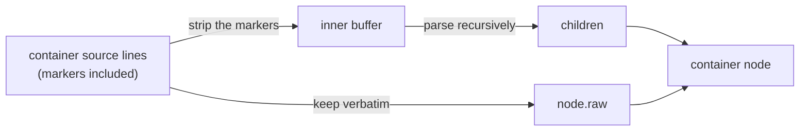

# Syntax Tree — Design Spec

## 1. What this is

The CST is the data structure the whole editor is built on: a tree of block nodes parsed from GFM Markdown, from which the original source can be reproduced **byte for byte**.

```
serialize(parse(source)) === source     for all valid GFM
```

It's a _concrete_ syntax tree, not an abstract one. The distinction is not pedantry, it's the entire point. An AST throws away the bytes and keeps the meaning; you can render it, but you can't reproduce the file. A CST keeps the bytes. **Every node stores its own source text verbatim, markers included, in a field called `raw`.** Metadata (a heading's level, a fence's marker character) is extracted _alongside_ `raw`, and takes no part in serialization.

Which makes serialization trivial by construction: **glue the `raw` fields back together.** No delimiter styles to remember, no spacing to guess at, no canonical form to normalize into. If the parser mis-reads something, the worst case is bad styling, never a corrupted file.

## 2. The shape of it

A tree with three categories of node:

- **Document.** The root. Holds children plus `prefix`/`suffix` for the document's leading and trailing whitespace.
- **Container blocks.** They hold children: blockquote, list, listItem, table, tableRow, and any plugin- or directive-authored container.
- **Leaf blocks.** Everything else. No children.

Every node carries `leadingTrivia` (the blank lines before it, in its parent's context) and `raw` (its full source text). Between those two fields, `Document.prefix`/`suffix`, and containers' `innerPrefix`/`innerSuffix`, **every whitespace character in the source is accounted for by exactly one node.** That is the round-trip guarantee, stated as an invariant.

### The one thing that surprises people

A container's `raw` holds the whole subtree's source. Its children hold slices of the _inner_ content. So the two are **redundant, not additive.**

```
> Hello
> World
```

parses to a blockquote whose `raw` is the full two lines, `> ` prefixes and all, and whose single paragraph child has `raw` of `Hello\nWorld`, with no `> `.

Parsing a container is **strip-and-recurse**: strip the container syntax off each line, parse the stripped buffer with the same algorithm, keep the original un-stripped lines as the container's `raw`.



Serialization therefore **never recurses**. It concatenates the document's prefix, then each top-level child's `leadingTrivia + raw`, then the suffix, and stops. The subtree is already in there.

The flip side: an edit _inside_ a container must write the container's `raw` back from its children before it means anything. That is `rebuildRaw` on the container's descriptor, dispatched up the whole ancestry chain. Skip it and `raw` silently disagrees with the children, and the document you save is the one you had before the edit.

That dispatch is a per-keystroke write-amplification of ≈ chain-depth ÷ 2 (each ancestor re-materializes everything from its level inward). `container-raw.bench.ts` (deep-nesting axis) measures it, and the variable is bytes re-materialized, not depth: ≈2 µs/KB holds across the whole axis, so the same depth 8 costs microseconds when the containers are small and single-digit milliseconds at 50 KB/level, while an adversarial depth 16 × 100 KB reaches tens of milliseconds (the `ancestryRebuild` rows of `src/lib/test/perf/baseline.json`, recorded machine). The Σ over levels is where the depth²·bytes shape comes from; real documents keep the byte term tiny, so a nested keystroke stays in the viewport-bounded floor class. The redundancy was weighed and kept, and `container-raw.bench.ts` is the standing evidence.

### Node shape

All nodes are **mutable plain objects.** The `CstNode` type is used everywhere: the parser produces it, the editor mutates it in place, serialization reads it. There is no immutable→mutable conversion step and no class hierarchy.

`CstNode` is a **discriminated union**: a per-kind arm for each built-in block (metadata typed to the kind, container fields only on containers) plus one open `PluginBlockNode` arm whose branded-string `kind` keeps the plugin surface unbounded. `switch (node.kind)` narrows a built-in node to its arm and reads that kind's metadata with no cast; the branded arm blocks discrimination on the full union, so `isBuiltinBlockNode` is the door into narrowing. A block's type changing (paragraph → heading as you type `## `) never rewrites `kind` in place. The re-parse transfer mints a fresh node and splices it into the slot (§8 of editor.md), the single funnel that lets the union hold everywhere. Constructing a node from a runtime kind goes through `makeBlockNode`, the one sanctioned mint cast.

The fields, by category:

| Field                  | On                                            | Meaning                                                                                                                                                                               |
| ---------------------- | --------------------------------------------- | ------------------------------------------------------------------------------------------------------------------------------------------------------------------------------------- |
| `kind`                 | every node                                    | `AnyBlockKind` — the built-in union plus branded plugin kinds. Every registry lookup keys off it.                                                                                     |
| `raw`, `leadingTrivia` | every node                                    | The serialization truth.                                                                                                                                                              |
| `metadata`             | most kinds                                    | Derived from `raw`; never participates in round-trip. Typed to the kind once `switch (node.kind)` narrows; `metadataOf` is the funnel for un-narrowed reads.                          |
| `children`             | containers                                    | The decomposition of the inner content.                                                                                                                                               |
| `innerPrefix`          | containers declaring an opener-line body wrap | The line the wrap peels against the opener (the `:::` / `<details>` family). A wrap-less container — blockquote, list, list item — parses it empty, and G1.5 fails one that fills it. |
| `innerSuffix`          | containers                                    | Whitespace inside the container, after its last child.                                                                                                                                |
| `childIds`             | containers                                    | Stable per-child IDs for keyed rendering. Carried on the node, so undo restores them with `children`.                                                                                 |
| `ownerEpoch`           | every node                                    | The structural-sharing mark: does a live undo snapshot still share this node? See `editor.md` § Undo / redo.                                                                          |

`childIds` and `ownerEpoch` are editor-level, not source-level. They are not part of the round-trip and a parser consumer can ignore them entirely. That split is itself a type: readers outside the mutation layers hold bytes-readonly node views (`core/node-views.ts`) that keep the serialized fields immutable while leaving this bookkeeping writable.

**Inline content is not a node field.** Prose kinds get an inline tree, but it is derived from `raw` and computed lazily on read, never stored on the node, never serialized. (Why: a reactive cache field on the node once corrupted keyed rendering. `editor.md` § Reactive state plumbing carries the scar.)

### The container contract

Containers do not all relate to their children the same way, so each declares a `containerContract` on its block-kind descriptor. **There are three**, and a new container kind must pick one:

| Contract   | `raw` ↔ children                                                                                                                   | Kinds                                 |
| ---------- | ---------------------------------------------------------------------------------------------------------------------------------- | ------------------------------------- |
| `'strip'`  | `strip(raw) === serialize(children)` — the container syntax is a strippable prefix on each line                                    | blockquote, list, listItem            |
| `'grid'`   | Cells parse straight from `raw`; there is no strippable prefix. Children are coordinate-addressed                                  | table, tableRow                       |
| `'opaque'` | `raw` is authoritative and is _not_ a strip decomposition — chrome lives in the container's own bytes (a title on the opener line) | directive containers, plugin callouts |

Only `'strip'` carries the secondary invariant. `'grid'` and `'opaque'` are exempt from it, but for different reasons and with different consequences:

- **Grid** children are addressed by coordinate (row, cell), not by stripping. That's why table cells are `contextDependentKind`: a cell has no standalone line recognizer, so `parse(cell.raw)` would come back a paragraph. Its container's `rebuildRaw` owns the surrounding pipes.

  One accepted grid normalization: GFM (§4.10) ignores body cells beyond the header width, so the parser truncates a wider row's children to the column count while the row's `raw` keeps the authored bytes. A pure load-and-save round-trips the surplus untouched; the first table edit rebuilds the row from its children and drops it. Preserving the surplus would need phantom children or a `raw` that disagrees with `children`, both of which break CST-is-source-of-truth, so the truncation normalizes on first edit like padding and delimiter normalization. The dropped cells never entered the model and never rendered.

- **Opaque** containers keep bytes in their own `raw` that appear in no child at all. A callout's title lives on its `:::note My title` opener line. So `rebuildRaw` is the _single_ reconstruction path, and correctness is enforced differently: a DEV probe runs the rebuild twice and compares the outputs to each other (never against `raw`, which a faithful non-canonical parse may legally differ from), and a separate DEV check reparses `raw` to catch children mutated without a rebuild.

The reason this matters to a plugin author rather than being trivia: get the contract wrong and the machinery will helpfully "fix" your container in ways that destroy it. An opaque container declared `'strip'` will have its chrome bytes checked against a decomposition that doesn't exist.

### Why `unrecognized` exists but is never produced

`unrecognized` is a real kind with a real merge role, and **no parser path emits it.** `paragraph` is the total fallback: any line the block openers don't claim gets absorbed into a paragraph, which round-trips losslessly by storing the bytes in `raw` like anything else. Markdown has no malformed-input case that needs a tree-sitter-style error node.

The kind is kept as a _contract_: a syntax the parser doesn't know can land as `unrecognized`, round-trip by `raw` like any block, and graduate to its own kind when support is added, with no data loss at any stage. It is a promise about the future, not a thing that happens today.

## 3. Parser design

### Algorithm

A single-pass, line-oriented scanner. It splits the source into lines and matches each against registered block openers in priority order. Kinds declare `{priority, tryOpen, interruptsParagraph}` on the schema's opener registry, and both the dispatch order _and_ the paragraph-interrupt continuation scan derive from those declarations, so a plugin opener is a first-class citizen of the same ladder, not a special case bolted onto the end.

The built-in priorities, in order:

1. Fenced code → consume until a matching close fence, or EOF
2. ATX heading
3. Thematic break (a `---` after paragraph text is consumed as a setext underline first)
4. Blockquote → strip and recurse
5. List item → strip and recurse
6. Indented code (cannot interrupt a paragraph, since an open paragraph absorbs the indented line as lazy continuation first; after any non-paragraph block it opens with no blank line needed)
7. HTML block
8. Link reference definition
9. Nothing claimed it → start a paragraph and consume continuation lines (this arm also detects setext headings and tables)

### Blank lines

One blank line separates two blocks and becomes the next block's `leadingTrivia`. **Every further blank line in the run is an empty paragraph block of its own**, holding that line's exact bytes, a whitespace-only line included. A document-leading run has nothing to separate from, so it materializes in full and `Document.prefix` stays empty; a lone trailing blank line is still `Document.suffix`.

That rule is what makes the tree's **shape** a fixed point of `serialize` → `parse`, not just its bytes: a deliberately typed blank line is a block the moment it is typed, and reloads as the same block. Every construct that separates blocks (Enter's split, a block delete, a structural paste) derives its separator from it, so no path can mint a blank line the reload reads differently.

A blank block is therefore simultaneously a block and the separating line of the block below it, and the pair holds exactly ONE separator between them, split across two byte-equivalent shapes. A load puts it on the blank block's own trivia and leaves the follower none; an Enter split puts it on the follower's and leaves the blank block none. Either shape reloads to the same tree; carrying both would reload as a second empty paragraph, and carrying neither would swallow the block. The transition rule follows, in both directions. **When a blank block stops being a blank line, its slot and its follower each owe a separator of their own**, because the one line was doing both jobs. **When a block becomes one, the run it joins gives the second one back**: the count is a property of the whole run, not of one pair, so a run of blank blocks and the block below it hold exactly one separator between them. A run at the document head, or at a plain container's body head, holds none because it separates from nothing, while a chrome or opener line above the body counts as a line and the run keeps one. `node-ops.ts` owns the primitives that settle this (clear a redundant separator, drop a doubled one, restore the slot's at a fill, restore the follower's after the blank line it consumed, settle the run a block turning blank joins), and every splice that changes what precedes a block settles through them. A primitive that derives its own trivia, like `splitNode`'s separator or `deleteNode`'s hand-down, still settles through them afterwards.

One separator has no splice to derive it from: a sublist whose first item is EMPTY. A content-less marker cannot interrupt a paragraph (§ 5.2), so an item reading `- x` followed by an indented bare `- ` reloads as a setext heading, and the marker is the only evidence the item ever existed, so the seam absorb has nothing to fold it into. Both paths that reach the shape (the Enter-then-Tab nesting mint, and emptying the one nested item) settle a blank line above the sublist, which is why nesting an empty item leaves a loose list.

A container inherits the rule through strip-and-recurse. The exception is a container whose body sits between chrome lines of its own (`:::note` … `:::`, `<summary>` … `</details>`): there the blank line against a chrome line is a separator like any other, so it lands in `innerPrefix` / `innerSuffix` while the rest of its run materializes. That distinction is a seam of the plugin API, not a per-kind branch in the parser: the kind declares the wrap it parses with, and the separator settle every splice runs through reads the declaration: inside a wrap, the line a settle frees above the body head is the wrap's own, not spare bytes. A run that IS the whole body sits against both chrome lines and owes a line to each, since the reload takes both peels before it materializes a block.

### Scope boundaries

- **Inline parsing is separate.** The block parser does not parse inline syntax; the editor layer triggers it. See `inline-parsing.md`.
- **No incremental parsing.** Full re-parse every time. It's an optimization that can be added later without architectural change, and the editor's re-parse unit is one block anyway.
- **No error-recovery machinery.** There is nothing to recover _from_, since the paragraph fallback absorbs anything (see above).

## 4. Inline nodes

Inline content is a tree of `InlineNode` objects over a prose block's content range, the part of `raw` after the block-level markers (after `## ` for a heading). Every node carries `start`/`end` byte offsets into the parent block's **own** `raw`, covering its full range _including_ its markers, so the editor can map DOM cursor positions to raw offsets and back.

Inline nodes nest: `**bold *and italic***` is a Strong containing a Text and an Emphasis, which itself contains a Text.

The built-in kinds:

| Kind                  | Fields                                      | Syntax                                                                                                                                     |
| --------------------- | ------------------------------------------- | ------------------------------------------------------------------------------------------------------------------------------------------ |
| `text`                | `text`                                      | Plain text, no markup                                                                                                                      |
| `emphasis`            | `children`                                  | `*text*` or `_text_`                                                                                                                       |
| `strong`              | `children`                                  | `**text**` or `__text__`                                                                                                                   |
| `strikethrough`       | `children`                                  | `~~text~~` (GFM)                                                                                                                           |
| `inlineCode`          | `text`                                      | `` `code` `` — no nested children                                                                                                          |
| `link`                | `children`, `url`, `title?`                 | `[text](url "title")` or `[text][ref]` — reference form reuses the kind                                                                    |
| `image`               | `alt`, `url`, `title?`, `width?`, `height?` | `` or `![alt][ref]`. Size is read from a `\|WxH` hint in the alt (an Obsidian extension, not GFM) and sizes the rendered widget |
| `autolink`            | `url`                                       | `<url>` or a GFM bare URL                                                                                                                  |
| `hardLineBreak`       | —                                           | A trailing `\` or two spaces before `\n`                                                                                                   |
| `escape`              | —                                           | `\<punct>` — a backslash neutralizing the next ASCII-punctuation character                                                                 |
| `entityReference`     | `decoded`                                   | `&name;`, `&#dec;`, `&#xhex;`                                                                                                              |
| `unresolvedReference` | `label`, `refKind`                          | `[text][ref]` / `![alt][ref]` with no matching definition; `refKind` says which form                                                       |
| `rawHtml`             | —                                           | An inline raw HTML tag. Allowlisted tags (`<br>`) render as atomic widgets                                                                 |

**The set is open.** A plugin mints its own inline kind (`PluginInlineKind`, the inline mirror of `PluginBlockKind`) and hooks the scanner on a trigger character. That's how inline math ships. `AnyInlineKind` spans both. An inline kind nobody recognizes falls back to its verbatim source, so bytes survive a plugin being uninstalled.

**Relationship to `raw`:** the inline tree is **derived**, a rendering cache computed lazily on read, validated against `raw` (and the link-reference signature), never used for serialization. The invariant is that concatenating the tree's leaf text and marker syntax reproduces the slice of `raw` it was parsed from.

## 5. GFM coverage

Every GFM block type is implemented with its own kind:

| Block type                 | Kind                      | Notes                                                                  |
| -------------------------- | ------------------------- | ---------------------------------------------------------------------- |
| ATX headings               | `heading`                 | `# ` through `###### `                                                 |
| Setext headings            | `setextHeading`           | Underline-style `===` / `---`                                          |
| Paragraphs                 | `paragraph`               | The fallback for unstructured text                                     |
| Fenced code                | `fencedCode`              | ` ``` ` and `~~~`, with info string                                    |
| Indented code              | `indentedCode`            | 4-space indent                                                         |
| Blockquotes                | `blockquote`              | Strip container, recursive                                             |
| Lists / list items         | `list` / `listItem`       | Ordered, unordered, task checkboxes. Strip containers                  |
| Thematic breaks            | `thematicBreak`           | `---`, `***`, `___`                                                    |
| HTML blocks                | `htmlBlock`               | Raw `<div>`, `<table>`, …                                              |
| Link reference definitions | `linkReferenceDefinition` | `[ref]: url "title"`                                                   |
| Tables                     | `table`                   | GFM pipe syntax. A header/delimiter cell-count mismatch is not a table |
| Unrecognized               | `unrecognized`            | Reserved; not parser-emitted (see § 2)                                 |

Inline: emphasis and strong (`*`, `_`, `**`, `__`), strikethrough, inline code, links, images, autolinks (bare URLs and emails), hard line breaks, and reference-style links and images.

### Pinned divergences from cmark-gfm

Coverage is by block type; agreement with the reference implementation is close but not total. These four differences are pinned, not accidental, and each is byte-safe (round-trip holds either way):

| Source                                  | Here                                      | cmark-gfm                         |
| --------------------------------------- | ----------------------------------------- | --------------------------------- |
| A pipeless line below a table's body    | ends the table; the line is its own block | a one-cell body row               |
| `-` followed by five spaces and content | a list item whose content is that text    | a list item holding indented code |
| A bare `-` on its own line              | a paragraph                               | an empty list item                |
| `- a`, blank line, `- b`                | two sibling `list` nodes                  | one loose list of two items       |

The last one is load-bearing rather than incidental: the blank-line rule above is universal, so a blank line between two top-level blocks is the follower's separator wherever it appears. Folding the two items into one loose list would put that separator inside a node whose reload splits it again, and the tree would stop being a fixed point of serialize → parse.

## 6. Extending the tree

The tree itself is agnostic to kind strings: the parser, the serializer, and the node model don't care whether a kind is built-in or minted this morning. What a new block kind actually needs is three registrations, and all three matter:

1. **A block-kind descriptor** (`registerBlockKind`): merge role, editability, inline support, and, for a container, the contract + raw rebuild as one indivisible group.
2. **A block opener** (`registerBlockOpener`), so the parser can recognize the syntax. Priced against `OPENER_PRIORITIES`, never a bare integer.
3. **A component** (`registerBlockComponent`), so `BlockHost` has something to render. Without it the kind still parses and round-trips; it just renders as a raw-editable text surface.

A syntax with no opener yet can land as `unrecognized` and graduate later with no data loss in between. `design/plugin-contract.md` specifies the surface; `contributing/adding-a-block.md` walks the steps.

## Appendix — the architecture that was rejected

The CST was designed around three phases. Two shipped; the third was evaluated and rejected. _Why isn't the inline tree authoritative?_ is the first question a rich-text-editor person asks, and the answer is load-bearing, so it's written down here rather than left to folklore.

- **Phase 1: blocks with raw source.** Parse GFM into a recursive tree; each node stores its source verbatim. Round-trip by construction.
- **Phase 2: inline parsing.** Prose blocks parse their content into an inline tree, derived from `raw` and re-parsed on every edit. `serialize()` still reads `raw` only. This is where we are, and it is permanent.
- **Phase 3: rejected.** The ownership flip: the inline tree becomes authoritative and `raw` is derived from _it_; block-level structured fields decompose `raw` into semantic fields. This would have enabled tree-based semantic editing and Obsidian-style syntax hiding.

Why it was rejected, after the editing loop had matured enough to judge:

- **Round-trip fidelity.** Phase 2's guarantee is trivial because serialization _is_ concatenation. Tree-as-truth requires the serializer to reproduce exact delimiter styles (`*italic*` vs `_italic_`, `- ` vs `* `), which makes the round-trip an ongoing fight instead of a property.
- **Partial syntax while typing.** `**bold` mid-keystroke is just a string in raw-as-truth. In tree-as-truth it is an invalid tree state that every keystroke has to handle.
- **Semantic editing already works.** Toggle bold = insert `**` around the selection in `raw`. Change heading level = swap the `# ` prefix. The editor already does this. No tree manipulation needed.
- **Syntax hiding never needed the flip.** The one thing Phase 3 promised over Phase 2, hiding markers on unfocus, ships instead as CSS view treatments (the presentation modes: reading, block- and inline-granular preview, and fully live) over the single render path, marker visibility keyed on focus and caret proximity, never a derived-`raw` tree. The feature that seemed to justify the ownership flip arrived without it. The flip stays rejected as a _mechanism_, and its not being required is the strongest vindication of that call.
- **Complexity cost.** Tree↔DOM sync, fragile serialization, and a new bug class, in exchange for that. The editors that took this road (ProseMirror, Slate) pay an enormous complexity tax for it, and they don't have a byte-lossless round-trip to protect.
