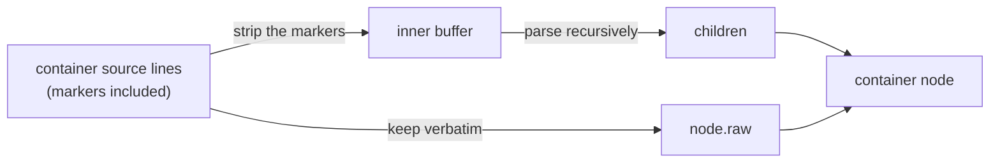

# Syntax tree design spec

## 1. What this is

The CST (concrete syntax tree: a parse tree that keeps every byte) is the data structure the rest of the editor sits on. It's a tree of block nodes parsed from GFM Markdown, built so that

```
serialize(parse(source)) === source     for all valid GFM
```

Why a concrete tree rather than an abstract one is argued in the README's Lossless section; this doc is about the machine itself. The whole trick fits in one sentence: **every node keeps its own source text verbatim, markers included, in a field called `raw`**, and serializing is gluing the `raw` fields back together. Anything else a node knows (a heading's level, a fence's marker character) is extracted alongside `raw` as metadata and never takes part in serialization. So if the parser misreads something, the worst you get is bad styling, never a corrupted file.

In here: the shape of the tree (§ 2), the parser that builds it (§ 3), the inline node model (§ 4), what GFM is covered (§ 5), pointers for extending the tree (§ 6), and, in the appendix, the architecture that was rejected and why.

## 2. The shape of it

Three categories of node:

- **Document.** The root. Holds `children`, plus `prefix`/`suffix` for the document's leading and trailing whitespace.
- **Container blocks.** They hold children: blockquote, list, listItem, table, tableRow, and any container a plugin or a directive adds.
- **Leaf blocks.** Everything else. No children.

Every node carries `leadingTrivia` (the blank lines before it, within its parent) and `raw` (its verbatim source bytes, markers included). A heading, whole:

```ts
parse('# Title\n').children[0];
// { kind: 'heading', leadingTrivia: '', raw: '# Title\n', metadata: { level: 1 } }
```

Between those two fields, `Document.prefix`/`suffix`, and the containers' `innerPrefix`/`innerSuffix`, every whitespace character in the source belongs to exactly one node. The round trip is really just that accounting, kept as an invariant.

### The one thing that surprises people

A container's `raw` holds the whole subtree's source. Its children hold slices of the _inner_ content. The two are **redundant, not additive**:

```
> Hello
> World
```

```ts
parse('> Hello\n> World\n').children[0];
// {
//   kind: 'blockquote', leadingTrivia: '', raw: '> Hello\n> World\n',
//   metadata: { quoteDepth: 1 }, innerPrefix: '', innerSuffix: '',
//   children: [{ kind: 'paragraph', leadingTrivia: '', raw: 'Hello\nWorld\n' }]
// }
```

The quote's `raw` is the full two lines, `> ` prefixes and all. Its one paragraph child got `Hello\nWorld\n`, no `> ` anywhere. Parsing a container is **strip-and-recurse**: strip the container syntax off each line, parse the stripped buffer with the same algorithm, keep the original un-stripped lines as the container's `raw`.



Serialization therefore **never recurses**. It concatenates the document's prefix, then each top-level child's `leadingTrivia + raw`, then the suffix, and stops (`core/serializer.ts` is a handful of lines; `editor.md` § 12 shows it). The subtree is already in there.

The flip side: an edit _inside_ a container means nothing until the container's `raw` is written back from its children. That's `rebuildRaw` on the container's descriptor (descriptor: the per-kind metadata record saying how a kind merges, edits, renders), dispatched up the whole chain of enclosing containers. Skip it and `raw` quietly disagrees with the children, and the document you save is the one you had before the edit. So, don't.

That dispatch is the per-keystroke price of the redundancy: each enclosing container re-emits everything from its own level inward, so a keystroke at depth d rewrites the surrounding bytes roughly d/2 times over. What the price actually comes to:

- The variable is bytes re-materialized, not depth. Roughly 2 microseconds per KB holds across the whole measured axis, and the depth-squared-times-bytes shape only shows up when every level carries real bytes of its own, because the cost is the sum over the levels.
- So the same depth 8 costs microseconds when the containers are small and single-digit milliseconds at 50 KB per level, and an adversarial depth 16 with 100 KB per level reaches tens of milliseconds.
- Real documents keep the byte term tiny, so a nested keystroke costs what any keystroke costs.
- `container-raw.bench.ts` (the deep-nesting axis) is the standing evidence, and the `ancestryRebuild` rows of `src/lib/test/perf/baseline.json` are the recorded numbers, from one machine, so read them as orders of magnitude.

The redundancy was weighed and kept (`performance.md` § Two architectural decisions has the weighing, if you're curious).

### Node shape

All nodes are **mutable plain objects**. One type, `CstNode`, is used everywhere: the parser produces it, the editor mutates it in place, serialization reads it. There's no immutable-to-mutable conversion step and no class hierarchy.

`CstNode` is a **discriminated union**: one branch per built-in block, with metadata typed to the kind (kind: the string on a node that says what block it is) and the container fields only on containers, plus one open `PluginBlockNode` branch whose branded-string `kind` keeps the plugin surface unbounded. `switch (node.kind)` narrows a built-in node to its branch and reads that kind's metadata with no cast. The branded branch blocks discrimination on the full union, though, so `isBuiltinBlockNode` is how you get in:

```ts
const h = parse('## Title\n').children[0];
isBuiltinBlockNode(h); // true
metadataOf(h, 'heading'); // { level: 2 }: the typed read, without narrowing first
headingLevel(h); // 2
makeBlockNode({ kind: 'paragraph', leadingTrivia: '', raw: 'x\n' });
// { kind: 'paragraph', leadingTrivia: '', raw: 'x\n' }
```

Two rules keep the union honest:

- A block's type changing (paragraph to heading as you type `## `) never rewrites `kind` in place. The re-parse creates a fresh node and splices it into the slot (`editor.md` § 8), which is the one entry that lets the union hold everywhere.
- Constructing a node from a runtime kind goes through `makeBlockNode`, the one sanctioned cast.

The fields, by category:

| Field                  | On                                                            | Meaning                                                                                                                                                                                                                   |
| ---------------------- | ------------------------------------------------------------- | ------------------------------------------------------------------------------------------------------------------------------------------------------------------------------------------------------------------------- |
| `kind`                 | every node                                                    | `AnyBlockKind`: the built-in union plus branded plugin kinds. Every registry lookup keys off it.                                                                                                                          |
| `raw`, `leadingTrivia` | every node                                                    | What serialization reads.                                                                                                                                                                                                 |
| `metadata`             | most kinds                                                    | Derived from `raw`; never part of the round trip. Typed to the kind once `switch (node.kind)` narrows; `metadataOf` reads it without narrowing.                                                                           |
| `children`             | containers                                                    | The decomposition of the inner content.                                                                                                                                                                                   |
| `innerPrefix`          | containers whose body opens under an opener line of their own | The blank line the parse peels off between that opener line and the body (the `:::` / `<details>` family). A container with no such line (blockquote, list, list item) parses it empty, and G1.5 fails one that fills it. |
| `innerSuffix`          | containers                                                    | Whitespace inside the container, after its last child.                                                                                                                                                                    |
| `childIds`             | containers                                                    | Stable per-child IDs for keyed rendering (so Svelte reuses each child's component by ID, not by position). Carried on the node, so undo restores them with `children`.                                                    |
| `childSpans`           | containers                                                    | Where each child's bytes sit inside the container's own `raw`, so rewriting one child re-emits one region. Derived; dropped whenever the children change shape.                                                           |
| `ownerEpoch`           | every node                                                    | The structural-sharing mark: does a live undo snapshot still share this node? See `editor.md` § Undo / redo.                                                                                                              |

`innerPrefix` is the one field you won't see on a built-in. With the bundled admonitions plugin installed:

```ts
parse(':::note My title\n\nbody\n:::\n').children[0];
// {
//   kind: 'admonition', raw: ':::note My title\n\nbody\n:::\n', innerPrefix: '\n',
//   children: [
//     { kind: 'admonition-title', leadingTrivia: '', raw: 'My title\n' },
//     { kind: 'paragraph', leadingTrivia: '', raw: 'body\n' }
//   ],
//   innerSuffix: '', ...
// }
```

`childIds`, `childSpans` and `ownerEpoch` are editor bookkeeping, not facts about the source. They play no part in the round trip, and if all you do is parse, you can ignore them. The split even has a type: readers outside the mutation layers hold bytes-readonly node views (`core/node-views.ts`), which keep the serialized fields immutable while leaving the bookkeeping writable.

**Inline content is not a node field.** Prose kinds get an inline tree, but it's derived from `raw`, computed lazily on read, never stored on the node, never serialized. (Why so strict: a reactive cache field on the node once corrupted keyed rendering. `editor.md` § Reactive state plumbing carries the incident.)

### The container contract

Containers don't all relate to their children the same way, so each declares a `containerContract` on its block-kind descriptor. **There are three**, and a new container kind has to pick one:

| Contract   | `raw` vs children                                                                                                                         | Kinds                                 |
| ---------- | ----------------------------------------------------------------------------------------------------------------------------------------- | ------------------------------------- |
| `'strip'`  | `strip(raw) === serialize(children)`: the container syntax is a strippable prefix on each line                                            | blockquote, list, listItem            |
| `'grid'`   | Cells parse straight from `raw`; there is no strippable prefix. Children are addressed by coordinate (row, cell)                          | table, tableRow                       |
| `'opaque'` | `raw` is authoritative and is _not_ a strip decomposition: some bytes live only in the container's own `raw` (a title on the opener line) | directive containers, plugin callouts |

The strip equation, on a quote holding a paragraph and a list:

```ts
const quote = parse('> a\n>\n> - one\n> - two\n').children[0];
quote.raw; // '> a\n>\n> - one\n> - two\n'
concatChildren(quote.children); // 'a\n\n- one\n- two\n', the raw with its `> ` stripped
```

Only `'strip'` carries that equation as a checked invariant. `'grid'` and `'opaque'` are exempt from it, for different reasons and with different consequences:

- **Grid.** A cell has no standalone line recognizer, so `parse(cell.raw)` would come back a paragraph. That's why table cells are `contextDependentKind`, and why the container's `rebuildRaw` owns the surrounding pipes.

  One accepted normalization: GFM (§ 4.10) ignores body cells beyond the header width, so the parser truncates a wider row's children to the column count while the row's `raw` keeps the authored bytes.

  ```ts
  const table = parse('| a | b |\n| - | - |\n| 1 | 2 | 3 |\n').children[0];
  table.children[1].raw; // '| 1 | 2 | 3 |\n': the authored bytes, third cell included
  table.children[1].children.length; // 2: the model holds the header's column count
  ```

  A pure load-and-save round-trips the surplus untouched; the first table edit rebuilds the row from its children and drops it. Preserving the surplus would need phantom children, or a `raw` that disagrees with `children`, and either breaks the tree being the truth. So the truncation normalizes on first edit, like padding and delimiter normalization, and the dropped cells never entered the model and never rendered.

- **Opaque.** Chrome (the parts of a block that are furniture, not content, like a callout's title) lives in the container's own bytes: the title on a `:::note My title` opener line appears in no child at all. So `rebuildRaw` is the _single_ reconstruction path, and correctness is enforced differently: a DEV probe runs the rebuild twice and compares the two outputs to each other (never against `raw`, which a faithful non-canonical parse may legally differ from), and a separate DEV check reparses `raw` to catch children mutated without a rebuild.

Why a plugin author should care, rather than skim: get the contract wrong and the machinery will helpfully "fix" your container in ways that destroy it. An opaque container declared `'strip'` gets its chrome bytes checked against a decomposition that doesn't exist.

### Why `unrecognized` exists but is never produced

`unrecognized` is a real kind with a real merge role, and **no parser path emits it.** `paragraph` is the total fallback: any line the block openers don't claim is absorbed into a paragraph, which round-trips by storing the bytes in `raw` like anything else.

```ts
parse('<<<not a thing\n').children[0];
// { kind: 'paragraph', leadingTrivia: '', raw: '<<<not a thing\n' }
```

Markdown has no malformed-input case that needs a tree-sitter-style error node. The kind is kept as a promise about the future: a syntax the parser doesn't know can land as `unrecognized`, round-trip by `raw` like any block, and graduate to its own kind when support is added, with no data loss at any stage.

## 3. Parser design

### Algorithm

A single-pass, line-oriented scanner. It splits the source into lines and matches each against the registered block openers (opener: the part of the parser that recognizes the syntax a block starts with) in priority order. Kinds declare `{priority, tryOpen, interruptsParagraph}` on the opener registry (`schema/block-openers.ts`), and both the dispatch order _and_ the paragraph-interrupt continuation scan derive from those declarations, so a plugin opener is a first-class citizen of the same ladder rather than a special case bolted onto the end.

```ts
OPENER_PRIORITIES; // schema/opener-priorities.ts; lower dispatches first, ties break by kind name
// { fencedCode: 10, heading: 20, thematicBreak: 30, blockquote: 40,
//   list: 50, indentedCode: 60, htmlBlock: 70, linkReferenceDefinition: 80 }
```

The built-in priorities, in order, with the notes that matter:

1. Fenced code: consume until a matching close fence, or EOF
2. ATX heading (the `# ` style)
3. Thematic break (a `---` after paragraph text is consumed as a setext underline first; setext is the other heading style, text with `===` or `---` under it)
4. Blockquote: strip and recurse
5. List item: strip and recurse
6. Indented code (can't interrupt a paragraph, since an open paragraph absorbs the indented line as lazy continuation first, the spec's term for a paragraph swallowing the next line as plain text; after any non-paragraph block it opens with no blank line needed)
7. HTML block
8. Link reference definition
9. Nothing claimed it: start a paragraph and consume continuation lines (this fallback also detects setext headings and tables)

Number 1 in action, on a fence nobody closed:

````ts
parse('```\nx\n').children[0];
// { kind: 'fencedCode', leadingTrivia: '', raw: '```\nx\n',
//   metadata: { fenceMarker: '`', fenceLength: 3, info: '', closed: false } }
````

### Blank lines

The most-cited corner of the doc, so take it slow. The rule: one blank line between two blocks is the separator, and it folds into the next block's `leadingTrivia`. **Every further blank line in the run is an empty paragraph block of its own**, holding that line's exact bytes, whitespace-only lines included.

```ts
parse('a\n\n\n\nb\n').children;
// [
//   { kind: 'paragraph', leadingTrivia: '',   raw: 'a\n' },
//   { kind: 'paragraph', leadingTrivia: '\n', raw: '\n' },   the separator, then a blank block
//   { kind: 'paragraph', leadingTrivia: '',   raw: '\n' },   another blank block
//   { kind: 'paragraph', leadingTrivia: '',   raw: 'b\n' }
// ]
```

A document-leading run has nothing to separate from, so all of it materializes as blocks and `Document.prefix` stays empty; a lone trailing blank line is still `Document.suffix`:

```ts
parse('\n# Title\n\n');
// { prefix: '', suffix: '\n', children: [
//   { kind: 'paragraph', leadingTrivia: '', raw: '\n' },
//   { kind: 'heading', leadingTrivia: '', raw: '# Title\n', metadata: { level: 1 } }
// ] }
```

That rule is what makes the tree's **shape** a fixed point of serialize-then-parse, not just its bytes. A blank line you typed on purpose is a block the moment you type it, and it reloads as the same block. Every construct that separates blocks (Enter's split, a block delete, a structural paste) derives its separator from the same rule, so no path can produce a blank line the reload reads differently.

A blank block is therefore doing two jobs at once: it's a block, and it's the separating line of the block below it. The consequences, one at a time:

- **The pair holds exactly ONE separator between them, and there are two byte-equivalent places to keep it.** A load puts it on the blank block's own trivia and leaves the follower none (that's the snippet above); an Enter split puts it on the follower's and leaves the blank block none. Either shape reloads to the same tree. Carrying both would reload as a second empty paragraph; carrying neither would swallow the block.
- **When a blank block stops being a blank line, its slot and its follower each owe a separator of their own**, because the one line was doing both jobs.
- **When a block becomes blank, the run it joins gives the second one back.** The count is a property of the whole run, not of one pair: a run of blank blocks and the block below it hold exactly one separator between them.
- A run at the document head, or at the head of a plain container's body, holds none, because it separates from nothing. A chrome or opener line above the body counts as a line, so under one the run keeps its separator.

`node-ops.ts` owns the primitives that settle this (to settle: re-derive the blank-line separators after a splice): clear a separator that went redundant, drop a doubled one, restore the slot's own at a fill, restore the follower's after the blank line it consumed, and settle the run a block joins by turning blank. Every splice that changes what precedes a block settles through them, and a primitive that derives its own trivia, like `splitNode`'s separator or `deleteNode`'s hand-down, still settles through them afterwards.

One separator has no splice to derive it from: a sublist whose first item is empty. A content-less list marker can't interrupt a paragraph (GFM § 5.2, list items), so an item reading `- x` followed by an indented bare `- ` reloads as `x` with a `-` underline, which is a setext heading. The marker is the only evidence the item ever existed, and the merge that absorbs boundary lines has nothing to fold it into. Both paths that reach the shape (the Enter-then-Tab nesting move, and emptying the one item of a sublist) settle a blank line above the sublist, which is why nesting an empty item leaves a loose list (loose: a list whose items render with paragraph spacing, because a blank line sits inside it).

A container inherits all of this through strip-and-recurse. The exception is a container whose body sits between chrome lines of its own (`:::note` ... `:::`, `<summary>` ... `</details>`): there the blank line against a chrome line is a separator like any other, so it lands in `innerPrefix` / `innerSuffix` while the rest of its run materializes. The kind declares the wrap it parses with and the separator settle reads that declaration, which makes this a property of the plugin API rather than a per-kind branch in the parser: inside a wrap, the line a settle frees above the body head belongs to the wrap, not to the run. A run that is the whole body sits against both chrome lines and owes a line to each, since a reload peels both before it materializes any block.

### Scope boundaries

- **Inline parsing is separate.** The block parser doesn't parse inline syntax; the editor layer triggers it. See `inline-parsing.md`.
- **No incremental parsing.** Full re-parse every time. It could be added later without architectural change, and the editor's re-parse unit is one block anyway, so nobody has needed it.
- **No error-recovery machinery.** There's nothing to recover _from_; the paragraph fallback absorbs anything (see above).

## 4. Inline nodes

Inline content is a tree of `InlineNode` objects over a prose block's content range, the part of `raw` after the block-level markers (after `## ` for a heading). Every node carries `start`/`end` byte offsets into the parent block's **own** `raw`, covering its full range _including_ its markers, so the editor can map DOM cursor positions to raw offsets and back.

Inline nodes nest. `**bold *and italic***` is a strong containing a text and an emphasis, which itself contains a text:

```ts
parseInline('**bold *and italic***', 0, 21);
// [{ kind: 'strong', start: 0, end: 21, children: [
//   { kind: 'text', start: 2, end: 7, text: 'bold ' },
//   { kind: 'emphasis', start: 7, end: 19, children: [
//     { kind: 'text', start: 8, end: 18, text: 'and italic' }
//   ] }
// ] }]
```

The built-in kinds:

| Kind                  | Fields                                      | Syntax                                                                                                                                       |
| --------------------- | ------------------------------------------- | -------------------------------------------------------------------------------------------------------------------------------------------- |
| `text`                | `text`                                      | Plain text, no markup                                                                                                                        |
| `emphasis`            | `children`                                  | `*text*` or `_text_`                                                                                                                         |
| `strong`              | `children`                                  | `**text**` or `__text__`                                                                                                                     |
| `strikethrough`       | `children`                                  | `~~text~~` (GFM)                                                                                                                             |
| `inlineCode`          | `text`                                      | `` `code` ``; never has children                                                                                                             |
| `link`                | `children`, `url`, `title?`                 | `[text](url "title")` or `[text][ref]`; the reference form reuses the kind                                                                   |
| `image`               | `alt`, `url`, `title?`, `width?`, `height?` | `` or `![alt][ref]`. Size is read from a `\|WxH` hint in the alt (an Obsidian extension, not GFM) and sizes the rendered widget   |
| `autolink`            | `url`                                       | `<url>` or a GFM bare URL                                                                                                                    |
| `hardLineBreak`       | none                                        | A trailing `\` or two spaces before `\n`                                                                                                     |
| `escape`              | none                                        | `\<punct>`: a backslash neutralizing the next ASCII-punctuation character                                                                    |
| `entityReference`     | `decoded`                                   | `&name;`, `&#dec;`, `&#xhex;`                                                                                                                |
| `unresolvedReference` | `label`, `refKind`                          | `[text][ref]` / `![alt][ref]` with no matching definition; `refKind` says which form it would have been                                      |
| `rawHtml`             | none                                        | An inline raw HTML tag. Allowlisted tags (`<br>`) render as atomic widgets (non-editable islands; `inline-parsing.md` § Widget render paths) |

**The set is open.** A plugin registers its own inline kind (`PluginInlineKind`, the inline mirror of `PluginBlockKind`) and hooks the scanner on a trigger character; that's how inline math ships. `AnyInlineKind` spans both. An inline kind nobody recognizes falls back to its verbatim source, so bytes survive a plugin being uninstalled.

**Relationship to `raw`:** the inline tree is **derived**, a rendering cache computed lazily on read and never used for serialization. The cache is checked against the block's `raw` and against the document's link-reference signature (a string built from every `[label]: url` definition in the document, so a definition edit anywhere invalidates every reference-bearing block). The invariant: concatenating the tree's leaf text and marker syntax reproduces the slice of `raw` it was parsed from.

## 5. GFM coverage

Every GFM block type is implemented with its own kind:

| Block type                 | Kind                      | Notes                                                                  |
| -------------------------- | ------------------------- | ---------------------------------------------------------------------- |
| ATX headings               | `heading`                 | `# ` through `###### `                                                 |
| Setext headings            | `setextHeading`           | Underline-style `===` / `---`                                          |
| Paragraphs                 | `paragraph`               | The fallback for unstructured text                                     |
| Fenced code                | `fencedCode`              | ` ``` ` and `~~~`; the info string is the text after the opening fence |
| Indented code              | `indentedCode`            | 4-space indent                                                         |
| Blockquotes                | `blockquote`              | Strip container, recursive                                             |
| Lists / list items         | `list` / `listItem`       | Ordered, unordered, task checkboxes. Strip containers                  |
| Thematic breaks            | `thematicBreak`           | `---`, `***`, `___`                                                    |
| HTML blocks                | `htmlBlock`               | Raw `<div>`, `<table>`, ...                                            |
| Link reference definitions | `linkReferenceDefinition` | `[ref]: url "title"`                                                   |
| Tables                     | `table`                   | GFM pipe syntax. A header/delimiter cell-count mismatch is not a table |
| Unrecognized               | `unrecognized`            | Reserved; not parser-emitted (see § 2)                                 |

Inline: emphasis and strong (`*`, `_`, `**`, `__`), strikethrough, inline code, links, images, autolinks (bare URLs and emails), hard line breaks, and reference-style links and images.

The table row's mismatch note, since it bites:

```ts
parse('| a | b |\n| - |\n').children.map((c) => c.kind); // ['paragraph']
```

### Pinned divergences from cmark-gfm

Coverage is by block type; agreement with the reference implementation is close but not total. These four differences are pinned, not accidental, and each is byte-safe (the round trip holds either way):

| Source                                  | Here                                      | cmark-gfm                         |
| --------------------------------------- | ----------------------------------------- | --------------------------------- |
| A pipeless line below a table's body    | ends the table; the line is its own block | a one-cell body row               |
| `-` followed by five spaces and content | a list item whose content is that text    | a list item holding indented code |
| A bare `-` on its own line              | a paragraph                               | an empty list item                |
| `- a`, blank line, `- b`                | two sibling `list` nodes                  | one loose list of two items       |

```ts
parse('| a |\n| - |\n| 1 |\nplain\n').children.map((c) => c.kind); // ['table', 'paragraph']
parse('-     text\n').children[0].children[0].children[0].raw; // 'text\n'
parse('-\n').children.map((c) => c.kind); // ['paragraph']
parse('- a\n\n- b\n').children.map((c) => c.kind); // ['list', 'list']
```

The last one falls out of the design rather than being a preference: the blank-line rule above is universal, so a blank line between two top-level blocks is the follower's separator wherever it appears. Folding the two items into one loose list would put that separator inside a node whose reload splits it again, and the tree would stop being a fixed point of serialize-then-parse.

## 6. Extending the tree

The tree itself doesn't care about kind strings: the parser, the serializer, and the node model treat a kind registered this morning like a built-in. A new block kind is three registrations, a block-kind descriptor (`registerBlockKind`), an opener (`registerBlockOpener`), and a component (`registerBlockComponent`); `design/plugin-contract.md` specifies the surface, and `contributing/adding-a-block.md` walks the steps. That's the whole section, the detail lives there.

## Appendix: the architecture that was rejected

The CST was designed around three phases. Two shipped; the third was evaluated and rejected. _Why isn't the inline tree authoritative?_ is the first question a rich-text-editor person asks, and the answer decided the architecture, so it's written down here rather than left to folklore.

- **Phase 1: blocks with raw source.** Parse GFM into a recursive tree; each node stores its source verbatim. Round-trip by construction.
- **Phase 2: inline parsing.** Prose blocks parse their content into an inline tree, derived from `raw` and re-parsed on every edit. `serialize()` still reads `raw` only. This is where we are, and it's permanent.
- **Phase 3: rejected.** The ownership flip: the inline tree becomes authoritative and `raw` is derived from _it_; block-level structured fields decompose `raw` into semantic fields. This would have enabled tree-based semantic editing and Obsidian-style syntax hiding.

Why it was rejected, once the editing loop had matured enough to judge:

- **Round-trip fidelity.** Phase 2's guarantee is trivial because serialization _is_ concatenation. Tree-as-truth requires the serializer to reproduce exact delimiter styles (`*italic*` vs `_italic_`, `- ` vs `* `), which turns the round trip from a property into an ongoing fight.
- **Partial syntax while typing.** `**bold` mid-keystroke is just a string in raw-as-truth. In tree-as-truth it's an invalid tree state that every keystroke has to handle.
- **Semantic editing already works.** Toggle bold = insert `**` around the selection in `raw`. Change heading level = swap the `# ` prefix. The editor already does this. No tree manipulation needed.
- **Syntax hiding never needed the flip.** The one thing Phase 3 promised over Phase 2, hiding markers on unfocus, ships instead as CSS view treatments (the presentation modes: reading, block- and inline-granular preview, and fully live) over the single render path, marker visibility keyed on focus and caret proximity, never a derived-`raw` tree. The feature that seemed to justify the flip arrived without it, which is about as strong a vindication as a call gets.
- **Complexity cost.** Tree-DOM sync, fragile serialization, and a new bug class, in exchange for the above. The editors that took this road (ProseMirror, Slate) pay an enormous complexity tax for it, and they don't even have a byte-lossless round trip to protect.
