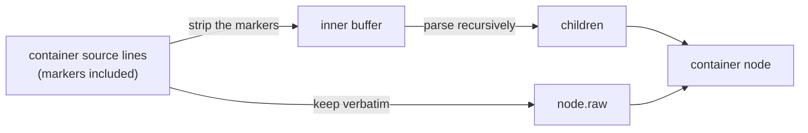

# Syntax tree design spec

## 1. What this is

The CST (concrete syntax tree: a parse tree that keeps every byte) is the data structure the rest of the editor sits on. It's a tree of block nodes parsed from GFM Markdown, built so that

```
serialize(parse(source)) === source     for all valid GFM
```

Why a concrete tree and not an abstract one is the README's Lossless section; this doc is about the machine itself. The whole trick fits in one sentence: **every node keeps its own source text, markers included, in a field called `raw`**, and serializing is gluing the `raw` fields back together. Anything else a node knows (a heading's level, a fence's marker character) is read out of `raw` into `metadata`, and serializing never looks at it.

In here:

1. the shape of the tree, and the one thing about it that surprises people (§ 2)
2. the parser that builds it, including the blank-line rules everyone ends up asking about (§ 3)
3. the inline nodes inside a paragraph or heading (§ 4)
4. which GFM is covered, and where we knowingly disagree with the reference parser (§ 5)
5. where to go to add a block kind (§ 6)
6. and, in the appendix, the architecture we didn't build, and why

## 2. The shape of it

Three categories of node:

- **Document.** The root. Holds `children`, plus `prefix`/`suffix` for the document's leading and trailing whitespace.
- **Container blocks.** They hold children: blockquote, list, listItem, table, tableRow, and any container a plugin or a directive adds.
- **Leaf blocks.** Everything else. No children.

Every node carries `leadingTrivia` (the blank lines before it, within its parent) and `raw` (its verbatim source bytes, markers included). A heading, whole:

```ts
parse('# Title\n').children[0];
// { kind: 'heading', leadingTrivia: '', raw: '# Title\n', metadata: { level: 1 } }
```

Between those two fields, `Document.prefix`/`suffix`, and the containers' `innerPrefix`/`innerSuffix`, every whitespace character in the source belongs to exactly one node. The round trip is really just that bookkeeping, kept honest.

### The one thing that surprises people

A container's `raw` holds the whole subtree's source. Its children hold slices of the _inner_ content. The two are **redundant, not additive**:

```
> Hello
> World
```

```ts
parse('> Hello\n> World\n').children[0];
// {
//   kind: 'blockquote', leadingTrivia: '', raw: '> Hello\n> World\n',
//   metadata: { quoteDepth: 1 }, innerPrefix: '', innerSuffix: '',
//   children: [{ kind: 'paragraph', leadingTrivia: '', raw: 'Hello\nWorld\n' }]
// }
```

The quote's `raw` is the full two lines, `> ` prefixes and all. Its one paragraph child got `Hello\nWorld\n`, no `> ` anywhere. Parsing a container is **strip-and-recurse**: strip the container syntax off each line, parse the stripped buffer with the same algorithm, keep the original un-stripped lines as the container's `raw`.


```mermaid
flowchart LR
    A["container source lines<br/>(markers included)"] -->|strip the markers| B["inner buffer"]
    B -->|parse recursively| C["children"]
    A -->|keep verbatim| D["node.raw"]
    C & D --> E["container node"]
```

So serialization **never recurses**. It writes the document's prefix, then each top-level child's `leadingTrivia + raw`, then the suffix, and stops; the subtree is already in there (`core/serializer.ts` is a handful of lines, and `editor.md` § 12 shows it).

The flip side: an edit _inside_ a container means nothing until the container's `raw` is written back from its children. That's `rebuildRaw`, on the container's descriptor (the per-kind record saying how a kind merges, edits and renders), run up the whole chain of enclosing containers. Skip it and `raw` quietly disagrees with the children, and the document you save is the one you had before the edit. So, don't.

That rebuild is the price of the redundancy, and it's paid in bytes, not depth. A structural edit rewrites every enclosing container's bytes, which in a document nested d deep comes to roughly d/2 copies of the outermost one. Typing pays less: a container that knows which child changed rewrites only that child's stretch of its `raw` (`editor.md` § 9). Real documents don't stack megabytes at every level, so in practice a keystroke inside a list costs what a keystroke anywhere costs. The measurements, and why the redundancy was kept, are in `performance.md` § Two architectural decisions, if you're curious.

### Node shape

All nodes are **mutable plain objects**. One type, `CstNode`, is used everywhere: the parser produces it, the editor mutates it in place, serialization reads it. There's no immutable-to-mutable conversion step and no class hierarchy.

A node's **kind** is the string on it that says what block it is (`'heading'`, `'blockquote'`). `CstNode` is a **discriminated union** over it: one branch per built-in kind, each with its own metadata type and with the container fields only on containers, plus one open `PluginBlockNode` branch whose `kind` is a branded string, so plugins can add as many kinds as they like. Inside the built-ins, `switch (node.kind)` narrows to a branch and reads its metadata with no cast. The branded branch stops TypeScript from narrowing the full union that way, though, so `isBuiltinBlockNode` is how you get in:

```ts
const h = parse('## Title\n').children[0];
isBuiltinBlockNode(h); // true
metadataOf(h, 'heading'); // { level: 2 }: the typed read, without narrowing first
headingLevel(h); // 2
makeBlockNode({ kind: 'paragraph', leadingTrivia: '', raw: 'x\n' });
// { kind: 'paragraph', leadingTrivia: '', raw: 'x\n' }
```

Two rules keep the union honest:

- A block changing kind (paragraph to heading as you type `## `) never has `kind` rewritten in place. The re-parse makes a fresh node and puts it in the old one's slot (`editor.md` § 8), so no node ever carries one branch's kind with another branch's metadata.
- Building a node from a kind only known at runtime goes through `makeBlockNode`, the one allowed cast.

The fields, by category:

| Field                  | On                                                            | Meaning                                                                                                                                                                                                                                               |
| ---------------------- | ------------------------------------------------------------- | ----------------------------------------------------------------------------------------------------------------------------------------------------------------------------------------------------------------------------------------------------- |
| `kind`                 | every node                                                    | `AnyBlockKind`: the built-in union plus branded plugin kinds. Every registry lookup keys off it.                                                                                                                                                      |
| `raw`, `leadingTrivia` | every node                                                    | What serialization reads.                                                                                                                                                                                                                             |
| `metadata`             | most kinds                                                    | Derived from `raw`; never part of the round trip. Typed to the kind once `switch (node.kind)` narrows; `metadataOf` reads it without narrowing.                                                                                                       |
| `children`             | containers                                                    | The decomposition of the inner content.                                                                                                                                                                                                               |
| `innerPrefix`          | containers whose body opens under an opener line of their own | The blank line the parse strips off between that opener line and the body (the `:::` / `<details>` family). A container with no such line (blockquote, list, list item) parses it empty, and a dev check on the node's shape fails one that fills it. |
| `innerSuffix`          | containers                                                    | Whitespace inside the container, after its last child.                                                                                                                                                                                                |
| `childIds`             | containers                                                    | Stable per-child IDs for keyed rendering (so Svelte reuses each child's component by ID, not by position). Carried on the node, so undo restores them with `children`.                                                                                |
| `childSpans`           | containers                                                    | Where each child's bytes sit inside the container's own `raw`, so rewriting one child re-emits one region. Derived; dropped whenever the children change shape.                                                                                       |
| `ownerEpoch`           | every node                                                    | Whether an undo snapshot still shares this node, so a write copies it first. See `editor.md` § Undo / redo.                                                                                                                                           |

`innerPrefix` is the one field you won't see on a built-in. With the bundled admonitions plugin installed:

```ts
parse(':::note My title\n\nbody\n:::\n').children[0];
// {
//   kind: 'admonition', raw: ':::note My title\n\nbody\n:::\n', innerPrefix: '\n',
//   children: [
//     { kind: 'admonition-title', leadingTrivia: '', raw: 'My title\n' },
//     { kind: 'paragraph', leadingTrivia: '', raw: 'body\n' }
//   ],
//   innerSuffix: '', ...
// }
```

`childIds`, `childSpans` and `ownerEpoch` are editor bookkeeping, not facts about the source. They play no part in the round trip, and if all you do is parse, you can ignore them. The split even has a type: code outside the tree-editing layers holds node views (`core/node-views.ts`) whose serialized fields are readonly while the bookkeeping stays writable.

**Inline content is not a node field.** Prose kinds get an inline tree (§ 4), but it's computed from `raw` when something reads it, and never stored on the node (`editor.md` § Reactive state plumbing says why).

### The container contract

Containers don't all relate to their children the same way, so each declares a `containerContract` on its block-kind descriptor. **There are three**, and a new container kind has to pick one:

| Contract   | `raw` vs children                                                                                                                         | Kinds                                 |
| ---------- | ----------------------------------------------------------------------------------------------------------------------------------------- | ------------------------------------- |
| `'strip'`  | `strip(raw) === serialize(children)`: the container syntax is a strippable prefix on each line                                            | blockquote, list, listItem            |
| `'grid'`   | Cells parse straight from `raw`; there is no strippable prefix. Children are addressed by coordinate (row, cell)                          | table, tableRow                       |
| `'opaque'` | `raw` is authoritative and is _not_ a strip decomposition: some bytes live only in the container's own `raw` (a title on the opener line) | directive containers, plugin callouts |

The strip equation, on a quote holding a paragraph and a list:

```ts
const quote = parse('> a\n>\n> - one\n> - two\n').children[0];
quote.raw; // '> a\n>\n> - one\n> - two\n'
concatChildren(quote.children); // 'a\n\n- one\n- two\n', the raw with its `> ` stripped
```

A strip container keeps its metadata on its first line, and nowhere else. A list item's `marker` is the bullet or number plus every space after it, so the spaces count toward the marker, not the paragraph, and the marker's width (plus any spaces in front of the marker) is the column its other lines are indented to:

```ts
parse('-  b\n').children[0].children[0].metadata; // { marker: '-  ', taskItem: false, ... }
parse('- [ ]  b\n').children[0].children[0].metadata.taskMarker; // '[ ]  '
parse('> > a\n').children[0].metadata; // { quoteDepth: 2 }
```

An edit that leaves spaces between an item's marker and its text keeps exactly those bytes, so the item reads the same in the editor as it will after a reload. How, and what it costs, is in `editor.md` § The container `raw` contract.

Only `'strip'` carries that equation as a checked invariant. `'grid'` and `'opaque'` are exempt from it, for different reasons and with different consequences:

- **Grid.** A cell has no line syntax of its own, so `parse(cell.raw)` would come back a paragraph. That's why table cells are `contextDependentKind`, and why the table's `rebuildRaw` owns the pipes around them. To read a table line into cells (and where each one sits), call `core/parsers/table-line.ts :: rowCellSpans`; to write a row back, `core/parsers/table-line.ts :: tableRowLine`.

  A rebuilt row is written into its own old bytes, touching as little as it can:
  - a row whose cells all still match what its bytes read stays exactly as it was, line ending included
  - a changed cell gets its new text inside its old padding. A space you type at a cell's edge is padding to GFM, so the row doesn't write it until a letter follows it
  - adding or removing a column cuts out that one cell, or splices in a padded one, and leaves the others alone. When every column has the same alignment, a new delimiter cell can land at the end of the row instead of where the column went (it reads the same)
  - the delimiter row follows the same rule, so a column whose alignment didn't change keeps its `:--`
  - a cell ending in a backslash keeps a space before the next pipe, since `x\|` would escape it

  Only a line with no bytes of its own (a new row), or one whose rewrite wouldn't read back as its cells (in the editor or in GFM), gets the plain spelling, `| a | b |`. And one exception: a row with no leading pipe whose first cell changes gets pipes too, since `# x` at the start of a line would open a heading, and the table's rebuild doesn't know the block grammar.

  ```ts
  const table = parse('|a|b|\n|-|:-|\n|1|  2  |\n').children[0];
  table.children[1].children[1].raw = '2Q';
  rebuildTableRaw(table);
  table.raw; // '|a|b|\n|-|:-|\n|1|  2Q  |\n': that cell's text moved, nothing else did
  ```

  GFM (§ 4.10) ignores body cells past the header's width. So a wider row's children stop at the column count, and the cells past it live on the row as **surplus**: bytes the file holds that nothing renders.

  ```ts
  const table = parse('| a | b |\n| - | - |\n| 1 | 2 | 3 |\n').children[0];
  table.children[1].raw; // '| 1 | 2 | 3 |\n': the authored bytes, third cell included
  table.children[1].children.length; // 2: the model holds the header's column count
  table.children[1].metadata.surplusCells; // ['3']: the cells past it, as written
  ```

  The row's rebuild writes its surplus back after its rendered cells, so an edit anywhere in the row or the table keeps those bytes (padding too, unless the edit gives a pipe-less row its pipes). A row that becomes the header (the header row deleted, a table split) takes its surplus as columns and the table widens, since a header wider than its delimiter row is no table at all.

- **Opaque.** Chrome (the parts of a block that are furniture, not content, like a callout's title) lives in the container's own bytes: the title on a `:::note My title` opener line appears in no child at all. So `rebuildRaw` is the only way the container's bytes get rebuilt, and two dev-mode checks stand in for the equation. One runs the rebuild twice and compares the two outputs to each other (never to `raw`, which a faithful parse of unusual spelling may legally differ from). The other reparses `raw` to catch children changed without a rebuild, or metadata that no longer matches the bytes.

Why a plugin author should care, rather than skim: get the contract wrong and the editor will helpfully "fix" your container in ways that destroy it. An opaque container declared `'strip'` gets its chrome bytes checked against a decomposition that doesn't exist.

### Why `unrecognized` exists but is never produced

`unrecognized` is a real kind with a real merge role, and **no parser path emits it.** `paragraph` is the total fallback: any line the block openers don't claim is absorbed into a paragraph, which round-trips by storing the bytes in `raw` like anything else.

```ts
parse('<<<not a thing\n').children[0];
// { kind: 'paragraph', leadingTrivia: '', raw: '<<<not a thing\n' }
```

Markdown has no malformed-input case that needs a tree-sitter-style error node. The kind is kept as a promise about the future: a syntax the parser doesn't know can land as `unrecognized`, round-trip by `raw` like any block, and graduate to its own kind when support is added, with no data loss at any stage.

## 3. Parser design

### Algorithm

A single-pass, line-oriented scanner. It splits the source into lines and offers each one to the registered block **openers** in priority order (an opener is the part of the parser that recognizes the syntax a block starts with). A kind registers its opener as `{priority, tryOpen, interruptsParagraph}` (`schema/block-openers.ts`), and both the order openers are tried in and the check for "does this line cut an open paragraph short" are built from those registrations. So a plugin's opener sits in the same priority order as the built-ins, not bolted on at the end.

```ts
OPENER_PRIORITIES; // schema/opener-priorities.ts; lower dispatches first, ties break by kind name
// { fencedCode: 10, heading: 20, thematicBreak: 30, blockquote: 40,
//   list: 50, indentedCode: 60, htmlBlock: 70, linkReferenceDefinition: 80 }
```

The built-in priorities, in order, with the notes that matter:

1. Fenced code: consume until a matching close fence, or EOF
2. ATX heading (the `# ` style)
3. Thematic break (a `---` after paragraph text is consumed as a setext underline first; setext is the other heading style, text with `===` or `---` under it)
4. Blockquote: strip and recurse
5. List item: strip and recurse
6. Indented code. It can't interrupt a paragraph, since an open paragraph takes the indented line first as lazy continuation (the spec's term for a paragraph swallowing the next line as plain text). After any other block it opens with no blank line needed
7. HTML block
8. Link reference definition
9. Nothing claimed it: start a paragraph and consume continuation lines (this fallback also detects setext headings and tables)

Number 1 in action, on a fence nobody closed:

````ts
parse('```\nx\n').children[0];
// { kind: 'fencedCode', leadingTrivia: '', raw: '```\nx\n',
//   metadata: { fenceMarker: '`', fenceLength: 3, info: '', closed: false } }
````

The fence grammar lives in one file, `core/parsers/fence-syntax.ts`, and everything that reads a fence goes through it. The parser finds a closer with `findFenceCloser` (via `core/parsers/fenced-code.ts :: scanFence`), and the code block's renderer and caret rules read a block's opener, body and closer with `fenceAnatomy`. The fence write rule (`schema/fenced-code-raw.ts`) keeps that shape legal, one opener line and one closer line, through every write into the block, typing included. The plugin kinds with a fence of their own (the math fence, mermaid) declare the same rule as their `rawWrite`, so a closer-shaped line typed into their body can't split them either.

### Blank lines

The most-cited corner of the doc, so take it slow. The rule: one blank line between two blocks is the **separator**, and it goes in the next block's `leadingTrivia`. **Every further blank line in the run is an empty paragraph block of its own**, holding that line's exact bytes, whitespace-only lines included. Whitespace here means spaces and tabs (GFM § 2.1), so a line holding a non-breaking space is text, not a blank line.

```ts
parse('a\n\n\n\nb\n').children;
// [
//   { kind: 'paragraph', leadingTrivia: '',   raw: 'a\n' },
//   { kind: 'paragraph', leadingTrivia: '\n', raw: '\n' },   the separator, then a blank block
//   { kind: 'paragraph', leadingTrivia: '',   raw: '\n' },   another blank block
//   { kind: 'paragraph', leadingTrivia: '',   raw: 'b\n' }
// ]
```

A run at the very top of the document has nothing to separate from, so all of it becomes blocks and `Document.prefix` stays empty. A lone trailing blank line is still `Document.suffix`:

```ts
parse('\n# Title\n\n');
// { prefix: '', suffix: '\n', children: [
//   { kind: 'paragraph', leadingTrivia: '', raw: '\n' },
//   { kind: 'heading', leadingTrivia: '', raw: '# Title\n', metadata: { level: 1 } }
// ] }
```

Why bother? Because it makes the tree's **shape** survive a save and reload, not just its bytes. A blank line you typed on purpose is a block the moment you type it, and it reloads as the same block. Every edit that separates blocks (Enter's split, a block delete, a structural paste) writes its separator by the same rule, so no edit can leave a blank line the reload reads differently.

That means a blank block does two jobs at once: it's a block, and it's the separating line of the block below it. What follows from that:

- **The two hold exactly one separator between them, and it can sit in either of two places.** A load puts it on the blank block's own `leadingTrivia` and gives the follower none (the snippet above); an Enter split puts it on the follower and gives the blank block none. Both serialize to the same bytes and reload to the same tree. Carrying it twice would reload as a second empty paragraph, and carrying it nowhere would swallow the blank block.
- **When a blank block gets text, its slot and its follower each need a separator of their own**, since the one line was doing both jobs.
- **When a block turns blank, the run it joins gives one separator back.** The count belongs to the whole run, not to one pair: a run of blank blocks and the block below it hold exactly one separator between them.
- A run at the top of the document, or at the top of a plain container's body, holds none, because there's nothing above it to separate from. A title or fence line above a body counts as something, so under one the run keeps its separator.

#### The last line

The last line is the one line allowed to have no line ending, and a file saved without a final line break keeps it that way through any structural edit and through typing (an inline paste still adds one, for now). The commit ends the lines of every block an edit places, then takes the break back off whichever block ends up last (`docs/design/editor.md` § The commit primitive).

One exception, on purpose: when the new last line is blank, it keeps its break, since a blank line is nothing but its break and dropping it would drop the block too. That covers Enter at the very end, ArrowDown past the last block, an empty inserted paragraph, and the empty line Enter leaves in a last quote or list item.

#### Where the separators get fixed up

`tree-operations/settle.ts` holds the helpers that re-derive separators after a splice:

- clear a separator that became redundant
- drop a doubled one
- give a slot its own separator back when a blank block in it gets text
- give the follower its separator back after a blank line took it
- hand one back to the run when a block turns blank

Every splice that changes what sits above a block goes through them. A primitive that writes its own trivia, like `splitNode`'s separator or `deleteNode` handing a deleted block's separator down, still runs them afterwards.

Three separators have nothing to re-derive from, so the edits that need them write them on purpose:

1. **A list whose first item is empty, right under a paragraph.** A list marker with nothing after it can't interrupt a paragraph (GFM § 5.2), so an item reading `- x` followed by an indented bare `- ` reloads as `x` with a `-` underline, which is a setext heading; `para` over an emptied `- ` reloads the same way. The marker is the only evidence the item ever existed, and there's no neighbouring line to merge it into. So every path that reaches that shape (the Enter-then-Tab nesting move, emptying the first item, a replace or splice that lands such a list) writes a blank line above the list. That's why nesting an empty item leaves a loose list (a list whose items render with paragraph spacing, because a blank line sits inside it).
2. **A block an edit turns into text right under a table.** A table takes any line below it that opens no other block as one more row (GFM example 201). It decides that in the editor's grammar: a `$$` block with its closing line opens one, an indented line with indented code switched off opens none. So unwrapping a quote there, turning a heading into text, or deleting the block in between would hand the text to the table. Instead, the merge that joins the neighbours writes a blank line above the block: the edit made a paragraph, and your next key belongs in it.
3. **The line between the two blocks a move leaves side by side.** If a blank line separated either of them from the block that moved, the move writes one between them whenever the two, flush, would reload as something else: an HTML block reading every line below it as its own, a table or a rule under a paragraph read as its continuation or its setext underline, two quotes read as one. Two blocks that were flush against both sides of the moved block end up flush against each other, same as deleting it would leave them.

#### Inside containers

A container inherits all of this through strip-and-recurse, with two wrinkles and a note on tabs.

**A body that ends where its indentation ends** (a list item, a footnote definition) owns any whitespace-only line indented to the body. So when a rebuild writes a blank line at the end of the body, it indents it if it's a block's own line (an empty block, or the line a paragraph keeps after you erase its underline), and leaves it bare if it's a separator, the way the parser reads it. A blank line that was already there keeps its bytes, bare or indented, as long as the body still ends where the parser would end it.

**A body between two lines of the container's own** (`:::note` ... `:::`, `<summary>` ... `</details>`) treats the blank line against either of those lines as a separator like any other: it lands in `innerPrefix` or `innerSuffix`, and the rest of the run becomes blocks. The kind declares the wrap it parses with (`bodyWrap`), and the separator helpers read that declaration, so this is part of the plugin API rather than a per-kind branch in the parser. Inside a wrap, a line the helpers free up above the body's first block belongs to the wrap, not to the run. And a run that is the whole body sits against both lines and has to give one to each, since a reload strips both before it turns any line into a block.

**Tabs.** A body's indentation counts in columns, and a tab reaches the next multiple of four, as CommonMark expands it. The document keeps its tabs. Where a body's content column cuts through a tab, or leaves one off a multiple of four, the child holds those columns as spaces, so a child's bytes read on their own the way they read in the body. An edit doesn't touch those tabs: every line it didn't change keeps its bytes. A line you rewrite keeps its tab too when the tab still lands its text in the same place, and gets spaces only when the content column cut through it.

### Scope boundaries

- **Inline parsing is separate.** The block parser doesn't parse inline syntax; the editor layer triggers it. See `inline-parsing.md`.
- **No incremental parsing.** It's a full parse every time. It could be added without changing the architecture, but the editor only ever re-parses one block at a time anyway, so nobody has needed it.

## 4. Inline nodes

Inline content is a tree of `InlineNode` objects over a prose block's content range, the part of `raw` between the block-level markers (after a heading's `## `, and before its closing `#` run if it has one). Every node carries `start`/`end` byte offsets into the parent block's **own** `raw`, covering its full range _including_ its markers, so the editor can map DOM cursor positions to raw offsets and back.

Inline nodes nest. `**bold *and italic***` is a strong containing a text and an emphasis, which itself contains a text:

```ts
parseInline('**bold *and italic***', 0, 21);
// [{ kind: 'strong', start: 0, end: 21, children: [
//   { kind: 'text', start: 2, end: 7, text: 'bold ' },
//   { kind: 'emphasis', start: 7, end: 19, children: [
//     { kind: 'text', start: 8, end: 18, text: 'and italic' }
//   ] }
// ] }]
```

The built-in kinds:

| Kind                  | Fields                                               | Syntax                                                                                                                                                                                                                                         |
| --------------------- | ---------------------------------------------------- | ---------------------------------------------------------------------------------------------------------------------------------------------------------------------------------------------------------------------------------------------- |
| `text`                | `text`                                               | Plain text, no markup                                                                                                                                                                                                                          |
| `emphasis`            | `children`                                           | `*text*` or `_text_`                                                                                                                                                                                                                           |
| `strong`              | `children`                                           | `**text**` or `__text__`                                                                                                                                                                                                                       |
| `strikethrough`       | `children`                                           | `~~text~~` (GFM)                                                                                                                                                                                                                               |
| `inlineCode`          | `text`                                               | `` `code` ``; never has children                                                                                                                                                                                                               |
| `link`                | `children`, `url`, `title?`                          | `[text](url "title")` or `[text][ref]`; the reference form reuses the kind                                                                                                                                                                     |
| `image`               | `alt`, `url`, `title?`, `width?`, `height?`, `crop?` | `` or `![alt][ref]`. Size is read from a `\|WxH` hint in the alt (an Obsidian extension, not GFM) and sizes the rendered widget; a `@X,Y[,Z]` tail on the `WxH` form (this editor's own) pans and zooms the image inside that frame |
| `autolink`            | `url`                                                | `<url>` or a GFM bare URL                                                                                                                                                                                                                      |
| `hardLineBreak`       | none                                                 | A trailing `\` or two spaces before `\n`                                                                                                                                                                                                       |
| `escape`              | none                                                 | `\<punct>`: a backslash neutralizing the next ASCII-punctuation character                                                                                                                                                                      |
| `entityReference`     | `decoded`                                            | `&name;`, `&#dec;`, `&#xhex;`                                                                                                                                                                                                                  |
| `unresolvedReference` | `label`, `refKind`                                   | `[text][ref]` / `![alt][ref]` with no matching definition; `refKind` says which form it would have been                                                                                                                                        |
| `rawHtml`             | none                                                 | An inline raw HTML tag. Allowlisted tags (`<br>`) render as atomic widgets (non-editable spans; `inline-parsing.md` § Widget render paths)                                                                                                     |

**The set is open.** A plugin registers its own inline kind (`PluginInlineKind`, the inline mirror of `PluginBlockKind`) and hooks the scanner on a trigger character; that's how inline math ships. `AnyInlineKind` spans both. An inline kind nobody recognizes falls back to its verbatim source, so bytes survive a plugin being uninstalled.

**Relationship to `raw`:** the inline tree is a rendering cache, checked against the block's `raw` and against the document's link-reference signature (a string built from every `[label]: url` definition in the document, so a definition edit anywhere invalidates every reference-bearing block). The invariant: concatenating the tree's leaf text and marker syntax reproduces the slice of `raw` it was parsed from.

## 5. GFM coverage

Every GFM block type is implemented with its own kind:

| Block type                 | Kind                      | Notes                                                                                                                                                                                             |
| -------------------------- | ------------------------- | ------------------------------------------------------------------------------------------------------------------------------------------------------------------------------------------------- |
| ATX headings               | `heading`                 | `# ` through `###### ` (a tab after the `#`s works too). A closing run (`# Hi #`) isn't content, so it's drawn dimmed like the opening `#`s and hides with them in live mode                      |
| Setext headings            | `setextHeading`           | Underline-style `===` / `---`; an editor can switch it off (`syntax` prop)                                                                                                                        |
| Paragraphs                 | `paragraph`               | The fallback for unstructured text                                                                                                                                                                |
| Fenced code                | `fencedCode`              | ` ``` ` and `~~~`; the info string is the text after the opening fence                                                                                                                            |
| Indented code              | `indentedCode`            | 4-space indent; an editor can switch it off (`syntax` prop)                                                                                                                                       |
| Blockquotes                | `blockquote`              | Strip container, recursive                                                                                                                                                                        |
| Lists / list items         | `list` / `listItem`       | Ordered, unordered, task checkboxes (the rest of a task marker's line is paragraph text). Strip containers                                                                                        |
| Thematic breaks            | `thematicBreak`           | `---`, `***`, `___`                                                                                                                                                                               |
| HTML blocks                | `htmlBlock`               | Raw `<div>`, `<table>`, ...                                                                                                                                                                       |
| Link reference definitions | `linkReferenceDefinition` | `[ref]: url "title"`. The label and title may span lines, and all three parts read with the inline link grammar (`inline-parsing.md` § One grammar per construct), processed values in `metadata` |
| Tables                     | `table`                   | GFM pipe syntax. A header/delimiter cell-count mismatch is not a table                                                                                                                            |
| Unrecognized               | `unrecognized`            | Reserved; not parser-emitted (see § 2)                                                                                                                                                            |

Inline: emphasis and strong (`*`, `_`, `**`, `__`), strikethrough, inline code, links, images, autolinks (bare URLs and emails), hard line breaks, and reference-style links and images.

Every rule reads whitespace the way GFM does (§ 2.1): spaces and tabs where a rule asks for them, and the ASCII whitespace set where it says whitespace. A non-breaking space is never one of them, so `#<NBSP>foo` is a paragraph, not a heading, and a bare link runs straight through one. The outsiders are emphasis and the code that edits it, since the flanking rule is written over Unicode whitespace, and inline math's `$`, which flanks the same way. Directive and bundled plugin grammars read GFM's whitespace too, through the same helpers (`src/lib/core/lines.ts :: isWhitespaceChar`, `trimWhitespace`).

The table row's mismatch note, since it bites:

```ts
parse('| a | b |\n| - |\n').children.map((c) => c.kind); // ['paragraph']
```

### Pinned divergences from cmark-gfm

Coverage is by block type; agreement with the reference implementation is close but not total. These three differences are pinned, not accidental, and each is byte-safe (the round trip holds either way):

| Source                                  | Here                                   | cmark-gfm                         |
| --------------------------------------- | -------------------------------------- | --------------------------------- |
| `-` followed by five spaces and content | a list item whose content is that text | a list item holding indented code |
| A bare `-` on its own line              | a paragraph                            | an empty list item                |
| `- a`, blank line, `- b`                | two sibling `list` nodes               | one loose list of two items       |

```ts
parse('-     text\n').children[0].children[0].children[0].raw; // 'text\n'
parse('-\n').children.map((c) => c.kind); // ['paragraph']
parse('- a\n\n- b\n').children.map((c) => c.kind); // ['list', 'list']
```

The last one falls out of the design rather than being a preference: the blank-line rule above is universal, so a blank line between two top-level blocks is the follower's separator wherever it appears. Folding the two items into one loose list would put that separator inside a node whose reload splits it again, and the tree's shape would stop surviving a save and reload.

## 6. Extending the tree

The tree itself doesn't care about kind strings: the parser, the serializer, and the node model treat a kind registered this morning like a built-in. A new block kind is three registrations: a descriptor (`registerBlockKind`), an opener (`registerBlockOpener`), and a component (`registerBlockComponent`). `docs/design/plugin-contract.md` specifies the API, and `docs/contributing/adding-a-block.md` walks the steps. That's the whole section; the detail lives there.

## Appendix: the architecture that was rejected

The CST was designed around three phases. Two shipped; the third was evaluated and rejected. _Why isn't the inline tree authoritative?_ is the first question a rich-text-editor person asks, and the answer decided the architecture.

- **Phase 1: blocks with raw source.** Parse GFM into a recursive tree; each node stores its source verbatim. Round-trip by construction.
- **Phase 2: inline parsing.** Prose blocks parse their content into an inline tree, derived from `raw` and re-parsed on every edit. `serialize()` still reads `raw` only. This is where we are, and it's permanent.
- **Phase 3: rejected.** The ownership flip: the inline tree becomes authoritative and `raw` is derived from _it_; block-level structured fields decompose `raw` into semantic fields. This would have enabled tree-based semantic editing and Obsidian-style syntax hiding.

Why it was rejected, once the editing loop had matured enough to judge:

- **Round-trip fidelity.** Phase 2's guarantee is trivial because serialization _is_ concatenation. Tree-as-truth requires the serializer to reproduce exact delimiter styles (`*italic*` vs `_italic_`, `- ` vs `* `), which turns the round trip from a property into an ongoing fight.
- **Partial syntax while typing.** `**bold` mid-keystroke is just a string in raw-as-truth. In tree-as-truth it's an invalid tree state that every keystroke has to handle.
- **Semantic editing already works.** Toggle bold = insert `**` around the selection in `raw`. Change heading level = swap the `# ` prefix. The editor already does this. No tree manipulation needed.
- **Syntax hiding never needed the flip.** The one thing Phase 3 promised over Phase 2, hiding markers on unfocus, ships instead as CSS view treatments (the presentation modes: reading, block- and inline-granular preview, and fully live) over the single render path, marker visibility keyed on focus and caret proximity, never a derived-`raw` tree.
- **Complexity cost.** Tree-DOM sync, fragile serialization, and a new bug class, in exchange for the above. The editors that went this way (ProseMirror, Slate) pay an enormous complexity tax for it, and they don't even have a byte-lossless round trip to protect.
