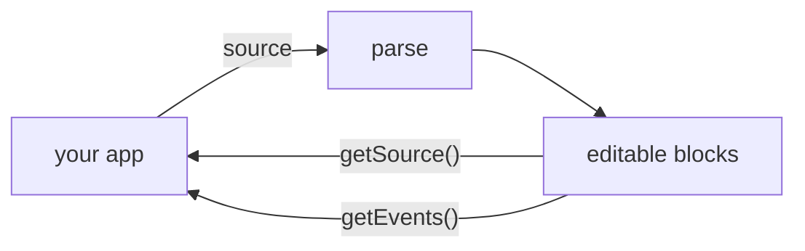

# Consumer Guide

How to embed, theme, and wire the editor as a library. Everything else has its own doc:

- The [plugin guide](plugin-guide.md): teaching the editor new blocks or new inline syntax.
- The [plugin API reference](plugin-api.md): all the methods in the full authoring surface.
- The [plugin testing guide](plugin-testing.md): proving a plugin behaves before you ship it.
- The [directive grammar](directives.md): what a `:::name` block may look like.

All of these ship in the npm package under `docs/guide` (this one included), so whatever's in your `node_modules` matches the version you installed.

This is gonna be a long one, so here are the sections:

| Section                                                       | What it covers                                                                                                 |
| ------------------------------------------------------------- | -------------------------------------------------------------------------------------------------------------- |
| [What you are embedding](#what-you-are-embedding)             | What you're mounting, how you save, and a few things worth knowing before the rest                             |
| [What your build needs](#what-your-build-needs)               | Node version, TypeScript settings, and how the package expects to be bundled                                   |
| [The public surface](#the-public-surface)                     | What the package exports, and what the version number promises about it                                        |
| [Props](#props)                                               | Every prop, and which ones you can change after mount                                                          |
| [The instance surface](#the-instance-surface)                 | The methods on a mounted editor: read the document, move the caret, run commands                               |
| [Events](#events)                                             | The five channels an editor reports on, and what each one carries                                              |
| [Presentation modes](#presentation-modes)                     | One document shown five ways, from raw Markdown to fully rendered                                              |
| [Images and links](#images-and-links)                         | Rewriting URLs, importing pasted images, and which URLs the editor refuses to load                             |
| [Plugins](#plugins)                                           | Installing plugins, why the whole app should share one set, and the nine that ship in the box                  |
| [Theming](#theming)                                           | The CSS variables the editor reads, and three ways to restyle it                                               |
| [Keyboard shortcuts](#keyboard-shortcuts)                     | Every shortcut, how to rebind or disable one, and which keys the editor swallows                               |
| [Embedding in a host layout](#embedding-in-a-host-layout)     | Letting your page scroll the editor, and putting your own content above the document                           |
| [Embedding in a webview shell](#embedding-in-a-webview-shell) | What a desktop wrapper like Tauri or Electron changes about keys and the clipboard, and what to verify by hand |
| [Diagnostics](#diagnostics)                                   | Getting a usable bug report out of a user's session                                                            |
| [Building your own chrome](#building-your-own-chrome)         | Toolbars, highlights, and navigation built around the document, with worked recipes                            |
| [Rewriting a document](#rewriting-a-document)                 | Bulk edits: read the Markdown out, transform it, hand it back                                                  |

## What you are embedding

aragonite is a Markdown editor you mount as a Svelte component. You hand it Markdown and read Markdown back, unchanged (there's no in-between document format). On screen the document is a stack of blocks (a paragraph, a heading, a list, a table), each its own editing surface, with the Markdown markers visible but dimmed.



The editor owns the caret, the tree, and the undo stack. You own load, save, and dirty state. When you want the document on disk, call `getSource()` and write it.

```svelte
<script>
	import { Editor } from '@voithos-labs/aragonite';
	import '@voithos-labs/aragonite/styles/editor-theme.css';

	let editor;
</script>

<Editor bind:this={editor} source={'# Hello\n'} theme="dark" />
<button onclick={() => save(editor.getSource())}>Save</button>
```

A few things in the above example snippet are decently important; you might want to pay attention to them.

1. **`source` seeds the document at mount**, and re-seeds it if the prop later changes. It's not a two way bound: the editor never writes back into it, so the document you read is always `getSource()`.
2. **`bind:this` is how you talk to a mounted editor.** For example, you might want to use important read functions like `getSource()` and `getSelection()`, or important write functions like `setSelection()` and `runCommand()`. [The instance surface](#the-instance-surface) covers all of it.
3. **Theming is CSS custom properties.** [Theming](#theming) has the variables and how to customize yours.

Two more that aren't in the snippet but bite early: plugin registration is process-global and happens once at mount, but each editor activates exactly the plugins its own `plugins` prop lists ([Plugins](#plugins)); and `editor.__test.*` is internal and will move, so don't build on it.

## What your build needs

Three things. Though, prob already true in sveltekit apps (if thats you, skip ahead).

1. **Node `^20.19.0 || >=22.12.0`.** That floor is Vite's, not ours: the package ships uncompiled Svelte, so your bundler's requirement is the real one.
2. **TypeScript resolves the package through its `exports` map**, which needs one of these in `tsconfig.json`:

   ```json
   { "compilerOptions": { "moduleResolution": "bundler" } }
   ```

   `node16` and `nodenext` work too. Classic `node` doesn't read `exports`, and the symptom is odd: the root `@voithos-labs/aragonite` import typechecks fine while every subpath import (`/plugin`, `/plugins/*`, `/testing`) reports "Cannot find module".

3. **Your Vite Svelte plugin compiles the package out of `node_modules`**, since it ships `.svelte` and `.svelte.js` files uncompiled. That's `vite-plugin-svelte`'s default, so a plain config is all it takes:

   ```js
   // vite.config.js
   import { sveltekit } from '@sveltejs/kit/vite';
   export default { plugins: [sveltekit()] };
   ```

   If you hand-tune `optimizeDeps` or `ssr.noExternal`, keep `@voithos-labs/aragonite` on the Svelte plugin's side of those lists rather than pre-bundling it.

## The public surface

Everything supported is exported from `@voithos-labs/aragonite`. Before 1.0 the public surface is still unstable, and the changelog records any change to it. From 1.0 onwards, a breaking change to the surface rides a major version, while additive needs ship as minors. Note, the list below will be (or at least attempted to be) kept up to date; for the actual list of exports see `src/lib/index.ts`.

| Group                  | What you get                                                                                                                                                                                                                                                                                                                    |
| ---------------------- | ------------------------------------------------------------------------------------------------------------------------------------------------------------------------------------------------------------------------------------------------------------------------------------------------------------------------------- |
| **Component**          | `Editor`, plus `EditorProps` and `EditorInstance` (the prop shape and the `bind:this` surface)                                                                                                                                                                                                                                  |
| **Policy types**       | `ResolveImageUrl`, `ResolveLinkUrl`, `ImageLoadPolicy` for the URL and image props; `PastedImage` and `PasteImageHook` for the image-import hook                                                                                                                                                                                |
| **Plugins**            | `installPlugins` for a parse-only pipeline with no editor mounted; `EditorPlugin` (the unit a plugin exports) and `EditorPluginEntry` (a `plugins` array entry: a bare unit, or `{ plugin, options }`)                                                                                                                          |
| **Selection + keymap** | `EditorSelection` (what `getSelection()` returns) and `normalizeSelection`, which puts a selection's two endpoints in document order; `KeybindingOverride` and `CommandId` (what the `keybindings` prop takes)                                                                                                                  |
| **Commands**           | `TOOLBAR_COMMANDS`, the command ids a formatting toolbar calls through `runCommand`                                                                                                                                                                                                                                             |
| **Search**             | `SearchState`, `SearchOptions`, `Match`: the find/replace controller, its options, and one hit                                                                                                                                                                                                                                  |
| **Decorations**        | `DecorationRegistry` and the decoration types: what `getDecorations()` returns                                                                                                                                                                                                                                                  |
| **Rects**              | `EditorRects` (what `getRects()` returns: on-screen geometry over the document) and `SELECTION_END`, the value its range calls accept as "through the end of the block"                                                                                                                                                         |
| **CST utilities**      | `parse` / `serialize` for round-tripping Markdown outside the component (CST: the concrete syntax tree, the parsed form of a document); `parseInline`, `getContentRange`, `isProseKind` for inspecting a block's inline content and editable range                                                                              |
| **Node types**         | `CstNode`, `Document`, the block-kind and inline-node unions, and the per-kind metadata shapes: the vocabulary for reading a parsed document. `NodeView` / `DocumentView` are their read-only forms; every node the editor hands you to read is typed as a view, so mutating the live tree is a compile error, not a convention |
| **Events**             | `EditorEvents` and the payload types the subscription surface emits                                                                                                                                                                                                                                                             |
| **Diagnostics**        | `EditorDiagnostics` (what `getDiagnostics()` returns) and `InteractionTraceEntry`                                                                                                                                                                                                                                               |

## Props

| Prop               | What it does                                                                                                                                                                                                             |
| ------------------ | ------------------------------------------------------------------------------------------------------------------------------------------------------------------------------------------------------------------------ |
| `source`           | Seeds the document at mount, and re-seeds it whenever the prop changes; never two-way bound                                                                                                                              |
| `theme`            | Theme name, reflected to `data-editor-theme` on the editor root: `'dark'` (default), `'light'`, or a name of your own (see [Theming](#theming))                                                                          |
| `presentationMode` | How the document presents, from raw source to fully rendered: `'source'` (default), `'reading'`, `'preview-block'`, `'preview-inline'`, or `'live'` (see [Presentation modes](#presentation-modes))                      |
| `plugins`          | Plugin units installed once at mount, in array order, before the first parse; the array is also the set this editor activates (see [Plugins](#plugins))                                                                  |
| `keybindings`      | Rebind or disable the editor's shortcuts, per instance (see [Rebinding chords](#rebinding-chords))                                                                                                                       |
| `resolveImageUrl`  | Rewrite a raw image URL before it reaches `img.src` (to resolve a relative path, say)                                                                                                                                    |
| `resolveLinkUrl`   | Rewrite a raw link destination at render time                                                                                                                                                                            |
| `imageLoadPolicy`  | `'auto'` (load images) or `'placeholder'` (defer loading)                                                                                                                                                                |
| `onLinkActivate`   | Handle an activated link (Ctrl/Cmd+click while editing, plain click in reading mode) instead of the default `window.open`                                                                                                |
| `onPasteImage`     | Import hook for a paste that carries image files: you store them, and return the Markdown that stands in (see [Image paste](#image-paste))                                                                               |
| `header`           | Your own UI above the first block, rendered inside the editor's scroll container (see [The header slot](#the-header-slot))                                                                                               |
| `scrollMode`       | `'self'` (default: the editor scrolls itself) or `'host'` (an ancestor of yours scrolls it; see [Host scroll mode](#host-scroll-mode))                                                                                   |
| `blockDragHandles` | Opt into the pointer affordances: the block drag handle and the table's row and column grips, revealed on hover and shown outright on touch (default off); keyboard reorder (Alt+Arrow) and the cell menu need no opt-in |
| `searchBar`        | The built-in find/replace bar and its Mod+F / Mod+H shortcuts (default on)                                                                                                                                               |
| `searchBarAnchor`  | An element to render that same bar into, instead of inside the editor root (see [Where the find bar lives](#where-the-find-bar-lives))                                                                                   |

**Set once at mount:** `resolveImageUrl`, `resolveLinkUrl`, `imageLoadPolicy`, `onLinkActivate`, `onPasteImage`, `blockDragHandles`, `scrollMode`, and `plugins`. Set them at mount and leave them; a swap later isn't guaranteed to reach blocks that are already built.

**Read live:** `theme`, `searchBar`, `searchBarAnchor`, `presentationMode`, and `keybindings` may change after mount, and `header` re-renders like any other Svelte snippet.

## The instance surface

You set the editor up with props when it mounts. After that you talk to it through the `bind:this` handle. Here's what you can read:

| Method                                      | What it answers                                                                                                             |
| ------------------------------------------- | --------------------------------------------------------------------------------------------------------------------------- |
| `getSource()`                               | The live document, serialized back to Markdown                                                                              |
| `getSelection()`                            | A frozen snapshot of the current selection, or `null`                                                                       |
| `getBlockKindAt(path)`                      | What kind of block sits at a path, or `null`                                                                                |
| `canRunCommand(id)` / `isCommandActive(id)` | Whether a toolbar button should be enabled, and whether it should paint pressed (see [Toolbar commands](#toolbar-commands)) |
| `getEvents()`                               | The subscription surface (see [Events](#events))                                                                            |
| `getSearch()`                               | The find/replace controller (see [Driving search yourself](#driving-search-yourself))                                       |
| `getRects()`                                | Where things are on screen (see [Screen geometry](#screen-geometry))                                                        |
| `getDecorations()`                          | The registry for your own view-only annotations (see [Decorations](#decorations))                                           |
| `getDiagnostics()`                          | The bug-report tooling (see [Diagnostics](#diagnostics))                                                                    |
| `reservedChords()` / `claimsChord(event)`   | Which shortcuts this editor consumes (see [Which shortcuts the editor consumes](#which-shortcuts-the-editor-consumes))      |

And what you can write:

| Method                    | What it does                                                                                                                            |
| ------------------------- | --------------------------------------------------------------------------------------------------------------------------------------- |
| `setSelection(snapshot)`  | Puts a `getSelection()` snapshot back on the document (see [Restoring a selection](#restoring-a-selection))                             |
| `placeCaretAtPoint(x, y)` | Lands the caret at a viewport point, exactly as a click there would (see [Placing the caret at a point](#placing-the-caret-at-a-point)) |
| `insertMarkdown(md)`      | Inserts Markdown at the caret, exactly as pasting it would (see [Inserting Markdown at the caret](#inserting-markdown-at-the-caret))    |
| `runCommand(id)`          | Runs an editor command by name, no keystroke involved (see [Toolbar commands](#toolbar-commands))                                       |

### Reading the document and the selection

Before the methods, there are some terms you ought to understand.

A **path** is the list of child indices that walks from the document root down to a block: `[3]` is the fourth top-level block, `[3, 0]` is the first child inside it.

**Virtual rendering** (aka windowing) means the editor only mounts the blocks near the viewport, which is why big documents stay fast. So a block can exist in the document and not in the DOM, and a method that targets one sometimes has to **reveal** it (scroll until it mounts) before it can act.

`getBlockKindAt(path: number[]): AnyBlockKind | null`

Tells you what kind of block sits at a path, or `null` if nothing does (an out-of-range index, or the empty path, which is the document itself). Handy for questions like "is that selection endpoint inside a table?" without walking the document yourself. Plugin blocks answer with the name they were registered under.

```ts
editor.getBlockKindAt([0]); // 'heading'
editor.getBlockKindAt([3]); // 'table'
editor.getBlockKindAt([3, 0]); // 'tableRow'
editor.getBlockKindAt([99]); // null
```

`getSelection(): EditorSelection | null`

Returns a snapshot of the current selection (a copy, so changing it changes nothing), or `null` when the editor isn't focused.

```ts
editor.getSelection();
// {
//   anchor: { path: [3], offset: 12 },
//   focus: { path: [5, 1], offset: 0 }
// }
```

`anchor` is where the selection started and `focus` is where it ends, so a plain caret has the two equal. `offset` is a character index into the block's source, with one exception: inside a table it's a cell index (row by row), and the point carries `cellCoordinate: true` to say so. Well, mostly. A selection lying wholly inside one table uses cell indices without the flag, so check the block's kind (`getBlockKindAt(anchor.path) === 'table'`) before you trust `offset` as a character. [The selection toolbar recipe](#recipe-a-selection-toolbar) shows this in place.

### Restoring a selection

`setSelection(selection: EditorSelection): Promise<boolean>`

Puts a `getSelection()` snapshot back, say to restore the caret you saved for a document, or after swapping `source`. It's async because the target block may not be mounted yet; the restore reveals it first.

```ts
const saved = editor.getSelection();
// later, after a reload or a source swap
const ok = await editor.setSelection(saved); // true when placed and in view
```

`true` means placed **and** in view, the same way `scrollTo` answers ([Screen geometry](#screen-geometry)). [The insert toolbar recipe](#recipe-an-insert-toolbar) uses this stash-and-restore to survive a focus-stealing button.

`false` never throws, and covers three shapes:

| Why it answered `false`                                        | What happened anyway                                      |
| -------------------------------------------------------------- | --------------------------------------------------------- |
| The path no longer addresses any block                         | Nothing: no scroll, no focus steal, no state write        |
| The path resolves, but its block's element never appeared      | The scroll ran, and cross-block state was re-established  |
| The caret placed, but the scroll could not settle it into view | The caret is placed; only the viewport ended up elsewhere |

Two notes on the third shape:

- Since 0.9.36 it has one more trigger: a later programmatic reveal (your own `scrollTo` or `navigateTo`, or the find bar navigating) issued before this restore settles takes the viewport, and the restore stops competing rather than fighting the newer target. An ordinary user gesture is not that case; typing, clicking, or scrolling while a restore settles changes nothing about the outcome.
- Branch on it as "the viewport did not end up where I asked", never as "nothing happened". Re-placing a fallback selection there would discard a caret that landed correctly.

Out-of-range offsets clamp, each in its own coordinate space: a character offset clamps to the block's source length, and an endpoint addressing a table clamps to the last cell, so a huge offset there becomes the bottom-right cell rather than a character position.

What `selectionChange` reports while a restore runs:

- **On success, every emission carries the restored selection.** The editor holds the channel until the state write and the caret landing have both happened, so a handler that treats the first event as authoritative (a persist-on-change host, say) saves the right one. Reading back with `getSelection()` after the await is still correct, just no longer necessary.
- **The browser's own `selectionchange` may still deliver a trailing duplicate** of the same value, so make the handler idempotent rather than counting events.
- **The failed-placement `false` is the exception.** A collapsed or within-block restore into a resolvable-but-unmounted block clears the old selection and then finds no element, so its one emission reports what was there before. Treat a `false` restore as "read the selection back", not as an authoritative event.

### Placing the caret at a point

`placeCaretAtPoint(x: number, y: number): boolean`

Lands the caret at a viewport point the way a click there would, and tells you whether it landed. It's for a shell that owns UI beside the document (a margin, a gutter): you decide whether a click on your territory should go to the editor, the editor decides where the caret goes. `false` means nothing focusable was under the point, so the click is still yours to handle. The dead-margin note in [Host scroll mode](#host-scroll-mode) ends in exactly this call.

```ts
gutter.addEventListener('click', (e) => {
	const landed = editor.placeCaretAtPoint(e.clientX, e.clientY); // true
	if (!landed) openGutterMenu(e);
});
```

Two things about where a point lands:

- **A point resolves against the blocks on screen**, with one exception: a point below the whole document lands at the real end, even when virtual rendering has the tail unmounted. That landing has to mount its target first, so the call returns `true` and the caret shows up a frame or two later. The exception is there so your own below-the-editor click handler and this call agree on which block they mean.
- **A point can land between two blocks.** Above a document that opens with a table, say, the caret parks at the document-start boundary rather than clamping into the table. That caret is real (typing there inserts a paragraph) but it isn't part of the public selection shape in this version, so the call returns `true` while `getSelection()` reports `null`.

### Inserting Markdown at the caret

`insertMarkdown(md: string): boolean`

Inserts Markdown at the caret the way a paste would. `md` is any Markdown string, `**hi**` or a whole table. The usual caller is a toolbar button inserting a canned snippet; [the insert toolbar recipe](#recipe-an-insert-toolbar) is built on this call.

```ts
editor.insertMarkdown('**hi**'); // true
editor.insertMarkdown('| a | b |\n| --- | --- |\n|  |  |\n'); // true, and a table lands as a block
editor.insertMarkdown('**hi**'); // false with no caret (reading mode, or focus outside the editor)
```

One call runs the whole paste route:

1. Any registered paste transforms rewrite the text first (a plugin hook, see the [plugin guide](plugin-guide.md)).
2. A live selection is deleted, then the text is spliced in the way a paste would pick: a table as a block, a one-liner inline at the caret, list items absorbed into a matching list.
3. Focus lands at the end of the insertion, and the whole thing is one undo entry.

`false` means nothing changed: no caret in this editor, reading mode, or a caret parked between two blocks. `true` means the pipeline took the text, not that the edit has landed yet, so read the result off the `edit` channel rather than calling `getSource()` on the next line.

### Toolbar commands

`runCommand(commandId: string): boolean`

Runs an editor command by name at the focused block, no keystroke involved. It's what a formatting button calls: the button means "toggle bold", not "press Ctrl+B", so a user who rebinds the shortcut moves it without silently rewiring your button. The command behaves exactly as it would from the keyboard: same edit, one undo entry, caret and selection left where the keystroke would leave them.

```ts
import { TOOLBAR_COMMANDS } from '@voithos-labs/aragonite';

editor.runCommand(TOOLBAR_COMMANDS.toggleStrong); // true, the selection is now **bold**
editor.runCommand('format.toggleStrong'); // same thing, by the raw id
editor.runCommand('nope'); // false, unknown id, nothing changed
```

The ids you can pass:

- **`TOOLBAR_COMMANDS`** (exported from the package) has what a selection toolbar needs: `toggleStrong`, `toggleEmphasis`, `toggleStrikethrough`, `toggleCode`, and `editLink`. The rest of the built-in commands stay internal for now.
- **A plugin's global command name.** `registerGlobalCommand` registers it (see the [plugin guide](plugin-guide.md)), and it resolves ahead of the focused block, so you can fire a plugin's editor-wide action without a keystroke. A plugin's per-block command stays keyboard-only.

What the boolean means:

- **`true` means the editor took the command, not that the edit has landed.** A toggle inside a construct whose markers a preview mode has revealed (see [Presentation modes](#presentation-modes)) settles that reveal first, so read the outcome on the `edit` channel rather than polling `getSource()`.
- **`false` means nothing changed**: an unknown id, reading mode, a command that needs a focused block when none is, or the link editor over a selection spanning blocks (a link lives inside one block, and a range across blocks gives it none).

Two more things before you wire buttons:

- **`editLink` only does something in `'live'` mode**, where a link's destination is hidden. In every other editable mode the URL is already on screen, so the call is consumed (`true`) and no card opens, same as pressing `Mod+K` there.
- **Over a selection spanning blocks**, a format toggle rewrites every block the range touches (the first block's tail, each middle block whole, the last block's head) as one undo entry. It applies everywhere unless every block already carries the mark, in which case it removes it everywhere. Blocks that can't hold inline syntax (a code block, a thematic break) are skipped and the rest still change. A table joins by its cells: the range covers each cell whole, so the cells it lights up are the cells it marks.

`canRunCommand(commandId: string): boolean`

Tells you whether `runCommand(id)` would reach the command right now, which is what greys a toolbar button out instead of hiding it. It answers `false` exactly where `runCommand` declines before dispatch: an unknown id, reading mode, a block-scoped id with nothing focused, and the link editor while the selection spans blocks. `true` means reachable, not that it'll write (across blocks it may find no block that can hold the mark), so keep reading `runCommand`'s boolean too.

```ts
// with a selection spanning two paragraphs
editor.canRunCommand(TOOLBAR_COMMANDS.toggleStrong); // true
editor.canRunCommand(TOOLBAR_COMMANDS.editLink); // false, a link can't span blocks
```

`isCommandActive(commandId: string): boolean`

Tells you whether the command's toggle reads ON at the caret or selection, which is what a toolbar paints a pressed state from. It reads the same bytes the toggle would rewrite, so the pressed paint and the press can't disagree. It's state, not permission: it composes with `canRunCommand` rather than repeating it, and a disabled button may still paint pressed.

```ts
// caret inside **bold**
editor.isCommandActive(TOOLBAR_COMMANDS.toggleStrong); // true
editor.isCommandActive(TOOLBAR_COMMANDS.toggleEmphasis); // false
editor.isCommandActive(TOOLBAR_COMMANDS.editLink); // true only in live mode, with the caret in a link
```

Three details:

- Over a selection spanning blocks it reports the range's coverage: `true` only when every block the range touches already carries the mark, the same reading the press uses.
- A selection with no text to format (one lying entirely inside a run of markers, the `**`s themselves, which source mode lets you select) keeps its pressed paint while the press writes nothing: the read reports the run around the selection, and the press declines rather than guessing.
- The link editor isn't a mark, so it reads its own state: `true` in live mode when the caret, or a selection lying wholly inside a link, sits in the link its card would edit. `false` for an id with no state of its own, and with nothing focused.

Ask both questions on the same `selectionChange`: answering every button there costs one read of the focused block, not one per button. [The selection toolbar recipe](#recipe-a-selection-toolbar) puts all three together.

## Events

Subscribe through `editor.getEvents()`. `on(name, handler)` returns the function that unsubscribes.

```ts
const events = editor.getEvents();
const off = events.on('edit', (e) => console.log(e.op, e.path));
// later
off();
```

Five channels:

| Channel                  | Fires                                                                                                                      |
| ------------------------ | -------------------------------------------------------------------------------------------------------------------------- |
| `edit`                   | After every applied edit: a structural operation, a batch of typing (consecutive keystrokes flush as one), an undo or redo |
| `selectionChange`        | Whenever the selection changes; the payload is the snapshot, or `null`                                                     |
| `error`                  | On a failure the editor contained rather than threw                                                                        |
| `presentationModeChange` | After a `presentationMode` prop change; the payload is the effective mode (never at mount)                                 |
| `themeChange`            | After a `theme` prop change; the payload is the theme name (never at mount)                                                |

Events fire synchronously from wherever they happen, and **a handler must not edit the document**: reentrant edits aren't supported.

What each channel hands you:

**`edit`** carries an `EditEvent`, `{ op, path, detail?, timestamp }`, discriminated by `op`. The per-operation `detail` shapes live in the source types and grow as operations are added.

```ts
events.on('edit', (e) => e);
// { op: 'input', path: [2], detail: { byteLength: 1 }, timestamp: 1788390000412 }
// { op: 'split', path: [2], detail: { at: 14 }, timestamp: 1788390001033 }
// { op: 'delete', path: [1], detail: { crossBlock: true }, timestamp: 1788390004120 }
```

`path` is document-absolute for every operation, nested ones and the typing flush included: it walks from the document root to the block that was operated on. One event names one path even when the write spanned several blocks; a `delete` or `updateContent` that did carries `detail.crossBlock: true`, and a host that reconciles incrementally should re-read the whole affected range on those rather than just `path`.

**`selectionChange`** carries the `EditorSelection` snapshot, or `null` when nothing is focused.

```ts
events.on('selectionChange', (sel) => sel);
// { anchor: { path: [0], offset: 3 }, focus: { path: [0], offset: 3 } }
// null    (focus left the editor)
```

Read the value the channel settles on rather than counting emissions. Most changes emit once, but a caret landing between two blocks emits a short burst, and its last value is `null`, since a between-blocks caret sits outside the public selection shape. Focus leaving the editor reads `null` too, even where the browser's own range survives unfocused, so a button greyed off this channel can't go stale when the user clicks out.

**`error`** carries an `EditorError`, `{ origin, error, context? }`.

```ts
events.on('error', (err) => err);
// { origin: 'link', error: Error('aragonite: blocked link with disallowed scheme: file:///notes.md'), context: { url: 'file:///notes.md' } }
// { origin: 'command', error: TypeError(...), context: { kind: 'paragraph', command: 'my.command', plugin: 'my-plugin' } }
```

`origin` is one of `subscriber`, `render`, `commit`, `command`, `decoration`, `clipboard`, or `link`, and `context` carries what's known for it:

| Origin       | `context`                                                      |
| ------------ | -------------------------------------------------------------- |
| `render`     | `path` of the block                                            |
| `commit`     | `op` and `path`                                                |
| `command`    | `kind`, `command`, and `plugin` when a plugin owns the command |
| `decoration` | `source`, the decoration source's name                         |
| `clipboard`  | `path` the paste was aimed at, when it was aimed at a range    |
| `link`       | `url` the editor refused                                       |
| `subscriber` | nothing; one of your own handlers threw                        |

**`presentationModeChange`** and **`themeChange`** carry bare values (`'reading'`, `'light'`), not envelopes, and never fire at mount. Only plugin content that paints its own colors needs `themeChange`; anything styled through the tokens rethemes itself through the CSS cascade.

## Presentation modes

`presentationMode` dials one document from the raw side to the rendered side, and you can switch it at runtime like `theme`. Every mode is CSS over the same render path: the bytes and the offsets are the source document's in all of them.

| Mode                 | What you see                                                     | Editable |
| -------------------- | ---------------------------------------------------------------- | -------- |
| `'source'` (default) | Styled source, every marker visible but dimmed                   | yes      |
| `'reading'`          | Rendered, no markers, no caret                                   | no       |
| `'preview-block'`    | Rendered, except the block holding the caret shows its source    | yes      |
| `'preview-inline'`   | Rendered, except the construct under the caret shows its markers | yes      |
| `'live'`             | Rendered, markers never shown                                    | yes      |

**`'source'`** is what you get by default: every Markdown marker renders, dimmed, and everything is editable.

**`'reading'`** is a rendered reading view, and it writes no bytes. Markers are hidden by CSS (the document and its offsets are untouched), inline widgets (an image, a rendered emoji) draw, and list bullets and numbers show as rendered chrome (chrome: what the editor paints around the text, not bytes in the document). Blocks aren't `contenteditable` here, so there's no caret inside a block and you move around by mouse, the same deal as other reading views (Obsidian's reading mode has no caret either).

- Inert: typing, paste, cut, Enter and Backspace, undo and redo, block commands, checkbox toggles, drag handles, table structure edits.
- Still live: text selection, copy (the rendered text, markers excluded), scrolling, find (not replace), and links, which open on plain click since there's no caret to place.
- One more thing is live because it isn't an edit: a `<details>` block can be opened and closed, so a reader can actually read a collapsed section. That flip is view state (the source doesn't change, no `edit` event fires, nothing lands on the undo stack) and it's forgotten when you leave the mode, where the document's own `open` attribute is the truth again. A task checkbox stays inert by contrast, because toggling one would rewrite the document.

**`'preview-block'`** hides markers block by block, and everything is editable. Every block looks rendered except the one holding the caret, which shows its full styled source. Typing, splitting, merging, selecting, undo, and search all work exactly as in source mode.

- Only the one block holding the caret shows source. A container's chrome (a blockquote's border, a directive's gutter) isn't markers and never toggles, and a focused list item shows its own bullet or number as source while its sibling items stay rendered.
- A block with nothing behind its markers (a bare `# `, an empty fence) keeps them on screen wherever it sits, so it stays visible and editable.
- The hiding is CSS keyed on which block is focused, so the marker DOM stays put and a click lands the caret at the content it hit; the markers appear around it without shifting it.

**`'preview-inline'`** hides markers construct by construct, the Obsidian-style default: the thing under the cursor shows its syntax. Unfocused blocks look exactly like `preview-block`. Inside the focused block, each inline construct (bold, italic, strikethrough, inline code, links, image alt syntax) keeps its markers hidden until the caret enters it. Arrow or click into `**bold**` and the `**`s appear around the caret; leave and they fold back. Nested constructs reveal their whole enclosing chain, so the syntax you're editing is always fully visible, and a revealed construct is ordinary source text, so typing and undo behave exactly as in source mode.

- Whole-block syntax (a heading's `## `, code fences) shows whenever its block is focused, as in `preview-block`, and a table reveals as a whole when it's focused rather than construct by construct.
- The caret is an offset into the block's raw source (its bytes, markers included) and a revealed construct's source is visible, so typing lands exactly where the caret shows; there's no hidden-cursor guesswork.
- Where two constructs meet at one boundary (`**a***b*`) both reveal and a keystroke inserts between them. Walking left into a construct's opening markers reaches them, and `Home` lands at the first visible position, just inside.
- A focused list item keeps its bullet or number as rendered chrome here (`preview-block` shows it as source), and escapes (`\`) and hard line breaks reveal whenever their block is focused, not by caret proximity.

**`'live'`** is the rendered end that's still fully editable. Where `preview-inline` reveals the construct under the caret, live reveals nothing: `**bold**` renders as bold whether the caret is inside it or not, a heading with a word behind it shows no `## `, and a link shows its text with the destination out of sight. What does stay on screen is chrome with nothing behind it: a construct with no content (a bare `# `, an empty fence) keeps its markers dimmed so the block stays visible and editable, and the first character of content folds them away. Everything a source-mode caret can do still works: typing, selection, `Enter`, `Backspace`, undo, search and replace, tables, drag handles, plugins.

Hiding every marker means one screen position can mean two raw offsets wherever a construct's delimiters sit. Live answers that with five rules, each applied in one place so it holds for every gesture:

- **A character typed at a hidden edge follows how the caret got there.** Arriving from outside a construct types outside it; walking into it types inside. A construct that never grows at its edges (a link) always takes the outside.
- **A caret seated at an extreme lands outside.** `Home`, `End`, and collapsing a selection put the caret past the delimiters, not between them. A seat isn't a step, so the direction of the key that produced it doesn't decide the side.
- **`Enter` inside a construct closes it and reopens it.** Splitting `**bold**` down the middle leaves two balanced constructs rather than one stranded delimiter in each half, and a split link carries its destination into both halves. Where no balanced rewrite shows what the screen showed (a code span whose reopened backticks would collide with its own, say), the split falls back to a plain byte cut.
- **A join cleans up after itself.** `Backspace`, `Delete`, a range delete, typing over a selection, and a paste all go through the same code: a delimiter run the cut orphaned goes with the cut instead of appearing on screen, and a closer meeting an opener around nothing is dropped. Every candidate cleanup is checked against what the two sides showed, and the byte-literal join stands when it can't be.
- **The format toggles work at a collapsed caret.** `Mod+B`, `Mod+I`, `Mod+Shift+X`, and `Mod+E` over a selection wrap or unwrap it as always; at a caret they arm the format for the next thing you type, which is what a mode with no visible delimiters needs. A selection ending on a space wraps the word and leaves the space beside it (a run closing against whitespace is no run at all), and a press whose wrap the screen wouldn't survive writes nothing rather than printing delimiters you can't see to delete.

Three more live-mode facts:

- **Reading a link's destination.** The link card is the only place a URL shows in this mode. `Mod+K` with the caret inside a link opens it with focus in the URL field, a click on a link opens the same card beside a caret that stays the document's, and editing the URL commits as one undoable step.
- **Copy yields the source bytes** (`**bold**`, not `bold`), because the caret's offsets are the source's. Reading mode is the one mode that copies the rendered text, since it has no caret and nothing to paste back into.
- **Search matches the source bytes too**, so a query spanning a construct boundary misses what the screen appears to show: `beta gamma` finds nothing in `**beta** gamma`, where the bytes between the words are `** `. Matches inside a construct's own text work normally.

Bytes only change where a rule above says so; a gesture that strands nothing writes exactly what source mode writes. One exception: `Backspace` at the very start of a `# ` with no heading text drops the construct, where source mode does nothing.

**The language chip.** Wherever a mode hides a fenced code block's fence, a small chip appears at the code box's top-right on hover or with the caret inside. It shows the block's language, and outside reading mode a click turns it into a field where Enter commits a new one as a single undoable edit. It's the only way to reach an info string (the text after the opening fence that names the language) in those modes; source mode shows the fence itself and gets no chip.

The effective mode is reflected as `data-presentation` on the editor root (absent in source mode, so default-mode DOM is unchanged) and announced on the `presentationModeChange` channel.

## Images and links

Four props deal with URLs: `resolveImageUrl` and `resolveLinkUrl` rewrite a raw URL at render time (resolve a relative path, map an app-internal scheme), `imageLoadPolicy` defers image loading, and `onLinkActivate` takes over what happens when a link is activated. Two of these need more than a table row: the paste-an-image hook, and which URLs the editor will render at all.

### Image paste

`onPasteImage` is the import hook for a paste carrying image files. The editor hands you each image, you store it however your app stores assets, and you return the Markdown that stands in for it: a wiki-style embed, a URL, whatever your `resolveImageUrl` understands. Return `null` to skip that image.

```svelte
<Editor
	{source}
	onPasteImage={async (image) => {
		// image: { blob, mimeType, suggestedName? }
		const id = await uploadToMyStore(image.blob, image.suggestedName ?? 'pasted.png');
		return ``;
	}}
/>
```

**Installing the hook takes the whole paste.** The clipboard's `text/plain` isn't pasted alongside, and with no hook installed an image-bearing paste behaves like it would in an editor with no image support at all.

- **Once per image, in clipboard order, one insertion.** The images are offered one after another and what they return is inserted as a single edit, so one paste is one undo entry and a single Ctrl+Z takes the whole thing back.
- **Failure is skip-and-continue.** A hook that rejects on one image surfaces on the `error` channel with `origin: 'clipboard'` (the origin for any contained failure on the paste route), and the remaining images still land. A hook that answers `null` for every image still consumes the paste; there's no `text/plain` waiting behind it.
- **The paste replaces the selection it lands on**, within a block and across blocks alike, like every other paste. The deletion runs only after your hook has answered, so a declined or failed import destroys nothing.
- **A block can disappear mid-import.** If the block the paste fired from is unmounted before a slow hook resolves, the insertion is declined on the `error` channel (same `clipboard` origin) rather than dropping Markdown somewhere the user never pointed.

For the curious, where the Markdown lands when the user moves the caret during a slow upload: a paste inside one block freezes its anchor at paste time, so a caret moved mid-upload doesn't drag the insertion with it. A paste over a selection spanning blocks follows the live selection instead, because that route resolves its endpoints by path at insertion time, so a selection extended during the import is the one that gets replaced. The difference is deliberate; snapshotting the second case would mean fighting the code that owns delete-and-insert as one operation.

### Which URLs render

The scheme check runs at render time, on whatever `resolveImageUrl` / `resolveLinkUrl` returned. A URL outside the admitted set renders inert: the image never loads and its widget is marked blocked, a link becomes an unlinked span, and the Markdown bytes are untouched either way. That blocked state isn't `imageLoadPolicy: 'placeholder'`, which defers loading an image the policy allows.

| Where     | Admitted schemes                 |
| --------- | -------------------------------- |
| `img` src | `http`, `https`, `data`, `asset` |
| link href | `http`, `https`, `mailto`, `tel` |

A URL with no scheme at all (relative, fragment) is admitted at both. The two sets differ on purpose: `asset:` hands bytes to an ``, and nothing has asked to navigate to one, so the same URL that renders as an image is refused as a link destination.

- **`asset:` is there for the desktop case.** Tauri's `convertFileSrc` yields `http://asset.localhost/…` on Windows and `asset://localhost/…` on macOS and Linux, so a shell whose local images all render on a Windows machine can have every one of them blocked on the other two. Both forms pass; test on each platform regardless.
- **A custom host protocol isn't admitted.** A scheme your shell registers for itself is one the allowlist doesn't know, and images carrying it render blocked. Map it to an admitted scheme inside `resolveImageUrl` (the check runs on what your resolver returns), or serve those bytes over the shell's own `http(s)` origin.
- **The allowlist isn't consumer-extensible.** Widening it for arbitrary host protocols is a decision deferred to the API freeze rather than answered by an ad-hoc prop; `resolveImageUrl` covers the case until then.

## Plugins

Plugins teach the editor new block and inline kinds. Writing one is the [plugin guide](plugin-guide.md)'s subject (with every method in the [API reference](plugin-api.md)); installing one is a prop:

```svelte
<script>
	import { Editor } from '@voithos-labs/aragonite';
	import { plugins } from './plugins'; // one array, declared once, shared by every editor
</script>

<Editor {source} {plugins} />
```

Plugins install once at mount, in array order, before the first parse. Build the array once, in a shared module, and pass that same array to every `<Editor>` in your app (why is under "one plugin set per app" below). An inline array in the markup re-creates the plugins on every render, which is harmless (you get a dev-build warning) but noise you don't need.

**Installation is process-global.** The grammar (the kinds, their components, their parsing rules, their commands) is one shared set per JavaScript context, the way `customElements` is, so registering the same kind twice is a conflict rather than a per-instance override. Runtime state is per instance: selection, undo history, and every cache are one editor's own, and nothing one instance does reaches another. Mounting several editors on one page is fine; they share one grammar and never any state. Three consequences:

- **Passing the same plugin to two editors registers it once.** Per-instance configuration still works: an entry may be `{ plugin, options }` instead of a bare plugin, and each editor gets its own `options` even though the registration is shared (the split-pane case). Reach for this over the plugin's own factory argument for anything two editors would vary, because a factory argument only takes effect on the first install.
- **The prop is the enablement set.** Registration is shared; activation is per editor. An editor runs the hooks, resolves the kinds, answers the commands and their chords, and applies the paste transforms of exactly the plugins it lists, so leaving one out of an editor's array switches it off for that editor. Its blocks still parse (the seed parse reads the whole grammar) and then render as plain editable source, which is the same fallback an unknown kind gets. One thing isn't scoped yet: a plugin's inline syntax and directive names still reach every editor. An editor mounted with no `plugins` prop is the exception: it activates everything installed in the process.
- **A later editor may mount carrying a plugin an earlier one never had.** The late install is legal and serves the new editor's own parse; an editor that already parsed doesn't re-parse against the newer grammar, and a dev-build warning names the late registration.
- **For a `parse()` pipeline with no `<Editor>` mounted**, call `installPlugins(plugins)` from the package to make the grammar live.

**One plugin set per app, not per route.** Installation is first-wins: the first set to install decides the grammar for the whole process, and a later route's different set is ignored with a dev-build warning. Under SSR, first-wins turns per-route sets into a hydration hazard:

1. The server process outlives a request, so whichever route it happened to render first decided the server's grammar.
2. Each browser load starts fresh, so the client decides its grammar from the route it actually loaded.
3. When the two disagree, the server-rendered block and the hydrating one resolve to different kinds, and the block fails at its error boundary.

One shared set removes the disagreement by construction, which is a lot cheaper than debugging a hydration mismatch that only shows up on one route.

The same rule covers [directive](directives.md) names. A plugin that claims an already-claimed `:::name` wins or loses by which setup ran first in the process, which under SSR is route order again, so a pre-claim behaves predictably only when one set installs everywhere. And per-route variation belongs in per-instance options (`{ plugin, options }` in the array), not in per-route plugin sets: an option baked into a plugin factory at definition time is process-global, so the first route to load would fix it for every other one.

### Bundled plugins

Nine first-party plugins ship in the package as subpath exports. Install them like any other plugin:

```ts
import { admonitionsPlugin } from '@voithos-labs/aragonite/plugins/admonitions';
import { detailsPlugin } from '@voithos-labs/aragonite/plugins/details';
import { tocPlugin } from '@voithos-labs/aragonite/plugins/toc';
import { footnotesPlugin } from '@voithos-labs/aragonite/plugins/footnotes';
import { emojiPlugin } from '@voithos-labs/aragonite/plugins/emoji';
import { highlightOccurrencesPlugin } from '@voithos-labs/aragonite/plugins/highlight-occurrences';
import { latexPlugin } from '@voithos-labs/aragonite/plugins/latex';
import { mermaidPlugin } from '@voithos-labs/aragonite/plugins/mermaid';
import { parrotPlugin } from '@voithos-labs/aragonite/plugins/parrot';
```

| Plugin                         | What it teaches the editor                                                                                                                                                                                                                                     |
| ------------------------------ | -------------------------------------------------------------------------------------------------------------------------------------------------------------------------------------------------------------------------------------------------------------- |
| `admonitionsPlugin()`          | `:::name` directive callouts and native GitHub alerts (`> [!NOTE]` blockquotes) render as styled boxes, GitHub bytes untouched                                                                                                                                 |
| `detailsPlugin()`              | A canonical `<details>` HTML block (`<details>` or `<details open>`, a `<summary>` line, a Markdown body, `</details>`) becomes an editable collapsible section whose summary is a real editable child; a non-canonical `<details …>` stays a plain HTML block |
| `tocPlugin()`                  | A `[[toc]]` line becomes a live table of contents: every heading in the document, indented by level, each entry navigating to its heading on click or on Enter from the keyboard                                                                               |
| `footnotesPlugin()`            | GFM footnotes: `[^label]: content` definitions render as an editable block, and `[^label]` references render as superscript numbers in first-reference order                                                                                                   |
| `emojiPlugin()`                | GitHub `:shortcode:` emoji: a bare `:name:` renders as a glyph while the literal `:name:` bytes stay in the source; without the plugin, `:name:` is ordinary prose                                                                                             |
| `highlightOccurrencesPlugin()` | Every other occurrence of the word under the caret is highlighted across the document's prose blocks once you stop typing, as a view-only decoration, never a byte change                                                                                      |
| `latexPlugin({ renderer })`    | All three GitHub math forms through one injected engine: inline `$…$`, block `$$…$$`, and the fenced ` ```math ` form; uninstalled, each stays its plain reading (prose, or a plain `math` code block)                                                         |
| `mermaidPlugin({ renderer? })` | A ` ```mermaid ` fence renders as a diagram through an injected engine; without one, the fence renders statically (the source, styled)                                                                                                                         |
| `parrotPlugin()`               | A `%%parrot` line renders as an animated ASCII party parrot, with whatever follows the marker as its caption; uninstalled, the line is ordinary prose                                                                                                          |

A few of them take options or need a word more.

**Admonitions.** Pass `{ convertAlertsOnPaste: true }` to rewrite pasted GitHub alerts to directive source instead of rendering them natively.

**Table of contents.** The walk descends into containers, so headings inside blockquotes, lists, and callouts are listed too, and navigation is view-only, so entries work in every presentation mode. `{ maxDepth }` (1 through 6, default 6) lists only the top levels, and it's read per instance:

```ts
import { tocPlugin, type TocOptions } from '@voithos-labs/aragonite/plugins/toc';

const plugins = [{ plugin: tocPlugin(), options: { maxDepth: 3 } satisfies TocOptions }];
```

Two editors in one process can list different depths this way; the factory form, `tocPlugin({ maxDepth: 3 })`, is the default for an instance that declares none. The `satisfies TocOptions` is there because `options` is `unknown` to the editor, and with it a typo or an out-of-range level stays a compile error. At runtime anything that isn't a level from 1 to 6 falls back to the factory value.

**Footnotes.** A reference jumps to its definition, on plain click in reading mode and on Ctrl/Cmd+click elsewhere (the same gesture links take); a plain click in an editing mode still opens the reference's source to edit. The definition's own `[^label]` marker is the way back, on the same gesture, and it lands the caret right after the first citation. Backspace at the start of a note's body unwraps it: the first block lifts out and the marker stays on whatever's left. One clipboard consequence: copying part of a single-paragraph definition's body carries its `[^label]: ` marker along (the marker is that block's own source, and a slice without it would re-parse as a bare paragraph), so pasting that slice elsewhere lands a second definition under the same label.

**Math and diagrams.** latex and mermaid render through injected engines that never ride the main bundle: each has a `/renderer` subpath adapter, and its engine (`katex` / `mermaid`) is an optional peer dependency you install only if you use it.

```ts
import { katexRenderer } from '@voithos-labs/aragonite/plugins/latex/renderer'; // imports katex + its CSS
import { mermaidRenderer } from '@voithos-labs/aragonite/plugins/mermaid/renderer'; // dynamic-imports mermaid

latexPlugin({ renderer: katexRenderer });
mermaidPlugin({ renderer: mermaidRenderer });
```

The two differ on whether the renderer is required, on purpose. Math without a renderer has no honest fallback (a formula would render as nothing), so `latexPlugin` requires one at the type level. A mermaid block without an engine still has a useful static form (the fenced source, styled), so `mermaidPlugin()` is legal and renders statically; supply the renderer when you want live diagrams. The latex adapter imports `katex/dist/katex.min.css` on your behalf (it's the one bundled-plugin module with a side effect); no other setup is needed.

## Theming

The module owns its CSS. Two stylesheets ship under `styles/`:

- **`editor.css`**: the structural rules. The component imports it itself; nothing to do.
- **`editor-theme.css`**: the default token palette, light and dark. Import it for the default look, or replace it wholesale to retheme. It's the authoritative manifest, so read it for the exact token set and values rather than trusting a copy in a doc. This one included.

A plugin's render engine may carry its own stylesheet (KaTeX's `katex.min.css`, say). That CSS is the plugin's to load, not the editor module's.

### Scope

Nothing is declared on `:root`; the module never puts custom properties into your global scope. The tokens come in two tiers, and the tier decides where you override:

- **Host-chrome tokens** are your vocabulary: the editor only reads them, and their defaults live behind the opt-in `aragonite-editor-theme` class alone. A host with a theme system of its own declares the same names anywhere in its cascade (`:root` included), skips the class, and the editor blends in with no bridge stylesheet. Standalone, add the class to a wrapper for the built-in palette; non-editor UI inside the wrapper (a surrounding toolbar, say) inherits it too.
- **Editor-owned tokens** (the syntax and code palettes, the overlays, and the surfaces in the second table under [Theme tokens](#theme-tokens)) keep their defaults on `.editor` itself, so they render correctly with or without the class.

### Light and dark

Mode keys on `data-editor-theme` on the scoped element. Set the `theme` prop on `<Editor>` (`'dark'` default, `'light'`, or any custom name); on an `aragonite-editor-theme` wrapper, set the attribute directly. Dark is the base, and `'light'` overrides only the tokens that differ. In a themed host the attribute governs the editor-owned tier alone; the host-chrome tier's mode is whatever your own theme applied.

The prop is live: changing it rethemes through the cascade, and plugin content whose colors an engine paints rather than CSS (a Mermaid diagram's SVG) is redrawn for the new theme. A theme change writes no document bytes.

### Overriding and custom themes

Three paths, by how much you want to change:

1. **Override individual tokens.** Host-chrome tokens: declare them anywhere in your cascade (`:root { --color-accent: #f90; }` reaches the editor, as long as no `aragonite-editor-theme` ancestor sits between and shadows it). Editor-owned tokens: declare them on `.editor` (or a narrower selector of yours) in a stylesheet loaded after `editor-theme.css`, so `.editor { --syntax-heading: #f90; }` wins. Per mode: `.editor[data-editor-theme='light'] { … }`.
2. **Add a named theme.** Define `.editor[data-editor-theme='solarized'] { … }` and pass `theme="solarized"`. The base block supplies fallbacks for any token the custom theme omits, so a partial theme overrides only what it names.
3. **Replace wholesale.** Skip `editor-theme.css` and ship your own token file scoped to `.editor`.

### Theme tokens

The role table below is the stable **host-chrome contract**: the tokens the editor and its plugins read to blend into your app, named the way a host theme system names them. Declare them anywhere in your cascade, or take the defaults through the opt-in class.

| Role          | Token(s)                                                                   |
| ------------- | -------------------------------------------------------------------------- |
| **Font**      | `--font-editor`, `--editor-font-size` _(mode-independent; one value each)_ |
| **Radius**    | `--radius-ui` _(controls)_, `--radius-surface` _(overlays, popovers)_      |
| **Surface**   | `--color-surface`                                                          |
| **Text**      | `--color-text-secondary` _(body)_, `--color-text-primary`                  |
| **Muted**     | `--color-ui-muted`, `--color-ui-dulled`                                    |
| **Accent**    | `--color-accent`                                                           |
| **Selection** | `--color-selection`                                                        |
| **Borders**   | `--color-border`                                                           |
| **Error**     | `--color-error`                                                            |

The editor supplies these host-family surfaces itself, in both modes, because a host vocabulary rarely names them. Override them at `.editor`; a `:root` declaration would lose to the default:

| Role            | Token(s)                                                          |
| --------------- | ----------------------------------------------------------------- |
| **Backgrounds** | `--color-bg-secondary`, `--color-bg-elevated`, `--color-bg-muted` |
| **Muted**       | `--color-text-muted`, `--color-ui-faint` _(the hover veil)_       |

**Every `--color-*` token has a light and a dark default** (the base block is dark, `data-editor-theme='light'` overrides it), so a read resolves in either mode. The font and radius tokens are the exceptions: mode-independent, declared once.

**`--color-selection` is a base three tints derive from.** The selection overlay, the search-match tint, and the block-reorder highlight are translucent tints of it at fixed alphas, so naming the one base moves all three and keeps their relative weights. Declaring an individual tint at `.editor` still wins over the derivation, if you want one of them somewhere else.

**The radii are partial by design.** The two tokens cover the corners a host theme has an opinion about: its controls and its elevated surfaces. Editor chrome whose corner is neither (a hairline focus ring, a scrollbar thumb, an inline-code pill) keeps a literal value, so declaring the tokens rounds what you'd expect a theme to round and leaves the rest alone.

**`--editor-font-size` is the type-scale root.** Headings, code, markers, and chrome are all `em`-relative, so overriding this one token scales the whole surface. In a themed host (no opt-in class) set it on any ancestor and it inherits straight in. Under `aragonite-editor-theme` the class declares `1rem`, which shadows any value from above it, so set it at `.editor` or below the class, or bridge it through a property of your own:

```css
.editor {
	--editor-font-size: var(--my-zoom, 1rem);
}
```

A live change is supported, and virtual rendering re-estimates the document at the new scale, so a zoom control is a first-class use of the token.

Outside this contract sits the editor's own visual language: the syntax and code-token palettes, the marker colors, the selection, search, and reorder tints (derived from `--color-selection`, above), and the surfaces windowing paints where blocks aren't mounted yet. Those are dark-based or mode-independent; read `editor-theme.css` if you mean to retheme them.

**Plugin fallbacks.** A plugin reading a token keeps an inline fallback (`var(--color-text-muted, #aaaaaa)`) so it renders with no host, and every fallback matches the token's dark base value in `editor-theme.css`, never the light one. Which scopes a fallback fires in follows the tier: an editor-owned token defaults on `.editor`, so its fallback only fires outside the editor, while a host-chrome token defaults behind the opt-in class alone, so in a host that skips the class the fallback fires inside `.editor` too.

## Keyboard shortcuts

Two terms before the table. A **chord** is one key plus its modifiers, written as one string: `Mod+Shift+X` names one press. Chord strings put the modifiers in a fixed order (`Mod`, `Alt`, `Shift`) before the key's own value, single letters uppercased. **`Mod`** is the platform modifier: Ctrl on Windows and Linux, Cmd on macOS.

Shifted symbols aren't modeled: `Shift+1` reaches the editor as whatever symbol the keyboard layout produces, so bind digits and letters (`Mod+7`), never the shifted symbol.

This table is for a reader. An app deriving an accelerator map should read `editor.reservedChords()` instead, since that set is composed from the live keymaps and covers chords claimed outside them (see [Which shortcuts the editor consumes](#which-shortcuts-the-editor-consumes)). The selection chords are one example: Shift+Arrow, `Mod+Shift+Home` / `Mod+Shift+End`, and the repeated `Mod+A` escalation go through the cross-block selection code rather than the keymap, so they aren't rebindable and aren't listed here.

Tables also have pointer affordances the table has no row for: with `blockDragHandles` on, every row and column carries a grip, revealed on hover and shown outright on touch, that you can drag to reorder it or click for a row/column action menu. Right-clicking any cell opens that same menu (with cut/copy/paste) whether the grips are on or off, and Shift+F10 or the Context Menu key opens it from the keyboard.

| Action                              | Chord                                               |
| ----------------------------------- | --------------------------------------------------- |
| **Editing**                         |                                                     |
| Bold (toggle strong)                | `Mod+B`                                             |
| Italic (toggle emphasis)            | `Mod+I`                                             |
| Strikethrough                       | `Mod+Shift+X`                                       |
| Inline code                         | `Mod+E`                                             |
| Edit a link's URL (live mode)       | `Mod+K` (caret inside a link; opens the link card)  |
| Cycle heading level                 | `Mod+0`–`Mod+6` (0 clears, 1–6 set `#`–`######`)    |
| Split a block                       | `Enter` (in a code block, inserts a newline)        |
| Hard line break                     | `Shift+Enter`                                       |
| Merge into the block before / after | `Backspace` / `Delete` (at the block's start / end) |
| Indent / outdent a list item        | `Tab` / `Shift+Tab`                                 |
| Indent / dedent a code line         | `Tab` / `Shift+Tab`                                 |
| Insert a tab in prose               | `Tab`                                               |
| Undo                                | `Mod+Z`                                             |
| Redo                                | `Mod+Y` or `Mod+Shift+Z`                            |
| **Block reorder**                   |                                                     |
| Move block up / down                | `Alt+↑` / `Alt+↓`                                   |
| **Find / replace**                  |                                                     |
| Open find                           | `Mod+F`                                             |
| Open find + replace                 | `Mod+H`                                             |
| Next / previous match               | `Enter` / `Shift+Enter` (in the find field)         |
| Close search                        | `Esc`                                               |
| **Tables**                          |                                                     |
| Move between cells                  | `Tab` / `Shift+Tab`, arrow keys                     |
| Next row (or add one)               | `Enter` (from the last cell, appends a row)         |
| Insert row below / above            | `Mod+Enter` / `Mod+Shift+Enter`                     |
| Insert column right / left          | `Alt+Shift+→` / `Alt+Shift+←`                       |
| Delete row                          | `Mod+Shift+Backspace`                               |
| Delete column                       | `Alt+Shift+Backspace`                               |
| Move row up / down                  | `Alt+↑` / `Alt+↓`                                   |
| Move column left / right            | `Alt+←` / `Alt+→`                                   |
| Move the whole table up / down      | `Mod+Alt+↑` / `Mod+Alt+↓`                           |
| Cycle column alignment              | `Mod+Shift+A`                                       |
| Create a table                      | type a header row (`\| a \| b \|`), then `Enter`    |
| **Clipboard**                       |                                                     |
| Copy / cut a focused block          | `Mod+C` / `Mod+X`                                   |
| Copy / cut a selected image         | `Mod+C` / `Mod+X`                                   |

**Typing a table into existence.** A table's header and delimiter lines have to be adjacent, which Enter alone could never produce, so a paragraph holding just a header row (`| a | b |`) is completed by `Enter` into a finished table (delimiter, one empty body row, caret in the first body cell) as one undoable step. It needs the leading pipe, so a paragraph that merely contains one (`ls | grep foo`) is left alone, and one undo restores the row you typed.

**A merge that wouldn't read back as one block is refused.** `Backspace` / `Delete` at a boundary joins the two blocks only where the joined bytes re-parse as a single block; otherwise the press moves the caret across the boundary and the document is untouched.

**The Editing rows assume a caret in ordinary block content.** Inside a table cell, `Enter`, `Tab`, and `Shift+Tab` mean what the Tables rows say instead: the `tableCell` keymap binds them to the cell's own commands, which shadow the prose bindings while the caret is in a cell. `Alt+↑` / `Alt+↓` likewise move the caret's row rather than the block; the whole table moves among its siblings on `Mod+Alt+↑` / `Mod+Alt+↓`.

**Whole-block clipboard.** A block focused as a whole (a thematic break, a plugin diagram) has no text selection, so `Mod+C` / `Mod+X` copy or cut the block's own Markdown (cut removes the block), and the same chords on a selected inline image act on the image's source. In reading mode copy works and cut degrades to copy.

**Menu clipboard caveats.** The right-click menu's Cut/Copy write the cell's rendered text, which differs from keyboard `Mod+X`'s raw-source slice for a cell holding an inline widget (a literal `<br>`, say). Menu Paste reads through `navigator.clipboard.readText()`, the one clipboard path not yet proven on the Tauri/wry webview. Keyboard `Mod+V` is unaffected.

### Rebinding chords

The `keybindings` prop rebinds (or disables, with `command: null`) chords that go through the keymap: the Editing, Block reorder, and Tables families above, and any chord a plugin kind adds.

```svelte
<Editor
	{source}
	keybindings={[
		{ kind: 'listItem', chord: 'Tab', command: null },
		{ kind: 'tableCell', chord: 'ArrowUp', command: 'table.deleteRow' }
	]}
/>
```

An override's `kind` scope takes a plugin kind too; name it through the plugin's exported kind constant, which is a branded string, so a raw literal won't typecheck. A bind reaches every surface the editor owns, including the ones with no focused block for a kind scope to apply to: the caret between two blocks, a block focused as a whole (a thematic break), and the document with nothing focused inside it. A disable unbinds the command but the press is still consumed, as [Which shortcuts the editor consumes](#which-shortcuts-the-editor-consumes) explains.

Scoping by kind is what makes the shared structural chords reachable, since a chord like `Tab` is bound separately on every kind that wants it. The first entry above frees `Tab` inside list items (for focus traversal in a form-embedded editor, say) and leaves `Tab` alone in code blocks and prose.

**Scope table chords to `tableCell`, not `table`.** Inside a table the cell holds the caret, so the cell's kind is what resolves a chord: `{ kind: 'tableCell', chord: 'Mod+Enter', command: null }` frees the insert-row chord, while the same entry scoped to `table` resolves against a block that never gets a keystroke and silently does nothing.

Two cell gestures sit outside the keymap entirely, because both depend on where the caret sits inside the cell rather than on the chord: arrow navigation between cells, and the three-stage `Mod+A` (cell text, then the table, then the document). They aren't commands, so the two override directions are asymmetric:

- A **disable** can't reach them. `{ kind: 'tableCell', chord: 'Mod+A', command: null }` unbinds nothing (there was no binding) and the three-stage gesture keeps running.
- A **bind** shadows them completely. The second entry above, `ArrowUp` bound to `table.deleteRow`, resolves first and the cell never navigates. That's the intended precedence (an explicit binding wins), but it means claiming an arrow or `Mod+A` for your own command takes the built-in gesture with it.

Disabling `Tab` or `Enter` for `tableCell` likewise leaves the cell with no way to reach the next cell or append a row, so scope those deliberately.

The Find / replace family doesn't consult the override map at all: those chords are wired straight into the search components, and aren't rebindable today.

**Plugin-global chords resolve last.** A plugin's global command (see the [plugin guide](plugin-guide.md#block-commands)) may claim a chord, and it resolves after every `keybindings` override, built-in kind chord, and built-in global chord, so a plugin chord never shadows a built-in binding, and `Mod+F` / `Mod+H` are reserved outright. The shadow runs the other way by design: a built-in kind's own chord beats a plugin-global chord on that kind, not elsewhere. A plugin's `Mod+B` fires on a thematic break (which binds no `Mod+B`) but yields to bold-toggle inside a paragraph.

### Which shortcuts the editor consumes

An app that registers its own accelerators needs to know what the document already claims. Ask the editor rather than keeping a copy.

`reservedChords(): ReadonlySet<string>`

Every modifier chord this instance consumes, normalized.

`claimsChord(event: KeyboardEvent): boolean`

The same question for one keystroke, answered with the editor's own normalization, so a host key handler doesn't re-derive the platform rule: Ctrl and Cmd both fold to `Mod` (a macOS `Ctrl+B` and a `Cmd+B` give the same answer), and a CapsLock-uppercased letter matches its lowercase binding.

```ts
editor.reservedChords();
// Set { 'Mod+B', 'Mod+I', 'Mod+Shift+X', 'Mod+E', 'Mod+K', 'Mod+Z', 'Mod+Y', 'Mod+Shift+Z', 'Alt+ArrowUp', 'Mod+F', 'Mod+H', ... }

// editorEl: the element you mounted <Editor> into
window.addEventListener(
	'keydown',
	(e) => {
		if (editorEl.contains(e.target as Node) && editor.claimsChord(e)) return; // the document's, leave it
		runMyAccelerator(e);
	},
	{ capture: true }
);
```

The set is composed on each call, not baked at build time, so it already reflects the block kinds your plugins registered, the global chords claimed by the plugins this editor listed, and the `keybindings` overrides you passed: a chord you disabled globally drops out (a per-kind disable can't, since other kinds still claim it), one you bound appears, and turning `searchBar` off drops `Mod+F` and `Mod+H` with it.

**Modifier chords only, by design.** Bare keys (`Enter`, `Tab`, `Escape`, the arrows, `Backspace`) never appear: a focused document owns them whatever the set says, so an app shortcut bound to one is lost while the caret is in a block regardless. That makes the set the right input for an accelerator table and the wrong input for a "what can I press here" help sheet; for that, use the [shortcut table](#keyboard-shortcuts).

**Consumed means consumed, even where the chord does nothing.** A chord in the set is swallowed on every surface the editor owns, not only where it acts: `Mod+K` with the caret outside a link opens no card and still takes the press, because a chord the editor reported as claimed must never fall through to the browser's own default. Reading mode runs nothing at all, and splits the set in two: the history chords stay consumed there (a read-only document mustn't fall through to the browser's own undo), while a block-scoped keymap chord finds nothing to run and is left to the page.

**A disable releases the command, not the press.** `{ chord: 'Mod+Z', command: null }` drops `Mod+Z` from the set, which is what lets you bind it app-wide: your handler fires whenever focus is outside the editor. Inside the editor the press is still swallowed and runs nothing. The asymmetry is deliberate: the alternative is falling through to the browser's own editing defaults, and native undo inside a `contenteditable` rewrites the document behind the editor's back, past its undo stack and its `edit` events. If you want the chord to act inside the document too, bind it to a command rather than disabling it.

Two things the answer can't cover. It describes the chords the editor consumes, not the ones that reach it: a shell that resolves its accelerator first takes the chord before any handler runs, which is [the webview section](#embedding-in-a-webview-shell)'s opening measurement. And a chord the editor doesn't claim isn't thereby free: the browser's own editing chords still apply inside a `contenteditable`.

## Embedding in a host layout

Two props decide how the editor sits in your page: who owns the scroll, and what rides above the document.

### Host scroll mode

By default the editor root is the scrollport (the box that scrolls): it owns its scroll position, and virtual rendering keeps the mounted block count proportional to the viewport rather than the document, which is what lets it hold a large file at all. `scrollMode='host'` is the embedded alternative: the root stops scrolling and grows to its content, and an ancestor of yours scrolls it. A shell that stacks several documents in one scroller (a journal, a comment thread) wants this; a whole-file editor doesn't.

**Virtual rendering follows the scroll.** The editor windows against whatever actually scrolls it, so a large document inside a page-scrolled shell stays bounded to the viewport just like a standalone one. Windowing only turns on past a size budget (a few viewports' worth of estimated height), so a small embedded entry never windows in either mode and pays nothing.

**The one trade is scroll anchoring.** The browser's native anchoring and windowing's own correction can't both hold one scroll position (they'd double-correct), so exactly one runs. While an embedded editor is windowing it corrects by hand and withdraws its subtree from your scroller's anchor candidates; below the budget it corrects nothing and stays a candidate. Two consequences: your scroller is otherwise untouched, and late-sizing content in your own chrome above a windowing editor isn't compensated while the viewport holds only editor content. Size your chrome up front (or reserve its height) if that matters to you.

What your CSS has to provide:

- **Resolve the scroller before the editor's first use.** The editor finds the ancestor that scrolls it once, at first need. A shell that swaps its scroller in afterwards (a panel that expands, a wrapper replaced on a route transition) leaves the editor measuring against the wrong box. Settle the layout first, or remount the editor.
- **A clipping wrapper needs left padding.** Host mode drops the editor's own padding, and the drag handle sits in a gutter outside the block box. A wrapper with `overflow: hidden` and no padding clips the handle away entirely, so pointer drag-reorder silently disappears. Reserve at least `0.85rem` on the left. This only matters with `blockDragHandles` on; keyboard reorder (Alt+Arrow) works either way.
- **The reading column's side inset belongs to the editor, not an ancestor.** Host mode drops the editor's own padding, so the inset that narrows the text column is yours to add, and where you put it decides whether the margin beside the text is clickable. On the editor element or the block list inside it, the editor claims the whole gutter and a click there lands the caret on the nearest line. On any ancestor, that band is your shell's: the click never reaches a surface the editor can claim, and the margin beside every line goes dead while looking like part of the document. If the band genuinely is your chrome, answer the click yourself and hand the point to [`placeCaretAtPoint(x, y)`](#placing-the-caret-at-a-point).
- **A drag autoscrolls whatever actually scrolls.** That's the nearest ancestor you made scrollable, or the page's own viewport when nothing between the editor and the document scrolls. One box it will never scroll is a fixed-height `overflow: hidden` wrapper: a reader can't wheel one back, so a drag that scrolled it would strand content out of reach. A programmatic reveal does move such a box, deliberately: it can put the block on screen and leave it there.

The root reflects a `data-scroll-mode` attribute in host mode. Treat it as an implementation detail, not contract (it may start showing up in self mode too), and style host-mode embeddings through your own wrapper elements, which you control; the mode's own layout rules are already scoped to the editor.

### The header slot

`header` is a Svelte snippet rendered inside the scroll container, above the first block: a document title, a properties panel, a tag row, chrome that belongs to the document rather than the app frame. It scrolls away with the document instead of pinning above it, and that's what lets the editor keep its own scrollport, and with it virtual rendering; chrome mounted outside the editor would need an outer scroller and forfeit both.

```svelte
{#snippet documentHero()}
	<h1>{title}</h1>
	<TagRow {tags} />
{/snippet}

<Editor {source} header={documentHero} />
```

- **The content is yours.** Links inside the slot follow your page's behavior rather than the editor's plain-click-edits policy, and a text field in the slot keeps its own keystrokes: `Mod+F` in a host title field opens your find, not the editor's.
- **Height changes don't slide the document.** A slot that grows or shrinks while the reader is scrolled down is compensated, so the block they were reading stays where it was. At the top of the document, growth pushes content down, which is what a reader looking at the header expects. In host mode the compensation follows the same rule as everything else: the editor writes your scroller while it's windowing, and leaves the shift to the browser's own anchoring below the budget.
- **The find bar overlays the slot's top strip.** The bar rides the editor's top edge in both modes. In self mode that means it covers the header only at the very top of the scroll; in host mode, where the root never scrolls, it covers it whenever the bar is open.
- **A header taller than the viewport degrades.** At the top of the scroll it leaves the block list no room to intersect the viewport, so almost nothing mounts until the reader scrolls past it. Accepted rather than special-cased: a header that tall isn't what the slot is for.

### Where the find bar lives

By default the bar pins to the editor root's top edge. In self-scroll mode that reads as a document's own find bar, which it is. In host-scroll mode the root is a box partway down someone else's page, so the bar rides that box: it sits mid-page and scrolls out of sight with the document it searches, while the pane's own chrome, where a reader expects a find field, stays empty.

`searchBarAnchor` fixes that without giving up the bar. Hand it an element and the editor renders the same bar into it. Everything else stays the editor's: the component, `Mod+F` / `Mod+H`, Esc, the match navigation, and the caret restore that puts the cursor back where the search started. Only the DOM position moves.

```svelte
<div class="pane-chrome" bind:this={findBarSlot}></div>
<div class="pane-body">
	<Editor {source} scrollMode="host" searchBarAnchor={findBarSlot} />
</div>
```

- **The prop reads live.** `null` or `undefined` puts the bar back in the editor root, so an anchor that mounts with a panel and unmounts with it is fine. It has no effect while `searchBar` is `false`; that switch turns the whole feature off, chords included.
- **Placement inside the anchor is yours.** The editor treats the element as the box and exports no positioning knobs. The bar positions itself absolutely, so give the anchor `position: relative` (or another positioned ancestor) and a size; otherwise the bar resolves against whatever the page's layout offers next.
- **The bar carries the editor's theme scope with it.** Custom properties resolve by DOM ancestry, so an anchor outside the editor resolves whatever the page's cascade offers there. When the editor itself sits under `aragonite-editor-theme`, the relocated node carries that class and the effective `data-editor-theme` (both tracking a `theme` change live), so the bar keeps the built-in palette. In a themed host with no class, it deliberately carries neither: the anchor inherits your own tokens, which is the palette the bar should wear there.

## Embedding in a webview shell

A desktop shell (Tauri/wry, WebView2, Electron) runs the editor on the same engine a browser does, so nothing about the component changes. What changes is the layer above it: the shell decides which keystrokes reach the page, and which URLs resolve to a local file. A browser-driven test run can't observe any of that, so verify each item below in the built application; a green CI run tells you nothing here. Layout isn't shell-specific; [Embedding in a host layout](#embedding-in-a-host-layout) covers it. Neither is local-file image rendering, which is a URL-policy question; [Which URLs render](#which-urls-render) covers the `asset:` protocol and its per-platform forms.

### Chords the shell may claim

Which chords reach the page, and whether the shell or the document gets first refusal, is shell-specific. Where the shell resolves its accelerator first, the chord is consumed before any `keydown` reaches the document: the editor can't bind it, observe it, or report that it went missing, and no `keybindings` override reaches a key that never arrives. Where the shell dispatches to the page first, the editor sees the chord and a capture-phase `preventDefault()` suppresses the shell's own action. Tauri/wry on WebView2 measures as the second kind, with reload and the devtools chords all arriving at the document and their defaults preventable. Assume neither; measure yours.

- **Verify the chord map in the real shell.** A browser run proves the keymap resolves, not that the chord arrives. Walk the [shortcut table](#keyboard-shortcuts) and your own app's bindings in the built application, on every platform you ship, and derive the editor's half of that walk from [`reservedChords()`](#which-shortcuts-the-editor-consumes) rather than copying the table, so it can't go stale between releases.
- **A webview's zoom hotkeys may well be off already.** A zoom control driving `--editor-font-size` (see [Theming](#theming)) reaches for exactly the chords a webview is most likely to reserve, which makes it this section's bellwether. The collision isn't a given, though: Tauri's zoom-hotkey option defaults to off, so on that shell `Mod+=` and `Mod+-` arrive at the page untouched and a host zoom control bound to them works. Measure before designing around a collision, and before assuming there's none.
- **A chord's fate can differ between your debug build and your shipped one.** Tauri enables the web inspector by default in debug builds and gates it behind a feature flag in release builds, so `F12` opens devtools while you develop and finds nothing to open in what you ship. Measure in the build you ship.
- **The host's switches are coarse; the page's is fine.** A shell exposes a switch over a whole built-in accelerator family rather than a per-chord list, and there can be more than one family with its own default (Tauri splits page zoom out from the rest and defaults it off), so "the shell's accelerators" is rarely one setting. Where the shell dispatches to the page first, a capture-phase `preventDefault()` is the per-chord route its configuration doesn't offer. Check your shell's current documentation for what each switch covers.
- **A capture-phase key listener of your own needs an "inside the editor" guard.** A host that handles keys on `window` or `document` before the page sees them has to decline the ones headed for the editor, and the test is containment in the element you mounted `<Editor>` into (its root carries the `.editor` class). A guard inherited from a previously embedded editor keys off a selector that now matches nothing, reads as "never inside the editor", and quietly swallows every editing chord.

### Clipboard in a webview

**Plain text is the whole model.** Every copy and cut writes `text/plain`, every paste reads it, and there's no HTML flavor to negotiate. What crosses is Markdown source.

- **A clipboard event may target `document.body` rather than the editor.** Where the selection's focus end hosts no caret (an image-only paragraph, a thematic break), Chromium dispatches `copy` / `cut` / `paste` at the body instead of the focused block. The editor handles that with a root-level handler, so cross-block copy works. What it means for you: an editor clipboard event doesn't reliably originate inside the editor's DOM, so a host listener that claims clipboard events by "the target is outside the editor" will claim the editor's.
- **Multi-line writes normalize to the OS line ending.** The whole-block copy chord (`Mod+C` / `Mod+X` on a block focused as a whole) writes through `navigator.clipboard.writeText`, and Chromium rewrites a multi-line payload to the platform's line ending, CRLF on Windows. Pasting back into the editor re-normalizes to LF, so documents are unaffected; a host that reads the system clipboard itself normalizes on its own side.
- **That async write is the path to prove in your shell.** wry has refused `writeText` in some contexts, which is why every other clipboard route writes synchronously through the event object. A refused write is contained rather than thrown: nothing reaches the clipboard, a dev build warns, and a cut degrades to leaving the block alone.

### Verify in the shell

Run these by hand in the built application, once per platform you ship. Yes, by hand:

1. Every chord the editor and your app rely on, including whatever the shell reserves for zoom, devtools, and reload.
2. Select-all across blocks containing an image or a thematic break, copy, then paste into an external application.
3. The two routes that reach the async `navigator.clipboard` API instead of a clipboard event: whole-block `Mod+C` / `Mod+X` on a thematic break or a plugin diagram, and the table right-click menu's Paste (see "Menu clipboard caveats" under [Keyboard shortcuts](#keyboard-shortcuts)).
4. Multi-line text copied from a native application and pasted into a block.
5. An image pasted from the system clipboard, if `onPasteImage` is installed (see [Image paste](#image-paste)).
6. A local-file image, on each platform, since the asset protocol takes a different form on Windows (see [Which URLs render](#which-urls-render)).
7. Selection restore across a document or tab swap, if you persist a caret (see [Restoring a selection](#restoring-a-selection)).

A glitch that only reproduces inside the shell is what the interaction trace is for: arm it, reproduce, and serialize a report that travels back out. That's the next section.

## Diagnostics

`getDiagnostics()` is how a bug report gets out of the field. The editor's hardest bugs live in the inline layer, no point pretending otherwise: every state there is transient (the styled spans rebuild on each keystroke), so caret moves, marker reveals and folds, widget churn, and IME composition are gone by the time anyone reads a report. The **interaction trace** is a ring buffer that records those transitions as they happen. It ships switched off, behind one cheap check per recorder, so arming it is your call, and it's process-global: two editors on one page interleave their entries in the one buffer.

The workflow when a user hits an inline glitch: reproduce, serialize, attach.

```ts
const diag = editor.getDiagnostics();
diag.enableTrace(); // once, behind a "report a bug" affordance, say
// ...the user reproduces the glitch...
const report = diag.serializeDiagnostics();

diag.isTraceEnabled(); // true
diag.traceSnapshot(); // [{ t: 48211.3, site: 'reveal', kind: 'open', detail: { tier: 'inline', construct: 'strong:4-12' } }, ...]
diag.disableTrace();
```

`report` is a Markdown string you drop straight into a bug ticket: a title line carrying the timestamp, then a fenced section each for the trace tail, the recent operations, and the selection.

````markdown
## Interaction trace

```
[812ms ago] reveal/open tier=inline construct=strong:4-12
[640ms ago] text-render/cursor-capture walk=3
[12ms ago] pending-cursor/consume offset=9 applied=true
```

## Operations log

```
[3310ms ago] op=split path=[2] at=14
[1204ms ago] op=input path=[2]
```

## Selection

```
anchor=[2]@14 focus=[2]@14
```
````

`traceSnapshot()` returns the raw entries if you'd rather format them yourself; `disableTrace()` / `isTraceEnabled()` round out the switch.

**The document is excluded by default.** `serializeDiagnostics()` never includes the source unless you pass `{ includeSource: true }`, because a field report mustn't leak a user's content. Opt in only when the bytes are part of the repro and the user has consented.

The surface grows by adding methods to `EditorDiagnostics`, never a second object.

## Building your own chrome

Everything in this section builds UI around the document (toolbars, popups, highlights, navigation) without touching its bytes.

### Decorations

`getDecorations()` lets you register a view-only annotation source directly, no plugin needed: highlights, badges, folds that live and die with your app's state. It's the same registry a plugin reaches through its editor context, with the same contract: a named source whose `provide(document)` is pure over a read-only `DocumentView`, re-run after every edit, `invalidate()` for your own state changes, `dispose()` to remove.

```ts
const handle = editor.getDecorations().addSource({
	name: 'stale-links',
	provide: (doc) =>
		staleLinks.map((link) => ({
			type: 'mark',
			path: link.path,
			start: link.start,
			end: link.end,
			class: 'stale'
		}))
});

staleLinks = await recheck(); // your own state changed, the document didn't
handle.invalidate(); // re-run provide now
handle.dispose(); // gone
```

Authoring semantics, the four decoration types, and the memoization recipe are in the [plugin guide](plugin-guide.md#decorations); everything there applies verbatim to a consumer-registered source.

### Screen geometry

`getRects()` answers "where is that, on screen?" in viewport coordinates.

```ts
const rects = editor.getRects();
rects.blockRect([3]); // DOMRect { x: 96, y: 412, width: 640, height: 58, ... }, or null when unmounted
rects.rangeRects([3], 0, 12); // [DOMRect, ...], one per visual line
rects.caretRect(); // DOMRect, or null
await rects.reveal([840]); // true once the block's element exists
await rects.scrollTo([840], { block: 'center' }); // true once it's in view
await rects.navigateTo([840]); // true: in view, and the caret sits at its start
await rects.navigateTo([840], 12); // the same, with the caret after the block's twelfth byte
```

| Method                         | Returns                                                                                                                                          |
| ------------------------------ | ------------------------------------------------------------------------------------------------------------------------------------------------ |
| `blockRect(path)`              | The block's bounding box, or `null` when it isn't mounted                                                                                        |
| `rangeRects(path, start, end)` | The rects covering an inline range: one per visual line on wrapped text, one per cell on a table                                                 |
| `caretRect()`                  | The live native caret, or `null` (including whenever a cross-block selection is active)                                                          |
| `reveal(path)`                 | Mounts a block virtual rendering has unmounted, resolving `true` once its element exists                                                         |
| `scrollTo(path, opts?)`        | Mounts the block, then scrolls the viewport to it (`opts.block`: `'nearest'` default, or `'center'`; `opts.hold`: keep holding it, default true) |
| `navigateTo(path, offset?)`    | The same, plus lands the caret in the block (at its start, or at the offset you pass), which is what a navigation affordance owes the user       |

Offsets are raw offsets into the block (dimmed markers included) on text blocks, and cell indices on tables. `rangeRects` accepts the exported `SELECTION_END` as `end`, meaning "through the block's last measurable position".

### Driving search yourself

`getSearch()` returns the find/replace controller (`SearchState`), the same engine the built-in bar drives. Set the query and options (case sensitivity, whole word, regex), step through matches, replace one or all. The `searchBar` prop renders the built-in UI over that controller; set it `false` to drive search from your own chrome.

```ts
const search = editor.getSearch();
search.open();
search.setQuery('gamma');
search.setOptions({ caseSensitive: true });
search.matches; // [{ path: [2], start: 7, end: 12 }, { path: [5, 0], start: 0, end: 5 }]
search.activeIndex; // 0, and the editor has scrolled to it
search.next(); // activeIndex is now 1
search.setReplacement('delta');
await search.replaceCurrent();
await search.replaceAll();
search.close();
```

### Recipe: navigating to a block

`getRects().navigateTo(path)` is the navigation call: jump to a heading, an outline entry, a cross-reference target. `scrollTo(path, opts)` is the same reveal-and-scroll without landing the caret, for moving the viewport without moving the selection (the built-in search does exactly that). Four things to know:

- **It mounts first.** A block virtual rendering has unmounted has no element to scroll to, so the call mounts it and then scrolls. `reveal(path)` is that same mount without the scroll, for measuring something offscreen.
- **The boolean is honest.** It resolves only after the position settles, so `true` means the block is genuinely in view, not merely that the call ran. A target that can't mount (one inside a collapsed `<details>` or admonition, say) resolves `false` and leaves nothing pinned.
- **`'nearest'` holds, `'center'` places.** The default `'nearest'` keeps the target visible through the reflow a mount triggers (images decoding above it collapse the document height). `'center'` places the block precisely once the scroll settles, and stops holding it after. Pass `hold: false` to hand the viewport straight back, which is what a restore that writes its own remembered scroll position afterwards wants.
- **Land the caret if a user asked to go there.** A navigation affordance that only scrolls leaves focus on whatever the user clicked, where the editor's chords don't reach: an undo typed right after the jump does nothing. `navigateTo` places the caret at the target through the same restore machinery `setSelection` and undo use, which is why it's a distinct call rather than a flag.

Finding the path in the first place: `parse(getSource())` gives you the document tree (every node has a `kind` and containers have `children`), so collect the headings, recursing into containers so a heading inside a blockquote or list is reachable too:

```ts
import { parse } from '@voithos-labs/aragonite';

function headingPaths(node, path = []) {
	if (node.kind === 'heading' || node.kind === 'setextHeading') return [path];
	return (node.children ?? []).flatMap((child, i) => headingPaths(child, [...path, i]));
}

const paths = headingPaths(parse(editor.getSource())); // [[0], [4], [7, 2], ...]
await editor.getRects().navigateTo(paths[2]); // true
```

The bundled toc plugin does exactly that walk over its live document, and clicking one of its entries is a `navigateTo` call.

### Recipe: a selection toolbar

Float a formatting bar above the user's selection. Nine steps, and the anchoring ones have a snippet after the list:

1. **Subscribe to `selectionChange`.** A `null` payload or a collapsed selection (anchor equals focus) hides the bar.
2. **Put the endpoints in document order first.** `normalizeSelection(snapshot)` answers `{ start, end }` (by path, then by offset when the paths match), so a backward drag anchors exactly like a forward one. Anchor to `start`; a hand-rolled comparison gets the container-and-its-child pair wrong, where the shorter path is the earlier one.
3. **Cross-block selections** (start and end in different blocks): anchor to `rangeRects(start.path, start.offset, SELECTION_END)`, the start block's rects from the selection to its end. Rect `[0]` is the first visual line; place the bar above its top-left.
4. **Single-block selections**: `getSelection()` reports the range's real endpoints, so anchor with `rangeRects(start.path, start.offset, end.offset)`, the same call with a real end offset in place of `SELECTION_END`. (Reading the native `window.getSelection()` range works too, since within one block the editor delegates selection to the browser.) A selection **inside a table** shares the table's path on both endpoints and carries cell indices in `offset`, which the `cellCoordinate` flag need not mark, so exclude it with `getBlockKindAt(start.path) === 'table'`, never by the flag alone.
5. **Re-anchor on the next `selectionChange`, not on scroll.** Rects are viewport-space snapshots; a `position: fixed` bar drifts under scroll until the selection next changes. Wire a scroll listener only if your UX demands live tracking.
6. **Fire the buttons through `runCommand`, not synthetic keystrokes.** `runCommand(TOOLBAR_COMMANDS.toggleStrong)` says what the button means; a synthesized `Ctrl+B` says which key the button impersonates, and a user's rebind then silently rewires it.
7. **Grey the declining buttons out with `canRunCommand`, on the same `selectionChange`.** Ask it per button and disable the ones that answer `false`, so a selection spanning blocks shows the link button dimmed rather than dead while the format toggles stay live. Still read `runCommand`'s boolean, per [Toolbar commands](#toolbar-commands).
8. **Paint the pressed states with `isCommandActive`, on that same `selectionChange`.** A selection already inside a bold run shows the bold button pressed (`aria-pressed` is the accessible spelling), and pressing it then unwraps: the pressed paint and the press read the same bytes, so they agree by construction. In live mode a selection sitting inside a link shows the link button pressed the same way, off the link the card would edit, and clicking it opens that link's card with the selection left alone; a selection that runs out of the link isn't inside it, so the button unpresses and the click falls back to creating a new link over the range.
9. **Keep focus in the document**, for the same reason the insert toolbar does: cancel the button's mousedown default, or restore a `getSelection()` snapshot before calling.

```ts
import { normalizeSelection, SELECTION_END } from '@voithos-labs/aragonite';

editor.getEvents().on('selectionChange', (sel) => {
	if (!sel) return hide();
	const { start, end } = normalizeSelection(sel);
	if (editor.getBlockKindAt(start.path) === 'table') return hide();
	const sameBlock = start.path.join('.') === end.path.join('.');
	if (sameBlock && start.offset === end.offset) return hide();
	const rects = editor.getRects().rangeRects(start.path, start.offset, sameBlock ? end.offset : SELECTION_END);
	if (rects[0]) showAbove(rects[0]); // DOMRect of the first visual line
});
```

The repository's `SelectionToolbar` component, mounted by the showcase's live mode and the dev harness alike, is this recipe end to end: both anchoring branches, the table exclusion, the five `TOOLBAR_COMMANDS` buttons greyed by `canRunCommand` and pressed by `isCommandActive`, and the mousedown cancel that keeps the caret in the document.

### Recipe: an insert toolbar

`insertMarkdown(md)` and `getRects()` are a toolbar: one writes, the other positions. Since bytes are the API, every construct is a snippet, including one a plugin contributes, with no new call to learn.

```svelte
<button
	onmousedown={(e) => e.preventDefault()}
	onclick={() => editor.insertMarkdown('| Column | Column |\n| --- | --- |\n|  |  |\n')}
>
	Table
</button>
```

1. **Don't let the button take focus.** The call inserts at the caret, and a button that focuses on press has already destroyed it, so the call returns `false`. Cancel the press default, as above, so focus never leaves the document, or stash a `getSelection()` snapshot and `setSelection` it back before inserting.
2. **Hand it canonical bytes.** A table button inserts `'| Column | Column |\n| --- | --- |\n|  |  |\n'`; a fence button `'```lang\n\n```\n'`. There's no per-construct API, so a new kind needs no new call. (A table is also typeable: a lone header row completed with `Enter` creates the same thing, per [Keyboard shortcuts](#keyboard-shortcuts).)
3. **Position with `getRects()`.** `caretRect()` anchors a bar to the insertion point, `blockRect(path)` to the block. Both are viewport-space snapshots; re-read on the next `selectionChange`.
4. **Read the result on the `edit` channel**, not on the line after the call: the commit lands on the editor's own flush.

The repository's `InsertToolbar` component, the fixed strip the showcase mounts under its header in live mode, is this recipe's reference: canonical snippet buttons, the mousedown cancel, and a no-caret greying read off `selectionChange`, the same decline `insertMarkdown` would answer, surfaced before the click.

## Rewriting a document

You never assemble an edit by hand. Edits happen through the component, every applied edit shows up on the `edit` channel, and how an edit is applied inside isn't part of the consumer contract.

Paste sits on that boundary: pasted text is parsed as authored. A plugin may rewrite it before it's parsed, through a paste-scoped hook (`registerPasteTransform`, in the [plugin guide](plugin-guide.md)). Never the load path, never typing. And for inserting at the caret rather than rewriting, the call is [`insertMarkdown`](#inserting-markdown-at-the-caret): it's a paste, so it carries the transforms, the undo entry, and the caret landing a paste does.

For rewriting a whole document (converting legacy syntax, migrating content, applying a bulk fix), work at the document level: read `getSource()`, transform the Markdown, write the result back through the `source` prop.

```svelte
<script>
	let source = $state(initial);
	let editor;

	function normalizeBullets() {
		source = editor.getSource().replaceAll(/^\* /gm, '- ');
	}
</script>

<Editor bind:this={editor} {source} />
```

The replacement is one document swap, so undo history and the caret don't survive it. That's the honest shape for an import-or-convert affordance; pretending otherwise would only hide the swap.

A transformer working over `parse`'s output can lean on how the document is put back together: `serialize` is exactly `prefix + Σ(child.leadingTrivia + child.raw) + suffix` over the document's children, so a rewrite can replace individual blocks' bytes and reassemble without touching the rest.

````ts
import { parse, serialize } from '@voithos-labs/aragonite';

const doc = parse(editor.getSource());
for (const block of doc.children) {
	if (block.kind === 'fencedCode') block.raw = block.raw.replace(/^```js\b/, '```javascript');
}
source = serialize(doc); // every other block's bytes are exactly as they were
````
