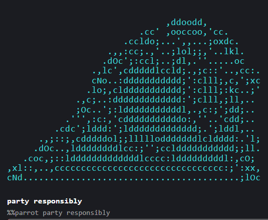
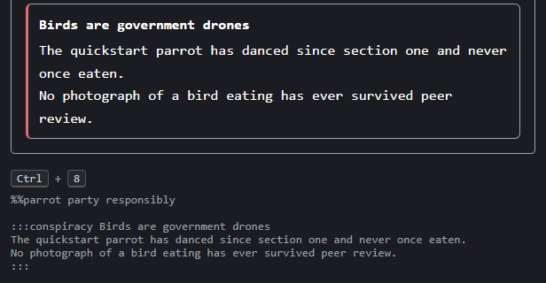

# Plugin Author Guide

This guide is for teaching the editor your own block or inline content. Everything you'll use comes from one import, `@voithos-labs/aragonite/plugin`. The package root, `@voithos-labs/aragonite`, is the embedding side, what a host app mounts the editor with.

Four neighbouring docs carry what this one doesn't:

- [directives.md](directives.md): the `:::name` directive grammar the walkthrough below builds on.
- [consumer-guide.md](consumer-guide.md): embedding, theming, and events, the host app's side.
- [plugin-api.md](plugin-api.md): a catalog of every export named anywhere below, for checking a name is real.
- [plugin-testing.md](plugin-testing.md): testing what you build.

This one's long, so here's a map. Each section stands on its own; jump straight to your question.

| Section                                                                                        | What it covers                                                                                                  |
| ---------------------------------------------------------------------------------------------- | --------------------------------------------------------------------------------------------------------------- |
| [The first fifteen minutes](#the-first-fifteen-minutes)                                        | One working plugin, a party parrot, from nothing to a passing test                                              |
| [What a plugin is](#what-a-plugin-is)                                                          | The mental model: what you declare, what the editor does with it, and which parts of the API are stable         |
| [Views: what you read, what you own](#views-what-you-read-what-you-own)                        | Why the document objects you get handed are read-only, and the right ways to change the document                |
| [One process, many editors](#one-process-many-editors)                                         | Two editors on one page: what they share, what stays separate, per-editor options                               |
| [Walkthrough: a `:::conspiracy` container](#walkthrough-a-conspiracy-container-end-to-end)     | Building a conspiracy-theory box (a title, evidence, a debunk shortcut), end to end: the biggest worked example |
| [The closure block](#the-closure-block)                                                        | The checklist every block must fill in: how it behaves under undo, selection, clipboard, and friends            |
| [Teaching the parser](#teaching-the-parser)                                                    | How the editor recognizes your syntax: matching lines, competing matches, multi-line constructs                 |
| [Editable-content tiers](#editable-content-tiers)                                              | The four ways a plugin can host user-editable content, and the text-block tier in depth                         |
| [Presentation modes](#presentation-modes)                                                      | Rendering right in reading, preview, and live modes                                                             |
| [Recipe: a render-primary block](#recipe-a-render-primary-block)                               | A diagram-shaped block: rendered picture, plugin-owned editing                                                  |
| [Recipe: reading the document above your block](#recipe-reading-the-document-above-your-block) | A block that derives from the whole document, like a table of contents                                          |
| [Inline kinds](#inline-kinds)                                                                  | Your own inline syntax: recognizing it mid-paragraph, rendering it as a widget, editing it                      |
| [Decorations](#decorations)                                                                    | View-only annotations over content you don't own                                                                |
| [Block commands](#block-commands)                                                              | Keyboard shortcuts and commands, for one block kind or for the whole editor                                     |
| [Paste transforms](#paste-transforms)                                                          | Rewriting pasted text before it parses                                                                          |
| [Recipe: a kind only a menu creates](#recipe-a-kind-only-a-menu-creates)                       | Blocks inserted from a menu instead of typed, without breaking save-and-reload                                  |
| [What a plugin may and may not do](#what-a-plugin-may-and-may-not-do)                          | The boundary, and what each mistake looks like when you cross it                                                |

## The first fifteen minutes

The `npm install @voithos-labs/aragonite` you already ran brings everything this guide uses: the package root, the `@voithos-labs/aragonite/plugin` authoring path, and the `@voithos-labs/aragonite/testing` entry your test suite will import. Nothing else to install.

The plugin we're about to build is an homage to `curl parrot.live`: a line that starts with `%%parrot` renders as an animated ASCII party parrot, and any text after the marker becomes the parrot's caption.

Before the code, two terms everything below leans on.

A **kind** is aragonite's word for a block type. Paragraph is a kind, fenced code is a kind, the parrot is about to be one.

A block's **raw** is its exact source bytes, markers included. The editor saves a document by concatenating raws and nothing else, so whatever your plugin writes into that field is exactly what lands in the user's file.

**Declare and describe.** Registering a kind is four calls. The rest of the guide keeps coming back to them, and so will you. Here's each one properly:

- **`declarePluginKind(name)`** mints a new kind and returns it (minted: created by the one authorized place; a duplicate throws). Every other call here takes that return value, and the type system won't accept the bare string in its place. A module that didn't mint the kind recovers it with `declaredPluginKind(name)`, which throws for an undeclared name (a typo, say) rather than registering against a kind that doesn't exist.
- **`registerBlockKind(kind, descriptor)`** describes how the kind behaves: does it merge, is it editable, does it host inline content, where can a caret sit beside it, and how it answers every cross-cutting editor system (the `closure` field). A leaf needs only what the sample below fills.
- **`registerBlockOpener(kind, opener)`** teaches the parser to recognize the syntax. An **opener** is the part of the parser that spots the line a block starts with: you give it a `priority` (its place in the dispatch order), an `interruptsParagraph` predicate, and a `tryOpen` that claims lines or declines. [Teaching the parser](#teaching-the-parser) is its full story.
- **`definePluginBlock({ name, kind, component, register })`** packages the lot as one installable unit: it runs your `register` step, then binds the component to the kind. It's the one-kind shortcut over the general `definePlugin` ([The plugin unit](#the-plugin-unit)).

The first one in action (a kind is a plain string underneath, with a type brand on top):

```ts
const parrot = declarePluginKind('parrot'); // 'parrot', branded as a kind
declaredPluginKind('parrot') === parrot; // true, same brand
declaredPluginKind('parot'); // throws: "parot" has not been declared
declarePluginKind('paragraph'); // throws: "paragraph" is a built-in BlockKind
```

And all four together, which is the whole plugin minus its component:

```ts
// parrot-plugin.ts
import {
	caretOffsetAtPoint,
	declarePluginKind,
	definePluginBlock,
	registerBlockKind,
	registerBlockOpener,
	simpleLeafClosure,
	type CaretTarget,
	type EditorPlugin
} from '@voithos-labs/aragonite/plugin';
import ParrotBlock from './ParrotBlock.svelte';

export const PARROT = 'parrot';

/** Where a press in the block puts the caret. The caption renders the bytes after `%%parrot `,
 *  so an offset in it sits that far along the source; the revealed source IS the source. */
function parrotCaretAtPoint(
	blockEl: HTMLElement,
	clientX: number,
	clientY: number
): CaretTarget | null {
	const source = blockEl.querySelector<HTMLElement>('.parrot-source');
	const view = source ?? blockEl.querySelector<HTMLElement>('.parrot-caption');
	if (!view) return null;
	const offset = caretOffsetAtPoint(view, clientX, clientY) ?? 0;
	return { path: [], offset: source ? offset : offset + '%%parrot '.length };
}

function registerParrotBlock(): void {
	const parrot = declarePluginKind(PARROT);

	registerBlockKind(parrot, {
		gapEdges: 'none',
		mergeRole: 'not-mergeable',
		editable: true,
		supportsInline: false,
		conformanceFixture: '%%parrot party responsibly\n',
		caretTargetAtPoint: parrotCaretAtPoint,
		closure: simpleLeafClosure({
			focus: { mode: 'implemented', via: 'createEditableLeaf render-primary reveal' },
			searchPaint: { mode: 'implemented', via: 'source raw scanned, matches painted as marks' },
			undo: { mode: 'implemented', via: 'render-primary: one commit when the caret leaves' },
			simOracle: { mode: 'inherit-default' }
		})
	});

	registerBlockOpener(parrot, {
		priority: 25,
		interruptsParagraph: (text) => text.startsWith('%%parrot'),
		tryOpen(ctx) {
			if (!ctx.line.text.startsWith('%%parrot')) return null;
			const node = { kind: parrot, leadingTrivia: ctx.leadingTrivia, raw: ctx.line.raw };
			return { node, consumed: 1 };
		}
	});
}

export function parrotPlugin(): EditorPlugin {
	return definePluginBlock({
		name: 'parrot',
		kind: PARROT,
		component: ParrotBlock,
		register: registerParrotBlock
	});
}
```

The object you handed `registerBlockKind` is the kind's **descriptor**. Most of its fields read as they sound. Four don't:

- `gapEdges` is required so a caret can always reach the space beside your block. Answering `'none'` is a decision, not an omission ([Editable-content tiers](#editable-content-tiers) has the full story).
- `closure` is required so every cross-cutting editor system (undo, search, selection, and the rest) gets a written answer from your kind. [The closure block](#the-closure-block) explains every cell.
- `conformanceFixture` is optional. Supplying it enrolls your kind in the conformance kit, a bundled suite of checks every registered kind is run through ([plugin-testing.md](plugin-testing.md)).
- `caretTargetAtPoint` is optional too: where a click inside your block puts the caret. Leave it out and a click on the folded view reveals the source at its first byte, which is a letdown when you clicked halfway into the caption.

The parrot's answer is two steps. The caption and the source line are different strings, and `caretOffsetAtPoint` does the pixel half: hand it one of your own elements and the click, and it gives back the character offset nearest that point, clamped into the element's box, so a click on the bird above the caption still lands on a character. The arithmetic between the two strings is yours, and for the parrot it's the length of its own marker: an offset in the caption sits `'%%parrot '.length` further along the source.

On the opener, `priority` decides where you sit in the built-in openers' dispatch order ([Opener priority](#opener-priority)) and `consumed` is the number of lines you claimed ([What an opener returns](#what-an-opener-returns)).

**Render.** The parrot is a **leaf**, a block with no child blocks (a container holds other blocks; the walkthrough later builds one). `createEditableLeaf` hands a leaf a native caret, IME composition (typing through an input method, the way Chinese or Japanese is typed), undo, selection, and clipboard. The parrot asks for it in `render-primary` mode, where the caption is what you see at rest and the source line only shows while the caret is in the block. The bird itself is ordinary **chrome** (a block's furniture, as opposed to its content): every frame stacked in one `<pre>` that CSS scrolls a frame at a time.

```svelte
<!-- ParrotBlock.svelte -->
<script lang="ts">
	import { createEditableLeaf, type NodeView } from '@voithos-labs/aragonite/plugin';

	let { node, index, myPath = [] }: { node: NodeView; index: number; myPath?: number[] } = $props();
	let sourceEl: HTMLDivElement | undefined = $state();
	let revealed = $state(false);

	const leaf = createEditableLeaf({
		getNode: () => node,
		getIndex: () => index,
		getPath: () => myPath,
		getEl: () => sourceEl ?? null,
		mode: 'render-primary',
		singleLine: true,
		isRevealed: () => revealed,
		setRevealed: (next) => (revealed = next)
	});

	// Frames 0 and 5 of the canonical ten. The full dance is in ./plugin-guide/parrot-frames.md;
	// this is a guide, not an aviary.
	const FRAMES = [
		String.raw`
                         .cccc;;cc;';c.
                      .,:dkdc:;;:c:,:d:.
                     .loc'.,cc::c:::,..;:.
                   .cl;....;dkdccc::,...c;
                  .c:,';:'..ckc',;::;....;c.
                .c:'.,dkkoc:ok:;llllc,,c,';:.
               .;c,';okkkkkkkk:;lllll,:kd;.;:,.
               co..:kkkkkkkkkk:;llllc':kkc..oNc
             .cl;.,oxkkkkkkkkkc,:cll;,okkc'.cO;
             ;k:..ckkkkkkkkkkkl..,;,.;xkko:',l'
            .,...';dkkkkkkkkkkd;.....ckkkl'.cO;
         .,,:,.;oo:ckkkkkkkkkkkdoc;;cdkkkc..cd,
      .cclo;,ccdkkl;llccdkkkkkkkkkkkkkkkd,.c;
     .lol:;;okkkkkxooc::coodkkkkkkkkkkkko'.oc
   .c:'..lkkkkkkkkkkkkkkkkkkkkkkkkkkkkkkd,.oc
  .lo;,:cdkkkkkkkkkkkkkkkkkkkkkkkkkkkkkkd,.c;
,dx:..;lllllllllllllllllllllllllllllllllc'...
cNO;........................................
`,
		String.raw`

           .,,,,,,,,,.
         .ckKxodooxOOdcc.
      .cclooc'....';;cool.
     .loc;;;;clllllc;;;;;:;,.
   .c:'.,okd;;cdo:::::cl,..oc
  .:o;';okkx;';;,';::;'....,:,.
  co..ckkkkkddkc,cclll;.,c:,:o:.
  co..ckkkkkkkk:,cllll;.:kkd,.':c.
.,:;.,okkkkkkkk:,cclll;.ckkkdl;;o:.
cNo..ckkkkkkkkko,.;loc,.ckkkkkc..oc
,dd;.:kkkkkkkkkx;..;:,.'lkkkkko,.:,
  ;:.ckkkkkkkkkkc.....;ldkkkkkk:.,'
,dc..'okkkkkkkkkxoc;;cxkkkkkkkkc..,;,.
kNo..':lllllldkkkkkkkkkkkkkkkkkdcc,.;l.
KOc,c;''''''';lldkkkkkkkkkkkkkkkkkc..;lc.
xx:':;;;;,.,,...,;;cllllllllllllllc;'.;od,
cNo.....................................oc
`
	];
	// One strip the CSS scrolls a frame at a time. The closing newline is load-bearing: a `pre`
	// drops a trailing blank line, and a strip a row short steps a fraction off every frame.
	const REEL = FRAMES.join('\n') + '\n';
	// The clip window's height, which is why every frame has to be the same number of rows.
	const FRAME_ROWS = FRAMES[0].split('\n').length;

	const caption = $derived(node.raw.slice('%%parrot'.length).trim());

	export const editable = true;
	export const focusable = true;
	export const focus = leaf.focus;
	export const getCursorOffset = leaf.getCursorOffset;
	export const parkCaret = leaf.parkCaret;
	export const focusAtColumn = leaf.focusAtColumn;
	export const getSelectedText = leaf.getSelectedText;
	export const setSelection = leaf.setSelection;
	export const measurePartialRects = leaf.measurePartialRects;
	export const runCommand = leaf.runCommand;
	export const insertMarkdown = leaf.insertMarkdown;
</script>

<div
	class="parrot-block"
	{...leaf.renderProps}
	style:--parrot-rows={FRAME_ROWS}
	style:--parrot-frames={FRAMES.length}
>
	<div class="parrot" aria-hidden="true"><pre class="parrot-reel">{REEL}</pre></div>
	{#if revealed}
		<div
			bind:this={sourceEl}
			{...leaf.surfaceProps}
			class="parrot-source"
			aria-label="Party parrot source"
		></div>
	{:else}
		<div
			class="parrot-caption"
			role="button"
			tabindex="-1"
			aria-label="Party parrot caption (click to edit)"
		>
			{caption}
		</div>
	{/if}
</div>

<style>
	.parrot {
		/* a terminal cell is about twice as tall as it is wide; prose line-height stretches the bird */
		font-size: 1.1em;
		line-height: 1.1;
		letter-spacing: 0.05em;
		/* one frame tall, in the reel's own rows so a step lands on the next frame exactly */
		height: calc(var(--parrot-rows) * 1lh);
		/* wider than a phone column, and the editor root pans if it isn't contained; the bar
		   would sit across the bird, which is decoration rather than a pane to scroll */
		overflow-x: auto;
		overflow-y: hidden;
		scrollbar-width: none;
		/* chrome, not content: every frame is in the DOM and none of them belong in a copy */
		user-select: none;
		animation: parrot-hue 0.49s step-end infinite;
	}
	.parrot-reel {
		/* type and rhythm come from the box above, so its `lh` is this reel's row exactly */
		margin: 0;
		animation-name: parrot-reel;
		animation-duration: calc(var(--parrot-frames) * 70ms);
		animation-timing-function: steps(var(--parrot-frames));
		animation-iteration-count: infinite;
	}
	@keyframes parrot-reel {
		to {
			transform: translateY(-100%);
		}
	}
	/* parrot.live's seven, stepped rather than blended so every run of the dance looks the same */
	@keyframes parrot-hue {
		0% {
			color: #ff5f5f;
		}
		14.286% {
			color: #ffc83d;
		}
		28.571% {
			color: #3fd97a;
		}
		42.857% {
			color: #5aa9ff;
		}
		57.143% {
			color: #ff6ad5;
		}
		71.429% {
			color: #3fd3d3;
		}
		85.714% {
			color: var(--color-text-primary, currentColor);
		}
	}
	@media (prefers-reduced-motion: reduce) {
		.parrot,
		.parrot-reel {
			animation: none;
		}
	}
	.parrot-caption {
		margin: 0.25em 0 0;
		font-weight: 700;
		cursor: text;
	}
	.parrot-source {
		/* the bytes, dimmed the way the editor dims a marker */
		opacity: 0.55;
		font-family: monospace;
		font-size: 0.9em;
		outline: none;
	}
</style>
```

The component has an editing half and a parrot half, and the parrot half never touches the editor.

The editing half is the factory call, the `revealed` flag, two spreads, and the one-line re-exports:

- `revealed` is yours. The factory flips it through `setRevealed` (on when a click or an arrow lands in the block, off when the caret leaves), and the `{#if}` swaps the two views on it.
- `surfaceProps` goes on the source line. `renderProps` goes on the block wrapper, so a click anywhere in the block reveals, bird included, and lands where `caretTargetAtPoint` said. Spread both; a folded view that takes the click but not the keys swallows undo while it holds focus.
- `focus`, `getCursorOffset`, `editable` and `focusable` are the four every block component must export. The other seven are how `insertMarkdown`, `runCommand`, and a selection landing reach your block, so keep them.
- The commit happens when the caret leaves, not per keystroke. Reveal, type, arrow out: one undo entry, and the caption follows the new raw.
- `singleLine: true` says the bytes are one line (the opener claims exactly one), so Enter ends the block instead of typing a newline nothing could show you: whatever sits after the caret becomes a paragraph below, and the caret goes with it, same as in a heading. A leaf whose bytes can span lines leaves the flag off and gives its source element `white-space: pre-wrap` instead, for a reason [The editable leaf](#the-editable-leaf) explains.

The parrot half is the `<pre>`, its CSS, and the caption reading straight off `node.raw`. No script runs per frame, and `prefers-reduced-motion` parks the bird on its first frame for free. It does owe the document one thing, which every block wider than the text column owes: scroll inside your own box (`overflow-x: auto`, same as a code block or a table). The editor root scrolls, so an uncontained block pans the whole page sideways and takes the prose with it.

And the full ten-frame dance? Go see [parrot-frames.md](plugin-guide/parrot-frames.md) for the actual frames; not gonna put them all here.

**Install.** Pass the unit to the editor's `plugins` prop: build the array once at module scope, then `<Editor {source} {plugins} />` ([The plugin unit](#the-plugin-unit) shows the wiring and why module scope matters). This exact parrot also ships in the package, as `@voithos-labs/aragonite/plugins/parrot`, and a test keeps the shipped files identical to the fences above, so if you're building your own, rename it before the two meet. A `%%parrot` line now parses to your kind (`parse` is on the plugin path too, if you want to see it outside the editor):

```ts
parse('%%parrot party responsibly\n').children[0];
// { kind: 'parrot', leadingTrivia: '', raw: '%%parrot party responsibly\n' }
```

It dances through your component.



**Verify.** Registering a kind enrolls it in the conformance kit, which parses your fixture, round-trips it (parse, serialize, compare the bytes), and checks the closure cells it can reach without a browser against what you claimed.

```ts
import { installPlugins } from '@voithos-labs/aragonite';
import { declaredPluginKind } from '@voithos-labs/aragonite/plugin';
import { resetPluginPlatformForTests, runKindConformance } from '@voithos-labs/aragonite/testing';
import { PARROT, parrotPlugin } from './parrot-plugin';

it('parrot conforms', async () => {
	resetPluginPlatformForTests();
	installPlugins([parrotPlugin()]);
	await runKindConformance(declaredPluginKind(PARROT));
});
```

That's the loop: describe the kind, render it, install it, verify the bytes. Everything after this is the same four moves at more interesting shapes.

## What a plugin is

A plugin teaches the editor a new kind: a first-class citizen of the document tree that parses, renders, and serializes alongside the built-ins (not an embed bolted to the side). You declare the kind, then wire up to three things:

```
declare a kind ──┬─▶ descriptor   how it merges, its container shape, its keymap
                 ├─▶ component    how it renders and hosts any editable content
                 └─▶ grammar      how source becomes the kind:
                                    a block opener  │  a :::name directive  │  an inline recognizer
```

Each part has a defined absence, which is prob the easiest way to remember what each one is for:

| Part       | It makes the kind       | Leave it out and                                                                                                                                                                     |
| ---------- | ----------------------- | ------------------------------------------------------------------------------------------------------------------------------------------------------------------------------------ |
| descriptor | behave                  | the kind errors at first use; this one is never optional                                                                                                                             |
| component  | visible                 | the kind renders as a visible raw-text fallback                                                                                                                                      |
| grammar    | parseable from Markdown | nothing ever parses to the kind, and bytes that reload as prose are no kind at all; [the menu recipe](#recipe-a-kind-only-a-menu-creates) is the honest route to a kind nobody types |

### Registration is global, and register-once

A kind is a definition every editor on the page shares, and it's defined exactly once. Registering the same kind, component, or opener twice **throws**, never silently overrides, whether you collided with a built-in or with another plugin. There's no unregister and no runtime replace. (If you've met the browser's `customElements.define`, it's the same model: one definition for the whole page, not one per document.)

Who guarantees a registration runs only once depends on where it runs:

- **Inside a plugin unit** (the installable package the next section defines), `setup` runs at most once per process. Write each `register*` call straight; the unit owns the guarantee.
- **At module scope**, meaning register calls that run when a file is imported, nothing owns the run for you. Guard each call on its probe, the matching is-it-there check: `isBlockKindDeclared`, `isBlockKindRegistered`, `isBlockComponentRegistered`, `isBlockOpenerRegistered`, `isBlockCompleterRegistered`, `isPasteTransformRegistered`, `isDirectiveRegistered`, and `isInlineKindDeclared` for the inline tier.

```ts
isBlockKindDeclared('parrot'); // false on a fresh page
if (!isBlockKindDeclared(PARROT)) registerParrotBlock();
isBlockKindDeclared('parrot'); // true, so a second import of this module skips the register
```

Guard on the probe, never on a module-level `registered` flag: the flag survives `resetPluginPlatformForTests()` and then silently skips the re-registration your next test case needed, which is a fun half hour to spend.

One dev-time softening. Under a dev server, re-evaluating a registration module replaces its prior registrations in place, so a changed definition takes effect on re-run (editing a plugin unit's own `definePlugin` still needs a page reload, and the replace covers every register-once registry, paste transforms included). Production builds and test runs keep the throw.

### The plugin unit

A **plugin unit** is the installable package: a name plus a `setup` that runs your `register*` calls.

**`definePlugin({ name, setup })`**

Validates the unit at definition time (the name is a lowercase first letter followed by letters, digits, and hyphens, and `setup` has to be a function) and returns an `EditorPlugin`. By convention you export a **factory**, meaning `export function myPlugin(deps?)` returns the unit, and the factory's argument carries any **process-global dependency** the plugin needs (a render engine, say, which is the same for every editor). Configuration that could differ per editor takes a different path ([One process, many editors](#one-process-many-editors)); the factory argument is only for what never varies between editors.

```ts
export function myPlugin(options?: { renderer?: Renderer }): EditorPlugin {
	return definePlugin({
		name: 'my-plugin',
		setup() {
			registerMyKind(options?.renderer ?? defaultRenderer);
			registerBlockComponent(declaredPluginKind('my-kind'), defineBlockComponent(MyBlock));
		}
	});
}
```

Install by passing units to the editor's **`plugins` prop**, set once at mount, before the first parse:

```svelte
<script module lang="ts">
	import { myPlugin } from './my-plugin';

	// Build the array once at module scope, not inline in the markup: an inline
	// `plugins={[myPlugin()]}` re-creates the unit every render, and the second render's
	// same-name/different-identity unit trips a harmless first-wins dev-warn.
	const plugins = [myPlugin()];
</script>

<Editor {source} {plugins} />
```

**A plugin installs once per process, keyed by name.** The consequences, one per line:

- Passing the same unit again no-ops.
- Passing a _different_ unit under a name already installed keeps the first and warns in a dev build, naming the loser as `name@version` when it carries one.
- Units install in array order.
- A `setup` that throws stays failed: a later attempt rethrows and tells you to reload, because a partial setup can't re-run against the register-once registries.
- Two editors passing the same plugin share one registration, but their _configuration_ isn't shared: an editor may pass `{ plugin, options }` and the plugin reads its own `options` off each instance ([the options recipe](#recipe-per-instance-options-and-the-factory-closure-trap)).
- **The prop is also the enablement set.** Registration is process-wide; activation is not. An editor runs the `onEditor` hooks, resolves the kinds, answers the global commands and applies the paste transforms of exactly the plugins its own array lists. A plugin another editor on the page installed but this one left out does nothing here, and its blocks fall back to raw-editable text. An editor with no `plugins` prop at all is the exception: it activates everything installed.

Two smaller routes. For an editor-less `parse()` pipeline that needs the grammar live without mounting `<Editor>`, call `installPlugins(units)` from `@voithos-labs/aragonite`, with the same once-per-process semantics. And `isPluginInstalled(name)` probes an install, for the rare setup that has to branch on it; the prop and `installPlugins` are already safe to call twice, and most people never reach for it.

```ts
import { installPlugins } from '@voithos-labs/aragonite';

isPluginInstalled('parrot'); // false
installPlugins([parrotPlugin()]);
isPluginInstalled('parrot'); // true
installPlugins([parrotPlugin()]); // no-op
```

### What is stable, what is not

The API is going to freeze, and you deserve to know which half of it is already load-bearing.

- **The registration base, stable.** Kind declaration, descriptor/component/opener registration, typed per-node metadata, and the probes above. These shapes won't change in a breaking way. (One exception already landed pre-freeze: an opener's return became a line count in 0.9.36, see [What an opener returns](#what-an-opener-returns).)
- **Pre-freeze, still moving.** Everything else. The [API reference](plugin-api.md) carries the list rather than this sentence: a section labelled _(pre-freeze / unstable)_ may still change shape until the freeze. Those labels are copied from the section headers of the `@voithos-labs/aragonite/plugin` entry point (`src/lib/plugin.ts` in the repository). The big families are the plugin unit itself, the authoring tiers (container, editable leaf, inline, directive), the grammar hooks, paste transforms, and the view surfaces (decorations, rects, selection geometry). Each is being refined against real consumers, and each freezes at the public release.

After the freeze the version number carries the promise: a breaking change to a frozen surface rides a **major** version, and additive needs ship as **minors**.

## Views: what you read, what you own

Every surface that hands your plugin a node to **read** types it as a view: `NodeView` for a block node, `DocumentView` for the root document. A view is deep-readonly on the serialized bytes: a byte write through one is a compile error. "Never mutate the tree from the view layer" isn't a rule you have to remember.

Two lists cover the whole read side:

- **What the readonly covers:** `raw`, `kind`, `metadata` (the typed per-node data a plugin stores beside the bytes), trivia (the preserved blank-line bytes around a block, the `leadingTrivia` your parrot opener copied), and the children structure.
- **Where views arrive:** `BlockComponentProps.node` / `document`, `EditorContext.document` (defined in the next section), a decoration source's `provide(document, …)`, the descriptor read hooks (`getContentRange`, `estimateHeight`, `reservedChrome.isCollapsed`, `reservedChrome.expandPatch`), and the command contexts.

`CstNode` and `Document` stay the shapes a plugin **constructs and owns**: an opener or directive factory builds a `CstNode`, and `rebuildRaw` receives one to write, because that call hands it an owned node, which is exactly when a byte write is legal. A document you parsed yourself is mutable, and feeds every view-typed parameter with no conversion.

Mutating the **live** tree goes through the sanctioned commit paths: `updateOwnMetadata` (defined in the walkthrough), `rebuildRaw` (just below), and [Block commands](#block-commands). A **commit** is an edit the editor records as one undoable step. Never write through a view, and don't cast a view back to `CstNode` either: undo snapshots share nodes with the live tree, so a stray write through a cast corrupts history.

### `rebuildRaw`, the write hook

You'll meet it again and again in this guide, so here's the fuller treatment.

**`rebuildRaw(node, changed?)`**

The hook a container kind declares so the editor can recompute the container's raw from its children and metadata after an edit. It receives the **owned** `CstNode` and writes the recomputed bytes onto it. Ignoring the second argument and re-deriving the whole raw is always correct, and it's what most rebuilders should do (it's also what every rebuilder does when the argument is absent).

```ts
// A fence around its children, nothing else in the raw. serializeChildren joins each
// child's leadingTrivia + raw, the same join a save runs.
function rebuildBoxRaw(node: CstNode): void {
	node.raw = `:::box\n${serializeChildren(node.children ?? [])}:::\n`;
}
// the editor calls it after a child edit; node.raw now reads ':::box\nedited line\n:::\n'
```

A directive container with a title line doesn't hand-write this at all: `createDirectiveRebuild` in the walkthrough does the same job with the fence bytes, the line ending and the title handled for you.

The optional `changed` argument (`ChildRawChange`, shaped `{ index, previousRaw }`) is a performance opt-in: the index of the one child whose own raw just moved, plus the bytes that child held before. It exists for a container big enough that re-reading every child on every keystroke costs real time, and the built-in list and quote use it to re-emit that one child's region alone. Take it only if your kind can place a child's bytes inside its raw exactly, and keep those offsets in `node.childSpans`, the one cache the editor retires for you when its own bookkeeping moves a sibling's line. Offsets you cache anywhere else are yours to invalidate; nothing in the editor is watching them. The conformance kit compares the two paths for your kind either way.

## One process, many editors

`setup` runs once per process, but a plugin usually needs to react to _each editor_: recompute derived state on every edit, hold per-document data, read the options a given editor passed. `ctx.onEditor(cb)` is that entry point. It registers a callback fired once per mounted `<Editor>` that listed your plugin, handed that instance's **`EditorContext`**:

```ts
setup(ctx) {
	ctx.onEditor((editor) => {
		editor.editorId; // 'editor-1' (the next editor to mount gets 'editor-2')
		editor.document.children.length; // 3, and live: read it again later and you get the current count
		editor.presentationMode; // 'source'
		editor.theme; // 'dark'
		return () => {}; // runs at unmount
	});
}
```

| Field              | What it gives you                                                                                                                 |
| ------------------ | --------------------------------------------------------------------------------------------------------------------------------- |
| `editorId`         | A stable per-mount id. Key your own `Map` / `WeakMap` on it for per-editor state                                                  |
| `document`         | A live getter for the root document, as a read-only `DocumentView` ([Views](#views-what-you-read-what-you-own))                   |
| `events`           | The subscribe-only event view; `events.on('edit', …)` returns a disposer                                                          |
| `options`          | The options this editor passed, typed once you write `definePlugin<Options>` (recipe below)                                       |
| `decorations`      | This editor's decoration registry, where you register a source ([Decorations](#decorations))                                      |
| `rects`            | This editor's viewport-space geometry: block box, range rects, caret, reveal, navigation                                          |
| `presentationMode` | The effective presentation mode, live, paired with the `presentationModeChange` event ([Presentation modes](#presentation-modes)) |
| `theme`            | The editor's theme name, live, paired with the `themeChange` event, for content whose colors an engine paints                     |

Return a disposer from the callback and the editor runs it at unmount. Registration is synchronous-only: call `onEditor` from `setup`, not from some later callback.

### Recipe: per-instance derived state

There's no plugin-state field on the platform, and you don't need one. Keep your own map keyed on `editorId`, seed it when the editor mounts, recompute on the `edit` event, and delete the entry in the disposer. That's the whole feature.

```ts
import { definePlugin, type EditorContext } from '@voithos-labs/aragonite/plugin';

interface WordCountOptions {
	live: boolean; // recount on every edit, or only at mount
}

// Per-editor state lives in a plugin-owned map, not a platform field.
const countByEditor = new Map<string, number>();

function recount(editor: EditorContext<WordCountOptions>): void {
	const words = editor.document.children.reduce(
		(n, block) => n + block.raw.split(/\s+/).filter(Boolean).length,
		0
	);
	countByEditor.set(editor.editorId, words);
}

export const wordCountPlugin = definePlugin<WordCountOptions>({
	name: 'word-count',
	setup(ctx) {
		ctx.onEditor((editor) => {
			// A bare-unit install passes no options, so default them.
			const { live } = editor.options ?? { live: true };
			recount(editor); // seed on mount
			const off = live ? editor.events.on('edit', () => recount(editor)) : () => {};
			return () => {
				off();
				countByEditor.delete(editor.editorId); // per-editor cleanup
			};
		});
	}
});
```

### Recipe: per-instance options (and the factory-closure trap)

Two editors share one process-global registration but may still want different options; a split-pane host is the classic case. The consumer varies them per editor through the `plugins` prop's entry form:

```svelte
<Editor source={left} plugins={[{ plugin: wordCountPlugin, options: { live: true } }]} />
<Editor source={right} plugins={[{ plugin: wordCountPlugin, options: { live: false } }]} />
```

`definePlugin<WordCountOptions>` carries the type through, so `editor.options` reads typed inside `onEditor` with no cast.

**The trap.** Don't hold per-instance config in the plugin factory's closure. `wordCountPlugin({ live: false })` looks like it configures the instance, but a plugin installs once per process, so only the first editor's factory value ever takes effect and the second is silently ignored. The question that decides it: _would two editors ever want different values?_ If yes, it's per-instance: pass it through the prop entry and read `editor.options`. If no (a render engine, a shared parser), the factory argument is the right home.

## Walkthrough: a `:::conspiracy` container end to end

Enough preamble. This builds a `:::conspiracy` box: a titled, editable container whose title is a real editable line carrying the theory, and whose body holds the evidence as ordinary Markdown blocks. One kind answers to two directive names, `:::conspiracy` and `:::debunked` (somebody checked), and reads which one it is from its metadata, so the verdict is a one-field edit rather than a second block kind. Every import comes from the package, and it runs unchanged in a fresh SvelteKit app that installed the editor five minutes ago.

It reuses the `:::name` directive grammar rather than a hand-written opener. The grammar's tiers, dispatch, and losslessness belong to the [directives guide](directives.md); this walkthrough owns the descriptor and the component side.

### The registration module

One file declares the kinds, describes them, maps the directive names, binds the component, and returns the whole thing as a `conspiracyPlugin()` unit.

```ts
// conspiracy-kind.ts
import {
	activateDirectives,
	chromeChild,
	createDirectiveRebuild,
	declarePluginKind,
	declaredPluginKind,
	definePluginBlock,
	DIRECTIVE_BODY_WRAP,
	isDirectiveRegistered,
	registerBlockKind,
	registerBlockCommand,
	registerChromeLeaf,
	registerDirective,
	setPluginMetadata,
	type CstNode,
	type EditorPlugin,
	type ParsedDirective
} from '@voithos-labs/aragonite/plugin';
import ConspiracyBlock from './ConspiracyBlock.svelte'; // the component built in the next section

const CONSPIRACY = 'conspiracy';
const CONSPIRACY_TITLE = 'conspiracy-title';

export interface ConspiracyMetadata {
	name: string; // 'conspiracy' or 'debunked'; re-emitted into raw so the verdict survives
	colonCount: number;
	closerColonCount: number;
	closerNewline: boolean;
	lineEnding: string; // captured at parse; createDirectiveRebuild re-emits it (CRLF-safe)
}

// Build the node from a parsed :::conspiracy fence. Child 0 is the title (the theory,
// from the opener line); children 1+ are the parsed evidence. The fence bytes go to
// metadata so the raw can be rebuilt after an edit.
function conspiracyFromDirective(parsed: ParsedDirective): CstNode {
	const theory = parsed.fence.info.trim();
	const node: CstNode = {
		kind: declaredPluginKind(CONSPIRACY),
		leadingTrivia: parsed.leadingTrivia,
		raw: parsed.raw,
		innerPrefix: parsed.body?.prefix ?? '',
		children: [
			chromeChild(declaredPluginKind(CONSPIRACY_TITLE), theory),
			...(parsed.body?.children ?? [])
		],
		innerSuffix: parsed.body?.suffix ?? ''
	};
	setPluginMetadata<ConspiracyMetadata>(node, {
		name: parsed.fence.name,
		colonCount: parsed.fence.colonCount,
		closerColonCount: parsed.closerColonCount,
		closerNewline: parsed.closerNewline,
		lineEnding: parsed.lineEnding
	});
	return node;
}

// Re-emit raw from the children after any structural edit. createDirectiveRebuild owns
// the title-to-opener line, the body serialization, and the authored line ending (the
// byte a hand-written copy silently drops); you supply only the verdict-name resolver.
const rebuildConspiracyRaw = createDirectiveRebuild<ConspiracyMetadata>(
	(meta) => meta?.name ?? CONSPIRACY
);

function registerConspiracy(): void {
	activateDirectives(); // idempotent; the shared grammar must be live before the first parse

	const conspiracy = declarePluginKind(CONSPIRACY);
	const conspiracyTitle = declarePluginKind(CONSPIRACY_TITLE);

	// Two names, one kind: :::conspiracy and :::debunked both resolve here, the kind
	// reading its verdict back from metadata; any other name falls through to the
	// generic directive fallback. The guard is habit: nothing bundled claims these
	// names, but note and tip are claimed by the bundled admonitions plugin, and
	// that is where an unguarded claim throws for real.
	for (const name of [CONSPIRACY, 'debunked']) {
		if (!isDirectiveRegistered('container', name)) {
			registerDirective('container', name, {
				kind: conspiracy,
				fromDirective: conspiracyFromDirective
			});
		}
	}

	// A block command that flips the verdict. updateMetadata is the sanctioned
	// commit path: it merges the patch, runs rebuildRaw, and makes one undoable edit;
	// because the name flows into raw, the verdict survives a round-trip.
	const setVerdict = registerBlockCommand(conspiracy, 'conspiracy.setVerdict', (ctx) => {
		if (typeof ctx.arg !== 'string') return false;
		ctx.updateMetadata({ name: ctx.arg });
		return true;
	});

	registerBlockKind(conspiracy, {
		mergeRole: 'container',
		editable: true,
		supportsInline: false,
		// Fences leave no textual way out at either edge, so both take the gap caret. Without
		// this, two adjacent conspiracies give the user nowhere to type a paragraph between them.
		gapEdges: 'both',
		container: {
			// The title lives in the opener line, so raw is not a strip of the children:
			// 'opaque' marks raw authoritative.
			contract: 'opaque',
			rebuildRaw: rebuildConspiracyRaw,
			// Every `:::` body parses against this wrap. Skip it and a filled innerPrefix
			// trips a dev assertion the moment someone edits a conspiracy with a blank first line.
			bodyWrap: DIRECTIVE_BODY_WRAP,
			reservedChrome: { kind: conspiracyTitle },
			// Child 0 is the title, so Backspace at its start must not lift it out of the
			// conspiracy. A container whose child 0 is body lifts instead:
			// `'lift-first-child-keep-container'`, or `'-drop-opener'` for a quote shape.
			unwrapRole: {
				firstChildBackspace: 'keep-reserved-chrome',
				middleChildBackspace: 'default-merge'
			}
			// Declare `reorderChildren` here if your container's direct children should
			// reorder among themselves (drag, or Alt+ArrowUp/ArrowDown). Absent, a child's
			// reorder resolves at an ancestor instead, which moves the whole container
			// among its own siblings. The closure block does not ask about this axis, and
			// a behavioural test on your container passes either way.
		},
		keymap: [
			{ chord: 'Mod+7', command: setVerdict, arg: 'conspiracy' }, // allege
			{ chord: 'Mod+8', command: setVerdict, arg: 'debunked' } // debunk
		],
		// Required: how this kind behaves under every cross-cutting editor system. A missing
		// cell or column is a compile error, and four more rules are checked when the editor
		// boots. See the guide's "The closure block" section for all of them.
		closure: {
			roundTrip: { mode: 'implemented', via: 'container contract=opaque, rebuildConspiracyRaw' },
			focus: { mode: 'implemented', via: 'focus walks to the title chrome / first body child' },
			mergeBackspace: { mode: 'implemented', via: 'mergeRole=container + unwrapRole' },
			selectionPaint: { mode: 'implemented', via: 'body child blocks paint; container cover' },
			searchPaint: {
				mode: 'implemented',
				via: 'children are real blocks; search descends and paints'
			},
			reorder: { mode: 'implemented', via: 'whole-block reorder through the parent BlockList' },
			undo: {
				mode: 'implemented',
				via: 'updateMetadata; the verdict flip commits as one undo entry'
			},
			// reservedChrome means the default byte slice is wrong for this kind, so the
			// clipboard cell has to name what a slice touching the title actually does.
			clipboard: {
				mode: 'implemented',
				via: 'byte-slice copy; a slice touching the title re-emits the conspiracy around the collected body'
			},
			// `inherit-default` is the honest answer unless you actually run a corruption
			// oracle over your kind. Claiming a mechanism you do not have is worse than
			// admitting you inherit the generic one.
			simOracle: { mode: 'inherit-default' }
		}
	});

	registerChromeLeaf(conspiracyTitle, { blockClass: 'conspiracy-title' });
}

// definePluginBlock wraps definePlugin around the register step and the component
// binding, so you write neither the setup-then-register order nor the
// registerBlockComponent(declaredPluginKind(...), defineBlockComponent(...)) double-wrap.
export function conspiracyPlugin(): EditorPlugin {
	return definePluginBlock({
		name: 'conspiracy',
		kind: CONSPIRACY,
		component: ConspiracyBlock,
		register: registerConspiracy
	});
}
```

`registerDirective`'s `(tier, name)` mapping, the `ParsedDirective` shape, and the per-tier factory rules live in the [directives guide](directives.md). This module supplies the container factory (`fromDirective`, required for the container tier) and the descriptor. Here's what `conspiracyFromDirective` actually receives for the seed document [Wire it into a page](#wire-it-into-a-page) uses, and what it hands back:

```ts
// parsed, for ':::conspiracy Birds are government drones\nThe quickstart parrot has danced since section one and never once eaten.\n:::\n'
{
	fence: { tier: 'container', colonCount: 3, name: 'conspiracy', info: ' Birds are government drones' },
	body: {
		kind: 'document',
		prefix: '',
		children: [{ kind: 'paragraph', leadingTrivia: '', raw: 'The quickstart parrot has danced since section one and never once eaten.\n' }],
		suffix: ''
	},
	leadingTrivia: '',
	raw: ':::conspiracy Birds are government drones\nThe quickstart parrot has danced since section one and never once eaten.\n:::\n',
	closerColonCount: 3,
	closerNewline: true,
	lineEnding: '\n'
}

// the node it builds
chromeChild(conspiracyTitle, 'Birds are government drones'); // { kind: 'conspiracy-title', leadingTrivia: '', raw: 'Birds are government drones\n' }
node.children.map((child) => child.kind); // ['conspiracy-title', 'paragraph']
getPluginMetadata<ConspiracyMetadata>(node); // { name: 'conspiracy', colonCount: 3, closerColonCount: 3, closerNewline: true, lineEnding: '\n' }
```

That nine-column `closure` literal gets its own section, [The closure block](#the-closure-block), right after this walkthrough.

### The component

Your component supplies only its own chrome: the border, the title styling, an icon if you like. Chrome may read the node it dresses: the verdict comes off the metadata through `getPluginMetadata`, and the stamp follows it. `createContainerBlock` hides the child-list state, the ancestor wiring, and the windowing (the editor only mounts the blocks in view, and a container windows its own children too). Pass `node`, `index`, and `path` as **thunks**, meaning `getNode` / `getIndex` / `getPath` functions the factory calls to read the live value each time; a captured value would be a stale snapshot. The type won't let you pass one anyway: a function-valued field is a live read, a plain-valued field is static config.

```svelte
<!-- ConspiracyBlock.svelte -->
<script lang="ts">
	import {
		BlockList,
		createContainerBlock,
		getPluginMetadata,
		type NodeView
	} from '@voithos-labs/aragonite/plugin';
	import type { ConspiracyMetadata } from './conspiracy-kind';

	let { node, index, myPath = [] }: { node: NodeView; index: number; myPath?: number[] } = $props();
	let boxEl: HTMLElement | undefined = $state();

	const { blockListProps, containerApi, handleKeydown } = createContainerBlock({
		getNode: () => node,
		getIndex: () => index,
		getPath: () => myPath,
		getBoxEl: () => boxEl
	});

	// The verdict is read off the node, so the stamp lands the moment the command commits.
	const debunked = $derived(getPluginMetadata<ConspiracyMetadata>(node)?.name === 'debunked');

	export { containerApi };
</script>

<!-- svelte-ignore a11y_no_static_element_interactions -->
<div class="conspiracy-block" class:debunked bind:this={boxEl} onkeydown={handleKeydown}>
	<BlockList {...blockListProps} />
</div>

<style>
	.conspiracy-block {
		/* the corkboard, with one piece of red string */
		position: relative;
		border: 1px solid var(--color-ui-muted, #a4a4a4);
		border-left: 3px solid var(--color-error, #e06c75);
		border-radius: 6px;
		padding: 8px 12px;
	}
	.conspiracy-block :global(.conspiracy-title) {
		font-weight: 600;
	}
	/* debunked: the string comes down, the theory gets crossed out, the stamp lands */
	.debunked {
		border-left-color: var(--color-ui-muted, #a4a4a4);
	}
	.debunked :global(.conspiracy-title) {
		text-decoration: line-through;
	}
	.debunked::after {
		content: 'DEBUNKED';
		position: absolute;
		top: 6px;
		right: 12px;
		transform: rotate(-12deg);
		font: 600 0.75em monospace;
		letter-spacing: 0.12em;
		color: var(--color-error, #e06c75);
		border: 2px solid currentColor;
		border-radius: 3px;
		padding: 1px 6px;
	}
</style>
```

Three rules for that file, each earned the hard way:

- **`export { containerApi }` is the whole publication.** That one instance export is your block's `BlockComponent` surface, and the editor resolves a container reference through it. Both the name and the shape are fixed: the component registry types a block's exports as either a leaf surface or a container's `containerApi`, and the container branch is `ContainerBlockComponent`, which requires the descent verbs (`focusByPath`, `revealByPath`, `parkCaret` and the rest; a caret entering a container has to descend, so they aren't optional the way a leaf's extras are). Omitting the export, or publishing a surface missing one of them, fails your typecheck (svelte-check, or `tsc` on a plain-TypeScript plugin) at the call that registers your component (`definePluginBlock` here, `registerBlockComponent` if you register by hand). The factory's surface satisfies all of it by construction; a hand-rolled one can annotate itself `satisfies ContainerBlockComponent` to get the same error at the definition instead of at the registration.
- **`BlockList` stays a _direct_ child of your box**, so the container's windowing finds it. Other chrome (an icon, a toggle button) may sit beside it.
- **Chrome CSS reads the editor's theme tokens**, with an inline fallback on every read (`var(--color-ui-muted, #a4a4a4)`), so the block still renders outside the editor's own style scope. Match the fallback to the token's dark value; dark is the base theme. The stable token set by role is the [consumer guide's theme-token manifest](consumer-guide.md#theme-tokens).

The factory returns more than the walkthrough destructures:

| Return                | When you reach for it                                                                                                                                                                                                                                                               |
| --------------------- | ----------------------------------------------------------------------------------------------------------------------------------------------------------------------------------------------------------------------------------------------------------------------------------- |
| `updateOwnMetadata`   | Your component writes its own node's metadata (a collapse toggle, an edited setting). The sanctioned commit path; in reading mode, which writes no bytes, it declines as a no-op and dev builds warn                                                                                |
| `moveFocusOut`        | A plugin-owned editing surface whose caret ran off its own edge; hands the caret to the neighbour a plain arrow points at, through the editor's focus traversal, so the landing skips non-focusable blocks, enters containers, and reveals an unmounted target like any other arrow |
| `getPresentationMode` | Your rendering or a gesture needs the live presentation mode ([Presentation modes](#presentation-modes))                                                                                                                                                                            |
| `getTheme`            | Your content's colors are painted by an engine rather than styled by CSS; token-styled chrome needs neither this nor `getPresentationMode`, it rethemes through the cascade                                                                                                         |
| `getOptions`          | This editor instance's options for the plugin owning your kind, typed `unknown`; the per-instance channel a factory argument can't reach ([the options recipe](#recipe-per-instance-options-and-the-factory-closure-trap))                                                          |

```ts
const { updateOwnMetadata, getPresentationMode, getTheme, getOptions } = createContainerBlock(deps);
updateOwnMetadata({ name: 'debunked' }); // one undo entry; rebuildRaw re-emits the opener line as :::debunked
getPresentationMode(); // 'source'
getTheme(); // 'dark'
getOptions(); // whatever this editor's { plugin, options } entry carried; undefined for a bare unit
```

One dep is worth knowing about too. A marker-bearing container (a footnote definition's `[^label]: `, mirroring a list item's `- `) hands the factory a **`getAmbientPrefix`** getter. Its first child then paints that prefix as a dimmed, read-only run before its own bytes, and the caret and offset walk skip it exactly as they do a list marker. Read it live, so a marker derived from metadata re-renders after an edit. Return a string, or `{ text, interactive }` to make ranges of it clickable: each range gets its own span, class and click handler, which is how a task list's checkbox toggles and how a footnote definition's `[^label]` takes the click back to its reference.

### Wire it into a page

Pass the plugin to the editor's `plugins` prop. It installs before the seed parses, so `:::conspiracy` resolves to your kind:

```svelte
<script module lang="ts">
	import { conspiracyPlugin } from './conspiracy-kind';

	const plugins = [conspiracyPlugin()];
</script>

<script lang="ts">
	import { Editor } from '@voithos-labs/aragonite';
	import '@voithos-labs/aragonite/styles/editor-theme.css';

	const SEED =
		':::conspiracy Birds are government drones\nThe quickstart parrot has danced since section one and never once eaten.\n:::\n';
	let editor = $state();
</script>

<div class="aragonite-editor-theme" data-editor-theme="light">
	<Editor bind:this={editor} source={SEED} {plugins} theme="light" />
</div>
```

The chords are live (a **chord** is a key combination, written `Mod+7` where `Mod` is Ctrl, or Cmd on a Mac). Focus the box, press `Mod+8` to debunk the theory (the string comes down and the stamp lands) and `Mod+7` to allege it again, then read `editor.getSource()` back and watch the opener line flip between the two names:

```ts
editor.getSource();
// ':::conspiracy Birds are government drones\nThe quickstart parrot has danced since section one and never once eaten.\n:::\n'
// ...press Mod+8...
editor.getSource();
// ':::debunked Birds are government drones\nThe quickstart parrot has danced since section one and never once eaten.\n:::\n'
```

The flip is one undoable edit, so undo un-debunks it, which is how conspiracies work anyway. And because the verdict lives in the bytes, a debunked conspiracy stays debunked across a reload.

The wrapper and the two `light`s are there because the editor paints no background of its own. A fresh app's page is white, so the built-in chrome (the wrapper's attribute) and the editor's own surfaces (the prop) both have to say so; on a dark page, both say `dark`, or nothing. [consumer-guide.md](consumer-guide.md)'s theming section explains the two tiers.

Want a collapse toggle? Give `reservedChrome` an `isCollapsed` probe over the node, and every focus walk, merge, and windowing decision (a collapsed body stays unmounted) reads that one declaration. Add `expandPatch` beside it, returning the metadata patch that opens the node, and a reveal into the collapsed body (a table-of-contents entry, a search match) opens the container first and commits it as one undoable edit. Without it, such a reveal has nowhere to land and reports that it didn't.



## The closure block

`closure` is a required field on every registration: the kind's written answer to each cross-cutting editor system, so a new kind can't ship closed under a subsystem nobody asked about. (The incident behind the field is the 0.9.18 whole-block-focus tier.) Each of the nine `ClosureColumn`s (`roundTrip`, `focus`, `mergeBackspace`, `selectionPaint`, `searchPaint`, `reorder`, `undo`, `clipboard`, `simOracle`) takes a `ClosureCell`:

- `{ mode: 'implemented', via }`: a real mechanism you can name (a `rebuildRaw`, a keymap command, `measurePartialRects`).
- `{ mode: 'inherit-default' }`: the generic editor behaviour, nothing kind-specific.
- `{ mode: 'not-supported', reason }`: the subsystem is structurally absent, so name the degradation.

The type does the nagging: `Record<ClosureColumn, …>` makes a missing column a compile error, and the required field makes a missing block one. Four coherence rules also hold when the editor boots:

1. A container must declare `roundTrip: implemented`; its `rebuildRaw` is the mechanism.
2. A `not-mergeable` kind can't declare `mergeBackspace: inherit-default`; it has no default merge to inherit.
3. A cell claiming the focus-then-delete model must be backed by `blockFocus: 'whole-block'`.
4. A kind declaring `reservedChrome` can't leave `clipboard: inherit-default`; the chrome bytes live in the container's own raw, so the default byte slice is wrong for it.

Those four plus the nine columns are the whole contract.

**Name a mechanism your own kind carries.** `implemented` needs a `via` you can point at: your component, your `rebuildRaw`, your test. Never an internal editor mechanism you don't own. A cell you can't name honestly is `inherit-default` or `not-supported`, never an invented capability.

**Simple leaves: `simpleLeafClosure`.** A not-mergeable, childless, source-editable leaf built on `createEditableLeaf` answers five columns the same way every such leaf does: its round-trip inherits the default serialize, its `not-mergeable` merge is a focus move, its selection paints through `measurePartialRects`, it reorders by whole-block drag, and its clipboard is a byte slice. `simpleLeafClosure` bakes those five and asks only for the four your component actually determines, which are `focus`, `searchPaint`, `undo`, `simOracle`:

```ts
closure: simpleLeafClosure({
	focus: { mode: 'implemented', via: 'createEditableLeaf render-primary reveal' },
	searchPaint: {
		mode: 'implemented',
		via: 'source raw scanned; the rendered view carries no measurable text, so a match is counted but not painted'
	},
	undo: { mode: 'implemented', via: 'render-primary: the reveal, edit, blur cycle commits one undo entry' },
	simOracle: { mode: 'implemented', via: 'my-kind e2e' }
});
```

Omitting one of the four is a compile error, and a baked column stays overridable (a render-primary leaf scoping its `selectionPaint` to the revealed state, say). What the preset fills in for you:

```ts
simpleLeafClosure({ focus, searchPaint, undo, simOracle });
// returns those four plus the five baked cells:
//   roundTrip: { mode: 'inherit-default' }
//   mergeBackspace: implemented (not-mergeable: Backspace at the edge moves focus, never concatenates)
//   selectionPaint: implemented (measurePartialRects, raw offsets)
//   reorder: implemented (whole-block drag reorder through the parent BlockList)
//   clipboard: { mode: 'inherit-default' }
```

**`simOracle` is the cell most authors hesitate over**, because the simulation suite is a repo script rather than a published kit. It answers the same way every other column does; the question is about your **mechanism**, not about who runs the tests. The example above is `implemented` because that kind has its own end-to-end tests driving it under the corruption oracles (the simulation's checks for a document gone wrong). A plugin that adds no kind-specific simulation machinery writes `inherit-default`, which is the honest answer for most plugins and what several bundled kinds declare. `inherit-default` claims no coverage; it says your kind meets the simulation exactly as the generic behaviour does. `not-supported` is for a subsystem that's structurally absent, which a caret-bearing kind's simulation never is.

**Containers with real children: `containerClosure`.** A container of real child blocks answers four columns the same structural way (its children are the paint and search surfaces, it reorders whole-block through the parent `BlockList`, and it holds no clipboard anchor of its own), and its `roundTrip` is always `implemented`, because its `rebuildRaw` is the mechanism. `containerClosure` bakes those, asking for the `roundTripVia` string plus the four the container determines: `focus`, `mergeBackspace`, `undo`, `simOracle`. Here's the walkthrough's closure rewritten on it:

```ts
closure: containerClosure({
	roundTripVia: 'container contract=opaque, rebuildConspiracyRaw',
	focus: { mode: 'implemented', via: 'focus walks to the title chrome / first body child' },
	mergeBackspace: { mode: 'implemented', via: 'mergeRole=container + unwrapRole' },
	undo: {
		mode: 'implemented',
		via: 'updateMetadata; the verdict flip commits as one undo entry'
	},
	// The conspiracy declares reservedChrome, so coherence rule four refuses the baked
	// clipboard cell; a container without reserved chrome just leaves this out.
	clipboard: {
		mode: 'implemented',
		via: 'byte-slice copy; a slice touching the title re-emits the conspiracy around the collected body'
	},
	simOracle: { mode: 'inherit-default' }
});
```

A container that synthesizes content on copy overrides the baked `clipboard` cell the same way; one that adds an indent gesture overrides the baked `reorder` cell. Whole-block-focus opaque leaves and any novel tier still hand-write the full nine, which is where the 0.9.18 lesson applies.

## Teaching the parser

The parrot opener at the top of this guide left two numbers unexplained (`priority: 25` and `consumed: 1`), and skipped two questions every real grammar eventually meets: how an opener knows where in the document it is, and how a construct whose lines must sit adjacent ever gets typed. This section is all four.

### What an opener returns

`tryOpen` returns `null` to decline, or a `BlockOpenerResult`: the node it built plus `consumed`, the number of lines it claimed starting at `ctx.index`. It's a count, not a position. A single-line block returns `consumed: 1`; an opener that scanned forward to a closing line at `closeIdx` returns `closeIdx + 1 - ctx.index`.

Here's what the parrot's `tryOpen` sees for the third line of `'# Hi\n\n%%parrot party responsibly\n'`, and what it hands back:

```ts
tryOpen(ctx) {
	ctx.index; // 2, the line's position in ctx.lines
	ctx.line; // { raw: '%%parrot party responsibly\n', text: '%%parrot party responsibly', lineEnding: '\n', start: 6, end: 33 } (byte offsets into the source)
	ctx.leadingTrivia; // '\n', the blank line above, which the node keeps
	ctx.depth; // 0 at the document root; a blockquote body would be 1
	ctx.isDocumentParse; // true, this parse was handed a whole document
	return { node: { kind: parrot, leadingTrivia: ctx.leadingTrivia, raw: ctx.line.raw }, consumed: 1 };
}
```

`consumed` must be at least 1. Claiming nothing is the one return that could spin the parse loop forever, so the parser declines it in every build and warns in dev ([Misuse outcomes](#misuse-outcomes)).

The scanners the package exports hand back positions rather than deltas, because their result is a slice bound: `blockquoteExtent` returns a `nextIndex`, and your opener subtracts once at its own return.

> **Migrating from `nextIndex` (pre-1.0 breaking change).** An opener used to return the absolute index to resume at. Return the delta instead: `{ node, nextIndex: ctx.index + 1 }` becomes `{ node, consumed: 1 }`.

### Opener priority

An opener's `priority` decides dispatch order, and **lower runs first**. `OPENER_PRIORITIES` is the built-in ladder (a readonly map, the same constant the built-ins register with):

| Priority | Built-in kind             |
| -------: | ------------------------- |
|       10 | `fencedCode`              |
|       20 | `heading`                 |
|       30 | `thematicBreak`           |
|       40 | `blockquote`              |
|       50 | `list`                    |
|       60 | `indentedCode`            |
|       70 | `htmlBlock`               |
|       80 | `linkReferenceDefinition` |

Two rules place a plugin opener on it:

1. **Price _below_ a built-in whose matcher is a superset of yours.** `fencedCode` accepts every fence, ` ```mermaid ` included, so the Mermaid opener must win first: `OPENER_PRIORITIES.fencedCode - 5`. If a built-in would also match your syntax, you sit ahead of it or it claims the block.
2. **Otherwise slot into a gap between built-ins.** `<details>` is only ever an `htmlBlock`, so it prices into the gap just below: `OPENER_PRIORITIES.htmlBlock - 5`. Express the number as an offset from the built-in you reason about, never a bare literal.

Ties break by kind name, never by registration order. A shared priority is a smell all the same, and the dev build warns on it. Price into a gap instead.

**Claiming ahead of a built-in is also how you replace one.** Price your kind below the built-in whose syntax you want (the Mermaid fence is exactly this), and your kind owns those bytes: its own component, its own descriptor, its own closure row. It's uninstall-safe by construction, because the built-in opener never left the ladder: remove your plugin and it takes the bytes back unchanged. There's no registry-level override of a built-in's component or descriptor, deliberately. Registries are process-global, so an override would be global and last-writer-wins.

For your pricing map: the opt-in `:::name` directive grammar registers its container opener at 45, between `blockquote` and `list`.

### Openers and document position

`OpenContext.isDocumentParse` tells an opener whether the parse it's dispatching in was handed a whole document or one block's bytes:

- **`true`** for `parse(source)` (the default scope) and for the editor's load of the `source` prop.
- **`false`** for every reparse the editor runs while you type, which pass `{ scope: 'fragment' }` (the scope union is exported as `ParseScope`): the content commit, split and merge, the clipboard parse, a container body.

Nothing else on the context answers the question, and one field reads like it does: `index === 0` says only that the block is first in the parse window, and a window starting mid-document has a first block too. A kind scoped to a document position (front matter, say) gates on the whole composition rather than the flag alone:

```ts
tryOpen(ctx) {
	if (!ctx.isDocumentParse || ctx.index !== 0 || ctx.depth !== 0 || ctx.leadingTrivia !== '')
		return null;
	// ... your syntax
}
```

Three habits complete the gate:

- **The flag stays constant through nested container recursion**, so `depth` is what tells you a blockquote or list body isn't the document top. `parseContainerBody` takes the scope as a required argument for the same reason `parse` accepts one: a body is a new parse entry, and nothing in it can recover the scope. An opener reparsing a body that stays inside the dispatching parse passes its own (`ctx.isDocumentParse ? 'document' : 'fragment'`, plus `depth: ctx.depth + 1`); one that re-enters with a body it assembled itself passes `'fragment'`.
- **Declare `interruptsParagraph: false`**: a line that interrupts a paragraph has a paragraph before it, so it's never at line 0.
- **Pair the opener with a paste transform** ([Paste transforms](#paste-transforms)): pasted text reaches `parse` as a fragment, so your opener declines it, and the transform is where you decide what pasted front matter should become (a fenced block, say) instead of leaving the syntax live mid-document.

The residual, stated plainly. A fragment edit that should dissolve the kind does dissolve it: break the closing fence and the block becomes whatever blocks its bytes now warrant. Restoring those bytes doesn't put the kind back in the live tree, because nothing reparses across a block boundary after a commit. `getSource()` returns the correct bytes and a reload restores the block. That limit isn't specific to position-scoped kinds (it's the general case of two blocks whose bytes jointly reparse as one), and it has a sibling: typing the syntax at the document top also needs a reload before the kind appears, since the commit reparse sees one block's bytes and declines by design.

### Typing a multi-line construct into existence

An opener recognizes syntax that's already there. A grammar whose lines must be **adjacent** (a table's header over its delimiter, a `$$` fence over its closer) can never get there by typing at all, because Enter splits a paragraph into a blank-line-separated pair, and two adjacent prose lines would just re-parse as one paragraph. `registerBlockCompleter` closes that gap: your completer reads the one line the user typed and answers the canonical lines that complete it.

```ts
registerBlockCompleter(myKind, {
	tryComplete: (line) =>
		line.trim() === '$$'
			? { lines: ['$$', '', '$$'], caret: { path: [], line: 1, column: 0 } }
			: null
});
```

What the editor guarantees before your `tryComplete` is called: the block is a single line of prose whose every byte is content, and the caret sits at its end. So the line you receive is the whole typed line and never a kind's own markers. Return `null` to decline; the press then splits as usual. Claims are consulted in kind-name order, never registration order.

With that completer registered, typing `$$` into an empty paragraph and pressing Enter leaves the document holding `$$\n\n$$\n`, with the caret on the empty middle line, ready for the formula.

Answer `lines` **without** line endings, because the editor attaches the editing block's own, so a CRLF document stays CRLF. Answer the caret as a `path` (child indices inside the completed block, empty for the block itself) plus a `line` and `column` inside that node, never a byte offset: the line ending is picked after your claim, so only the editor can count bytes. The claim lands as one block replacement and one undo entry; one undo restores the typed line with the caret back at its end, and pressing Enter there completes again.

Two bounds worth knowing:

- Your lines are re-parsed by the ordinary parser, so a completer can only create what a reload of those bytes would produce, which means registering the opener that recognizes them first.
- A completer sees a line, never a position, so a grammar that's only legal at one place in the document isn't a completion candidate.

## Editable-content tiers

Content that's _itself editable_ comes in four tiers, and each one is backed by a guarantee in the tree rather than by a promise in a doc:

| Tier              | What it hosts                                                                    | Status                 |
| ----------------- | -------------------------------------------------------------------------------- | ---------------------- |
| **Container**     | Real document blocks in a nested child list; the walkthrough's body              | shipped                |
| **Chrome leaf**   | One reserved, single-line, plain-text child whose bytes the container's raw owns | shipped                |
| **Editable leaf** | A standalone text surface with native caret/IME/undo/selection/clipboard parity  | shipped _(pre-freeze)_ |
| **Atomic widget** | An opaque, non-text embed, which the caret can address only at its edges         | shipped                |

The chrome leaf is deliberately narrow, and each limit is a guarantee its container can lean on:

- **Always present**: a destructive range clears it rather than deleting it.
- **Single-line and unsplittable**: paste into it flattens to inline.
- **Kind-stable**: it stays the same kind through every edit.

The contract guarantees the empty leaf's presence, not its look. An empty-state affordance (placeholder text over an untitled title, say) is yours to build with CSS on the leaf's block class.

**Declare `gapEdges` for every kind: it names the edges where your surface traps the caret.** A grid, a fence or an opaque embed leaves the boundary it shares with a neighbour unreachable: no caret can sit there, so no paragraph can be typed between two of them. The field's values:

- `'before'` / `'after'` / `'both'` opens the named edges to a between-blocks caret, where typing or Enter inserts a paragraph.
- `'none'` says your surface already hosts insertion at both edges.

The field is required so the no-gap answer is a decision you wrote down, never an omission. The bundled kinds set the precedent: an opaque container whose fences leave no textual way out (the callouts, details, the generic directive container) declares `'both'`; a container whose own edges are prose the caret can already stand on (a blockquote's marked lines, a list item's) declares `'none'`.

Nested-editor interiors (a second editor whose state serializes as an opaque blob) are **rejected permanently**. They break the lossless round-trip. There's no version of this that gets built (and yes, people ask).

### The editable leaf

`createEditableLeaf` is the container factory's sibling for leaves. It reads the editor's contexts itself (its deps are the same live thunks: `getNode`, `getIndex`, `getPath`, plus `getEl()` returning your source contenteditable) and hands back everything a text-editing block needs.

```ts
const leaf = createEditableLeaf({
	getNode: () => node,
	getIndex: () => index,
	getPath: () => myPath,
	getEl: () => sourceEl ?? null, // null while a render-primary view is folded
	mode: 'render-primary', // 'plain' is the default
	singleLine: true, // a one-line kind: Enter splits the block instead of typing a newline
	isRevealed: () => revealed, // render-primary only: you own the swap flag
	setRevealed: (next) => (revealed = next)
});
leaf.sourceText; // the block's raw minus its trailing line ending
leaf.getPresentationMode(); // 'source'
leaf.getOptions(); // this editor's options for your plugin, typed unknown
```

**Native parity is the tier's whole claim**: the editor's caret enters and leaves your block like any built-in text block (including keeping its column as it walks up or down lines), IME composition is respected, undo batches like prose, the clipboard is intercepted for plain-Markdown copy/cut/paste like every editable surface, and a cross-block selection sweeps through your text.

**One spread wires the source surface.** Write `<div {...leaf.surfaceProps}>` on your source contenteditable and the nine DOM handlers, the `contenteditable` / `role` / `tabindex` / `spellcheck` attributes, and two view-lifecycle contracts all land at once, so a forgotten handler (a dropped `oncompositionend` that silently breaks IME) simply can't happen to you. The two contracts the spread owns are the ones every consumer used to hand-write: the source is populated as a **single text node** (so `textContent === source` and the walk that maps DOM positions to byte offsets stays exact), and focus is parked on the editor root when the source unmounts.

That single text node carries every newline your source holds, which makes **`white-space: pre-wrap` (or `pre`) on your source element part of the contract** for any leaf whose bytes can span lines. Without it the browser collapses the line breaks on screen while the offset walk goes on counting them, and the caret sits nowhere near where it looks.

A leaf whose bytes are one line (the parrot's opener claims exactly one) declares `singleLine: true` and needs none of that. Enter in one of those ends the block: the text after the caret becomes a paragraph below and the caret goes with it, which is what Enter does in a heading. With the flag off, the default, Enter types a newline.

Beyond the spread you add only your own `class` / `aria-label`, plus **`bind:this` in both modes**: the factory reaches your element only through `getEl()`, so both modes read it the same way, and they differ only in that render-primary's `getEl()` returns null while the view is folded. The two modes:

- **`'plain'`**: the source is always the editable view, and every keystroke commits to the tree (with prose-like undo batching). The spread's sync mirrors external rewrites (an undo, a structural replace) into the source and gates `contenteditable` off the mode, so the always-mounted surface goes inert in reading mode; the factory owns the Chromium trailing-newline caret quirk and the caret restore.
- **`'render-primary'`**: a rendered view by default, where focus, click, or arrow-traversal reveals the raw source in your contenteditable, and leaving it commits **once**, so the whole reveal, edit, blur cycle is one undo entry. You own the swap flag (`isRevealed` / `setRevealed`) and both views' rendering. A fold writes back only the bytes the reveal opened over, so an undo or a `source` swap that lands a different block at the index declines the write rather than corrupting it.

**Render-primary gets a second spread.** `renderProps` goes on the folded view, and it carries the reveal click and the chord dispatch together; a view that takes the click but not the keys swallows undo while it holds focus. Put it on a wrapper the reveal never unmounts (both handlers stand down while the source is up) and the whole folded surface, chrome included, is one click target. Where in the source that click lands is your kind's `caretTargetAtPoint`; declare none and every click reveals at the first byte.

**Commit semantics.** A commit parses the edited text and lands it through the editor's own edit ladder:

```
commit(edited text) ── parse ──▶ same kind?        update in place, caret preserved
                                 different kind?   remount the block
                                 several blocks?   structural replace: the leaf becomes
                                                   all of them, the caret following the
                                                   edit position into its block
```

Editing past your own fence therefore re-splits the document instead of wedging foreign text into your node, and the round-trip holds through every commit.

**Per-instance configuration.** `leaf.getOptions()` returns this editor instance's options for the plugin owning your kind, typed `unknown` for you to narrow. It's the same route as the container factory's `getOptions()`, one tier down, and the same rule applies ([the options recipe](#recipe-per-instance-options-and-the-factory-closure-trap)). The bundled toc block resolves `maxDepth` this way and falls back to the factory argument, which then serves as the default for an instance declaring none.

Block math (`$$…$$` in the bundled `@voithos-labs/aragonite/plugins/latex` plugin) is the worked example, and it's smaller than you'd expect: its component script is the factory call, one render effect (KaTeX), a `{...leaf.surfaceProps}` spread on the source, and one-line re-exports of the returned surface. Registration is the ordinary leaf recipe: `registerBlockKind` (no container group), `registerBlockOpener`, `registerBlockComponent`.

## Presentation modes

**The contract: every plugin tier can learn the editor's current presentation mode and render for it.** The editor isn't permanently the marker-always source view (a **marker** is the syntax itself, the `**` around bold or the `#` before a heading, which the editor shows dimmed). A consumer can flip the editor into any of these today, and a plugin that assumes source mode renders wrong the day its host flips the prop:

| Mode             | Editing | What shows                                    |
| ---------------- | ------- | --------------------------------------------- |
| `source`         | live    | every marker, dimmed                          |
| `reading`        | none    | no markers, no reveals                        |
| `preview-block`  | live    | markers only in the focused block             |
| `preview-inline` | live    | syntax only for the construct under the caret |
| `live`           | live    | no markers anywhere, nothing revealed         |

What each mode looks like to a user is the [consumer guide](consumer-guide.md)'s subject; this section is what each asks of a plugin. Two facts about the type first. `PresentationMode` is `'source' | 'reading' | 'preview-block' | 'preview-inline' | 'live'`, and every read below reports the **effective** mode, what the editor is actually doing, which matches the requested prop once every mode is fully built. And the union **grows by addition**, so handle it non-exhaustively: read the one property your rendering depends on (does this mode paint markers, does it write bytes) and default the rest, or the next mode renders your kind wrong the day it lands.

How each tier reads it:

| Tier                       | Mode read                                                                                                                                                                                                                                                                                                                                                                                    |
| -------------------------- | -------------------------------------------------------------------------------------------------------------------------------------------------------------------------------------------------------------------------------------------------------------------------------------------------------------------------------------------------------------------------------------------- |
| Plugin instance logic      | `editor.presentationMode` on your `EditorContext` (a live getter); subscribe to the `presentationModeChange` event for flips                                                                                                                                                                                                                                                                 |
| Editable leaf              | `leaf.getPresentationMode()` on the `createEditableLeaf` surface                                                                                                                                                                                                                                                                                                                             |
| Container block (factory)  | `container.getPresentationMode()` on the `createContainerBlock` surface; the live effective mode, mirroring the leaf getter, and the preferred path when the factory is in hand                                                                                                                                                                                                              |
| Inline widget (rendering)  | The `getPresentationMode` prop your component is mounted with, a **live getter** beside the frozen `{ inline, source }` snapshot                                                                                                                                                                                                                                                             |
| Inline widget (editing)    | `ctx.presentationMode` on the `InlineWidgetEditingContext` your `onSelectedKey` handler receives ([Inline kinds](#inline-kinds))                                                                                                                                                                                                                                                             |
| Block component (DOM tier) | The `data-presentation` attribute on the editor root (`el.closest('[data-presentation]')`); **absent means `'source'`**. The fallback for a component holding only a DOM handle, and a **point-in-time** read: correct in a gesture handler or at initial render, but a live flip does not re-render a mounted block through it (the "What is live, what is point-in-time" subsection below) |

```ts
container.getPresentationMode(); // 'reading'
leaf.getPresentationMode(); // 'reading'
el.closest('[data-presentation]')?.getAttribute('data-presentation') ?? 'source'; // 'reading' (the attribute is absent in source mode)
```

In `reading` mode the platform does most of it for you, which is why most plugins need no mode code at all:

- your editable leaf never reveals and never commits;
- chord dispatch (block commands, global commands, keymaps) is swallowed at the dispatcher;
- the container factory gates whole-block Enter/Backspace/reorder;
- marker spans hide by CSS.

You read the mode yourself in two cases: when your component owns an edit affordance of its own (a toolbar button, a click-to-edit swap, an interactive widget) which must go inert, the bundled mermaid block's Edit button and the details disclosure being the worked examples, or when your rendering should genuinely differ between a source view and a reading view.

`preview-block` is different: it's a **live editing** mode, so none of those reading gates fire. You type, edit, and command in it exactly as in source; only the marker visibility changes. A **render-primary** plugin block (a diagram, a chart, [the render-primary recipe](#recipe-a-render-primary-block)) gets this for free: it already renders its picture when unfocused and reveals its source only on caret entry, in every non-reading mode, which _is_ block-granular preview. A plugin block that instead renders always-visible source chrome should hide that chrome when it isn't the focused block; the built-in prose kinds do this by CSS, and the reveal-on-focus render-primary pattern (the quickstart parrot's shape) is the supported way for a plugin to match it. A reactive "am I the focused block" block-tier signal is planned but not built.

`preview-inline` narrows the reveal to inline granularity inside the focused block: the construct under the caret shows its syntax, everything else stays rendered. For plugin inline kinds nothing changes at the API level, and what happens to each follows from how it renders:

- **A registered inline widget** (component or `buildWidget`) keeps its editing policy exactly as in every other live mode: `revealSource` opens the source on caret entry, and selection/delete semantics are untouched. The caret-proximity marker reveal covers the built-in marker-wrapped kinds (emphasis, strong, strikethrough, inline code, links, image alt syntax), not widgets, because a widget already has its own reveal or select behavior.
- **A recognized but unwidgeted inline kind** renders as its raw source text with no marker spans, so preview-inline neither hides nor reveals anything for it; it looks the same as in source mode. If you want rendered-until-touched behavior for your inline kind, register it as a widget with `revealSource`.

`live` asks nothing new of you: render for it as you render for `preview-block` (hide your own source chrome) and edit in it as you edit in source.

### What is live, what is point-in-time

Reactivity is **per tier, not universal**, and that's worth being upfront about.

**The live reads.** The `EditorContext.presentationMode` getter (paired with the `presentationModeChange` event), the editable-leaf `getPresentationMode()`, the container-factory `getPresentationMode()`, and the inline-widget `getPresentationMode` prop are re-read by the render pass and the event dispatch, so those tiers track a flip on their own.

**The block-component DOM read is point-in-time.** `closest()` learns the mode when your code runs, but a live flip does **not** re-render a mounted block through it. If your block's _rendering_ must change with the mode, react explicitly: subscribe to `presentationModeChange` on your `EditorContext`'s `events` (from `onEditor`) and update from the handler, or re-read the mode at each gesture. The built-in mermaid diagram gates its edit affordance the gesture-read way, calling the container factory's `getPresentationMode()` at click time; the built-in details block reads the mode per render instead, because its reading-mode disclosure changes what RENDERS (two paragraphs down), not just what a click does. Reactive block-tier rendering is planned but not built; today the block tier is point-in-time by design.

**The theme rides exactly where the mode rides.** `EditorContext.theme` (paired with the `themeChange` event), the container and leaf factories' `getTheme()`, and the inline-widget `getTheme` prop are the same four routes with the same liveness. Reach for them only when your content's colors are PAINTED by an engine and so can't be reached by CSS; token-styled chrome rethemes itself through the cascade and should read none of this.

**Reading mode writes no bytes, which isn't the same as "nothing happens".** An affordance whose flip is view-only may stay live there, and the built-in `<details>` disclosure does exactly that, so a reader can open a collapsed section. The pattern is worth copying exactly: keep the transient state in a module with **no commit route in its dependencies** and choose the handler by mode, so the reading path can't commit rather than politely declining to; feed the EFFECTIVE state to the container factory's `isCollapsed` dep, so the windowing mounts what the view claims is open; and reset the transient state when the mode leaves reading, or a view state outlives the mode whose bytes agreed with it. An affordance whose flip would rewrite the document (a task checkbox) stays inert. That's the line, not "interactive vs not".

**Never snapshot a live tier, and check the mode you handle.** Read a live getter each time; a value captured at mount is stale by construction. And gate on the specific mode you render for (`=== 'reading'` for a reading affordance), never a `'source'` check you invert: `preview-block` is a live editing mode, so a reading-style inertness gate must not fire in it, and a future mode then degrades to your default rendering instead of disappearing.

## Recipe: a render-primary block

Some blocks aren't text at all: a diagram, a chart, an embed, content that renders as a picture and is edited through its own UI rather than through the editor's caret. The Mermaid reference plugin is the worked example, and the shape generalizes:

```
fence claim ──▶ opaque container, NO children ──▶ component renders the diagram
                  code lives in metadata            edit UI is plugin-owned
                  rebuildRaw re-emits the fence     commits ride updateOwnMetadata
```

- **Claim your grammar, decline everything else.** The opener accepts exactly the fences the built-in `fencedCode` would, gated on the info string's first word, and must price **ahead** of `fencedCode` ([Opener priority](#opener-priority)). Declining returns the fence to `fencedCode`, which is also your uninstall story: without the plugin the same bytes parse as a plain code block and round-trip unchanged. Pin both states with round-trip tests. Match the fence with `matchFenceOpen` / `matchFenceClose`, and never carry your own copy of the CommonMark fence rules.
- **Code in metadata, an empty container around it.** Register the kind with `container: { contract: 'opaque', rebuildRaw }` and give nodes `children: []`. The source text and every fence byte the rebuild needs (indent, marker, info string, closer shape) go into typed plugin metadata, primitive values only, and `rebuildRaw` re-emits the exact bytes from them. Build the parsed node's `raw` by calling your own rebuild, so opener and rebuild agree by construction.
- **Edit mode commits through `updateOwnMetadata`.** The component swaps its body to a plugin-owned `<textarea>` seeded from metadata; commit (Ctrl+Enter, blur) writes the new code with the container factory's `updateOwnMetadata`, which is one undoable entry, with your `rebuildRaw` re-emitting the fence so `getSource()` reflects the edit byte-exactly. Escape cancels without touching the tree.
- **Inject the renderer, memoize it, own its CSS.** The engine is the consumer's dependency: take it as a plugin option (`mermaidPlugin({ renderer })`) and pass it by module to the component. Wrap it in `createBoundedMemo` so re-renders of unchanged code do zero engine work. An async renderer stores the render promise as the cached value (in-flight work is shared, and a failure is cached like a success), and a renderer whose result holds a live DOM node passes a `cloneOnRead` so each caller gets its own copy. Resolve failures to a legible inline error, never a throw, and render a static code fallback with a note when no renderer is configured. The engine's stylesheet travels with the renderer module, so import it there, where no route can forget it: a KaTeX-based renderer needs `katex/dist/katex.min.css`, or its MathML accessibility tree lays out unclipped and every equation paints twice.
- **If the engine paints its own colors, the theme is a render input.** An engine that emits markup carrying color literals (a diagram SVG) can't be rethemed by a stylesheet after the fact; the diagram has to be redrawn. So the theme belongs in three places at once, and any one of them alone leaves a broken half: **the renderer's parameters** (so it can draw for the theme), **the memo key** (so a flip misses and a flip back is still a hit, never a cache reset, which throws away work you'll want again), and **the component's render read** (`getTheme()` off the container or leaf factory), because THAT read is what subscribes the block to the flip. Mermaid keys `theme\0code`; its engine adapter maps the editor theme name to a mermaid theme and re-initializes when it changes, serializing renders because that config is process-global. An engine styled by CSS variables needs none of this.
- **Interior interactivity stays inside your DOM.** Pan/zoom, buttons, overlays: anything draggable must `stopPropagation()` on pointerdown, or the drag starts a cross-block selection instead. A focus view is just a fixed-position overlay in the component's own tree, so mount it in place, focus it on open, close on Escape.
- **View-state commands reach the component through `ctx.hooks`.** See [Block commands](#block-commands).

The two helpers from that list, with what they hand back:

`````ts
matchFenceOpen('```mermaid'); // { marker: '`', length: 3, info: 'mermaid', indent: '', infoRaw: 'mermaid' }
matchFenceOpen('  ~~~ js title'); // { marker: '~', length: 3, info: 'js title', indent: '  ', infoRaw: ' js title' }
matchFenceOpen('hello'); // null, so hand the line back
matchFenceClose('````  ', '`', 3); // true: a longer run with trailing space still closes a three-backtick fence

const render = createBoundedMemo<string, Promise<SVGElement>>({ cap: 32 });
render(`${theme}\0${code}`, () => engine.render(code, theme)); // computes once per key; past 32 entries the least recently used one goes
`````

**What you give up with the textarea.** The code text isn't editor-native: no cross-block selection through it, the textarea's caret and IME are the browser's rather than the editor's, and so is its undo. A chord raised inside your surface reaches the browser, not the editor's history, so the draft has its own undo stack and the editor's chords resume once focus leaves.

### Whole-block focus

Because the container has no children, a caret can't land _inside_ it, so the kind opts into being focused as a whole: declare `blockFocus: 'whole-block'` on the kind and hand the factory a `getFocusEl` getter returning the element that **declares** the block's focus surface, meaning the one a pointer lands on. The block then behaves like one big character: arrows stop on it (the bundled mermaid diagram is the shipped reference), a caret-adjacent Backspace/Delete focuses it before a second press deletes, Enter inserts a paragraph below, undo/redo run from the block itself, and Alt+arrows reorder it. Keyboard and click share the one focus state, and keys inside your own editing surface never trigger a block delete.

The mechanics behind that, each with its gotcha:

- **DOM focus goes to a hidden editing host** the factory mounts in your chrome box, because AltGr productions and IME composition arrive only through an editing host and your surface isn't one; a click or Tab onto your declared element is passed on to it. So assert containment, not identity, if you test for focus.
- **Give your box `position: relative`**, or the host resolves against whatever ancestor happens to be positioned.
- **The host is the block's one tab stop**, and the editor keeps it that way: a `tabindex` on your declared element is demoted to `-1` on every read unless the element is itself an editing surface (a textarea, an input, a contenteditable). So there's no tab-order work to do on your side, and no point declaring a `tabindex="0"` button as the surface expecting Tab to land on it.
- **An editable declared surface keeps focus for itself** (your edit `<textarea>`), which owns its caret and IME already.

Supply a focus element for **every steady state** (error, loading, and static fallbacks included), so a broken render stays keyboard-reachable. If the getter returns null anyway, the editor degrades to focusing your chrome box and warns in dev.

### What you owe the surface you own

**First: an arrow that runs off your surface has to leave it.** A textarea swallows every arrow at its own boundaries, so a caret that walks in is stuck, and it's worst when your surface is the block's only view and the caret lands in it on creation, which leaves the mouse as the only way out. Call the factory's `moveFocusOut(event)` when the caret sits at the edge the key points at: first line for ArrowUp, last line for ArrowDown, offset 0 for ArrowLeft, the end for ArrowRight. It declines a modified or non-arrow key and moves nothing when it declines, so gate your own `preventDefault` on its return value and a Shift-extend or a mid-text arrow stays native. Logical lines (the newlines around the caret) are enough: a plugin surface owes an exit, not full column-keeping parity. And an exit is a blur, so a surface that commits on `focusout` already commits through it; don't add a second commit path for the arrow.

**Next: your draft is a copy, so keep it fresh.** A draft seeded once at open goes stale the moment the document changes underneath it (a host undo, a structural replace, a collaborative write), and the commit on blur then writes bytes the tree has already moved past, silently reverting the change. Derive the code from the node, watch that derivation while your surface is open, and re-seed the draft when it changes to something you didn't just commit; discarding an in-flight draft is the cheap loss, reverting a committed change is the expensive one. The editable leaf does this for you (both modes mirror external raw changes into the source); a plugin-owned surface owes it itself, and the bundled mermaid block is the worked example.

Want a source view with a native caret instead? That's [the editable-leaf tier](#the-editable-leaf), and rebuilding a render-primary block on `createEditableLeaf` (block math's shape) is this recipe's upgrade path.

## Recipe: reading the document above your block

A block component gets its own node, which is fine right up until it isn't: a table-of-contents block needs the headings above it, and a cross-reference needs an id defined somewhere else entirely. `BlockComponentProps.document` delivers the read-only root document to every component, at any nesting depth:

```svelte
<script lang="ts">
	import { getContentRange, type DocumentView } from '@voithos-labs/aragonite/plugin';

	// A component receives its own node too; this block needs only the document.
	let { document }: { document?: DocumentView } = $props();

	// A $derived over the prop subscribes to the CST proxy, so editing a heading
	// above re-runs this and the list updates live.
	const headings = $derived(
		(document?.children ?? [])
			.filter((b) => b.kind === 'heading' || b.kind === 'setextHeading')
			.map((b) => {
				const { start, end } = getContentRange(b); // drop the `#` / underline markers
				return b.raw.slice(start, end);
			})
	);
</script>

<nav>
	{#each headings as text}<div>{text}</div>{/each}
</nav>
```

`document` is a **`DocumentView`**, read-only by type ([Views](#views-what-you-read-what-you-own)). Deriving from it is the whole point; mutation stays a commit concern.

```ts
getContentRange(parse('# Hi\n').children[0]); // { start: 2, end: 4 }: the two bytes of 'Hi', markers skipped
getContentRange(parse('plain text\n').children[0]); // { start: 0, end: 10 }: a paragraph has no markers to skip
await rects.navigateTo([4]); // true once the block at [4] is in view with the caret at its start
```

A block that needs to _navigate_ to what it read (a table-of-contents entry jumping to its heading) receives the owning instance's geometry surface as **`BlockComponentProps.rects`**, the same object `EditorContext.rects` hands your per-instance callback. So `rects.navigateTo(path)` works from inside a block without reaching for an editor context a component doesn't have, and the navigation shares the editor's one reveal-and-place machinery rather than a second copy of the rule. `navigateTo` lands the caret at the target as well as scrolling to it; an affordance that only scrolled would leave focus on its own button, where the editor's chords don't reach and an undo typed right after the jump does nothing. Use `scrollTo(path)` where the viewport should move but the selection shouldn't. Navigation mutates no bytes, so it stays legal in reading mode, which simply has no editable target to focus. The bundled **toc** plugin is this recipe end to end.

## Inline kinds

Blocks are only half the story. An inline kind takes three calls, mirroring the block tier's declare, describe, recognize:

- **`declarePluginInlineKind(name)`** mints the inline kind and returns it, exactly as `declarePluginKind` does one level up; `declaredPluginInlineKind(name)` recovers it in a module that didn't mint it.
- **`registerInlineSyntax(trigger, recognizer, options?)`** hooks the inline scanner on a single **trigger** character: at each occurrence of the trigger, your recognizer claims the syntax by returning a node, or declines with `null`. The options carry the prefix-rung and rewrite machinery this section works through.
- **`registerInlineWidgetKind(kind, descriptor)`** says how the kind renders and edits: as a live **atomic widget**, one indivisible rendered thing the caret can sit beside but not inside, with the editing policy this section closes on.

The three together, for a `:shortcode:` kind on a trigger nothing else claims:

```ts
const shortcode = declarePluginInlineKind('shortcode'); // 'shortcode', branded
registerInlineSyntax(':', recognizeShortcode); // a bare trigger; the priority defaults to INLINE_PRIORITIES.plugin (100)
registerInlineWidgetKind(shortcode, {
	isWidget: (node) => node.kind === shortcode,
	component: ShortcodeWidget,
	editing: { deleteGranularity: 'atomic', onEdge: 'step-over' }
});
```

A widget renders through one of two paths, and the descriptor rejects declaring both:

- **A `component` (recommended).** Supply a Svelte component; the editor wraps it in the atomic island (the wrapper element it mounts widgets in), stamping the marker attributes the cursor and selection machinery need, and mounts it with frozen `{ inline, source }` props. A keyed reuse pool keeps one live instance per `(kind, source)` across the editor's rebuild-everything-per-keystroke render: typing next to a widget adopts its instance rather than remounting it, and the instance is remounted only when its source text changes.
- **A hand-built `buildWidget`.** Return the island DOM yourself when you need DOM-level control. Start from `mintWidgetShell`, which stamps the marker and source-span attributes the offset walk reads, then add the body. This is the lower-level path the image and emoji widgets use.

**Three live getters ride beside the frozen props.** They're getters because the pool reuses instances: one survives a mode flip and an edit elsewhere, and a captured value would go stale there.

- `getPresentationMode`: the effective presentation mode.
- `getDocument`: the read-only root document.
- `getContentVersion`: a number that changes whenever the document's bytes change, and is stable otherwise.

A fourth prop, `navigateTo`, is the editor's jump route: hand it a block path and the editor reveals that block, scrolls it into view, and lands the caret in it. Aim at a leaf: a container seats no caret, so a container path scrolls the block into view and leaves the caret where it was. Use it when your widget points at somewhere else in the document, the way a footnote reference points at its definition. It's absent in a bare harness mount, so call it optionally.

If your `revealSource` widget takes a click of its own, declare `claimsActivationClick` in its editing policy and read `isWidgetActivationClick` to decide when to act: the surface stands its reveal down for exactly the gesture that predicate names, so the widget isn't swapped for its source bytes under a click meant to navigate. Without `revealSource` there's no reveal to stand down, and the field is inert.

If your widget derives from the whole document, read the version inside the same `$derived` and use it as your memo key. The document itself isn't a usable key: the editor mutates it in place, so its identity never changes, and an identity-keyed memo hits forever on a stale answer. Reading the version inside the derived is also what subscribes your widget to edits anywhere, so N widgets sharing one memoized walk stay as live as N widgets each walking the document.

**A bare trigger must be a character no built-in scanner claims.** Registering a bare recognizer on a reserved trigger (`` ` ``, `&`, `<`, `*`, `_`, `~`, `[`, `]`, `!`, `\`, or newline) throws: built-in dispatch runs first, so a bare recognizer there would never fire, and a silent no-op is the one failure a public API must not have.

The bundled **emoji** plugin (`@voithos-labs/aragonite/plugins/emoji`) is this bare-trigger recipe end to end and the worked reference for an inline kind on an unreserved trigger: `:shortcode:` recognizes on the bare `:` trigger, renders as an atomic glyph widget through `buildWidget` + `mintWidgetShell`, and carries the `{ deleteGranularity: 'atomic', onEdge: 'step-over' }` edge policy so a caret-adjacent Backspace removes the whole `:name:` in one press and a plain arrow steps over it. It shares the `:` trigger with the directive text tier, because disjoint grammars coexist happily on one trigger: a table-lookup miss declines and falls through with the bytes untouched. The literal `:name:` bytes stay in the raw, so an uninstalled document round-trips as ordinary prose.

**To claim syntax that begins on a reserved trigger, register a prefix rung.** A rung is one entry on the ladder of recognizers consulted for a trigger character; a **prefix** rung fires only when its multi-character prefix matches at the cursor. A GFM (GitHub Flavored Markdown) `[^label]` footnote reference starts on `[`, which the link scanner owns. Pass a `prefix` that begins with the trigger and a `priority` below `INLINE_PRIORITIES.builtin`, the inline mirror of an opener pricing below a built-in (the ladder is `{ prefixOverride: 40, builtin: 50, plugin: 100 }`):

```ts
registerInlineSyntax('[', recognizeFootnote, {
	prefix: '[^',
	priority: INLINE_PRIORITIES.prefixOverride
});
```

The scanner consults the rung ahead of the built-in `[` case, but only when `[^` matches at the cursor, so a plain `[` that opens a link is untouched. Your recognizer claims `[^label]` by returning a node, or declines with `null`. A `[^` that never closes declines and falls back to the built-in link reading, bytes untouched, so an unterminated reference is never a hang and never a byte change. Rungs on one trigger coexist and dispatch by priority ascending, then longer prefixes first, then lexicographic, independent of registration order (the `OPENER_PRIORITIES` model, one layer down). Reach for a replace decoration ([Decorations](#decorations)) only to annotate bytes you do **not** own; syntax that's genuinely your kind's belongs in a prefix rung.

**`!` takes a prefix rung; `]` still rejects one.** Both sit outside the scanner's fast-bail character set (the cheap check that skips scanning where nothing could match), because they only matter inside a `[`-bearing range, so a rung on either fires only if the bail is taught to visit the character. `!` is taught on demand: registering a prefix rung on it turns on a per-character probe for as long as the registration lives, which is what lets an Obsidian-style `![[embed]]` be a real inline kind instead of a decoration painted over bytes the tree never sees. Prose exclamation marks keep the plain fast path while nothing is registered. `]` has no such route, and a prefix rung on it still throws rather than accept a silent no-op.

A rung on `!` is consulted ahead of the built-in `!` case, so it outranks the image grammar wherever its prefix matches. And the two grammars do overlap: an image whose alt text opens with `[` starts on `![[` as well, so `![[a.png]]` carrying a parenthesized destination after it is a built-in image with the alt text `[a.png]`, not an embed. Deciding that overlap is your recognizer's job. Decline it (return `null`) and the built-in image reads the bytes unchanged. **Getting it wrong fails silently.** An ungated `![[` recognizer swallows the image with no throw and no dev-warn, and since the raw bytes are untouched the document still round-trips cleanly, so no round-trip check and no conformance cell in your own suite will ever see it. The first report comes from a reader whose picture stopped rendering.

**Bound the decline, not just the claim.** Your recognizer is consulted at every occurrence of its trigger, so a decline that searches to the end of the block costs one block scan per trigger, which goes quadratic on a large paragraph, and the trigger is often ordinary prose (`$HOME $PATH …` for `$`). Stop at the first character your grammar can't contain, the way the emoji recognizer stops at the first non-shortcode byte. Where the grammar has no such character, index the candidate positions once per block with `createScanIndex` (hand it your position collector, get back a "first candidate at or after this offset" lookup), the way the bundled math and footnote recognizers index their closers:

```ts
const dollarAt = createScanIndex((raw) => {
	const hits: number[] = [];
	for (let i = 0; i < raw.length; i++) if (raw[i] === '$') hits.push(i);
	return Int32Array.from(hits);
});
dollarAt('pay $HOME $5 for $x$', 5); // 10, the first candidate at or after offset 5
dollarAt('pay $HOME $5 for $x$', 20); // -1, none left
```

The bundled **footnotes** plugin (`@voithos-labs/aragonite/plugins/footnotes`) is this recipe end to end and the worked reference to read against your own inline kind: `[^label]` recognizes through a `[^`-prefix rung at `INLINE_PRIORITIES.prefixOverride`, renders as a superscript widget whose number derives reactively from the whole document (a `DocumentView` walk memoized on `getContentVersion`, so the number re-derives when a reference is added elsewhere while every mounted widget in a flush shares one walk), reveals its source to edit, and jumps to its definition on the activation click. The definition's own `[^label]` marker takes the same click back to the first reference. The literal `[^label]` bytes stay in the block's raw, so an uninstalled document round-trips as ordinary GFM.

**If your rung builds a built-in kind's node, it owns writing those bytes back.** A rung may return a node of a kind the editor already has, say an `![[cat.png|300]]` that is a real `image`, so the widget renders it, the caret addresses it, and the resize handles appear. Every _read_ path then treats it as an image, which is the point. The _write_ paths can't: the editor's inverse for a built-in kind emits that kind's built-in grammar, so re-serializing your node's fields brings `![[cat.png|300]]` back as a GFM image, bracketed alt and parenthesized destination, and your syntax is gone. Supply a `rewriteImage` hook and the edit comes back to you instead:

```ts
registerInlineSyntax('!', recognizeEmbed, {
	prefix: '![[',
	priority: INLINE_PRIORITIES.prefixOverride,
	rewriteImage: (source, fields) => {
		if (!source.startsWith('![[')) return null; // bytes this rung did not shape
		// Decline what this grammar cannot store rather than dropping it silently: it
		// holds a target and an optional width and nothing else. The alt line is THIS
		// recognizer's version of that rule: it fills alt and url from the one target,
		// so an alt that no longer matches is an edit with no form here. Write yours
		// against however your own recognizer fills the node.
		if (fields.title !== undefined || fields.label !== undefined) return null;
		if (fields.alt !== fields.url) return null;
		return `![[${fields.url}${fields.width !== undefined ? `|${fields.width}` : ''}]]`;
	}
});
```

`source` is the node's current bytes; return their replacement in your grammar. Return **`null` when the edit has no form in your syntax** (an embed has nowhere to put a title) and the editor declines the edit rather than writing something you didn't author. **A rung with no hook declines every such edit**, which is the safe default: the affordance is live and visibly does nothing, and a dev build logs which rung declined and why. Nothing is silently rewritten either way, and images the built-in scanner read are untouched. Bytes your rung _declines_, including the overlap above where the alt text merely begins with `[`, stay the editor's to resize as always.

Three edges the snippet above is shaped by, and each one bites if you drop it:

- **Read every field, or decline it.** A hook that ignores a field the user edited returns byte-identical bytes, and byte-identical bytes are dropped by the commit's equality guard, **silently, with no dev warn**, because your hook returned bytes rather than `null`. The Alt row of the editor's image-properties popover then simply does nothing, with no diagnostic anywhere. Decline instead, and the limit is at least visible.
- **Guard every optional field you interpolate.** `fields.width` is absent on an embed that never carried one, and an unguarded template writes the literal `|undefined` into the document.
- **Bound the hook to bytes you shaped.** The claim reaches _descendants_ of the node your recognizer returned, so a rung that returns its own kind wrapping a built-in `image` gets called with the **inner** node's slice, not the whole construct. Checking `source` before rewriting is what keeps that from nesting your syntax inside itself.

**Errors in a component widget are half yours.** A **synchronous mount-time throw** is caught, so the widget falls back to its raw source and an `error` event fires, but the component mounts as its own effect root and nothing catches its post-mount runtime errors. Render a legible error for bad input instead of throwing (the KaTeX widget shows an inline message). A render engine's stylesheet is likewise yours: import it in the module that owns the renderer, so no route can forget it.

**The inline tier isn't the block surface in miniature.** An inline kind gets recognition, rendering, atomic caret addressing at its edges, and an editing policy on its widget registration. The policy has five fields, all optional:

| Field                   | What it decides                                                                                                           |
| ----------------------- | ------------------------------------------------------------------------------------------------------------------------- |
| `revealSource`          | Open the source (the `$…$` bytes) for editing on caret entry; inline math's model                                         |
| `onSelectedKey`         | A handler for keys while the widget is selected; image resize rides it                                                    |
| `onEdge`                | `'select' \| 'step-over'`: an edge press selects the whole widget, or steps transparently over it                         |
| `deleteGranularity`     | `'atomic' \| 'select-then-delete'`: one press deletes the whole widget, or the first press selects and the second deletes |
| `claimsActivationClick` | Your component handles the activation click itself, so the surface's reveal stands down for it; the footnote jump's model |

Both edge fields are live today: the built-in decoded-entity widget (`&copy;` → ©) ships `{ deleteGranularity: 'atomic', onEdge: 'step-over' }`, so a caret-adjacent Backspace removes it whole and a plain arrow walks the caret across it like a character, the caret-edge dispatch reading both off the widget registration. The inline tier gets **no keymap, no minted commands, and no per-node metadata**: `InlineNode` has no metadata field, so unlike a block kind it stores nothing at all on the node.

## Decorations

Everything so far teaches the editor content you **own**: a kind, its grammar, its component. A decoration is the other half of the story, for annotating content you **don't own**. Highlight every occurrence of a word, ghost-complete a sentence, fold a range, badge a heading. Decorations are view-only: they never enter the document tree, never change `getSource()`, and never touch undo.

You register a **source** on each editor instance, from `onEditor`:

```ts
setup(ctx) {
	ctx.onEditor((editor) => {
		const handle = editor.decorations.addSource({
			name: 'my-highlights', // unique per instance; a duplicate throws
			provide: (doc) => scanForMarks(doc) // pure: document in, decorations out
		});
		return () => handle.dispose();
	});
}
```

`provide` receives the document as a `DocumentView` ([Views](#views-what-you-read-what-you-own)) and is **pure over it plus your own state**. The editor re-runs it after every document edit, and the render layer applies whatever it returns. There's no decoration set to map forward through changes: positions are `(path, offset)` addresses into the current tree, recomputed each run. When your _own_ state changes instead (an option toggled, the selection moved, an async result arrived), call `handle.invalidate()` to re-run just your source.

**Two contracts to build against:**

- **`invalidate()` is synchronous.** Your new decorations are applied before the call returns, so an event handler can invalidate and immediately trust the view. The exception is an `edit` handler, which the editor calls mid-commit: an invalidate from there waits for the commit to publish, so your source reads a finished document rather than a half-applied one. Several of them in one commit are one re-run.
- **Widget identity is untracked.** The renderer compares decorations by position and class, not by widget object, so swapping in a new `component` or `buildDom` at the same position with the same class re-renders nothing. Vary `class` when the widget's content changes.

### The four decoration types

| Type      | Shape                                                    | Renders as                                                                     |
| --------- | -------------------------------------------------------- | ------------------------------------------------------------------------------ |
| `mark`    | `{ type: 'mark', path, start, end, class }`              | A positioned overlay span over the inline range; style it via the class        |
| `widget`  | `{ type: 'widget', path, offset, widget }`               | A zero-width atomic island at the offset (ghost text's shape)                  |
| `replace` | `{ type: 'replace', path, start, end, widget?, class? }` | An atomic island covering the range; the hidden bytes stay in the document     |
| `block`   | `{ type: 'block', path, class?, attrs?, badge? }`        | A class/attrs treatment on the whole block host, plus an optional badge widget |

One `provide` answer using two of them, shapes side by side:

```ts
provide: (doc) => [
	{ type: 'mark', path: [2], start: 4, end: 9, class: 'stale-link' }, // bytes 4..9 of block [2]
	{ type: 'block', path: [0], class: 'pinned', badge: { buildDom: () => pinIcon() } }
];
```

Offsets are **raw offsets** into the target block, dimmed markers included, which is the same coordinate space `getContentRange` describes. A `widget`, `replace` widget, or `badge` takes a `DecorationWidgetSpec`: a Svelte `component` (receives the decoration as its prop) or a hand-built `buildDom`. An interactive mark takes `interactive: { onClick }`, not a top-level `onClick`; interactive DOM inside an island is native, so wire your own listeners in `buildDom`.

Islands (`widget` / `replace`) render in prose blocks and in table cells, applied through the same machinery in both; `mark` and `block` decorations serve cells too. Island caret behavior is defined and pinned: arrows step over, destructive keys treat a widget island as transparent and select-then-delete a replace island whole, so the hidden bytes are never silently corrupted.

### Recipe: memoize the scan on `editEpoch`

`provide` runs on every document change, so an expensive scan wants a memo. Do **not** key it on `doc.children` identity, because routine typing mutates the tree in place. The second `provide` argument carries `editEpoch`, a counter that bumps once per document change (an edit, or a whole-document `source` replacement) and **never** on `invalidate()`, which is exactly the split a memo needs: epoch miss, the document changed, rescan; epoch hit, only your own state changed, remap the cached scan.

```ts
let lastEpoch = -1;
let index = new Map<string, MarkDecoration[]>(); // word → its occurrence marks
let caret: EditorSelection | null = null;

const handle = editor.decorations.addSource({
	name: 'occurrences',
	provide: (doc, { editEpoch }) => {
		if (editEpoch !== lastEpoch) {
			lastEpoch = editEpoch;
			index = buildWordIndex(doc); // one whole-document walk per edit
		}
		const word = wordUnderCaret(doc, caret);
		return word ? (index.get(word) ?? []) : []; // one map read per invalidate()
	}
});

editor.events.on('selectionChange', (sel) => {
	caret = sel; // the source's own state, read on the next invalidate
	handle.invalidate();
});
```

Keying the cache on an index (word to marks) rather than a flat list makes the per-invalidate step a map read, not a re-filter of every mark. The bundled `highlight-occurrences` plugin (`@voithos-labs/aragonite/plugins/highlight-occurrences`) is this recipe end to end, plus one capability gate: it indexes only inline-prose leaves (`isProseKind`, the descriptor's `supportsInline`), so a fenced code block's bytes are neither scanned nor a valid anchor. It carries a second memo inside the rebuild, because routine typing bumps the epoch on every keystroke: each leaf's token list is keyed on that leaf's own text, so a rebuild re-tokenizes only the block you are typing in and rebuilds the word map from the cached lists. And it steps its marks aside while you're typing, since a word lighting up under your own caret mid-sentence is maddening. The tell is an epoch that arrives with no `edit` event ahead of it (a keystroke announces nothing until its burst flushes), so the source serves nothing until the batched `input` event lands at the end of the burst. That's the editor's own typing pause, not a timer of the plugin's.

A source that throws is contained: the editor emits an `error` event attributed to your source name and keeps the previous decorations on screen, so a throw never blanks the view.

Pair a source with `editor.rects` when you need geometry (anchor a popup to a decorated range, say): `rects.rangeRects(path, start, end)` returns viewport-space rects for any measurable range, one per visual line.

```ts
editor.rects.rangeRects([2], 4, 9); // [DOMRect { x: 96, y: 412, width: 38, height: 22, ... }], one per visual line the range crosses
```

## Block commands

**`registerBlockCommand(kind, name, handler)`**

Mints a `(kind, name)` command and returns its id, which a keymap binding then targets; the walkthrough's `conspiracy.setVerdict` is the worked mint. The name is process-wide, but the registry key is `(kind, name)` and dispatch is kind-scoped, so you may reuse one command name across several of your own kinds (one `conspiracy.setVerdict` on every kind your plugin ships). A name already taken by a **different** plugin is rejected.

```ts
const setVerdict = registerBlockCommand(conspiracy, 'conspiracy.setVerdict', (ctx) => {
	if (typeof ctx.arg !== 'string') return false; // the binding's arg arrives as unknown
	ctx.updateMetadata({ name: ctx.arg }); // one undoable commit, through the kind's rebuildRaw
	return true;
});
setVerdict; // 'conspiracy.setVerdict', branded as a command id
// where it goes, in the descriptor: keymap: [{ chord: 'Mod+8', command: setVerdict, arg: 'debunked' }]
registerBlockCommand(conspiracy, 'conspiracy.setVerdict', handler); // throws: already registered
```

A minted command dispatches on the two tiers that can hand it a `BlockCommandContext` (the focused node plus a metadata-commit route):

- the **editable-leaf tier**, a `createEditableLeaf` block, resolved from the focused leaf's keymap;
- the **container-bubble tier**, a container-factory block, resolved as a chord bubbles up from an inner leaf.

Bind commands to your own plugin kinds. A command bound on a built-in kind's leaf (paragraph, code, table cell) does **not** dispatch: those surfaces supply no context, and the chord is swallowed.

The consumer route `editor.runCommand(id)` reaches neither of those tiers: it resolves the focused surface without a command context, so a **block**-minted id finds no handler and dev-warns that the command reached no handler on this dispatch path. Bind a chord, or expose an API of your own, for a block affordance a host must invoke without a keystroke. A **global** command isn't so limited: its name resolves ahead of the block tiers, so `editor.runCommand('wordCount.log')` runs it and `canRunCommand` answers `true` for it (below).

**View state rides `ctx.hooks`.** Because the context is built by the surface that owns the mounted component, it also carries the component's own view-state handles, supplied through the factory's `commandHooks` getter. A view-state command (open an editor, open a focus overlay) therefore drives the component directly, with no node-keyed side map. Hand `createContainerBlock` a `commandHooks: () => ({ openEdit, openFocusView })` getter (read live at dispatch, so an undo that replaces the node still hits the current handlers). The platform keeps `hooks` opaque (`unknown`): cast it to your own type in the handler, and decline when it's `undefined`, which means the kind is registered with no instance mounted.

A handler that throws is contained at the dispatch boundary: the gesture no-ops and the failure surfaces on `getEvents()` as an `error` of origin `command`, attributed to the kind, command id, and owning plugin.

**`registerGlobalCommand(name, handler, { chord })`**

The editor-wide sibling: it mints a process-wide command whose handler receives the dispatching instance's `EditorContext` rather than a block, so it runs regardless of which block holds focus, for editor-scope actions like opening a panel. Call it from `setup`:

```ts
setup(ctx) {
	registerGlobalCommand(
		'wordCount.log',
		(editor) => {
			// The mint is not generic-bound: the handler gets EditorContext<unknown>,
			// so narrow options here (onEditor's callback is where they read typed).
			const opts = editor.options as WordCountOptions | undefined;
			console.log(`[${editor.editorId}]`, countByEditor.get(editor.editorId), opts);
			return true; // handled
		},
		{ chord: 'Mod+Shift+L' }
	);
	ctx.onEditor(/* … */);
}
```

The chord binds in the **plugin-global tier**, the last rung of the ladder [the consumer guide's Rebinding chords](consumer-guide.md#rebinding-chords) lays out. Three consequences:

- A plugin chord never shadows a built-in, and the reverse shadow is by design: a built-in kind's own chord beats your plugin chord **on that kind, not elsewhere**.
- A chord the global tier already binds (undo and redo, or another plugin's global chord) or the search bar reserves (`Mod+F` / `Mod+H`) is unstealable, and the collision **throws before the mint**, leaving no half-registered command. A built-in kind's chord doesn't throw; it just wins on that kind, per the first bullet.
- A handler throw is contained identically, surfacing as an `error` of origin `command` attributed to the owning plugin.

```ts
registerGlobalCommand('wordCount.log', handler, { chord: 'Mod+Shift+L' }); // 'wordCount.log', branded as a command id
registerGlobalCommand('mine.find', handler, { chord: 'Mod+F' }); // throws: reserved by the editor UI (search)
registerGlobalCommand('mine.undo', handler, { chord: 'Mod+Z' }); // throws: already bound to "history.undo"
registerGlobalCommand('mine.bold', handler, { chord: 'Mod+B' }); // fine: fires on a thematic break, yields to bold in a paragraph
```

Chord strings follow the consumer guide's chord model: fixed-order `Mod` / `Alt` / `Shift` plus the key's own value. Shifted-symbol chords aren't modeled, so bind plain digits and letters.

## Paste transforms

`registerPasteTransform` records a **content-keyed, pre-parse** rewrite of pasted plain text. Each transform is a `{ name, transform(text) }` unit: `transform` returns a replacement string, or `null` to decline ("not mine"). Transforms run at every paste site before the clipboard text is parsed, in **install order**, each one seeing the previous transform's output, so a plugin keys off the _content_ it recognizes rather than the block it lands in. The name is unique (register-once; a duplicate throws, naming the owning plugin) and scopes the transform for attribution.

```ts
registerPasteTransform({
	name: 'shout',
	transform: (text) => (text.includes('!!') ? text.toUpperCase() : null)
});
// pasting 'wow!! ok' inserts 'WOW!! OK'
// pasting 'calm' inserts 'calm': the transform declined, so the text went through untouched
registerPasteTransform({ name: 'shout', transform: () => null }); // throws: "shout" is already registered
```

Two habits keep a transform sound:

- **Decline cheaply, then convert precisely.** Probe the text for your marker first and return `null` when it's absent. The pipeline runs on every paste, so a fast reject keeps the common case free.
- **Scope through the parser, not a naive text scan.** A line-level scanner rewrites marker-shaped lines that happen to sit inside a pasted code fence; a converter that parses first and rewrites only the blocks it means to is fence-safe. Keep the transform **idempotent**, meaning re-running it on its own output must decline or reproduce it. A dev warning fires otherwise, catching paste feedback loops.

The admonitions plugin is the worked example. It renders `> [!NOTE]` GitHub alerts as a native container kind with their bytes untouched, so the paste transform is **opt-in** (`admonitionsPlugin({ convertAlertsOnPaste: true })`, default off): when enabled it probes for an alert blockquote and converts only the top-level ones to `:::name` directive source through a parse-scoped converter, so an alert-shaped line inside a pasted fence survives literally. The transform serves pastes; a host button running the same converter over `getSource()` serves already-loaded documents whichever way the transform is set.

## Recipe: a kind only a menu creates

Some kinds shouldn't be typeable: a chart card, a survey embed, a citation block whose author picks it from a menu rather than remembering syntax. The move is **not** to register a kind with no grammar, and this is the anti-pattern worth naming out loud. The saved file is just bytes, and on reload the parser is the only way back in, so a kind whose bytes no opener can recognize survives exactly until the document is saved and reloaded. On the way back in, the parser sees prose.

Own a `:::name` directive instead. The grammar is real, so the bytes reload as your kind, and the syntax is implausible to arrive at by typing: it needs three colons, a name, a body and a `:::` terminator, and nothing along the way paints a half-formed block. That's as close to "not typeable" as an editor that reloads from bytes can honestly get, and it costs you nothing, since the [directive walkthrough](#walkthrough-a-conspiracy-container-end-to-end) is the same registration you'd have written anyway.

Creation then comes from the host's own UI. The consumer's `editor.insertMarkdown(md)` inserts your kind's canonical bytes at the caret exactly as pasting them would, so a menu entry is:

```ts
editor.insertMarkdown(':::chart\ntype: bar\n:::\n');
```

That snippet is the whole integration. Bytes are the API, and a new kind adds no method for the host to adopt. The call answers `true` when the caret took the paste and `false` with no caret (reading mode included). Two notes for the recipe:

- **Document your canonical snippet** beside the kind. The host pastes bytes; give it the exact bytes your `rebuildRaw` would produce, so the first insertion is already canonical.
- **The insertion is a paste**, so it carries the same placement decision, undo entry and caret landing a paste carries. A multi-line directive splices in as real blocks, which is what a block kind wants.

## What a plugin may and may not do

The boundary, spelled out, because a plugin platform that leaves this implicit is one you shouldn't trust with somebody's notes.

**An editor plugin isn't an app plugin.** If you're extending an app that embeds aragonite, that app almost certainly has a plugin layer of its own, and the two own different halves:

| Layer                           | Owns                                                                                                                         |
| ------------------------------- | ---------------------------------------------------------------------------------------------------------------------------- |
| **aragonite plugins**           | Anything touching the document or the editing surface: kinds, grammar, decorations, commands over the document, presentation |
| **The embedding app's plugins** | Anything touching the app: ribbon, sidebar, status bar, settings tabs, modals, the command palette UI, the vault, sync       |

Vault-wide indexing sits on the app's side of that line: aragonite hands you the raw material (`getEvents()` and `parse()`) and never the index. It's not simply "editor = view", though. Derived state over the _one_ document you're editing (a table of contents, footnote numbering, the tasks in this note) is an editor plugin's to build, which is why a block component is handed its document ([the document recipe](#recipe-reading-the-document-above-your-block)).

A plugin **may**:

- Register kinds, components, and openers, once; a duplicate throws.
- Declare a `rebuildRaw` and have the editor invoke it when the document changes.
- Build containers and chrome through the factories.
- Store primitive per-node metadata, and commit metadata through the sanctioned update path.
- Contribute per-kind keymaps over the command vocabulary.
- Render as an unknown kind and degrade to a visible raw fallback.
- Transform pasted plain text before it's parsed ([Paste transforms](#paste-transforms)).

A plugin **may not**:

- Treat its DOM as authoritative, or mutate the tree from the view layer. Boundary events flow up, and the tree always wins. Type-enforced since the readonly views: every plugin-visible node type is deep-readonly on its bytes ([Views](#views-what-you-read-what-you-own)).
- Write bytes through a node reference captured before an edit. After any change, read the node back from the tree; the old reference is stale.
- Pass reactive tree state by value across a module boundary. Hand it through a live read instead (a getter, or a `() =>` thunk as the factory deps take).
- Invent merge-role, unwrap, or container-contract values. Those are closed sets.
- Silently override a built-in or another plugin's registration.
- Intercept loading or typing, or rewrite the whole document from a paste. The paste hook is **paste-scoped and pre-parse only**: it sees the clipboard text, never the load path or keystrokes. A whole-document migration belongs at the document level: read `getSource()`, transform the Markdown, and write the editor's `source` prop, which replaces the document in one step.

Most of that boundary is enforced by **shape**: the factories never hand you a raw context key or a mutation handle, so the disallowed move is simply unavailable. The rest is enforced by **dev-mode checks that are stripped from a production build**, so a plugin developed against a production build gets no signal whatsoever. **Develop against a dev build.**

### Misuse outcomes

Why the dev build is where plugin development belongs, stated as what each mistake does in each build:

| Misuse                                    | Dev build                                                           | Production build                                    |
| ----------------------------------------- | ------------------------------------------------------------------- | --------------------------------------------------- |
| `rebuildRaw` writes the wrong bytes       | Warns at edit time, naming the kind                                 | Silent until the bytes surface in a round-trip      |
| A component throws while rendering        | Contained as a failed-block fallback plus an `error` event, by path | Same containment (the boundary ships in production) |
| An opener claims no line (`consumed < 1`) | Warns, naming the kind, and declines the opener                     | Declines the same way, silently; no hang            |
| An opener's `raw` ≠ the lines it consumed | Parse warns, naming the kind                                        | Silent round-trip break                             |
| An opener throws                          | Propagates uncaught (parse runs at init and on every edit)          | Same; uncaught                                      |

## Where to go next

Verifying what you built is [`plugin-testing.md`](plugin-testing.md): the round-trip checks, the test entry point, and the conformance kits. Every export named above is cataloged in [`plugin-api.md`](plugin-api.md).
