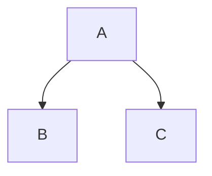

# GFM Reference

Quick reference for the GitHub Flavored Markdown syntax the editor parses and renders. Section 1 covers standard CommonMark features, Section 2 covers GFM-specific extensions, Section 3 covers features widely seen on GitHub.com but outside the formal GFM specification. Sections 1 and 2 are the v1.0 scope; Section 3 is planned as plugins on the plugin-authoring API.

<!-- Examples demonstrating alternative syntaxes use `text` fences on purpose:
     prettier formats `markdown`-tagged fences as markdown and normalizes away
     the very variants being shown (emphasis markers, ***/___ breaks, setext
     underlines, trailing-space hard breaks). Do not retag them. -->

### 1. Standard Markdown Essentials (Included in GFM)

These are the core CommonMark features that GFM fully supports and builds upon.

**Headings:**

```markdown
# H1 (Title)

## H2

### H3
```

**Paragraphs:**

```markdown
This is one paragraph.

This is a second paragraph.
```

**Emphasis:**

```text
*Italic* or _Italic_
**Bold** or __Bold__
***Bold and Italic***
```

**Lists:**

```markdown
- Unordered item 1
- Unordered item 2
  - Nested item (indent with 2 spaces)

1. Ordered item 1
2. Ordered item 2
```

**Links and Images:**

```markdown
[Link Text](https://example.com)

```

**Blockquotes:**

```markdown
> This is a blockquote.
> It can span multiple lines.
```

**Inline Code:**

```markdown
Use single backticks for `inline code` or commands.
```

**Fenced Code Blocks:**

````markdown
```javascript
function helloWorld() {
	console.log('Hello!');
}
```
````

Tilde fences (`~~~`) are equivalent — useful when the snippet itself contains backticks.

**Reference-Style Links and Images:**

```markdown
Here is a [link to Google][google-ref] and another to [GitHub][github-ref].

[google-ref]: https://google.com 'Google Search'
[github-ref]: https://github.com
```

**Autolinks (Angle Brackets):**

```markdown
Visit <https://example.com> or write to <mailto:user@example.com>.
```

Per CommonMark §6.8, an absolute URI in angle brackets — any valid scheme — becomes a link without `[text](url)` syntax. (GFM's bare-URL autolinks — no brackets — are the Section 2 extension.)

**Hard Line Breaks:**

```markdown
This is line one.\
This is line two directly below it.
```

**Thematic Breaks (Horizontal Rules):**

```text
---
***
___
```

**Indented Code Blocks:**

```markdown
    // Four spaces (or one tab) makes a code block
    function hello() {
        return "world";
    }
```

Note: Indented code blocks cannot interrupt a paragraph — there must be a blank line before them. Fenced code blocks (` ``` `) are generally preferred.

**HTML Blocks:**

```markdown
<div class="warning">
  <p>This is raw HTML embedded in markdown.</p>
</div>
```

CommonMark defines 7 types of HTML blocks based on opening tags. Block-level tags like `<div>`, `<table>`, `<pre>`, `<script>`, and HTML comments (`<!-- -->`) start HTML blocks. They continue until a blank line (for most types) or until their specific closing tag (for `<pre>`, `<script>`, `<style>`, `<textarea>`, and comments).

**Inline Raw HTML:**

```markdown
This paragraph contains <span class="hl">inline tags</span> and a <br /> hard break.
HTML comments like <!-- ignored --> and processing instructions <?php ?> are also recognized.
```

Per CommonMark §6.6, six tag forms are recognized inside paragraphs and pass through to rendered output: open tags, close tags, comments, processing instructions, declarations, and CDATA sections. The GFM extension in Section 2 (Disallowed Raw HTML) escapes a small dangerous subset as literal text.

**Soft Line Breaks vs Hard Line Breaks:**

A regular newline within a paragraph is a "soft line break" — it is rendered as a space, not a visible line break:

```markdown
These two lines
become one paragraph.
```

A "hard line break" forces a visible `<br>`. There are two ways — a trailing backslash, or two trailing spaces:

```text
Trailing backslash:\
Next line.
```

The two-trailing-spaces variant works identically but cannot be shown faithfully here: formatters (including this repo's) strip trailing whitespace — which is exactly why the visible backslash form is preferred.

**Setext Headings:**

```text
Heading Level 1
===============

Heading Level 2
---------------
```

**Escaping Characters:**

```markdown
I literally want to type \*these asterisks\* without making the text italic.
```

**Entity & Character References:**

```markdown
Named: &nbsp; &copy; &mdash;
Decimal: &#35; &#1234;
Hexadecimal: &#x22; &#xE9;
```

Per CommonMark §6.2, the full HTML5 named entity set plus decimal (`&#NNN;`) and hexadecimal (`&#xNNNN;`) numeric references are recognized in inline content. Recognized at the `&` dispatch of the single-pass inline scanner, alongside backslash escapes at `\` — neither can pair as a delimiter or leak into link syntax.

---

### 2. Standard GFM Extensions

These are the formal extensions that distinguish GFM from plain CommonMark.

- **Task Lists:** Create interactive checkboxes.

```markdown
- [x] Completed task
- [ ] Incomplete task
```

- **Tables:** Organize data with columns and rows. Use colons to align text.

```markdown
| Left-aligned | Center-aligned | Right-aligned |
| :----------- | :------------: | ------------: |
| Row 1        |      Data      |          $100 |
| Row 2        |      Data      |          $200 |
```

- **Strikethrough:** Cross out text using tildes. A run of one or two tildes delimits (`~single~` and `~~double~~` both strike, matching cmark-gfm), while a run of three or more stays literal, and mixed-length runs never pair (a one-tilde opener does not close a two-tilde run).

```markdown
~~This text is crossed out~~
~Also crossed out~
```

- **Autolinks (§6.9):** Bare URLs and email addresses turn into links without angle brackets `< >` or `[text](url)` syntax.

```markdown
Visit https://github.com or www.github.com
Contact support@example.com
```

Recognition follows the GFM extension rules. These are what the editor's autolink pass enforces:

- **`www.` scheme insertion.** A `www.` URL carries no scheme, so `http` is inserted for the link target while the visible text stays verbatim — `www.example.com` links to `http://www.example.com`. (`http`/`https` URLs keep their own scheme; emails prepend `mailto:`.)
- **Valid domain.** The domain is dot-separated segments of letters, digits, `_`, and `-`, with at least one dot. A bare `www.`, or a host with no dot, does not autolink.
- **Leading boundary.** A bare autolink begins only at the start of the region or after whitespace or one of `*`, `_`, `~`, `(` — so `xhttps://x` and `a/foo@bar.com` stay literal.
- **Trailing punctuation.** A trailing `?`, `!`, `.`, `,`, `:`, `*`, `_`, or `~` is left out of the link (`visit https://example.com.` keeps the period as text). A trailing `)` is excluded only when the URL holds more `)` than `(`, so a wiki link like `…/Foo_(bar)` keeps its parenthesis.
- **Entity-shaped tail.** A trailing `;` stays in the URL unless it ends in something shaped like an entity reference — `&`, then one or more alphanumerics, then `;` — in which case the whole `&…;` is excluded: `www.google.com/search?q=commonmark&hl;` links only `…?q=commonmark`.

- **Disallowed Raw HTML:** Some raw HTML tags are treated as literal text rather than HTML. This is a specific GFM extension and is separate from GitHub's broader HTML sanitization rules.

---

### 3. GitHub.com Markdown Features

These are commonly supported on GitHub, but they are platform features rather than part of the official GFM specification.

- **Alerts (Admonitions):** Add distinctive styling to blockquotes to emphasize critical information. There are five supported types.

```markdown
> [!NOTE]
> Highlights information that users should take into account, even when skimming.

> [!TIP]
> Optional information to help a user be more successful.

> [!IMPORTANT]
> Crucial information necessary for users to succeed.

> [!WARNING]
> Critical content demanding immediate user attention due to potential risks.

> [!CAUTION]
> Negative potential consequences of an action.
```

- **Mathematical Expressions:** GitHub supports LaTeX-style math in some Markdown contexts.

```markdown
Inline math uses a single dollar sign:
$e^{i\pi} + 1 = 0$

Block math uses double dollar signs:

$$
\left( \sum_{k=1}^n a_k b_k \right)^2 \leq \left( \sum_{k=1}^n a_k^2 \right) \left( \sum_{k=1}^n b_k^2 \right)
$$
```

Block math also has a third form: a fenced code block whose info string's first token is `math`.

````markdown
```math
x^2 + y^2 = z^2
```
````

The editor's inline `$…$` recognizer is digit-guarded on the opener: a `$` immediately followed by a digit stays currency, so `$5` and `$5 and $10` render as literal text rather than math. This is a deliberate divergence. The close is not digit-guarded, so `$x^2$` still closes on its `2`.

- **Mermaid Diagrams:** Fenced code blocks with the `mermaid` language identifier render as diagrams.

````markdown

````

- **Footnotes:** GitHub supports clickable, numbered references at the bottom of a document.

```markdown
Here is a sentence that needs a citation[^1].

[^1]: This is the referenced footnote at the bottom of the page.
```

- **GitHub-Specific Autolinks:** GitHub automatically parses and links platform-specific references without extra markdown syntax.

```markdown
Mention a user or team: @username or @org/team
Reference an issue or Pull Request: #123
Reference a specific commit: a1b2c3d4e5f6 (typing the SHA automatically links it)
```

- **Collapsible Sections (HTML):** While technically HTML, this is commonly used on GitHub to keep long issue descriptions or PRs tidy. _(Note: You must leave a blank line after the `<summary>` tag for the nested Markdown to render correctly.)_

```html
<details>
	<summary>Click to expand</summary>

	This content is hidden by default. Standard **Markdown** works here!
</details>
```

- **Emoji Shortcodes:** GitHub parses standard emoji shortcodes wrapped in colons.

```markdown
I am feeling :smile: and :tada: today!
```

- **Relative Links:** Standard Markdown link destinations can already be relative, but GitHub resolves them naturally within a repository's file structure.

```markdown
[View the logo](../assets/logo.png)
```

- **Syntax Highlighting Aliases:** While you mentioned Fenced Code Blocks, it's worth noting that GFM relies on Linguist for syntax highlighting, which means it accepts hundreds of language identifiers and aliases.

```text
(e.g., using `js` or `javascript`, `py` or `python`, `sh` or `bash`)
```
