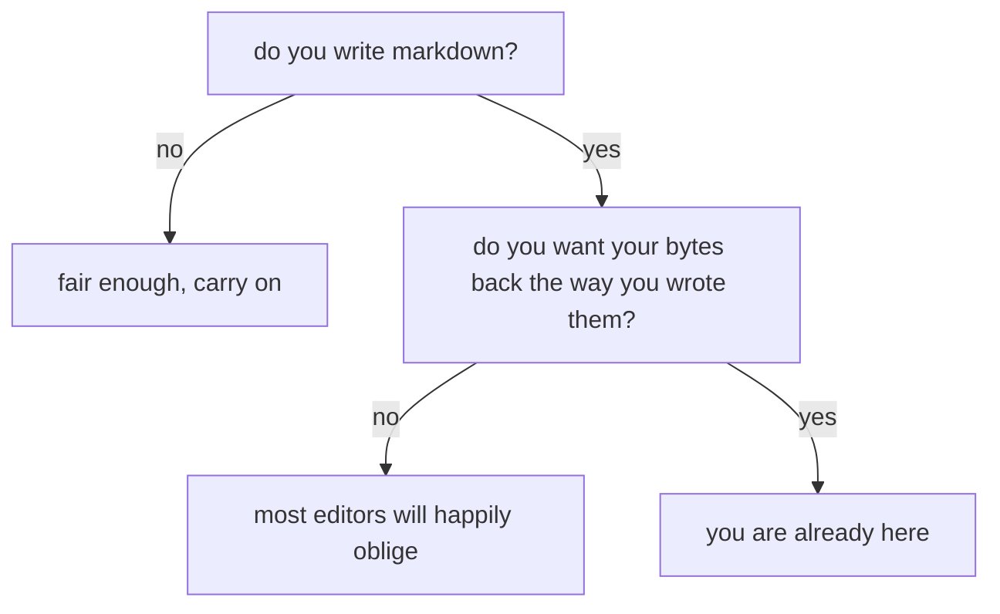

# aragonite

Hi. This page is the editor and this document is live, so click anywhere and type; nothing here is precious. Whatever you type goes back out as the same Markdown file it came from, `serialize(parse(source)) === source` and all that. The readme says it more times than it needed to, so once here and we move on.

[[toc]]

That outline is a plugin, and also just a block. Click an entry to jump to its section; click the outline itself and you're editing the `[[toc]]` line that makes it.

## Prose you already know how to write

The syntax stays visible, just dimmed, so **bold**, *italic*, ~~strikethrough~~ and `inline code` never hide where they start (put your caret inside one and watch the markers). Links work inline, like [the repository](https://github.com/voithos-labs/aragonite), and by reference, like [the docs][repo-docs], whose definition sits at the very bottom of this page, where reference definitions go to be forgotten.

Now click into a word, say banana, and every banana on this page lights up. There are exactly four: banana, banana, and the two you just read. The highlight is a decoration, painted over the document and never written into it, so the file stays exactly as silly as I left it.

Blocks, mostly invisible
------------------------

Everything on this page is a block, and almost none of it looks like one. No cards, no outlines, no gutter furniture (flip **handles** in the header if you want grips; they show on hover and otherwise stay out of the way). Also, that heading is spelled with an underline instead of a `##`. Same heading, different bytes. I only know it's called Setext because I had to write the parser for it.

> Quotes nest.
>
> > Into other quotes.
> >
> > > And further, if that's your thing (i dunno, some people are freaky like that).

### Lists, and a to-do list I'm not proud of

1. Ordered lists renumber themselves when you split them. Press `Enter` in the middle of this item and watch.
2. Unordered lists have nothing to renumber, and honestly, good for them.

- [x] write an editor
- [x] make it lossless
- [ ] write the docs for it
- [ ] stop adding plugins
- [ ] sleep

Click a box, or type the `x` in yourself. Same byte either way.

#### Nesting goes as deep as you care to indent

- One level
  - Two levels
    - Three levels, which is where I'd stop if I were sensible
      - Four levels. So, no.

A list this size just renders. One with a few thousand items windows its own children, meaning only the ones on screen get mounted, and yes, the test suite builds one.

## Tables, one cell at a time

Each cell is its own little editing surface. `Tab` hops to the next cell and `Enter` drops to the row below (try it). One heads-up: the first time you edit inside a table, its padding and delimiter row get tidied to the standard spelling. That's about the only time the editor writes a byte you didn't.

| what you write         | what happens to it            |    round-trips     |
| :--------------------- | :---------------------------- | :----------------: |
| syntax it knows        | becomes a styled block        | :white_check_mark: |
| syntax a plugin claims | the plugin takes it from here | :white_check_mark: |
| syntax nobody claims   | stays plain text, untouched   | :white_check_mark: |
| my typos               | kept, faithfully, forever     | :white_check_mark: |

## Code, fenced or indented

A fence highlights by language; this one's `js`:

```js
function remainingBugs() {
	return 0; // famous last words
}
```

The four-space form still parses, for every README written before fences were a thing:

    const indented = true; // no language, no highlighting, no shame

## Math

Inline math sits inside a sentence, like $a^2 + b^2 = c^2$, which I'm told is a famous one. Display math gets its own block; click it to edit the source:

$$
\int_0^1 x^2 \, dx = \frac{1}{3}
$$

GitHub's `math` fence is the same display spelled as a fence, for people who like their math fenced in:

```math
e^{i\pi} + 1 = 0
```

## Diagrams

A `mermaid` fence renders as a diagram. Double-click it to get the source back, and feel free to edit the flowchart if you disagree with it:



## Callouts

:::note
A `:::name` block belongs to a plugin, not the parser. What's inside is ordinary **Markdown**, so edit away.
:::

:::tip Give it a title
The title rides along on the opener line. This one is called "Give it a title", which is a title, so I've technically followed my own advice.
:::

GitHub's alert syntax renders as a callout too:

> [!IMPORTANT]
> Nothing rewrote this into a `:::`. In the file it's still a blockquote wearing a hat.

## Things that fold

<details>
<summary>Nothing in here, don't open</summary>

I said don't. Anyway, a details block holds real Markdown in real blocks, so this list is as editable as everything else:

- the fold is prob the only bit of HTML most people ever type into Markdown, so it had better work
- the parrot is in the next section, keep scrolling

</details>

## A parrot

The plugin guide's first exercise is a party parrot, so naturally the party parrot is now a bundled plugin. Click into it and change the words after `%%parrot`; the caption follows.

%%parrot the plugin platform, working as intended

## Whatever else you paste

<div class="unclaimed">
	Raw HTML nobody claims is left exactly as you wrote it.
</div>

So is syntax from a plugin you uninstalled last week[^plugins]. Images are just images:


## Emoji :sparkles:

Shortcodes render as glyphs while the `:name:` bytes stay in the file, in prose :rocket:, in headings (see above), and in table cells (see the table). There's a :parrot: shortcode as well, which is not the same parrot, but I appreciate the commitment.

---

That's the tour. All of it is editable, `Ctrl+F` searches it, **under the hood** in the header shows the syntax tree behind it, and the mode buttons next to it take this same document from raw to rendered. `Ctrl+Z` is right there when you need it.

[repo-docs]: https://github.com/voithos-labs/aragonite/tree/main/docs

[^plugins]: Footnotes are a plugin as well. The number up there picks itself (first appearance wins), and this definition is an ordinary block, so yes, you can edit it. And yes, I put a footnote in a demo. I have a problem.
