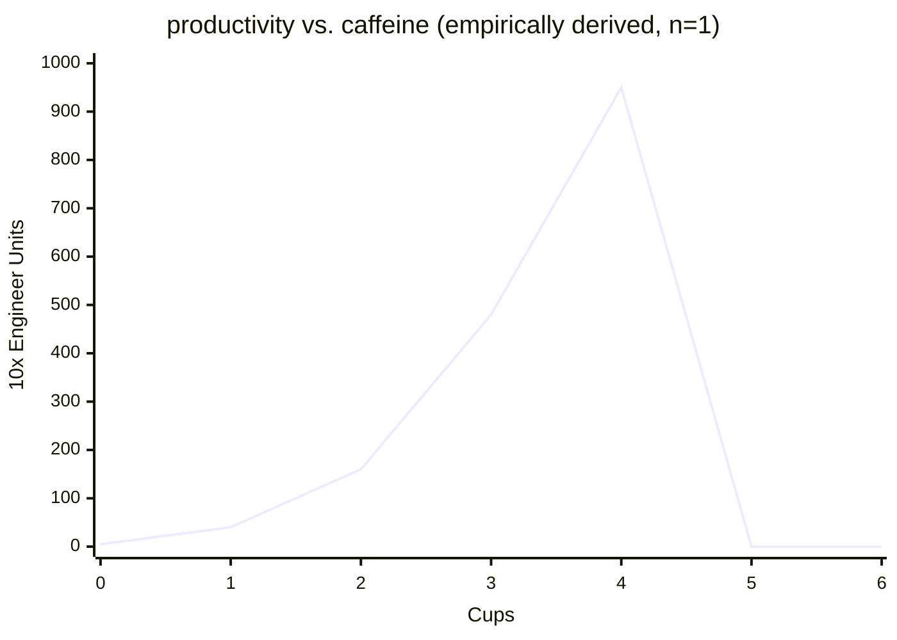

# aragonite
Hello. Here's a birb.

%%parrot Dancing is what to do. Dancing's when I think of you. Dancing's what clears my soul. Dancing's what makes me whole.


Hmmm still have to demo. One sec.

[[toc]]


## roadmap

- [x] write an editor
- [x] open source it
- [ ] one ton slab of stone


## hope your road is a long one

> Ithaka
> By C. P. Cavafy
> > As you set out for Ithaka
> > hope your road is a long one,
> > full of adventure, full of discovery.
> > Laistrygonians, Cyclops,
> > angry Poseidon — don’t be afraid of them:
> > you’ll never find things like that on your way
> > as long as you keep your thoughts raised high,
> > as long as a rare excitement
> > stirs your spirit and your body.
> > Laistrygonians, Cyclops,
> > wild Poseidon — you won’t encounter them
> > unless you bring them along inside your soul,
> > unless your soul sets them up in front of you.
>
> 
> > Hope your road is a long one.
> > May there be many summer mornings when,
> > with what pleasure, what joy,
> > you enter harbors you’re seeing for the first time;
> > may you stop at Phoenician trading stations
> > to buy fine things,
> > mother of pearl and coral, amber and ebony,
> > sensual perfume of every kind—
> > as many sensual perfumes as you can;
> > and may you visit many Egyptian cities
> > to learn and go on learning from their scholars.
>
> 
> > Keep Ithaka always in your mind.
> > Arriving there is what you’re destined for.
> > But don’t hurry the journey at all.
> > Better if it lasts for years,
> > so you’re old by the time you reach the island,
> > wealthy with all you’ve gained on the way,
> > not expecting Ithaka to make you rich.
>
> 
> > Ithaka gave you the marvelous journey.
> > Without her you wouldn't have set out.
> > She has nothing left to give you now.
>
> 
> > And if you find her poor, Ithaka won’t have fooled you.
> > Wise as you will have become, so full of experience,
> > you’ll have understood by then what these Ithakas mean.


## what is?
who **am** i, *where* do i come from, and where am ~~i~~ going? `system reboot`. `searching...` 

[the answer?](https://youtu.be/dQw4w9WgXcQ?si=naj07y-yv6X9rq4m)


## DOES THE INERTIA OF A BODY DEPEND UPON ITS ENERGY-CONTENT?

**By A. EINSTEIN**

*September 27, 1905*


The results of the previous investigation lead to a very interesting conclusion, which is here to be deduced.


I based that investigation on the Maxwell-Hertz equations for empty space, together with the Maxwellian expression for the electromagnetic energy of space, and in addition the principle that:—


> *The laws by which the states of physical systems alter are independent of the alternative, to which of two systems of coordinates, in uniform motion of parallel translation relatively to each other, these alterations of state are referred (principle of relativity).*


With these principles[^1] as my basis I deduced *inter alia* the following result (§ 8):—


Let a system of plane waves of light, referred to the system of co-ordinates $(x, y, z)$, possess the energy $l$; let the direction of the ray (the wave-normal) make an angle $\varphi$ with the axis of $x$ of the system. If we introduce a new system of co-ordinates $(\xi, \eta, \zeta)$ moving in uniform parallel translation with respect to the system $(x, y, z)$, and having its origin of co-ordinates in motion along the axis of $x$ with the velocity $v$, then this quantity of light—measured in the system $(\xi, \eta, \zeta)$—possesses the energy

$$l^{*} = l\,\frac{1 - \dfrac{v}{c}\cos\varphi}{\sqrt{1 - v^{2}/c^{2}}}$$

where $c$ denotes the velocity of light. We shall make use of this result in what follows.


Let there be a stationary body in the system $(x, y, z)$, and let its energy—referred to the system $(x, y, z)$ be $E_0$. Let the energy of the body relative to the system $(\xi, \eta, \zeta)$ moving as above with the velocity $v$, be $H_0$.


Let this body send out, in a direction making an angle $\varphi$ with the axis of $x$, plane waves of light, of energy $\tfrac{1}{2}L$ measured relatively to $(x, y, z)$, and simultaneously an equal quantity of light in the opposite direction. Meanwhile the body remains at rest with respect to the system $(x, y, z)$. The principle of energy must apply to this process, and in fact (by the principle of relativity) with respect to both systems of co-ordinates. If we call the energy of the body after the emission of light $E_1$ or $H_1$ respectively, measured relatively to the system $(x, y, z)$ or $(\xi, \eta, \zeta)$ respectively, then by employing the relation given above we obtain

$$E_0 = E_1 + \tfrac{1}{2}L + \tfrac{1}{2}L,$$

$$
H_0 = H_1
+ \frac{1}{2}L\,\frac{1 - \dfrac{v}{c}\cos\varphi}{\sqrt{1 - v^{2}/c^{2}}}
+ \frac{1}{2}L\,\frac{1 + \dfrac{v}{c}\cos\varphi}{\sqrt{1 - v^{2}/c^{2}}}
= H_1 + \frac{L}{\sqrt{1 - v^{2}/c^{2}}}.
$$

By subtraction we obtain from these equations

$$H_0 - E_0 - (H_1 - E_1) = L\left(\frac{1}{\sqrt{1 - v^{2}/c^{2}}} - 1\right).$$

The two differences of the form $H - E$ occurring in this expression have simple physical significations. $H$ and $E$ are energy values of the same body referred to two systems of co-ordinates which are in motion relatively to each other, the body being at rest in one of the two systems (system $(x, y, z)$). Thus it is clear that the difference $H - E$ can differ from the kinetic energy $K$ of the body, with respect to the other system $(\xi, \eta, \zeta)$, only by an additive constant $C$, which depends on the choice of the arbitrary additive constants of the energies $H$ and $E$. Thus we may place

$$H_0 - E_0 = K_0 + C,$$
$$H_1 - E_1 = K_1 + C,$$

since $C$ does not change during the emission of light. So we have

$$K_0 - K_1 = L\left(\frac{1}{\sqrt{1 - v^{2}/c^{2}}} - 1\right).$$

The kinetic energy of the body with respect to $(\xi, \eta, \zeta)$ diminishes as a result of the emission of light, and the amount of diminution is independent of the properties of the body. Moreover, the difference $K_0 - K_1$, like the kinetic energy of the electron (§ 10), depends on the velocity.


Neglecting magnitudes of fourth and higher orders we may place

$$K_0 - K_1 = \frac{1}{2}\frac{L}{c^{2}}v^{2}.$$

From this equation it directly follows that:—


If a body gives off the energy $L$ in the form of radiation, its mass diminishes by $L/c^{2}$. The fact that the energy withdrawn from the body becomes energy of radiation evidently makes no difference, so that we are led to the more general conclusion that


> *The mass of a body is a measure of its energy-content; if the energy changes by $L$, the mass changes in the same sense by $L/9 \times 10^{20}$, the energy being measured in ergs, and the mass in grammes.*


It is not impossible that with bodies whose energy-content is variable to a high degree (e.g. with radium salts) the theory may be successfully put to the test.


If the theory corresponds to the facts, radiation conveys inertia between the emitting and absorbing bodies.


---


[^1]: The principle of the constancy of the velocity of light is of course contained in Maxwell's equations.


## Human Transmutation


> There was once a hero who flew too close to the sun.
> His wings of wax fell apart and he plummeted to the earth...


| Ingredient | Amount |
|---|---|
| Water | 35 L |
| Carbon | 20 kg |
| Ammonia | 4 L |
| Lime | 1.5 kg |
| Phosphorus | 800 g |
| Salt | 250 g |
| Saltpeter | 100 g |
| Sulfur | 80 g |
| Fluorine | 7.5 g |
| Iron | 5 g |
| Silicon | 3 g |
| Fifteen further trace elements | small quantities |


35 liters of water, 20 kilograms of carbon, 4 liters of ammonia, 1.5 kilograms of lime, 800 grams of phosphorous, 250 grams of salt, 100 grams of saltpeter, 80 grams of sulfur, 7.5 grams of fluorine, 5 grams of iron, 3 grams of silicon, and a little bit of 15 other elements... These would be the calculated components that make up the body of a single adult.


---

<details>
<summary>Let's bring her back.</summary>


</details>

---


## fast inverse square root
```rust
/// an approximation of 1/sqrt(x)
fn fast_inv_sqrt(x: f32) -> f32 {
    let i = x.to_bits();
    let i = 0x5f3759df - (i >> 1);
    let y = f32::from_bits(i);
    y * (1.5 - 0.5 * x * y * y)
}
```


### the bit pattern is a logarithm...?
An IEEE-754 single stores a biased exponent and a mantissa in adjacent fields. Read the whole 32 bits as an unsigned integer and the exponent field supplies the integer part of $\log_2 x$ while the mantissa field linearly interpolates the fractional part. That interpolation is wrong - a straight line where a logarithm curves - but wrong smoothly, and within a bounded margin.


Once you accept you're holding a logarithm, the rest reads normally. The inverse square root is $-\tfrac{1}{2}\log_2 x$, so the shift halves and the subtraction negates. The constant absorbs both the exponent bias and the accumulated error of the linear-interpolation lie.

:::note
Nothing in the source signals that a logarithm is involved. The logarithm is a side effect of how the bits happen to be laid out, which is exactly why the function is unreadable without knowing the layout.
:::


### The constant
`0x5f3759df` is not the value you get by deriving the bias correction on paper. It is tuned so that the *entire* pipeline, approximation plus refinement, has minimal worst-case error. Its authorship was murky for years; it surfaced publicly when the Quake III Arena source was released, and traces back before that through Silicon Graphics.


Chris Lomont later ran the search properly and published `0x5f375a86`.

| Variant | Max relative error |
|---|---|
| Bit trick alone, no refinement | 3.44% |
| One Newton step | 0.175% |
| One Newton step, Lomont's constant | 0.175% |


:::tip Measure before you swap constants
Lomont's value is better, by about one part in $10^5$. Over the range tested, both round to the same three significant figures. If you are choosing between them on anything other than curiosity, the answer is that it does not matter.
:::


### refinement

The last line is one iteration of Newton-Raphson on

$$f(y) = \frac{1}{y^{2}} - x,$$

whose update rule is $y \leftarrow y(1.5 - 0.5xy^{2})$. That specific formulation is the point: it needs two multiplications and a subtraction and **no division**, which is what makes it cheaper than the operation it is approximating. Adding a second iteration costs one more line and buys roughly three more decimal digits. 


## Punishing Evil
> [!WARNING]
> :crescent_moon:In the name of the Moon, I'll punish you!:punch:


1. Fighting evil by moonlight:full_moon:, 
2. winning :two_hearts:love by :sunny:daylight, 
3. never running from a real fight:muscle:, 
4. she is the one named Sailor Moon! :dizzy::dizzy::dizzy::sparkles:


## on the relationship between productivity and coffee
